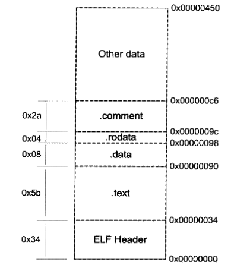

# 链接，装载与库

## 编译与链接

集成开发环境（IDE）一般将编译和链接的过程一步完成，通常将这种编译和链接合并一起的过程称为构建（build）

当使用GCC来编译C程序时，可以分解为四个步骤，分别是预编译，编译，汇编和链接

### 预编译

```sh
gcc -E hello.c -o hello.i
```

其中“-E”代表只进行预编译。预编译过程主要处理源代码中以“#”开始的预编译指令，如“#include”，“#define”等

主要处理的规则如下：

​	1.将所有的"#define"删除，并且展开所有的宏定义。

​	2.处理所有条件预编译指令，如“#if”，“#ifdef”，“#elif”，“#else”，“#endif”。

​	3.处理“#include”预编译指令，将被包含的文件插入到该预编译指令的位置。这个过程是递归进行的，也就是说被包含的文件可能还包含其他文件。

​	4.删除所有的注释，包括“//”和"/* */"。

​	5.添加行号和文件名标识，以便于编译时编译器产生调试时的行号信息，同时用于编译出现错误和警告时显示行号。

​	6.保留所有的#pragma编译器指令，因为编译器需要使用它们。

预编译后的“.i”文件不包含任何宏定义，同时包含的文件已经插入到.i文件中。

### 编译

```sh
gcc -S hello.i -o hello.s
```

编译过程就是把预处理完的文件进行词法，语法分析，语义分析及优化后生产相应的汇编代码文件

### 汇编

```sh
gcc -c hello.s -o hello.o
# 还可以直接从C源代码文件到目标文件
gcc -c hello.c -o hello.o
```

汇编是使用汇编器将汇编代码转变为机器可以执行的命令，每一条汇编语句几乎都对应一条机器指令。所以汇编器的汇编过程相对于编译器中比较简单，只需一一翻译而不需要指令优化

### 链接

链接过程是将一些文件与.o文件链接起来，得到最终的.out可执行文件，通常需要使用**链接器**

#### 链接器

重新计算目标的地址过程被称为“重定位”。这种重定位指的是最早机器指令的修改一定会导致修改位置及之后的指令需要重新计算地址。

在C/C++的环境中，人们为了解决单一文件代码量过大的问题，将源代码模块独立编译，然后“组装”，这种过程就是链接。从核心上来说，“链接”和之前人们最早期做的“重定位”工作没有太大的区别。它的核心就在于把一些指令对其他符号地址的引用加以修正。

链接过程主要包括：空间与地址分配，符号决议和重定位等步骤。

例如，当我们在程序模块main.c中需要使用另一个模块fun.c中的函数foo()，由于每个模块单独编译，因此main.c在编译的时候并不知道foo函数的地址，所以将这些调用foo指令的目标地址搁置，最终在链接的时候由链接器将这些指令的目标地址修正。

链接器在链接的时候，会根据你所引用的符号，自动去相应的模块中查找并将main.c模块中所引用的foo指令重新修正。


## 编译的具体步骤

编译过程一般可以分成6步：扫描，语法分析，语义分析，源代码优化，代码生成和目标代码优化

### 扫描与词法分析

源代码首先被输入到扫描器，扫描器简单进行词法分析，将源代码的字符序列分割成一系列的记号。

词法分析产生的记号一般分为如下几类：关键字，标识符，字面量（包含数字，字符串等）和特殊符号（加号，等号等）。在识别记号的同时，扫描器还会将标识符存放到到符号表，将数字，字符串存放到文字表等，以备后面的步骤使用。

这部分并不处理宏替换和文件包含等工作，会交给一个独立的预处理器。

### 语法分析

语法分析器将对由扫描器产生的记号进行语法分析，从而产生语法树。整个分析过程采用了上下文无关语法（CFG，是一种NLP方法，它包含一组产生式，这些产生式规定了一个符号序列替换为另一个符号序列，这里的符号既可以是终结符（语言中的基本单元，如字母，数字），也可以是非终结符（代表语言中的语法结构，如语句、表达式））的分析手段。

语法树就是以表达式为节点的数，树本身会规定优先级（例如乘法比加法优先级高等），如果出现了表达式错误的情况，在这一步就会报错。

### 语义分析

语义分析器完成这一步骤，语法分析仅仅只是完成对表达式语法层面的分析，而不具体了解语法是否真正有意义。例如**指针与指针做乘法运算无意义，但语法上是合法的**。编译器做语义分析所能分析的语义都是**静态语义**，静态语义就是值在编译期可以确定的语义。与之相对的是**动态语义**，动态语义值只能在运行期确认的语义。

静态语义通常包含声明和类型的匹配，还包含着一些隐式的转换，最后分析的结果会一并加载在语法树中。

### 中间语言生成

一些简单的，在编译期能确定的值会在这个时候计算并确定（例如简单的加法等）

这种优化直接在语法树上较难实现，因此编译器会首先将语法树转换为中间代码，它是语法树的顺序表示。

中间代码使得编译器可以被分为前端和后端，前端负责产生机器无关的中间代码，后端将中间代码转换成目标机器代码。

### 目标代码生成和优化

编译器后端主要包括代码生成器和目标代码优化器。其中，代码生成器将中间代码转换成目标机器代码，该过程依赖目标机器的类型；最后优化器会将目标代码进行优化。


## 目标文件的内容

程序源代码编译后的机器指令放在代码段中，代码段常见的后缀是“.code”或“.text”；

已初始化的全局变量和局部静态变量数据被放在数据段，后缀为“.data”；

未初始化的全局变量和局部静态变量一般放在“.bss”段中。未初始化的全局变量和局部静态变量的默认值都为0，本来也是可以放在“.data”段中的，但因为他们的数据都是0，所以没有必要在“.data”段内进行存放。实质上，“.bss”段只是为这些未初始化的全局变量和局部静态变量预留位置，它并没有内容，所以在文件中不占据空间。

### 为什么将数据段和代码段分开

主要有三个原因：

1.数据和指令在装载时会被映射到两个虚拟内存区域，并且对于进程来说操作这两个段的权限不同。数据区域是可读写的，而指令区域是只读的。这样可以防止程序指令有意或无意的改写。

2.为了提高CPU缓存的命中率，数据缓存和指令缓存往往需要分离，数据段和代码段的分开提高了程序的局部性

3.当系统中运行多个该程序的副本时，内存只需要保存一份指令部分，同理对于只读数据也是一样，这就是内存共享的概念。每个进程的数据私有的，但其他东西都可以共享，特别是在动态链接时，可以大大减少内存。

### ELF可执行文件结构



#### .rodata段

只读数据段，存放的是程序里的只读变量（如const修饰的变量）和字符串常量。单独设置“.rodata”段的好处如下：

​	1.在语义上支持了C++的const关键字，而且操作系统在加载的时候会直接将“.rodata”段的属性映射为只读，这样对于这个段的任何修改操作都被视为非法处理，保证了程序的安全性。

​	2.另外再某些嵌入式平台下，有些存储区域采用只读存储器，例如ROM，将“.rodata”段放在该存储区域中可以保证程序访问存储器的正确性。

注意，有时候编译器会把字符串常量放在“.data”段，而不是放在“.rodata”段，设计到CPU字节序的问题，也就是大端排序。（低字节存放在内存的高位地址）

.comment：注释信息段


## 链接的接口——符号

在链接中，函数和变量被统称为符号，而函数名和变量名被称为符号名。

链接过程基于符号才能够正确完成，每一个目标文件都会有一个相应的符号表，这个表里记录了目标文件中所用到的所有符号。每个定义的符号都有一个对应的值叫做符号值，对于函数和变量来说，符号值就是他们的地址。除了函数和变量之外，还有一些其他的符号，但它们一定是下面这些类型的符号中的一种：

​	1.定义在本目标文件的全局符号，可以被其他目标文件引用。

​	2.本目标文件中引用的全局符号，但没有定义在本目标文件，例如“printf”函数这种简单的函数。

​	3.段名，这种符号往往由编译器产生，它的值就是该段的起始地址。

​	4.局部符号，这类符号只能在编译单元内部可见，这些局部符号对于链接过程没有太大作用。

​	5.行号信息，目标文件与源代码中行的对应关系，可选。

一般来说，链接过程只关心全局符号（1,2类），其他局部符号对其他目标文件而言都是“不可见的”，因此链接过程中也无关紧要。

### 名称修饰和函数签名

函数签名：包含了一个函数的所有信息，包括函数名，参数类型，它所在的类的名称空间和其他信息。

C++支持函数重载和不同名称空间下的函数重名，也就是说，这些情况下同名函数的函数签名不同。

在编译器和链接器处理符号时，它们使用名称修饰的方法，使得每个函数签名对应一个修饰后名称。

由于不同的编译器采用不同的名称修饰方法，必然导致由不同编译器编译产生的目标文件无法正常相互链接。

### extern “C”

C++为了与C兼容，在符号的管理上，C++有一个用来声明或定义一个C符号的关键语法extern "C" { ... }

C++编译器会将extern "C"的大括号内部的代码当做C代码处理。此时C++的名称修饰机制不会起作用。

### 弱引用和强引用

符号需要被正确决议才能最终链接成可执行文件，如果没有找到该符号的定义，链接器就会报符号未定义错误，这种被称为强引用。

与之相对的还有一种弱引用，相比较强引用，链接器不会对弱引用的符号没有找到定义报错，而是会给一个默认的值。

弱符号和弱引用对库十分有用，比如库中定义的弱符号可以被用户定义的强符号所覆盖，从而使得程序可以使用自定义版本的库函数。或者是即便去掉某些功能模块，程序也可以正常链接，只是缺少相应的功能。


## 静态链接

链接完成的可执行文件的代码段和数据段都是由输入的目标文件合并而来，如何分配空间并组合就是第一个问题。

这里的空间分配只关注于虚拟地址的分配，因为这个关系到最终的地址计算。

现在的链接器的空间分配策略一般被称之为两步链接，也就是过程分成两步：

​	1.空间与地址分配：扫描所有的输入目标文件，并且获得它们各个段的长度，属性和位置，并且将输入目标文件中的符号表的所有符号定义和引用收集起来，放到一个全局符号表中。这一步，链接器可以获得所有输入目标文件的段长度，并且将他们合并，计算输出文件中各个段合并后的长度和位置，建立映射关系。

​	2.符号解析与重定位：使用上一步收集的所有信息，读取输入文件中段的数据，重定位信息，并且进行符号解析与重定位，调整代码中的地址等。

链接前后的程序中使用的地址都已经是进程中的虚拟地址，因此链接只关心各个段中的VMA和Size，而忽略文件偏移（File off）。

在链接之前，目标文件中的所有段的VMA都是0，因为虚拟空间还没有被分配，所以它们默认是0，等到链接之后，可执行文件中的各个段都被分配到了相应的虚拟地址。这里的分配指的是代码段和数据段的起始虚拟地址。

在这一步完成后，链接器开始计算各个符号的虚拟地址，因为各个符号在段内的地址已经是确定的，所以能分配到的虚拟地址也是确定的。只不过链接器需要给每个符号进行一定的偏移，以调整到正确的虚拟地址。

### 符号解析和重定位

重定位，其实就是将原来编译时的因为不知道函数地址的“假地址”替换为全局符号表中对应符号分配好的虚拟地址。

链接器又是如何知道哪些指令需要被调整呢？因为存在一个重定位表，专门保存与重定位相关的信息。

###  符号解析

链接器在扫描完所有输入目标文件后，所有的未定义符号都需要在全局符号表中找到，否则链接器会报符号未定义错误。

### C++的重复代码消除

C++编译器在很多时候会产生重复的代码，例如模版，外部内联函数和虚函数表都有可能在不同的编译单元中生成相同的代码。

以模版为例，当模版在一个编译单元被实例化时，它并不知道自己是否在别的单元也实例化了，因此如果一个模版在多个编译单元同时实例化成相同类型时，有一定会生成重复的代码，这种重复代码会导致以下问题：

1.空间浪费。

2.地址较易出错，因为两个指向同一个函数的指针可能不相同。

3.指令运行效率低，如果同一份指令有多份副本，那么指令Cache的命中率会比较低。

目前主流的编译器采用的方法是将每个模版的实例代码放在一个段里，每个段只包含一个模版实例。例如一个编译单元存在两个类型的模版实例，那么该编译单元的目标文件就包含这两个该模版实例的段。这样，当别的编译单元也实例化这两种类型的模版时，生成相同的段名称。最终在链接时链接器就能够进行相同名字的段进行合并和删除。

这种方法对于外部内联函数和虚函数表的做法也是类似的。例如对于一个有虚函数的类来说，有一个与之对应的虚函数表，编译器会在多个编译单元生成重复的虚函数表。而链接器会对同名的虚函数表段进行删除与合并。


## 动态链接

静态链接的缺陷：

1.静态链接极大的浪费了内存和磁盘的空间，对于每一个单独的程序而言，都需要自己独立运行和使用一个静态库。静态库内的文件也就有多个副本，造成空间的极大浪费。例如C语言静态库下的基本函数，如printf函数等。

2.静态链接对程序的更新和部署带来额外的麻烦，一但库中有任何模块存在更新，整个程序就要重新链接。

 解决空间浪费和更新困难的方式就是将程序的模块进行分割，形成独立的文件，而不是将他们静态链接到一起。更直接的来说，就是不对组成程序的目标文件进行链接，而是等到程序运行时才进行链接。把链接过程推迟到运行时再进行，这就是动态链接的思想。动态链接不仅解决的多个静态副本浪费磁盘和内存空间的问题，并且还减少了物理页面的换入换出，增加了缓存的命中率，因为不同进程间的数据和指令访问都集中在了同一个共享模块上。

动态链接方案也可以使得程序的升级变得更加容易，当要升级程序库或程序共享的某个模块时，理论上只要简单地将旧的目标文件覆盖即可。当程序下一次升级时，新版本的目标文件就会被自动装载到内存并且链接起来。

动态链接还有一个特点是程序在运行时可以动态地加载各种程序模块，这个优点就是人们制作程序的插件。

动态链接还可以加强程序的兼容性，从本质上来来说，动态链接库实现了在程序和操作系统之间增加一个中间层的任务，只要中间层的解释相同（例如函数使用的接口相同），那么程序就能在不同的操作系统上运行。

### 基本实现

动态链接涉及运行时的链接和多个文件的装载，必须要有操作系统的支持，因为动态链接的情况下，进程的虚拟地址空间的分布会比静态链接情况下更加复杂。

在Linux系统中，动态链接文件被称为动态共享对象，简称共享对象，它们一般都是以“.so”为扩展名的文件。

在Windows系统中，动态链接文件被称为动态链接库，它就是平常看到的以“.dll”为扩展名的文件。

从本质上来说，普通执行程序和动态链接库中都包含了指令和数据，它们都可以看做一个大的程序的其中一个模块。

动态链接会带来程序在性能上的一些损失，这是因为程序在每次被装载时（运行时）需要重新链接。但这是可以优化的，通过后面介绍的“延迟绑定”方法。

动态链接模块的装载具体地址是不确定的，而静态链接模块在需要装载时已经包含在可执行文件内。

### 延迟绑定（PLT）

动态链接慢的原因：

​	1.动态链接下对全局和静态的数据访问都需要复杂的定位和简介寻址。（并且还需要解决模块之间函数引用的符号查找和重定位）

​	2.动态链接的链接工作在工作运行时完成。

延迟绑定的核心是函数在第一次用到时才进行绑定，如果没有用到就不进行绑定。所以在程序开始执行时，模块间的函数调用都没有进行绑定，而是需要用到时才由动态链接器负责绑定，这样大大加快了程序的启动速度。

动态链接有自己的符号表，重定位以及额外的栈堆初始化信息


## 可执行文件的装载和进程

### 32位进程使用超过4GB的空间

如何在32位的CPU下让程序能够使用超过4GB的空间（这里的空间指的是物理内存空间）呢，可以从硬件上进行提升，并进行一定改进。

当硬件从32位地址线扩展到36位地址线时，实际可以访问的物理内存为64GB。这扩展的，大于常规的内存空间通过新的页映射方式进行使用。Intel把这种地址扩展方式叫做**PAE**。操作系统会提供一个窗口映射方法，把这些额外的内存映射到进程地址空间中。应用程序可以根据需要来选择申请和映射。

具体来说，操作系统会把32位地址空间的某个范围（PAE窗口）映射为大内存，这就使得应用程序可以通过这个区域的指针来访问大内存，并且这个这个窗口可以映射到多个大于4G内存的地址空间。在Windows下，这种内存访问方式叫AWE，而Linux为首的Unix系统采用mmap()系统调用来实现。

### 装载的方式

当内存的容量充足时，可以直接将程序所需要的指令和数据装入内存中，这也是最简单的静态装入。

不过一般来说，内存的稀有性决定了静态装入难以实现，因此往往依照程序的局部性原理进行动态装入。动态装入就是将程序常见的部分保存在内存中，不常用的数据存放在磁盘里，这就是动态装入的基本原理。覆盖装入和页映射是两种很典型的动态装载方法。

覆盖装入是一种很老的方法，现在只在内存极端受限的情况下使用（例如嵌入式），程序员在编写程序的时候必须手工将程序分割成若干块，然后编写一个小的辅助代码来管理这些模块何时应该驻留内存，何时应该被替换。这个小的辅助代码就是“覆盖管理器”。覆盖管理器的使用需要程序员手工将多个模块按照他们的调用依赖关系组织成树状结构，以更好的使用覆盖装入。

页映射是虚拟存储机制的一部分，与覆盖装入的原理很类似，页映射也不是一下将所有数据和指令都装入内存，而是将内存和所有磁盘中的数据和指令按照页为单位划分为若干个页。硬件规定的页的大小不一，有4096字节，8192字节，2MB，4MB等。页按照使用顺序被一一放入物理内存中，当物理内存满且新的页需要运行时，就需要选择物理内存下的页进行替换。在页映射下，装载管理器实际上就是现代的操作系统，或者说是操作系统下的存储管理器。在现代操作系统中，MMU和装载管理器是协同工作的。MMU负责地址映射，而装载管理器负责将程序加载到内存中，并配置相应的页表等数据结构。

### 从操作系统看可执行文件的装载

#### 进程建立

一个程序的执行往往都伴随着一个新的进程的创建，进程拥有着自己独立的虚拟地址空间使其有别于其他进程。在有虚拟存储的情况下，进程的建立往往需要三件事情：

​	a.创建一个独立的虚拟地址空间（虚拟->物理）

​	b.读取可执行文件头，并且建立虚拟空间与可执行文件的映射关系（文件->虚拟）

​	c.将CPU的指令寄存器设置成可执行文件的入口地址，启动运行。

##### 创建虚拟地址空间

一个虚拟空间通过一组页映射函数将虚拟空间内的页映射至相应的物理空间，因此创建虚拟地址空间的本质其实是创建映射函数所需要的数据结构。

在 i386 Linux下，创建虚拟地址空间只是分配一个页目录即可，甚至不设置页映射关系，这些映射关系等到后面程序发生错误的时候再进行设置。

##### 读取可执行文件头，并且建立虚拟空间与可执行文件的映射关系

上一步的页映射关系函数是虚拟空间到物理内存的映射关系，这一步所做的是虚拟空间与可执行文件的映射关系。这一步就是传统意义上的“装载”过程。由于可执行文件在装载时是被映射的虚拟空间，所以可执行文件很多时候也被称之为映像文件（image）。

程序执行发生页错误时，操作系统将从物理内存中分配一个物理页，然后将该“缺页”从磁盘读取到内存中（将相应的页面加载到物理内存中，并更新页表），再设置虚拟页和物理页的映射关系，这样程序才能正常运行。页错误发生的场景有很多：页面不在物理内存中，页面被交换到磁盘上，写保护页面的写操作，非法内存访问，内存映射变动，内存保护机制触发。  

这里很关键的一点是，**当操作系统捕获到缺页错误时时，它应当知道程序当前所需要的页在可执行文件的哪个位置，这就是虚拟空间与可执行文件之间映射关系的意义**。

PS.缺页处理是程序执行阶段动态发生的，可执行文件头的读取和虚拟空间映射是在程序加载阶段静态完成的。两者发生的时机和目的不同。程序在第一次运行时理论上会不断产生页错误，然后操作系统不断满足进程执行的需求，当然页游预读策略优化执行性能，减少IO。

这种映射关系的实现与上面虚拟->物理的映射实现类似，只是保存在操作系统内部的一个数据结构。Linux将进程虚拟空间中的一个段叫做虚拟内存区域（VMA），在Windos中叫做虚拟段。

##### 将CPU的指令寄存器设置成可执行文件的入口地址，启动运行

操作系统通过设置CPU的指令寄存器将控制权转交给进程，由此进程开始执行。

#### 进程虚存空间分布

一个可执行文件中包含多个段，而被映射的时候如果给每个段分别映射为页，可能会导致大量的浪费。

实际上，操作系统不关心段的内容，而对段的权限更加看重（可读，可写，可执行）。因此对于相同权限的段，操作系统会将他们放在一起进行映射，减少了页内部碎片，具体来说分成三种：

​	1.以代码段为代表的权限为可读可执行的段

​	2.以数据段和BSS段为代表的权限为可读可写的段

​	3.以只读数据段为代表的权限为只读的段

这三种每个都会被分别与相同权限的段合并映射为页，或者说映射为一整个VMA区域。最后，一个进程基本上可以分为如下VMA区域：

​	1.代码VMA，只读，可执行，有映像文件

​	2.数据VMA，可读写，可执行，有映像文件

​	3.堆，权限可读写，可执行，无映像文件，匿名（不在文件中），可向上扩展

​	4.栈，权限可读写，不可执行，无映像文件，匿名（不在文件中），可向下扩展

#### 段地址对齐

在映射过程中，页是映射的最小单位。默认的页大小是4096字节，因此内存空间的长度必须是4096的整数倍。由于有着长度和起始地址的限制，对于可执行文件来说，应该尽量优化自己的空间和地址，以节省空间。

段就是之前.o文件内的那个段，包括代码段（文本段），数据段等等。可执行文件内也保留了这些，还增加了一些段（例如动态链接段等）。

显然，如果将每个段分别进行映射，那么会大大浪费空间。为了解决这个问题，有些UNIX系统让各个段接壤部分（注意是接壤部分）共享一个物理页面（可以更简单的理解为物尽其用，最终物理页面的使用数一定是除4096字节后的结果，有余数就加1），这也叫做相邻页合并的方法。也就是相邻的虚拟空间页映射到一个物理空间页中（如果没满的话）。

注意虚拟内存中仍然按正常方式分配，即每个段至少分配一个页。


## 二进制兼容（ABI兼容）

C语言共享库ABI不兼容的行为：（这里的“共享库”其实指的就是动态链接库）

​	1.导出函数行为发生改变

​	2.导出函数被删除

​	3.导出数据的结构发生变化

​	4.导出函数的接口发生变化

对C++来说，ABI不兼容的行为会更多，因此需要做到以下几点：

​	1.接口类中不应该使用虚函数，在使用虚函数时也不能删除，添加或在子类找那个添加新的实现函数，否则会导致类的虚函数表结构发生变化。

​	2.不改变类中任何成员变量的位置和类型。

​	3.不删除非内嵌的public和protected成员函数。

​	4.不改变成员函数的访问权限。

​	5.不在接口中使用模版。


## 内存

### 组成

1.栈：栈用于维护函数调用的上下文，离开了栈函数调用无法实现。栈通常在用户空间的最高地址处分配，有数M的大小。

2.堆：容纳应用程序中动态分配的内存区域，当程序使用malloc或new分配内存时，得到的内存来自堆内。堆通常在栈的下方（低地址方向），在某些时候可能没有固定的统一存储区域。堆的大小可能达到几十M甚至百M字节的容量。

3.可执行文件影像：存储着可执行文件在内存中的映像。

4.保留区：保留区并不是单一的内存区域，而是对内存中受到保护而禁止访问的内存区域的总称，例如在大多数操作系统中，极小的地址不允许访问，NULL就是一个例子。

5.如果存在动态链接库的话，用户空间中还会存在“动态链接库映射区”，这个区域用于映射装载的动态链接库。

### 栈

栈在程序运行中非常重要。最重要的是，栈保存了一个函数调用所需要的维护信息，这常常被称为**堆栈帧**或**活动记录**。堆栈帧一般包括以下内容：

​	1.函数的返回地址和参数

​	2.临时变量，包括函数的非静态局部变量以及编译器自动生成的其他临时变量

​	3.保存的上下文，包括在函数调用前后需要保持不变的寄存器

栈实现对函数的管理有如下优势：

​	1.函数调用和返回，当一个函数被调用时，当前函数的执行状态需要被保存，以便在函数返回时能够正确恢复执行。这些信息被保存在栈帧中，当函数返回时，栈帧被弹出，恢复到调用函数的执行状态。

​	2.递归调用：栈的性质使其特别适合处理递归调用，每次函数调用都会创建一个新的栈帧，使得递归深度可以很容易由栈的大小来控制。递归的函数调用和返回操作可以通过栈操作来管理。

### 堆

栈上的数据在函数返回的时候会被释放掉，所以无法将数据传递至函数外部。而全局变量没法动态的产生，只能在编译的时候定义，无法保留函数运行的值，在这种情况下，堆是唯一的选择。

一般来说，为了避免频繁的进行系统调用申请堆空间，比较好的做法是程序先向操作系统申请一块适当大小的堆空间，然后由程序自己管理。

### Linux进程堆管理

Linux提供了两种堆空间分配的方式，即两个系统调用，分别是brk()，另一个是mmap()

brk()的作用实质上是设置进程数据段的结束地址，即他可以扩大或缩小数据段（Linux下数据段和BSS合并在一起统称为数据段）。如果将数据段的结束地址向高地址移动，那么扩大的部分就可以被使用。

mmap()的作用和Windows系统下的VirtualAlloc很相似，它的作用是向操作系统申请一段虚拟空间，这块虚拟地址空间可以映射到某个文件，而如果不将其映射到某个具体文件的话，可以将它称为匿名空间，匿名空间就可以拿来做堆空间。mmap()申请空间的起始地址和大小必须是系统页的整数倍，对于直接很小的请求如果也使用mmap的话，会浪费大量的空间。

#### mmap()系统调用总结

1. **文件映射：** 将一个文件的内容映射到进程的虚拟地址空间中，形成一段虚拟内存区域。通过对这个虚拟内存区域的读写操作，可以直接影响到文件的内容。这种映射关系使得文件的读写可以通过对内存的访问来完成，而不需要直接使用传统的读写文件的系统调用。
2. **共享内存：** 可以通过 `mmap` 在不同的进程之间共享一块物理内存。多个进程可以映射同一块物理内存，实现进程间的数据共享。
3. **匿名映射：** 可以创建一块不与具体文件关联的匿名内存区域，用于实现进程间通信或者动态内存分配。

#### 堆分配算法

空闲链表——将堆中各个空闲块按照链表连接，当用户请求一块空间时，可以遍历整个链表，直到找到合适大小的块并把他们拆分，在用户释放空间的时候将他们合并到空闲链表中。这种情况相爱，一旦链表的管理部分（前4个字节记录着链表下该节点的所有信息）被破坏，可能堆完全无法使用。

位图——将整个堆划分为大量的块，每个块的大小相同。当用户申请时以块为单位分配内存，第一个块称为已分配区域的头，其余的称为已分配区域的主体，可以使用一个整数数组来记录块的使用情况，由于每个块只有头/主体/空闲三种状态，那么只需要两位就可以表示一个块，因此称为位图。位图的优势是速度和稳定性，缺陷在于内存碎片，以及当位图本很很大时，会浪费空间，同时失去cache命中率高的优势。


## 运行库

### 入口函数

main显然不是进程执行程序的第一步，在main之前，有很多操作需要完成（静态全局变量声明，初始化全局变量和函数等），运行这些代码的函数被称为入口函数或者入口点。程序的入口点实际上是一个程序的初始化和结束部分，它往往是运行库的一部分。

程序运行的函数步骤如下：

1.操作系统在创建进程后，把控制权交到程序的入口，这个入口往往是运行库中的某个入口函数。

2.入口函数对运行库和程序运行环境进行初始化，包括堆，I/O，线程，全局变量构造等等。

3.入口函数在完成初始化之后，调用main函数，正式开始执行程序主体部分。

4.main函数执行完毕之后，返回到入口函数，入口函数进行清理工作，包括全局变量析构，堆销毁，关闭I/O等。然后进行系统调用结束进程。

### 运行库与I/O

I/O指代任何操作系统理解为文件的事务，在操作系统上，文件操作也有类似于FILE的一个概念。

在Linux中，这叫做文件操作符，在Windows中，叫做句柄。用户通过某个函数打开文件获得操作符或句柄，此后用户操作文件都是通过该句柄进行。

Linux中，0,1,2分别代表标准输入，标准输出和标准错误输出。程序中打开文件得到的fd从3开始增长。

在内核中，每一个进程都有一个私有的“打开文件表”，这个表是一个指针数组，每一个元素都指向一个内核的打开文件对象。fd就是这个表的下标。当用户打开一个文件时，内核会从内部生成一个打开文件对象表，并在这个表里找到一个空项，让这一项指向生成的打开文件对象，返回这一项的下标fd。由于这个表处于内核，因此用户无法访问，同时即便用户拥有fd，也无法得到打开文件对象的地址，只能通过系统提供的函数来操作。

### C语言运行库

任何一个C程序，都一定需要一套庞大的代码支撑，这套代码必须要包括入口函数，及其所依赖的函数所构成的函数集合。当然，它还包括各种标准库函数的实现。这样一个代码集合被称作运行时库，C语言的运行时库，也简称为C运行库（CRT）。Linux下的libc源代码就是CRT。

一个C语言运行库大致包含了一下功能：

1.启动和退出：包括入口函数及入口函数所依赖的其他函数。

2.标准函数：由C语言标准规定的C语言标准库所拥有的函数实现。

3.I/O的初始化。

4.堆的封装和实现。

5.语言特殊功能的实现。

6.实现调试功能。

虽然大部分的C函数通过C标准库已经得到统一，但有一些函数，例如操作系统权限空间，线程创建等需要直接调用操作系统API或使用其他的库，因此C标准库不包含这类函数。目前，Linux和Windows下两个主要的C语言运行时库分别是glibc和MSVCRT。

 

## 系统调用

### 中断

是用户态切换到内核态的实现方案。中断一般具有两个属性，一个称为中断号（从0开始），一个称为中断处理程序（ISR）。不同的中断具有不同的中断号，而中断处理程序与中断号一一对应。在内核中，有一个数组称为中断向量表，对应的位置n存储着指向中断号n的中断处理程序的指针。当中断到来时，CPU暂停当前执行的代码，根据中断的中断号，在中断向量表中找到对应的中断处理程序，并调用它。

中断号是有限的，因此对于操作系统而言，更倾向于用一个或几个中断号对应所有的系统调用。对于实际到底是哪一个系统调用，和中断一样，系统调用每一个都存在一个系统调用号，这个系统调用号通常就是系统调用在系统调用表的位置。

找到中断处理程序（ISR）的方式为：中断号->中断表->系统调用号->系统调用表->ISR

### 具体的实现过程

触发中断-->切换堆栈（从用户栈切换到内核栈）-->执行ISR-->恢复


