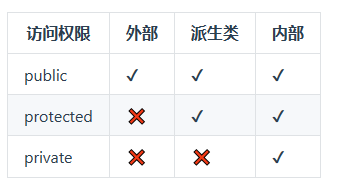
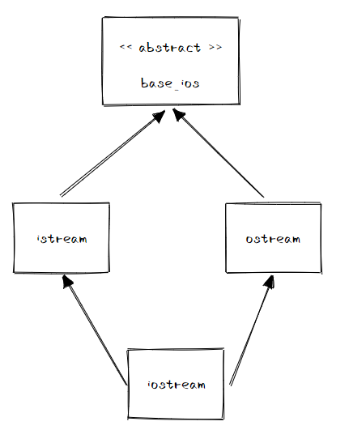
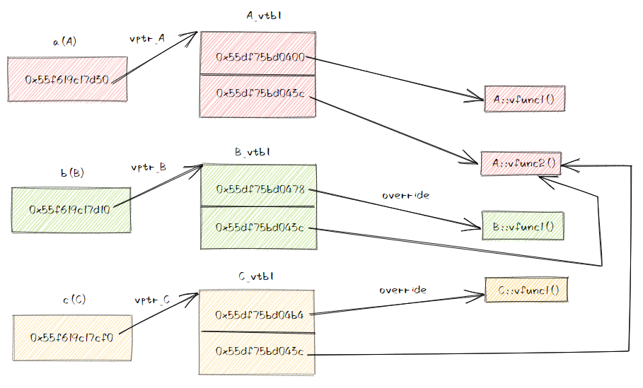
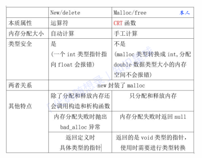
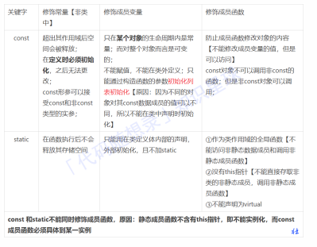
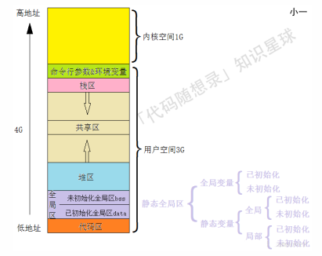
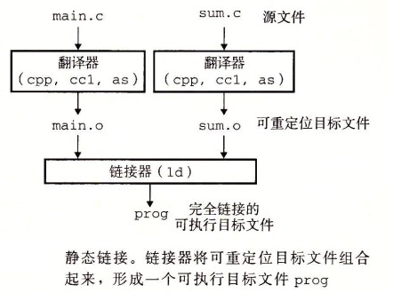
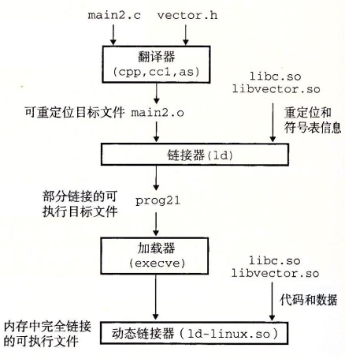

# C++基础

## C++三大特性：继承，封装与多态

访问权限：public，protected，private

在定义类的代码内部，无论什么访问权限，都是可以相互访问的。

* public的变量和函数在类的内部外部都可以访问。
* protected的变量和函数只能在类的内部和其派生类中访问。
* private修饰的元素只能在类内访问。

在类的外部，尤其是“派生类内部”和“派生类对象”的访问权限与公有继承，保护继承和私有继承息息相关。

​ 1.公有继承：基类的公有，保护成员被继承，在派生类的访问权限保持为公有，保护。派生类对象可以直接访问这些公有成员。

​ 2.保护继承：基类的公有，保护成员被继承，在派生类的访问权限都变为保护。因此派生类对象无法直接访问基类公有成员（变成保护的了）。

​ 3.私有继承：基类的公有，保护成员被继承，在派生类的访问权限都变为私有。同理派生类对象无法直接访问基类公有成员（变成私有的了）。



保护继承相对于私有继承的最大优势是继续的派生，对于派生类的派生类而言，显然保护继承起码保证类内部能够访问，同时也能使外部对象无法直接访问。

注意，无法直接访问，但可以通过基类/派生类提供的公共接口进行访问。

如果希望一个类能直接访问另一个类的私有成员，使用友元。

### 1.继承

继承的三种方式：

​ 1.实现继承：使用基类的属性和方法。

​ 2.接口继承：仅使用属性和方法的名称，子类需要提供实现。

​ 3.可视继承：也可以等同于实现继承，更倾向于图形界面编程中，子控件使用基控件的布局，外观和实现代码。

C++支持单继承，多继承和虚继承。

#### 继承的类布局

派生类对象中包含基类的所有数据成员，C++将基类对象直接放在派生类对象的内部，去掉了间接访问的开销。

C++ 保证出现在派生类中的基类子对象保持其原样，即基类子对象的内存布局和一个独立的基类对象是相同的（包括为了对齐而插入的填充）。

基类和派生类数据的布局没有先后的强制规定，但一般都会把基类放到前面。同时，具体继承（与虚继承相对）不会引入时间和空间上的开销。

多继承中，如果将派生类指针转换为基类指针，需要编译器针对转换的具体基类进行一些处理：

​ 1.将派生类指针赋给它第一基类的指针，只需要赋值即可，因为它们的地址相同。（这也被称为对象切片）。

​ 2.如果想要赋值给第二和后续基类的指针，就需要修改地址，加上（或减去）中间的基类子对象大小。

#### 虚继承的影响

默认情况下，派生类中含有继承链上每个类对应的子部分，如果某个类在派生过程中出现了多次，则派生类中将包含该类的多个子对象。

虚继承主要用来解决钻石继承（或菱形继承）带来的问题，比如标准库中的IO类：



读写函数（istream/ostream）显然需要在一个base\_ios中进行管理，不能包含两份base\_ios子对象（注意这里的base\_ios是基类，我们实现的是iostream），否则会出现引用不清晰问题（一个实现类下包含两个同名的基类）

虚继承使得某个类做出声明，承诺愿意共享它的基类。不管虚基类在继承体系中出现了多少次，在派生类中都只包含一个共享的虚基类对象。（子类中只有一份间接父类的数据，对上图来说就是iostream）

```c++
class base_ios{
    ...
};
class istream: public virtual base_ios{
    ...
};
class ostream: public virtual base_ios{
    ...
};
class iostream: public istream, public ostream{
    ...
};
```

在虚继承中，父类数据不会存放在虚继承的子类中，子类会通过一个虚基表指针vbptr，指向虚基表，虚基表中存在偏移量，这个量就是表的地址到父类数据地址的距离。

### 2.封装

数据与代码捆绑，避免外界的访问。

访问修饰符的检查在编译器完成而不是运行时，直接限制了外部代码对内部数据的访问。

### 3.多态

多态指为不同数据类型的实体提供统一的接口，或使用一个单一的符号来表示多个不同的类型。

C++支持两种多态形式：动态多态（运行时多态，根据绑定到指针或引用上的动态类型来决定调用调用虚函数的哪个版本）和静态多态（编译期多态，包括模版的参数化，重载）

动态多态允许将子类类型的指针赋值给父类类型的指针，即使用基类类型的指针来引用派生类的对象，在运行时，程序会根据实际对象的类型调用正确的成员函数。

被派生类地址赋值的基类指针，在调用基类方法时会直接调用派生类的同名方法而不是基类下的方法。

要实现动态多态性，基类下调用的方法要和派生类对应的方法满足三个一致性：

​ 1.函数名称相同。

​ 2.参数列表相同，包括参数类型和顺序。

​ 3.返回类型相同。

实现多态的两种方式：

​ 1.覆盖（override）：子类重写父类虚函数（动态多态绑定，运行时确定而不是编译时确定）

​ 2.重载（overload）：多个同名函数，参数列表不同（这不是上面讲的动态绑定多态，而是静态绑定多态，静态绑定代表编译时编译器会直接选择调用哪一个函数）

#### 虚函数表

C++通过虚函数表（vtable）支持虚函数机制，每个含有虚函数的类都会有一个虚函数表，里面记录虚函数实例的地址，包括：

​ 1.这个类定义的虚函数实例（包括override基类的函数实例）

​ 2.继承自基类的虚函数实例

​ 3.类自己定义的纯虚函数（纯虚函数的继承一定会被override）的表项指向一个默认处理函数pure\_virtual\_called()，如果错误调用程序就会直接结束



每个虚函数同时会被分配一个索引值，通过该索引值查找虚函数表以实现动态绑定。同时，虚表一般都是在对象内存布局中的起始位置

类的实例对象在实例化时会包含虚函数表指针（vptr），指向该类型的虚函数表。此外，RTTI （运行时类型识别）相关的信息往往也是通过 vptr 获得的。

不考虑虚继承的情况下，C++ 中对象的构造顺序是先按派生列表中的顺序构造基类、再构造派生类；析构时的顺序与构造相反。虚继承的中间顺序可能会出现一些区别，由最终派生类的继承顺序决定。

动态绑定实现的关键在于vptr的确定（指具体指向哪一个虚函数表）是在所有构造函数实现完之后根据当前的对象类型决定的。因此，在基类的构造函数中，vptr 指向的是 Base 的虚函数表；在派生类的构造函数中，vptr 指向的是派生类的虚函数表。同样地，在析构对象时，也会对 vptr 做相应的调整（即始终指向正确的虚函数表）。

## 数据类型

整型：short，int，long和long long

short至少16位，int至少与short一样长（最小int16\_t）

long至少32位，与int一样长；long long至少64位，与long一样长

1 byte（字节） = 8 bits（位）

无符号整型不存储负数，能够增大变量存储的最大值，数据长度不变。

## 指针与引用

指针存放某个对象的地址，其本⾝就是变量（命了名的对象），本⾝就有地址，所以可以有指向指针的指针。

指针可变，包括其所指向的地址的改变和其指向的地址中所存放的数据的改变。

引⽤就是变量的别名，从⼀⽽终，不可变，必须初始化。

不存在指向空值的引⽤，但是存在指向空值的指针。

### 指针和引用的区别

* 指针是一个变量，存储的是一个地址，引用跟原来的变量实质上是同一个东西，是原变量的别名
* 指针可以有多级，引用只有一级
* 指针可以为空，引用不能为NULL且在定义时必须初始化
* 指针在初始化后可以改变指向，而引用在初始化之后不可再改变
* sizeof指针得到的是本指针的大小，sizeof引用得到的是引用所指向变量的大小
* 当把指针作为参数进行传递时，也是将实参的一个拷贝传递给形参，两者指向的地址相同，但不是同一个变量，在函数中改变这个变量的指向不影响实参，而引用却可以。
* 引用本质是一个指针，同样会占4字节内存；指针是具体变量，需要占用存储空间（，具体情况还要具体分析）。
* 引用在声明时必须初始化为另一变量，一旦出现必须为typename refname \&varname形式；指针声明和定义可以分开，可以先只声明指针变量而不初始化，等用到时再指向具体变量。
* 引用一旦初始化之后就不可以再改变（变量可以被引用为多次，但引用只能作为一个变量引用）；指针变量可以重新指向别的变量。
* 不存在指向空值的引用，必须有具体实体；但是存在指向空值的指针。

### 在传递函数参数时，什么时候使用指针，什么时候使用引用

* 需要返回函数内局部变量的内存的时候用指针。使用指针传参需要开辟内存，用完要记得释放指针，不然会内存泄漏。而返回局部变量的引用是没有意义的
* 对栈空间大小比较敏感（比如递归）的时候使用引用。使用引用传递不需要创建临时变量，开销要更小
* 类对象作为参数传递的时候使用引用，这是C++类对象传递的标准方式

### 指针类型区分

```c++
int *p[10]
int (*p)[10]
int *p(int)
int (*p)(int)
```

* int \*p\[10]表示指针数组，强调数组概念，是一个数组变量，数组大小为10，数组内每个元素都是指向int类型的指针变量。
* int (\*p)\[10]表示数组指针，强调是指针，只有一个变量，是指针类型，不过指向的是一个int类型的数组，这个数组大小是10。
* int \*p(int)是函数声明，函数名是p，参数是int类型的，返回值是int \*类型的。
* int (\*p)(int)是函数指针，强调是指针，该指针指向的函数具有int类型参数，并且返回值是int类型的。

### 指针占多少字节

在64位的编译环境下的，指针的占用大小为8字节；而在32位环境下，指针占用大小为4字节。一个指针占内存的大小跟编译环境有关，而与机器的位数无关。

### 常量指针和指针常量的区别（指针是常量，const在右边，顶层const）

* 指针常量是一个指针，读成常量的指针，指向一个只读变量，也就是后面所指明的int const 和 const int，都是一个常量，可以写作int const \*p或const int \*p。
* 常量指针是一个不能给改变指向的指针。指针是个常量，必须初始化，一旦初始化完成，它的值（也就是存放在指针中的地址）就不能在改变了，即不能中途改变指向，如int \*const p。

### a和\&a有什么区别

假设数组int a\[10]; int (\*p)\[10] = \&a

a是数组名，是数组首元素地址，+1表示地址值加上一个int类型的大小，如果a的值是0x00000001，加1操作后变为0x00000005。\*(a + 1) = a\[1]。

\&a是数组的指针，其类型为int (\*)\[10]（就是前面提到的数组指针），其加1时，系统会认为是数组首地址加上整个数组的偏移（10个int型变量），值为数组a尾元素后一个元素的地址。

若(int \*)p ，此时输出 \*p时，其值为a\[0]的值，因为被转为int \*类型，解引用时按照int类型大小来读取

### 数组名和指针（这里为指向数组首元素的指针）的区别

* 二者均可通过增减偏移量来访问数组中的元素。
* 数组名不是真正意义上的指针，可以理解为常指针，所以数组名没有自增、自减等操作。
* **当数组名当做形参传递给调用函数后，就失去了原有特性，退化成一般指针，多了自增、自减操作，但sizeof运算符不能再得到原数组的大小了。**

### 野指针和悬空指针

都是是指向无效内存区域(这里的无效指的是"不安全不可控")的指针，访问行为将会导致未定义行为。

野指针指的是没有被初始化过的指针，为了防止出错，对于指针初始化时都是赋值为 `nullptr`，这样在使用时编译器就不会直接报错，产生非法内存访问。

悬空指针指的是针最初指向的内存已经被释放了的一种指针。c++引入了智能指针，C++智能指针的本质就是避免悬空指针的产生。

### 函数指针

#### 定义

函数指针指向的是特殊的数据类型，函数的类型是由其返回的数据类型和其参数列表共同决定的，而函数的名称则不是其类型的一部分。

一个具体函数的名字，如果后面不跟调用符号(即括号)，则该名字就是该函数的指针(注意：大部分情况下，可以这么认为，但这种说法并不很严格)。

#### 声明方法

int (\*pf)(const int&, const int&); (1)

上面的pf就是一个函数指针，指向所有返回类型为int，并带有两个const int&参数的函数。注意\*pf两边的括号是必须的，否则上面的定义就变成了：

int \*pf(const int&, const int&); (2)

而这声明了一个函数pf，其返回类型为int \*， 带有两个const int&参数。

#### 赋值方法

指针名 = 函数名； 指针名 = &函数名

#### 用途

函数与数据项相似，函数也有地址。我们希望在同一个函数中通过使用相同的形参在不同的时间使用产生不同的效果。

个函数地址是该函数的进入点，也就是调用函数的地址。函数的调用可以通过函数名，也可以通过指向函数的指针来调用。函数指针还允许将函数作为变元传递给其他函数；

## 关键字

### const

作用：修饰的值不能改变，是只读变量。必须在定义的时候就给它赋初值。

分类：

​ 1.常量指针（底层const）：定义了一个指针，这个指针指向只读对象，不能通过常量指针来改变对象的值。

```c++
int tmp = 10;
// 下面这两种都是常量指针
const int* a = &tmp;
int const *a = &tmp;

*a = 9; // 错误，不能通过常量指针改变对象的值
tmp = 9; // 正确
```

​ 2.指针常量（顶层const）：指针只能在定义时初始化，其他时候不能改变。强调的是指针的不可改变性。

```c++
int tmp = 12;
int tmp1 = 10;
// 指针常量
int* const p = &tmp;

*p = 9 // 正确，可以更改指向对象的值
p = &tmp1; // 错误，不能改变指针指向的对象
```

#### 顶层const和底层const

* **顶层**const：指的是const修饰的变量**本身**是一个常量，无法修改，指的是指针，就是 \* 号的右边，也就是常量指针
* **底层**const：指的是const修饰的变量**所指向的对象**是一个常量，指的是所指变量，就是 \* 号的左边

作用区分：

* 执行对象拷贝时有限制，常量的底层const不能赋值给非常量的底层const
* 使用命名的强制类型转换函数const\_cast时，只能改变运算对象的底层const

#### const关键字的作用

1. 阻止一个变量被改变，可以使用const关键字。在定义该const变量时，通常需要对它进行初始化；
2. 对指针来说，可以指定指针本身为const，也可以指定指针所指的数据为const，或二者同时指定为const；
3. 在一个函数声明中，const可以修饰形参，表明它是一个输入参数，在函数内部不能改变其值；
4. 对于类的成员函数，若指定其为const类型，则表明其是一个常函数，不能修改类的成员变量，类的常对象只能访问类的常成员函数；
5. 对于类的成员函数，有时候必须指定其返回值为const类型，以使得其返回值不为“左值”。
6. 非const成员函数可以访问非const对象的非const数据成员、const数据成员，但不可以访问const对象的任意数据成员；
7. 一个没有明确声明为const的成员函数被看作是将要修改对象中数据成员的函数，而且编译器不允许它为一个const对象所调用。因此const对象只能调用const成员函数。
8. const类型变量可以通过类型转换符const\_cast将const类型转换为非const类型；
9. const类型变量必须定义的时候进行初始化，因此也导致如果类的成员变量有const类型的变量，那么该变量必须在类的初始化列表中进行初始化；
10. 对于函数值传递的情况，因为参数传递是通过复制实参创建一个临时变量传递进函数的，函数内只能改变临时变量，但无法改变实参。则这个时候无论加不加const对实参不会产生任何影响。但是在引用或指针传递函数调用中，因为传进去的是一个引用或指针，这样函数内部可以改变引用或指针所指向的变量，这时const 才是实实在在地保护了实参所指向的变量。因为在编译阶段编译器对调用函数的选择是根据实参进行的，所以，只有引用传递和指针传递可以用是否加const来重载。一个拥有顶层const的形参无法和另一个没有顶层const的形参区分开来。

const表达的是一种运行时常量性的概念，不过有些时候，我们需要编译时期的常量性，这无法由const保证。

如何获得编译时期的常量？最简单的方法就是使用C中的宏代替声明的常量返回值，但这样太过低效。因此C++11使用了constexpr关键字，这样的话编译期间编译器就可以对该表达式进行值计算，并视其为一个编译时期的常量。

### define/typedef

define:

​ 1.只是简单的字符串替换，没有类型检查

​ 2.在编译的预处理阶段起作⽤

​ 3.防⽌头⽂件重复引⽤

​ 4.不分配内存

typedef：

​ 1.有对应的数据类型，需要进行判断

​ 2.在编译，运行时起作用

​ 3.在静态存储区中分配空间，在程序运⾏过程中内存中只有⼀个拷贝

#### 宏定义与typedef的差别

* 宏主要用于定义常量及书写复杂的内容；typedef主要用于定义类型别名。
* 宏替换发生在编译阶段之前，属于文本插入替换；typedef是编译的一部分。
* 宏不检查类型；typedef会检查数据类型。
* 宏不是语句，不在在最后加分号；typedef是语句，要加分号标识结束。
* 注意对指针的操作，typedef char \* p\_char和#define p\_char char \*区别巨大。
  * \#define p\_char char \*是全局替换，并且只是文本替换不进行类型检查，可能影响非常大

### define/inline

define:定义预编译时处理的宏，只是简单的字符串替换，无类型检查

inline：

​ 1.先将内联函数编译完成⽣成了函数体直接插⼊被调⽤的地⽅，减少了压栈，跳转和返回的操作。没有普通函数调⽤时的额外开销

​ 2.内联函数是一种特殊的函数，会进行类型检查

​ 3.内联函数本质是编译器的一种请求，编译器可以拒绝这种这种请求（编译器会根据自己的优化策略和上下文来自己决定，如果不会带来性能提升，编译器是不会执行内联的请求的）

C++对inline的编译限制：

​ 1.不能存在任何形式的循环语句

​ 2.不能存在过多的条件判断语句

​ 3.函数体不能过于庞⼤

​ 4.内联函数声明必须在调用语句之前

#### 宏定义与函数的区别

* 宏在预处理阶段完成替换，之后被替换的文本参与编译，相当于直接插入了代码，运行时不存在函数调用，执行起来更快；函数调用在运行时需要跳转到具体调用函数。（内联函数在编译时展开，也避免的函数的调用）
* 宏定义属于在结构中插入代码，没有返回值；函数调用具有返回值。
* 宏定义参数没有类型，不进行类型检查；函数参数具有类型，需要检查类型。
* 宏定义不要在最后加分号。

### override/overload

overload是重写（覆盖）了⼀个⽅法,⼀般是⽤于⼦类在继承⽗类时，重写⽗类⽅法。

规则：

​ 1.重写⽅法的参数列表，返回值，所抛出的异常与被重写⽅法⼀致（函数签名相同）

​ 2.被重写的⽅法不能为private

​ 3.静态⽅法不能被重写为⾮静态的⽅法

​ 4.重写⽅法的访问修饰符⼀定要⼤于被重写⽅法的访问修饰符（public>protected>default>private）

override是重载，这些⽅法的名称相同⽽参数形式不同。

规则：

​ 1.不能对访问权限，返回类型以及抛出的异常进行重载

​ 2.重载的函数签名必须与原函数不一致（名称一定要相同）

​ 3.方法的异常类型和数目不会对重载造成影响

使⽤多态是为了避免在⽗类⾥⼤量重载引起代码臃肿且难于维护。

重写需要增加override修饰符。

### override/final

override指定了子类的这个虚函数是重写的父类的，如果函数签名打错，编译器是不会编译通过的

当不希望某个类被继承，或不希望某个虚函数被重写，可以在类名和虚函数后添加final关键字，添加final关键字后被继承或重写，编译器会报错。

### new/delete与malloc/free

#### 区别

1.new内存分配失败时，会抛出std::bad\_alloc异常，不会返回NULL；而malloc分配内存失败时返回NULL

2.new操作符申请内存分配时无需显式指定内存块的大小，而malloc需要指定

3.operator new/ operator delete可以被重载，而malloc/free不能被重载

4.new/delete会调⽤对象的构造函数/析构函数以完成对象的构造/析构。⽽malloc则不会

5.malloc与free是C++/C语⾔的标准库函数,new/delete是C++的运算符

6.new是类型安全的，而malloc不是。因为malloc和free返回的是void类型指针（必须进行类型转换），new和delete返回的是具体类型指针。



#### new/delete的实现

* new的实现过程是：首先调用名为**operator new**的标准库函数，分配足够大的原始为类型化的内存，以保存指定类型的一个对象；接下来运行该类型的一个构造函数，用指定初始化构造对象；最后返回指向新分配并构造后的的对象的指针
* delete的实现过程：对指针指向的对象运行适当的析构函数；然后通过调用名为**operator delete**的标准库函数释放该对象所用内存

#### C++使用new/delete的原因

在对非基本数据类型的对象使用的时候，对象创建的时候还需要执行构造函数，销毁的时候要执行析构函数。而malloc/free是库函数，是已经编译的代码，所以不能把构造函数和析构函数的功能强加给malloc/free，所以new/delete是必不可少的。

#### 被free回收的内存是立即返还给操作系统吗

不是，被free回收的内存会首先被ptmalloc使用双链表保存起来，当用户下一次申请内存的时候，会尝试从这些内存中寻找合适的返回。这样就避免了频繁的系统调用，占用过多的系统资源。同时ptmalloc也会尝试对小块内存进行合并，避免过多的内存碎片。

ptmalloc对内存的合并是通过空闲块合并/分割实现的，是在虚拟地址上的分配，不涉及物理内存的swap操作。

#### C++中有几种类型的new

在C++中，new有三种典型的使用方法：plain new，nothrow new和placement new

plain new就是普通的new，也是我们常用的new，因此**plain new**在空间分配失败的情况下，会抛出异常**std::bad\_alloc**而不是返回NULL，因此通过判断返回值是否为NULL是徒劳的。

nothrow new在空间分配失败的情况下是不抛出异常，而是返回NULL

```c++
#include <iostream>
#include <string>
using namespace std;

int main()
{
	char *p = new(nothrow) char[10e11];
	if (p == NULL) 
	{
		cout << "alloc failed" << endl;
	}
	delete p;
	return 0;
}
//运行结果：alloc failed

```

placement new允许在一块已经分配成功的内存上重新构造对象或对象数组。placement new不用担心内存分配失败，因为它根本不分配内存，它做的唯一一件事情就是调用对象的构造函数

使用placement new需要注意两点：

* palcement new的主要用途就是反复使用一块较大的动态分配的内存来构造不同类型的对象或者他们的数组
* placement new构造起来的对象数组，要显式的调用他们的析构函数来销毁（析构函数并不释放对象的内存），不能使用delete，这是因为placement new构造起来的对象或数组大小并不一定等于原来分配的内存大小，使用delete会造成内存泄漏或者之后释放内存时出现运行时错误。

```c++
#include <iostream>
#include <string>
using namespace std;
class ADT{
	int i;
	int j;
public:
	ADT(){
		i = 10;
		j = 100;
		cout << "ADT construct i=" << i << "j="<<j <<endl;
	}
	~ADT(){
		cout << "ADT destruct" << endl;
	}
};
int main()
{
	char *p = new(nothrow) char[sizeof ADT + 1];
	if (p == NULL) {
		cout << "alloc failed" << endl;
	}
	ADT *q = new(p) ADT;  //placement new:不必担心失败，只要p所指对象的的空间足够ADT创建即可
	//delete q;//错误!不能在此处调用delete q;
	q->ADT::~ADT();//显示调用析构函数
	delete[] p;
	return 0;
}
//输出结果：
//ADT construct i=10j=100
//ADT destruct

```

### constexpr/const

const表示“只读“，而constexpr表示”常量“。

constexpr 只能定义编译期常量，⽽ const 可以定义编译期常量，也可以定义运⾏期常量。

constexpr修饰的函数或变量也默认标记为了const，反之则不成立。

在C++11中，constexpr指定的函数返回值和参数必须是“字面值”，同时有且只有一行代码，C++14则只需要保证返回值和参数是字面值即可。

constexpr可以用来修饰变量、函数、构造函数。一旦以上任何元素被constexpr修饰，那么等于说是告诉编译器 “将当前代码看成编译时就能得出常量值的表达式去优化”，否则const修饰的内容必须等到运行时编译器进入函数才能计算。

同时，const是无法修饰构造函数的，而constexpr可以修饰字面常量类的构造函数。

constexpr的优势：

​ 1.为⼀些不能修改数据提供保障，写成变量则就有被意外修改的风险

​ 2.有些场景，编译器可以在编译期对constexpr的代码进⾏优化，提⾼效率

​ 3.相⽐宏来说，没有额外的开销，但更安全可靠

### static/const



static实现多个对象之间的数据共享和隐藏，默认初始化为0。

### volatile

与const对立，意为“多变的”，用该关键字声明的变量表示变量随时可能发生变化，因此与该变量有关的运算，不要进⾏编译优化。编译器会从内存中重新装载内容，⽽不是直接从寄存器拷贝内容。

它确保了操作不会因为编译器的优化而省略，且要求每次直接读值，保证对特殊地址的稳定访问。

多线程中被几个任务共享的变量需要定义为volatile类型。

#### volatile指针

volatile 指针和 const 修饰词类似，const 有常量指针和指针常量的说法，volatile 也有相应的概念

修饰由指针指向的对象、数据是 const 或 volatile 的： const char\* cpch;volatile char\* vpch;

指针自身的值，即一个代表地址的整数变量，是 const 或 volatile 的：char\* const pchc;char\* volatile pchv;

注意：

* 可以把一个非volatile int赋给volatile int，但是不能把非volatile对象赋给一个volatile对象。
* 除了基本类型外，对用户定义类型也可以用volatile类型进行修饰。
* C++中一个有volatile标识符的类只能访问它接口的子集，一个由类的实现者控制的子集。用户只能用const\_cast来获得对类型接口的完全访问。此外，volatile向const一样会从类传递到它的成员。

### mutable

跟constant（既C++中的const）是反义词。在C++中，mutable也是为了突破const的限制而设置的。被mutable修饰的变量，将永远处于可变的状态，即使在一个const函数中。

```c++
class person
{
public:
    int m_A;
    mutable int m_B;//特殊变量 在常函数里值也可以被修改
};

int main()
{
    const person p = person();//修饰常对象 不可修改类成员的值
    p.m_A = 10;//错误，被修饰了指针常量
    p.m_B = 200;//正确，特殊变量，修饰了mutable
}

```

### extern

外部变量声明，为在函数或文件外部定义的全局变量。

#### extern “C”的用法

为了能够**正确的在C++代码中调用C语言**的代码：在程序中加上extern "C"后，相当于告诉编译器这部分代码是C语言写的，因此要按照C语言进行编译，而不是C++；

在.c文件中包含了extern "C"时会出现编译语法错误。所以使用extern "C"全部都放在于cpp程序相关文件或其头文件中。

### explicit

explicit关键字用来修饰类的构造函数，被修饰的构造函数的类，不能发生相应的隐式类型转换，只能以**显式的方式进行类型转换**，注意以下几点：

* explicit 关键字只能用于类内部的构造函数声明上
* 被explicit修饰的构造函数的类，不能发生相应的隐式类型转换

### 前置++与后置++

前置++返回引用，后置++返回的是对象。

后置++返回的是常量对象，这主要是避免连续的“++”，例如i++++。

显然，后置++需要创建临时对象，这会带来构造和析构的额外开销。

### std::atomic

C++11提供了std::atomic来保证原子操作。很多简单的命令，例如a++等，本质上线程都不安全（编译器的汇编指令对应三条指令）。

std::atomic是一个模版，一般来说不允许使用拷贝构造函数，因此需要先构造，再赋值。

```c++
std::atomic<int> value;
value = 99;

// 下面这种在一些编译器（例如G++）中无法通过
std::atomic<int> value = 99;
```

#### std::atomic\_flag

最简单的原子类型，标识一个布尔标志。这个类型的对象可以在两个状态间切换：设置和清除。

std::atomic\_flag 类型的对象必须被ATOMIC\_FLAG\_INIT初始化。初始化标志位是“清除”状态。

```c++
std::atomic_flag = ATOMIC_FLAG_INIT;
```

它是唯一一个需要如此初始化类型的原子类型，也是唯一一个保证无锁的类型（原子类型一般通过锁来保证原子性）。

std::atomic\_flag只能做三件事情：销毁，设定清除或设置状态。

销毁——clear()，默认内存顺序为memory\_order\_seq\_cst。

设定清除或设置状态——test\_and\_set()，是一个“读-改-写”的操作，可以应用任何顺序，默认内存顺序为memory\_order\_seq\_cst。

```
内存顺序主要有以下两种——
memory_order_acquire：确保在该操作之前的所有读操作都在该操作之前执行，不允许后续的加载操作超越当前操作。 
memory_order_seq_rel：除了确保读操作外，还确保写操作，具有更强的同步保证。
```

std::atomic\_flag非常适合做自旋互斥锁，初始化标志是“清除”，标识处于解锁状态。当想要上锁时，只需调用test\_and\_set方法，当为false时代表未被占用，而为true时代表已上锁，因此在while上等待。解锁直接清除std::atomic\_flag即可。

```c++
class spinlock_mutex
{
	std::atomic_flag flag;
public:
	spinlock_mutex():flag(ATOMIC_FLAG_INIT){ }
	void lock()
	{
		while(flag.test_and_set(std::memory_order_acquire));
	}
	void unlock()
	{
		flag.clear(std::memory_order_release); // 如果使用默认也可以直接写为flag.clear()
	}
};
```

## C++强制类型转换

包括四个关键字：static\_cast，dynamic\_cast，reinterpret\_cast和const\_cast

### static\_cast

​ 没有运⾏时类型检查来保证转换的安全性。

​ 进⾏上⾏转换（把派⽣类的指针或引⽤转换成基类表⽰）是安全的。

​ 进⾏下⾏转换（把基类的指针或引⽤转换为派⽣类表⽰），由于没有动态类型检查，所以是不安全的。

使用：

​ 1.⽤于基本数据类型之间的转换，如把int转换成char。

​ 2.把任何类型的表达式转换成void类型。或把空指针转换成目标类型。

### dynamic\_cast

​ 在进⾏下⾏转换时（基类->派生类），dynamic\_cast具有类型检查（信息在虚函数中）的功能，⽐static\_cast更安全。

​ 转换后必须是类的指针、引⽤或者void\*，基类要有虚函数，可以交叉转换。

​ dynamic本⾝只能⽤于存在虚函数的⽗⼦关系的强制类型转换；对于指针，转换失败则返回nullptr，对于引⽤，转换失败会抛出异常。

### reinterpret\_cast

​ 强制转换，无限制，但平台移植性差。

### const\_cast

​ 常量指针转换为⾮常量指针，并且仍然指向原来的对象。

​ 常量引⽤被转换为⾮常量引⽤，并且仍然指向原来的对象。

​ 去掉类型的const或volatile属性。

## 运算符重载

重载运算符函数，本质还是函数调用，所以重载后：

​ 1.既可以使用运算符的⽅式进行调⽤：data1+data2

​ 2.还可以是调用函数的方式：operator+(data1, data2)

在C++中，当重载一个二元运算符作为类的成员函数时，该成员函数的左侧运算对象（被调用对象）将成为函数的this指针。这就是说，最左侧的运算对象相当于固定了this。

## 计算机的乱序执行

### 1.正常执行的情况

​ 1.对同一块内存进行访问，此时访问的顺序不会被编译器修改

​ 2.新变量的定义值依赖之前定义的变量，此时两个变量定义的顺序不会被编译器修改

在多线程的情况下计算机会出现乱序执行

### 2.C++提供的六种内存模型

​ memory\_order\_relaxed：没有任何同步或顺序限制

​ memory\_order\_consume：编译器需要优先考虑加载数据的操作（C++14被废弃）

​ memory\_order\_acquire：同步的读取操作，确保当前操作和之前的操作按照严格的顺序执行

​ memory\_order\_release：同步的写入操作

​ memory\_order\_acq\_rel：同步读写

​ memory\_order\_seq\_cst：所有的原子操作按照一个全局的总序列一致性执行（类似于分布式中的线性一致性）

## C++内存模型

### 1.字符串操作函数

#### strcpy：复制字符串

```c++
char *strcpy(char *dest, const char *src)
dest：指向用于赋值内容的目标数组
src：要复制的字符串
返回一个指向最终目标字符串dest的指针
当dest的长度小于src时，会出现缓冲溢出的情况
    
char* strcpy(char *dst,const char *src) {// [1]
 assert(dst != NULL && src != NULL); // [2]
 char *ret = dst; // [3]
 while ((*dst++=*src++)!='\0'); // [4]
 return ret;
}
```

#### strlen：计算字符串长度

```c++
int strlen(const char *str)
```

#### strcat：添加字符串到结尾处

```c++
char *strcat(char* dest, const char* src)
将src所指字符串添加到dest结尾处
```

#### strcmp：两个字符串的比较

```c++
int strcmp(const char* str1, const char* str2)
两个字符串自左向右逐个字符相比（按 ASCII 值大小相比较），直到出现不同的字符或遇 \0 为止
显然返回值等于0代表完全相等，正数/负数无法确定两个字符串具体的关系
```

### 2.内存泄漏

什么是内存泄漏？

​ 程序未能释放掉不再使⽤的内存的情况。

内存泄漏的分类：

​ 1.堆内存泄漏（Heap leak）

​ 主要指的是malloc/new/realloc（用于数组扩容）等从堆中分配的内存没有free或delete掉。

​ 2.系统资源泄漏（Resource leak）

​ 系统分配的资源⽐如套接字、文件描述符、管道等没有使⽤相应的函数释放掉，导致系统资源的浪费，严重可导致系统效能降低，系统运⾏不稳定。

​ 3.基类的析构函数非虚

​ 这种情况下，当基类指针指向子类对象时，如果基类的析构函数非虚，那么子类的析构函数将无法调用（基类的析构函数可以正常调用），造成内存泄漏。

​ 一般来说，子类析构函数视为基类析构函数的重载而不是重写，不加override关键字。

​ 基类的虚析构函数可以触发动态绑定以调用子类的析构函数。

如何防止内存泄漏？

​ 将内存的分配封装在类中（RAII），构造函数分配内存，析构函数释放内存。

​ 使用智能指针（维护一个引用计数，重载了“\*”和“->”）。

如何监测内存使用情况：

​ 在g++编译器编译时加上“-g”选项，用以生成可调式信息的二进制文件。

​ 在结果输出时使用valgrind关键字，可以监测整体的内存使用情况：

```shell
#valgrind --tool=memcheck --leak-check=yes --show-reachable=yes ./filename
```

## C++模版全特化和偏特化

模板分为类模板与函数模板，特化分为特例化（全特化）和部分特例化（偏特化）。

SFINAE：替换失败不是错误。它使得模板可以更加灵活地应对不同的参数情况，通过选择不同的模板实例来处理。

在调用顺序上：全特化>偏特化>通用模版

对函数模版来说：

​ 1.模板和特例化版本应该声明在同⼀头⽂件，所有同名模板的声明应放在前⾯，接着是特例化版本

​ 2.⼀个模板被称为全特化的条件：1.必须有⼀个主模板类 2.模板类型被全部明确化

```c++
template<typename T1, typename T2>
void fun(T1 a, T2 b)
{
cout<<"模板函数"<<endl;
}
// 特化版本上面的template<>关键字仍然应该保留
template<>
void fun<int , char >(int a, char b)
{
cout<<"全特化"<<endl;
}
```

## C++异常处理

### try、throw和catch关键字

C++中的异常处理机制主要使用**try**、**throw**和**catch**三个关键字

程序的执行流程是先执行try包裹的语句块，如果执行过程中没有异常发生，则不会进入任何catch包裹的语句块，如果发生异常，则使用throw进行异常抛出，再由catch进行捕获，throw可以抛出各种数据类型的信息，代码中使用的是数字，也可以自定义异常class。\*\*catch根据throw抛出的数据类型进行精确捕获（不会出现类型转换），如果匹配不到就直接报错，可以使用catch(...)的方式捕获任何异常（不推荐）。\*\*当然，如果catch了异常，当前函数如果不进行处理，或者已经处理了想通知上一层的调用者，可以在catch里面再throw异常。

### 函数异常声明列表

异常声明列表出现在函数的参数列表后面，使用 `throw` 关键字，后接一个括号括起来的异常说明符列表。异常声明列表已经在 C++11 标准中被弃用，而在 C++17 标准中则已完全删除。现代 C++ 推荐使用异常规范说明符（exception specification specifier）代替异常声明列表。异常规范说明符使用 `noexcept` 关键字。

### C++标准异常类

C++ 标准库中有一些类代表异常，这些类都是从 exception 类派生而来


* bad\_typeid：使用typeid运算符，如果其操作数是一个多态类的指针，而该指针的值为 NULL，则会拋出此异常
* bad\_cast：在用 dynamic\_cast 进行从多态基类对象（或引用）到派生类的引用的强制类型转换时，如果转换是不安全的，则会拋出此异常
* bad\_alloc：在用 new 运算符进行动态内存分配时，如果没有足够的内存，则会引发此异常
* out\_of\_range:用 vector 或 string的at 成员函数根据下标访问元素时，如果下标越界，则会拋出此异常

## C++基础题目

### 计算下面的sizeof的值（windows32位系统下）

```c++
char str[] = "hello";
char* p = str;
int n = 10;
// 请计算
sizeof(str) = ? // 6，数组所占内存的大小包括'\0'，该终止符只会在字符数组中出现
sizeof(p) = ? // 4，指针的内容是地址，32位系统的地址位数也为32位，即4字节
sizeof(n) = ? // 4
void Func(char str[100])
 {
 // 请计算
 sizeof(str) = ? // 4，str作为指针指向数组的最前面，表示首元素的地址
 }
void* p = malloc(100);
// 请计算
sizeof(p) = ? // 4，p指向malloc分配的内存的起始地址
```

### 分析下列Test函数的运行结果

```c++
void GetMemory1(char* p) // 应该传递引用，即char*& p
{
 p = (char*)malloc(100);
}
void Test1(void)
{
 char* str = NULL;
 GetMemory1(str); // 这里如果输入&str，可以将上面参数改为char** p，也可以实现传引用一样的效果
 strcpy(str, "hello world");
 printf(str);
}
```

Test 1——程序崩溃，因为GetMemory1并不能传递动态内存（参数为值传递而不是引用传递，不会更改实际的输入），Test 1函数中的 str⼀直都是NULL。strcpy函数导致程序崩溃。

```c++
char *GetMemory2(void)
{
 char p[] = "hello world";	// 局部变量p在函数结束时超出了它的生存周期
 return p;
}
void Test2(void)
{
 char *str = NULL;
 str = GetMemory2();
 printf(str);
}
```

Test 2——可能是乱码。 因为GetMemory2返回的是指向“栈内存”的指针，该指针的地址不是NULL，使其原现的内容已经被清除，新内容不可知。

​ 没有动态内存分配（即没有从堆上分配内存），该指针作为局部变量存在栈内存中，函数执行结束后栈的空间也会被释放。

```c++
void GetMemory3(char** p, int num)
{
 *p = (char*)malloc(num);
}
void Test3(void)
{
 char* str = NULL;
 GetMemory3(&str, 100);
 strcpy(str, "hello");
 printf(str)
}
```

Test 3——能够输出hello但申请的内存没有释放，导致内存泄漏。

```c++
void Test4(void)
{
 char *str = (char*)malloc(100);
 strcpy(str, "hello");
 free(str);
 if(str != NULL) {
 strcpy(str, "world");
 cout << str << endl;
 }
}
```

Test 4——篡改了动态内存区的内容。在free(str)后，str成为了野指针，if(str != NULL)语句不起作用。

### 进程地址空间的具体分布



命令行参数与环境变量——命令执行程序的时候给程序的参数

栈区——存储局部变量和函数参数值（从高地址向低地址增长）

文件映射区（共享区）——位于栈和堆之间，使进程能够读写对应区域的文件；同时还能实现共享内存与零拷贝操作

堆区——动态申请内存用（堆从低地址向高地址增长）

BSS段——存放程序中未初始化的全局变量和静态变量

数据段——存放过程中已初始化的全局变量和静态变量

注意，对于64位而言，内核空间和用户空间分别置于地址的两端，用户空间的大小一般为128TB

### C与C++的内存分配方式

​ 1.静态存储区域分配——内存在程序编译的时候就已经分配好，这块内存在程序的整个运⾏期间都存在，如全局变量，static变量。

​ 2.栈上创建——函数内局部变量的存储单元都可以在栈上创建，函数执⾏结束时这些存储单元⾃动被释放。栈内存 分配运算内置于处理器的指令集中，效率很⾼，但是分配的内存容量有限。

​ 3.堆上分配（动态内存分配）——⽤malloc或new申请任意多少的内存，需要负责⽤free或delete释放内存。动态内存的⽣存期⾃⼰决定。

### new/delete和malloc/free的关系

​ 1.new/delete的底层调用了malloc/free。

​ 2.new/delete主要用于类对象的动态内存分配和释放，它们会调用对应类的构造/析构函数，再对堆内存进行释放。

### 在main执行之前和之后执行的代码是什么

**main函数执行之前**，主要就是初始化系统相关资源：

* 设置栈指针
* 初始化静态`static`变量和`global`变量，即`.data`段的内容
* 将未初始化部分的全局变量赋初值：数值型`short`，`int`，`long`等为`0`，`bool`为`FALSE`，指针为`NULL`等等，即`.bss`段的内容
* 全局对象初始化，在`main`之前调用构造函数
* 将main函数的参数`argc`，`argv`等传递给`main`函数，然后才真正运行`main`函数
* `__attribute__((constructor))`（GCC等编译器支持在main函数执行之前调用的函数）

静态存储区初始化（包括静态局部和静态全局）->全局变量赋初值->全局对象构造

全局对象的初始化顺序可能是不确定的，因此在一个全局对象的构造函数中依赖于另一个全局对象的状态可能会导致问题。因此，最好尽量避免在全局对象之间建立复杂的依赖关系。

**main函数执行之后**：

* 全局对象的析构函数会在main函数之后执行；
* 可以用 **`atexit`** 注册一个函数，它会在main 之后执行;
* `__attribute__((destructor))`

### 结构体对齐问题

* 结构体内成员按照声明顺序存储，第一个成员地址和整个结构体地址相同。
* 未特殊说明时，按结构体中size最大的成员对齐（若有double成员，按8字节对齐）

c++11以后引入两个关键字 alignas 与 alignof，其中`alignof`可以计算出类型的对齐方式，`alignas`可以指定结构体的对齐方式。alignas不能小于自然对齐的最小单位，否则会失效。GCC编译器可以输出结果但 alignof 不变。

如果想使用单字节对齐的方式，使用`alignas`是无效的。应该使用`#pragma pack(push,1)`或者使用`__attribute__((packed))`

### 堆与栈的区别

|            | 堆                                                                                                                                                   | 栈                                                                                      |
| ---------- | --------------------------------------------------------------------------------------------------------------------------------------------------- | -------------------------------------------------------------------------------------- |
| **管理方式**   | 堆中资源由程序员控制（容易产生memory leak）                                                                                                                         | 栈资源由编译器自动管理，无需手工控制                                                                     |
| **内存管理机制** | 系统有一个记录空闲内存地址的链表，当系统收到程序申请时，遍历该链表，寻找第一个空间大于申请空间的堆结点，删 除空闲结点链表中的该结点，并将该结点空间分配给程序（大多数系统会在这块内存空间首地址记录本次分配的大小，这样delete才能正确释放本内存空间，另外系统会将多余的部分重新放入空闲链表中） | 只要栈的剩余空间大于所申请空间，系统为程序提供内存，否则报异常提示栈溢出。（这一块理解一下链表和队列的区别，不连续空间和连续空间的区别，应该就比较好理解这两种机制的区别了） |
| **空间大小**   | 堆是不连续的内存区域（因为系统是用链表来存储空闲内存地址，自然不是连续的），堆大小受限于计算机系统中有效的虚拟内存（32bit 系统理论上是4G），所以堆的空间比较灵活，比较大                                                            | 栈是一块连续的内存区域，大小是操作系统预定好的，windows下栈大小是2M（也有是1M，在 编译时确定，VC中可设置）                           |
| **碎片问题**   | 对于堆，频繁的new/delete会造成大量碎片，使程序效率降低                                                                                                                    | 对于栈，它是有点类似于数据结构上的一个先进后出的栈，进出一一对应，不会产生碎片。（看到这里我突然明白了为什么面试官在问我堆和栈的区别之前先问了我栈和队列的区别）       |
| **生长方向**   | 堆向上，向高地址方向增长。                                                                                                                                       | 栈向下，向低地址方向增长。                                                                          |
| **分配方式**   | 堆都是动态分配（没有静态分配的堆）                                                                                                                                   | 栈有静态分配和动态分配，静态分配由编译器完成（如局部变量分配），动态分配由alloca函数分配，但栈的动态分配的资源由编译器进行释放，无需程序员实现。            |
| **分配效率**   | 堆由C/C++函数库提供，机制很复杂。所以堆的效率比栈低很多。                                                                                                                     | 栈是其系统提供的数据结构，计算机在底层对栈提供支持，分配专门 寄存器存放栈地址，栈操作有专门指令。                                      |

栈的速度比堆快得多，因为操作系统会在底层对栈提供支持，会分配专门的寄存器存放栈的地址，栈的入栈出栈操作也十分简单，并且有专门的指令执行，所以栈的效率比较高也比较快。

一个栈同一时间只能运行一个指令，线程在Linux下和进程几乎一致，每个线程都有自己的栈。

### strlen和sizeof的区别

* sizeof是运算符，并不是函数，结果在编译时得到而非运行中获得；strlen是字符处理的库函数。
* sizeof参数可以是任何数据的类型或者数据（sizeof参数不退化）；strlen的参数只能是字符指针且结尾是'\0'的字符串。
* 因为sizeof值在编译时确定，所以不能用来得到动态分配（运行时分配）存储空间的大小。

### C++与python的区别

* Python是一种脚本语言，是解释执行的，而C++是编译语言，是需要编译后在特定平台运行的。python可以很方便的跨平台，但是效率没有C++高。
* Python使用缩进来区分不同的代码块，C++使用花括号来区分
* C++中需要事先定义变量的类型，而Python不需要，Python的基本数据类型只有数字，布尔值，字符串，列表，元组等等
* Python的库函数比C++的多，调用起来很方便

### C++和C的区别

* C++中new和delete是对内存分配的运算符，取代了C中的malloc和free。
* 标准C++中的字符串类取代了标准C函数库头文件中的字符数组处理函数（C中没有字符串类型）。
* C++中用来做控制态输入输出的iostream类库替代了标准C中的stdio函数库。
* C++中的try/catch/throw异常处理机制取代了标准C中的setjmp()和longjmp()函数。
* 在C++中，允许有相同的函数名，不过它们的参数类型不能完全相同，这样这些函数就可以相互区别开来。而这在C语言中是不允许的。也就是C++可以重载，C语言不允许。（函数签名不同即可）
* C++语言中，允许变量定义语句在程序中的任何地方，只要在是使用它之前就可以；**而C语言中，必须要在函数开头部分**（现在的编译器已经放宽了这一点）。而且C++不允许重复定义变量，C语言也是做不到这一点的。
* 在C++中，除了值和指针之外，新增了引用。引用型变量是其他变量的一个别名，我们可以认为他们只是名字不相同，其他都是相同的。
* C++相对与C增加了一些关键字，如：bool、using、dynamic\_cast、namespace等等

### C++与JAVA的区别

语言特性：

* Java语言给开发人员提供了更为简洁的语法；完全面向对象，由于JVM可以安装到任何的操作系统上，所以说它的可移植性强
* Java语言中没有指针的概念，引入了真正的数组。不同于C++中利用指针实现的“伪数组”，Java引入了真正的数组，同时将容易造成麻烦的指针从语言中去掉，这将有利于防止在C++程序中常见的因为数组操作越界等指针操作而对系统数据进行非法读写带来的不安全问题
* C++也可以在其他系统运行，但是需要不同的编码（这一点不如Java，只编写一次代码，到处运行），例如对一个数字，在windows下是大端存储，在unix中则为小端存储。Java程序一般都是生成字节码，在JVM里面运行得到结果
* Java用接口(Interface)技术取代C++程序中的抽象类。接口与抽象类有同样的功能，但是省却了在实现和维护上的复杂性

垃圾回收：

* C++用析构函数回收垃圾，写C和C++程序时一定要注意内存的申请和释放
* Java语言不使用指针，内存的分配和回收都是自动进行的，程序员无须考虑内存碎片的问题

应用场景：

* Java在桌面程序上不如C++实用，C++可以直接编译成exe文件，指针是c++的优势，可以直接对内存的操作，但同时具有危险性 。（操作内存的确是一项非常危险的事情，一旦指针指向的位置发生错误，或者误删除了内存中某个地址单元存放的重要数据，后果是可想而知的）
* Java在Web 应用上具有C++ 无可比拟的优势，具有丰富多样的框架
* 对于底层程序的编程以及控制方面的编程，C++很灵活，因为有句柄的存在

#### JVM实现垃圾回收的机制

Java是一种解释执行的语言。Java源代码首先经过编译成字节码（Bytecode），这是一种中间表示形式。JVM负责解释执行或即时编译这些字节码，并在运行时执行Java程序。JVM是一个运行时环境，提供了垃圾回收、内存管理、线程管理等功能。

垃圾回收(Garbage Collection)是Java虚拟机(JVM)垃圾回收器提供的一种用于在空闲时间不定时回收无任何对象引用的对象占据的内存空间的一种机制。

垃圾回收回收的是无任何引用的对象占据的内存空间而不是对象本身。换言之，垃圾回收只会负责释放那些对象占有的内存。

JAVA中的对象引用分为四种：强引用，软引用，弱引用，序引用。提供的类继承即可。

强引用：如“Object obj = new Object（）”，这类引用是Java程序中最普遍的。只要强引用还存在，垃圾收集器就永远不会回收掉被引用的对象。

软引用：描述一些可能还有用，但并非必须的对象。在系统内存不够用时，这类引用关联的对象将被垃圾收集器回收。JDK1.2之后提供了SoftReference类来实现软引用。

弱引用：用来描述非须对象的，但它的强度比软引用更弱些，被弱引用关联的对象只能生存到下一次垃圾收集发生之前。当垃圾收集器工作时，无论当前内存是否足够，都会回收掉只被弱引用关联的对象。在JDK1.2之后，提供了WeakReference类来实现弱引用。

虚引用：最弱的一种引用关系，完全不会对其生存时间构成影响，也无法通过虚引用来取得一个对象实例。为一个对象设置虚引用关联的唯一目的是希望能在这个对象被收集器回收时收到一个系统通知。JDK1.2之后提供了PhantomReference类来实现虚引用。

JVM判断对象是否垃圾的算法有很多，包括引用计数算法（难以解决循环引用问题），根搜索算法（在根集内标注并搜寻）等。

JVM的垃圾回收算法有：标记-清除算法和标记-整理算法等。

标记-清除算法为了解决引用计数法的问题而提出。它使用了根集的概念，它分为“标记”和“清除”两个阶段：首先标记出所需回收的对象，在标记完成后统一回收掉所有被标记的对象，它的标记过程其实就是前面的根搜索算法中判定垃圾对象的标记过程。

他的缺点在于：标记和清除过程的效率都不高，同时标记清除后会产生大量不连续的内存碎片\\

该算法标记的过程与标记—清除算法中的标记过程一样，但对标记后出的垃圾对象的处理情况有所不同，它不是直接对可回收对象进行清理，而是让所有的对象都向一端移动，然后直接清理掉端边界以外的内存。在基于Compacting算法的收集器的实现中，一般增加句柄和句柄表。

它解决了标记-清除算法的缺陷，但GC暂停的时间会增长，因为你需要将所有的对象都拷贝到一个新的地方，还得更新它们的引用地址。

### C++中struct和class的区别

**相同点**

* 两者都拥有成员函数、公有和私有部分
* 任何可以使用class完成的工作，同样可以使用struct完成

**不同点**

* 两者中如果对成员不指定公私有，struct默认是公有的，class则默认是私有的
* class默认是private继承， 而struct默认是public继承

C++和C中struct的区别：

* C语言中：struct是用户自定义数据类型（UDT）；C++中struct是抽象数据类型（ADT），支持成员函数的定义，（C++中的struct能继承，能实现多态）
* C中struct是没有权限的设置的，且struct中只能是一些变量的集合体，可以封装数据却不可以隐藏数据，而且成员**不可以是函数**
* C++中，struct增加了访问权限，且可以和类一样有成员函数，成员默认访问说明符为public（为了与C兼容）
* struct作为类的一种特例是用来自定义数据结构的。一个结构标记声明后，在C中必须在结构标记前加上struct，才能做结构类型名（除：typedef struct class{};）;C++中结构体标记（结构体名）可以直接作为结构体类型名使用，此外结构体struct在C++中被当作类的一种特例

### 拷贝初始化和直接初始化

当用于类类型对象时，初始化的拷贝形式和直接形式有所不同：直接初始化直接调用与实参匹配的构造函数，拷贝初始化总是调用拷贝构造函数。拷贝初始化首先使用指定构造函数创建一个临时对象，然后用拷贝构造函数将那个临时对象拷贝到正在创建的对象。

拷贝初始化就是拷贝赋值，直接初始化包括构造函数和拷贝构造

为了提高效率，允许编译器跳过创建临时对象这一步，直接调用构造函数构造要创建的对象，这样就完全等价于直接初始化了（也就是说在性能上可以优化为直接初始）。不过，当拷贝构造函数为private时，或使用explicit修饰构造函数且构造函数存在隐式转换时，使用拷贝构造函数可能编译报错。

注意，赋值运算符的重载可能导致拷贝赋值与直接初始化的不一致

### C++类提供的默认函数

构造，析构，拷贝构造，移动构造，拷贝赋值运算符，移动赋值运算符

### 深拷贝与浅拷贝的区别

**浅拷贝**

浅拷贝只是拷贝一个指针，并没有新开辟一个地址，拷贝的指针和原来的指针指向同一块地址，如果原来的指针所指向的资源释放了，那么再释放浅拷贝的指针的资源就会出现错误。

**深拷贝**

深拷贝不仅拷贝值，还开辟出一块新的空间用来存放新的值，即使原先的对象被析构掉，释放内存了也不会影响到深拷贝得到的值。在自己实现拷贝赋值的时候，如果有指针变量的话是需要自己实现深拷贝的。

拷贝构造和拷贝赋值默认是浅拷贝，而如果类中包含指针等资源，需要程序员自行实现深拷贝，以确保新对象拥有独立的资源副本。

### 什么情况下会调用拷贝构造函数

* 用类的一个实例化对象去初始化另一个对象的时候
* 函数的参数是类的对象时（非引用传递）
* 函数的返回值是函数体内局部对象的类的对象时 ,此时虽然发生（Named return Value优化）NRV优化，但是由于返回方式是值传递，所以会在返回值的地方调用拷贝构造函数

### static的用法和作用

1.隐藏。（static函数，static变量均可）

当同时编译多个文件时，所有未加static前缀的全局变量和函数都具有全局可见性。

2.static的第二个作用是保持变量内容的持久。（static变量中的记忆功能和全局生存期）存储在静态数据区的变量会在程序刚开始运行时就完成初始化，也是唯一的一次初始化。共有两种变量存储在静态存储区：全局变量和static变量，只不过和全局变量比起来，static可以控制变量的可见范围，说到底static还是用来隐藏的。

3.static的第三个作用是默认初始化为0（static变量）

其实全局变量也具备这一属性，因为全局变量也存储在静态数据区。在静态数据区，内存中所有的字节默认值都是0x00，某些时候这一特点可以减少程序员的工作量。

4.static的第四个作用：C++中的类成员声明static

1. 函数体内static变量的作用范围为该函数体，不同于auto变量，该变量的内存只被分配一次，因此其值在下次调用时仍维持上次的值；
2. 在模块内的static全局变量可以被模块内所有函数访问，但不能被模块外其它函数访问；
3. 在模块内的static函数只可被这一模块内的其它函数调用，这个函数的使用范围被限制在声明它的模块内；
4. 在类中的static成员变量属于整个类所拥有，对类的所有对象只有一份拷贝；
5. 在类中的static成员函数属于整个类所拥有，这个函数不接收this指针，因而只能访问类的static成员变量。

类内：

1. static类对象必须要在类外进行初始化，static修饰的变量先于对象存在，所以static修饰的变量要在类外初始化；
2. 由于static修饰的类成员属于类，不属于对象，因此static类成员函数是没有this指针的，this指针是指向本对象的指针。正因为没有this指针，所以static类成员函数不能访问非static的类成员，只能访问 static修饰的类成员；
3. static成员函数不能被virtual修饰，static成员不属于任何对象或实例，所以加上virtual没有任何实际意义；静态成员函数没有this指针，虚函数的实现是为每一个对象分配一个vptr指针，而vptr是通过this指针调用的，所以不能为virtual；虚函数的调用关系，this->vptr->ctable->virtual function

### 形参和实参的区别

1. 形参变量只有在被调用时才分配内存单元，在调用结束时， 即刻释放所分配的内存单元。因此，形参只有在函数内部有效。 函数调用结束返回主调函数后则不能再使用该形参变量。
2. 实参可以是常量、变量、表达式、函数等， 无论实参是何种类型的量，在进行函数调用时，它们都必须具有确定的值， 以便把这些值传送给形参。 因此应预先用赋值，输入等办法使实参获得确定值，会产生一个临时变量。
3. 实参和形参在数量上，类型上，顺序上应严格一致， 否则会发生“类型不匹配”的错误。
4. 函数调用中发生的数据传送是单向的。 即只能把实参的值传送给形参，而不能把形参的值反向地传送给实参。 因此在函数调用过程中，形参的值发生改变，而实参中的值不会变化。
5. 当形参和实参不是指针类型时，在该函数运行时，形参和实参是不同的变量，他们在内存中位于不同的位置，形参将实参的内容复制一份，在该函数运行结束的时候形参被释放，而实参内容不会改变。

### 值传递、指针传递、引用传递的区别和效率

1. 值传递：有一个形参向函数所属的栈拷贝数据的过程，如果值传递的对象是类对象 或是大的结构体对象，将耗费一定的时间和空间。（传值）
2. 指针传递：同样有一个形参向函数所属的栈拷贝数据的过程，但拷贝的数据是一个固定为4字节的地址。（传值，传递的是地址值）
3. 引用传递：同样有上述的数据拷贝过程，但其是针对地址的，相当于为该数据所在的地址起了一个别名。（传地址）
4. 效率上讲，指针传递和引用传递比值传递效率高。一般主张使用引用传递，代码逻辑上更加紧凑、清晰。

传指针在函数内部还是需要通过指针来改变对象，而传递引用可以像使用原始对象一样进行改变。

### 静态变量什么时候初始化

1. 初始化只有一次，但是可以多次赋值，在主程序之前，编译器已经为其分配好了内存。
2. 静态局部变量和全局变量一样，数据都存放在全局区域，所以在主程序之前，编译器已经为其分配好了内存，但在C和C++中静态局部变量的初始化节点又有点不太一样。在C中，初始化发生在代码执行之前，编译阶段分配好内存之后，就会进行初始化，所以我们看到在C语言中无法使用变量对静态局部变量进行初始化，在程序运行结束，变量所处的全局内存会被全部回收。
3. 而在C++中，初始化时在执行相关代码时才会进行初始化，主要是由于C++引入对象后，要进行初始化必须执行相应构造函数和析构函数，在构造函数或析构函数中经常会需要进行某些程序中需要进行的特定操作，并非简单地分配内存。所以C++标准定为全局或静态对象是有首次用到时才会进行构造，并通过atexit()来管理。在程序结束，按照构造顺序反方向进行逐个析构。所以在C++中是可以使用变量对静态局部变量进行初始化的。

### 类之间的关系

has-A包含关系，用以描述一个类由多个部件类构成，实现has-A关系用类的成员属性表示，即一个类的成员属性是另一个已经定义好的类；

use-A，一个类使用另一个类，通过类之间的成员函数相互联系，定义友元或者通过传递参数的方式来实现；

is-A，继承关系，关系具有传递性；

### 引用的本质

从汇编层次上来说，引用和指针一样，都是将变量的地址存入。引用意味着和变量相同的内存位置，因此对引用变量的直接操作会影响变量。

### 深拷贝和浅拷贝

浅复制 ：只是拷贝了基本类型的数据，而引用类型数据，复制后也是会发生引用，我们把这种拷贝叫做“（浅复制）浅拷贝”。

换句话说，浅复制仅仅是指向被复制的内存地址，如果原地址中对象被改变了，那么浅复制出来的对象也会相应改变。

深复制 ：在计算机中开辟了一块新的内存地址用于存放复制的对象。

在某些状况下，类内成员变量需要动态开辟堆内存，如果实行位拷贝，也就是把对象里的值完全复制给另一个对象，如A=B。

这时，如果B中有一个成员变量指针已经申请了内存，那A中的那个成员变量也指向同一块内存，这就出现了问题：当B把内存释放了（如：析构），这时A内的指针就是悬挂指针了，出现运行错误

### new和malloc的区别

1、 new/delete是C++关键字，需要编译器支持。malloc/free是库函数，需要头文件支持；

2、 使用new操作符申请内存分配时无须指定内存块的大小，编译器会根据类型信息自行计算。而malloc则需要显式地指出所需内存的尺寸。

3、 new操作符内存分配成功时，返回的是对象类型的指针，类型严格与对象匹配，无须进行类型转换，故new是符合类型安全性的操作符。而malloc内存分配成功则是返回void \* ，需要通过强制类型转换将void\*指针转换成我们需要的类型。

4、 new内存分配失败时，会抛出bac\_alloc异常。malloc分配内存失败时返回NULL。

5、 new会先调用operator new函数，申请足够的内存（通常底层使用malloc实现）。然后调用类型的构造函数，初始化成员变量，最后返回自定义类型指针。delete先调用析构函数，然后调用operator delete函数释放内存（通常底层使用free实现）。malloc/free是库函数，只能动态的申请和释放内存，无法强制要求其做自定义类型对象构造和析构工作。

### delete p、delete \[] p、allocator都有什么作用

1、 动态数组管理new一个数组时，\[]中必须是一个整数，但是不一定是常量整数，普通数组必须是一个常量整数；

2、 new动态数组返回的并不是数组类型，而是一个元素类型的指针；

3、 delete\[]时，数组中的元素按逆序的顺序进行销毁；

4、 new在内存分配上面有一些局限性，new的机制是将内存分配和对象构造组合在一起，同样的，delete也是将对象析构和内存释放组合在一起的。allocator将这两部分分开进行，allocator申请一部分内存，不进行初始化对象，只有当需要的时候才进行初始化操作

### new和delete的实现原理， delete是如何知道释放内存的大小的

1、 new简单类型直接调用operator new分配内存；

而对于复杂结构，先调用operator new分配内存，然后在分配的内存上调用构造函数；

对于简单类型，new\[]计算好大小后调用operator new；

对于复杂数据结构，new\[]先调用operator new\[]分配内存，然后在p的前四个字节写入数组大小n，然后调用n次构造函数，针对复杂类型，new\[]会额外存储数组大小；

① new表达式调用一个名为operator new(operator new\[])函数，分配一块足够大的、原始的、未命名的内存空间；

② 编译器运行相应的构造函数以构造这些对象，并为其传入初始值；

③ 对象被分配了空间并构造完成，返回一个指向该对象的指针。

2、 delete简单数据类型默认只是调用free函数；复杂数据类型先调用析构函数再调用operator delete；针对简单类型，delete和delete\[]等同。假设指针p指向new\[]分配的内存。因为要4字节存储数组大小，实际分配的内存地址为\[p-4]，系统记录的也是这个地址。delete\[]实际释放的就是p-4指向的内存。而delete会直接释放p指向的内存，这个内存根本没有被系统记录，所以会崩溃。

3、 需要在 new \[] 一个对象数组时，需要保存数组的维度，C++ 的做法是在分配数组空间时多分配了 4 个字节的大小，专门保存数组的大小，在 delete \[] 时就可以取出这个保存的数，就知道了需要调用析构函数多少次了。

### malloc申请的存储空间能用delete释放吗

不能，malloc /free主要为了兼容C，new和delete 完全可以取代malloc /free的。

malloc /free的操作对象都是必须明确大小的，而且不能用在动态类上。

new 和delete会自动进行类型检查和大小，malloc/free不能执行构造函数与析构函数，所以动态对象它是不行的。

当然从理论上说使用malloc申请的内存是可以通过delete释放的。不过一般不这样写的。而且也不能保证每个C++的运行时都能正常。

### malloc与free的实现原理

1、 在标准C库中，提供了malloc/free函数分配释放内存，这两个函数底层是由brk、mmap、munmap这些系统调用实现的;

2、 brk是将「堆顶」指针向高地址移动，获得新的内存空间,mmap是在进程的虚拟地址空间中（堆和栈中间，称为文件映射区域的地方）找一块空闲的虚拟内存。这两种方式分配的都是虚拟内存，没有分配物理内存。在第一次访问已分配的虚拟地址空间的时候，发生缺页中断，操作系统负责分配物理内存，然后建立虚拟内存和物理内存之间的映射关系；

3、 malloc小于128k的内存，使用brk分配内存，将「堆顶」指针往高地址推；malloc大于128k的内存，使用mmap分配内存，在堆和栈之间找一块空闲内存分配；brk分配的内存需要等到高地址内存释放以后才能释放，而mmap分配的内存可以单独释放。当最高地址空间的空闲内存超过128K（可由M\_TRIM\_THRESHOLD选项调节）时，执行内存紧缩操作（trim）。在上一个步骤free的时候，发现最高地址空闲内存超过128K，于是内存紧缩。

4、 malloc是从堆里面申请内存，也就是说函数返回的指针是指向堆里面的一块内存。操作系统中有一个记录空闲内存地址的链表。当操作系统收到程序的申请时，就会遍历该链表，然后就寻找第一个空间大于所申请空间的堆结点，然后就将该结点从空闲结点链表中删除，并将该结点的空间分配给程序。

### 类成员初始化方式？构造函数的执行顺序 ？为什么用成员初始化列表会快一些？

赋值初始化，通过在函数体内进行赋值初始化；列表初始化，在冒号后使用初始化列表进行初始化。

这两种方式的主要区别在于：

对于在函数体中初始化,是在所有的数据成员被分配内存空间后才进行的。

列表初始化是给数据成员分配内存空间时就进行初始化,就是说分配一个数据成员只要冒号后有此数据成员的赋值表达式(此表达式必须是括号赋值表达式),那么分配了内存空间后在进入函数体之前给数据成员赋值，就是说初始化这个数据成员的时候函数体还未执行。

用初始化列表会快一些的原因是，对于类型，它少了一次调用构造函数的过程，而在函数体中赋值则会多一次调用。而对于内置数据类型则没有差别。

一个派生类构造函数的执行顺序如下：

① 虚拟基类的构造函数（多个虚拟基类则按照继承的顺序执行构造函数）。

② 基类的构造函数（多个普通基类也按照继承的顺序执行构造函数）。

③ 类类型的成员对象的构造函数（按照成员对象在类中的定义顺序）

④ 派生类自己的构造函数。

方法一是在构造函数当中做赋值的操作，而方法二是做纯粹的初始化操作。C++的赋值操作是会产生临时对象的。临时对象的出现会降低程序的效率。

### 有哪些情况必须用到成员列表初始化？作用是什么

必须使用成员初始化的四种情况

① 当初始化一个引用成员时；

② 当初始化一个常量成员时；

③ 当调用一个基类的构造函数，而它拥有一组参数时；

④ 当调用一个成员类的构造函数，而它拥有一组参数时；

成员初始化列表做了什么

① 编译器会一一操作初始化列表，以适当的顺序在构造函数之内安插初始化操作，并且是在任何显示用户代码之前；

② list中的初始化顺序是由类中的成员声明顺序决定的，不是由初始化列表的顺序决定的；

### C++中新增了string，它与C语言中的 char \*有什么区别吗？它是如何实现的？

string继承自basic\_string,其实是对char\* 进行了封装，封装的string包含了char\*数组，容量，长度等等属性。

string可以进行动态扩展，在每次扩展的时候另外申请一块原空间大小两倍的空间（2\*n），然后将原字符串拷贝过去，并加上新增的内容。

### 什么是内存泄漏，如何检测和避免

**内存泄露**

一般我们常说的内存泄漏是指**堆内存的泄漏**。堆内存是指程序从堆中分配的，大小任意的(内存块的大小可以在程序运行期决定)内存块，使用完后必须显式释放的内存。应用程序般使用malloc,、realloc、 new等函数从堆中分配到块内存，使用完后，程序必须负责相应的调用free或delete释放该内存块，否则，这块内存就不能被再次使用，我们就说这块内存泄漏了

**避免内存泄露的几种方式**

* 计数法：使用new或者malloc时，让该数+1，delete或free时，该数-1，程序执行完打印这个计数，如果不为0则表示存在内存泄露（智能指针）
* 一定要将基类的析构函数声明为**虚函数**
* 对象数组的释放一定要用**delete \[]**
* 有new就有delete，有malloc就有free，保证它们一定成对出现

**检测工具**

* Linux下可以使用**Valgrind工具**
* Windows下可以使用**CRT库**

### 对象复用与零拷贝

**对象复用**

对象复用其本质是一种设计模式：Flyweight享元模式。

通过将对象存储到“对象池”中实现对象的重复利用，这样可以避免多次创建重复对象的开销，节约系统资源。

**零拷贝**

零拷贝就是一种避免 CPU 将数据从一块存储拷贝到另外一块存储的技术。

零拷贝技术可以减少数据拷贝和共享总线操作的次数。

在C++中，vector的成员函数\*\*emplace\_back()\*\*很好地体现了零拷贝技术，它跟push\_back()函数一样可以将一个元素插入容器尾部

区别在于：**使用push\_back()函数需要调用拷贝构造函数和转移构造函数，而使用emplace\_back()插入的元素原地构造，不需要触发拷贝构造和转移构造**，效率更高。

### C++函数调用的压栈过程

当函数从入口函数main函数开始执行时，编译器会将我们操作系统的运行状态，main函数的返回地址、main的参数、mian函数中的变量、进行依次压栈；

当main函数开始调用func()函数时，编译器此时会将main函数的运行状态进行压栈，再将func()函数的返回地址、func()函数的参数从右到左、func()定义变量依次压栈；

当func()调用f()的时候，编译器此时会将func()函数的运行状态进行压栈，再将的返回地址、f()函数的参数从右到左、f()定义变量依次压栈

函数完成后，将栈中的变量依次弹出，最后主函数返回。

函数的调用过程：

1）从栈空间分配存储空间

2）从实参的存储空间复制值到形参栈空间

3）进行运算

形参在函数未调用之前都是没有分配存储空间的，在函数调用结束之后，形参弹出栈空间，清除形参空间。

数组作为参数的函数调用方式是地址传递，形参和实参都指向相同的内存空间，调用完成后，形参指针被销毁，但是所指向的内存空间依然存在，不能也不会被销毁。

当函数有多个返回值的时候，不能用普通的 return 的方式实现，需要通过传回地址的形式进行，即地址/指针传递。

### coredump是什么

coredump是程序由于异常或者bug在运行时异常退出或者终止，在一定的条件下生成的一个叫做core的文件，这个core文件会记录程序在运行时的内存，寄存器状态，内存指针和函数堆栈信息等等。对这个文件进行分析可以定位到程序异常的时候对应的堆栈调用信息。

可以使用gdb调试coredump

### C++中将临时变量作为返回值的处理过程

临时变量，在函数调用过程中是被压到程序进程的栈中的，当函数退出时，临时变量出栈，即临时变量已经被销毁，临时变量占用的内存空间没有被清空，但是可以被分配给其他变量，所以有可能在函数退出时，该内存已经被修改了，对于临时变量来说已经是没有意义的值了

C语言里规定：16bit程序中，返回值保存在ax寄存器中，32bit程序中，返回值保持在eax寄存器中，如果是64bit返回值，edx寄存器保存高32bit，eax寄存器保存低32bit。由此可见，函数调用结束后，返回值被临时存储到寄存器中，并没有放到堆或栈中，也就是说与内存没有关系了。当退出函数的时候，临时变量可能被销毁，但是返回值却被放到寄存器中与临时变量的生命周期没有关系，如果我们需要返回值，一般使用赋值语句就可以了。

### 静态类型和动态类型，静态绑定和动态绑定

* 静态类型：对象在声明时采用的类型，在编译期既已确定；
* 动态类型：通常是指一个指针或引用目前所指对象的类型，是在运行期决定的；
* 静态绑定：绑定的是静态类型，所对应的函数或属性依赖于对象的静态类型，发生在编译期；
* 动态绑定：绑定的是动态类型，所对应的函数或属性依赖于对象的动态类型，发生在运行期；

非虚函数一般都是静态绑定，而虚函数都是动态绑定（如此才可实现多态性）

静态绑定和动态绑定的区别：

* 静态绑定发生在编译期，动态绑定发生在运行期；
* 对象的动态类型可以更改，但是静态类型无法更改；
* 要想实现多态，必须使用动态绑定；
* 在继承体系中只有虚函数使用的是动态绑定，其他的全部是静态绑定；

不要重新定义继承而来的非虚(non-virtual)函数，不然在使用动态绑定时会出现很多隐患和bug。

### 引用是否能实现动态绑定

可以，但引用在创建的时候必须初始化，在访问虚函数时，编译器会根据其所绑定的对象类型决定要调用哪个函数。注意只能调用虚函数。

```c++
int main()
{
	Son s;
	Base& b = s; // 基类类型引用绑定已经存在的Son对象，引用必须初始化
	s.fun(); //son::fun()
	b.fun(); //son::fun()
	return 0;
}
```

虚函数才具有动态绑定，假如Son类中还有一个非虚函数func()，这在b对象中是无法调用的，如果使用基类指针来指向子类也是一样的

### 全局变量和局部变量的区别

生命周期不同：全局变量随主程序创建和创建，随主程序销毁而销毁；局部变量在局部函数内部，甚至局部循环体等内部存在，退出就不存在；

使用方式不同：通过声明后全局变量在程序的各个部分都可以用到；局部变量分配在堆栈区，只能在局部使用。

操作系统和编译器通过内存分配的位置可以区分两者，全局变量分配在全局数据段并且在程序开始运行的时候被加载。局部变量则分配在堆栈里面 。

### 指针加减法注意什么

指针加减本质是对其所指地址的移动，移动的步长跟指针的类型是有关系的，因此在涉及到指针加减运算需要十分小心，加多或者减多都会导致指针指向一块未知的内存地址，如果再进行操作就会很危险。

指针每移动一位，它实际跨越的内存间隔是指针类型的长度，建议都转成10进制计算，计算结果除以类型长度取得结果

### 方法调用的原理

1. 机器用栈来传递过程参数、存储返回信息、保存寄存器用于以后恢复，以及本地存储。而为单个过程分配的那部分栈称为帧栈；帧栈可以认为是程序栈的一段，它有两个端点，一个标识起始地址，一个标识着结束地址，两个指针结束地址指针esp，开始地址指针ebp;
2. 栈由一系列栈帧构成，这些栈帧对应一个过程，而且每一个栈指针+4的位置存储函数返回地址；每一个栈帧都建立在调用者的下方，当被调用者执行完毕时，这一段栈帧会被释放。由于栈帧是向地址递减的方向延伸，因此如果我们将栈指针减去一定的值，就相当于给栈帧分配了一定空间的内存。如果将栈指针加上一定的值，也就是向上移动，那么就相当于压缩了栈帧的长度，也就是说内存被释放了。

### 浮点数如何判断相等

对两个浮点数判断大小和是否相等不能直接用==来判断，会出错！

对于两个浮点数比较只能通过相减并与预先设定的精度比较，要取绝对值。浮点数与0的比较也应该注意。与浮点数的表示方式有关。

### C++中的指针参数传递和引用参数传递有什么区别？底层原理是什么

**1)** 指针参数传递本质上是值传递，它所传递的是一个地址值。

值传递过程中，被调函数的形式参数作为被调函数的局部变量处理，会在栈中开辟内存空间以存放**由主调函数传递进来的实参值，从而形成了实参的一个副本**（替身）。

值传递的特点是，被调函数对形式参数的任何操作都是作为局部变量进行的，不会影响主调函数的实参变量的值（形参指针变了，实参指针不会变）。

**2)** 引用参数传递过程中，被调函数的形式参数也作为局部变量在栈中开辟了内存空间，但是**这时存放的是由主调函数放进来的实参变量的地址**。

被调函数对形参（本体）的任何操作都被处理成间接寻址，即通过栈中存放的地址访问主调函数中的实参变量（根据别名找到主调函数中的本体）。

因此，被调函数对形参的任何操作都会影响主调函数中的实参变量。

**3)** 引用传递和指针传递是不同的，虽然他们都是在被调函数栈空间上的一个局部变量，但是任何对于引用参数的处理都会通过一个间接寻址的方式操作到主调函数中的相关变量。

而对于指针传递的参数，如果改变被调函数中的指针地址，它将应用不到主调函数的相关变量。如果想通过指针参数传递来改变主调函数中的相关变量（地址），那就得使用指向指针的指针或者指针引用。

**4)** 从编译的角度来讲，程序在编译时分别将指针和引用添加到符号表上，符号表中记录的是变量名及变量所对应地址。

指针变量在符号表上对应的地址值为指针变量的地址值，而引用在符号表上对应的地址值为引用对象的地址值（与实参名字不同，地址相同）。

符号表生成之后就不会再改，因此指针可以改变其指向的对象（指针变量中的值可以改），而引用对象则不能修改。

### 想将某个类用作基类，为什么该类必须定义而非声明

派生类中包含并且可以使用它从基类继承而来的成员，为了使用这些成员，派生类必须知道他们是什么。所以必须定义而非声明。

### 继承机制中对象之间如何转换？指针和引用之间如何转换？

将派生类指针或引用转换为基类的指针或引用被称为向上类型转换，向上类型转换会自动进行，而且向上类型转换是安全的。

将基类指针或引用转换为派生类指针或引用被称为向下类型转换，向下类型转换不会自动进行，因为一个基类对应几个派生类，所以向下类型转换时不知道对应哪个派生类，所以在向下类型转换时必须加动态类型识别技术。RTTI技术，用dynamic\_cast进行向下类型转换。

### 组合与继承相比的优势和劣势

继承是Is a 的关系。继承的优点是子类可以重写父类的方法来方便地实现对父类的扩展。

继承的缺点有以下几点：

①：父类的内部细节对子类是可见的。

②：子类从父类继承的方法在编译时就确定下来了，所以无法在运行期间改变从父类继承的方法的行为。

③：如果对父类的方法做了修改的话（比如增加了一个参数），则子类的方法必须做出相应的修改。所以说子类与父类是一种高耦合，违背了面向对象思想。

组合也就是设计类的时候把要组合的类的对象加入到该类中作为自己的成员变量

组合的优点：

①：当前对象只能通过所包含的那个对象去调用其方法，所以所包含的对象的内部细节对当前对象时不可见的。

②：当前对象与包含的对象是一个低耦合关系，如果修改包含对象的类中代码不需要修改当前对象类的代码。

③：当前对象可以在运行时动态的绑定所包含的对象。可以通过set方法给所包含对象赋值。

组合的缺点：①：容易产生过多的对象。②：为了能组合多个对象，必须仔细对接口进行定义。

### 内存对齐以及原因

1、 分配内存的顺序是按照声明的顺序。

2、 每个变量相对于起始位置的偏移量必须是该变量类型大小的整数倍，不是整数倍空出内存，直到偏移量是整数倍为止。

3、 最后整个结构体的大小必须是里面变量类型最大值的整数倍。

添加了#pragma pack(n)后规则就变成了下面这样：

1、 偏移量要是n和当前变量大小中较小值的整数倍

2、 整体大小要是n和最大变量大小中较小值的整数倍

3、 n值必须为1,2,4,8…，为其他值时就按照默认的分配规则

### 如何比较结构体变量

```c++
struct foo {

  int a;
  int b;

  bool operator==(const foo& rhs) *//* *操作运算符重载*

  {
    return( a == rhs.a) && (b == rhs.b);
  }
};

```

重载“==”运算符即可，元素的话，一个个比，指针直接比较，如果保存的是同一个实例地址，则(p1==p2)为真。

### 函数调用过程栈的变化，返回值和参数变量哪个先入栈

1、调用者函数把被调函数所需要的参数按照与被调函数的形参顺序相反的顺序压入栈中,即:从右向左依次把被调函数所需要的参数压入栈;

2、调用者函数使用call指令调用被调函数,并把call指令的下一条指令的地址（即函数调用后要继续执行的指令地址）当成返回地址压入栈中(这个压栈操作隐含在call指令中);

3、在被调函数中,被调函数会先保存调用者函数的栈底地址(push ebp),然后再保存调用者函数的栈顶地址,即:当前被调函数的栈底地址(mov ebp,esp);

4、在被调函数中,从ebp的位置处开始存放被调函数中的局部变量和临时变量,并且这些变量的地址按照定义时的顺序依次减小,即:这些变量的地址是按照栈的延伸方向排列的,先定义的变量先入栈,后定义的变量后入栈;

即“参数变量先入栈，调用指令和返回地址接着入栈，被调函数的栈底地址保存，局部变量入栈，最后是返回值入栈”

函数执行完成后，局部变量全部消失，栈顶为返回值，并于返回地址（下一条指令的地址）重合。栈的状态还原到调用函数之前的状态。

### printf的实现原理

在C/C++中，对函数参数的扫描是从后向前的。

C/C++的函数参数是通过压入堆栈的方式来给函数传参数的（堆栈是一种先进后出的数据结构），最先压入的参数最后出来，在计算机的内存中，数据有2块，一块是堆，一块是栈（函数参数及局部变量在这里），而栈是从内存的高地址向低地址生长的，控制生长的就是堆栈指针了，最先压入的参数是在最上面，就是说在所有参数的最后面，最后压入的参数在最下面，结构上看起来是第一个，所以最后压入的参数总是能够被函数找到，因为它就在堆栈指针的上方。

printf的第一个被找到的参数就是那个字符指针，就是被双引号括起来的那一部分，函数通过判断字符串里控制参数的个数来判断参数个数及数据类型，通过这些就可算出数据需要的堆栈指针的偏移量了，例如printf("%d,%d",a,b);（其中a、b都是int型的）

### 为什么模板类一般都是放在一个h文件中

1. 模板定义很特殊。由template<…>处理的任何东西都意味着编译器在当时不为它分配存储空间，它一直处于等待状态直到被一个模板实例告知。在编译器和连接器的某一处，有一机制能去掉指定模板的多重定义。

所以为了容易使用，几乎总是在头文件中放置全部的模板声明和定义。

1. 在分离式编译的环境下，编译器编译某一个.cpp文件时并不知道另一个.cpp文件的存在，也不会去查找（当遇到未决符号时它会寄希望于连接器）。这种模式在没有模板的情况下运行良好，但遇到模板时会出现问题，因为模板仅在需要的时候才会实例化出来。

所以，当编译器只看到模板的声明时，它不能实例化该模板，只能创建一个具有外部连接的符号并期待连接器能够将符号的地址决议出来。

然而当实现该模板的.cpp文件中没有用到模板的实例时，编译器懒得去实例化，所以，整个工程的.obj中就找不到一行模板实例的二进制代码，于是连接器也黔驴技穷了

### cout和printf有什么区别

cout是类`std::ostream`的全局对象

cout<<后可以跟不同的类型是因为cout<<已存在针对各种类型数据的重载，所以会自动识别数据的类型。

输出过程会首先将输出字符放入缓冲区，然后输出到屏幕。cout是有缓冲输出，而printf是行缓冲输出。

### 重载运算符

1、 只能重载已有的运算符，而无权发明新的运算符；对于一个重载的运算符，其优先级和结合律与内置类型一致才可以；不能改变运算符操作数个数；

2、 两种重载方式：成员运算符和非成员运算符，成员运算符比非成员运算符少一个参数；下标运算符、箭头运算符必须是成员运算符；

3、 引入运算符重载，是为了实现类的多态性；

4、 当重载的运算符是成员函数时，this绑定到左侧运算符对象。成员运算符函数的参数数量比运算符对象的数量少一个；至少含有一个类类型的参数；

5、 从参数的个数推断到底定义的是哪种运算符，当运算符既是一元运算符又是二元运算符（+，-，\*，&）；

6、 下标运算符必须是成员函数，下标运算符通常以所访问元素的引用作为返回值，同时最好定义下标运算符的常量版本和非常量版本；

7、 箭头运算符必须是类的成员，解引用通常也是类的成员；重载的箭头运算符必须返回类的指针；

### 当程序中有函数重载时，函数的匹配原则和顺序是什么

1. 名字查找
2. 确定候选函数
3. 寻找最佳匹配

### 定义和声明的区别

**如果是指变量的声明和定义：** 从编译原理上来说，声明是仅仅告诉编译器，有个某类型的变量会被使用，但是编译器并不会为它分配任何内存。而定义就是分配了内存。

**如果是指函数的声明和定义：** 声明：一般在头文件里，对编译器说：这里我有一个函数叫function() 让编译器知道这个函数的存在。 定义：一般在源文件里，具体就是函数的实现过程具体实现过程。

### 静态成员与普通成员的区别

生命周期

静态成员变量从类文件开始运行到解释，一直存在；

普通成员变量只有在类创建对象后才开始存在，对象结束，它的生命期结束；

共享方式

静态成员变量是全类共享；普通成员变量是每个对象单独享用的；

定义位置

普通成员变量存储在栈或堆中，而静态成员变量存储在静态全局区；

初始化位置

普通成员变量在类中初始化；静态成员变量在类外初始化；

默认实参

可以使用静态成员变量作为默认实参

### ifdef endif代表着什么

一般情况下，源程序中所有的行都参加编译。但是有时希望对其中一部分内容只在满足一定条件才进行编译，也就是对一部分内容指定编译的条件，这就是“条件编译”。有时，希望当满足某条件时对一组语句进行编译，而当条件不满足时则编译另一组语句。

在一个大的软件工程里面，可能会有多个文件同时包含一个头文件，当这些文件编译链接成一个可执行文件上时，就会出现大量“重定义”错误。在头文件中使用#define、#ifndef、#ifdef、#endif能避免头文件重定义

### 隐式转换，如何消除隐式转换

1、C++的基本类型中并非完全的对立，部分数据类型之间是可以进行隐式转换的。所谓隐式转换，是指不需要用户干预，编译器私下进行的类型转换行为。很多时候用户可能都不知道进行了哪些转换

2、C++面向对象的多态特性，就是通过父类的类型实现对子类的封装。通过隐式转换，你可以直接将一个子类的对象使用父类的类型进行返回。在比如，数值和布尔类型的转换，整数和浮点数的转换等。某些方面来说，隐式转换给C++程序开发者带来了不小的便捷。C++是一门强类型语言，类型的检查是非常严格的。

3、 基本数据类型 基本数据类型的转换以取值范围的作为转换基础（保证精度不丢失）。隐式转换发生在从小->大的转换中。比如从char转换为int。从int->long。自定义对象 子类对象可以隐式的转换为父类对象。

4、 C++中提供了explicit关键字，在构造函数声明的时候加上explicit关键字，能够禁止隐式转换。

5、如果构造函数只接受一个参数，则它实际上定义了转换为此类类型的隐式转换机制。可以通过将构造函数声明为explicit加以制止隐式类型转换，关键字explicit只对一个实参的构造函数有效，需要多个实参的构造函数不能用于执行隐式转换，所以无需将这些构造函数指定为explicit。

### 如何在不使用额外空间的情况下交换两个数

```c++
1)  算术

x = x + y;
y = x - y;
x = x - y; 

2)  异或(两个相同的数异或变为1，即同为1)

x = x^y;// 只能对int,char..
y = x^y;// x^y^y = x
x = x^y;// x^y^x = y
```

### strcpy和memcpy的区别

复制的内容不同。strcpy只能复制字符串，而memcpy可以复制任意内容，例如字符数组、整型、结构体、类等。

复制的方法不同。strcpy不需要指定长度，它遇到被复制字符的串结束符"\0"才结束，所以容易溢出。memcpy则是根据其第3个参数决定复制的长度。

用途不同。通常在复制字符串时用strcpy，而需要复制其他类型数据时则一般用memcpy

### 程序在执行int main(int argc, char \*argv\[])时的内存结构

参数的含义是程序在命令行下运行的时候，需要输入argc 个参数，每个参数是以char 类型输入的，依次存在数组里面，数组是 argv\[]，所有的参数在指针char \* 指向的内存中，数组的中元素的个数为 argc 个，第一个参数为程序的名称。

### volatile关键字的作用

volatile 关键字是一种类型修饰符，用它声明的类型变量表示可以被某些编译器未知的因素更改，比如：操作系统、硬件或者其它线程等。遇到这个关键字声明的变量，编译器对访问该变量的代码就不再进行优化，从而可以提供对特殊地址的稳定访问。声明时语法：int volatile vInt; 当要求使用 volatile 声明的变量的值的时候，系统总是重新从它所在的内存读取数据，即使它前面的指令刚刚从该处读取过数据。而且读取的数据立刻被保存。

volatile用在如下的几个地方：

1. 中断服务程序中修改的供其它程序检测的变量需要加volatile；
2. 多任务环境下各任务间共享的标志应该加volatile；
3. 存储器映射的硬件寄存器通常也要加volatile说明，因为每次对它的读写都可能由不同意义；

### C++标准库是什么

C++ 标准库可以分为两部分：

标准函数库： 这个库是由通用的、独立的、不属于任何类的函数组成的。函数库继承自 C 语言。

面向对象类库： 这个库是类及其相关函数的集合。

1. 输入/输出 I/O、字符串和字符处理、数学、时间、日期和本地化、动态分配、其他、宽字符函数
2. 标准的 C++ I/O 类、String 类、数值类、STL 容器类、STL 算法、STL 函数对象、STL 迭代器、STL 分配器、本地化库、异常处理类、杂项支持库

### const char\* 与string之间的关系

string 是c++标准库里面其中一个，封装了对字符串的操作，实际操作过程我们可以用const char\*给string类初始化

```c++
string s = “abc”; 
const char* c_s = s.c_str(); 
```

### 什么情况用指针当参数，什么时候用引用

1.使用引用参数的主要原因有两个：

程序员能修改调用函数中的数据对象

通过传递引用而不是整个数据–对象，可以提高程序的运行速度

2.一般的原则： 对于使用引用的值而不做修改的函数：

如果数据对象很小，如内置数据类型或者小型结构，则按照值传递；

如果数据对象是数组，则使用指针（唯一的选择），并且指针声明为指向const的指针；

如果数据对象是较大的结构，则使用const指针或者引用，已提高程序的效率。这样可以节省结构所需的时间和空间；

如果数据对象是类对象，则使用const引用（传递类对象参数的标准方式是按照引用传递）；

3.对于修改函数中数据的函数：

如果数据是内置数据类型，则使用指针

如果数据对象是结构，则使用引用或者指针

如果数据是类对象，则使用引用

### 静态绑定和动态绑定

1. 对象的静态类型：对象在声明时采用的类型。是在编译期确定的。
2. 对象的动态类型：目前所指对象的类型。是在运行期决定的。对象的动态类型可以更改，但是静态类型无法更改。
3. 静态绑定：绑定的是对象的静态类型，某特性（比如函数依赖于对象的静态类型，发生在编译期。)
4. 动态绑定：绑定的是对象的动态类型，某特性（比如函数依赖于对象的动态类型，发生在运行期。)

### 如何设计一个方法，计算仅单个子类的对象个数

1、为类设计一个static静态变量count作为计数器；

2、类定义结束后初始化count;

3、在构造函数中对count进行+1;

4、 设计拷贝构造函数，在进行拷贝构造函数中进行count +1，操作；

5、设计赋值构造函数，在进行赋值函数中对count+1操作；

6、在析构函数中对count进行-1；

### 成员初始化列表在什么时候用到，它的调用过程是什么

1. 当初始化一个引用成员变量时；
2. 初始化一个const成员变量时；
3. 当调用一个基类的构造函数，而构造函数拥有一组参数时；
4. 当调用一个成员类的构造函数，而他拥有一组参数；
5. 编译器会一一操作初始化列表，以适当顺序在构造函数之内安插初始化操作，并且在任何显示用户代码前。list中的项目顺序是由类中的成员声明顺序决定的，不是初始化列表中的排列顺序决定的。

### 使用引用作为函数参数以及返回值时的好处

对比值传递，引用传参的好处：

1）在函数内部可以对此参数进行修改

2）提高函数调用和运行的效率（因为没有了传值和生成副本的时间和空间消耗）

如果函数的参数实质就是形参，不过这个形参的作用域只是在函数体内部，也就是说实参和形参是两个不同的东西，要想形参代替实参，肯定有一个值的传递。函数调用时，值的传递机制是通过“形参=实参”来对形参赋值达到传值目的，产生了一个实参的副本。即使函数内部有对参数的修改，也只是针对形参，也就是那个副本，实参不会有任何更改。函数一旦结束，形参生命也宣告终结，做出的修改一样没对任何变量产生影响。

用引用作为返回值最大的好处就是在内存中不产生被返回值的副本。

但是有以下的限制：

1）不能返回局部变量的引用。因为函数返回以后局部变量就会被销毁

2）不能返回函数内部new分配的内存的引用。虽然不存在局部变量的被动销毁问题，可对于这种情况（返回函数内部new分配内存的引用），又面临其它尴尬局面。例如，被函数返回的引用只是作为一 个临时变量出现，而没有被赋予一个实际的变量，那么这个引用所指向的空间（由new分配）就无法释放，造成memory leak

3）可以返回类成员的引用，但是最好是const。因为如果其他对象可以获得该属性的非常量的引用，那么对该属性的单纯赋值就会破坏业务规则的完整性

### strcpy、sprintf与memcpy三个函数的不同之处

1.操作对象不同

① strcpy的两个操作对象均为字符串

② sprintf的操作源对象可以是多种数据类型，目的操作对象是字符串

③ memcpy的两个对象就是两个任意可操作的内存地址，并不限于何种数据类型。

2.执行效率不同

memcpy最高，strcpy次之，sprintf的效率最低。

3.实现功能不同

① strcpy主要实现字符串变量间的拷贝

② sprintf主要实现其他数据类型格式到字符串的转化

③ memcpy主要是内存块间的拷贝

### 数组和指针的区别

1. 数组在内存中是连续存放的，开辟一块连续的内存空间；数组所占存储空间：sizeof（数组名）；数组大小：sizeof(数组名)/sizeof(数组元素数据类型)；
2. 用运算符sizeof 可以计算出数组的容量（字节数）。sizeof(p),p 为指针，得到的是一个指针变量的字节数，而不是p 所指的内存容量。
3. 编译器为了简化对数组的支持，实际上是利用指针实现了对数组的支持。具体来说，就是将表达式中的数组元素引用转换为指针加偏移量的引用。
4. 在向函数传递参数的时候，如果实参是一个数组，那用于接受的形参为对应的指针。也就是传递过去是数组的首地址而不是整个数组，能够提高效率；
5. 在使用下标的时候，两者的用法相同，都是原地址加上下标值，不过数组的原地址就是数组首元素的地址是固定的，指针的原地址就不是固定的。

### 组织一个类被实例化的方法

1. 将类定义为抽象基类或者将构造函数声明为private；
2. 不允许类外部创建类对象，只能在类内部创建对象

### 如何禁止程序自动生成拷贝构造函数

1. 为了阻止编译器默认生成拷贝构造函数和拷贝赋值函数，我们需要手动去重写这两个函数，某些情况下，为了避免调用拷贝构造函数和拷贝赋值函数，我们需要将他们设置成private，防止被调用。
2. 类的成员函数和friend函数还是可以调用private函数，如果这个private函数只声明不定义，则会产生一个连接错误；
3. 针对上述两种情况，我们可以定一个base类，在base类中将拷贝构造函数和拷贝赋值函数设置成private,那么派生类中编译器将不会自动生成这两个函数，且由于base类中该函数是私有的，因此，派生类将阻止编译器执行相关的操作。
4. C++11直接使用delete即可

### Debug和Release的区别

Debug：调试版本，包含调试信息，所以容量比Release大很多，并且不进行任何优化（优化会使调试复杂化，因为源代码和生成的指令间关系会更复杂），便于程序员调试。Debug模式下生成两个文件，除了.exe或.dll文件外，还有一个.pdb文件，该文件记录了代码中断点等调试信息；

Release：发布版本，不对源代码进行调试，编译时对应用程序的速度进行优化，使得程序在代码大小和运行速度上都是最优的。（调试信息可在单独的PDB文件中生成）。Release模式下生成一个文件.exe或.dll文件。

实际上，Debug 和 Release 并没有本质的界限，他们只是一组编译选项的集合，编译器只是按照预定的选项行动。事实上，我们甚至可以修改这些选项，从而得到优化过的调试版本或是带跟踪语句的发布版本。

### strcpy函数和strncpy函数的区别，哪个更安全

```c++
char* strcpy(char* strDest, const char* strSrc)
char *strncpy(char *dest, const char *src, size_t n)
```

* strcpy函数: 如果参数 strDest 所指的内存空间不够大，可能会造成缓冲溢出(buffer Overflow)的错误情况，在编写程序时请特别留意，或者用strncpy()来取代。
* strncpy函数：用来复制源字符串的前n个字符，src 和 dest 所指的内存区域不能重叠，且 dest 必须有足够的空间放置n个字符。

strcpy：

* 如果目标字符串长度小于源字符串，`strcpy` 不会检查目标字符串是否足够大，可能导致缓冲区溢出，这是一个潜在的安全风险。
* 如果目标字符串长度大于等于源字符串，`strcpy` 会将源字符串的内容复制到目标字符串中，包括结尾的 `'\0'`。

strncpy：

* 如果源字符串长度小于指定长度，`strncpy` 会在目标字符串中的剩余空间填充 `'\0'`，以保证总共拷贝的字符数达到指定长度。
* 如果源字符串长度大于等于指定长度，`strncpy` 会复制指定长度的内容到目标字符串中，但不会在目标字符串末尾添加 `'\0'`。这可能导致目标字符串不是以 `'\0'` 结尾，需要在之后的使用中格外注意。

### static\_cast比C语言中的转换强在哪里

1. 更加安全；
2. 更直接明显，能够一眼看出是什么类型转换为什么类型，容易找出程序中的错误；可清楚地辨别代码中每个显式的强制转；可读性更好，能体现程序员的意图

### 成员函数里memset(this,0,sizeof(\*this))会发生什么

有时候类里面定义了很多int,char,struct等c语言里的那些类型的变量，我习惯在构造函数中将它们初始化为0，但是一句句的写太麻烦，所以直接就memset(this, 0, sizeof \*this);将整个对象的内存全部置为0。对于这种情形可以很好的工作，但是下面几种情形是不可以这么使用的；

1. 类含有虚函数表：这么做会破坏虚函数表，后续对虚函数的调用都将出现异常；
2. 类中含有C++类型的对象：例如，类中定义了一个list的对象，由于在构造函数体的代码执行之前就对list对象完成了初始化，假设list在它的构造函数里分配了内存，那么我们这么一做就破坏了list对象的内存。

### 回调函数及其作用

1. 当发生某种事件时，系统或其他函数将会自动调用你定义的一段函数；
2. 回调函数就相当于一个中断处理函数，由系统在符合你设定的条件时自动调用。为此，你需要做三件事：1，声明；2，定义；3，设置触发条件，就是在你的函数中把你的回调函数名称转化为地址作为一个参数，以便于系统调用；
3. 回调函数就是一个通过函数指针调用的函数。如果你把函数的指针（地址）作为参数传递给另一个函数，当这个指针被用为调用它所指向的函数时，我们就说这是回调函数；（现在一般都直接写lambda了，比如定时器回调）
4. 因为可以把调用者与被调用者分开。调用者不关心谁是被调用者，所有它需知道的，只是存在一个具有某种特定原型、某些限制条件（如返回值为int）的被调用函数。

### C++从代码到可执行程序经历了什么

#### 预编译

主要处理源代码文件中的以“#”开头的预编译指令。处理规则见下：

1. 删除所有的#define，展开所有的宏定义。
2. 处理所有的条件预编译指令，如“#if”、“#endif”、“#ifdef”、“#elif”和“#else”。
3. 处理“#include”预编译指令，将文件内容替换到它的位置，这个过程是递归进行的，文件中包含其他 文件。
4. 删除所有的注释，“//”和“/\*\*/”。
5. 保留所有的#pragma 编译器指令，编译器需要用到他们，如：#pragma once 是为了防止有文件被重 复引用。
6. 添加行号和文件标识，便于编译时编译器产生调试用的行号信息，和编译时产生编译错误或警告是 能够显示行号。

#### 编译

把预编译之后生成的xxx.i或xxx.ii文件，进行一系列词法分析、语法分析、语义分析及优化后，生成相应 的汇编代码文件。

1. 词法分析：利用类似于“有限状态机”的算法，将源代码程序输入到扫描机中，将其中的字符序列分 割成一系列的记号。
2. 语法分析：语法分析器对由扫描器产生的记号，进行语法分析，产生语法树。由语法分析器输出的 语法树是一种以表达式为节点的树。
3. 语义分析：语法分析器只是完成了对表达式语法层面的分析，语义分析器则对表达式是否有意义进 行判断，其分析的语义是静态语义——在编译期能分期的语义，相对应的动态语义是在运行期才能确定 的语义。
4. 优化：源代码级别的一个优化过程。
5. 目标代码生成：由代码生成器将中间代码转换成目标机器代码，生成一系列的代码序列——汇编语言 表示。
6. 目标代码优化：目标代码优化器对上述的目标机器代码进行优化：寻找合适的寻址方式、使用位移 来替代乘法运算、删除多余的指令等。

#### 汇编

将汇编代码转变成机器可以执行的指令(机器码文件)。 汇编器的汇编过程相对于编译器来说更简单，没 有复杂的语法，也没有语义，更不需要做指令优化，只是根据汇编指令和机器指令的对照表一一翻译过 来，汇编过程有汇编器as完成。经汇编之后，产生目标文件(与可执行文件格式几乎一样)xxx.o(Linux 下)、xxx.obj(Window下)。

#### 链接

将不同的源文件产生的目标文件进行链接，从而形成一个可以执行的程序。链接分为静态链接和动态链接：

**静态链接**

函数和数据被编译进一个二进制文件。在使用静态库的情况下，在编译链接可执行文件时，链接器从库中复制这些函数和数据并把它们和应用程序的其它模块组合起来创建最终的可执行文件。

空间浪费：因为每个可执行程序中对所有需要的目标文件都要有一份副本，所以如果多个程序对同一个目标文件都有依赖，会出现同一个目标文件都在内存存在多个副本；

更新困难：每当库函数的代码修改了，这个时候就需要重新进行编译链接形成可执行程序。

运行速度快：在可执行程序中已经具备了所有执行程序所需要的任何东西， 在执行的时候运行速度快。

静态链接器以一组可重定位目标文件为输入，生成一个完全链接的可执行目标文件作为输出。链接器主要完成以下两个任务：

* 符号解析：每个符号对应于一个函数、一个全局变量或一个静态变量，符号解析的目的是将每个符号引用与一个符号定义关联起来。
* 重定位：链接器通过把每个符号定义与一个内存位置关联起来，然后修改所有对这些符号的引用，使得它们指向这个内存位置。



**动态链接**

动态链接的基本思想是把程序按照模块拆分成各个相对独立部分，在程序运行时才将它们链接在一起形成一个完整的程序，而不是像静态链接一样把所有程序模块都链接成一个单独的可执行文件。

共享库：多个程序都依赖同一个库，但是该库不会像静态链接那样在内存中存在多份副本，而是这多个程序在执行时共享同一份副本；

共享库在 Linux 系统中通常用 .so 后缀来表示，Windows 系统上它们被称为 DLL。它具有以下特点：

更新方便：更新时只需要替换原来的目标文件，而无需将所有的程序再重新链接一遍。当程序下一次运行时，新版本的目标文件会被自动加载到内存并且链接起来，程序就完成了升级的目标。

性能损耗：因为把链接推迟到了程序运行时，所以每次执行程序都需要进行链接，所以性能会有一定损失。



### 友元函数和友元类

友元函数：

有元函数是定义在类外的普通函数，不属于任何类，可以访问其他类的私有成员。但是需要在类的定义中声明所有可以访问它的友元函数。

一个函数可以是多个类的友元函数，但是每个类中都要声明这个函数。

```c++
#include <iostream>

using namespace std;

class A
{
public:
    friend void set_show(int x, A &a);      //该函数是友元函数的声明
private:
    int data;
};

void set_show(int x, A &a)  //友元函数定义，为了访问类A中的成员
{
    a.data = x;
    cout << a.data << endl;
}
int main(void)
{
    class A a;

    set_show(1, a);

    return 0;
}

```

友元类：

友元类的所有成员函数都是另一个类的友元函数，都可以访问另一个类中的隐藏信息（包括私有成员和保护成员）。但是另一个类里面也要相应的进行声明。

```c++
#include <iostream>

using namespace std;

class A
{
public:
   friend class C;                         //这是友元类的声明
private:
   int data;
};

class C             //友元类定义，为了访问类A中的成员
{
public:
   void set_show(int x, A &a) { a.data = x; cout<<a.data<<endl;}
};

int main(void)
{
   class A a;
   class C c;

   c.set_show(1, a);

   return 0;
}

```

使用友元类时注意：

(1) 友元关系不能被继承。

(2) 友元关系是单向的，不具有交换性。若类B是类A的友元，类A不一定是类B的友元，要看在类中是否有相应的声明。

(3) 友元关系不具有传递性。若类B是类A的友元，类C是B的友元，类C不一定是类A的友元，同样要看类中是否有相应的申明

### C如何实现C++的继承

```c++
//C语言模拟C++的继承与多态

typedef void (*FUN)();   //定义一个函数指针来实现对成员函数的继承
struct _A    //父类
{
  FUN _fun;  //由于C语言中结构体不能包含函数，故只能用函数指针在外面实现
  int _a;
};
struct _B
{			//子类
  _A _a_;   //在子类中定义一个基类的对象即可实现对父类的继承
  int _b;
};

void _fA()    //父类的同名函数
{
  printf("_A:_fun()\n");
}

void _fB()    //子类的同名函数
{
  printf("_B:_fun()\n");
}

void Test()
{
  //测试C++中的继承与多态
  A a;  //定义一个父类对象a
  B b;  //定义一个子类对象b
 
  A* p1 = &a;  //定义一个父类指针指向父类的对象
  p1->fun();  //调用父类的同名函数
  p1 = &b;   //让父类指针指向子类的对象
  p1->fun();  //调用子类的同名函数
}
```

### 几种典型的锁

**读写锁**

* 多个读者可以同时进行读
* 写者必须互斥（只允许一个写者写，也不能读者写者同时进行）
* 写者优先于读者（一旦有写者，则后续读者必须等待，唤醒时优先考虑写者）

**互斥锁**

一次只能一个线程拥有互斥锁，其他线程只有等待

互斥锁是在抢锁失败的情况下主动放弃CPU进入睡眠状态直到锁的状态改变时再唤醒，而操作系统负责线程调度，为了实现锁的状态发生改变时唤醒阻塞的线程或者进程，需要把锁交给操作系统管理，所以互斥锁在加锁操作时涉及上下文的切换。互斥锁实际的效率还是可以让人接受的，加锁的时间大概100ns左右，而实际上互斥锁的一种可能的实现是先自旋一段时间，当自旋的时间超过阀值之后再将线程投入睡眠中，因此在并发运算中使用互斥锁（每次占用锁的时间很短）的效果可能不亚于使用自旋锁

**条件变量**

互斥锁一个明显的缺点是他只有两种状态：锁定和非锁定。而条件变量通过允许线程阻塞和等待另一个线程发送信号的方法弥补了互斥锁的不足，他常和互斥锁一起使用，以免出现竞态条件。当条件不满足时，线程往往解开相应的互斥锁并阻塞线程然后等待条件发生变化。一旦其他的某个线程改变了条件变量，他将通知相应的条件变量唤醒一个或多个正被此条件变量阻塞的线程。总的来说互斥锁是线程间互斥的机制，条件变量则是同步机制。

**自旋锁**

如果进线程无法取得锁，进线程不会立刻放弃CPU时间片，而是一直循环尝试获取锁，直到获取为止。如果别的线程长时期占有锁那么自旋就是在浪费CPU做无用功，但是自旋锁一般应用于加锁时间很短的场景，这个时候效率比较高。

### delete和delete\[]区别

* delete只会调用一次析构函数。
* delete\[]会调用数组中每个元素的析构函数。

### 为什么不能把所有的函数写成内联函数

内联函数的关键在于将函数的代码直接插入到调用处。这避免了函数调用时的压栈、弹栈和跳转操作，减少了额外的指令和内存操作。函数调用时需要保存调用现场，包括保存寄存器和栈帧信息。内联函数避免了这些操作，因为它没有真正的函数调用过程。

内联函数以代码复杂为代价，它以省去函数调用的开销来提高执行效率。所以一方面如果内联函数体内代码执行时间相比函数调用开销较大，则没有太大的意义；另一方面每一处内联函数的调用都要复制代码，消耗更多的内存空间，因此以下情况不宜使用内联函数：

* 函数体内的代码比较长，将导致内存消耗代价
* 函数体内有循环，函数执行时间要比函数调用开销大

### 为什么C++没有垃圾回收机制

* 一个垃圾回收器会带来额外的空间和时间开销。你需要开辟一定的空间保存指针的引用计数和对他们进行标记mark。然后需要单独开辟一个线程在空闲的时候进行free操作。
* 垃圾回收会使得C++不适合进行很多底层的操作。

### C++如何实现多态性

在基类的函数前加上**virtual**关键字，在派生类中重写该函数，运行时将会根据所指对象的实际类型来调用相应的函数，如果对象类型是派生类，就调用派生类的函数，如果对象类型是基类，就调用基类的函数。

虚表：虚函数表的缩写，类中含有virtual关键字修饰的方法时，编译器会自动生成虚表。虚表指针：在含有虚函数的类实例化对象时，对象地址的前四个字节存储的指向虚表的指针。

**多态的实现过程**

\*\*（1）\*\*编译器在发现基类中有虚函数时，会自动为每个含有虚函数的类生成一份虚表，该表是一个一维数组，虚表里保存了虚函数的入口地址

（2）编译器会在每个对象的前四个字节中保存一个虚表指针，即vptr，指向对象所属类的虚表。在构造时，根据对象的类型去初始化虚指针vptr，从而让vptr指向正确的虚表，从而在调用虚函数时，能找到正确的函数

\*\*（3）\*\*所谓的合适时机，在派生类定义对象时，程序运行会自动调用构造函数，在构造函数中创建虚表并对虚表初始化。在构造子类对象时，会先调用父类的构造函数，此时，编译器只“看到了”父类，并为父类对象初始化虚表指针，令它指向父类的虚表；当调用子类的构造函数时，为子类对象初始化虚表指针，令它指向子类的虚表

\*\*（4）\*\*当派生类对基类的虚函数没有重写时，派生类的虚表指针指向的是基类的虚表；当派生类对基类的虚函数重写时，派生类的虚表指针指向的是自身的虚表；当派生类中有自己的虚函数时，在自己的虚表中将此虚函数地址添加在后面

这样指向派生类的基类指针在运行时，就可以根据派生类对虚函数重写情况动态的进行调用，从而实现多态性。

### 为什么析构函数一般写成虚函数

由于类的多态性，基类指针可以指向派生类的对象，如果删除该基类的指针，就会调用该指针指向的派生类析构函数，而派生类的析构函数又自动调用基类的析构函数，这样整个派生类的对象完全被释放。

如果析构函数不被声明成虚函数，则**编译器实施静态绑定**，在删除基类指针时，只会调用基类的析构函数而不调用派生类析构函数，这样就会造成派生类对象析构不完全，造成内存泄漏。所以将析构函数声明为虚函数是十分必要的。在实现多态时，当用基类操作派生类，在析构时防止只析构基类而不析构派生类的状况发生，要将基类的析构函数声明为虚函数。

### 构造函数能否声明为虚函数或者纯虚函数，析构函数呢

析构函数：

* 析构函数可以为虚函数，并且一般情况下基类析构函数要定义为虚函数。
* 只有在基类析构函数定义为虚函数时，调用操作符delete销毁指向对象的基类指针时，才能准确调用派生类的析构函数（从该级向上按序调用虚函数），才能准确销毁数据。
* **析构函数可以是纯虚函数**，含有纯虚函数的类是抽象类，不能被实例化。但派生类中可以根据自身需求重新改写基类中的纯虚函数。

构造函数：

* 根据《effective C++》的条款09：绝不在构造和析构过程中调用虚函数可知，在构造函数中虽然可以调用虚函数，但是强烈建议不要这样做。因为基类的构造的过程中，虚函数不能算作是虚函数。若构造函数中调用虚函数，可能会导致不确定行为的发生.
* 虚函数对应一个vtable(虚函数表)，类中存储一个vptr指向这个vtable。如果构造函数是虚函数，就需要通过vtable调用，可是对象没有初始化就没有vptr，无法找到vtable，所以构造函数不能是虚函数。

### 基类的虚函数表存放在内存的什么区，虚表指针vptr的初始化时间

* 虚函数表是全局共享的元素，即全局仅有一个，在编译时就构造完成
* 虚函数表类似一个数组，类对象中存储vptr指针，指向虚函数表，即虚函数表不是函数，不是程序代码，不可能存储在代码段
* 虚函数表存储虚函数的地址,即虚函数表的元素是指向类成员函数的指针,而类中虚函数的个数在编译时期可以确定，即虚函数表的大小可以确定,即大小是在编译时期确定的，不必动态分配内存空间存储虚函数表，所以不在堆中

根据以上特征，虚函数表类似于类中静态成员变量.静态成员变量也是全局共享，大小确定，因此最有可能存在全局数据区，测试结果显示：

虚函数表vtable在Linux/Unix中存放在可执行文件的只读数据段中(rodata)，这与微软的编译器将虚函数表存放在常量段存在一些差别

由于虚表指针vptr跟虚函数密不可分，对于有虚函数或者继承于拥有虚函数的基类，对该类进行实例化时，**在构造函数执行时会对虚表指针进行初始化，并且存在对象内存布局的最前面**。

C++中虚函数表位于只读数据段（.rodata），也就是C++内存模型中的常量区；而虚函数则位于代码段（.text），也就是C++内存模型中的代码区

只读数据段在内存中的位置是.bss（未初始化全局变量和局部静态变量）和.data段（已初始化全局变量和局部静态变量）之间。

### 构造函数、析构函数、虚函数可否声明为内联函数

将这些函数声明为内联函数，在语法上没有错误。因为inline同register一样，只是个建议，编译器并不一定真正的内联。

但将构造函数和析构函数声明为inline本身是没有什么意义的，即编译器并不真正对声明为inline的构造和析构函数进行内联操作，因为编译器会在构造和析构函数中添加额外的操作（申请/释放内存，构造/析构对象等），致使构造函数/析构函数并不像看上去的那么精简。

**将虚函数声明为inline，要分情况讨论**，如果虚函数在编译期就能够确定的话，就能够内联。

当是指向派生类的指针（多态性）调用声明为inline的虚函数时，不会内联展开；当是对象本身调用虚函数时，会内联展开，当然前提依然是函数并不复杂的情况下。

### C++模版的底层实现

1. 编译器并不是把函数模板处理成能够处理任意类的函数；编译器从函数模板通过具体类型产生不同的函数；编译器会对函数模板进行两次编译：在声明的地方对模板代码本身进行编译，在调用的地方对参数替换后的代码进行编译。
2. 这是因为函数模板要被实例化后才能成为真正的函数，在使用函数模板的源文件中包含函数模板的头文件，如果该头文件中只有声明，没有定义，那编译器无法实例化该模板，最终导致链接错误。

### 析构函数的作用，如何起作用

析构函数与构造函数的作用相反，用于撤销对象的一些特殊任务处理，可以是释放对象分配的内存空间；特点：析构函数与构造函数同名，但该函数前面加\~。

析构函数没有参数，也没有返回值，而且不能重载，在一个类中只能有一个析构函数。 当撤销对象时，编译器也会自动调用析构函数。

每一个类必须有一个析构函数，用户可以自定义析构函数，也可以是编译器自动生成默认的析构函数。一般析构函数定义为类的公有成员。

### 构造函数、析构函数的执行顺序？

**构造函数顺序**

① 基类构造函数。如果有多个基类，则构造函数的调用顺序是某类在类派生表中出现的顺序，而不是它们在成员初始化表中的顺序。

② 先初始化对象的vptr，然后成员类对象构造函数。如果有多个成员类对象则构造函数的调用顺序是对象在类中被声明的顺序，而不是它们出现在成员初始化表中的顺序。

③ 派生类构造函数。

**2) 析构函数顺序**

① 调用派生类的析构函数；

② 调用成员类对象的析构函数；

③ 调用基类的析构函数。

### 析构函数为什么不能定义为纯虚函数

纯虚析构函数一定得定义，因为每一个派生类析构函数会被编译器加以扩张，以静态调用的方式调用其每一个虚基类以及上一层基类的析构函数。

因此，缺乏任何一个基类析构函数的定义，就会导致链接失败，最好不要把虚析构函数定义为纯虚析构函数。

### 构造函数析构函数可否抛出异常

C++只会析构已经完成的对象，对象只有在其构造函数执行完毕才算是完全构造妥当。在构造函数中发生异常，控制权转出构造函数之外。

因此，在对象b的构造函数中发生异常，对象b的析构函数不会被调用。因此会造成内存泄漏。

用auto\_ptr对象来取代指针类成员，便对构造函数做了强化，免除了抛出异常时发生资源泄漏的危机，不再需要在析构函数中手动释放资源；

如果控制权基于异常的因素离开析构函数，而此时正有另一个异常处于作用状态，C++会调用terminate函数让程序结束；

如果异常从析构函数抛出，而且没有进行异常捕捉，那个析构函数便是执行不全的。

### 类什么时候会析构

1. 对象生命周期结束，被销毁时；
2. delete指向对象的指针时，或delete指向对象的基类类型指针；
3. 对象i是对象o的成员，o的析构函数被调用时，对象i的析构函数也被调用。

### 什么情况会自动生成默认构造函数

1. 带有默认构造函数的类成员对象，如果一个类没有任何构造函数，但它含有一个成员对象，而后者有默认构造函数，那么编译器就为该类生成一个默认构造函数。
2. 带有默认构造函数的基类，如果一个没有任务构造函数的派生类派生自一个带有默认构造函数基类，那么该派生类会生成一个构造函数调用上一层基类的默认构造函数；
3. 带有一个虚函数的类
4. 带有一个虚基类的类
5. 默认构造函数中，只有基类子对象和成员类对象会被初始化。所有其他的非静态数据成员都不会被初始化。

### 模板类和模板函数的区别

函数模板的实例化是由编译程序在处理函数调用时自动完成的，而类模板的实例化必须由程序员在程序中显式地指定。

即函数模板允许隐式调用和显式调用而类模板只能显示调用。在使用时类模板必须加，而函数模板不必

### 模板和实现可不可以不写在一个文件里面

因为在编译时模板并不能生成真正的二进制代码，而是在编译调用模板类或函数的CPP文件时才会去找对应的模板声明和实现，在这种情况下编译器是不知道实现模板类或函数的CPP文件的存在，所以它只能找到模板类或函数的声明而找不到实现，而只好创建一个符号寄希望于链接程序找地址。

但模板类或函数的实现并不能被编译成二进制代码，结果链接程序找不到地址只好报错了。 模板定义很特殊。由template<…>处理的任何东西都意味着编译器在当时不为它分配存储空间，所以为了容易使用，几乎总是在头文件中放置全部的模板声明和定义。

### 静态函数能定义为虚函数吗？常函数呢？

static成员不属于任何类对象或类实例，所以即使给此函数加上virutal也是没有任何意义的。

静态与非静态成员函数之间有一个主要的区别，那就是静态成员函数没有this指针。

虚函数依靠vptr和vtable来处理。vptr是一个指针，在类的构造函数中创建生成，并且只能用this指针来访问它，因为它是类的一个成员，并且vptr指向保存虚函数地址的vtable.对于静态成员函数，它没有this指针，所以无法访问vptr。

这就是为何static函数不能为virtual，虚函数的调用关系：this -> vptr -> vtable ->virtual function。

### 虚函数的代价是什么

1. 带有虚函数的类，每一个类会产生一个虚函数表，用来存储指向虚成员函数的指针，增大类；
2. 带有虚函数的类的每一个对象，都会有有一个指向虚表的指针，会增加对象的空间大小；
3. 不能再是内联的函数，因为内联函数在编译阶段进行替代，而虚函数表示等待，在运行阶段才能确定到低是采用哪种函数，虚函数不能是内联函数。

### 哪些函数不能是虚函数

1. 构造函数，构造函数初始化对象，派生类必须知道基类函数干了什么，才能进行构造；当有虚函数时，每一个类有一个虚表，每一个对象有一个虚表指针，虚表指针在构造函数中初始化；
2. 内联函数，内联函数表示在编译阶段进行函数体的替换操作，而虚函数意味着在运行期间进行类型确定，所以内联函数不能是虚函数；
3. 静态函数，静态函数不属于对象属于类，静态成员函数没有this指针，因此静态函数设置为虚函数没有任何意义。
4. 友元函数，友元函数不属于类的成员函数，不能被继承。对于没有继承特性的函数没有虚函数的说法。
5. 普通函数（不属于任何类或命名空间的函数），普通函数不属于类的成员函数，不具有继承特性，因此普通函数没有虚函数。

### 纯虚函数特性

纯虚函数首先是虚函数，其次它没有函数体，取而代之的是用“=0”。

既然是虚函数，它的函数指针会被存在虚函数表中，由于纯虚函数并没有具体的函数体，因此它在虚函数表中的值就为0，而具有函数体的虚函数则是函数的具体地址。

一个类中如果有纯虚函数的话，称其为抽象类。抽象类不能用于实例化对象，否则会报错。抽象类一般用于定义一些公有的方法。子类继承抽象类也必须实现其中的纯虚函数才能实例化对象。

## C++内存管理

### 类的对象存储空间多大

* 非静态成员的数据类型大小之和。
* 编译器加入的额外成员变量（如指向虚函数表的指针）。
* 为了边缘对齐优化加入的padding。

空类(无非静态数据成员)的对象的size为1, 当作为基类时, size为0.

### C++的内存分区

C++中的内存分区，分别是堆、栈、自由存储区、全局/静态存储区、常量存储区和代码区

**栈**：在执行函数时，函数内局部变量的存储单元都可以在栈上创建，函数执行结束时这些存储单元自动被释放。栈内存分配运算内置于处理器的指令集中，效率很高，但是分配的内存容量有限

**堆**：就是那些由 `new`分配的内存块，他们的释放编译器不去管，由我们的应用程序去控制，一般一个`new`就要对应一个 `delete`。如果程序员没有释放掉，那么在程序结束后，操作系统会自动回收

**自由存储区**：如果说堆是操作系统维护的一块内存，那么自由存储区就是C++中通过new和delete动态分配和释放对象的抽象概念。需要注意的是，自由存储区和堆比较像，但不等价。

**全局/静态存储区**：全局变量和静态变量被分配到同一块内存中，在以前的C语言中，全局变量和静态变量又分为初始化的和未初始化的，在C++里面没有这个区分了，它们共同占用同一块内存区，在该区定义的变量若没有初始化，则会被自动初始化，例如int型变量自动初始为0

**常量存储区**：这是一块比较特殊的存储区，这里面存放的是常量，不允许修改

**代码区**：存放函数体的二进制代码

### 什么是内存池

内存池（Memory Pool） 是一种**内存分配**方式。通常我们习惯直接使用new、malloc 等申请内存，这样做的缺点在于：由于所申请内存块的大小不定，当频繁使用时会造成大量的内存碎片并进而降低性能。内存池则是在真正使用内存之前，先申请分配一定数量的、大小相等(一般情况下)的内存块留作备用。当有新的内存需求时，就从内存池中分出一部分内存块， 若内存块不够再继续申请新的内存。这样做的一个显著优点是尽量避免了内存碎片，使得内存分配效率得到提升。

**STL**内存池实现机制：

**allocate 包装 malloc，deallocate包装free**：

1. 首先客户端会调用malloc()配置一定数量的区块（固定大小的内存块，通常为8的倍数），假设40个32bytes的区块，其中20个区块（一半）给程序实际使用，1个区块交出，另外19个处于维护状态。剩余20个（一半）留给内存池，此时一共有（20\*32byte）
2. 客户端之后有有内存需求，想申请（2&#x30;_&#x36;4bytes）的空间，这时内存池只有（2&#x30;_&#x33;2bytes），就先将（10\*64bytes)个区块返回，1个区块交出，另外9个处于维护状态，此时内存池空空如也.
3. 接下来如果客户端还有内存需求，就必须再调用malloc()配置空间，此时新申请的区块数量会增加一个随着配置次数越来越大的附加量，同样一半提供程序使用，另一半留给内存池。申请内存的时候用永远是先看内存池有无剩余，有的话就用上，然后挂在0-15号某一条链表上，要不然就重新申请。
4. 如果整个堆的空间都不够了，就会在原先已经分配区块中寻找能满足当前需求的区块数量，能满足就返回，不能满足就向客户端报bad\_alloc异常

allocator就是用来分配内存的，最重要的两个函数是allocate和deallocate，就是用来申请内存和回收内存的

### C++中类的数据成员和成员函数内存分布情况

C++类是由结构体发展得来的，所以他们的成员变量（C语言的结构体只有成员变量）的内存分配机制是一样的。

一个类对象的地址就是类所包含的这一片内存空间的首地址，这个首地址也就对应具体某一个成员变量的地址。（在定义类对象的同时这些成员变量也就被定义了）。对象的大小和对象中数据成员的大小是一致的，也就是说，成员函数不占用对象的内存。这是因为所有的函数都是存放在代码区的，不管是全局函数，还是成员函数。

静态成员函数的存放问题：**静态成员函数与一般成员函数的唯一区别就是没有this指针**，因此不能访问非静态数据成员。

所有函数都存放在代码区，静态函数也不例外。

### this指针

* this指针是类的指针，指向对象的首地址。
* this指针只能在成员函数中使用，在全局函数、静态成员函数中都不能用this。
* this指针只有在成员函数中才有定义，且存储位置会因编译器不同有不同存储位置。

**this指针的用处**

一个对象的this指针并不是对象本身的一部分，不会影响 sizeof(对象) 的结果。this作用域是在类内部，当在类的**非静态成员函数**中访问类的**非静态成员**的时候（全局函数，静态函数中不能使用this指针），编译器会自动将对象本身的地址作为一个隐含参数传递给函数。也就是说，即使你没有写上this指针，编译器在编译的时候也是加上this的，它作为非静态成员函数的隐含形参，对各成员的访问均通过this进行

**this指针的使用**

一种情况就是，在类的非静态成员函数中返回类对象本身的时候，直接使用 return \*this；

另外一种情况是当形参数与成员变量名相同时用于区分，如this->n = n （不能写成n = n）

**类的this指针有以下特点**：

1.this只能在成员函数中使用，全局函数、静态函数都不能使用this。实际上，传入参数为当前对象地址，成员函数第一个参数为为**T const this**

2.this在成员函数的开始前构造，在成员函数的结束后清除。这个生命周期同任何一个函数的参数是一样的，没有任何区别。当调用一个类的成员函数时，编译器将类的指针作为函数的this参数传递进去。而且，编译器通常会对this指针做一些优化，因此，this指针的传递效率比较高。

#### this指针的问题

**this指针是什么时候创建的**

this在成员函数的开始执行前构造，在成员的执行结束后清除。

但是如果class或者struct里面没有方法的话，它们是没有构造函数的，只能当做C的struct使用。采用TYPE xx的方式定义的话，在栈里分配内存，这时候this指针的值就是这块内存的地址。采用new的方式创建对象的话，在堆里分配内存，new操作符通过eax（累加寄存器）返回分配的地址，然后设置给指针变量。之后去调用构造函数（如果有构造函数的话），这时将这个内存块的地址传给ecx。

**this指针存放在何处**

this指针会因编译器不同而有不同的放置位置。可能是栈，也可能是寄存器，甚至全局变量。在汇编级别里面，一个值只会以3种形式出现：立即数、寄存器值和内存变量值。不是存放在寄存器就是存放在内存中，它们并不是和高级语言变量对应的。

**this指针是如何传递给类中的函数的**

在 C++ 中，编译器会将 `this` 指针隐式地作为成员函数的首个参数传递给函数。

大多数编译器通过ecx（寄数寄存器）寄存器传递this指针。这也是一个潜规则。一般来说，不同编译器都会遵从一致的传参规则，否则不同编译器产生的obj就无法匹配了。在call之前，编译器会把对应的对象地址放到eax中。this是通过函数参数的首参来传递的。this指针在调用之前生成，至于“类实例后函数”，没有这个说法。类在实例化时，只分配类中的变量空间，并没有为函数分配空间

**this指针是如何访问类中的变量的**

在C++中，类和结构是只有一个区别的：类的成员默认是private，而结构是public。

this是类的指针，如果换成结构体，那this就是结构的指针了。都是通过访问运算符“->”进行访问

**如果知道一个对象this指针的位置，可以直接使用吗**

this指针只有在成员函数中才有定义。因此，你获得一个对象后，也不能通过对象使用this指针。

所以，我们无法知道一个对象的this指针的位置（只有在成员函数里才有this指针的位置）。同时，一般情况下this为右值，无法通过&符号获取地址。

**每个类编译后，是否创建一个类中函数表保存函数指针，以便用来调用函数**

普通的类函数（不论是成员函数，还是静态函数）都不会创建一个函数表来保存函数指针。只有虚函数才会被放到函数表中。但是，即使是虚函数，如果编译期就能明确知道调用的是哪个函数，编译器就不会通过函数表中的指针来间接调用，而是会直接调用该函数。正是由于this指针的存在，用来指向不同的对象，从而确保不同对象之间调用相同的函数可以互不干扰。

### 成员函数中调用delete this会出现什么问题

在类对象的内存空间中，只有数据成员和虚函数表指针，并不包含代码内容，类的成员函数单独放在代码段中。在调用成员函数时，隐含传递一个this指针，让成员函数知道当前是哪个对象在调用它。当调用delete this时，类对象的内存空间被释放。在delete this之后进行的其他任何函数调用，只要不涉及到this指针的内容，都能够正常运行。一旦涉及到this指针，如操作数据成员，调用虚函数等，就会出现不可预期的问题。

delete this释放了类对象的内存空间，但是内存空间却并不是马上被回收到系统中，可能是缓冲或者其他什么原因，导致这段内存空间暂时并没有被系统收回。此时这段内存是可以访问的，你可以加上100，加上200，但是其中的值却是不确定的。当你获取数据成员，可能得到的是一串很长的未初始化的随机数；访问虚函数表，指针无效的可能性非常高，造成系统崩溃。

### 在类的析构函数中调用delete this，会发生什么

会导致堆栈溢出。delete的本质是“为将被释放的内存调用一个或多个析构函数，然后释放内存”。显然，delete this会去调用本对象的析构函数，而析构函数中又调用delete this，形成无限递归，造成堆栈溢出，系统崩溃。

### 空类的大小是多少

1. C++空类的大小不为0，不同编译器设置不一样，vs设置为1；
2. C++标准指出，不允许一个对象（当然包括类对象）的大小为0，不同的对象不能具有相同的地址；
3. 带有虚函数的C++类大小不为1，因为每一个对象会有一个vptr指向虚函数表，具体大小根据指针大小确定；
4. C++中要求对于类的每个实例都必须有独一无二的地址,那么编译器自动为空类分配一个字节大小，这样便保证了每个实例均有独一无二的内存地址

### this指针调用成员变量时，堆栈会发生什么变化

当在类的非静态成员函数访问类的非静态成员时，编译器会自动将对象的地址传给作为隐含参数传递给函数，这个隐含参数就是this指针。

即使你并没有写this指针，编译器在链接时也会加上this的，对各成员的访问都是通过this的。

例如你建立了类的多个对象时，在调用类的成员函数时，你并不知道具体是哪个对象在调用，此时你可以通过查看this指针来查看具体是哪个对象在调用。This指针首先入栈，然后成员函数的参数从右向左进行入栈，最后函数返回地址入栈。

### 类对象的大小受哪些因素影响

1. 类的非静态成员变量大小，静态成员不占据类的空间，成员函数也不占据类的空间大小；
2. 内存对齐另外分配的空间大小，类内的数据也是需要进行内存对齐操作的；
3. 虚函数的话，会在类对象插入vptr指针，加上指针大小；
4. 当该类是某类的派生类，那么派生类继承的基类部分的数据成员也会存在在派生类中的空间中，也会对派生类进行扩展。
