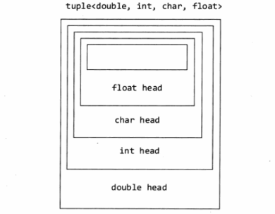

# C++ 新特性

## C++新特性

### C++ 11有哪些新特性

* nullptr替代 NULL
* 引入了 auto 和 decltype 这两个关键字实现了类型推导
* 基于范围的 for 循环for(auto& i : res){}
* 类和结构体的中初始化列表
* Lambda 表达式（匿名函数）
* std::forward\_list（单向链表）
* 右值引用和move语义等

### 智能指针

#### 1.shared\_ptr

shared\_ptr的实现机制是在拷贝构造时使⽤同⼀份引⽤计数

shared\_ptr模版类包含内容：

​ 1.一个模版指针T\* ptr

​ 2.一个引用计数：在底层实现中，这个引用计数器保存在某个内部类型里（这个类型中还包含了deleter，它控制了指针的释放策略，默认情况下就是普通的delete操作），而这个内部类型对象在shared\_ptr第一次构造时以指针的形式保存在shared\_ptr中。

​ 3.重载operator\*和operator->：使得能像指针⼀样使⽤shared\_ptr

​ 4.重载copy constructor（拷贝构造函数）：此时的引用计数加1

​ 5.重载operator=（赋值运算符）：如果原来的shared\_ptr已经有对象，则让其引⽤次数减⼀并判断引⽤是否为零(是否调⽤delete)，然后将新的对象引⽤次数加⼀

​ 6.重载析构函数：使引⽤次数减⼀并判断引⽤是否为零; (是否调⽤delete)

shared\_ptr使用时可能遇到的问题：

​ 1.同时一个shared\_ptr被多个线程”读“是安全的（引用计数管理）

​ 2.同⼀个shared\_ptr被多个线程“写”是不安全的（shared\_ptr仅保证引用计数是原子的，不包括与引用计数相关对象的访问，对于写操作还是得用互斥量等进行额外处理）

​ 3.shared\_ptr失效的唯一情况在循环引用。循环引用指的是，一个引用通过一系列的引用链，最终引用回自身（常常出现在观察者模式中，观察者与目标类之保存着互相的shared\_ptr）。因此它永远无法将内存释放(引用计数始终大于0)，导致内存泄漏。

​ 4.shared\_ptr虽然允许多个无关的shared\_ptr通过赋值操作符实现共享管理，但不允许多个无关shared\_ptr管理同一个裸指针。最好直接用make\_shared接口以实现对象的管理。

​ 5.如果希望一个由shared\_ptr管理的类能够在方法内部得到this指针的shared\_ptr，并且共享管理，则需要继承enable\_shared\_from\_this。

#### 2.weak\_ptr

循环引用的核心在于两个类的内部相互维护着另外一个对象的智能指针，即便将两个类都析构，这个相互（循环）的引用也不会被释放，仍为1。

weak\_ptr是shared\_ptr的"观察者"，它与一个shared\_ptr绑定，但却不参与引用计数的计算，有效避免了循环引用的问题。

同时，在需要的时候，可以随时调用lock方法变为一个shared\_ptr。

在上面提到的观察者模式下，只需要将观察者下的目标对象指针改为weak\_ptr即可（在逻辑上也符合，观察者不应该影响目标对象的资源释放）

#### 3.unique\_ptr

需要将其绑定在一个new返回的指针上，表示同一时刻只有一个unique\_ptr指向给定对象，离开作用域时，如果指向对象，则会将所指对象销毁。

unique不支持拷贝和赋值，不过可以使用release和reset将指针所有权从一个unique\_ptr转移到另一个unique\_ptr。

#### 智能指针注意的点

1. auto\_ptr的出现，主要是为了解决“有异常抛出时发生内存泄漏”的问题；抛出异常，将导致指针p所指向的空间得不到释放而导致内存泄漏；
2. auto\_ptr构造时取得某个对象的控制权，在析构时释放该对象。我们实际上是创建一个auto\_ptr类型的局部对象，该局部对象析构时，会将自身所拥有的指针空间释放，所以不会有内存泄漏；
3. auto\_ptr的构造函数是explicit，阻止了一般指针隐式转换为 auto\_ptr的构造，所以不能直接将一般类型的指针赋值给auto\_ptr类型的对象，必须用auto\_ptr的构造函数创建对象；
4. 由于auto\_ptr对象析构时会删除它所拥有的指针，所以使用时避免多个auto\_ptr对象管理同一个指针；
5. Auto\_ptr内部实现，析构函数中删除对象用的是delete而不是delete\[]，所以auto\_ptr不能管理数组；
6. auto\_ptr支持所拥有的指针类型之间的隐式类型转换。
7. 可以通过\*和->运算符对auto\_ptr所有用的指针进行提领操作；
8. T\* get(),获得auto\_ptr所拥有的指针；T\* release()，释放auto\_ptr的所有权，并将所有用的指针返回。

### 类型推导

#### 1.auto

auto可以让编译器在编译期就推导出变量的类型

​ 1.auto的使⽤对象必须初始化，否则⽆法推导出类型

​ 2.auto在⼀⾏定义多个变量时，各个变量的推导不能产⽣⼆义性，否则编译失败

​ 3.auto不能⽤作函数参数

​ 4.在类中auto不能⽤作⾮静态成员变量

​ 5.auto不能定义数组，可以定义指针

​ 6.auto⽆法推导出模板参数

​ 7.在不声明为引⽤或指针时，auto会忽略等号右边的引⽤类型和cv限定；相反，在声明为引⽤或者指针时，auto会保留等号右边的引⽤和cv属性

#### 2.decltype

decltype则⽤于推导表达式类型，这⾥只⽤于编译器分析表达式的类型，表达式实际不会进⾏运算

decltype不会像auto⼀样忽略引⽤和cv属性，decltype会保留表达式的引⽤和cv属性

对于decltype(exp)：

​ 1.exp是表达式，decltype(exp)和exp类型相同

​ 2.exp是函数调⽤，decltype(exp)和函数返回值类型相同

​ 3.其他情况，若exp为左值，decltype(exp)为exp类型的左值引用

```c++
template<typename T, typename U>
auto add(T a, U b) -> decltype(a+b){
    return a+b;
}
```

#### 3.decltype(auto)

decltype(auto)是C++14新增的类型指示符，可以用来声明变量以及指示函数返回类型。在使用时，会将“=”号右边的表达式替换掉auto，再根据decltype的语法规则来确定类型。

```c++
int e = 4;
const int* f = &e; // f是底层const
decltype(auto) j = f;//j的类型是const int* 并且指向的是e
```

### 右值引用

#### 浅拷贝的后果

在两个指针同时指向一块内存的情况下，在经过一次析构后，会导致其中一个指针悬空，悬空指针的内存释放会发生不可预知的结果。

这样的拷贝构造方式被称为浅拷贝，在未声明拷贝构造函数时，系统自动产生，通常最佳的解决方案是自定义拷贝构造函数实现“深拷贝”

#### 左值与右值

左值：可以放等号左边，可以取地址并有名字

右值：不可以放等号左边，不能取地址，没有名字。右值由两个概念构成，一个是将亡值，另一个是纯右值。纯右值是C++98标准中右值的概念，即用于辨识临时变量和不与对象关联的值。

```
++i,--i为左值;i++,i--为右值
```

将亡值：C++11新增的与右值引用相关的表达式，通常是将要被移动的对象。将亡值可以理解为通过“盗取”其他变量内存空间的方式获取到的值。在确保其他变量不再被使用、或即将被销毁时，通过“盗取”的方式可以避免内存空间的释放和分配，能够延长变量值的生命期。

左值引用：

​ 1.对左值进行引用的类型，是对象的一个别名，并不拥有所绑定的堆存，所以需要立即初始化。

​ 2.对左值引用而言，等号右边的值必须可以取地址，否则会编译失败。

右值引用：

​ 1.可以使⽤std::move函数强制把左值转换为右值。

#### 移动语义

使用场景：

拷贝构造函数中为指针成员分配新内存再进行内容拷贝的做法不可违背，但有些状况下拷贝构造函数并非必须。在数据量很大的时候，深拷贝所需要的资源非常大。这种情况下，可以在临时对象构造的时候不分配内存，而是直接指向需要的堆内存，这种情况是拷贝构造语义。

移动构造函数接受一个右值引用的参数（临时变量引用），原指针需要置为空避免指针悬挂。函数返回临时变量的好处就在于不需要声明变量，也不需要知道生命周期。

具体：

​ 1.将资源的所有权进行转移，被转移者会失去这块资源的所有权。

​ 2.通过移动构造函数使⽤移动语义，也就是std::move；移动语义仅针对于那些实现了移动构造函数的类的对象，对于那种基本类型int、float等没有任何优化作⽤，还是会拷贝，因为它们实现没有对应的移动构造函数。

额外注意：

​ 1.右值作为临时变量，在一些时候不应被声明为const，声明为const将导致临时变量的引用无法修改。

​ 2.对于移动构造函数而言，抛出异常会出现很大的问题，因为这可能导致指针悬挂。为了尽量不抛出异常，可以添加noexcept关键字，在移动构造函数中抛出的异常会直接调用terminate程序终止运行。

#### 其他

类提供的五种默认函数：

​ 默认构造函数，析构函数，拷贝构造函数，拷贝赋值函数，移动构造函数

​ 拷贝构造函数使用的场景：

​ 1.对象作为构造函数的参数，以值传递的方式传递给函数

​ 2.对象作为函数的返回值，以值的方式从函数返回

​ 3.使用一个对象给另一个对象“初始化”

​ 注意，拷贝构造函数和赋值构造函数的核心区别是，后者将对象的值赋给一个已经存在的实例，而前者是创建一个新的对象实例

```c++
Person p;
Person p1 = p; // p1并没有声明，这里是拷贝构造
Person p2;
p2 = p; // p2已经声明，这里是赋值
```

深拷贝/浅拷贝：

​ 1.浅拷贝——a和b的指针指向了同⼀块内存，就是浅拷贝，只是数据的简单赋值（默认的拷贝构造，拷贝赋值）

​ 2.深拷贝——再拷贝对象时，如果被拷贝对象内部还有指针引⽤指向其它资源，⾃⼰需要重新开辟⼀块新内存存储资源

​ 深拷贝的使用场景：a.动态分配内存

​ b.自定义类的资源管理

​ c.容器类中的元素为指针类型

完美转发：

​ 写⼀个接受任意实参的函数模板，并转发到其它函数，⽬标函数会收到与转发函数完全相同的实参，通过引用折叠实现，具体来说：

```c++
void IamForwarding(T && t){
    IrunCodeActually(static_cast<T &&>(t));
}
```

除非传入一个右值，否则都认为输入的是一个左值

### nullptr

nullptr是⽤来代替NULL，⼀般C++会把NULL、0视为同⼀种东西，这取决去编译器如何定义NULL，有的定义为 ((void\*)0)，有的定义为0

C++不允许直接将void\* 隐式转换到其他类型，在进⾏C++重载时会发⽣混乱，这也导致指针如果定义为NULL时出现需要隐式转换的场合编译器报错

C++11引⼊nullptr关键字来区分空指针和0。nullptr 的类型为 nullptr\_t，能够转换为任何指针或成员指针的类型， 也可以进⾏相等或不等的⽐较

### 范围for循环

```c++
for(auto &i : arr){ // 如果是针对arr的修改，最好加上引号
    ...
}
```

### 列表初始化

C++采用花括号进行初始化，被称为列表初始化

在对于内置类型变量进行初始化时，如果使用列表初始化，且初始值存在信息丢失风险时，编译器会报错

```c++
long double d = 3.1415926536;
int a = {d}; // 信息有丢失风险，转换未执行
```

### lambda表达式

lambda表达式表⽰⼀个可调⽤的代码单元，没有命名的内联函数，不需要函数名因为我们直接（⼀次性的）⽤它， 不需要其他地⽅调⽤

\[捕获列表] (参数列表) -> 返回类型 {函数体 }

其中，只有捕获列表和函数体是必要的。大多是情况下，lambda表达式的返回值可由编译器猜测得出

lambda表达式的捕获列表不同内容时的含义：

​ 1.\[]：不捕获任何变量,这种情况下lambda表达式内部不能访问外部的变量

​ 2.\[&]：以引⽤⽅式捕获所有变量（保证lambda执⾏时变量存在）

​ 3.\[=]：⽤值的⽅式捕获所有变量（创建时拷贝，修改对lambda内对象⽆影响)

​ 4.\[=,\&foo]：以引⽤捕获变量foo, 但其余变量都靠值捕获

​ 5.\[bar]：以值⽅式捕获bar; 不捕获其它变量

​ 6.\[this]：捕获所在类的this指针

当定义了一个lambda表达式后，编译器会自动生成一个匿名类（这个类当然重载了()运算符），我们称为闭包类型（closure type）。那么在运行时，这个lambda表达式就会返回一个匿名的闭包实例，其实一个右值。所以，我们上面的lambda表达式的结果就是一个个闭包。闭包的一个强大之处是其可以通过传值或者引用的方式捕捉其封装作用域内的变量，前面的方括号就是用来定义捕捉模式以及变量，我们又将其称为lambda捕捉块。

并发：

#### 1.std::thread

​ std::thread禁止拷贝构造函数

​ 默认构造函数会创建一个空的thread执行对象

​ 初始化构造函数，会创建一个thread对象，该对象可以被joinable，并绑定一个函数执行

​ std::thread还存在一个detach的方法，通过这个方法可以让线程对象和线程函数脱离关系

#### 2.lock\_guard

​ 创建即加锁，作⽤域结束⾃动析构并解锁，⽆需⼿⼯解锁。不能中途解锁，必须等作⽤域结束才解锁。不能复制。

#### 3.unique\_lock

​ uniquelock 是 lockguard 的升级加强版，它具有 lock\_guard 的所有功能，同时又具有其他很多⽅法， 使⽤起来更强灵活⽅便，能够应对更复杂的锁定需要。

特点：

​ 1.创建时可以不锁定（通过指定第⼆个参数为std::defer\_lock），⽽在需要时再锁定

​ 2.可以随时加锁解锁

​ 3.作⽤域规则同 lock\_grard，析构时⾃动释放锁

​ 4.不可复制，可移动

​ 5.条件变量需要该类型的锁作为参数（此时必须使⽤unique\_lock）

## C++11的其他特性

### 变长参数的宏定义

是指在宏定义中参数列表的最后一个参数为省略号，而预定义"\_\_ VA\_ARGS \_\_"则可以在宏定义的实现部分替换省略号代表的字符串，例如：

```c++
#define PR(...) printf(__VA_ARGS__)
```

这样就可以定义printf的别名PR，实际上，变长参数宏和printf往往一起使用，输出不知道具体长度的字符串。

还有一种用法是代替可变参数列表

```c++
#define SYLAR_LOG_FMT_DEBUG(logger, fmt, ...) SYLAR_LOG_FMT_LEVEL(logger, sylar::LogLevel::DEBUG, fmt, __VA_ARGS__)
```

### 断言

在通常情况下，就是将一个返回值总是需要为真的判别式放在语句中，用来排除逻辑不应该发生的情况。

在C++中，标准在< cassert >和\<assert.h>头文件中为提供了assert宏（和直接调用assert函数类似），用于在运行中进行断言。

使用assert的缺点是，频繁的调用会极大的影响程序的性能，增加额外的开销。在调试结束后，可以通过在包含#include \<assert.h>的语句之前插入 #define NDEBUG 来禁用assert调用。还可以使用\ #if 和 #error 实现预处理阶段的断言。

```c++
// 如果 DEBUG_MODE 宏未定义，预处理器将会输出错误消息并中止编译
#if defined(DEBUG_MODE)
#else
    #error "DEBUG_MODE is not defined. Please define it for compilation."
#endif
```

#### 静态断言

assert宏/函数主要用于运行阶段的断言，而 #error 只在编译器预处理时才能起作用（实现断言）。有时候，断言希望出现在编译时（例如模版函数的assert希望被触发，即在编译时触发），这种assert被称为静态断言。在一般的实现上，会使用Boost内置的BOOST\_STATIC\_ASSERT断言机制，但诊断信息不够充分。

在C++11标准中，引入了static\_assert来解决了这个问题。static\_assert使用非常简单，它接受两个参数，一个是断言表达式，这个表达式通常要返回bool值，一个则是警告信息，它通常也就是一段字符串。

```c++
template <typename t, typename u> int bit_copy(t& a, u& b){
    static_assert(sizeof(b) == sizeof(a), "the parameters of bit_copy must have same width.");
}
```

因为是在编译期间的断言，所以使用返回相较于assert更广。但是static\_assert的第一个参数必须是计算期间可以计算的表达式，即必须是常量表达式，如果是变量则会报错

### noexcept修饰符

#### throw和catch

throw 用于在程序执行期间手动引发异常。当程序遇到错误或不可预测的情况时，你可以使用 `throw` 语句来抛出异常对象。这允许程序跳转到适当的异常处理代码。抛出异常的语法为 `throw expression;`，其中 `expression` 是一个可以是任意类型的表达式，通常是异常类的对象。适合在程序的某个点检测到错误或异常情况时，显式地抛出异常，通知上层调用者或异常处理程序。

catch 用于定义异常处理程序，捕获和处理在 try 块中抛出的异常。`catch` 块包含一些代码，它会在匹配特定类型的异常时执行。异常处理的语法为 `catch (exceptionType e) { /* 处理代码 */ }`，其中 `exceptionType` 是期望捕获的异常类型，而 `e` 是一个变量，用于访问异常对象。适合在调用可能抛出异常的代码块时，提供适当的异常处理逻辑。这样可以保证程序在异常发生时能够进行处理而不是崩溃。

#### noexcept

它对应于throw，表示修饰的函数不会抛出异常（告知不会，但不会阻止抛出异常），但如果该函数真的抛出了异常，那么编译器可以选择直接调用std::terminate()函数来终止程序运行，效率上比throw要高，因为不需要额外处理。

noexcept有两种形式，分别是：

```c++
// 1.在函数声明后加上noexcept关键字
void except_func() noexcept;
// 2.接受一个常量表达式作为参数
// 常量表达式的结果会被转化为一个bool类型的值，该值为true表示函数不会抛出异常，反之可能抛出异常
void except_func() noexcept(常量表达式);
```

### 外部模版

#### 外部模版的意义

当不同文件的同一模版实例化的参数相同时，在链接前会生成多个参数相同的模版实例化副本在数据段中，直到链接时再把重复的代码模版删除，保留单个副本，这种工作十分冗余，并且会极大增加编译器的编译和链接时间。解决这个问题的方法和变量共享的思路相同，就是使用“外部的”模本

#### 外部模版的形式

外部模版的声明形式如下：

```c++
extern template void fun<int>(int){}
```

在声明了外部模版后，对应的文件不会再生成`void fun<int>(int)`的实例代码，链接器和编译器的速度得到加快。

### 继承构造函数

派生类只能获得基类的成员变量和虚函数，而非虚函数无法被派生类使用，除非先使用基类的构造函数，并显式的声明。不过可能会出现一种情况，即基类拥有多种构造函数，而派生类为了实现一个接口，需要在自己的构造函数中显式构造不同版本的基类，导致冗余。

这种冗余的解决方案是，如果派生类要使用基类的成员函数，可以通过using声明来实现。同理，对于构造函数而言，也可以使用using声明继承构造函数。

```c++
struct A {
    A(int i) {}
    A(double d, int i){}
}
struct B : A{
    // 基类A的构造函数都被继承到派生类B中
    using A::A;
    virtual void ExtraInterface(){}
}
```

对于使用`using`关键字继承构造函数来说，还有一个关键的意义在于它是隐式声明的，这意味着如果一个继承的构造函数不被代码使用，编译器不会为其产生真正的函数代码，节省了代码空间。

有的时候，基类构造函数的参数会有默认值，这些默认值在使用using时不会继承，同时还要小心重复定义导致的冲突问题。

### 委派构造函数

与继承构造函数类似，委派构造函数的目的也是为了减少多构造函数编写的冗余。

```c++
// 成员初始化的形式
class Info{
public:
    Info() { InitReat(); }
    Info(int i):type(i) { InitReat(); }
    Info(char e):name(e) { InitReadt(); }
private:
    void InitReat() { /其他初始化/ }
    int type = 1;
    char name = 'a';
}

// 委托构造函数的形式
class Info{
public:
    Info() { InitReat(); }
    Info(int i):Info() { type = i; }
    Info(char e):Info() { name = e; }
private:
    void InitReat() { /其他初始化/ }
    int type = 1;
    char name = 'a';
}
```

在初始化列表中调用“基准版本”的构造函数为委派构造函数（`Info(int i)`），而被调用的“基准版本”则为目标构造函数（`Info()`）

不能在初始化列表中既初始化成员，又委托其他构造函数完成构造（`Info()`之后不能初始化成员了）

### 垃圾回收

垃圾回收的方式虽然很多，但主要分成两个大类：

1.基于引用计数的垃圾回收器——

简单来说，引用计数就是使用系统记录对象被引用的次数。当可引用次数变为0时，该对象则被视为垃圾并回收。使用引用计数做垃圾回收的算法优点就是简单，该方法不会造成程序暂停；此外，引用计数也不会对系统的缓存或者交换空间造成冲击，因此“副作用”较小。但是这种方案比较难处理“环形引用”问题，此外由于计数带来的开销，往往会慎重使用。

2.基于跟踪处理的垃圾回收器——

标记-清除算法：这个算法分为两个过程，首先将程序中正在使用的算法视为“根对象”，从根对象开始查找它们所引用的堆空间，并在这些堆空间上做标记。在标记结束后，所有被标记的对象就是可达对象（Reachable Object）或者活对象（Live Object），而没有被标记的对象就被认为是垃圾，第二步的清扫阶段就会被回收。

标记-整理算法：在标记完后不再遍历所有对象清扫垃圾，而是将活的对象向左靠齐，这样就解决了内存碎片的问题。标记-整理的方法需要移动活对象，因此对应的程序中所有对堆内存的引用都必须更新。

标记-拷贝算法：这种算法将堆空间分成两个部分：From和To，刚开始系统只从From的堆空间中分配内存，当From分配满后系统开始垃圾回收：从From堆空间中拷贝所有活的对象，拷贝到To的堆空间里。这样，From的堆空间就只剩下垃圾了。同时，在对象拷贝到To里是也是紧凑排列的。最终只需要将From和To交换角色即可。

垃圾回收的兼容性：

C++11标准中对指针的垃圾回收支持仅限于系统提供的new操作符分配的内存，而malloc分配的内存责备认为是可达的，即无论何时垃圾回收器都不予回收。

### tuple作为变长模版展开

C++11中的tuple使用了递归法，使得模版参数包在实例化时能够层层展开，直到参数包中的参数逐渐耗尽或到达某个数量的边界为止。具体如下：

```c++
template <typename ... Elements> class tuple; // 变长模版声明

template<typename Head, typename... Tail> // 递归的偏特化定义
class tuple<Head, Tail...> : private tuple<Tail ...>{
	Head head;  
};

template<> cklass tuple<> {}; // 边界
```

偏特化版本为双参数的tuple版本，该偏特化版本包含了两个参数，一个是类型模版参数Head，另一个是模版参数包Tail。在另一个版本的实现中，将Head型的数据作为tuple\<Head, Tail…>的第一个成员，而将使用包扩展表达式的模版类tuple\<Tail…>作为tuple\<Head,Tail…>的私有基类。这样一来，当需要实例化一个形如tuple\<double, int, char, float>的类型时，则会引起基类的递归构造，这样的递归构造在tuple的参数包为0的时候会结束。即先从tuple<>构造出tuple< float >，继而分别造出tuple\<char, float>，tuple\<int, char, float>，最后建造出tuple\<double, int, char, float>



## C++14新特性

### 函数返回值推导

可以用auto作为返回类型，除了普通函数外也可以用在模版中

```c++
PS：
1.函数内如果有多个return语句，它们必须返回相同的类型，否则编译失败

2.如果return语句返回初始化列表，返回值类型推导会失败

3.如果函数是虚函数，不能使用返回值类型推导

4.返回类型推导可以用在前向声明中，但是在使用它们之前，翻译单元中必须能够得到函数定义
auto f();               // declared, not yet defined
auto f() { return 42; } // defined, return type is int

int main() {
    cout << f() << endl;
}

5.返回类型推导可以用在递归函数中，但是递归调用必须以至少一个返回语句作为先导，以便编译器推导出返回类型
auto sum(int i) {
    if (i == 1)
        return i;              // return int
    else
        return sum(i - 1) + i; // ok
}

```

### lambda参数auto

在C++11中，lambda表达式参数需要使用具体的类型声明，而C++14中的表达式参数可以直接是auto

```c++
auto f = [] (auto a) { return a; };
cout << f(1) << endl;
cout << f(2.3f) << endl;
```

### 变量模版

变量模版主要是为了解决C++14之前不允许使用模板声明的方式声明一个变量

```c++
template<class T>
constexpr T pi = T(3.1415926535897932385L); // C++14

int main() {
    cout << pi<int> << endl; // 3
    cout << pi<double> << endl; // 3.14159
    return 0;
}
```

### 别名模版

在C++11就已经引入类型别名，形如：using newtype = oldtype

而类型别名可以加上模版参数形成别名模版：

```c++
template<typename T, typename U>
struct A {
    T t;
    U u;
};

template<typename T>
using B = A<T, int>;
```

至此，C++14支持的模版形式为四种——函数模版，类模版，变量模版，别名模版

### 扩大constexpr的使用范围

在C++14中constexpr可以使用局部变量和循环

### \[\[deprecated]]标记

C++14中增加了deprecated标记，修饰类、变、函数等，当程序中使用到了被其修饰的代码时，编译时被产生警告，用户提示开发者该标记修饰的内容将来可能会被丢弃，尽量不要使用。

### 二进制字面量与整形字面量分隔符

二进制字面值：二进制字面值可以使用0b或者0B开头来表示

数位分割符：冗长的符号可以每隔一定位分割进行标记（可以在任意字面量嵌入以提高可读性）

```c++
int a = 0b0001'0011'1010;
double b = 3.14'1234'1234'1234;
```

### std::make\_unique

使用上和std::make\_shared一致

### std::shared\_timed\_mutex与std::shared\_lock

C++14通过std::shared\_timed\_mutex和std::shared\_lock来实现读写锁，保证多个线程可以同时读，但是写线程必须独立运行，写操作不可以同时和读操作一起进行。

### std::integer\_sequence

* std::integer\_sequence\<T,N...>其辅助类模板为std::make\_integer\_sequence\<T,N>，两者的数据类型通常是int，long，float、double、size\_t.
* std::index\_sequence是std::integer\_sequence\<std::size\_t, N...>的一个特殊别名：其数据类型限定为size\_t,对应的辅助类模板为std::make\_index\_sequence< N >。

```c++
template<typename T, T... ints>
void print_sequence(std::integer_sequence<T, ints...> int_seq)
{
    std::cout << "The sequence of size " << int_seq.size() << ": ";
    ((std::cout << ints << ' '), ...);
    std::cout << '\n';
}

int main() {
    print_sequence(std::integer_sequence<int, 9, 2, 5, 1, 9, 1, 6>{});
    return 0;
}

输出：7 9 2 5 1 9 1 6
// 接受一个索引序列 Is...，一个函数 f 和一个 std::tuple 类型的对象 t。它使用 std::get<Is>(t) 从元组 t 中获取元素，并对每个元素应用函数 f。最后，它使用 std::make_tuple 将应用函数 f 后的元素组合成一个新的 std::tuple 并返回。
template <std::size_t... Is, typename F, typename T>
auto map_filter_tuple(F f, T& t) {
    return std::make_tuple(f(std::get<Is>(t))...);
}

// 与上一个版本类似，但它接受一个额外的参数 std::index_sequence<Is...>。这个参数用于在编译时生成一个索引序列，以便在 std::make_tuple 中正确地展开元组 t 的元素。
template <std::size_t... Is, typename F, typename T>
auto map_filter_tuple(std::index_sequence<Is...>, F f, T& t) {
    return std::make_tuple(f(std::get<Is>(t))...);
}

// 接受一个类型 S（通常是 std::index_sequence 的别名），一个函数 f 和一个 std::tuple 类型的对象 t。它首先创建一个与 t 大小相同的索引序列 S{}，然后调用第二个版本的 map_filter_tuple 函数，将索引序列、函数 f 和元组 t 作为参数传递。
template <typename S, typename F, typename T>
auto map_filter_tuple(F&& f, T& t) {
    return map_filter_tuple(S{}, std::forward<F>(f), t);
}
```

### std::exchange

std::exchange使用上和swap类似，但实现上并不是通过像swap通过转移对象实现，而是直接将一个对象的值替换为另一个的值，类似于赋值操作，但它返回被替换的值。

```c++
int main() {
    std::vector<int> v;
    std::exchange(v, {1,2,3,4});
    cout << v.size() << endl;
    for (int a : v) {
        cout << a << " ";
    }
    return 0;
}
```

### std::quoted

C++14引入std::quoted用于给字符串添加双引号

```c++
int main() {
    string str = "hello world";
    cout << str << endl;
    cout << std::quoted(str) << endl;
    return 0;
}
```

## C++ 17新特性

### Nested Namespace（namespace嵌套）

```c++
namespace a::b::c {}
```

在C++17前需要使用大括号嵌套

```c++
namespace a {
	namespace b {
		namespace c {
		
		}
	}
}
```

### Variable declaration in if and switch（在if和else中声明变量）

if和else中声明变量有助于避免在多个同级判断时需要初始化不同名称的变量，即内联变量

### IF constexpr statement（if的constexpr表达式，即条件编译指令）

if constexpr是编译时运行，因此可以加快模版的运行处理（即编译器在编译时根据条件选择性地编译代码）

```c++
#include<iostream>
#include<type_traits>

template<typename T>
void printType() {
    if constexpr (std::is_integral<T>::value) {
        std::cout<< "Integral type"<< std::endl;
    } else if constexpr (std::is_floating_point<T>::value) {
        std::cout<< "Floating point type"<< std::endl;
    } else {
        std::cout<< "Other type"<< std::endl;
    }
}

int main() {
    printType<int>(); // 输出 "Integral type"
    printType<double>(); // 输出 "Floating point type"
    printType<std::string>(); // 输出 "Other type"

    return 0;
}
```

### Structure Bindings（结构体绑定）

通过结构化绑定，对于tuple、map等类型，获取相应值会方便很多（即直接获得对象内部的内容）

```c++
 map<int, string> m = {
      {0, "a"},
      {1, "b"},  
    };
for (const auto &[i, s] : m) {
    cout << i << " " << s << endl;
}
```

结构化绑定还可以通过引用改变对象的值，使用引用即可

```c++
int main() {
    std::pair a(1, 2.3f);
    auto& [i, f] = a;
    i = 2;
    cout << a.first << endl; // 2 
}
```

结构化绑定不止可以绑定pair和tuple，还可以绑定数组和结构体等，甚至是自定义类的结构化绑定。

对于自定义类，需要实现相关的tuple\_size和tuple\_element和get< N >方法\*\*（理解上存在困难，需要补充）\*\*

### Folding Expression（折叠表达式）

C++17引入了折叠表达式使可变参数模板编程更方便：

```c++
// C++17
template <typename ... Ts>
auto sum(Ts ... ts) {
    return (ts + ...);
}
int a {sum(1, 2, 3, 4, 5)}; // 15
std::string a{"hello "};
std::string b{"world"};
cout << sum(a, b) << endl; // hello world

template<typename T1, typename... T>
auto C11_sum(T1 s, T... ts)
{
    return s + C11_sum(ts...);
}
```

### Direct List Initialization of enums（枚举类型的列表初始化）

C++17开始支持enum类型的初始化

```c++
enum byte : unsigned char {}; 
byte b {0}; // OK 
byte c {-1}; // ERROR 
byte d = byte{1}; // OK 
byte e = byte{256}; // ERROR 
```

### 构造函数模版推板

C++17不需要特殊指定，直接就可以推导出模版类型

```c++
pair<int, double> p(1, 2.2); // before c++17
pair p(1, 2.2); // c++17 自动推导
```

### 内联变量

```c++
C++17前只有内联函数，现在有了内联变量
例如：C++类的静态成员变量在头文件中是不能初始化的，但是有了内联变量，就可以达到此目的：
// header file
struct A {
    static const int value;  
};
inline int const A::value = 10;

// ==========或者========
struct A {
    inline static const int value = 10;
}
```

### \_\_has\_include 预处理表达式

可以判断**是否可以包含**某个头文件，代码可能会在不同编译器下工作，不同编译器的可用头文件不同

简单来说就是考虑兼容性判断

```c++
#if defined __has_include
#if __has_include(<charconv>)  
// 如果<charconv>头文件可以被包含，那么has_charconv宏将被定义为1，并且<charconv>头文件将被包含
#define has_charconv 1
#include <charconv>
#endif
#endif
```

### lambda表达式用\*this捕获对象副本

当捕获对象是\*this时，并不会持有this指针，而是直接持有对象的拷贝，这样它的生命周期就与对象的生命周期不相关

```c++
struct A {
    int a;
    void func() {
        auto f = [*this] { // 这里
            cout << a << endl;
        };
        f();
    }  
};
int main() {
    A a;
    a.func();
    return 0;
}
```

### 新增Attribute

C++11和C++14已经可以更方便的使用attribute

```c++
void fatal() __attribute__((noreturn)); // before C++11

// C++11 and C++14
[[carries_dependency]] 让编译期跳过不必要的内存栅栏指令
[[noreturn]] 函数不会返回
[[deprecated]] 函数将弃用的警告

[[noreturn]] void terminate() noexcept;
[[deprecated("use new func instead")]] void func() {}
```

C++17又增加了三个

```c++
[[fallthrough]]:用在switch中提示可以直接落下去，不需要break，让编译期忽略警告
    switch (value) {
        case 1:
            std::cout << "Value is 1."<< std::endl;
            [[fallthrough]];
        case 2:
            std::cout << "Value is 2."<< std::endl;
            break;
        case 3:
            std::cout << "Value is 3."<< std::endl;
            break;
        default:
            std::cout << "Value is not 1, 2, or 3."<< std::endl;
            break;
    }
[[nodiscard]]:表示修饰的内容不能被忽略，可用于修饰函数，标明返回值一定要被处理
[[nodiscard]] int func();
void F() {
    func(); // warning 没有处理函数返回值
}
[[maybe_unused]] ：提示编译器修饰的内容可能暂时没有使用，避免产生警告
void func1() {}
[[maybe_unused]] void func2() {} // 警告消除
void func3() {
    int x = 1;
    [[maybe_unused]] int y = 2; // 警告消除
}
```

### 字符串转换

新增from\_chars函数和to\_chars函数

std::from\_chars 函数用于从字符序列中解析数值。它接受一个字符范围（由开始和结束迭代器定义），并尝试将该范围内的字符解析为指定类型的数值。

如果解析成功，函数将返回一个包含解析后的数值和剩余未解析字符的迭代器的结果对。如果解析失败，函数将返回一个包含错误信息的结果对。

```c++
#include<iostream>
#include<charconv>

int main() {
    std::string str = "123abc";
    int value;
    auto result = std::from_chars(str.data(), str.data() + str.size(), value);

    if (result.ec == std::errc()) {
        std::cout << "Parsed value: "<< value<< std::endl;
        std::cout << "Remaining characters: "<< std::string(result.ptr, str.data() + str.size())<< std::endl;
    } else {
        std::cout << "Parsing failed."<< std::endl;
    }

    return 0;
}
```

std::to\_chars 函数用于将数值格式化为字符序列。它接受一个字符范围（由开始和结束迭代器定义），并尝试将指定类型的数值格式化为该范围内的字符。

如果格式化成功，函数将返回一个指向格式化后的字符序列末尾的迭代器。如果格式化失败（例如，提供的字符范围太小），函数将返回一个指向字符范围开始的迭代器。

```c++
#include<iostream>
#include<charconv>

int main() {
    int value = 12345;
    char buffer[20];
    auto result = std::to_chars(buffer, buffer + sizeof(buffer), value);

    if (result != buffer) {
        // 注意此时可以通过char[]和末尾迭代器作为string的构造参数
        std::cout << "Formatted value: "<< std::string(buffer, result)<< std::endl;
    } else {
        std::cout << "Formatting failed."<< std::endl;
    }

    return 0;
}
```

### std::variant

std::variant实现类似union的功能（类型安全的union），但里面允许的类型更多，包括std::string，map等。

```c++
v.index() //返回变体类型 v 实际所存放数据的类型的下标
std::holds_alternative<T>(v) //可查询变体类型 v 是否存放了 T 类型的数据
    
std::get<I>(v) //如果变体类型 v 存放的数据类型下标为 I，那么返回所存放的数据，否则报错
std::get_if<I>(&v) //如果变体类型 v 存放的数据类型下标为 I，那么返回所存放数据的指针，否则返回空指针
    
std::get<T>(v) //如果变体类型 v 存放的数据类型为 T，那么返回所存放的数据，否则报错
std::get_if<T>(&v) //如果变体类型 v 存放的数据类型为 T，那么返回所存放数据的指针，否则返回空指针

std::visit(f, v) //将变体类型 v 所存放的数据作为参数传给函数 f。
std::visit(f, v, u) //将变体类型 v, u 所存放的数据作为参数传给函数 f。
```

visit函数部分直接写函数名即可

注意，一般情况下variant的第一个类型一般要有对应的构造函数，否则编译失败（这个构造函数还必须是默认构造函数，如果不是默认的话还是错误）

如果想要避免这种情况，可以使用**std::monostate**来打个桩，模拟一个空状态

```c++
std::monostate是一种特殊类型，主要用于作为标记类型（tag type）或占位类型（placeholder type）。它被设计为一个不占用任何空间的类型，用于表示“不包含实际数据”的状态。
这种类型通常在函数签名中作为占位符，用于表示某个函数不接受任何参数或不返回任何数据。

std::variant<int, std::monostate> getInteger(bool condition) {
if (condition) {
    return 42;
  } else {
    return std::monostate{};
  }
}

```

### std::optional

在C++17之前，如果可能返回空对象，最好使用智能指针包裹返回，现在则可以使用std::optional实现

std::optional不仅能把对象作为模版类型，还可以把基本类型作为模版类型

返回为空时是std::nullopt

### std::any

std::any可以存储任何类型的单个值

```
std::any a = 1;
cout << a.type().name() << " " << std::any_cast<int>(a) << endl;
```

any的核心在于即便更改类型，我们仍然可以将其视为类型安全（void\*则不行），因为失败他会抛出bad\_anycast异常

std::any 主要依赖 类型擦除（Type Erasure） 技术来捕获和存储不同类型的数据，它的实现依赖基类 + 模板派生类的方式来存储不同类型的数据，并通过基类提供统一的接口。

在 std::any 的构造函数中，它会根据输入类型T创建 holder\<T>实例，并将其存储在ptr中，这样就实现了获取

### std::apply

std::apply可以将tuple展开作为函数的参数输入，具体来说，只要是可以通过std::get来操作成员的元组容器（std::pair，atd::array，std::tuple），都可以通过std::apply展开。

之前，如果想要展开，需要首先实现一个sequence，里面是从0到size，分别对应`tuple`中的每一个参数，然后再通过`std::get`和折叠展开语法来把tuple中的数据展开到参数列表中。

C++17使用std::apply实现的效果如下：

```c++
#include <iostream>

int sum(int a, int b, int c) {
    return a + b + c;
}

int main(int argc, const char *argv[]) {
    std::tuple tu(1, 2, 3);
    // 注意这里展开的参数数量必须要与函数需要输入的参数一致，否则编译错误
    int res = std::apply(sum, std::move(tu));
    std::cout << res << std::endl; // 输出6
    return 0;
}
```

除了普通函数，apply的第一个参数还可以是函数指针、lambda、仿函数对象，对于非静态函数成员，它需要在第一个参数把调用的对象函数引用输入。

```c++
#include <iostream>
struct TT {
    int sum(int a, int b, int c) {
        return a + b + c;
    }
};

int main(int argc, const char *argv[]) {
    std::tuple tu(TT(), 1, 2, 3); // 第一个成员就是调用成员
    int res = std::apply(&TT::sum, std::move(tu)); // 这里传成员函数指针
    // 效果相当于std::get<0>(tu).sum(1, 2, 3)
    std::cout << res << std::endl;
    return 0;
}

```

如果要考虑到使用apply让tuple在变参模版中展开，需要使用lambda

```c++
#include <iostream>

template <typename... T>
void test(T... arg) {
    (std::cout << ... << arg) << std::endl;
}

int main(int argc, const char *argv[]) {
    std::tuple tu(1, 2.5, "abc");
    std::apply([](auto &&... args) {return test(args...);}, std::move(tu)); // 正常调用
    return 0;
}

```

### std::make\_from\_tuple

主要是解决std::apply无法获得构造函数的函数指针（构造后才能有指针）的问题

```c++
#include <iostream>

class Test {
public:
    Test(int a, double b, const std::string &c): a_(a), b_(b), c_(c) {}
    void show() const {std::cout << a_ << " " << b_ << " " << c_ << std::endl;}
private:
    int a_;
    double b_;
    std::string c_;
};

int main(int argc, const char *argv[]) {
    std::tuple tu(1, 2.5, "abc");
    Test &&t = std::make_from_tuple<Test>(std::move(tu));
    t.show();
    return 0;
}

```

### std::string\_view

通常我们传递一个string时会触发对象的拷贝操作，大字符串的拷贝赋值操作会触发堆内存分配，很影响运行效率，有了string\_view就可以避免拷贝操作，平时传递过程中传递string\_view即可。

string\_view不涉及所有权的转移，即与std::move的关系不大，它只是提供了一种轻量级的字符串引用方式，可以在不拷贝字符串内容的情况下共享字符串数据，即“string视图”（不能修改，只是查看）

```c++
void func(std::string_view stv) { cout << stv << endl; }

int main(void) {
    std::string str = "Hello World";
    std::cout << str << std::endl;

    std::string_view stv(str.c_str(), str.size());
    cout << stv << endl;
    func(stv);
    return 0;
}
```

### as\_const

C++17使用as\_const可以将左值转成const类型

```c++
std::string str = "str";
const std::string& constStr = std::as_const(str);
```

### file\_system

std::fieldsystem基本囊括了关于文件的大部分功能

```c++
#include <filesystem>

// 主要包括以下几个类
1.path 文件路径
2.directory_entry 文件入口
3.directory_iterator 获取文件系统目录中文件的迭代器容器，其元素为 directory_entry 对象
4.file_status 用于获取和修改文件（或目录）的属性
    
// 常用的几个函数
fs::create_directory(dir_path);
fs::copy_file(src, dst, fs::copy_options::skip_existing);
fs::exists(filename);
fs::current_path(err_code);
```

### std::shared\_mutex

适用场景：一个或多个读线程同时读取共享资源，且只有一个写线程来修改这个资源

但一般不直接调用unlock/lock函数进行加锁/解锁，而是结合std::lock\_guard和std::shared\_lock一起使用

下面测试用例中时间消耗大概减少了一半

```c++
#include "stdafx.h"
#include <mutex>
#include <shared_mutex>
#include <thread>
#include <list>
#include <iostream>
#include <vector>
 
#define READ_THREAD_COUNT 8  
#define LOOP_COUNT 5000000  
 
typedef std::shared_lock<std::shared_mutex> ReadLock;
typedef std::lock_guard<std::shared_mutex> WriteLock;
typedef std::lock_guard<std::mutex> NormalLock;
 
class shared_mutex_counter {
public:
    shared_mutex_counter() = default;
 
    unsigned int get() const {
        ReadLock lock(mutex);
        return value;
    }
 
    void increment() {
        WriteLock lock(mutex);
        value++;
    }
 
private:
    mutable std::shared_mutex mutex;
    unsigned int value = 0;
};
 
class mutex_counter {
public:
    mutex_counter() = default;
 
    unsigned int get() const {
        NormalLock lock(mutex);
        return value;
    }
 
    void increment() {
        NormalLock lock(mutex);
        value++;
    }
 
private:
    mutable std::mutex mutex;
    unsigned int value = 0;
};
 
class timers
{
public:
    timers()
    {
        m_begin = std::chrono::high_resolution_clock::now();
    }
 
    ~timers()
    {
        m_end = std::chrono::high_resolution_clock::now();
        Consuming();
    }
 
    void Consuming()
    {
        std::cout << "Time-consuming:" << std::chrono::duration_cast<std::chrono::duration<float, std::milli>>(m_end - m_begin).count() << std::endl;
    }
 
private:
    std::chrono::high_resolution_clock::time_point m_begin;
    std::chrono::high_resolution_clock::time_point m_end;
};
 
 
void test_shared_mutex()
{
    shared_mutex_counter counter;
    unsigned int temp;
 
    auto writer = [&counter]() {
        for (unsigned int i = 0; i < LOOP_COUNT; i++){
            counter.increment();
        }
    };
 
    auto reader = [&counter, &temp]() {
        for (unsigned int i = 0; i < LOOP_COUNT; i++) {
            temp = counter.get();
        }
    };
 
    std::cout << "----- shared mutex test ------" << std::endl;
    std::list<std::shared_ptr<std::thread>> threadlist;
    {
        timers timer;
 
        for (int i = 0; i < READ_THREAD_COUNT; i++)
        {
            threadlist.push_back(std::make_shared<std::thread>(reader));
        }
        std::shared_ptr<std::thread> pw = std::make_shared<std::thread>(writer);
 
        for (auto &it : threadlist)
        {
            it->join();
        }
        pw->join();
    }
    std::cout <<"count:"<< counter.get() << ", temp:" << temp << std::endl;
}
 
void test_mutex()
{
    mutex_counter counter;
    unsigned int temp;
 
    auto writer = [&counter]() {
        for (unsigned int i = 0; i < LOOP_COUNT; i++) {
            counter.increment();
        }
    };
 
    auto reader = [&counter, &temp]() {
        for (unsigned int i = 0; i < LOOP_COUNT; i++) {
            temp = counter.get();
        }
    };
 
    std::cout << "----- mutex test ------" << std::endl;
    std::list<std::shared_ptr<std::thread>> threadlist;
    {
        timers timer;
 
        for (int i = 0; i < READ_THREAD_COUNT; i++)
        {
            threadlist.push_back(std::make_shared<std::thread>(reader));
        }
 
        std::shared_ptr<std::thread> pw = std::make_shared<std::thread>(writer);
 
        for (auto &it : threadlist)
        {
            it->join();
        }
        pw->join();
    }
    std::cout << "count:" << counter.get() << ", temp:" << temp << std::endl;
}
 
 
 
int main()
{
    test_shared_mutex();
    test_mutex();
    return 0;
}
```
