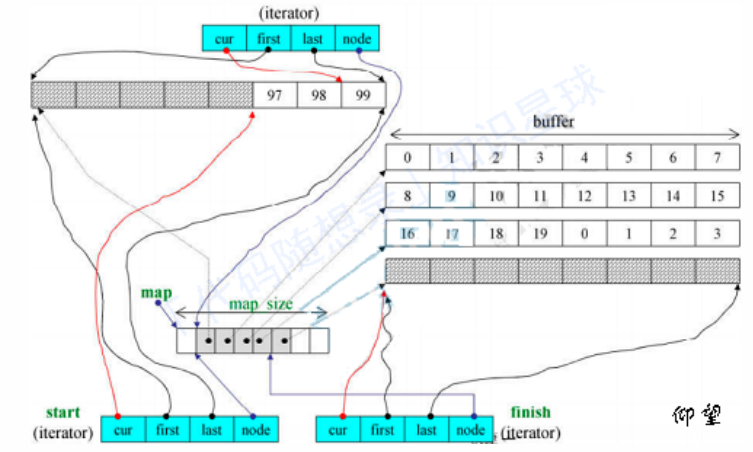
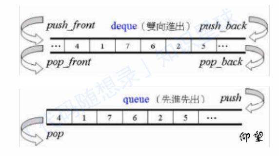
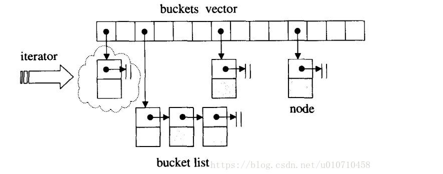
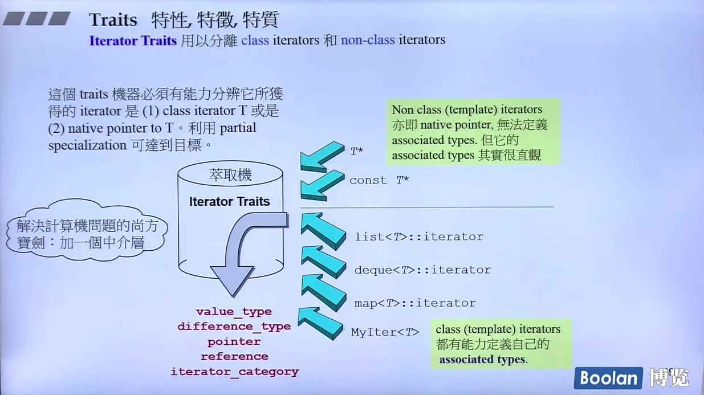

# C++STL

## STL原理及其实现

STL提供的六大组件——容器、算法、迭代器、仿函数、适配器（配接器）、空间配置器

六大组件的相互关系：

​ 1.容器通过空间配置器取得数据存储空间

​ 2.算法通过迭代器存储容器中的内容

​ 3.仿函数可以协助算法完成不同的策略的变化

​ 4.适配器可以修饰仿函数

STL的分类：

​ 1.序列式容器——array，list，vector，deque，stack，queue等（array的大小会在一开始就确定，与其他标准容器不同，它是一个固定大小的数组容器）

​ 2.关系式容器——set，map，multiset，multimap，unordered\_set，unordered\_map等

### 1.容器

​ 各种数据结构，如vector、list（双向链表）、deque、set、map等，⽤来存放数据，从实现⾓度来看，STL容器是⼀种class template

### 2.算法

​ 常⽤的算法，如sort、find、copy、for\_each。从实现的⾓度来看，STL算法是⼀种function tempalte

### 3.迭代器

​ 容器与算法之间的胶合剂，共有五种类型，从实现⾓度来看，迭代器是⼀种将operator\* , operator-> , operator++,operator–等指针相关操作予以重载的class template

​ 所有STL容器都附带有⾃⼰专属的迭代器，只有容器的设计者才知道如何遍历⾃⼰的元素

​ 原⽣指针(native pointer，即直接使用的C++指针)也是⼀种迭代器

### 4.仿函数

​ ⾏为类似函数，可作为算法的某种策略。从实现⾓度来看，仿函数是⼀种重载了operator()的class 或者class template

### 5.适配器

​ ⽤来修饰容器或者仿函数或迭代器接口。

​ STL提供的queue 和 stack，虽然看似容器，但其实只能算是⼀种容器配接器，因为它们的底部完全借助deque，所有操作都由底层的deque供应

### 6.空间配置器

​ 负责空间的配置与管理。从实现⾓度看，配置器是⼀个实现了动态空间配置、空间管理、空间释放的class tempalte

​ ⼀般的分配器的std:alloctor都含有两个函数allocate与deallocte，这两个函数分别调⽤operator new()与delete()，这 两个函数的底层又分别是malloc()and free();但是每次malloc会带来格外开销（因为每次malloc⼀个元素都要带有附加信息）

### STL的优点

​ 1.高可重用性——几乎所有的代码都是模版类和模版函数

​ 2.高性能——红黑树与哈希表在关系式容器中的高效查询

​ 3.高移植性——数据与操作分离，编写的STL模块可以直接移植

## vector

vector在堆中分配了一段连续的内存空间来存放元素

包含三个迭代器：

​ 1.first：vector中对象的起始字节位置

​ 2.last：当前最后一个元素的末尾字节位置

​ 3.end：指向整个vector容器所占内存空间的末尾字节

### 扩容过程

需要新分配一块更大的内存，将原来的数据复制，并释放之前的内存，插入新增的元素。

size()方法返回当前已经存储的元素的个数，capacity()方法返回当前分配内存下可以保存的元素个数。

### 固定扩容（一般不用）

每次增加固定的容量，虽然利用率高，但很容易导致反复扩容的情况，时间复杂度高。

### 加倍扩容（STL扩容方法）

每次扩容的时候capacity翻倍，此时预留空间较多，时间复杂度低。

### 方法与重要成员

resize()——改变当前容器内含有元素的数量，而不是容器的数量

reverse()——改变当前容器的最大容量（capacity）

vector迭代器——由于vector维护的是⼀个线性区间，所以普通指针具备作为vector迭代器的所有条件，就不需要重载 operator+，operator\*等方法

元素操作——pop\_back，erase，clear，insert，push\_back

## list

每个元素都是放在⼀块内存中，内存空间可以是不连续的，通过指针来进⾏数据的访问。常⽤来做随机插⼊和删除操作容器。

list属于双向链表，其结点与list本⾝是分开设计的。

list是⼀个环状的双向链表，同时它也满⾜STL对于“前闭后开”的原则，即在链表尾端可以加上空⽩节点

### （list）迭代器的设计

迭代器中的五种属性（属于迭代器的特征，iterator traits）：

​ 1.value\_type：迭代器所指对象的类型

​ 2.difference\_type：表示两个迭代器之间的距离的类型

​ 3.reference：迭代器得到的引用类型，通常是value\_type&

​ 4.reference：迭代器支持的指针类型，通常是value\_type\*

​ 5.iterator\_catrgory：input\_iterator，output\_iterator，forward\_iterator，bidrectional\_iterator，random\_access

std::iterator\_traits可以在输入iterator的情况下调用这五种方法查看对应的属性，然后让泛型算法对他们进行一致的操作。

### vector和list的区别

1.vector底层实现是数组；list是双向链表

2.vector是顺序内存,⽀持随机访问，list不⾏

3.vector在中间节点进⾏插⼊删除会导致内存拷贝，list不会

4.vector⼀次性分配好内存，不够时才进⾏翻倍扩容；list每次插⼊新节点都会进⾏内存申请

5.vector随机访问性能好，插⼊删除性能差；list随机访问性能差，插⼊删除性能好

## deque（双端列表）

deque支持快速随机访问，由于deque需要处理内部跳转，因此速度上没有vector快。

deque是⼀个双端开口的连续线性空间，其内部为分段连续的空间组成，随时可以增加⼀段新的空间并链接。

```
由于deque的迭代器⽐vector要复杂，这影响了各个运算层⾯，所以除⾮必要尽量使⽤vector；为了提⾼效率，在对deque进⾏排序操作的时候，我们可以先把deque复制到vector中再进⾏排序最后在复制回deque
```

deque可以在头部或尾端加入新的空间，避免了vector的“重新配置，复制，释放”的轮回，维护连整体连续的假象，并提供随机访问的接口。不过这样也导致了其迭代器的复杂性。



deque采用一块map（指的是一段连续的内存空间，不是std::map）作为控制中心，其中的每个元素都是指针，指向另一片连续线性空间，称为缓冲区，这个区才是用来储存数据的。

deque除了维护⼀个map指针以外，还维护了start与finish迭代器分别指向第⼀缓冲区的第⼀个元素，和最后⼀个缓冲区的最后⼀个元素的下⼀个元素，同时它还必须记住当前map的⼤⼩。

deque的插入和删除操作相比vector效率要更高，但访问速度上相比vector要慢一些。

## stack/queue

栈与队列被称之为duque的配接器，其底层是以deque为底部架构。通过deque执⾏具体操作。



以queue为例，在以deque为底层实现时，它的push方法本质就是deque中的push\_back，并且它不提供pop\_back方法。

## heap/priority\_queue

heap：建立在完全二叉树（仅允许最后一层不满，最后一层都是满的就是满二叉树）上，分为两种：大根堆（父节点的值一定大于子节点，最大值一定在根节点），小跟堆（父节点的值一定小于子节点，最小值一定在根节点）

priority\_queue：也是配接器。其内的元素不是按照被推⼊的顺序排列，⽽是⾃动取元素的权值排列，确省情况下利⽤⼀个max-heap（大根堆）完成，后者是以vector表现的完全⼆叉树

## map/set

这两个容器的底层都是采用红黑树实现。

set：用来判断一个元素是不是在一个组里面

map：相当于字典，把一个值映射成另一个值

优势——查找一个数的时间为O(logn)，遍历时采用iterator，效果不错

缺点——每次插入值的时候都需要调整红黑树，存在一定的效率影响

## map/unordered\_map

map：

​ 1.底层基于红⿊树实现，因此map内部元素排列是有序的。

​ 2.有序性，这是map结构最⼤的优点，其元素的有序性在很多应⽤中都会简化很多的操作。map的查找、删除、增加等⼀系列操作时间复杂度稳定，都为O(logn)。

​ 3.查找、删除、增加等操作平均时间复杂度较慢，与n相关。

unordered\_map：

​ 1.底层基于哈希表实现，因此其元素的排列顺序是杂乱⽆序的。

​ 2.查找、删除、添加的速度快，时间复杂度为常数级O(1）。

​ 3.unordered\_map内部基于哈希表，以（key,value）对的形式存储，因此空间占⽤率⾼。

​ 4.unordered\_map的查找、删除、添加的时间复杂度不稳定，平均为O(1)，取决于哈希函数。极端情况下可能为 O(n)。

### 问题

​ 1.为什么insert之后，map和set以前保存的iterator不会失效？

​ 因为 map 和 set 存储的是结点，不需要内存拷⻉和内存移动。

​ 2.为何map和set的插⼊删除效率⽐其他序列容器⾼？

​ map 和 set 底部使⽤红⿊树实现，插⼊和删除的时间复杂度是 O(logn)，⽽向 vector 这样的序列容器插⼊和删除的时间复杂度是 O(N)。

## STL题目

### 什么是STL

C++ STL从广义来讲包括了三类：算法，容器和迭代器。

* 算法包括排序，复制等常用算法，以及不同容器特定的算法。
* 容器就是数据的存放形式，包括序列式容器和关联式容器，序列式容器就是list，vector等，关联式容器就是set，map等。
* 迭代器就是在不暴露容器内部结构的情况下对容器的遍历。

### 什么是trivial destructor

“trivial destructor”一般是指用户没有自定义析构函数，而由系统生成的，或者说“平凡的”

反之，用户自定义了析构函数，则称之为“non-trivial destructor”，这种析构函数**如果申请了新的空间一定要显式的释放，否则会造成内存泄露**

首先利用value\_type()获取所指对象的型别，再利用type\_traits判断该型别的析构函数是否trivial，若是(true\_type)，则什么也不做，若为(false\_type)，则去调用destory()函数。也就是说，在实际的应用当中，STL库提供了相关的判断方法**type\_traits**（简单来说就是通过萃取器获得该类型的析构函数是否为平凡）

### RAII

RAII全称是“Resource Acquisition is Initialization”，直译过来是“资源获取即初始化”，也就是说在构造函数中申请分配资源，在析构函数中释放资源。

因为C++的语言机制保证了，当一个对象创建的时候，自动调用构造函数，当对象超出作用域的时候会自动调用析构函数。所以，在RAII的指导下，我们应该使用类来管理资源，将资源和对象的生命周期绑定。

智能指针（std::shared\_ptr和std::unique\_ptr）即RAII最具代表的实现，使用智能指针，可以实现自动的内存管理，再也不需要担心忘记delete造成的内存泄漏。

### 迭代器：++it、it++哪个好，为什么

前置返回一个引用，后置返回一个对象。前置不会产生临时对象，后置必须产生临时对象，临时对象会导致效率降低。

### STL中hashtable的实现

STL中的hashtable使用的是**开链法**解决hash冲突问题。



hashtable中的bucket所维护的list既不是list也不是slist，而是其自己定义的由hashtable\_node数据结构组成的linked-list，而bucket聚合体本身使用vector进行存储。hashtable的迭代器只提供前进操作，不提供后退操作。

在hashtable设计bucket的数量上，其内置了28个质数\[53, 97, 193,...,429496729]，在创建hashtable时，会根据存入的元素个数选择大于等于元素个数的质数作为hashtable的容量（vector的长度），其中每个bucket所维护的linked-list长度也等于hashtable的容量。如果插入hashtable的元素个数超过了bucket的容量，就要进行重建table操作，即找出下一个质数，创建新的buckets vector，重新计算元素在新hashtable的位置。

### traits

traits技法利用“内嵌型别“的编程技巧与**编译器的template参数推导功能**，增强C++未能提供的关于型别认证方面的能力。常用的有iterator\_traits和type\_traits。

对于Non class(iterators) iterators而言，输入的是native pointer（指针）并不是一个类（输入的是容器的指针而不是容器本体），此时是一个退化的指针，不能直接回答算法的提问。因此必须必须使用Traits来提取这些特征。



iterator\_traits：被称为**特性萃取机**，能够方便的让外界获取以下5种型别：

* value\_type：迭代器所指对象的型别
* difference\_type：两个迭代器之间距离的type
* pointer：迭代器所指向的型别
* reference：迭代器所引用的型别
* iterator\_category：input，output，forward，bidrectional，random access

type\_traits：关注的是**型别的特性**，例如这个型别是否具备non-trivial defalt ctor（默认构造函数）、non-trivial copy ctor（拷贝构造函数）、non-trivial assignment operator（赋值运算符） 和non-trivial dtor（析构函数），如果答案是否定的，可以采取直接操作内存的方式提高效率。

除了上述两种traits之外，还有：

### STL的两级空间配置器

为什么需要两级空间配置

动态开辟内存时，要在堆上申请，但若是频繁的在堆开辟释放内存，则就会在堆上造成很多外部碎片，浪费了内存空间；

每次都要进行调用malloc、free函数等操作，使空间就会增加一些附加信息，降低了空间利用率；随着外部碎片增多，内存分配器在找不到合适内存情况下需要合并空闲块，浪费了时间，大大降低了效率。

于是就设置了二级空间配置器，当开辟内存<=128bytes时，即视为开辟小块内存，则调用二级空间配置器。（brk和mmap的边界是128K）

关于STL中一级空间配置器和二级空间配置器的选择上，一般默认选择的为二级空间配置器。 如果大于128字节再转去一级配置器器。

#### 一级配置器

**一级空间配置器**中重要的函数就是allocate、deallocate、reallocate 。 一级空间配置器是以malloc()，free()，realloc()等C函数执行实际的内存配置 。大致过程是：

1、直接allocate分配内存，其实就是malloc来分配内存，成功则直接返回，失败就调用处理函数

2、如果用户自定义了内存分配失败的处理函数就调用，没有的话就返回异常

3、如果自定义了处理函数就进行处理，完事再继续分配试试


#### 二级分配器

维护16条链表，分别是0-15号链表，最小8字节，以8字节逐渐递增，最大128字节，需要多少字节，校对到第几号链表（如需要13bytes空间，我们会给它分配16bytes大小），在找到第n个链表后查看链表是否为空，如果不为空直接从对应的free\_list中拔出，将已经拨出的指针向后移动一位。

对应的free\_list为空，先看其内存池是不是空时，如果内存池不为空：

（1）先检验它剩余空间是否够20个节点大小（即所需内存大小(提升后) \* 20），若足够则直接从内存池中拿出20个节点大小空间，将其中一个分配给用户使用，另外19个当作自由链表中的区块挂在相应的free\_list下，这样下次再有相同大小的内存需求时，可直接拨出。

（2）如果不够20个节点大小，则看它是否能满足1个节点大小，如果够的话则直接拿出一个分配给用户，然后从剩余的空间中分配尽可能多的节点挂在相应的free\_list中。

（3）如果连一个节点内存都不能满足的话，则将内存池中剩余的空间挂在相应的free\_list中（找到相应的free\_list），然后再给内存池申请内存

内存池为空，申请内存 此时二级空间配置器会使用malloc()从heap上申请内存，（一次所申请的内存大小为2 \* 所需节点内存大小（提升后）\* 20 + 一段额外空间），申请40块，一半拿来用，一半放内存池中。

malloc没有成功 在第三种情况下，如果malloc()失败了，说明heap上没有足够空间分配给我们了，这时，二级空间配置器会从比所需节点空间大的free\_list中一一搜索，从比它所需节点空间大的free\_list中拔除一个节点来使用。如果这也没找到，说明比其大的free\_list中都没有自由区块了，那就要调用一级适配器了。

释放时调用deallocate()函数，若释放的n>128，则调用一级空间配置器，否则就直接将内存块挂上自由链表的合适位置。

二级分配器的问题：

1.因为自由链表的管理问题，它会把我们需求的内存块自动提升为8的倍数，这时若你需要1个字节，它会给你8个字节，即浪费了7个字节，所以它又引入了内部碎片的问题，若相似情况出现很多次，就会造成很多内部碎片；

2.二级空间配置器是在堆上申请大块的狭义内存池，然后用自由链表管理，供现在使用，在程序执行过程中，它将申请的内存一块一块都挂在自由链表上，即不会还给操作系统，并且它的实现中所有成员全是静态的，所以它申请的所有内存只有在进程结束才会释放内存，还给操作系统，由此带来的问题有：

​ 1.即我不断的开辟小块内存，最后整个堆上的空间都被挂在自由链表上，若我想开辟大块内存就会失败；

​ 2.若自由链表上挂很多内存块没有被使用，当前进程又占着内存不释放，这时别的进程在堆上申请不到空间，也不可以使用当前进程的空闲内存，由此就会引发多种问题。

### vector与list的区别与应用，怎么找某vector或者list的倒数第二个元素

vector和数组类似，拥有一段连续的内存空间，并且起始地址不变。因此能高效的进行随机存取，时间复杂度为o(1);但因为内存空间是连续的，所以在进行插入和删除操作时，会造成内存块的拷贝，时间复杂度为o(n)。

当数组中内存空间不够时，会重新申请一块内存空间并进行内存拷贝。连续存储结构：vector是可以实现动态增长的对象数组，支持对数组高效率的访问和在数组尾端的删除和插入操作，在中间和头部删除和插入相对不易，需要挪动大量的数据。vector的原大小如果为0，则配置容量默认为1.

list是由双向链表实现的，因此内存空间是不连续的。只能通过指针访问数据，所以list的随机存取非常没有效率，时间复杂度为o(n);但由于链表的特点，能高效地进行插入和删除。非连续存储结构：list是一个双链表结构，支持对链表的双向遍历。每个节点包括三个信息：元素本身，指向前一个元素的节点（prev）和指向下一个元素的节点（next）。因此list可以高效率的对数据元素任意位置进行访问和插入删除等操作。由于涉及对额外指针的维护，所以开销比较大。

区别：

* vector的随机访问效率高，但在插入和删除时（不包括尾部）需要挪动数据，不易操作。
* list的访问要遍历整个链表，它的随机访问效率低。但对数据的插入和删除操作等都比较方便，改变指针的指向即可。
* 从遍历上来说，list是单向的，vector是双向的。
* vector中的迭代器在使用后就失效了（这里的使用指的是如果在插入或删除元素的过程中，导致动态数组的重新分配（capacity的增加），那么已经获取的迭代器可能会失效，因为重新分配可能导致原来的内存地址无效），而list的迭代器在使用之后还可以继续使用。

### STL 中vector删除其中的元素，迭代器如何变化？为什么是两倍扩容？释放空间？

size()函数返回的是已用空间大小，capacity()返回的是总空间大小，capacity()-size()则是剩余的可用空间大小。当size()和capacity()相等，说明vector目前的空间已被用完，如果再添加新元素，则会引起vector空间的动态增长。

由于动态增长会引起重新分配内存空间、拷贝原空间、释放原空间，这些过程会降低程序效率。因此，可以使用reserve(n)预先分配一块较大的指定大小的内存空间，这样当指定大小的内存空间未使用完时，是不会重新分配内存空间的，这样便提升了效率。只有当n>capacity()时，调用reserve(n)才会改变vector容量。resize()成员函数则改变元素的数目。

1、空的vector对象，size()和capacity()都为0

2、当空间大小不足时，新分配的空间大小为原空间大小的2倍。

3、使用reserve()预先分配一块内存后，在空间未满的情况下，不会引起重新分配，从而提升了效率。

4、当reserve()分配的空间比原空间小时，是不会引起重新分配的。

5、resize()函数只改变容器的元素数目，未改变容器大小。

6、用reserve(size\_type)只是扩大capacity值，这些内存空间可能还是“野”的，如果此时使用“\[ ]”来访问，则可能会越界。而resize(size\_type new\_size)会真正使容器具有new\_size个对象。

7、不同的编译器，vector有不同的扩容大小。在vs下是1.5倍，在GCC下是2倍；

### vector如何释放空间

由于vector的内存占用空间只增不减，比如你首先分配了10,000个字节，然后erase掉后面9,999个，留下一个有效元素，但是内存占用仍为10,000个。所有内存空间是在vector析构时候才能被系统回收。empty()用来检测容器是否为空的，clear()可以清空所有元素。但是即使clear()，vector所占用的内存空间依然如故，无法保证内存的回收。

如果需要空间动态缩小，可以考虑使用deque。如果使用vector，可以用swap()来帮助你释放多余内存或者清空全部内存。

```c++
vector(Vec).swap(Vec); //将Vec中多余内存清除； 
vector().swap(Vec); //清空Vec的全部内存；
```

### 容器内部如何删除一个元素

顺序容器（序列式容器，比如vector、deque）

erase迭代器不仅使所指向被删除的迭代器失效，而且使被删元素之后的所有迭代器失效(list除外)，所以不能使用erase(it++)的方式，但是erase的返回值是下一个有效迭代器；

It = c.erase(it);

关联容器(关联式容器，比如map、set、multimap、multiset等)

erase迭代器只是被删除元素的迭代器失效，但是返回值是void，所以要采用erase(it++)的方式删除迭代器；

c.erase(it++)

### STL迭代器如何实现

1.迭代器是一种抽象的设计理念，通过迭代器可以在不了解容器内部原理的情况下遍历容器，除此之外，STL中迭代器一个最重要的作用就是作为容器与STL算法的粘合剂。

2.迭代器的作用就是提供一个遍历容器内部所有元素的接口，因此迭代器内部必须保存一个与容器相关联的指针，然后重载各种运算操作来遍历，其中最重要的是\*运算符与->运算符，以及++、--等可能需要重载的运算符重载。这和C++中的智能指针很像，智能指针也是将一个指针封装，然后通过引用计数或是其他方法完成自动释放内存的功能。

3.最常用的迭代器的相应型别有五种：value type、difference type、pointer、reference、iterator catagoly

### map、set是怎么实现的，红黑树是怎么能够同时实现这两种容器？ 为什么使用红黑树？

1. 他们的底层都是以红黑树的结构实现，因此插入删除等操作都在O(logn时间内完成，因此可以完成高效的插入删除；
2. 实现map的红黑树的节点数据类型是key+value，而实现set的节点数据类型是value
3. 因为map和set要求是自动排序的，红黑树能够实现这一功能，而且时间复杂度比较低。

### 如何在共享内存上使用STL标准库

如果进程A把容器放在共享内存中的确定地址上（fixed offsets），则进程B可以从该已知地址上获取容器。

另外一个改进点的办法是，进程A先在共享内存某块确定地址上放置一个map容器，然后进程A再创建其他容器，然后给其取个名字和地址一并保存到这个map容器里。进程B知道如何获取该保存了地址映射的map容器，然后同样再根据名字取得其他容器的地址。

### map的插入方式有几种

1.用insert函数插入pair数据

```c++
mapStudent.insert(pair<int, string>(1, "student_one")); 
```

2.用insert函数插入value\_type数据

```c++
mapStudent.insert(map<int, string>::value_type (1, "student_one"));
```

3.在insert函数中使用make\_pair()函数

```c++
mapStudent.insert(make_pair(1, "student_one")); 
```

4.用数组方式插入数据

```c++
mapStudent[1] = "student_one"; 
```

### STL中unordered\_map和map的区别，hash\_map如何解决冲突以及扩容

1. unordered\_map和map类似，都是存储的key-value的值，可以通过key快速索引到value。不同的是unordered\_map不会根据key的大小进行排序，
2. 存储时是根据key的hash值判断元素是否相同，即unordered\_map内部元素是无序的，而map中的元素是按照二叉搜索树存储，进行中序遍历会得到有序遍历。
3. 所以使用时map的key需要定义operator<。而unordered\_map需要定义hash\_value函数并且重载operator==。但是很多系统内置的数据类型都自带这些，
4. 那么如果是自定义类型，那么就需要自己重载operator<或者hash\_value()了。
5. 如果需要内部元素自动排序，使用map，不需要排序使用unordered\_map
6. unordered\_map的底层实现是hash\_table;
7. hash\_map底层使用的是hash\_table，而hash\_table使用的开链法进行冲突避免，所有hash\_map采用开链法进行冲突解决。
8. \*\*什么时候扩容：\*\*当向容器添加元素的时候，会判断当前容器的元素个数，如果大于等于阈值---即当前数组的长度乘以加载因子的值的时候，就要自动扩容啦。
9. \*\*扩容(resize)\*\*就是重新计算容量，向HashMap对象里不停的添加元素，而HashMap对象内部的数组无法装载更多的元素时，对象就需要扩大数组的长度，以便能装入更多的元素。这就是rehash，新的数组容量通常选择为原容量的两倍。

### vector越界访问下标，map越界访问下标？vector删除元素时会不会释放空间？

1. 通过下标访问vector中的元素时会做边界检查，但该处的实现方式要看具体IDE，不同IDE的实现方式不一样，确保不可访问越界地址。
2. map的下标运算符\[]的作用是：将key作为下标去执行查找，并返回相应的值；如果不存在这个key，就将一个具有该key和value的值插入这个map。
3. erase()函数，只能删除内容，不能改变容量大小;

erase成员函数，它删除了vector下迭代器指向的元素，并且返回要被删除的迭代器之后的迭代器，迭代器相当于一个智能指针;clear()函数，只能清空内容，不能改变容量大小;如果要想在删除内容的同时释放内存，那么你可以选择deque容器。

### deque的实现

`deque`（双端队列）容器提供了一种有效的方式来在队列的两端执行快速插入和删除操作，并且在删除内容的同时释放内存时，`deque`相较于其他容器有一些优势。包括：

1. **内存管理：** `deque` 内部通常是由多个块组成，每个块都是一个动态分配的数组，这些数组块按需增长或缩小。当你从两端插入或删除元素时，`deque` 会在需要的时候分配或释放块，从而更灵活地管理内存。
2. **迭代器的稳定性：** `deque` 的迭代器在插入和删除元素时的稳定性相对较好。对于 `vector`，插入和删除操作可能会使得所有的迭代器失效，而对于 `deque`，只有涉及到被修改的部分的迭代器会失效。
3. **高效的两端操作：** `deque` 提供了高效的两端操作，即在队列的前端和后端执行插入和删除操作的性能通常都很好。

### map中\[]与find的区别

1. map的下标运算符\[]的作用是：将关键码作为下标去执行查找，并返回对应的值；如果不存在这个关键码，就将一个具有该关键码和值类型的默认值的项插入这个map。
2. map的find函数：用关键码执行查找，找到了返回该位置的迭代器；如果不存在这个关键码，就返回尾迭代器。

### STL中list与queue之间的区别

1. list不再能够像vector一样以普通指针作为迭代器，因为其节点不保证在存储空间中连续存在；
2. list不仅是一个双向链表，而且还是一个环状双向链表，所以它只需要一个指针；
3. list不像vector那样有可能在空间不足时做重新配置、数据移动的操作，所以插入前的所有迭代器在插入操作之后都仍然有效；
4. deque是一种双向开口的连续线性空间，所谓双向开口，意思是可以在头尾两端分别做元素的插入和删除操作；
5. deque和vector最大的差异，一在于deque允许常数时间内对起头端进行元素的插入或移除操作；二在于deque没有所谓容量概念，因为它是动态地以分段连续空间组合而成，随时可以增加一段新的空间并链接起来，deque没有所谓的空间保留功能。

### STL中的allocator、deallocator

1. 第一级配置器直接使用malloc()、free()和relloc()，第二级配置器视情况采用不同的策略：当配置区块超过128bytes时，视之为足够大，便调用第一级配置器；当配置器区块小于128bytes时，为了降低额外负担，使用复杂的内存池整理方式，而不再用一级配置器；
2. 第二级配置器主动将任何小额区块的内存需求量上调至8的倍数，并维护16个free-list，各自管理大小为8\~128bytes的小额区块；
3. 空间配置函数allocate()，首先判断区块大小，大于128就直接调用第一级配置器，小于128时就检查对应的free-list。如果free-list之内有可用区块，就直接拿来用，如果没有可用区块，就将区块大小调整至8的倍数，然后调用refill()，为free-list重新分配空间；
4. 空间释放函数deallocate()，该函数首先判断区块大小，大于128bytes时，直接调用一级配置器，小于128bytes就找到对应的free-list然后释放内存

### STL中hash table扩容发生什么

1. hash table表格内的元素称为桶（bucket),而由桶所链接的元素称为节点（node),其中存入桶元素的容器为stl本身很重要的一种序列式容器——vector容器。之所以选择vector为存放桶元素的基础容器，主要是因为vector容器本身具有动态扩容能力，无需人工干预。
2. 向前操作：首先尝试从目前所指的节点出发，前进一个位置（节点），由于节点被安置于list内，所以利用节点的next指针即可轻易完成前进操作，如果目前正巧是list的尾端，就跳至下一个bucket身上，那正是指向下一个list的头部节点。

### vector的增加删除都是怎么做的？为什么是1.5或者是2倍？

1. 新增元素：vector通过一个连续的数组存放元素，如果集合已满，在新增数据的时候，就要分配一块更大的内存，将原来的数据复制过来，释放之前的内存，在插入新增的元素；
2. 对vector的任何操作，一旦引起空间重新配置，指向原vector的所有迭代器就都失效了 ；
3. 初始时刻vector的capacity为0，塞入第一个元素后capacity增加为1；
4. 不同的编译器实现的扩容方式不一样，VS2015中以1.5倍扩容，GCC以2倍扩容。

对比可以发现采用采用成倍方式扩容，可以保证常数的时间复杂度，而增加指定大小的容量只能达到O(n)的时间复杂度，因此，使用成倍的方式扩容。

1. 考虑可能产生的堆空间浪费，成倍增长倍数不能太大，使用较为广泛的扩容方式有两种，以2二倍的方式扩容，或者以1.5倍的方式扩容。
2. 以2倍的方式扩容，导致下一次申请的内存必然大于之前分配内存的总和，导致之前分配的内存不能再被使用，所以最好倍增长因子设置为(1,2)之间：
3. 向量容器vector的成员函数pop\_back()可以删除最后一个元素.
4. 而函数erase()可以删除由一个iterator指出的元素，也可以删除一个指定范围的元素。
5. 还可以采用通用算法remove()来删除vector容器中的元素.
6. 不同的是：采用remove一般情况下不会改变容器的大小，而pop\_back()与erase()等成员函数会改变容器的大小。

### STL每种容器对应的迭代器

| 容器                                      | 迭代器     |
| --------------------------------------- | ------- |
| vector、deque                            | 随机访问迭代器 |
| stack、queue、priority\_queue             | 无       |
| list、(multi)set/map                     | 双向迭代器   |
| unordered\_(multi)set/map、forward\_list | 前向迭代器   |

### 迭代器失效的情况

以vector为例：

**插入元素：**

1、尾后插入：size < capacity时，首迭代器不失效尾迭代失效（未重新分配空间），size == capacity时，所有迭代器均失效（需要重新分配空间）。

2、中间插入：中间插入：size < capacity时，首迭代器不失效但插入元素之后所有迭代器失效，size == capacity时，所有迭代器均失效。

**删除元素：**

尾后删除：只有尾迭代失效。

中间删除：删除位置之后所有迭代失效。

deque 和 vector 的情况类似,

而list双向链表每一个节点内存不连续, 删除节点仅当前迭代器失效,erase返回下一个有效迭代器;

map/set等关联容器底层是红黑树删除节点不会影响其他节点的迭代器, 使用递增方法获取下一个迭代器 mmp.erase(iter++);

unordered\_(hash) 迭代器意义不大, rehash之后, 迭代器应该也是全部失效.

### 红黑树的特征

1.它是二叉搜索树（继承二叉搜索树特性）：

* 若左子树不空，则左子树上所有结点的值均小于或等于它的根结点的值。
* 若右子树不空，则右子树上所有结点的值均大于或等于它的根结点的值。
* 左、右子树也分别为二叉排序树。

2.它满足如下几点要求：

* 树中所有节点非红即黑。
* 根节点必为黑节点。
* 红节点的子节点必为黑（黑节点子节点可为黑）。
* 从根到NULL的任何路径上黑结点数相同。

3.查找时间一定可以控制在O(logn)。

### STL中unordered\_map和map的区别和应用场景

map支持键值的自动排序，底层机制是红黑树，红黑树的查询和维护时间复杂度均为$O(logn)$，但是空间占用比较大，因为每个节点要保持父节点、孩子节点及颜色的信息

unordered\_map是C++ 11新添加的容器，底层机制是哈希表，通过hash函数计算元素位置，其查询时间复杂度为O(1)，维护时间与bucket桶所维护的list长度有关，但是建立hash表耗时较大

从两者的底层机制和特点可以看出：map适用于有序数据的应用场景，unordered\_map适用于高效查询的应用场景

### hashtable中解决冲突的办法

**线性探测**

使用hash函数计算出的位置如果已经有元素占用了，则向后依次寻找，找到表尾则回到表头，直到找到一个空位

**开链**

每个表格维护一个list，如果hash函数计算出的格子相同，则按顺序存在这个list中

**再散列**

发生冲突时使用另一种hash函数再计算一个地址，直到不冲突

**二次探测**

使用hash函数计算出的位置如果已经有元素占用了，按照1^2、2^2、3^2...的步长依次寻找，如果步长是随机数序列，则称之为伪随机探测

**公共溢出区**

一旦hash函数计算的结果相同，就放入公共溢出区
