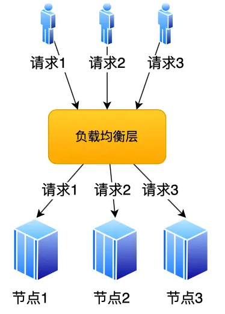

# 操作系统

## 操作系统基础

操作系统主要有以下功能：

​ 1.资源分配与回收

​ 2.为应用程序提供服务：提供统一的接口（系统调用）供开发者使用

​ 3.管理应用程序

操作系统内核的功能：

​ 1.进程调度

​ 2.内存管理

​ 3.硬件通信

​ 4.系统调用

## 进程

### 进程基础

#### 概念

编译的代码可执⾏⽂件只是储存在硬盘的静态⽂件，运⾏时被加载到内存，CPU执⾏内存中指令，这个运⾏的程序被称为进程。进程是对运⾏时程序的封装，操作系统进⾏资源调度和分配的基本单位。

#### 进程表

为了实现进程模型，操作系统为一个表格(⼀个结构数组)，即进程表。

每个进程占有⼀个进程表项(或称为进程控制块)，该表项包含了⼀个进程状态的重要信息，包括程序计数器、堆栈指针、内存分配状况、所打开⽂件的状态、账号的调度信息，以及其他在进程由运⾏态转换 到就绪态或阻塞态时必须保存的信息，从⽽保证该进程随后能再次启动，就像从未中断过⼀样。

#### 并发与并行

单个核⼼在很短时间内分别执⾏多个进程，称为并发；多个核⼼同时执⾏多个进程称为并⾏

对于并发来说，CPU需要从⼀个进程切换到另⼀个进程，这个过程需要保存进程的状态信息。即：当进程要从硬盘读取数据时，CPU 不需要阻塞等待数据的返回，而是去执行另外的进程。当硬盘数据返回时，CPU 会收到个中断，于是 CPU 再继续运行这个进程

#### 进程的状态

某个进程在某个时刻所处的状态分为以下⼏种，运⾏态、就绪态、阻塞态。（除了创建与结束之外的基础状态）

运⾏态： 该时刻进程占⽤CPU

就绪态： 可运⾏，由于其他进程处于运⾏状态⽽暂时停⽌运⾏

阻塞态： 该进程正在等待某⼀事件发⽣（如等待输⼊/输出操作的完成）⽽暂时停⽌运⾏

对于阻塞状态，进程会占⽤内存空间，这是⼀种浪费⾏为。有时操作系统会将阻塞的进程置换到磁盘中，此时进程未占⽤物理内存，我们称之为挂起。挂起不仅仅可能是物理内存不⾜，可能是程序员自身需求。等需要再次运⾏的时候，再从硬盘换⼊到物理内存。

挂起态：新的状态，描述进程没有占⽤实际的物理内存空间的情况，这个状态就是挂起状态

阻塞挂起状态： 进程在外存（硬盘）并等待某个事件的出现

就绪挂起状态： 进程在外存（硬盘），但只要进⼊内存，马上运⾏


特点：

​ 1.就绪态和运行态可以相互转换，其他的都是单向转换。就绪态的进程通过调度算法获得CPU时间，转为运行状态

​ 2.运⾏态的进程，在分配给它的 CPU 时间⽚⽤完之后就会转为就绪状态，等待下⼀次调度

​ 3.阻塞态是缺少需要的资源从⽽由运⾏态转换⽽来，但是该资源不包括 CPU 时间，缺少 CPU 时间会从运⾏态转换为就绪态，如果此时没有其他进程运⾏，就转换为运⾏态，否则该进程将处于就绪态，等待CPU空闲轮到它运⾏

#### 进程控制块PCB

操作系统对进程的感知，是通过进程控制块PCB数据结构来描述的。它是进程存在的唯⼀标识，其包括以下信息：

​ 1.进程描述信息： 进程标识符（标识各个进程，每个进程都有一个并且唯一的标识符），⽤户标识符（进程归属的用户，用户标识符主要为共享和保护服务）等

​ 2.进程控制和管理信息： 进程状态（如 new、ready、running、waiting 或 blocked 等），进程优先级（进程抢占 CPU 时的优先级）等

​ 3.进程资源分配清单： 虚拟内存地址空间信息，打开⽂件列表，IO设备信息等

​ 4.CPU相关信息： 当进程切换时，CPU寄存器的值都被保存在相应PCB中，以便CPU重新执⾏该进程时能从断点 处继续执⾏

PCB通过链表形式组织起来，⽐如有就绪队列、阻塞队列等，⽅便增删，⽅便进程管理

#### 进程切换比线程慢的原因

涉及到虚拟内存的问题，进程切换涉及虚拟地址空间的切换⽽线程不会。

因为每个进程都有⾃⼰的虚拟地址空间，⽽线程是共享所在进程的虚拟地址空间的，所以同⼀个进程中的线程进⾏ 线程切换时不涉及虚拟地址空间的转换。

把虚拟地址转换为物理地址需要查找页表，页表查找是⼀个很慢的过程（⾄少访问2次内存），因此通常使⽤Cache 来缓存常⽤的地址映射，这样可以加速页表查找，这个cache就是TLB（快表）。

由于每个进程都有⾃⼰的虚拟地址空间，那么显然每个进程都有⾃⼰的页表，那么当进程切换后页表也要进⾏切换，页表切换后TLB就失效了，cache失效导致命中率降低，那么虚拟地址转换为物理地址就会变慢，表现出来的就 是程序运⾏会变慢，⽽线程切换则不会导致TLB失效，因为线程线程⽆需切换地址空间，这也就是进程切换要⽐同 进程下线程切换慢的原因。

#### 守护进程

指的是在后台运⾏的，没有控制终端与它相连的进程。它独⽴于控制终端，周期性地执⾏某种任务。Linux的⼤多数服务器就是⽤守护进程的⽅式实现的，如web服务器进程http等。

守护进程的创建要点：

​ 1.让程序在后台运行：具体来说，fork()产生一个子进程，然后使父进程退出

​ 2.调用setsid()创建一个新的对话期：守护进程需要摆脱⽗进程的影响，⽅法是调⽤setsid()使进程成为⼀个会话组长。setsid()调⽤成功后，进程成为新的 会话组长和进程组长，并与原来的登录会话、进程组和控制终端脱离。

​ 3.禁止进程重新打开控制终端：经过1和2，进程已经成为⼀个⽆终端的会话组长，但是它可以重新申请打开⼀个终端。为了避免这种情况发⽣，可 以通过使进程不再是会话组长来实现。再⼀次通过fork（）创建新的⼦进程，使调⽤fork的进程退出。

​ 4.关闭不再需要的⽂件描述符：⼦进程从⽗进程继承打开的⽂件描述符。如不关闭，将会浪费系统资源，造成进程所在的⽂件系统⽆法卸下以及引 起⽆法预料的错误。⾸先获得最⾼⽂件描述符值，然后⽤⼀个循环程序，关闭0到最⾼⽂件描述符值的所有⽂件描述符。

​ 5.将当前目录更改为根目录：脱离终端会话，并让它对文件的读写不受限制。

​ 6.⼦进程从⽗进程继承的⽂件创建屏蔽字可能会拒绝某些许可权：需要使用unmask(0)将屏蔽字清零

​ 7.处理SIGCHLD信号：对于服务器进程，在请求到来时往往⽣成⼦进程处理请求。如果⼦进程等待⽗进程捕获状态，则⼦进程将成为僵⼫进程（zombie），从⽽占⽤系统资源。如果⽗进程等待⼦进程结束，将增加⽗进程的负担，影响服务器进程的并发性能。在Linux下可以简单地将SIGCHLD信号的操作设为SIG\_IGN。这样，⼦进程结束时不会产⽣僵⼫进程。

#### 僵尸进程

多进程程序，⽗进程⼀般需要跟踪⼦进程的退出状态，当⼦进程退出，⽗进程在运⾏，⼦进程必须等到⽗进程捕获到了⼦进程的退出状态才真正结束。在⼦进程结束后，⽗进程读取状态前，此时⼦进程为僵⼫进程。

设置僵⼫进程的⽬的是维护⼦进程的信息，以便⽗进程在以后某个时候获取。这些信息⾄少包括进程ID，进程的终 ⽌状态，以及该进程使⽤的CPU时间。所以当终⽌⼦进程的⽗进程调⽤wait或waitpid时就可以得到这些信息。

但是⼦进程停⽌在僵⼫态会占据内核资源，所以需要避免僵⼫进程的产⽣或⽴即结束⼦进程的僵⼫态，方法有：

​ 1.⽗进程调⽤wait/waitpid等函数等待⼦进程结束，如果尚⽆⼦进程退出wait会导致⽗进程阻塞。waitpid只会等 待由pid参数指定的⼦进程，同时也是⾮阻塞，⽬标进程正常退出返回⼦进程PID，还没结束返回0。

​ 2.在事件已经发⽣情况下执⾏⾮阻塞调⽤可以提⾼程序效率。对waitpid，最好在⼦进程退出后调⽤。使⽤ SIGCHLD信号通知⽗进程，⼦进程结束。

#### 多进程

进程结构由以下⼏个部分组成：代码段、堆栈段、数据段。代码段是静态的⼆进制代码，多个程序可以共享。

⽗进程创建⼦进程之后，⽗、⼦进程除了pid外，⼏乎所有的部分⼏乎⼀样。

⽗、⼦进程共享全部数据，⼦进程在写数据时会使⽤写时复制（COW）技术将公共的数据重新拷贝⼀份，之后在拷贝出的数据上进⾏操作；不是对同⼀块数据进⾏操作。

如果⼦进程想要运⾏⾃⼰的代码段，还可以通过调⽤execv()函数重新加载新的代码段，之后就和⽗进程独⽴开了。

### 进程调度算法

#### 批处理系统中的调度

系统按照一定的固定规则执行调度，而不需要与用户进行交互，这种调度不仅涉及到进程，还可以设计到其他资源，如IO设备的调度

（1）先来先服务：

​ ⾮抢占式的调度算法，按照请求的顺序进⾏调度。

​ 有利于长作业，但不利于短作业，因为短作业必须⼀直等待前⾯的长作业执⾏完毕才能执⾏，⽽长作业又需要执⾏很长时间，造成了短作业等待时间过长。

（2）最短作业优先：

​ ⾮抢占式的调度算法，按估计运⾏时间最短的顺序进⾏调度。

​ 长作业有可能会饿死，处于⼀直等待短作业执⾏完毕的状态。因为如果⼀直有短作业到来，那么长作业永远得不到调度。

（3）最短剩余时间调度：

​ 最短作业优先的抢占式版本，按剩余运⾏时间的顺序进⾏调度。

​ 当⼀个新的作业到达时，其整个运⾏时间与当前进程的剩余时间作⽐较。如果新的进程需要的时间更少，则挂起当前进程，运⾏新的进程。否则新的进程等待

（4） 高响应比优先调度算法（理想算法，实际无法实现）：

​ 每次进行进程调度时，先计算「响应比优先级」，然后把「响应比优先级」最高的进程投入运行，「响应比优先级」的计算公式为：

​ (等待时间+要求服务时间)/要求服务时间

#### 交互式系统中的调度

（1）时间片轮转调度：

​ 将所有就绪进程按 FCFS 的原则（FCFS：先来先到，非抢占）排成⼀个队列，每次调度时，把 CPU 时间分配给队⾸进程，该进程可以执⾏⼀个时间⽚。当时间⽚⽤完时，由计时器发出时钟中断，调度程序便停⽌该进程的执⾏，并将它送往就绪队列的末尾，同时继续把 CPU 时间分配给队⾸的进程。时间片设为 `20ms~50ms` 通常是一个比较合理的折中值，太短会导致过多的进程上下文切换，降低了 CPU 效率；太长又可能引起对短作业进程的响应时间变长。

（2）优先级调度：

​ 为每个进程分配⼀个优先级，按优先级进⾏调度。为了防⽌低优先级的进程永远等不到调度，可以随着时间的推移增加等待进程的优先级。

（3）多级队列：

​ 如果⼀个进程需要执⾏ 100 个时间⽚，如果采⽤时间⽚轮转调度算法，那么需要交换 100 次

​ 多级队列是为这种需要连续执⾏多个时间⽚的进程考虑，它设置了多个队列，每个队列时间⽚⼤⼩都不同，例如 1,2,4,8,..。进程在第⼀个队列没执⾏完，就会被移到下⼀个队列。这种⽅式下，之前的进程只需要交换 7 次。

​ 每个队列优先权也不同，最上⾯的优先权最⾼。因此只有上⼀个队列没有进程在排队，才能调度当前队列上的进程。（即：优先级高的队列被分配更大的时间片，并且高优先级的队列会被优先执行）

​ 可以将这种调度算法看成是时间⽚轮转调度算法和优先级调度算法的结合

（4）最短进程优先：

​ 如果我们将每⼀条命令的执⾏看作是⼀个独⽴的“作业”，则我们可以通过⾸先运⾏最短的作业来使响应事件最短

### 进程间的通信方式

#### 管道

```sh
$ ps auxf | grep mysql
```

命令行里的「`|`」竖线就是一个管道，它的功能是将前一个命令（`ps auxf`）的输出，作为后一个命令（`grep mysql`）的输入。

管道传输数据是单向的，如果想相互通信，需要创建两个管道。同时，上面的这种管道没有名字，所以「`|`」表示的管道称为**匿名管道**，用完了就销毁。

管道还有另外一个类型是**命名管道**，也被叫做 `FIFO`，因为数据是先进先出的传输方式。

```sh
# 创建管道
$ mkfifo myPipe
# 往管道中写入数据,此时该命令被阻塞，需要当管道里的数据被读完后，命令才可以正常退出。
$ echo "hello" > myPipe
# 在另一个命令中读取，上面的echo命令正常退出
$ cat < myPipe 
hello
```

管道这种通信方式效率低，不适合进程间频繁地交换数据。当然，它的好处，自然就是简单，同时也我们很容易得知管道里的数据已经被另一个进程读取了。

**管道的创建原理**

匿名管道的创建，需要通过下面这个系统调用：

```c
int pipe(int fd[2])
```

这里表示创建一个匿名管道，并返回了两个描述符，一个是管道的读取端描述符 `fd[0]`，另一个是管道的写入端描述符 `fd[1]`。注意，这个匿名管道是特殊的文件，只存在于内存，不存于文件系统中。


**管道本身就是内核里面的一段缓存**。从管道的一段写入的数据，实际上是缓存在内核中的，另一端读取，也就是从内核中读取这段数据。另外，管道传输的数据是无格式的流且大小受限。

管道如果想要起到进程通信的作用，可以使用`fork` 创建子进程，**创建的子进程会复制父进程的文件描述符**，这样就做到了两个进程各有两个「 `fd[0]` 与 `fd[1]`」，两个进程就可以通过各自的 fd 写入和读取同一个管道文件实现跨进程通信了。


同时，为了保证管道“一端写入，另一端读出”的要求，关闭了父进程读取的 fd\[0]，只保留写入的 fd\[1]；同时还关闭了子进程写入的 fd\[1]，只保留读取的 fd\[0]；

所以说如果需要双向通信，则应该创建两个管道。

而在 shell 里面执行 `A | B`命令的时候，A 进程和 B 进程都是 shell 创建出来的子进程，A 和 B 之间不存在父子关系，它俩的父进程都是 shell。因此，在 shell 里通过「`|`」匿名管道将多个命令连接在一起，实际上也就是创建了多个子进程，并通过管道进行子进程间的连接。


**对于匿名管道，它的通信范围是存在父子关系的进程**。因为管道没有实体，也就是没有管道文件，只能通过 fork 来复制父进程 fd 文件描述符，来达到通信的目的。另外，**对于命名管道，它可以在不相关的进程间也能相互通信**。因为命令管道，提前创建了一个类型为管道的设备文件，在进程里只要使用这个设备文件，就可以相互通信。

不管是匿名管道还是命名管道，进程写入的数据都是缓存在内核中，另一个进程读取数据时候自然也是从内核中获取，同时通信数据都遵循**先进先出**原则，不支持 lseek 之类的文件定位操作。

#### 消息队列

**消息队列是保存在内核中的消息链表**，在发送数据时，会分成一个一个独立的数据单元，也就是消息体（数据块），消息体是用户自定义的数据类型，消息的发送方和接收方要约定好消息体的数据类型，所以每个消息体都是固定大小的存储块，不像管道是无格式的字节流数据。如果进程从消息队列中读取了消息体，内核就会把这个消息体删除。

消息队列生命周期随内核，如果没有释放消息队列或者没有关闭操作系统，消息队列会一直存在，而前面提到的匿名管道的生命周期，是随进程的创建而建立，随进程的结束而销毁。

消息队列的优点在于：通信效率高，非阻塞，生命周期长（随内核）

消息队列的缺陷：

1. **消息队列不适合比较大数据的传输**，因为在内核中每个消息体都有一个最大长度的限制，同时所有队列所包含的全部消息体的总长度也是有上限。在 Linux 内核中，会有两个宏定义 `MSGMAX` 和 `MSGMNB`，它们以字节为单位，分别定义了一条消息的最大长度和一个队列的最大长度。
2. **消息队列通信过程中，存在用户态与内核态之间的数据拷贝开销**，因为进程写入数据到内核中的消息队列时，会发生从用户态拷贝数据到内核态的过程，同理另一进程读取内核中的消息数据时，会发生从内核态拷贝数据到用户态的过程。

#### 共享内存

消息队列的读取和写入的过程，都会有发生用户态与内核态之间的消息拷贝过程。那**共享内存**的方式，就很好的解决了这一问题。

**共享内存的机制，就是拿出一块虚拟地址空间来，映射到相同的物理内存中**。这样这个进程写入的东西，另外一个进程马上就能看到了，都不需要拷贝来拷贝去，传来传去，大大提高了进程间通信的速度。


#### 信号量

用了共享内存通信方式，带来新的问题，那就是如果多个进程同时修改同一个共享内存，很有可能就冲突了。例如两个进程都同时写一个地址，那先写的那个进程会发现内容被别人覆盖了。为了防止多进程竞争共享资源，而造成的数据错乱，所以需要保护机制，使得共享的资源，在任意时刻只能被一个进程访问。正好，**信号量**就实现了这一保护机制。

**信号量其实是一个整型的计数器，主要用于实现进程间的互斥与同步，而不是用于缓存进程间通信的数据**。

信号量表示资源的数量，控制信号量的方式有两种原子操作：

* 一个是 **P 操作**，这个操作会把信号量减去 1，相减后如果信号量 < 0，则表明资源已被占用，进程需阻塞等待；相减后如果信号量 >= 0，则表明还有资源可使用，进程可正常继续执行。
* 另一个是 **V 操作**，这个操作会把信号量加上 1，相加后如果信号量 <= 0，则表明当前有阻塞中的进程，于是会将该进程唤醒运行；相加后如果信号量 > 0，则表明当前没有阻塞中的进程；

信号初始化为 `1`，就代表着是**互斥信号量**，它可以保证共享内存在任何时刻只有一个进程在访问，这就很好的保护了共享内存。

如果存在先后关系，例如一个进程是生产者，生产完后数据才能给另一个进程使用，那么信号初始量可以为`0`，在生产者生产完成后执行V，消费者的P可以解除阻塞，实现多进程同步（存在竞争的情况，与条件变量的wait/notify\_all类似）

#### 信号

信号是对于事件（一般是异常事件）的响应。例如：

* 快捷键Ctrl+C 产生 `SIGINT` 信号，表示终止该进程；
* 快捷键Ctrl+Z 产生 `SIGTSTP` 信号，表示停止该进程，但还未结束；

信号是进程间通信机制中**唯一的异步通信机制**，因为可以在任何时候发送信号给某一进程，一旦有信号产生，我们就有下面这几种，用户进程对信号的处理方式。

**1.执行默认操作**。Linux 对每种信号都规定了默认操作，例如，上面列表中的 SIGTERM 信号，就是终止进程的意思。

**2.捕捉信号**。我们可以为信号定义一个信号处理函数。当信号发生时，我们就执行相应的信号处理函数。

**3.忽略信号**。当我们不希望处理某些信号的时候，就可以忽略该信号，不做任何处理。有两个信号是应用进程无法捕捉和忽略的，即 `SIGKILL` 和 `SEGSTOP`，它们用于在任何时候中断或结束某一进程。

#### Socket

用于跨网络与不同主机上的进程之间通信。

**TCP的socket编程模型**

* 服务端和客户端初始化 `socket`，得到文件描述符；
* 服务端调用 `bind`，将绑定在 IP 地址和端口;
* 服务端调用 `listen`，进行监听；
* 服务端调用 `accept`，等待客户端连接；
* 客户端调用 `connect`，向服务器端的地址和端口发起连接请求；
* 服务端 `accept` 返回用于传输的 `socket` 的文件描述符；
* 客户端调用 `write` 写入数据；服务端调用 `read` 读取数据；
* 客户端断开连接时，会调用 `close`，那么服务端 `read` 读取数据的时候，就会读取到了 `EOF`，待处理完数据后，服务端调用 `close`，表示连接关闭。

这里需要注意的是，服务端调用 `accept` 时，连接成功了会返回一个已完成连接的 socket，后续用来传输数据。所以，监听的 socket 和真正用来传送数据的 socket，是「**两个**」 socket，一个叫作**监听 socket**，一个叫作**已完成连接 socket**。成功连接建立之后，双方开始通过 read 和 write 函数来读写数据，就像往一个文件流里面写东西一样。

**UDP的socket编程模型**

UDP 是没有连接的，所以不需要三次握手，也就不需要像 TCP 调用 listen 和 connect，但是 UDP 的交互仍然需要 IP 地址和端口号，因此也需要 bind。

对于 UDP 来说，不需要要维护连接，那么也就没有所谓的发送方和接收方，甚至都不存在客户端和服务端的概念，只要有一个 socket 多台机器就可以任意通信，因此每一个 UDP 的 socket 都需要 bind。

另外，每次通信时，调用 sendto 和 recvfrom，都要传入目标主机的 IP 地址和端口。


**本地进程间通信的 socket 编程模型**

* 本地 socket 的编程接口和 IPv4 、IPv6 套接字编程接口是一致的，可以支持「字节流」和「数据报」两种协议；
* 本地 socket 的实现效率大大高于 IPv4 和 IPv6 的字节流、数据报 socket 实现；

本地字节流 socket 和 本地数据报 socket 在 bind 的时候，不像 TCP 和 UDP 要绑定 IP 地址和端口，而是**绑定一个本地文件**（Unix Address），这也就是它们之间的最大区别

## 线程

### 线程基础

线程是轻量级进程，也有PCB，创建线程使用的底层函数和进程一样，都是clone

从内核里看进程和线程是一样的，都有各自不同的PCB

在Linux下，线程是最小的执行（调度）单位，进程是最小的资源分配单位

实际上，⽆论是创建进程的fork，还是创建线程的pthread\_create，底层实现都是调⽤同⼀个内核函数 clone：

​ 1.如果复制对⽅的地址空间，那么就产出⼀个“进程”

​ 2.如果共享对⽅的地址空间，就产⽣⼀个“线程”

Linux内核是不区分进程和线程的, 只在⽤户层⾯上进⾏区分。所以，线程所有操作函数 pthread\_\* 是库函数，⽽⾮系统调⽤

### 线程上下文切换的是什么

这还得看线程是不是属于同一个进程：

* 当两个线程不是属于同一个进程，则切换的过程就跟进程上下文切换一样；
* 当两个线程是属于同一个进程，因为虚拟内存是共享的，所以在切换时，虚拟内存这些资源就保持不动，只需要切换线程的私有数据、寄存器等不共享的数据，所以线程的上下文切换相比进程开销要小的多。

### 三种线程：用户线程，内核线程和轻量级线程

（1）用户线程

​ 用户空间实现的线程，基于用户态的线程库管理，类似于多对一的关系，也就是多个用户线程对应同一个内核线程

优点：

​ 1.管理不需要内核直接参与，因此可⽤于不⽀持线程技术的操作系统

​ 2.⽤户线程切换由线程库调度，不需要⽤户态与内核态之间转换

缺点：

​ 1.由于不由操作系统调度，⼀旦⽤户线程发起系统调⽤⽽阻塞，那么此进程下⽤户线程都⽆法运⾏

​ 2.⼀旦某个⽤户线程正在运⾏，只有当其交出CPU执⾏权，其他⽤户线程才可以运⾏，⽆法被打断，因为只有操作系统才有权限打断运⾏，但是操作系统不直接参与调度（所以说一般会通过定时器设置超时时间执行回调）

​ 3.⽤户线程操作系统⽆法感知，CPU资源是直接分配给线程所在的进程，因此分到具体⽤户线程的时间⽚很短。其TCB线程控制块⽆法被操作系统所感知，因此⽤户线程的创建、终⽌、同步、调度等都不是由操作系统直接参与

​ 4.由于时间片分配给进程，故与其他进程比，在多线程执行时，每个线程得到的时间片较少，执行会比较慢；

（2）内核线程

​ 由操作系统管理、调度，其TCB是存放在内核中。⼀般由操作系统事先创建内核线程集(类似于线程池)，数量有限。一般用来执行系统调度，I/O操作等操作系统的关键任务。

优点：

​ 1.当⼀个内核线程发起系统调⽤阻塞时不会影响其它内核线程的执⾏

​ 2. 操作系统将CPU资源直接分配给内核线程，更多CPU时间

缺点：

​ 1.需要由内核来维护内核线程的上下⽂信息及运⾏状态等，占⽤内核资源

​ 2. 内核线程创建、终⽌、切换都是在内核中进⾏，开销⽐较⼤

（3）轻量级线程（LWP）

内核⽀持的⽤户线程，像普通进程⼀样被调度，其类似于进程中的执⾏线程

每个LWP都需要⼀个内核线程的⽀持(CPU资源分配、调度)，实际上⽤户线程是运⾏在LWP上的

用户线程现在比较少用，更多的还是LWP

### 线程的共享/非共享资源

共享资源包括：

​ 1.文件描述符表

​ 2.信号处理方式

​ 3.当前工作目录

​ 4.用户ID和组ID

非共享资源包括：

​ 1.线程id

​ 2.处理器现场和栈指针（内核栈）

​ 3.独立的栈空间（用户空间栈）

​ 4.errno变量

​ 5.信号屏蔽字

​ 6.调度优先级

### 线程的优缺点

优点：

​ 1.各个线程之间可以并发执行，提高程序并发性

​ 2.开销小

​ 3.数据通信，共享数据方便，各个线程之间可以共享地址空间和文件等资源

缺点：

​ 1.库函数，不稳定

​ 2.调试，编写困难

​ 3.对信号的支持不好

​ 4.当进程中的一个线程崩溃时，会导致其所属进程的所有线程崩溃（这里是针对 C/C++ 语言，Java语言中的线程奔溃不会造成进程崩溃）

线程减少开销的方式：

​ 1.线程创建快，进程创建需要资源管理信息，⽐如内存管理信息和⽂件管理信息，⽽线程创建后是共享其所属进程 的资源管理信息

​ 2.线程终⽌时间快，需要回收的仅有少量寄存器和私有的栈区

​ 3.线程切换快，因为线程切换仅涉及到少量寄存器和栈区，⽽进程上下⽂切换有CPU寄存器和程序计数器(CPU上下⽂)、虚拟内存空间、页表切换、TLB失效等

​ 4.线程因为创建时共享了其所属进程绝⼤多数资源，因此天⽣具有很好的线程间通信交互效率

### 线程的常用操作API

1.pthread\_self

```c++
#include <pthread.h>
/**
* 获取线程号.
* @return 返回调⽤线程的线程.
*/
pthread_t pthread_self(void);
```

2.pthread\_equal

```c++
/**
* 判断线程号 t1 和 t2 是否相等。为了⽅便移植，尽量使⽤函数来⽐较线程 ID.
* @param t1 待判断的线程号.
* @param t2 待判断的线程号.
* @return 相等: ⾮0; 不相等: 0.
*/
int pthread_equal(pthread_t t1, pthread_t t2);
```

3.pthread\_create

```c++
#include <pthread.h>
/**
* 创建⼀个线程.
* @param thread 线程标识符地址.
* @param attr 线程属性结构体地址，通常设置为 NULL.
* @param start_routine 线程函数的⼊⼝地址.
* @param arg 传给线程函数的参数.
* @return 成功: 0; 失败: ⾮0.
*/
int pthread_create(pthread_t *thread,
 				const pthread_attr_t *attr,
 				void *(*start_routine)(void *),
 				void *arg );
// 由于pthread_create的错误码不保存在errno中，
// 因此不能直接⽤perror()打印错误信息，
// 可以先⽤strerror()把错误码转换成错误信息再打印。
```

4.pthread\_join：负责线程回收

```c++
#include <pthread.h>
/**
* 等待线程结束（此函数会阻塞），并回收线程资源，类似进程的 wait() 函数。如果线程已经结束，那么该函数
会⽴即返回.
* @param thread 被等待的线程号.
* @param retval ⽤来存储线程退出状态的指针的地址.
* @return 成功: 0; 失败: ⾮0.
*/
int pthread_join(pthread_t thread, void **retval);
```

调⽤该函数的线程将挂起等待，直到id为thread的线程终⽌。 thread线程以不同的⽅法终⽌，通过pthread\_join得到的终⽌状态是不同的。

​ 1.如果thread线程通过return返回，retval所指向的单元⾥存放的是thread线程函数的返回值。

​ 2.如果thread线程被别的线程调⽤pthread\_cancel异常终⽌掉，retval所指向的单元⾥存放的是常数 PTHREAD\_CANCELED。

​ 3.如果thread线程是⾃⼰调⽤pthread\_exit终⽌的，retval所指向的单元存放的是传给pthread\_exit的参数。

5.pthread\_detach：实现线程分离，不会阻塞

```c++
#include <pthread.h>
/**
* 使调⽤线程与当前进程分离，分离后不代表此线程不依赖与当前进程，
* 线程分离的⽬的是将线程资源的回收⼯作交由系统⾃动来完成，
* 也就是说当被分离的线程结束之后，系统会⾃动回收它的资源。所以，此函数不会阻塞.
*
* @param thread 线程号.
* @return 成功: 0; 失败: ⾮0.
*/
int pthread_detach(pthread_t thread);

```

线程终⽌后，其终⽌状态⼀直保留到其它线程调⽤pthread\_join获取它的状态为⽌。但是线程也可以被置为 detach状态，这样的线程⼀旦终⽌就⽴刻回收它占⽤的所有资源，⽽不保留终⽌状态。

不能对⼀个已经处于detach状态的线程调⽤pthread\_join，这样的调⽤将返回EINVAL错误。也就是说，如果已 经对⼀个线程调⽤了pthread\_detach就不能再调⽤pthread\_join了。

6.phread\_exit：线程退出，但资源不会释放

```c++
#include <pthread.h>
/**
* 退出调⽤线程。⼀个进程中的多个线程是共享该进程的数据段，因此，通常线程退出后所占⽤的资源并不会释放.
* @param retval 存储线程退出状态的指针.
*/
void pthread_exit(void *retval);
```

线程从执⾏函数中返回。线程从执⾏函数中返回。线程可以被同⼀进程中的其它线程取消。

7.pthread\_cancel：线程取消

```c++
#include <pthread.h>
/**
* 杀死(取消)线程.
* @param thread ⽬标线程ID.
* @return 成功: 0; 失败: 出错编号.
* 注意: 线程的取消并不是实时的，⽽⼜⼀定的延时。需要等待线程到达某个取消点(检查点)
*/
int pthread_cancel(pthread_t thread);
```

### 线程通信

线程间的通信⽬的主要是⽤于线程同步。所以线程没有像进程通信中的⽤于数据交换的通信机制。

同⼀进程的不同线程共享同⼀份内存区域，所以线程之间可以⽅便、快速地共享信息。只需要将数据复制到共享 （全局或堆）变量中即可。但是需要避免出现多个线程试图同时修改同⼀份信息。

线程存在分离和非分离两个状态：

​ 1.线程的默认属性是⾮分离状态，这种情况下，原有的线程等待创建的线程结束。只有当pthread\_join()函数返回时， 创建的线程才算终⽌，才能释放⾃⼰占⽤的系统资源。

​ 2.分离线程没有被其他的线程所等待，⾃⼰运⾏结束了，线程也就终⽌了，马上释放系统资源。应该根据⾃⼰的需 要，选择适当的分离状态。

### 多线程

⽤户态的多线程模型，同⼀个进程内部有多个线程，所有的线程共享同⼀个进程的内存空间，进程中定义的全局变量会被所有的线程共享

i++在计算机中并不是原⼦操作，涉及内存取数，计算和写⼊内存⼏个环节，⽽线程的切换有可能发⽣在上述任何 ⼀个环节中间，所以不同的操作顺序很有可能带来意想不到的结果

多线程的优势：

​ 1.许多应⽤中同时发⽣多个活动，某些活动随着时间推移⽽阻塞，将这些应⽤程序分解成并发运⾏的多个 线程，简化设计模型。同时多线程有共享同⼀地址空间和可⽤数据的能⼒，这是多进程没有的。

​ 2.线程⽐进程开销⼩，更容易创建和释放。

​ 3.多个线程是IO密集型时，多线程可以使这些活动彼此重叠运⾏，可以加快程序执⾏的速度。

多线程需要考虑：

​ 1.线程之间有⽆先后访问顺序（线程依赖关系）

​ 2.多个线程共享访问同⼀变量（同步互斥问题）

​ 3.同⼀进程的多个线程共享进程的资源，除了标识线程的tid，每个线程还有⾃⼰独⽴的栈空间，线程彼此之间是⽆法访问其他线程栈上内容的

### 一个进程最多可以创建多少个线程

* 32 位系统，用户态的虚拟空间只有 3G，如果创建线程时分配的栈空间是 10M，那么一个进程最多只能创建 300 个左右的线程。
* 64 位系统，用户态的虚拟空间大到有 128T，理论上不会受虚拟内存大小的限制，而会受系统的参数或性能限制。

### 线程崩溃了，进程也会崩溃么

在C/C++中，线程崩溃后，进程也会崩溃，而 Java 语言里却不会

一般来说如果线程是因为非法访问内存引起的崩溃，那么进程肯定会崩溃，为什么系统要让进程崩溃呢，这主要是因为在进程中，各个线程的地址空间是共享的，既然是共享，那么某个线程对地址的非法访问就会导致内存的不确定性，进而可能会影响到其他线程，这种操作是危险的，操作系统会认为这很可能导致一系列严重的后果，于是干脆让整个进程崩溃

非法访问的几种情况：针对只读内存写入数据，访问了进程没有权限访问的地址空间（比如内核空间），访问了不存在的内存等。以上错误都是访问内存时的错误，所以统一会报 Segment Fault 错误（即段错误），这些都会导致进程崩溃

线程崩溃->进程崩溃是通过信号来控制的

#### 信号机制

kill 执行的是系统调用，将控制权转移给了内核（操作系统），由内核来给指定的进程发送信号，其背后的机制如下：

1. CPU 执行正常的进程指令
2. 调用 kill 系统调用向进程发送信号
3. 进程收到操作系统发的信号，CPU 暂停当前程序运行，并将控制权转交给操作系统
4. 调用 kill 系统调用向进程发送信号（假设为 11，即 SIGSEGV，一般非法访问内存报的都是这个错误）
5. 操作系统根据情况执行相应的信号处理程序（函数），一般执行完信号处理程序逻辑后会让进程退出

对于JVM而言，实际上JVM 自己定义了信号处理函数，这样当发送 kill pid 命令（默认会传 15 也就是 SIGTERM）后，JVM 就可以在信号处理函数中执行一些资源清理之后再调用 exit 退出。也就是说，线程崩溃不会导致 JVM 进程崩溃，是因为 **JVM 自定义了自己的信号处理函数，拦截了 SIGSEGV 信号，针对这两者不让它们崩溃**。

如果 JVM 不对信号做额外的处理，最后会自己退出并产生 crash 文件 hs\_err\_pid\_xxx.log（可以通过 -XX:ErrorFile=/var/\*log\*/hs\_err.log 这样的方式指定），这个文件记录了虚拟机崩溃的重要原因。

## 互斥与同步

### 忙等待锁/无忙等待锁

#### 忙等待锁

现代 CPU 体系结构提供的特殊原子操作指令 —— 测试和置位（Test-and-Set）指令。该操作是原子操作，即可以测试旧值，也可以设置新值。

常常使用该操作实现自旋锁。当获取不到锁时，线程就会一直 while 循环，不做任何事情，所以就被称为「忙等待锁」，也被称为**自旋锁（spin lock）**。

这是最简单的一种锁，一直自旋，利用 CPU 周期，直到锁可用。在单处理器上，需要抢占式的调度器（即不断通过时钟中断一个线程，运行其他线程）。否则，自旋锁在单 CPU 上无法使用，因为一个自旋的线程永远不会放弃 CPU。

#### 无忙等待锁

无等待锁顾明思议就是获取不到锁的时候，不用自旋。既然不想自旋，那当没获取到锁的时候，就把当前线程放入到锁的等待队列，然后执行调度程序，把 CPU 让给其他线程执行。

实际的锁的实现要比这两种情况复杂的多，但基本就是这两种。

### 互斥锁mutex（就是无忙等待锁）

也叫互斥量，互斥锁锁是⼀种简单的加锁的⽅法来控制对共享资源的访问，互斥锁只有两种状态,即加锁( lock )和解锁 ( unlock )

在访问共享资源后临界区域前，对互斥锁进⾏加锁；在访问完成后释放互斥锁导上的锁；对互斥锁进⾏加锁后，任何其他试图再次对互斥锁加锁的线程将会被阻塞，直到锁被释放

互斥锁的数据类型为：pthread\_mutex\_t

#### 互斥锁API

​ 1.pthread\_mutex\_init()：互斥锁创建

```c++
#include <pthread.h>
/**
* 初始化⼀个互斥锁.
* @param mutex 互斥锁地址。类型是 pthread_mutex_t.
* @param attr 设置互斥量的属性，通常可采⽤默认属性，即可将 attr 设为 NULL.
* @return 成功: 0 成功申请的锁默认是打开的; 失败: ⾮0(错误码).
*/
int pthread_mutex_init(pthread_mutex_t *restrict mutex,
						const pthread_mutexattr_t *restrict attr);
// 这种⽅法等价于使⽤ NULL 指定的 attr 参数调⽤ pthread_mutex_init() 来完成动态初始化，
// 不同之处在于 PTHREAD_MUTEX_INITIALIZER 宏不进⾏错误检查。
```

​ 2.pthread\_mutex\_destroy()：互斥锁销毁

```c++
#include <pthread.h>
/**
* 销毁指定的⼀个互斥锁。互斥锁在使⽤完毕后，必须要对互斥锁进⾏销毁，以释放资源.
* @param mutex 互斥锁地址。类型是 pthread_mutex_t.
* @return 成功: 0; 失败: ⾮0(错误码).
*/
int pthread_mutex_destroy(pthread_mutex_t *mutex);
```

​ 3.pthread\_mutex\_lock()：互斥锁上锁

```c++
#include <pthread.h>
/**
* 对互斥锁上锁，若互斥锁已经上锁，则调⽤者阻塞，直到互斥锁解锁后再上锁.
* @param mutex 互斥锁地址.
* @return 成功: 0; 失败: ⾮0(错误码).
*/
int pthread_mutex_lock(pthread_mutex_t *mutex);
/**
* 调⽤该函数时，若互斥锁未加锁，则上锁，返回 0;
* 若互斥锁已加锁，则函数直接返回失败，即 EBUSY.
*/
int pthread_mutex_trylock(pthread_mutex_t *mutex);
```

​ 4.pthread\_mutex\_unlock() ：互斥锁解锁

```c++
#include <pthread.h>
/**
* 对指定的互斥锁解锁.
* @param mutex 互斥锁地址.
* @return 成功: 0; 失败: ⾮0(错误码)
*/
int pthread_mutex_unlock(pthread_mutex_t *mutex);

```

#### 死锁问题

抢占/不可抢占资源：是否可以从拥有它的进程中抢占，例如存储器就是一类可抢占资源

死锁的必要条件：

​ 1.互斥：每个程序要么已经分配给一个进程，要么是可用的

​ 2.占有和等待：已经得到了某个资源的进程可以再请求新的资源

​ 3.不可抢占：已经分配给⼀个进程的资源不能强制性地被抢占，它只能被占有它的进程显式地释放

​ 4.环路等待：死锁发⽣时，系统中⼀定有由两个或两个以上的进程组成的⼀条环路，该环路中的每个进程都在等待着下⼀个进程所占有的资源

面对死锁的处理方法：

​ 1.无视：都死锁不造成太大影响是就不管它，也叫鸵鸟算法

​ 2.死锁检测：

​ 对于每种类型一个资源的死锁（死锁发生时只占有一个资源），通过检测有向图中是否存在环来实现，从⼀个节点出发进⾏深度优先搜索，对访问过的节点进⾏标记，如果访问了已经标记的节点，就表⽰有向图存在环，也就是检测到死锁发⽣。

​ 对于每种类型多个资源的死锁，每个进程最开始时都不被标记，执⾏过程有可能被标记。当算法结束时，任何没有被标记的进程都是死锁进程（银行家算法）。具体来是由以下步骤：

​ a.寻找⼀个没有标记的进程Pi，它所请求的资源⼩于或等于A

​ b.如果真找到这样⼀个进程，那么将C矩阵（也称为最大需求矩阵）的第i⾏向量加到A中，标记该进程，并转回第1步。最大需求矩阵表示每个进程对每种资源的最大需求量，显然，这是在模拟资源分配的过程。

​ c.如果没有这样的进程，那么算法终⽌（即请求超过了该进程对该资源的最大需求C）

​ 3.死锁恢复：

​ （1）利用抢占恢复：将进程挂起，强行取走资源给另一个进程使用，用完再放回。

​ （2）利用回滚回复：复位到更早的状态，那时它还没有取得所需的资源。

​ （3）通过杀死进程恢复：杀掉环中的一个进程或多个，牺牲掉一个环外进程

```
牺牲一个环外进程的意义：
	1.资源释放： 被牺牲的环外进程通常占有一些资源，通过释放这些资源，系统可以满足其他进程的资源请求，有助于解除死锁。
	2.维持系统运行： 牺牲环外进程可以确保系统能够继续运行。如果只是杀死环中的进程而不释放额外的资源，可能会导致系统无法正常执行其他任务。
	3.避免连锁效应：杀死环外进程有助于避免因死锁而导致更广泛的系统故障。如果不采取措施，死锁可能会蔓延，影响到更多的进程，甚至导致整个系统崩溃。
```

​ 4.死锁预防：

​ （1）破坏互斥条件

​ （2）破坏占有等待条件

​ a.规定所有进程在开始执⾏前请求所需要的全部资源

​ b.当⼀个进程请求资源时，先暂时释放其当前占⽤的所有资源，然后在尝试⼀次获得所需的全部资源

​ （3）破坏不可抢占条件

​ a.保证每⼀个进程在任何时刻只能占⽤⼀个资源，如果请求另⼀个资源必须先释放第⼀个资源

​ b.将所有的资源统⼀编号，进程可以在任何时刻提出资源请求，但是所有请求必须按照资源编号的顺序(升序)提出

​ （4）破坏环路等待

​ 5.死锁避免：

​ （1）安全状态：如果没有死锁发⽣，并且即使所有进程突然请求对资源的最⼤需求，也仍然存在某种调度次序能够使得每⼀个进程运⾏完毕，则称该状态是安全的。

​ （2）单个资源/多个资源的银行家算法

#### 读写锁

在对数据的读写操作中，更多的是读操作，写操作较少，例如对数据库数据的读写应⽤

特点：

​ 1.在对数据的读写操作中，更多的是读操作，写操作较少，例如对数据库数据的读写应⽤

​ 2.如果有其它线程写数据，则其它线程都不允许读、写操作

读写锁分为读锁和写锁，规则如下：

​ 1.如果某线程申请了读锁，其它线程可以再申请读锁，但不能申请写锁

​ 2.如果某线程申请了写锁，其它线程不能申请读锁，也不能申请写锁

POSIX定义的读写锁数据类型为：pthread\_rwlock\_t

读写锁API：

​ 1.pthread\_rwlock\_init()：初始化读写锁

```c++
/**
* ⽤来初始化 rwlock 所指向的读写锁.
* @param rwlock 指向要初始化的读写锁指针.
* @param attr：读写锁的属性指针。如果 attr 为 NULL 则会使⽤默认的属性初始化读写锁，否则使⽤指定的
attr 初始化读写锁.
* 可以使⽤宏 PTHREAD_RWLOCK_INITIALIZER 静态初始化读写锁，⽐如:
* pthread_rwlock_t my_rwlock = PTHREAD_RWLOCK_INITIALIZER;
* 这种⽅法等价于使⽤ NULL 指定的 attr 参数调⽤ pthread_rwlock_init() 来完成动态初始化，
* 不同之处在于PTHREAD_RWLOCK_INITIALIZER 宏不进⾏错误检查.
* @return 成功: 0，读写锁的状态将成为已初始化和已解锁; 失败: ⾮ 0 错误码.
*/
#include <pthread.h>
int pthread_rwlock_init(pthread_rwlock_t *restrict rwlock,
						const pthread_rwlockattr_t *restrict attr);
```

​ 2.pthread\_rwlock\_destroy()：销毁读写锁

```c++
/**
* ⽤于销毁⼀个读写锁，并释放所有相关联的资源（所谓的所有指的是由 pthread_rwlock_init() ⾃动申请的
资源.
* @param rwlock 读写锁指针.
* @return 成功: 0; 失败: ⾮0错误码.
*/
#include <pthread.h>
int pthread_rwlock_destroy(pthread_rwlock_t *rwlock);
```

​ 3.pthread\_rwlock\_rdlock()：读锁定

```c++
#include <pthread.h>
/**
* 以阻塞⽅式在读写锁上获取读锁（读锁定）.
* 如果没有写者持有该锁，并且没有写者阻塞在该锁上，则调⽤线程会获取读锁.
* 如果调⽤线程未获取读锁，则它将阻塞直到它获取了该锁。⼀个线程可以在⼀个读写锁上多次执⾏读锁定.
* 线程可以成功调⽤ pthread_rwlock_rdlock() 函数 n 次，但是之后该线程必须调⽤
pthread_rwlock_unlock() 函数 n 次才能解除锁定.
* @param rwlock 读写锁指针.
* @return 成功: 0; 失败: ⾮0错误码.
*/
int pthread_rwlock_rdlock(pthread_rwlock_t *rwlock);
/**
* ⽤于尝试以⾮阻塞的⽅式来在读写锁上获取读锁.
* 如果有任何的写者持有该锁或有写者阻塞在该读写锁上，则⽴即失败返回.
*/
int pthread_rwlock_tryrdlock(pthread_rwlock_t *rwlock);
```

​ 4.pthread\_rwlock\_wrlock()：写锁定

```c++
#include <pthread.h>
/**
* 在读写锁上获取写锁（写锁定）.
* 如果没有写者持有该锁，并且没有写者读者持有该锁，则调⽤线程会获取写锁.
* 如果调⽤线程未获取写锁，则它将阻塞直到它获取了该锁.
* @param rwlock 读写锁指针.
* @return 成功: 0; 失败: ⾮0错误码.
*/
int pthread_rwlock_wrlock(pthread_rwlock_t *rwlock);
/**
* ⽤于尝试以⾮阻塞的⽅式来在读写锁上获取写锁.
* 如果有任何的读者或写者持有该锁，则⽴即失败返回.
*/
int pthread_rwlock_trywrlock(pthread_rwlock_t *rwlock);
```

​ 5.pthread\_rwlock\_unlock()：解锁

```c++
#include <pthread.h>
/**
* ⽆论是读锁或写锁，都可以通过此函数解锁.
* @param rwlock 读写锁指针.
* @return 成功: 0; 失败: ⾮0错误码.
*/
int pthread_rwlock_unlock(pthread_rwlock_t *rwlock);

```

### 条件变量

与互斥锁不同，条件变量是⽤来等待⽽不是⽤来上锁的，条件变量本⾝不是锁

条件变量⽤来⾃动阻塞⼀个线程，直到某特殊情况发⽣为⽌。通常条件变量和互斥锁同时使⽤

条件变量的两个动作：

​ 1.条件不满，阻塞线程（调用wait方法）

​ 2.当条件满足，通知阻塞的线程开始工作（调用notify方法进行唤醒）

条件变量的类型为：pthread\_cond\_t

#### 条件变量API

​ 1.pthread\_cond\_init()：创建条件变量

```c++
#include <pthread.h>
/**
* 初始化⼀个条件变量.
* @param cond 指向要初始化的条件变量指针.
* @param attr 条件变量属性，通常为默认值，传NULL即可.
* 也可以使⽤静态初始化的⽅法，初始化条件变量;
* pthread_cond_t cond = PTHREAD_COND_INITIALIZER.
* return 成功: 0; 失败: ⾮0错误号.
*/
int pthread_cond_init(pthread_cond_t *restrict cond,
						const pthread_condattr_t *restrict attr);
```

​ 2.pthread\_cond\_destroy()：删除条件变量

```c++
#include <pthread.h>
/**
* 销毁⼀个条件变量.
* @param cond 指向要初始化的条件变量指针.
* @return 成功: 0; 失败: ⾮0错误号.
*/
int pthread_cond_destroy(pthread_cond_t *cond);
```

​ 3.pthread\_cond\_signal()：唤醒线程

```c++
#include <pthread.h>
/**
* 唤醒⾄少⼀个阻塞在条件变量上的线程.
* @param cond 指向要初始化的条件变量指针.
* @return 成功: 0; 失败: ⾮0错误号.
*/
int pthread_cond_signal(pthread_cond_t *cond);
/**
* 唤醒全部阻塞在条件变量上的线程.
* @param cond 指向要初始化的条件变量指针.
* @return 成功: 0; 失败: ⾮0错误号.
*/
int pthread_cond_broadcast(pthread_cond_t *cond);
```

​ 4.pthread\_cond\_wait()：阻塞线程

```c++
#include <pthread.h>
struct timespec {
 time_t tv_sec; /* seconds */ // 秒
 long tv_nsec; /* nanosecondes*/ // 纳秒
}
// time_t cur = time(NULL); //获取当前时间。
// struct timespec t; //定义timespec 结构体变量t
// t.tv_sec = cur + 1; // 定时1秒
// pthread_cond_timedwait(&cond, &t);
/**
* 阻塞等待⼀个条件变量
* 1. 阻塞等待条件变量cond（参1）满⾜
* 2. 释放已掌握的互斥锁（解锁互斥量）相当于pthread_mutex_unlock(&mutex);
* ((1), (2)两步为⼀个原⼦操作)
* 3. 当被唤醒，pthread_cond_wait函数返回时，解除阻塞并重新申请获取互斥锁
pthread_mutex_lock(&mutex);
* @param cond 指向要初始化的条件变量指针.
* @param mutex 互斥锁.
* @return 成功: 0; 失败: ⾮0错误号.
*/
int pthread_cond_wait(pthread_cond_t *restrict cond,
 							pthread_mutex_t *restrict mutex);
/**
* 限时等待⼀个条件变量.
* @param cond 指向要初始化的条件变量指针.
* @param mutex 互斥锁.
* @param abstime 绝对时间.
* @return 成功: 0; 失败: ⾮0错误号.
*/
int pthread_cond_timedwait(pthread_cond_t *restrict cond,
 						pthread_mutex_t *restrict mutex,
 						const struct *restrict abstime);
```

#### 条件变量的优势

​ 1.相较于mutex⽽⾔，条件变量可以减少竞争。如直接使⽤mutex，除了⽣产者、消费者之间要竞争互斥量以外，消费者之间也需要竞争互斥量。有了条件变量机制以后，只有⽣产者完成⽣产，才会引起消费者之间的竞争。提⾼了程序效率。

​ 2.使用条件变量可以避免忙等待，即线程不断地检查某个条件是否满足，而是在条件不满足时进入阻塞状态，只有在条件满足时才继续执行。

​ 3.条件变量提供了一种有效的线程同步机制，允许线程在某个条件成立之前等待，以避免忙等待和提高效率。

### 信号量

信号量⼴泛⽤于进程或线程间的同步和互斥，信号量本质上是⼀个⾮负的整数计数器，它被⽤来控制对公共资源的访问。编程时可根据操作信号量值的结果判断是否对公共资源具有访问的权限，当信号量值⼤于 0 时，则可以访问，否则将阻塞。

PV 原语是对信号量的操作方式，⼀次 P 操作使信号量减１，⼀次 V 操作使信号量加１。

#### 信号量API

​ 1.sem\_init()：创建信号量

```c++
#include <semaphore.h>
/**
* 创建⼀个信号量并初始化它的值。⼀个⽆名信号量在被使⽤前必须先初始化.
* @param sem 信号量的地址.
* @param pshared 等于 0，信号量在线程间共享（常⽤）; 不等于0，信号量在进程间共享.
* @param value 信号量的初始值.
* @return 成功: 0; 失败: -1.
*/
int sem_init(sem_t *sem, int pshared, unsigned int value);
```

​ 2.sem\_destroy()：删除信号量

```c++
#include <semaphore.h>
/**
* 删除 sem 标识的信号量.
* @return 成功: 0; 失败: -1.
*/
int sem_destroy(sem_t *sem);
```

​ 3.sem\_wait()：P操作

```c++
#include <semaphore.h>
/**
* 将信号量的值减 1。操作前，先检查信号量（sem）的值是否为 0;
* 若信号量为 0，此函数会阻塞，直到信号量⼤于 0 时才进⾏减 1 操作。
* @param sem 信号量的地址.
* @return 成功: 0; 失败: -1.
*/
int sem_wait(sem_t *sem);
/**
* 以⾮阻塞的⽅式来对信号量进⾏减 1 操作。
* 若操作前，信号量的值等于 0，则对信号量的操作失败，函数⽴即返回。
*/
int sem_trywait(sem_t *sem);
/**
* 限时尝试将信号量的值减 1
* abs_timeout：绝对时间
*/
int sem_timedwait(sem_t *sem, const struct timespec *abs_timeout);

```

​ 4.sem\_post()：V操作

```c++
#include <semaphore.h>
/**
* 将信号量的值加 1 并发出信号唤醒等待线程(sem_wait()).
* @param sem 信号量的地址.
* @return 成功: 0; 失败: -1.
*/
int sem_post(sem_t *sem);
```

​ 5.sem\_getvalue() ：获取信号量的值

```c++
#include <semaphore.h>
/**
* 获取 sem 标识的信号量的值，保存在 sval 中.
* @param sem 信号量的地址.
* @param sval 保存信号量值的地址.
* @return 成功: 0; 失败: -1.
*/
int sem_getvalue(sem_t *sem, int *sval);
```

### 管程

也叫监视器，是一种高级同步机制。

对于传统的信号量等同步机制而言，缺点如下：

​ 1.程序易读性差

​ 2.程序不利于维护和修改

​ 3.正确性难以保证

对于管程来说，本质上是一个整体的集合，让进程可以更加清晰的调用相对应的内容。

同时，在利用管程实现进程同步时，当某进程通过管程请求获得临界资源而未能满足时，管程便调用wait原语使该进程等待，并将其排在等待队列上。仅当另一个进程访问完成并释放该资源后，管程才又调用signal原语，唤醒等待队列中的队首进程。（保证了同一时刻只有一个进程在管程内活动）

### 生产者-消费者问题


* **生产者**在生成数据后，放在一个缓冲区中；
* **消费者**从缓冲区取出数据处理；
* 任何时刻，**只能有一个**生产者或消费者可以访问缓冲区；

根据条件可以分析出：

* 任何时刻只能有一个线程操作缓冲区，说明操作缓冲区是临界代码，**需要互斥**；
* 缓冲区空时，消费者必须等待生产者生成数据；缓冲区满时，生产者必须等待消费者取出数据。说明生产者和消费者**需要同步**。

那么就需要三个信号量，分别是：

* 互斥信号量 `mutex`：用于互斥访问缓冲区，初始化值为 1；
* 资源信号量 `fullBuffers`：用于消费者询问缓冲区是否有数据，有数据则读取数据，初始化值为 0（表明缓冲区一开始为空）；
* 资源信号量 `emptyBuffers`：用于生产者询问缓冲区是否有空位，有空位则生成数据，初始化值为 n （缓冲区大小）；

### 哲学家就餐问题

* 多个哲学家围坐在一张圆桌吃饭，每两个哲学家之间放一个叉子
* 每个哲学家需要拿到左右两边的叉子才进餐，吃完后，会把两个叉子放回原处

方案1：

每个人都拿起自己同一边的叉子，再拿另一边的叉子，完成操作。

**会导致死锁**，因为每个人拿起一边的叉子时都处于“等待另一边叉子的状态”，都阻塞了，触发了死锁中的循环等待

（死锁的四个条件为互斥，占有且等待，不可抢占，循环等待）

方案2：

在拿叉子前，加入互斥信号量，让每个人在完成就餐前其他人必须等待。

成功，但效率非常低，必须一个一个的就餐。

方案3：

方案一的问题在于，会出现所有哲学家同时拿左边刀叉的可能性，那我们就避免哲学家可以同时拿左边的刀叉，采用分支结构，根据哲学家的编号的不同，而采取不同的动作。即让偶数编号的哲学家「先拿左边的叉子后拿右边的叉子」，奇数编号的哲学家「先拿右边的叉子后拿左边的叉子」。

成功，并且可以让（i/2）个人同时就餐（i为叉子或哲学家的个数）。

方案4：

为了在方案三的基础上进一步实现公平

使用一个有限状态机，每一个哲学家存在三个状态：进餐状态、思考状态、饥饿状态（正在试图拿叉子）

一个哲学家只有在两个邻居都没有进餐时，才可以进入进餐状态，此时每个哲学家一个信号量，在拿到两个叉子时（即进入进餐状态后），信号量通知执行。在可以拿到两个叉子前，还需要使用一个mutex进行阻塞。

### 读者-写者问题

读者只会读取数据，不会修改数据，而写者即可以读也可以修改数据。读者-写者的问题描述：

* 「读-读」允许：同一时刻，允许多个读者同时读
* 「读-写」互斥：没有写者时读者才能读，没有读者时写者才能写
* 「写-写」互斥：没有其他写者时，写者才能写

方案1：

使用信号量的方式来尝试解决：

* 信号量 `wMutex`：控制写操作的互斥信号量，初始值为 1 ；
* 读者计数 `rCount`：正在进行读操作的读者个数，初始化为 0；
* 信号量 `rCountMutex`：控制对 rCount 读者计数器的互斥修改，初始值为 1；

这种方案是读者优先的策略，因为只要有读者正在读的状态，后来的读者都可以直接进入，如果读者持续不断进入，则写者会处于饥饿状态。

方案2：

写者优先的策略：

* 只要有写者准备要写入，写者应尽快执行写操作，后来的读者就必须阻塞；
* 如果有写者持续不断写入，则读者就处于饥饿；

在方案一的基础上新增如下变量：

* 信号量 `rMutex`：控制读者进入的互斥信号量，初始值为 1；
* 信号量 `wDataMutex`：控制写者写操作的互斥信号量，初始值为 1；
* 写者计数 `wCount`：记录写者数量，初始值为 0；
* 信号量 `wCountMutex`：控制 wCount 互斥修改，初始值为 1；

方案3：

公平策略：

* 优先级相同；
* 写者、读者互斥访问；
* 只能一个写者访问临界区；
* 可以有多个读者同时访问临界资源；

公平策略的核心在于增加一个flag标志位，当写者出现时，后续的读者执行 `P(falg)` 操作，使得后续到来的读者都阻塞在 `flag` 上，不能进入读者队列，这会使得读者队列逐渐为空，即 `rCount` 减为 0。写者也不能立马开始写（因为此时读者队列不为空），会阻塞在信号量 `wDataMutex` 上，读者队列中的读者全部读取结束后，最后一个读者进程执行 `V(wDataMutex)`，唤醒刚才的写者，写者则继续开始进行写操作。

### 死锁问题

死锁只有**同时满足**以下四个条件才会发生：互斥条件，持有并等待条件；不可抢占条件；环路等待（循环等待）条件；

互斥条件：多个线程不能同时使用同一个资源

持有并等待条件：持有资源并且在等待另一个资源，同时自己的资源不会释放

不可抢占：在自己主动释放资源之前不能被其他线程获取

环路等待：在死锁发生的时候，两个线程获取资源的顺序构成了环形链

#### 利用工具排查死锁

Linux下可以使用 `pstack` + `gdb` 工具来定位死锁问题，pstack 命令可以显示每个线程的栈跟踪信息（函数调用过程），它的使用方式也很简单，只需要 `pstack <pid>` 就可以了。

gdb调试过程如下：

```sh
// gdb 命令
$ gdb -p 87746
// gdb 打印所有的线程信息
(gdb) info thread
// 切换到第2个线程
(gdb) thread 2
// bt 可以打印函数堆栈，却无法看到函数参数，跟 pstack 命令一样 
(gdb) bt
// 打印第三帧信息，每次函数调用都会有压栈的过程，而 frame 则记录栈中的帧信息(也就是具体的函数体)
(gdb) frame 3
// 打印mutex_A的值 ,  __owner表示gdb中标示线程的值，即LWP
(gdb) p mutex_A
```

#### 避免死锁问题的产生

只需要破环其中一个条件就可以，最常见的并且可行的就是**使用资源有序分配法，来破环环路等待条件**。

简单来说，就是让线程以相同的顺序获取资源，形成竞争即可。

### 乐观锁和悲观锁

悲观锁做事比较悲观，它认为多线程同时修改共享资源的概率比较高，于是很容易出现冲突，所以访问共享资源前，先要上锁。

乐观锁做事比较乐观，它假定冲突的概率很低，它的工作方式是：先修改完共享资源，再验证这段时间内有没有发生冲突，如果没有其他线程在修改资源，那么操作完成，如果发现有其他线程已经修改过这个资源，就放弃本次操作。最大的例子就是“在线文档”

乐观锁虽然去除了加锁解锁的操作，但是一旦发生冲突，重试的成本非常高，所以只有在冲突概率非常低，且加锁成本非常高的场景时，才考虑使用乐观锁。

## 存储系统

### 存储系统层级

#### 存储器的存储结构（自顶向下）

寄存器：

寄存器的访问速度非常快，一般要求在半个CPU 时钟周期内完成读写，CPU 时钟周期跟 CPU 主频息息相关，⽐ 如 2 GHz 主频的 CPU，那么它的时钟周期就是 1/2G，也就是 0.5ns（纳秒）。

寄存器的数量通常在几十到几百之间，每个寄存器可以用来存储一定的字节（byte）的数据。

32 位 CPU 中大多数寄存器可以存储 `4` 个字节，64 位 CPU 中大多数寄存器可以存储 `8` 个字节。

CPU 处理一条指令的时候，除了读写寄存器，还需要解码指令、控制指令执行和计算。如果寄存器的速度太慢，则会拉长指令的处理周期，从而给用户的感觉，就是电脑「很慢」

CPU Cache：

使用的是一种叫SRAM（Static Random-Access Memory，静态随机存储器）的芯⽚，之所以叫「静态」存储器，是因为只要有电，数据就可以保持存在，⽽⼀旦断电，数据就会丢失了。在 SRAM 里面，一个 bit 的数据，通常需要 6 个晶体管，所以 SRAM 的存储密度不高，同样的物理空间下，能存储的数据是有限的，不过也因为 SRAM 的电路简单，所以访问速度非常快。

CPU Cache 通常分为三层，也是常说的L1，L2，L3缓存，访问时间分别在2-4个时钟周期，10-20个时钟周期和20-50个时钟周期

L1 Cache 通常分成「数据缓存」和「指令缓存」

内存：

内存⽤的芯⽚和 CPU Cache 有所不同，它使⽤的是⼀种叫作 DRAM （Dynamic Random Access Memory，动态随机存取存储器） 的芯⽚。相⽐ SRAM，DRAM 的密度更⾼，功耗更低，有更⼤的容量，⽽且造价⽐ SRAM 芯⽚便宜很多。

DRAM 存储⼀个 bit 数据，只需要⼀个晶体管和⼀个电容就能存储，但是因为数据会被存储在电容⾥，电容会不断漏电，所以需要「定时刷新」电容，才能保证数据不会被丢失，这就是 DRAM 之所以被称为「动态」存储器的原 因，只有不断刷新，数据才能被存储起来。

DRAM 的数据访问电路和刷新电路都⽐ SRAM 更复杂，所以访问的速度会更慢，内存速度⼤概在 200\~300 个 时钟 周期之间。

SSD/HDD硬盘：

SSD（Solid-state disk） 就是我们常说的固体硬盘，结构和内存类似，但是它相⽐内存的优点是断电后数据还是存 在的，⽽内存、寄存器、⾼速缓存断电后数据都会丢失。内存的读写速度⽐ SSD ⼤概快 10\~1000 倍。

机械硬盘（Hard Disk Drive, HDD），它是通过物理读写的⽅式来访问数据的，因此它访问速度是⾮常慢的，它 的速度⽐内存慢 10W 倍左右。

#### 存储器的层次关系

CPU 并不会直接和每⼀种存储器设备直接打交道，⽽是每⼀种存储器设备只和它相邻的存储器设备打交道

CPU只与内存通信，硬盘只与内存通信

CPU（SRAM）主要涉及到了数据的快速访问需求，而与页面置换无关


### CPU Cache

也就是上面说的L1，L2以及L3缓存

#### CPU Cache 的数据结构和读取过程

CPU Cache 是由很多个 Cache Line 组成的，Cache Line 是 CPU 从内存读取数据的基本单位，而 Cache Line 是由各种标志（Tag）+ 数据块（Data Block）组成


CPU Cache 的数据是从内存中读取过来的，它是以一小块一小块读取数据的，而不是按照单个数组元素来读取数据的，在 CPU Cache 中的，这样一小块一小块的数据，称为 **Cache Line（缓存块）**

CPU 读取数据的时候，无论数据是否存放到 Cache 中，CPU 都是先访问 Cache，只有当 Cache 中找不到数据时，才会去访问内存，并把内存中的数据读入到 Cache 中，CPU 再从 CPU Cache 读取数据。

#### CPU如何知道要访问的内存数据存在Cache中

CPU 访问内存数据时，是一小块一小块数据读取的，具体这一小块数据的大小，取决于 `coherency_line_size` 的值，一般 64 字节。在内存中，这一块的数据我们称为**内存块（Block）**，读取的时候我们要拿到数据所在内存块的地址。

直接映射策略：对于直接映射 Cache 采用的策略，就是把内存块的地址始终「映射」在一个 CPU Cache Line（缓存块） 的地址，至于映射关系实现方式，则是使用「取模运算」，取模运算的结果就是内存块地址对应的 CPU Cache Line（缓存块） 的地址。换句话说，每个内存块都有一个固定的出现位置在Cache，而我们只需要在这个Cache Line上找就好。

同时，为了区别不同的内存块，在对应的 CPU Cache Line 中我们还会存储一个**组标记（Tag）**。这个组标记会记录当前 CPU Cache Line 中存储的数据对应的内存块，我们可以用这个组标记来区分不同的内存块。

除了组标记信息外，CPU Cache Line 还有两个信息：一个是，从内存加载过来的实际存放数据（Data）；另一个是有效位，来标记对应的 CPU Cache Line 中的数据是否是有效的，如果有效位是 0，无论 CPU Cache Line 中是否有数据，CPU 都会直接访问内存，重新加载数据。

CPU 在从 CPU Cache 读取数据的时候，并不是读取 CPU Cache Line 中的整个数据块，而是读取 CPU 所需要的一个数据片段，这样的数据统称为一个字（Word）。那怎么在对应的 CPU Cache Line 中数据块中找到所需的字呢？答案是，需要一个偏移量（Offset）。

字的大小通常是处理器的字长，也就是说32位/64位。

因此，一个内存的访问地址，包括组标记、CPU Cache Line 索引、偏移量这三种信息，于是 CPU 就能通过这些信息，在 CPU Cache 中找到缓存的数据。而对于 CPU Cache 里的数据结构，则是由索引 + 有效位 + 组标记 + 数据块组成


CPU通过CPU Cache访问内存地址的步骤：

1.根据内存地址索引信息，计算在 CPU Cache 中的索引

2.找到对应 CPU Cache Line 后，判断 CPU Cache Line 中的有效位

3.对比内存地址中组标记和 CPU Cache Line 中的组标记，确认 CPU Cache Line 中的数据是我们要访问的内存数据

4.根据内存地址中偏移量信息，从 CPU Cache Line 的数据块中，读取对应的字

#### 如何提升缓存命中

如何提升数据缓存命中率？

按照内存布局顺序访问数据结构，将可以有效的利用 CPU Cache 带来的好处，这样我们代码的性能就会得到很大的提升

如何提升指令缓存命中率？

如果肯定代码中的 `if` 中的表达式判断为 `true` 的概率比较高，我们可以使用显示分支预测工具，比如在 C/C++ 语言中编译器提供了 `likely` 和 `unlikely` 这两种宏，如果 `if` 条件为 `ture` 的概率大，则可以用 `likely` 宏把 `if` 里的表达式包裹起来，反之用 `unlikely` 宏。分支预测可以预测到接下来要执行 if 里的指令，还是 else 指令的话，就可以「提前」把这些指令放在指令缓存中，这样 CPU 可以直接从 Cache 读取到指令，于是执行速度就会很快。

如何提升多核CPU的缓存命中率？

如果一个线程在不同核心来回切换，各个核心的缓存命中率就会受到影响，相反如果线程都在同一个核心上执行，那么其数据的 L1 和 L2 Cache 的缓存命中率可以得到有效提高，缓存命中率高就意味着 CPU 可以减少访问内存的频率。

把线程绑定在某一个 CPU 核心上，这样性能可以得到非常可观的提升。

#### 如何保证CPU缓存一致性

CPU的缓存一致性，在于什么时机才把 Cache 中的数据写回到内存（不写到内存就没办法进IO了，同时要确保内存和 Cache 之间的数据一致性）。分别有两种针对写入数据的方法：写直达和写回

**写直达（Write through）**

保持内存与 Cache 一致性最简单的方式是，**把数据同时写入内存和 Cache 中**，这种方法称为写直达

写直达法很直观，也很简单，但是问题明显，无论数据在不在 Cache 里面，每次写操作都会写回到内存，这样写操作将会花费大量的时间，无疑性能会受到很大的影响。

**写回（Write back）**

在写回机制中，**当发生写操作时，新的数据仅仅被写入 Cache Block 里，只有当修改过的 Cache Block「被替换」时才需要写到内存中**，减少了数据写回内存的频率，这样便可以提高系统的性能。**换句话说只进行类似于数据库的脏页替换**。

**缓存一致性问题**

现在 CPU 都是多核的，由于 L1/L2 Cache 是多个核心各自独有的，那么会带来**多核心的缓存一致性**（Cache Coherence） 的问题，如果不能保证缓存一致性的问题，就可能造成结果错误。

要解决这一问题，就需要一种机制，来同步两个不同核心里面的缓存数据。要实现的这个机制的话，要保证做到下面这 2 点：

1.某个 CPU 核心里的 Cache 数据更新时，必须要传播（同步）到其他核心的 Cache，这个称为**写传播**

2.某个 CPU 核心里对数据的操作顺序，必须在其他核心看起来顺序是一样的，这个称为**事务的串行化**

对于2的实现，即事务的串行化，要做到两点：

* CPU 核心对于 Cache 中数据的操作，需要同步给其他 CPU 核心
* 要引入「锁」的概念，如果两个 CPU 核心里有相同数据的 Cache，那么对于这个 Cache 数据的更新，只有拿到了「锁」，才能进行对应的数据更新

**总线嗅探**

写传播的原则就是当某个 CPU 核心更新了 Cache 中的数据，要把该事件广播通知到其他核心。最常见实现的方式是总线嗅探。

早期的总线嗅探方法很简单， CPU 需要每时每刻监听总线上的一切活动，但是不管别的核心的 Cache 是否缓存相同的数据，都需要发出一个广播事件，这无疑会加重总线的负载。另外，总线嗅探只是保证了某个 CPU 核心的 Cache 更新数据这个事件能被其他 CPU 核心知道，但是并不能保证事务串行化。

于是，有一个协议基于总线嗅探机制实现了事务串行化，也用状态机机制降低了总线带宽压力，这个协议就是 MESI 协议，这个协议就做到了 CPU 缓存一致性。

**MESI协议**

MESI 协议其实是 4 个状态单词的开头字母缩写，分别是：

* _Modified_，已修改
* _Exclusive_，独占
* _Shared_，共享
* _Invalidated_，已失效

当 Cache Line 状态是「已修改」或者「独占」状态时，修改更新其数据不需要发送广播给其他 CPU 核心，这在一定程度上减少了总线带宽压力。事实上，整个 MESI 的状态可以用一个有限状态机来表示它的状态流转。还有一点，对于不同状态触发的事件操作，可能是来自本地 CPU 核心发出的广播事件，也可以是来自其他 CPU 核心通过总线发出的广播事件。

MESI解决的问题是多核CPU下“伪共享”的问题，即因为多个线程同时读写同一个 Cache Line 的不同变量时，而导致 CPU Cache 失效的现象

#### 如何避免预读失效和缓存污染的问题

这两个题目都是在问如何改进 LRU 算法

Redis 的缓存淘汰算法则是通过实现 LFU 算法来避免「缓存污染」而导致缓存命中率下降的问题（Redis 没有预读机制）。

MySQL 和 Linux 操作系统是通过改进 LRU 算法来避免「预读失效和缓存污染」而导致缓存命中率下降的问题。

**预读失效与解决**

Linux 操作系统为基于 Page Cache 的读缓存机制提供预读机制，出于空间局部性原理（靠近当前被访问数据的数据，在未来很大概率会被访问到），额外在内存中申请了多个page。这样做增加了命中率，减少了磁盘 I/O 次数，提高系统磁盘 I/O 吞吐量。

如果这些被提前加载进来的页，并没有被访问，相当于这个预读工作是白做了，这个就是预读失效。之后，不会被访问的预读页却占用了 LRU 链表前排的位置，而末尾淘汰的页，可能是热点数据，这样就大大降低了缓存命中率 。

要避免预读失效带来影响，最好就是让预读页停留在内存里的时间要尽可能的短，让真正被访问的页才移动到 LRU 链表的头部，从而保证真正被读取的热数据留在内存里的时间尽可能长。

* Linux 操作系统实现两个了 LRU 链表：活跃 LRU 链表（active\_list）和非活跃 LRU 链表（inactive\_list）；
* MySQL 的 Innodb 存储引擎是在一个 LRU 链表上划分来 2 个区域：young 区域 和 old 区域。

这两个改进方式，设计思想都是类似的，都是将数据分为了冷数据和热数据，然后分别进行 LRU 算法。不再像传统的 LRU 算法那样，所有数据都只用一个 LRU 算法管理。

Linux 操作系统实现两个了 LRU 链表：活跃 LRU 链表（active\_list）和非活跃 LRU 链表（inactive\_list）。有了这两个 LRU 链表后，预读页就只需要加入到 inactive list 区域的头部，当页被真正访问的时候，才将页插入 active list 的头部。如果预读的页一直没有被访问，就会从 inactive list 移除，这样就不会影响 active list 中的热点数据。

当一个页面从活跃链表尾部淘汰时，如果该页面在一段时间内没有再次被访问，它就会被移到非活跃链表的头部。这样，即使一个页面最近没有被访问，但如果它在一段时间内仍然被认为是“活跃”的，那么它就不容易被过早淘汰。

**缓存污染与解决**

如果还是使用「只要数据被访问一次，就将数据加入到活跃 LRU 链表头部（或者 young 区域）」这种方式的话，那么还存在缓存污染的问题。在批量读取数据的时候，由于数据被访问了一次，这些大量数据都会被加入到「活跃 LRU 链表」里，然后之前缓存在活跃 LRU 链表（或者 young 区域）里的热点数据全部都被淘汰了，如果这些大量的数据在很长一段时间都不会被访问的话，那么整个活跃 LRU 链表（或者 young 区域）就被污染了。

缓存污染带来的影响就是很致命的，等这些热数据又被再次访问的时候，由于缓存未命中，就会产生大量的磁盘 I/O，系统性能就会急剧下降。

避免的思路也很简单，就是提高进入到活跃 LRU 链表（或者 young 区域）的门槛，就能有效地保证活跃 LRU 链表（或者 young 区域）里的热点数据不会被轻易替换掉。

Linux 操作系统和 MySQL Innodb 存储引擎分别是这样提高门槛的：

* Linux 操作系统：在内存页被访问第二次的时候，才将页从 inactive list 升级到 active list 里。
* MySQL Innodb：在内存页被访问第二次的时候，并不会马上将该页从 old 区域升级到 young 区域，因为还要进行停留在 old 区域的时间判断：
  * 如果第二次的访问时间与第一次访问的时间在 1 秒内（默认值），那么该页就不会被从 old 区域升级到 young 区域；
  * 如果第二次的访问时间与第一次访问的时间超过 1 秒，那么该页就会从 old 区域升级到 young 区域；

在批量读取数据时候，**如果这些大量数据只会被访问一次，那么它们就不会进入到活跃 LRU 链表（或者 young 区域）**，也就不会把热点数据淘汰，只会待在非活跃 LRU 链表（或者 old 区域）中，后续很快也会被淘汰。

### CPU如何选择线程

由于任务有优先级之分，Linux 系统为了保障高优先级的任务能够尽可能早的被执行，于是分为了这几种调度类，包括Deadline，Realtime和Fair

平日里遇到的基本都是普通任务，对于普通任务来说，公平性最重要，在 Linux 里面，实现了一个基于 CFS 的调度算法，也就是**完全公平调度**。

这个算法的理念是想让分配给每个任务的 CPU 时间是一样，于是它为每个任务安排一个虚拟运行时间 vruntime，如果一个任务在运行，其运行的越久，该任务的 vruntime 自然就会越大，而没有被运行的任务，vruntime 是不会变化的。那么，在 CFS 算法调度的时候，会优先选择 vruntime 少的任务，以保证每个任务的公平性。

普通任务也存在优先级，所以在计算虚拟运行时间 vruntime 还要考虑普通任务的**权重值**，注意权重值并不是优先级的值，内核中会有一个 nice 级别与权重值的转换表，nice 级别越低的权重值就越大

对于多核CPU而言，每个CPU都有自己的队列进行任务处理，每个CPU有三个运行队列，分别对应三个类。

### CPU中断

中断是一种异步的事件处理机制，可以提高系统的并发处理能力

Linux 系统为了解决中断处理程序执行过长和中断丢失的问题，将中断过程分成了两个阶段，分别是「上半部和下半部分」。

* **上半部用来快速处理中断**，一般会暂时关闭中断请求，主要负责处理跟硬件紧密相关或者时间敏感的事情。
* **下半部用来延迟处理上半部未完成的工作**，一般以「内核线程」的方式运行。

可以进一步理解为：

* **上半部直接处理硬件请求，也就是硬中断**，主要是负责耗时短的工作，特点是快速执行；
* **下半部是由内核触发，也就说软中断**，主要是负责上半部未完成的工作，通常都是耗时比较长的事情，特点是延迟执行；

## 虚拟内存

### 虚拟内存概念相关

虚拟地址空间构成虚拟内存，它使得应⽤程序认为⾃⼰拥有连续的可⽤内存空间，但实际上是被分隔的多个物理内存页、以及部分暂时存储在磁盘上的交换分区所构成的。虚拟内存的位置在每个进程的地址空间中。

地址空间：地址空间是物理内存的抽象，是⼀个进程可⽤于寻址内存的⼀套地址集合。

分页：地址空间被分割成多个块，每⼀块称作⼀页或页⾯(Page)。每⼀页有连续的地址范围，这些页被映射到连续的物理内存(页框)。

页表：把虚拟页⾯(虚拟地址)映射为页框(物理地址)。页表给出了虚拟地址与物理地址的映射关系。从数学的⾓度说页表是⼀个函数，他的参数是虚拟页号，结果是物理页页框号 。通常，每个进程都会维护一个页表。

TLB加速分页：将虚拟地址直接映射到物理地址，⽽不必再访问页表，这种设备被称为转换检测缓冲区（TLB），它连接存储器或快表。

TLB的加速过程：

​ 1.将⼀个虚拟地址放⼊MMU中进⾏转换时，硬件⾸先通过将该虚拟页号与TLB中所有表项同时进⾏匹配，判断虚拟页⾯是否在其中

​ 2.虚拟页号在TLB中。如果MMU检测⼀个有效的匹配并且访问操作并不违反保护位，则将页框号直接从TLB中取出⽽不必访问页表

​ 3.虚拟页号不在TLB中。如果MMU检测到没有有效的匹配项就会进⾏正常的页表查询。接着从TLB中淘汰⼀个表项，然后⽤新的页表项替换它

针对大内存的页表：多级页表，倒排页表（每个表项不再对应一个进程的一部分地址空间，而是对应一个物理页框，因此所有进程的页表项都存储在同一个结构中，而不是每个进程有自己独立的页表）

### 内存分段

虚拟内存采⽤的是分页技术，也就是将地址空间划分成固定⼤⼩的页，每⼀页再与内存进⾏映射。

如果使⽤分页系统的⼀维地址空间，动态增长的特点会导致覆盖问题的出现。当程序需要更多内存时，操作系统可能需要重新分配新的页来扩展地址空间。如果新分配的页的地址范围与已经存在的页有重叠，那么新页的分配可能会导致覆盖已有的数据，从而造成覆盖问题。

分段的做法是把每个页表分成段，⼀个段构成⼀个独⽴的地址空间。每个段的长度可以不同，并且可以动态增长。

#### 分段的优点

分页与分段的本质不同，页面是固定长度的，而段不是。

优点：

​ 1.共享：有助于⼏个进程之间共享过程和数据。 ⽐如共享库

​ 2.保护：每个段都可以独⽴地增⼤或减⼩⽽不会影响其他的段

#### 分段与分页的结合

程序的地址空间划分成多个拥有独⽴地址空间的段，每个段上的地址空间划分成⼤⼩相同的页。

这样既拥有分段系统的共享和保护，又拥有分页系统的虚拟内存功能.

#### 分段与分页的比较

​ 1.对程序员的透明性：

​ 分页透明，但是分段需要程序员显式划分每个段。

​ 2.地址空间的维度：

​ 分页是⼀维地址空间，分段是⼆维的。

​ 3.大小是否应该改变：

​ 页的⼤⼩不可变，段的⼤⼩可以动态改变。

分页主要⽤于实现虚拟内存，从⽽获得更⼤的地址空间；分段主要是为了使程序和数据可以被划分为逻辑上独⽴的地址空间并且有助于共享和保护。

#### 段的组成

分段机制下的虚拟地址由两部分组成，段选择因子和段内偏移量

* 段选择子就保存在段寄存器里面。段选择子里面最重要的是段号，用作段表的索引。段表里面保存的是这个段的基地址、段的界限和特权等级等。
* 虚拟地址中的段内偏移量应该位于 0 和段界限之间，如果段内偏移量是合法的，就将段基地址加上段内偏移量得到物理内存地址。

分段机制会把程序的虚拟地址分成 4 个段，每个段在段表中有一个项，在这一项找到段的基地址，再加上偏移量，于是就能找到物理内存中的地址。


分段的办法很好，解决了程序本身不需要关心具体的物理内存地址的问题，但它也有一些不足之处：

* 第一个就是**内存碎片**的问题。
* 第二个就是**内存交换的效率低**的问题

#### 分段产生内存碎片

内存碎片主要分为，内部内存碎片和外部内存碎片。

内存分段管理可以做到段根据实际需求分配内存，所以有多少需求就分配多大的段，所以**不会出现内部内存碎片**。

分段时产生的空闲内存并不连续，导致新的程序无法被装载，所以会出现**外部内存碎片**的问题。

解决「外部内存碎片」的问题就是**内存交换**。这个内存交换空间，在 Linux 系统里，也就是我们常看到的 Swap 空间，这块空间是从硬盘划分出来的，用于内存与硬盘的空间交换。交换后可以将空缺的部分给填充完整，然后留下更大的连续空间用以装载新的程序。

#### 分段为什么会导致内存交换效率低

对于多进程的系统来说，用分段的方式，外部内存碎片是很容易产生的，产生了外部内存碎片，那不得不重新 `Swap` 内存区域，这个过程会产生性能瓶颈。

因为硬盘的访问速度要比内存慢太多了，每一次内存交换，我们都需要把一大段连续的内存数据写到硬盘上。所以，如果内存交换的时候，交换的是一个占内存空间很大的程序，这样整个机器都会显得卡顿。

为了解决内存分段的「外部内存碎片和内存交换效率低」的问题，就出现了内存分页。

### 内存分页

分段的好处就是能产生连续的内存空间，但是会出现「外部内存碎片和内存交换的空间太大」的问题。

要解决这些问题，那么就要想出能少出现一些内存碎片的办法。另外，当需要进行内存交换的时候，让需要交换写入或者从磁盘装载的数据更少一点，这样就可以解决问题了。这个办法，也就是**内存分页**（_Paging_）。**分页是把整个虚拟和物理内存空间切成一段段固定尺寸的大小**。这样一个连续并且尺寸固定的内存空间，我们叫**页**（_Page_）。在 Linux 下，每一页的大小为 `4KB`。

虚拟地址与物理地址之间通过**页表**来映射，页表是存储在内存里的，**内存管理单元** （_MMU_）就做将虚拟内存地址转换成物理地址的工作。

而当进程访问的虚拟地址在页表中查不到时，系统会产生一个**缺页异常**，进入系统内核空间分配物理内存、更新进程页表，最后再返回用户空间，恢复进程的运行。

#### 分页是怎么解决分段的「外部内存碎片和内存交换效率低」的问题

内存分页由于内存空间都是预先划分好的，也就不会像内存分段一样，在段与段之间会产生间隙非常小的内存，这正是分段会产生外部内存碎片的原因。而采用了分页，页与页之间是紧密排列的，所以不会有外部碎片。但是，因为内存分页机制分配内存的最小单位是一页，即使程序不足一页大小，我们最少只能分配一个页，所以页内会出现内存浪费，所以针对**内存分页机制会有内部内存碎片**的现象。

如果内存空间不够，操作系统会把其他正在运行的进程中的「最近没被使用」的内存页面给释放掉，也就是暂时写在硬盘上，称为**换出**（_Swap Out_）。一旦需要的时候，再加载进来，称为**换入**（_Swap In_）。所以，一次性写入磁盘的也只有少数的一个页或者几个页，不会花太多时间，内存交换的效率就相对比较高。

分页的方式使得我们在加载程序的时候，不再需要一次性都把程序加载到物理内存中。我们完全可以在进行虚拟内存和物理内存的页之间的映射之后，并不真的把页加载到物理内存里，而是只有在程序运行中，需要用到对应虚拟内存页里面的指令和数据时，再加载到物理内存里面去。

#### 分页机制下，虚拟地址和物理地址如何映射

在分页机制下，虚拟地址分为两部分，页号和页内偏移。页号作为页表的索引，页表包含物理页每页所在物理内存的基地址，这个基地址与页内偏移的组合就形成了物理内存地址

对于一个内存地址转换，其实就是这样三个步骤：

* 把虚拟内存地址，切分成页号和偏移量；
* 根据页号，从页表里面，查询对应的物理页号；
* 直接拿物理页号，加上前面的偏移量，就得到了物理内存地址。

简单分页的缺陷在于空间上，如果页表非常的庞大，那么本身占用的空间对于内存而言就非常浪费。因此就出现了多级页表。

#### 多级页表

注意，页表级数越低，存储的内容越少。


以上图为例，二级页表承担的是原来一级页表的工作。这样最大的优势在于可以在需要的时候创建耳机页表，也就是不需要一直创建单一页表覆盖全部地址空间了。假设只有 20% 的一级页表项被用到了，那么页表占用的内存空间就只有 4KB（一级页表） + 20% \* 4MB（二级页表）= `0.804MB`，相比于单级页表的4MB是一个巨大的节约。

对于 64 位的系统，两级分页肯定不够了，就变成了四级目录，分别是：

* 全局页目录项 PGD（_Page Global Directory_）；
* 上层页目录项 PUD（_Page Upper Directory_）；
* 中间页目录项 PMD（_Page Middle Directory_）；
* 页表项 PTE（_Page Table Entry_）；

#### TLB

多级页表虽然解决了空间上的问题，但是虚拟地址到物理地址的转换就多了几道转换的工序，这显然就降低了这俩地址转换的速度，也就是带来了时间上的开销。

程序是有局部性的，即在一段时间内，整个程序的执行仅限于程序中的某一部分。相应地，执行所访问的存储空间也局限于某个内存区域。

利用这一特性，可以把最常访问的几个页表项存储到访问速度更快的硬件上。后来，在 CPU 芯片中，加入了一个专门存放程序最常访问的页表项的 Cache，这个 Cache 就是 TLB（_Translation Lookaside Buffer_） ，通常称为页表缓存、转址旁路缓存、快表等

在 CPU 芯片里面，封装了内存管理单元（_Memory Management Unit_）芯片，它用来完成地址转换和 TLB 的访问与交互。有了 TLB 后，那么 CPU 在寻址时，会先查 TLB，如果没找到，才会继续查常规的页表。TLB 的命中率其实是很高的，因为程序最常访问的页就那么几个。

### 段页式内存管理

内存分段和内存分页并不是对立的，它们是可以组合起来在同一个系统中使用的，那么组合起来后，通常称为**段页式内存管理**。

段页式内存管理实现的方式：

* 先将程序划分为多个有逻辑意义的段，也就是前面提到的分段机制；
* 接着再把每个段划分为多个页，也就是对分段划分出来的连续空间，再划分固定大小的页；

这样，地址结构就由**段号、段内页号和页内位移**三部分组成。用于段页式地址变换的数据结构是每一个程序一张段表，每个段又建立一张页表，段表中的地址是页表的起始地址，而页表中的地址则为某页的物理页号，如图所示：


段页式地址变换中要得到物理地址须经过三次内存访问：

* 第一次访问段表，得到页表起始地址；
* 第二次访问页表，得到物理页号；
* 第三次将物理页号与页内位移组合，得到物理地址。

### 缺页中断

当 CPU 访问的页面不在物理内存时，便会产生一个缺页中断，请求操作系统将所缺页调入到物理内存。那它与一般中断的主要区别在于：

* 缺页中断在指令执行「期间」产生和处理中断信号，而一般中断在一条指令执行「完成」后检查和处理中断信号。
* 缺页中断返回到该指令的开始重新执行「该指令」，而一般中断返回回到该指令的「下一个指令」执行。


找不到空闲页的话，就说明此时内存已满了，这时候，就需要「页面置换算法」选择一个物理页，如果该物理页有被修改过（脏页），则把它换出到磁盘，然后把该被置换出去的页表项的状态改成「无效的」，最后把正在访问的页面装入到这个物理页中。

页表项通常有如下图的字段：


* _状态位_：用于表示该页是否有效，也就是说是否在物理内存中，供程序访问时参考。
* _访问字段_：用于记录该页在一段时间被访问的次数，供页面置换算法选择出页面时参考。
* _修改位_：表示该页在调入内存后是否有被修改过，由于内存中的每一页都在磁盘上保留一份副本，因此，如果没有修改，在置换该页时就不需要将该页写回到磁盘上，以减少系统的开销；如果已经被修改，则将该页重写到磁盘上，以保证磁盘中所保留的始终是最新的副本。
* _硬盘地址_：用于指出该页在硬盘上的地址，通常是物理块号，供调入该页时使用。

### 页面置换算法

页面置换算法是在虚拟存储系统中使用的一种策略，用于在物理内存不足时确定要被替换出去的页面。

在虚拟存储中，操作系统将部分程序或数据存储在磁盘上，只有在需要时才将其加载到物理内存中。如果物理内存已满，而需要加载一个新的页面时，就需要选择一个已经在内存中的页面进行替换。

1.最佳页⾯置换算法(OPT) ：

置换在「未来」最⻓时间不访问的⻚⾯,但是实际系统中⽆法实现，因为程序访问⻚⾯时是动态的 我们是⽆法预知每个⻚⾯在「下⼀次」访问前的等待时间，因此作为实际算法效率衡量标准

2.先进先出置换算法(FIFO)：

顾名思义，将页⾯以队列形式保存，先进⼊队列的页⾯先被置换进⼊磁盘。

3.最近最久未使⽤的置换算法（LRU）：

根据页⾯未被访问时长⽤升序列表将页⾯排列，每次将最久未被使⽤页⾯置换出去。

4.时钟页⾯置换算法：

把所有的页⾯都保存在⼀个类似钟⾯的「环形链表」中，页⾯包含⼀个访问位。当发⽣缺页中断时（当程序访问的页面（页）不在主存（DRAM）中时），顺时针遍历页⾯，如果访问位为1，将其改为0，继续遍历，直到访问到访问位为0页⾯，进⾏置换。

5.最不常用算法（LFU）：

记录每个页⾯访问次数，当发⽣缺页中断时候，将访问次数最少的页⾯置换出去，此⽅法需要对每个页⾯访问次数统计，额外开销。

### 虚拟内存的三个重要能力

#### 高速缓存

虚拟内存通过透明地将数据从磁盘加载到内存，减少磁盘访问次数，提高了程序的灵活性、可用性和整体性能

在虚拟内存中的虚拟页共分为三种类型：

​ 1.未分配（没有被进程申请使⽤的，也就是空闲的虚拟内存， 不占⽤虚拟内存磁盘的任何空间）

​ 2.未缓存（仅仅加载到磁盘中的页）

​ 3.已缓存（已经加载到内存中的内存页（页框））

#### 内存管理

#### 内存保护

现代操作系统中，⽤户进程不应该被允许修改它的只读代码段; ⽽且也不应该允许它读取或修改任何内核中的代码和数据结构; 并且也不允许其读取或者修改其他进程的私有内存，以及修改和其他进程共享的虚拟页⾯。

如果不对进程的内存访问进⾏限制，攻击者就能够访问和修改其他进程的私有内存，进⽽导致整个系统崩溃。⼤体的虚拟寻址如下：


通过MMU（内存管理单元），每次都会读取页表中的⼀个页表条⽬(PTE)，通过在这些页表条⽬(PTE)中添加⼀些标志位，就能够实现对⼀个虚拟页的访问控制权限

### 虚拟内存中内核空间的内容


### 其他相关

用户态和内核态：

​ 处理器提供寄存器中的一个模式位来实现用户态和内核态的转换，该寄存器描述了当前进程享有的特权

​ 当设置了模式位时，进程运行在内核态中，可以执⾏指令集中的任何指令，并且可以访问系统中的任何内存位置

​ 当没有设置时，进程就运⾏在⽤户态。⽤户模式中的进程不允许执⾏特权指令。

​ ⽐如：停⽌处理器、改变模式位、或者发起⼀个I/O操作。同时也不允许⽤户态下的进程直接引⽤地址空间中内核空间的代码和数据。

### 为什么需要虚拟内存

1. 虚拟内存可以结合磁盘和物理内存的优势为进程提供看起来速度⾜够快并且容量⾜够⼤的存储
2. 虚拟内存可以为进程提供独⽴的内存空间并引⼊多层的页表结构将虚拟内存翻译成物理内存，进程之间可以共享物理内存减少开销，也能简化程序的链接、装载以及内存分配过程;
3. 虚拟内存可以控制进程对物理内存的访问，隔离不同进程的访问权限，提⾼系统的安全性。

## 内存空间分配

用户空间内存从低到高分别是 6 种不同的内存段：


* 代码段，包括二进制可执行代码；
* 数据段，包括已初始化的静态常量和全局变量；
* BSS 段，包括未初始化的静态变量和全局变量；
* 堆段，包括动态分配的内存，从低地址开始向上增长；
* 文件映射段（共享段），包括动态库、共享内存等，从低地址开始向上增长
* 栈段，包括局部变量和函数调用的上下文等。栈的大小是固定的，一般是 `8 MB`。当然系统也提供了参数，以便我们自定义大小；

在这 6 个内存段中，堆和文件映射段的内存是动态分配的。比如说，使用 C 标准库的 `malloc()` 或者 `mmap()` ，就可以分别在堆和文件映射段动态分配内存。

栈区的初始大小可以在几MB到几十MB的范围内，堆区的初始大小初始大小可以在几MB到几十MB的范围内。

### malloc如何分配内存

malloc 是C库中的函数，申请内存的时候，会有两种方式向操作系统申请堆内存。

* 方式一：通过 brk() 系统调用从堆分配内存
* 方式二：通过 mmap() 系统调用在文件映射区域分配内存；

方式一实现的方式很简单，就是通过 brk() 函数将「堆顶」指针向高地址移动，获得新的内存空间。如下图：


方式二通过 mmap() 系统调用中「私有匿名映射」的方式，在文件映射区分配一块内存，也就是从文件映射区“偷”了一块内存。如下图：


什么场景下 malloc() 会通过 brk() 分配内存？又是什么场景下通过 mmap() 分配内存？

malloc() 源码里默认定义了一个阈值（不同的 glibc 版本定义的阈值也是不同的）：

* 如果用户分配的内存小于 128 KB，则通过 brk() 申请内存；
* 如果用户分配的内存大于 128 KB，则通过 mmap() 申请内存；

注意，**malloc() 分配的是虚拟内存**。如果分配后的虚拟内存没有被访问的话，虚拟内存是不会映射到物理内存的，这样就不会占用物理内存了。

只有在访问已分配的虚拟地址空间的时候，操作系统通过查找页表，发现虚拟内存对应的页没有在物理内存中，就会触发缺页中断，然后操作系统会建立虚拟内存和物理内存之间的映射关系。

### malloc(1)会分配多大的虚拟内存

malloc() 在分配内存的时候，并不是老老实实按用户预期申请的字节数来分配内存空间大小，而是**会预分配更大的空间作为内存池**。具体会预分配多大的空间，跟 malloc 使用的内存管理器有关系。

以用malloc(1)分配1字节为例，分配的内存小于 128 KB，所以是通过 brk() 系统调用向堆空间申请的内存，但实际上，malloc(1) 实际上在堆中预分配 132K 字节的内存。

### free 释放内存，会归还给操作系统吗

* malloc 通过 **brk()** 方式申请的内存，free 释放内存的时候，并不会把内存归还给操作系统，而是缓存在 malloc 的内存池中，待下次使用，效率很高；
* malloc 通过 **mmap()** 方式申请的内存，free 释放内存的时候，会把内存归还给操作系统，内存得到真正的释放。

### 为什么不全部使用mmap 来分配内存

向操作系统申请内存，是要通过系统调用的，执行系统调用是要进入内核态的，然后在回到用户态，运行态的切换会耗费不少时间。所以，申请内存的操作应该避免频繁的系统调用，如果都用 mmap 来分配内存，等于每次都要执行系统调用。

另外，因为 mmap 分配的内存每次释放的时候，都会归还给操作系统，于是每次 mmap 分配的虚拟地址都是缺页状态的，然后在第一次访问该虚拟地址的时候，就会触发缺页中断。

也就是说，频繁通过 mmap 分配的内存话，不仅每次都会发生运行态的切换，还会发生缺页中断（在第一次访问虚拟地址后），这样会导致 CPU 消耗较大。

总结：brk()调用不仅减少了系统调用的次数，也减少了缺页中断的次数，这将大大降低 CPU 的消耗。

### 为什么不全部使用brk来分配

brk()不会立即释放的特性可能导致碎片越来越多（与内存分段产生碎片的原理是一致的，算外部碎片），进一步导致内存泄漏。并且这种“泄露”现象使用 valgrind 是无法检测出来的。

所以，malloc 实现中，充分考虑了 brk 和 mmap 行为上的差异及优缺点，默认分配大块内存 (128KB) 才使用 mmap 分配内存空间。

### free()函数如何知道释放多大的内存

malloc 返回给用户态的内存起始地址比进程的堆空间起始地址多了 16 字节，这16字节是专门保存了该内存块的描述信息，包括该内存块的大小。


这样当执行 free() 函数时，free 会对传入进来的内存地址向左偏移 16 字节，然后从这个 16 字节的分析出当前的内存块的大小，自然就知道要释放多大的内存了。

### 4GB 物理内存的机器上，申请 8G 内存会怎么样

个问题要考虑三个前置条件：

* 操作系统是 32 位的，还是 64 位的？
* 申请完 8G 内存后会不会被使用？
* 操作系统有没有使用 Swap 机制？

因为 32 位操作系统，进程最多只能申请 3 GB 大小的虚拟内存空间（4G-1G），所以进程申请 8GB 内存的话，在申请虚拟内存阶段就会失败。

而对于64位机器，内核空间和用户空间都是 128T，分别占据整个内存空间的最高和最低处，剩下的中间部分是未定义的。因此申请8GB完全可以申请。

当然，即便malloc 申请的是虚拟内存，只要不去访问就不会映射到物理内存，但是申请虚拟内存的过程中，还是使用到了物理内存（比如内核保存虚拟内存的数据结构，也是占用物理内存的），如果你的主机的物理内存非常小的话，大概率会触发 OOM。

#### Swap机制的作用

程序申请的虚拟内存，如果没有被使用，它是不会占用物理空间的。当访问这块虚拟内存后，操作系统才会进行物理内存分配。

如果申请物理内存大小超过了空闲物理内存大小，就要看操作系统有没有开启 Swap 机制：

* 如果没有开启 Swap 机制，程序就会直接 OOM；
* 如果有开启 Swap 机制，程序可以正常运行。（虚拟机上的内存分配）

当系统的物理内存不够用的时候，就需要将物理内存中的一部分空间释放出来，以供当前运行的程序使用。那些被释放的空间可能来自一些很长时间没有什么操作的程序，这些被释放的空间会被临时保存到磁盘，等到那些程序要运行时，再从磁盘中恢复保存的数据到内存中。另外，当内存使用存在压力的时候，会开始触发内存回收行为，会把这些不常访问的内存先写到磁盘中，然后释放这些内存，给其他更需要的进程使用。再次访问这些内存时，重新从磁盘读入内存就可以了。

这种，将内存数据换出磁盘，又从磁盘中恢复数据到内存的过程，就是 Swap 机制负责的。Swap 就是把一块磁盘空间或者本地文件，当成内存来使用，它包含换出和换入两个过程：

* **换出（Swap Out）** ，是把进程暂时不用的内存数据存储到磁盘中，并释放这些数据占用的内存；
* **换入（Swap In）**，是在进程再次访问这些内存的时候，把它们从磁盘读到内存中来；

使用 Swap 机制优点是，应用程序实际可以使用的内存空间将远远超过系统的物理内存。由于硬盘空间的价格远比内存要低，因此这种方式无疑是经济实惠的。当然，频繁地读写硬盘，会显著降低操作系统的运行速率，这也是 Swap 的弊端。

Linux 中的 Swap 机制会在内存不足和内存闲置的场景下触发：

* **内存不足**：当系统需要的内存超过了可用的物理内存时，内核会将内存中不常使用的内存页交换到磁盘上为当前进程让出内存，保证正在执行的进程的可用性，这个内存回收的过程是强制的直接内存回收（Direct Page Reclaim）。直接内存回收是同步的过程，会阻塞当前申请内存的进程。
* **内存闲置**：应用程序在启动阶段使用的大量内存在启动后往往都不会使用，通过后台运行的守护进程（kSwapd），我们可以将这部分只使用一次的内存交换到磁盘上为其他内存的申请预留空间。kswapd 是 Linux 负责页面置换（Page replacement）的守护进程，它也是负责交换闲置内存的主要进程，它会在空闲内存低于一定水位时，回收内存页中的空闲内存保证系统中的其他进程可以尽快获得申请的内存。kswapd 是后台进程，所以回收内存的过程是异步的，不会阻塞当前申请内存的进程。（就是后面的 kswapd 内核线程异步回收内存）

Linux 提供了两种不同的方法启用 Swap，分别是 Swap 分区（Swap Partition）和 Swap 文件（Swapfile）：

* Swap 分区是硬盘上的独立区域，该区域只会用于交换分区，其他的文件不能存储在该区域上，我们可以使用 `swapon -s` 命令查看当前系统上的交换分区；
* Swap 文件是文件系统中的特殊文件，它与文件系统中的其他文件也没有太多的区别；

#### Swap 换入换出的是什么类型的内存

内核缓存的文件数据，因为都有对应的磁盘文件，所以在回收文件数据的时候， 直接写回到对应的文件就可以了。

但是像进程的堆、栈数据等，它们是没有实际载体，这部分内存被称为匿名页。而且这部分内存很可能还要再次被访问，所以不能直接释放内存，于是就需要有一个能保存匿名页的磁盘载体，这个载体就是 Swap 分区。

匿名页回收的方式是通过 Linux 的 Swap 机制，Swap 会把不常访问的内存先写到磁盘中，然后释放这些内存，给其他更需要的进程使用。再次访问这些内存时，重新从磁盘读入内存就可以了。

#### Swap执行前后的变化

有Swap分区的情况下，不会直接发生OOM，但磁盘I/O会非常高。但即便是有分区，也是不能使用无上限的内存的，当系统多次尝试回收内存（多次swap后），还是无法满足所需使用的内存大小，进程就会被系统 kill 掉了，意味着发生了 OOM 。

## 内存满时的情况

### 内存分配的过程

应用程序通过 malloc 函数申请内存的时候，实际上申请的是虚拟内存，此时并不会分配物理内存。

当应用程序读写了这块虚拟内存，CPU 就会去访问这个虚拟内存， 这时会发现这个虚拟内存没有映射到物理内存， CPU 就会产生缺页中断，进程会从用户态切换到内核态，并将缺页中断交给内核的 Page Fault Handler （缺页中断函数）处理。

缺页中断处理函数会看是否有空闲的物理内存，如果有，就直接分配物理内存，并建立虚拟内存与物理内存之间的映射关系。

如果没有空闲的物理内存，那么内核就会开始进行回收内存的工作，回收的方式主要是两种：直接内存回收和后台内存回收。

* **后台内存回收**（kswapd）：在物理内存紧张的时候，会唤醒 kswapd 内核线程来回收内存，这个回收内存的过程异步的，不会阻塞进程的执行。
* **直接内存回收**（direct reclaim）：如果后台异步回收跟不上进程内存申请的速度，就会开始直接回收，这个回收内存的过程是同步的，会阻塞进程的执行。

如果直接内存回收后，空闲的物理内存仍然无法满足此次物理内存的申请，那么内核就会 触发 OOM （Out of Memory）机制。

具体来说，先进行后台内存回收，再进行直接内存回收，最后OOM

OOM Killer 机制会根据算法选择一个占用物理内存较高的进程，然后将其杀死，以便释放内存资源，如果物理内存依然不足，OOM Killer 会继续杀死占用物理内存较高的进程，直到释放足够的内存位置。（简单来说就是手机杀进程）

### 哪些内存可以被回收

主要有两类内存可以被回收，而且它们的回收方式也不同。

* **文件页**（File-backed Page）：内核缓存的磁盘数据（Buffer）和内核缓存的文件数据（Cache）都叫作文件页。大部分文件页，都可以直接释放内存，以后有需要时，再从磁盘重新读取就可以了。而那些被应用程序修改过，并且暂时还没写入磁盘的数据（也就是脏页），就得先写入磁盘，然后才能进行内存释放。所以，**回收干净页的方式是直接释放内存，回收脏页的方式是先写回磁盘后再释放内存**。
* **匿名页**（Anonymous Page）：这部分内存没有实际载体，不像文件缓存有硬盘文件这样一个载体，比如堆、栈数据等。这部分内存很可能还要再次被访问，所以不能直接释放内存，它们**回收的方式是通过 Linux 的 Swap 机制**，Swap 会把不常访问的内存先写到磁盘中，然后释放这些内存，给其他更需要的进程使用。再次访问这些内存时，重新从磁盘读入内存就可以了。

文件页和匿名页的回收都是基于 LRU 算法，也就是优先回收不常访问的内存。LRU 回收算法，实际上维护着 active 和 inactive 两个双向链表，其中：

* **active\_list** 活跃内存页链表，这里存放的是最近被访问过（活跃）的内存页；
* **inactive\_list** 不活跃内存页链表，这里存放的是很少被访问（非活跃）的内存页；

### 回收带来的性能影响

* 文件页的回收：对于干净页是直接释放内存，这个操作不会影响性能，而对于脏页会先写回到磁盘再释放内存，这个操作会发生磁盘 I/O 的，这个操作是会影响系统性能的。
* 匿名页的回收：如果开启了 Swap 机制，那么 Swap 机制会将不常访问的匿名页换出到磁盘中，下次访问时，再从磁盘换入到内存中，这个操作是会影响系统性能的。

回收内存的操作基本都会发生磁盘 I/O 的，如果回收内存的操作很频繁，意味着磁盘 I/O 次数会很多，这个过程势必会影响系统的性能，整个系统给人的感觉就是很卡。常见的针对回收内存导致的性能影响，解决方法如下。

#### 调整文件页和匿名页的回收倾向

从文件页和匿名页的回收操作来看，文件页的回收操作对系统的影响相比匿名页的回收操作会少一点，因为文件页对于干净页回收是不会发生磁盘 I/O 的，而匿名页的 Swap 换入换出这两个操作都会发生磁盘 I/O。

Linux 提供了一个 `/proc/sys/vm/swappiness` 选项，用来调整文件页和匿名页的回收倾向。swappiness 的范围是 0-100，数值越大，越积极使用 Swap，也就是更倾向于回收匿名页；数值越小，越消极使用 Swap，也就是更倾向于回收文件页。

一般建议 swappiness 设置为 0（默认值是 60），这样在回收内存的时候，会更倾向于文件页的回收，但是并不代表不会回收匿名页。

#### 尽早触发 kswapd 内核线程异步回收内存

如果系统时不时发生抖动，并且在抖动的时间段里如果通过 sar -B 观察到 pgscand 数值很大，那大概率是因为「直接内存回收」导致的。针对这个问题，解决的办法就是，可以通过尽早的触发「后台内存回收」来避免应用程序进行直接内存回收。

**什么条件下才能触发 kswapd 内核线程回收内存呢**

内核定义了三个内存阈值（watermark，也称为水位），用来衡量当前剩余内存（pages\_free）是否充裕或者紧张，分别是：

* 页最小阈值（pages\_min）；
* 页低阈值（pages\_low）；
* 页高阈值（pages\_high）；

这三个内存阈值会划分为四种内存使用情况，分别是：


kswapd 会定期扫描内存的使用情况，根据剩余内存（pages\_free）的情况来进行内存回收的工作。kswapd会在内存压力大时（也就是橙色部分时），会执行内存回收，直到剩余内存大于高阈值（pages\_high）为止。虽然会触发内存回收，但是不会阻塞应用程序，因为两者关系是异步的。

如果剩余内存（pages\_free）小于页最小阈值（pages\_min），说明用户可用内存都耗尽了，此时就会触发直接内存回收，这时应用程序就会被阻塞，因为两者关系是同步的。

显然，只需要调高页低阈值即可。Linux中并不直接设置页高阈值和页低阈值，而是根据页最小阈值（pages\_min）计算生成的，所以我们实际需要提高页最小阈值来更早的触发 kswapd 内核线程回收内存。

### 如何保护一个进程不被 OOM 杀掉

Linux 到底是根据什么标准来选择被杀的进程呢？这就要提到一个在 Linux 内核里有一个 `oom_badness()` 函数，它会把系统中可以被杀掉的进程扫描一遍，并对每个进程打分，得分最高的进程就会被首先杀掉。

进程得分的结果受下面这两个方面影响：

* 第一，进程已经使用的物理内存页面数。
* 第二，每个进程的 OOM 校准值 oom\_score\_adj。它是可以通过 `/proc/[pid]/oom_score_adj` 来配置的。我们可以在设置 -1000 到 1000 之间的任意一个数值，调整进程被 OOM Kill 的几率。

oom\_badness() 里的最终计算方法是这样的：

```c
// points 代表打分的结果
// process_pages 代表进程已经使用的物理内存页面数
// oom_score_adj 代表 OOM 校准值
// totalpages 代表系统总的可用页面数
points = process_pages + oom_score_adj*totalpages/1000
```

每个进程的 oom\_score\_adj 默认值都为 0，所以最终得分跟进程自身消耗的内存有关，消耗的内存越大越容易被杀掉。我们可以通过调整 oom\_score\_adj 的数值，来改成进程的得分结果：

* 如果你不想某个进程被首先杀掉，那你可以调整该进程的 oom\_score\_adj，从而改变这个进程的得分结果，降低该进程被 OOM 杀死的概率。
* 如果你想某个进程无论如何都不能被杀掉，那你可以将 oom\_score\_adj 配置为 -1000。

## 文件系统

### 文件系统的组成

Linux 文件系统会为每个文件分配两个数据结构：索引节点（index node）和目录项（directory entry），它们主要用来记录文件的元信息和目录层次结构。

* 索引节点，也就是 _inode_，用来记录文件的元信息，比如 inode 编号、文件大小、访问权限、创建时间、修改时间、数据在磁盘的位置等等。索引节点是文件的唯一标识，它们之间一一对应，也同样都会被存储在硬盘中，所以索引节点同样占用磁盘空间。
* 目录项，也就是 _dentry_，用来记录文件的名字、索引节点指针以及与其他目录项的层级关联关系。多个目录项关联起来，就会形成目录结构，但它与索引节点不同的是，**目录项是由内核维护的一个数据结构，不存放于磁盘，而是缓存在内存**。

由于索引节点唯一标识一个文件，而目录项记录着文件的名字，所以目录项和索引节点的关系是多对一，也就是说，一个文件可以有多个别名。比如，硬链接的实现就是多个目录项中的索引节点指向同一个文件。

目录也是文件，也是用索引节点唯一标识，和普通文件不同的是，普通文件在磁盘里面保存的是文件数据，而目录文件在磁盘里面保存子目录或文件。

#### 目录与目录项的区别

目录是个文件，持久化存储在磁盘，而目录项是内核一个数据结构，缓存在内存。

如果查询目录频繁从磁盘读，效率会很低，所以内核会把已经读过的目录用目录项这个数据结构缓存在内存，下次再次读到相同的目录时，只需从内存读就可以，大大提高了文件系统的效率。

目录项这个数据结构不只是表示目录，也是可以表示文件的。

#### 文件数据如何存储在磁盘

磁盘读写的最小单位是**扇区**，扇区的大小只有 `512B` 大小，很明显，如果每次读写都以这么小为单位，那这读写的效率会非常低。所以，文件系统把多个扇区组成了一个**逻辑块**，每次读写的最小单位就是逻辑块（数据块），Linux 中的逻辑块大小为 `4KB`，也就是一次性读写 8 个扇区，这将大大提高了磁盘的读写的效率。

索引节点也是存储在硬盘上的数据，那么为了加速文件的访问，通常会把索引节点加载到内存中。

另外，磁盘进行格式化的时候，会被分成三个存储区域，分别是超级块、索引节点区和数据块区：

* _超级块_，用来存储文件系统的详细信息，比如块个数、块大小、空闲块等等。
* _索引节点区_，用来存储索引节点；
* _数据块区_，用来存储文件或目录数据；

不可能把超级块和索引节点区全部加载到内存，这样内存肯定撑不住，所以只有当需要使用的时候，才将其加载进内存，它们加载进内存的时机是不同的：

* 超级块：当文件系统挂载时进入内存；
* 索引节点区：当文件被访问时进入内存；


### 虚拟文件系统

文件系统的种类众多，而操作系统希望**对用户提供一个统一的接口**，于是在用户层与文件系统层引入了中间层，这个中间层就称为虚拟文件系统（Virtual File System，VFS）。VFS 定义了一组所有文件系统都支持的数据结构和标准接口，这样程序员不需要了解文件系统的工作原理，只需要了解 VFS 提供的统一接口即可。在 Linux 文件系统中，用户空间、系统调用、虚拟文件系统、缓存、文件系统以及存储之间的关系如下图：


Linux 支持的文件系统也不少，根据存储位置的不同，可以把文件系统分为三类：

* _磁盘的文件系统_，它是直接把数据存储在磁盘中，比如 Ext 2/3/4、XFS 等都是这类文件系统。
* _内存的文件系统_，这类文件系统的数据不是存储在硬盘的，而是占用内存空间，我们经常用到的 `/proc` 和 `/sys` 文件系统都属于这一类，读写这类文件，实际上是读写内核中相关的数据。
* _网络的文件系统_，用来访问其他计算机主机数据的文件系统，比如 NFS、SMB 等等。

### 文件的实现

⽂件系统存放在磁盘上。多数磁盘划分为⼀个或多个分区，每个分区中有⼀个独⽴的⽂件系统。

磁盘0号扇区称为主引导记录(MBR)，⽤来引导计算机。在MBR结尾是分区表。该表给出每个分区的起始结束地址。

表中的⼀个分区被标记为活动区。在计算机被引导时，BIOS读⼊并执⾏MBR。MBR做的第⼀件事是确定活动分区，读⼊它的第⼀个块，称为引导块，并执⾏它。

引导块中的程序将装载该分区中的操作系统。

当⼏个⽤户同在⼀个项⽬⾥⼯作时，他们常常需要共享⽂件。共享⽂件与⽬录的联系称为⼀个链接（link）。这样⽂件系统本⾝就是⼀个有向⽆环图（DAG），⽽不是⼀棵树。

#### 文件的使用


简单来说：

* 首先用 `open` 系统调用打开文件，`open` 的参数中包含文件的路径名和文件名。
* 使用 `write` 写数据，其中 `write` 使用 `open` 所返回的**文件描述符**，并不使用文件名作为参数。
* 使用完文件后，要用 `close` 系统调用关闭文件，避免资源的泄露。

我们打开了一个文件后，操作系统会跟踪进程打开的所有文件，所谓的跟踪呢，就是操作系统为每个进程维护一个打开文件表，文件表里的每一项代表「**文件描述符**」，所以说文件描述符是打开文件的标识。

操作系统在打开文件表中维护着打开文件的状态和信息：

* 文件指针：系统跟踪上次读写位置作为当前文件位置指针，这种指针对打开文件的某个进程来说是唯一的；
* 文件打开计数器：文件关闭时，操作系统必须重用其打开文件表条目，否则表内空间不够用。因为多个进程可能打开同一个文件，所以系统在删除打开文件条目之前，必须等待最后一个进程关闭文件，该计数器跟踪打开和关闭的数量，当该计数为 0 时，系统关闭文件，删除该条目；
* 文件磁盘位置：绝大多数文件操作都要求系统修改文件数据，该信息保存在内存中，以免每个操作都从磁盘中读取；
* 访问权限：每个进程打开文件都需要有一个访问模式（创建、只读、读写、添加等），该信息保存在进程的打开文件表中，以便操作系统能允许或拒绝之后的 I/O 请求；

在用户视角里，文件就是一个持久化的数据结构，但操作系统并不会关心你想存在磁盘上的任何的数据结构，操作系统的视角是如何把文件数据和磁盘块对应起来。所以，用户和操作系统对文件的读写操作是有差异的，用户习惯以字节的方式读写文件，而操作系统则是以数据块来读写文件，那屏蔽掉这种差异的工作就是文件系统了。所以说，**文件系统的基本操作单位是数据块**。

读文件和写文件的过程：

* 当用户进程从文件读取 1 个字节大小的数据时，文件系统则需要获取字节所在的数据块，再返回数据块对应的用户进程所需的数据部分。
* 当用户进程把 1 个字节大小的数据写进文件时，文件系统则找到需要写入数据的数据块的位置，然后修改数据块中对应的部分，最后再把数据块写回磁盘。

#### 文件的存储

**连续分配**

把每个⽂件作为⼀连串连续数据块存储在磁盘。


它实现简单，记录每个⽂件⽤到磁盘块简化为只需记住两个数字即可：第⼀块的磁盘地址和⽂件的块数。给定了第⼀块编号，⼀ 个简单的加法就可以找到任何其他块的编号。同时，操作性能较好，单个操作中就能从磁盘上读出整个⽂件，只需⼀次寻找。

它的缺陷在于「磁盘空间碎片」（如果想要整合空间需要在磁盘中挪动文件，效率太低）和「文件长度不易扩展」（需要更多的磁盘空间也要挪动）

**链表分配**

为每个⽂件构造磁盘块链表。每⼀块的第⼀个字作为指向下⼀块的指针，块的其他部分存放数据。它可以可以充分利⽤磁盘块，不会因为磁盘碎⽚浪费存储内存，同时随机访问快。

实现方式有隐式链表和显式链表两种。

隐式链表如下图：


隐式链表的文件头要包含「第一块」和「最后一块」的位置，并且每个数据块里面留出一个指针空间，用来存放下一个数据块的位置，这样一个数据块连着一个数据块，从链头开始就可以顺着指针找到所有的数据块，所以存放的方式可以是不连续的。

隐式链表的存放方式的缺点在于无法直接访问数据块，只能通过指针顺序访问文件，以及数据块指针消耗了一定的存储空间。隐式链接分配的稳定性较差，系统在运行过程中由于软件或者硬件错误导致链表中的指针丢失或损坏，会导致文件数据的丢失。

显式链表：

显示链表的核心在于取出每个磁盘块的指针，把它放在内存的一个表中。即“把用于链接文件各数据块的指针，显式地存放在内存的一张链接表中，该表在整个磁盘仅设置一张，每个表项中存放链接指针，指向下一个数据块号”。内存中的这样一个表格称为**文件分配表（File Allocation Table，FAT）**。

由于查找记录的过程是在内存中进行的，因而不仅显著地提高了检索速度，而且大大减少了访问磁盘的次数。但也正是整个表都存放在内存中的关系，它的主要的缺点是不适用于大磁盘，因为大磁盘会导致表消耗的内存过多。

**索引分配**

链表的方式解决了连续分配的磁盘碎片和文件动态扩展的问题，但是不能有效支持直接访问（FAT除外），索引的方式可以解决这个问题。

索引的实现是为每个文件创建一个「索引数据块」，里面存放的是指向文件数据块的指针列表，就像书的目录一样，要找哪个章节的内容，看目录查就可以。

另外，文件头需要包含指向「索引数据块」的指针，这样就可以通过文件头知道索引数据块的位置，再通过索引数据块里的索引信息找到对应的数据块。

创建文件时，索引块的所有指针都设为空。当首次写入第 i 块时，先从空闲空间中取得一个块，再将其地址写到索引块的第 i 个条目。


索引的方式优点在于：

* 文件的创建、增大、缩小很方便；
* 不会有碎片的问题；
* 支持顺序读写和随机读写；

由于索引数据也是存放在磁盘块的，如果文件很小，本来只需要一块就可以存放的下，但还是需要额外分配一块来存放索引数据，所以缺陷之一就是存储索引带来的开销。如果文件很大，大到一个索引数据块放不下索引信息，这时又要如何处理大文件的存放呢？我们可以通过组合的方式，来处理大文件的存储。

链表 + 索引的组合，这种组合称为「**链式索引块**」，它的实现方式是**在索引数据块留出一个存放下一个索引数据块的指针**，于是当一个索引数据块的索引信息用完了，就可以通过指针的方式，找到下一个索引数据块的信息。那这种方式也会出现前面提到的链表方式的问题，万一某个指针损坏了，后面的数据也就会无法读取了。


还有另外一种组合方式是索引 + 索引的方式，这种组合称为「**多级索引块**」，实现方式是**通过一个索引块来存放多个索引数据块**，一层套一层索引


#### 总结：Unix文件的实现方式


### 空闲空间管理

磁盘空间管理：

⼏乎所有⽂件系统都把⽂件分割成固定⼤⼩的块来存储，各块之间不⼀定相邻。

块大小：从历史的观点上来说，⽂件系统将⼤⼩设在1\~4KB之间，但现在随着磁盘超过了1TB，还是将块的⼤⼩提升到64KB并且接受浪费的磁盘孔空间，这样也许更好。磁盘空间⼏乎不再会短缺。

记录空闲块：

​ 1.磁盘块链表：链表的每个块中包含尽可能多的空闲磁盘块号。 通常情况下，采⽤空闲块存放空闲表，这样不会影响存储器。

​ 2.位图：在位图中，空闲块⽤1表⽰，已分配块⽤0表⽰。位图本身也是一个块。

​ 3.磁盘配额：为防⽌⼈们贪⼼⽽占有太多的磁盘空间，⽤户操作系统常常提供⼀种强制性磁盘配额机制。 其思想是系统管理员分给每个⽤户拥有⽂件和块的最⼤数量，操作系统确保每个⽤户不超过分给他们的配额。（配额表、打开⽂件表）

文件系统性能：

​ 1.高速缓存：减少磁盘访问次数技术是块⾼速缓存（block cache）或者缓冲区⾼速缓存（buffer cache）。在这里，⾼速缓存指的是⼀系列的块，它们在逻辑上属于磁盘，但实际上基于性能的考虑被保存在内存中。

​ 2.块提取读：在需要⽤到块之前，试图提前将其写⼊⾼速缓存，从⽽提⾼命中率。 块提前读策略只适⽤于实际顺序读取的⽂件。对随机访问⽂件，提前读丝毫不起作⽤。

​ 3.减少磁盘臂运动 ：把可能顺序访问的块放⼀起，当然最好是同⼀柱⾯上，从⽽减少磁盘臂的移动次数。

### 文件系统的结构

Linux 是用位图的方式管理空闲空间，用户在创建一个新文件时，Linux 内核会通过 inode 的位图找到空闲可用的 inode，并进行分配。要存储数据时，会通过块的位图找到空闲的块并分配。但实际上我们遇到的文件往往比一个块的位图所能包含的空间大的多。

一个块是4K，存储的是全都是位图，能表示的空闲块的个数为4 \* 1024 \* 8 = 2^15，而一个空闲块的大小也是4K，因此最大可以表示的空间为128M。因此，实际上Linux文件系统中存储文件的真正结构是一个块组。块组可以叠加，以此来实现大文件的存储。从下图可以看到，每个块组中都包含一个位图块。


最前面的第一个块是引导块，在系统启动时用于启用引导，接着后面就是一个一个连续的块组了，块组的内容如下：

* _超级块_，包含的是文件系统的重要信息，比如 inode 总个数、块总个数、每个块组的 inode 个数、每个块组的块个数等等。
* _块组描述符_，包含文件系统中各个块组的状态，比如块组中空闲块和 inode 的数目等，每个块组都包含了文件系统中「所有块组的组描述符信息」。
* _数据位图和 inode 位图_， 用于表示对应的数据块或 inode 是空闲的，还是被使用中。
* _inode 列表_，包含了块组中所有的 inode，inode 用于保存文件系统中与各个文件和目录相关的所有元数据。
* _数据块_，包含文件的有用数据。

每个块组里有很多重复的信息，比如**超级块和块组描述符表，这两个都是全局信息，而且非常的重要**，这么做是有两个原因：

* 如果系统崩溃破坏了超级块或块组描述符，有关文件系统结构和内容的所有信息都会丢失。如果有冗余的副本，该信息是可能恢复的。
* 通过使文件和管理数据尽可能接近，减少了磁头寻道和旋转，这可以提高文件系统的性能。

不过，Ext2 的后续版本采用了稀疏技术。该做法是，超级块和块组描述符表不再存储到文件系统的每个块组中，而是只写入到块组 0、块组 1 和其他 ID 可以表示为 3、 5、7 的幂的块组中。

### 目录的存储

和普通文件不同的是，普通文件的块里面保存的是文件数据，而目录文件的块里面保存的是目录里面一项一项的文件信息。

在目录文件的块中，最简单的保存格式就是**列表**，就是一项一项地将目录下的文件信息（如文件名、文件 inode、文件类型等）列在表里。列表中每一项就代表该目录下的文件的文件名和对应的 inode，通过这个 inode，就可以找到真正的文件。

如果一个目录有超级多的文件，我们要想在这个目录下找文件，按照列表一项一项的找，效率就不高了。于是，保存目录的格式改成**哈希表**，对文件名进行哈希计算，把哈希值保存起来，如果我们要查找一个目录下面的文件名，可以通过名称取哈希。如果哈希能够匹配上，就说明这个文件的信息在相应的块里面。

Linux 系统的 ext 文件系统就是采用了哈希表，来保存目录的内容，这种方法的优点是查找非常迅速，插入和删除也较简单，不过需要一些预备措施来避免哈希冲突。目录查询是通过在磁盘上反复搜索完成，需要不断地进行 I/O 操作，开销较大。所以，为了减少 I/O 操作，把当前使用的文件目录缓存在内存，以后要使用该文件时只要在内存中操作，从而降低了磁盘操作次数，提高了文件系统的访问速度。

### 软链接和硬链接

当希望给文件取别名时，可以在 Linux 中通过**硬链接（Hard Link）** 和**软链接（Symbolic Link）** 的方式来实现，它们都是比较特殊的文件，但是实现方式也是不相同的。

硬链接是多个目录项中的「索引节点」指向一个文件，也就是指向同一个 inode，但是 inode 是不可能跨越文件系统的，每个文件系统都有各自的 inode 数据结构和列表，所以硬链接是不可用于跨文件系统的。由于多个目录项都是指向一个 inode，那么只有删除文件的所有硬链接以及源文件时，系统才会彻底删除该文件。


软链接相当于重新创建一个文件，这个文件有独立的 inode，但是这个文件的内容是另外一个文件的路径，所以访问软链接的时候，实际上相当于访问到了另外一个文件，所以软链接是可以跨文件系统的，甚至目标文件被删除了，链接文件还是在的，只不过指向的文件找不到了而已。


### 文件I/O

#### 缓冲与非缓冲I/O

文件操作的标准库可以实现数据的缓存，那么根据「是否利用标准库缓冲」，可以把文件 I/O 分为缓冲 I/O 和非缓冲 I/O：

* 缓冲 I/O，利用的是标准库的缓存实现文件的加速访问，而标准库再通过系统调用访问文件。
* 非缓冲 I/O，直接通过系统调用访问文件，不经过标准库缓存。

这里所说的「缓冲」特指标准库内部实现的缓冲。

#### 直接与非直接IO

磁盘 I/O 是非常慢的，所以 Linux 内核为了减少磁盘 I/O 次数，在系统调用后，会把用户数据拷贝到内核中缓存起来，这个内核缓存空间也就是「页缓存」，只有当缓存满足某些条件的时候，才发起磁盘 I/O 的请求。根据是「否利用操作系统的缓存」，可以把文件 I/O 分为直接 I/O 与非直接 I/O：

* 直接 I/O，不会发生内核缓存和用户程序之间数据复制，而是直接经过文件系统访问磁盘。
* 非直接 I/O，读操作时，数据从内核缓存中拷贝给用户程序，写操作时，数据从用户程序拷贝给内核缓存，再由内核决定什么时候写入数据到磁盘。

如果你在使用文件操作类的系统调用函数时，指定了 `O_DIRECT` 标志，则表示使用直接 I/O。如果没有设置过，默认使用的是非直接 I/O。

**如果用了非直接 I/O 进行写数据操作，内核什么情况下才会把缓存数据写入到磁盘**

以下几种场景会触发内核缓存的数据写入磁盘：

* 在调用 `write` 的最后，当发现内核缓存的数据太多的时候，内核会把数据写到磁盘上；
* 用户主动调用 `sync`，内核缓存会刷到磁盘上；
* 当内存十分紧张，无法再分配页面时，也会把内核缓存的数据刷到磁盘上；
* 内核缓存的数据的缓存时间超过某个时间时，也会把数据刷到磁盘上；

#### 阻塞与非阻塞 I/O VS 同步与异步 I/O

阻塞 I/O：当用户程序执行 `read` ，线程会被阻塞，一直等到内核数据准备好，并把数据从内核缓冲区拷贝到应用程序的缓冲区中，当拷贝过程完成，`read` 才会返回。阻塞等待的是「内核数据准备好」和「数据从内核态拷贝到用户态」这两个过程。

非阻塞 I/O：非阻塞的 read 请求在数据未准备好的情况下立即返回，可以继续往下执行，此时应用程序不断轮询内核，直到数据准备好，内核将数据拷贝到应用程序缓冲区，`read` 调用才可以获取到结果。


最后一次 read 调用，获取数据的过程，是一个同步的过程，是需要等待的过程。这里的同步指的是内核态的数据拷贝到用户程序的缓存区这个过程。

为了解决轮询的资源消耗， **I/O 多路复用技术**就出来了，如 select、poll，它是通过 I/O 事件分发，当内核数据准备好时，再以事件通知应用程序进行操作。这个做法大大改善了 CPU 的利用率，因为当调用了 I/O 多路复用接口，如果没有事件发生，那么当前线程就会发生阻塞，这时 CPU 会切换其他线程执行任务，等内核发现有事件到来的时候，会唤醒阻塞在 I/O 多路复用接口的线程，然后用户可以进行后续的事件处理。

整个流程要比阻塞 IO 要复杂，似乎也更浪费性能。但 I/O 多路复用接口最大的优势在于，**用户可以在一个线程内同时处理多个 socket 的 IO 请求**。用户可以注册多个 socket，然后不断地调用 I/O 多路复用接口读取被激活的 socket，即可达到在同一个线程内同时处理多个 IO 请求的目的。而在同步阻塞模型中，必须通过多线程的方式才能达到这个目的。


无论是阻塞 I/O、非阻塞 I/O，还是基于非阻塞 I/O 的多路复用都是同步调用。因为它们在 read 调用时，内核将数据从内核空间拷贝到应用程序空间，过程都是需要等待的，也就是说这个过程是同步的，如果内核实现的拷贝效率不高，read 调用就会在这个同步过程中等待比较长的时间。

而真正的**异步 I/O** 是「内核数据准备好」和「数据从内核态拷贝到用户态」这两个过程都不用等待。关键在于数据从内核态拷贝到用户态也是异步的，内核自动完成。

总结：I/O 是分为两个过程——数据准备的过程，数据从内核空间拷贝到用户进程缓冲区的过程

阻塞 I/O 会阻塞在「过程 1 」和「过程 2」，而非阻塞 I/O 和基于非阻塞 I/O 的多路复用只会阻塞在「过程 2」，所以这三个都可以认为是同步 I/O。

异步 I/O 则不同，「过程 1 」和「过程 2 」都不会阻塞。

### 进程写文件时，进程发生了崩溃，已写入的数据会丢失吗？

是不会的。因为进程在执行 write （使用缓冲 IO）系统调用的时候，实际上是将文件数据写到了内核的 page cache，它是文件系统中用于缓存文件数据的缓冲，所以即使进程崩溃了，文件数据还是保留在内核的 page cache，我们读数据的时候，也是从内核的 page cache 读取，因此还是依然读的进程崩溃前写入的数据。

内核会找个合适的时机，将 page cache 中的数据持久化到磁盘。但是如果 page cache 里的文件数据，在持久化到磁盘化到磁盘之前，系统发生了崩溃，那这部分数据就会丢失了。当然， 我们也可以在程序里调用 fsync 函数，在写文文件的时候，立刻将文件数据持久化到磁盘，这样就可以解决系统崩溃导致的文件数据丢失的问题。

#### Page Cache

Page Cache 的本质是由 Linux 内核管理的内存区域。我们通过 mmap 以及 buffered I/O 将文件读取到内存空间实际上都是读取到 Page Cache 中。


#### page 与 Page Cache

page 是内存管理分配的基本单位， Page Cache 由多个 page 构成。page 在操作系统中通常为 4KB 大小（32bits/64bits），而 Page Cache 的大小则为 4KB 的整数倍。**并不是所有的 page 都被组织为 Page Cache**。

Linux 系统上供用户可访问的内存分为两个类型，即：

* File-backed pages：文件备份页，也就是 Page Cache 中的 page，对应于磁盘上的若干数据块；对于这些页最大的问题是脏页回盘；
* Anonymous pages：匿名页不对应磁盘上的任何磁盘数据块，它们是进程的运行是内存空间（例如方法栈、局部变量表等属性）；

从磁盘中加载到内存的数据不仅仅放在 Page Cache 中，还放在 buffer cache 中。

内存是一种珍惜资源，当内存不够用时，内存管理单元（Memory Mangament Unit）需要提供调度算法来回收相关内存空间。内存空间回收的方式通常就是 swap，即交换到持久化存储设备上。

File-backed pages（Page Cache）的内存回收代价较低。Page Cache 通常对应于一个文件上的若干顺序块，因此可以通过顺序 I/O 的方式落盘。另一方面，如果 Page Cache 上没有进行写操作（所谓的没有脏页），甚至不会将 Page Cache 回盘，因为数据的内容完全可以通过再次读取磁盘文件得到。

Page Cache 的主要难点在于脏页回盘。

Anonymous pages 的内存回收代价较高。这是因为 Anonymous pages 通常随机地写入持久化交换设备。另一方面，无论是否有写操作，为了确保数据不丢失，Anonymous pages 在 swap 时必须持久化到磁盘。

#### swap与缺页中断

Swap 机制指的是当物理内存不够用，内存管理单元（Memory Mangament Unit，MMU）需要提供调度算法来回收相关内存空间，然后将清理出来的内存空间给当前内存申请方。Swap 机制存在的本质原因是 Linux 系统提供了虚拟内存管理机制，每一个进程认为其独占内存空间，因此所有进程的内存空间之和远远大于物理内存。所有进程的内存空间之和超过物理内存的部分就需要交换到磁盘上。

操作系统以 page 为单位管理内存，当进程发现需要访问的数据不在内存时，操作系统可能会将数据以页的方式加载到内存中。上述过程被称为**缺页中断**，当操作系统发生缺页中断时，就会通过系统调用将 page 再次读到内存中。但主内存的空间是有限的，当主内存中不包含可以使用的空间时，操作系统会从选择合适的物理内存页驱逐回磁盘，为新的内存页让出位置，**选择待驱逐页的过程在操作系统中叫做页面替换（Page Replacement）**，替换操作又会触发 swap 机制。

如果物理内存足够大，那么可能不需要 Swap 机制，但是 Swap 在这种情况下还是有一定优势：对于有发生内存泄漏几率的应用程序（进程），Swap 交换分区更是重要，这可以确保内存泄露不至于导致物理内存不够用，最终导致系统崩溃。但内存泄露会引起频繁的 swap，此时非常影响操作系统的性能。

#### 为什么 SwapCached 也是 Page Cache 的一部分

当匿名页（Inactive(anon) 以及 Active(anon)）先被交换（swap out）到磁盘上后，然后再加载回（swap in）内存中，由于读入到内存后原来的 Swap File 还在，所以 SwapCached 也可以认为是 File-backed page，即属于 Page Cache。这个过程如下图所示。

更简单的理解是，它们都使用了相同的页面高速缓存机制。


#### Page Cache与Buffer Cache

Page Cache 用于缓存文件的页数据，buffer cache 用于缓存块设备（如磁盘）的块数据。

* 页是逻辑上的概念，因此 Page Cache 是与文件系统同级的；
* 块是物理上的概念，因此 buffer cache 是与块设备驱动程序同级的。

Page Cache 与 buffer cache 的**共同目的都是加速数据 I/O**：

* 写数据时首先写到缓存，将写入的页标记为 dirty，然后向外部存储 flush，也就是缓存写机制中的 write-back（另一种是 write-through，Linux 默认情况下不采用）；
* 读数据时首先读取缓存，如果未命中，再去外部存储读取，并且将读取来的数据也加入缓存。操作系统总是积极地将所有空闲内存都用作 Page Cache 和 buffer cache，当内存不够用时也会用 LRU 等算法淘汰缓存页。

#### Page Cache 与预读

操作系统为基于 Page Cache 的读缓存机制提供**预读机制**（PAGE\_READAHEAD），本质就是“空间局部性”

#### Page Cache 与文件持久化的一致性&可靠性

现代 Linux 的 Page Cache 正如其名，是对磁盘上 page（页）的内存缓存，同时可以用于读/写操作。任何系统引入缓存，就会引发一致性问题：内存中的数据与磁盘中的数据不一致，例如常见后端架构中的 Redis 缓存与 MySQL 数据库就存在一致性问题。

Linux 提供多种机制来保证数据一致性，但无论是单机上的内存与磁盘一致性，还是分布式组件中节点 1 与节点 2 、节点 3 的数据一致性问题，理解的关键是 trade-off：吞吐量与数据一致性保证是一对矛盾。

保证文件一致性其实包含了两个方面：数据一致+元数据一致（文件的元数据包括：文件大小、创建时间、访问时间、属主属组等信息）。

考虑如下一致性问题：如果发生写操作并且对应的数据在 Page Cache 中，那么写操作就会直接作用于 Page Cache 中，此时如果数据还没刷新到磁盘，那么内存中的数据就领先于磁盘，此时对应 page 就被称为 Dirty page。

当前 Linux 下以两种方式实现文件一致性：

1. **Write Through（写穿）**：向用户层提供特定接口，应用程序可主动调用接口来保证文件一致性；
2. **Write back（写回）**：系统中存在定期任务（表现形式为内核线程），周期性地同步文件系统中文件脏数据块，这是默认的 Linux 一致性方案；

上述两种方式最终都依赖于系统调用，主要分为如下三种系统调用：

| 方法                | 含义                                                                                                    |
| ----------------- | ----------------------------------------------------------------------------------------------------- |
| fsync(intfd)      | fsync(fd)：将 fd 代表的文件的脏数据和脏元数据全部刷新至磁盘中。                                                                |
| fdatasync(int fd) | fdatasync(fd)：将 fd 代表的文件的脏数据刷新至磁盘，同时对必要的元数据刷新至磁盘中，这里所说的必要的概念是指：对接下来访问文件有关键作用的信息，如文件大小，而文件修改时间等不属于必要信息 |
| sync()            | sync()：则是对系统中所有的脏的文件数据元数据刷新至磁盘中                                                                       |

内核线程刷新的相关特性有：

1. 创建的针对回写任务的内核线程数由系统中持久存储设备决定，为每个存储设备创建单独的刷新线程；
2. 关于多线程的架构问题，Linux 内核采取了 Lighthttp 的做法，即系统中存在一个管理线程和多个刷新线程（每个持久存储设备对应一个刷新线程）。管理线程监控设备上的脏页面情况，若设备一段时间内没有产生脏页面，就销毁设备上的刷新线程；若监测到设备上有脏页面需要回写且尚未为该设备创建刷新线程，那么创建刷新线程处理脏页面回写。而刷新线程只负责将设备中的脏页面回写至持久存储设备中。（类似于Reactor的同步模式）
3. 刷新线程刷新设备上脏页面大致设计如下：
   * 每个设备保存脏文件链表，保存的是该设备上存储的脏文件的 inode 节点。所谓的回写文件脏页面即回写该 inode 链表上的某些文件的脏页面；
   * 系统中存在多个回写时机，第一是应用程序主动调用回写接口（fsync，fdatasync 以及 sync 等），第二管理线程周期性地唤醒设备上的回写线程进行回写，第三是某些应用程序/内核任务发现内存不足时要回收部分缓存页面而事先进行脏页面回写，设计一个统一的框架来管理这些回写任务非常有必要。

Write Through 与 Write back 在持久化的可靠性上有所不同：

* Write Through 以牺牲系统 I/O 吞吐量作为代价，向上层应用确保一旦写入，数据就已经落盘，不会丢失；
* Write back 在系统发生宕机的情况下无法确保数据已经落盘，因此存在数据丢失的问题。不过，在程序挂了，例如被 kill -9，Page Cache 中的数据操作系统还是会确保落盘；

#### Page Cache的优势

**1.加快数据访问**

如果数据能够在内存中进行缓存，那么下一次访问就不需要通过磁盘 I/O 了，直接命中内存缓存即可。由于内存访问比磁盘访问快很多，因此加快数据访问是 Page Cache 的一大优势。

**2.减少 I/O 次数，提高系统磁盘 I/O 吞吐量**

得益于 Page Cache 的缓存以及预读能力，而程序又往往符合局部性原理，因此通过一次 I/O 将多个 page 装入 Page Cache 能够减少磁盘 I/O 次数， 进而提高系统磁盘 I/O 吞吐量。

#### Page Cache的劣势

page cache 也有其劣势，最直接的缺点是需要占用额外物理内存空间，物理内存在比较紧俏的时候可能会导致频繁的 swap 操作，最终导致系统的磁盘 I/O 负载的上升。

Page Cache 的另一个缺陷是对应用层并没有提供很好的管理 API，几乎是透明管理。应用层即使想优化 Page Cache 的使用策略也很难进行。因此一些应用选择在用户空间实现自己的 page 管理，而不使用 page cache，例如 MySQL InnoDB 存储引擎以 16KB 的页进行管理。

Page Cache 最后一个缺陷是在某些应用场景下比 Direct I/O 多一次磁盘读 I/O 以及磁盘写 I/O。Direct I/O 即直接 I/O。其名字中的”直接”二字用于区分使用 page cache 机制的缓存 I/O。

* 缓存文件 I/O：用户空间要读写一个文件并**不直接**与磁盘交互，而是中间夹了一层缓存，即 page cache；
* 直接文件 I/O：用户空间读取的文件**直接**与磁盘交互，没有中间 page cache 层；

“直接”在这里还有另一层语义：其他所有技术中，数据至少需要在内核空间存储一份，但是在 Direct I/O 技术中，数据直接存储在用户空间中，绕过了内核。此时用户空间直接通过 DMA 的方式与磁盘以及网卡进行数据拷贝。

Direct I/O 的读写操作为：

* Write 操作：由于其不使用 page cache，所以其进行写文件，如果返回成功，数据就真的落盘了（不考虑磁盘自带的缓存）；
* Read 操作：由于其不使用 page cache，每次读操作是真的从磁盘中读取，不会从文件系统的缓存中读取。

## 磁盘

### 磁盘调度算法

1.先来先服务

磁头的移动顺序根据请求移动，简单，但如果大量进程竞争使用磁盘，请求访问的磁道可能会很分散，那先来先服务算法在性能上就会显得很差，因为寻道时间过长。

2.最短寻道优先

优先选择从当前磁头位置所需寻道时间最短的请求。这个算法可能存在某些请求的饥饿，因为本次例子我们是静态的序列，看不出问题，假设是一个动态的请求，如果后续来的请求都是小于 183 磁道的，那么 183 磁道可能永远不会被响应，于是就产生了饥饿现象，这里产生饥饿的原因是磁头在一小块区域来回移动。

3.扫描算法（SCAN）

最短寻道时间优先算法会产生饥饿的原因在于：磁头有可能再一个小区域内来回得移动。

为了防止这个问题，可以规定：磁头在一个方向上移动，访问所有未完成的请求，直到磁头到达该方向上的最后的磁道，才调换方向，这就是扫描（Scan）算法。扫描调度算法性能较好，不会产生饥饿现象，但是存在这样的问题，即中间部分的磁道会比较占便宜，中间部分相比其他部分响应的频率会比较多，也就是说每个磁道的响应频率存在差异。

4.循环扫描算法（C-SCAN）

扫描算法使得每个磁道响应的频率存在差异，那么要优化这个问题的话，可以总是按相同的方向进行扫描，使得每个磁道的响应频率基本一致。

循环扫描（_Circular Scan, CSCAN_ ）规定：只有磁头朝某个特定方向移动时，才处理磁道访问请求，而返回时直接快速移动至最靠边缘的磁道，也就是复位磁头，这个过程是很快的，并且返回中途不处理任何请求，该算法的特点，就是磁道只响应一个方向上的请求。

循环扫描算法相比于扫描算法，对于各个位置磁道响应频率相对比较平均。

5，LOOK与C-LOOK算法

我们前面说到的扫描算法和循环扫描算法，都是磁头移动到磁盘「最始端或最末端」才开始调换方向。

这其实是可以优化的，优化的思路就是磁头在**移动到「最远的请求」位置，然后立即反向移动**。

针对 SCAN 算法的优化则叫 LOOK 算法，它的工作方式，磁头在每个方向上仅仅移动到最远的请求位置，然后立即反向移动，而不需要移动到磁盘的最始端或最末端，反向移动的途中会响应请求。

针对 C-SCAN 算法的优化则叫 C-LOOK，它的工作方式，磁头在每个方向上仅仅移动到最远的请求位置，然后立即反向移动，而不需要移动到磁盘的最始端或最末端，反向移动的途中不会响应请求。

## 操作系统对输入输出设备的管理

### 设备控制器

为了屏蔽设备之间的差异，每个设备都有一个叫设备控制器（Device Control） 的组件，比如硬盘有硬盘控制器、显示器有视频控制器等。因为这些控制器都很清楚的知道对应设备的用法和功能，所以 CPU 是通过设备控制器来和设备打交道的。也可以说，CPU 通过读写设备控制器中的寄存器控制设备。

实际上，控制器是有三类寄存器，它们分别是状态寄存器（Status Register）、 命令寄存器（Command Register）以及数据寄存器（Data Register）


* _数据寄存器_，CPU 向 I/O 设备写入需要传输的数据，比如要打印的内容是「Hello」，CPU 就要先发送一个 H 字符给到对应的 I/O 设备。
* _命令寄存器_，CPU 发送一个命令，告诉 I/O 设备，要进行输入/输出操作，于是就会交给 I/O 设备去工作，任务完成后，会把状态寄存器里面的状态标记为完成。
* _状态寄存器_，目的是告诉 CPU ，现在已经在工作或工作已经完成，如果已经在工作状态，CPU 再发送数据或者命令过来，都是没有用的，直到前面的工作已经完成，状态寄存标记成已完成，CPU 才能发送下一个字符和命令。

输入输出设备可分为两大类 ：块设备（Block Device）和字符设备（Character Device）。

* _块设备_，把数据存储在固定大小的块中，每个块有自己的地址，硬盘、USB 是常见的块设备。
* _字符设备_，以字符为单位发送或接收一个字符流，字符设备是不可寻址的，也没有任何寻道操作，鼠标是常见的字符设备。

块设备通常传输的数据量会非常大，于是控制器设立了一个可读写的**数据缓冲区**。

* CPU 写入数据到控制器的缓冲区时，当缓冲区的数据囤够了一部分，才会发给设备。
* CPU 从控制器的缓冲区读取数据时，也需要缓冲区囤够了一部分，才拷贝到内存。

这样做是为了，减少对设备的频繁操作。CPU 使用两种方法与设备的控制寄存器和数据缓冲区进行通信的：

* _端口 I/O_，每个控制寄存器被分配一个 I/O 端口，可以通过特殊的汇编指令操作这些寄存器，比如 `in/out` 类似的指令。
* _内存映射 I/O_，将所有控制寄存器映射到内存空间中，这样就可以像读写内存一样读写数据缓冲区。

### I/O控制方式

两种：一是轮询等待，二是中断

一般会有一个硬件的中断控制器，当设备完成任务后触发中断到中断控制器，中断控制器就通知 CPU，一个中断产生了，CPU 需要停下当前手里的事情来处理中断。中断有两种，一种软中断，例如代码调用 `INT` 指令触发，一种是硬件中断，就是硬件通过中断控制器触发的。

但中断的方式对于频繁读写数据的磁盘，并不友好，这样 CPU 容易经常被打断，会占用 CPU 大量的时间。对于这一类设备的问题的解决方法是使用 DMA（Direct Memory Access，直接内存访问） 功能，它可以使得设备在 CPU 不参与的情况下，能够自行完成把设备 I/O 数据放入到内存。那要实现 DMA 功能要有 「DMA 控制器」硬件的支持。


DMA 的工作方式如下：

* CPU 需对 DMA 控制器下发指令，告诉它想读取多少数据，读完的数据放在内存的某个地方就可以了；
* 接下来，DMA 控制器会向磁盘控制器发出指令，通知它从磁盘读数据到其内部的缓冲区中，接着磁盘控制器将缓冲区的数据传输到内存；
* 当磁盘控制器把数据传输到内存的操作完成后，磁盘控制器在总线上发出一个确认成功的信号到 DMA 控制器；
* DMA 控制器收到信号后，DMA 控制器发中断通知 CPU 指令完成，CPU 就可以直接用内存里面现成的数据了；

可以看到， CPU 当要读取磁盘数据的时候，只需给 DMA 控制器发送指令，然后返回去做其他事情，当磁盘数据拷贝到内存后，DMA 控制机器通过中断的方式，告诉 CPU 数据已经准备好了，可以从内存读数据了。仅仅在传送开始和结束时需要 CPU 干预。

### 设备驱动程序

虽然设备控制器屏蔽了设备的众多细节，但每种设备的控制器的寄存器、缓冲区等使用模式都是不同的，所以为了屏蔽「设备控制器」的差异，引入了设备驱动程序。设备控制器不属于操作系统范畴，它是属于硬件，而设备驱动程序属于操作系统的一部分，操作系统的内核代码可以像本地调用代码一样使用设备驱动程序的接口，而设备驱动程序是面向设备控制器的代码，它发出操控设备控制器的指令后，才可以操作设备控制器。

不同的设备控制器虽然功能不同，但是**设备驱动程序会提供统一的接口给操作系统**，这样不同的设备驱动程序，就可以以相同的方式接入操作系统。

设备完成了事情，则会发送中断来通知操作系统，而设备驱动程序里会及时响应控制器发来的中断请求，并根据这个中断的类型调用响应的**中断处理程序**进行处理。通常，设备驱动程序初始化的时候，要先注册一个该设备的中断处理函数。

### 通用快层

对于块设备，为了减少不同块设备的差异带来的影响，Linux 通过一个统一的**通用块层**，来管理不同的块设备。通用块层是处于文件系统和磁盘驱动中间的一个块设备抽象层，它主要有两个功能：

* 第一个功能，向上为文件系统和应用程序，提供访问块设备的标准接口，向下把各种不同的磁盘设备抽象为统一的块设备，并在内核层面，提供一个框架来管理这些设备的驱动程序；
* 第二功能，通用层还会给文件系统和应用程序发来的 I/O 请求排队，接着会对队列重新排序、请求合并等方式，也就是 I/O 调度，主要目的是为了提高磁盘读写的效率。

### I/O调度算法

Linux 内存支持 5 种 I/O 调度算法，分别是：

* 没有调度算法
* 先入先出调度算法
* 完全公平调度算法
* 优先级调度
* 最终期限调度算法

第一种，没有调度算法，是的，它不对文件系统和应用程序的 I/O 做任何处理，这种算法常用在虚拟机 I/O 中，此时磁盘 I/O 调度算法交由物理机系统负责。

第二种，先入先出调度算法，这是最简单的 I/O 调度算法，先进入 I/O 调度队列的 I/O 请求先发生。

第三种，完全公平调度算法，大部分系统都把这个算法作为默认的 I/O 调度器，它为每个进程维护了一个 I/O 调度队列，并按照时间片来均匀分布每个进程的 I/O 请求。

第四种，优先级调度算法，顾名思义，优先级高的 I/O 请求先发生， 它适用于运行大量进程的系统，像是桌面环境、多媒体应用等。

第五种，最终期限调度算法，分别为读、写请求创建了不同的 I/O 队列，这样可以提高机械磁盘的吞吐量，并确保达到最终期限的请求被优先处理，适用于在 I/O 压力比较大的场景，比如数据库等。

### 存储系统IO设备分层

可以把 Linux 存储系统的 I/O 由上到下可以分为三个层次，分别是文件系统层、通用块层、设备层。他们整个的层次关系如下图：


这三个层次的作用是：

* 文件系统层，包括虚拟文件系统和其他文件系统的具体实现，它向上为应用程序统一提供了标准的文件访问接口，向下会通过通用块层来存储和管理磁盘数据。
* 通用块层，包括块设备的 I/O 队列和 I/O 调度器，它会对文件系统的 I/O 请求进行排队，再通过 I/O 调度器，选择一个 I/O 发给下一层的设备层。
* 设备层，包括硬件设备、设备控制器和驱动程序，负责最终物理设备的 I/O 操作。

有了文件系统接口之后，不但可以通过文件系统的命令行操作设备，也可以通过应用程序，调用 `read`、`write` 函数，就像读写文件一样操作设备，所以说设备在 Linux 下，也只是一个特殊的文件。除了读写操作，还需要有检查特定于设备的功能和属性。于是，需要 `ioctl` 接口，它表示输入输出控制接口，是用于配置和修改特定设备属性的通用接口。

另外，存储系统的 I/O 是整个系统最慢的一个环节，所以 Linux 提供了不少缓存机制来提高 I/O 的效率。

* 为了提高文件访问的效率，会使用**页缓存、索引节点缓存、目录项缓存**等多种缓存机制，目的是为了减少对块设备的直接调用。
* 为了提高块设备的访问效率， 会使用**缓冲区**，来缓存块设备的数据。

### 键盘敲入字母期间发生了什么


CPU 里面的内存接口，直接和系统总线通信，然后系统总线再接入一个 I/O 桥接器，这个 I/O 桥接器，另一边接入了内存总线，使得 CPU 和内存通信。再另一边，又接入了一个 I/O 总线，用来连接 I/O 设备，比如键盘、显示器等。

那当用户输入了键盘字符，**键盘控制器**就会产生扫描码数据，并将其缓冲在键盘控制器的寄存器中，紧接着键盘控制器通过总线给 CPU 发送**中断请求**。

CPU 收到中断请求后，操作系统会**保存被中断进程的 CPU 上下文**，然后调用键盘的**中断处理程序**。

键盘的中断处理程序是在**键盘驱动程序**初始化时注册的，那键盘**中断处理函数**的功能就是从键盘控制器的寄存器的缓冲区读取扫描码，再根据扫描码找到用户在键盘输入的字符，如果输入的字符是显示字符，那就会把扫描码翻译成对应显示字符的 ASCII 码，比如用户在键盘输入的是字母 A，是显示字符，于是就会把扫描码翻译成 A 字符的 ASCII 码。

得到了显示字符的 ASCII 码后，就会把 ASCII 码放到「读缓冲区队列」，接下来就是要把显示字符显示屏幕了，显示设备的驱动程序会定时从「读缓冲区队列」读取数据放到「写缓冲区队列」，最后把「写缓冲区队列」的数据一个一个写入到显示设备的控制器的寄存器中的数据缓冲区，最后将这些数据显示在屏幕里。

“把 ASCII 码放到「读缓冲区队列」”和“把「写缓冲区队列」的数据一个一个写入到显示设备的控制器的寄存器中的数据缓冲区”都可以使用DMA进行优化，无需CPU对中间过程进行干预。

DMA仅仅是硬件支持，而软中断是由软件触发的中断，通过软件指令（通常是由CPU执行的特殊指令）引发中断

### 减少中断对性能的影响

1. **中断向量表：** 操作系统使用中断向量表来快速定位和执行中断处理程序。中断向量表是一个表格，每个表项对应一个中断类型，并包含相应中断处理程序的入口地址。这样，系统可以通过中断号直接跳转到相应的处理程序，减少了查找和调度的开销。
2. **中断屏蔽：** 操作系统允许屏蔽或禁用某些中断，以防止它们在某些关键任务执行时打断。通过选择性地屏蔽中断，系统可以保持对性能关键任务的专注，降低中断的干扰。
3. **中断共享：** 某些中断可以被共享处理，即多个设备共享一个中断处理程序。这减少了中断频率，因为多个设备的中断可以被合并成一个。
4. **中断线程：** 一些现代操作系统支持中断线程，这是一种轻量级的执行单元，专门用于处理中断。当中断发生时，系统可以创建一个中断线程来处理，而不必切换整个进程上下文。
5. **中断延迟处理：** 操作系统可能采用中断延迟处理的策略。即，系统可能不立即处理每个中断，而是通过一些机制（如中断合并或中断排队）将中断延迟处理，以便在一段时间内收集和一次性处理多个中断。
6. **硬件支持：** 现代处理器和芯片组通常提供了一些硬件机制，如高级中断控制器（APIC）和中断屏蔽寄存器，以提高中断的管理效率。

## Linux网络系统

### 零拷贝

#### DMA技术

在进行 I/O 设备和内存的数据传输的时候，数据搬运的工作全部交给 DMA 控制器，而 CPU 不再参与任何与数据搬运相关的事情，这样 CPU 就可以去处理别的事务。早期 DMA 只存在在主板上，如今由于 I/O 设备越来越多，数据传输的需求也不尽相同，所以每个 I/O 设备里面都有自己的 DMA 控制器。

#### 传统的文件传输

如果服务端要提供文件传输的功能，我们能想到的最简单的方式是：将磁盘上的文件读取出来，然后通过网络协议发送给客户端。

传统 I/O 的工作方式是，数据读取和写入是从用户空间到内核空间来回复制，而内核空间的数据是通过操作系统层面的 I/O 接口从磁盘读取或写入。


期间共**发生了 4 次用户态与内核态的上下文切换**，因为发生了两次系统调用，一次是 `read()` ，一次是 `write()`，每次系统调用都得先从用户态切换到内核态，等内核完成任务后，再从内核态切换回用户态。上下文切换到成本并不小，一次切换需要耗时几十纳秒到几微秒，虽然时间看上去很短，但是在高并发的场景下，这类时间容易被累积和放大，从而影响系统的性能。

其次，还**发生了 4 次数据拷贝**，其中两次是 DMA 的拷贝，另外两次则是通过 CPU 拷贝的，下面说一下这个过程：

* _第一次拷贝_，把磁盘上的数据拷贝到操作系统内核的缓冲区里，这个拷贝的过程是通过 DMA 搬运的。
* _第二次拷贝_，把内核缓冲区的数据拷贝到用户的缓冲区里，于是我们应用程序就可以使用这部分数据了，这个拷贝到过程是由 CPU 完成的。
* _第三次拷贝_，把刚才拷贝到用户的缓冲区里的数据，再拷贝到内核的 socket 的缓冲区里，这个过程依然还是由 CPU 搬运的。
* _第四次拷贝_，把内核的 socket 缓冲区里的数据，拷贝到网卡的缓冲区里，这个过程又是由 DMA 搬运的。

要想提高文件传输的性能，就需要减少「用户态与内核态的上下文切换」和「内存拷贝」的次数

#### 如何优化文件传输的性能

读取磁盘数据的时候，之所以要发生上下文切换，这是因为用户空间没有权限操作磁盘或网卡，内核的权限最高，这些操作设备的过程都需要交由操作系统内核来完成，所以一般要通过内核去完成某些任务的时候，就需要使用操作系统提供的系统调用函数。而一次系统调用必然会发生 2 次上下文切换：首先从用户态切换到内核态，当内核执行完任务后，再切换回用户态交由进程代码执行。

所以，要想减少上下文切换到次数，**就要减少系统调用的次数**。

传统的文件传输方式会历经 4 次数据拷贝，而且这里面，「从内核的读缓冲区拷贝到用户的缓冲区里，再从用户的缓冲区里拷贝到 socket 的缓冲区里」，这个过程是没有必要的。

因为文件传输的应用场景中，在用户空间我们并不会对数据「再加工」，所以数据实际上可以不用搬运到用户空间，因此**用户的缓冲区是没有必要存在的**。

#### 如何实现零拷贝

零拷贝技术实现的方式通常有 2 种：

* mmap + write
* sendfile

**mmap + write**

`read()` 系统调用的过程中会把内核缓冲区的数据拷贝到用户的缓冲区里，于是为了减少这一步开销，我们可以用 `mmap()` 替换 `read()` 系统调用函数。

`mmap()` 系统调用函数会直接把内核缓冲区里的数据「**映射**」到用户空间，这样，操作系统内核与用户空间就不需要再进行任何的数据拷贝操作。


这个方法减少了一次拷贝的次数，但仍然需要 4 次上下文切换，因为系统调用还是 2 次。

**sendfile**

在 Linux 内核版本 2.1 中，提供了一个专门发送文件的系统调用函数 `sendfile()`，函数形式如下：

```c
#include <sys/socket.h>
ssize_t sendfile(int out_fd, int in_fd, off_t *offset, size_t count);
```

它的前两个参数分别是目的端和源端的文件描述符，后面两个参数是源端的偏移量和复制数据的长度，返回值是实际复制数据的长度。

首先，它可以替代前面的 `read()` 和 `write()` 这两个系统调用，这样就可以减少一次系统调用，也就减少了 2 次上下文切换的开销。其次，该系统调用，可以直接把内核缓冲区里的数据拷贝到 socket 缓冲区里，不再拷贝到用户态，这样就只有 2 次上下文切换，和 3 次数据拷贝。如下图：


**SG-DMA技术+sendfile**

网卡中的新技术——SG-DMA，可以进一步减少通过 CPU 把内核缓冲区里的数据拷贝到 socket 缓冲区的过程。

可以在 Linux 系统通过下面这个命令，查看网卡是否支持 scatter-gather 特性：

```bash
$ ethtool -k eth0 | grep scatter-gather
scatter-gather: on
```

于是，从 Linux 内核 `2.4` 版本开始起，对于支持网卡支持 SG-DMA 技术的情况下， `sendfile()` 系统调用的过程发生了点变化，具体过程如下：

* 第一步，通过 DMA 将磁盘上的数据拷贝到内核缓冲区里；
* 第二步，缓冲区描述符和数据长度传到 socket 缓冲区，这样网卡的 SG-DMA 控制器就可以直接将内核缓存中的数据拷贝到网卡的缓冲区里，此过程不需要将数据从操作系统内核缓冲区拷贝到 socket 缓冲区中，这样就减少了一次数据拷贝；


这就是所谓的零拷贝（Zero-copy）技术，因为我们没有在内存层面去拷贝数据，也就是说全程没有通过 CPU 来搬运数据，所有的数据都是通过 DMA 来进行传输的

零拷贝技术的文件传输方式相比传统文件传输的方式，减少了 2 次上下文切换和数据拷贝次数，只需要 2 次上下文切换和数据拷贝次数，就可以完成文件的传输，而且 2 次的数据拷贝过程，都不需要通过 CPU，2 次都是由 DMA 来搬运。零拷贝技术可以把文件传输的性能提高至少一倍以上。

零拷贝技术大量使用在数据库等I/O压力大的项目，提高了 I/O 的吞吐率，例如Kafka。

#### Page Cache

文件传输过程，其中第一步都是先需要先把磁盘文件数据拷贝「内核缓冲区」里，这个「内核缓冲区」实际上是磁盘高速缓存（PageCache）。用 PageCache 来缓存最近被访问的磁盘数据，当空间不足时淘汰最久未被访问的缓存。

所以，读磁盘数据的时候，优先在 PageCache 找，如果数据存在则可以直接返回；如果没有，则从磁盘中读取，然后缓存 PageCache 中。

读取磁盘数据的时候，需要找到数据所在的位置，但是对于机械磁盘来说，就是通过磁头旋转到数据所在的扇区，再开始「顺序」读取数据，但是旋转磁头这个物理动作是非常耗时的，为了降低它的影响，PageCache 使用了「预读功能」。

所以，PageCache 的优点主要是两个：

* 缓存最近被访问的数据；
* 预读功能；

这两个做法，将大大提高读写磁盘的性能。但是，在传输大文件（GB 级别的文件）的时候，PageCache 会不起作用，造成性能的降低，即使使用了 PageCache 的零拷贝也会损失性能。这是因为如果你有很多 GB 级别文件需要传输，每当用户访问这些大文件的时候，内核就会把它们载入 PageCache 中，于是PageCache 空间很快被这些大文件占满。

#### 大文件传输的方式

在高并发的场景下，针对大文件的传输的方式，应该使用「异步 I/O + 直接 I/O」来替代零拷贝技术。直接 I/O 应用场景常见的两种：

* 应用程序已经实现了磁盘数据的缓存，那么可以不需要 PageCache 再次缓存，减少额外的性能损耗。在 MySQL 数据库中，可以通过参数设置开启直接 I/O，默认是不开启；
* 传输大文件的时候，由于大文件难以命中 PageCache 缓存，而且会占满 PageCache 导致「热点」文件无法充分利用缓存，从而增大了性能开销，因此，这时应该使用直接 I/O。

另外，由于直接 I/O 绕过了 PageCache，就无法享受内核的这两点的优化：

* 内核的 I/O 调度算法会缓存尽可能多的 I/O 请求在 PageCache 中，最后「**合并**」成一个更大的 I/O 请求再发给磁盘，这样做是为了减少磁盘的寻址操作；
* 内核也会「**预读**」后续的 I/O 请求放在 PageCache 中，一样是为了减少对磁盘的操作；

总结，传输文件的时候，我们要根据文件的大小来使用不同的方式：

* 传输大文件的时候，使用「异步 I/O + 直接 I/O」；
* 传输小文件的时候，则使用「零拷贝技术」；

## Linux下的IO复用

### 五种IO模型

1.阻塞式I/O

2.非阻塞式I/O

3.I/O复⽤（select和poll）

4.信号驱动式I/O（SIGIO）

5.异步I/O（POSIX的aio\_系列函数）

### 阻塞I/O

进程或线程等待某个条件，如果条件不满⾜，则⼀直等下去。条件满⾜，则进⾏下⼀步操作。

应⽤进程通过系统调⽤ recvfrom 接收数据，但由于内核还未准备好数据报，应⽤进程就会阻塞住，直到内核准备 好数据报，recvfrom 完成数据报复制⼯作，应⽤进程才能结束阻塞状态。


优点：设备⽂件不可操作时，可进⼊休眠状态，将CPU资源让出；当设备⽂件可以操作的时候就必须唤醒进程，⼀般在中断函数中完成唤醒⼯作;

缺点：耗费时间，适合并发低，时效性要求低的情况。

### 非阻塞式IO

应⽤进程与内核交互，⽬的未达到之前，不再⼀味的等着，⽽是直接返回

通过轮询的⽅式，不停的去问内核数据有没有准备好。如果某⼀次轮询发现数据已经准备好了，那就把数据拷贝到⽤户空间中

轮询（polling）： 应⽤进程持续轮询内核，以查看某个操作是否就绪;

缺点：往往耗费⼤量CPU时间

### IO复用

通过调⽤ select 或 poll，阻塞在这两个系统调⽤中的某⼀个之上，⽽不是阻塞在真正的I/O系统调⽤上。

阻塞于 select 调⽤，等待数据报套接字变为可读，当 select 返回套接字可读这⼀条件时，调⽤ recvfrom 把所读数据报复制到应⽤进程缓存区。

多个进程I/O注册到同⼀个 select，当⽤户进程调⽤ select，select 监听所有注册好的IO：

​ 1.若所有被监听的I/O需要的数据未准备好，则阻塞

​ 2.任意⼀个所需数据准备好后，select调⽤返回

​ 3.⽤户进程通过 recvfrom 进⾏数据拷贝

优点：可以等待多个描述符就绪

### 信号驱动I/O

开启套接字信号驱动I/O功能，通过 sigaction 系统调⽤安装⼀个信号处理函数，该系统函数⽴即返回，不阻塞

数据报准备好后，内核为该进程产⽣⼀个 SIGIO 信号递交给进程

可以在信号处理函数中调⽤ recvfrom 读取数据报，通知主循环数据已准备好待处理；可以⽴即通知主循环，读取数据报

优点：等待数据报到达期间进程不被阻塞。主循环可以继续执⾏，等待来⾃信号处理函数的通知：既可以是数据已经准备好被处理，也可以是数据报已经准备好被读取

### 异步IO

⽤户进程告知内核启动某个操作，并由内核在整个操作中完成后通知⽤户进程

与信号驱动I/O的区别：

​ 1.信号驱动I/O是由内核通知我们何时可以启动⼀个I/O操作

​ 2.异步I/O是由内核通知我们I/O操作何时完成

步骤：

​ 1.⽤户进程调⽤aio\_read函数，给内核传递描述符、缓冲区指针、缓冲区⼤⼩和⽂件偏移，告诉内核整个操作完成 时如何通知我们，然后就⽴刻去做其他事情;

​ 2.当内核收到aio\_read后，会⽴刻返回，然后内核开始等待数据准备，数据准备好以后，直接把数据拷贝到⽤户空 间，然后再通知进程本次IO已经完成

### IO模型的比较

同步IO：

​ 1.导致请求进程阻塞，直到I/O操作完成;

​ 2.四种同步模型的区别在于第⼀阶段等待数据的处理⽅式不同，第⼆阶段均为将数据从内核空间复制到⽤户空间缓冲区期间，进程阻塞于recvfrom调⽤。

异步IO：

​ 不导致请求进程阻塞

### select/poll的原理

select 实现多路复用的方式是，将已连接的 Socket 都放到一个**文件描述符集合**，然后调用 select 函数将文件描述符集合**拷贝**到内核里，让内核来检查是否有网络事件产生，检查的方式很粗暴，就是通过**遍历**文件描述符集合的方式，当检查到有事件产生后，将此 Socket 标记为可读或可写， 接着再把整个文件描述符集合**拷贝**回用户态里，然后用户态还需要再通过**遍历**的方法找到可读或可写的 Socket，然后再对其处理。

所以，对于 select 这种方式，需要进行 2 次「遍历」文件描述符集合，一次是在内核态里，一个次是在用户态里 ，而且还会发生 **2 次「拷贝」文件描述符集合**，先从用户空间传入内核空间，由内核修改后，再传出到用户空间中。

select 使用固定长度的 BitsMap，表示文件描述符集合，而且所支持的文件描述符的个数是有限制的，在 Linux 系统中，由内核中的 FD\_SETSIZE 限制， 默认最大值为 `1024`，只能监听 0\~1023 的文件描述符。

poll 不再用 BitsMap 来存储所关注的文件描述符，取而代之用动态数组，以链表形式来组织，突破了 select 的文件描述符个数限制，当然还会受到系统文件描述符限制。

但是 poll 和 select 并没有太大的本质区别，都是使用「线性结构」存储进程关注的 Socket 集合，因此都需要遍历文件描述符集合来找到可读或可写的 Socket，时间复杂度为 O(n)，而且也需要在用户态与内核态之间拷贝文件描述符集合，这种方式随着并发数上来，性能的损耗会呈指数级增长。

### epoll原理

```c
int s = socket(AF_INET, SOCK_STREAM, 0);
bind(s, ...);
listen(s, ...)

int epfd = epoll_create(...);
epoll_ctl(epfd, ...); //将所有需要监听的socket添加到epfd中

while(1) {
    int n = epoll_wait(...);
    for(接收到数据的socket){
        //处理
    }
}
```

epoll 通过两个方面，很好解决了 select/poll 的问题。

_第一点_，epoll 在内核里使用**红黑树来跟踪进程所有待检测的文件描述字**，把需要监控的 socket 通过 `epoll_ctl()` 函数加入内核中的红黑树里，红黑树是个高效的数据结构，增删改一般时间复杂度是 `O(logn)`。而 select/poll 内核里没有类似 epoll 红黑树这种保存所有待检测的 socket 的数据结构，所以 select/poll 每次操作时都传入整个 socket 集合给内核，而 epoll 因为在内核维护了红黑树，可以保存所有待检测的 socket ，所以只需要传入一个待检测的 socket，减少了内核和用户空间大量的数据拷贝和内存分配。

_第二点_， epoll 使用**事件驱动**的机制，内核里**维护了一个链表来记录就绪事件**，当某个 socket 有事件发生时，内核会将其**回调函数**加入到这个就绪事件列表中，当用户调用 `epoll_wait()` 函数时，只会返回有事件发生的文件描述符的个数，不需要像 select/poll 那样轮询扫描整个 socket 集合，大大提高了检测的效率。


epoll 的方式即使监听的 Socket 数量越多的时候，效率不会大幅度降低，能够同时监听的 Socket 的数目也非常的多了，上限就为系统定义的进程打开的最大文件描述符个数。同时，epoll\_wait并没有使用共享内存，而是直接将数据（也就是就绪事件列表）从内核拷贝到用户空间。

### 边缘触发和水平触发

边缘触发模式ET：

当被监控的 Socket 描述符上有可读事件发⽣时，服务器只会从 epoll\_wait中苏醒⼀次，即使进程没有调⽤ read 函数从内核读取数据，也依然只苏醒⼀次，因此我们程序要保证⼀次性将内核缓冲区的数据读取完，只有第⼀次满⾜条件的时候才触发，之后就不会再传递同样的事件了

水平触发模式LT：

当被监控的 Socket 上有可读事件发⽣时，服务器不断地从 epoll\_wait中苏醒，直到内核缓冲区数据被 read 函数读 完才结束，⽬的是告诉我们有数据，只要满⾜事件的条件，⽐如内核中有数据需要读，就⼀直不断地把这个事件传递给⽤户。

如果使用边缘触发模式，I/O 事件发生时只会通知一次，而且我们不知道到底能读写多少数据，所以在收到通知后应尽可能地读写数据，以免错失读写的机会。因此，我们会循环从文件描述符读写数据，那么如果文件描述符是阻塞的，没有数据可读写时，进程会阻塞在读写函数那里，程序就没办法继续往下执行。所以，边缘触发模式一般和非阻塞 I/O 搭配使用，程序会一直执行 I/O 操作，直到系统调用（如 `read` 和 `write`）返回错误，错误类型为 `EAGAIN` 或 `EWOULDBLOCK`。

一般来说，边缘触发的效率比水平触发的效率要高，因为边缘触发可以减少 epoll\_wait 的系统调用次数，系统调用也是有一定的开销的的，毕竟也存在上下文的切换。

select/poll 只有水平触发模式，epoll 默认的触发模式是水平触发，但是可以根据应用场景设置为边缘触发模式。另外，使用 I/O 多路复用时，最好搭配非阻塞 I/O 一起使用。因为多路复用 API 返回的事件并不一定可读写的，如果使用阻塞 I/O， 那么在调用 read/write 时则会发生程序阻塞，因此最好搭配非阻塞 I/O，以便应对极少数的特殊情况。

### epoll与select的区别

​ 1.select 和 poll 采⽤轮询的⽅式检查就绪事件，每次都要扫描整个⽂件描述符，复杂度O(N);

​ 2.epoll 采⽤回调⽅式检查就绪事件，只会返回有事件发⽣的⽂件描述符的个数，复杂度O(1);

​ 3.select 只⼯作在低效的LT模式，epoll 可以在 ET ⾼效模式⼯作;

​ 4.epoll 是 Linux 所特有，⽽ select 则应该是 POSIX 所规定，⼀般操作系统均有实现;

​ 5.select 单个进程可监视的fd数量有限，即能监听端⼜的⼤⼩有限，64位是2048；epoll 没有最⼤并发连接的限制， 能打开的 fd 的上限远⼤于2048（1G的内存上能监听约10万个端口）

​ 6.select 内核需要将消息传递到⽤户空间，都需要内核拷贝动作；epoll通过内核和⽤户空间共享⼀块内存来实现的。

### Reactor和Preactor

#### select/poll/epoll 是如何获取网络事件

在获取事件时，先把我们要关心的连接传给内核，再由内核检测：

* 如果没有事件发生，线程只需阻塞在这个系统调用，而无需像前面的线程池方案那样轮训调用 read 操作来判断是否有数据。
* 如果有事件发生，内核会返回产生了事件的连接，线程就会从阻塞状态返回，然后在用户态中再处理这些连接对应的业务即可。

后来，开发者们又对 I/O 多路复用作了一层封装，让使用者不用考虑底层网络 API 的细节，只需要关注应用代码的编写，也就是Reactor模式。

#### Reactor模式

Reactor指的是「对事件反应」，也就是来了一个事件，Reactor 就有相对应的反应/响应。事实上，Reactor 模式也叫 `Dispatcher` 模式，我觉得这个名字更贴合该模式的含义，即 **I/O 多路复用监听事件，收到事件后，根据事件类型分配（Dispatch）给某个进程 / 线程**。

Reactor 模式主要由 Reactor 和处理资源池这两个核心部分组成，它俩负责的事情如下：

* Reactor 负责监听和分发事件，事件类型包含连接事件、读写事件；
* 处理资源池负责处理事件，如 read -> 业务逻辑 -> send；

Reactor 模式是灵活多变的，可以应对不同的业务场景，灵活在于：

* Reactor 的数量可以只有一个，也可以有多个；
* 处理资源池可以是单个进程 / 线程，也可以是多个进程 /线程；

Reactor的因素排列组合一下，有：

* 单 Reactor 单进程 / 线程；
* 单 Reactor 多进程 / 线程；
* 多 Reactor 单进程 / 线程；
* 多 Reactor 多进程 / 线程；

其中，「多 Reactor 单进程 / 线程」实现方案相比「单 Reactor 单进程 / 线程」方案，不仅复杂而且也没有性能优势，因此实际中并没有应用。

**单 Reactor 单进程 / 线程**


进程里有 **Reactor、Acceptor、Handler** 这三个对象：

* Reactor 对象的作用是监听和分发事件；
* Acceptor 对象的作用是获取连接；
* Handler 对象的作用是处理业务；

对象里的 select、accept、read、send 是系统调用函数，dispatch 和 「业务处理」是需要完成的操作，其中 dispatch 是分发事件操作。

单 Reactor 单进程的方案细节如下：

* Reactor 对象通过 select （IO 多路复用接口） 监听事件，收到事件后通过 dispatch 进行分发，具体分发给 Acceptor 对象还是 Handler 对象，还要看收到的事件类型；
* 如果是连接建立的事件，则交由 Acceptor 对象进行处理，Acceptor 对象会通过 accept 方法 获取连接，并创建一个 Handler 对象来处理后续的响应事件；
* 如果不是连接建立事件， 则交由当前连接对应的 Handler 对象来进行响应；
* Handler 对象通过 read -> 业务处理 -> send 的流程来完成完整的业务流程。

单 Reactor 单进程的方案因为全部工作都在同一个进程内完成，所以实现起来比较简单，不需要考虑进程间通信，也不用担心多进程竞争。

但是，这种方案存在 2 个缺点：

* 第一个缺点，因为只有一个进程，**无法充分利用 多核 CPU 的性能**；
* 第二个缺点，Handler 对象在业务处理时，整个进程是无法处理其他连接的事件的，**如果业务处理耗时比较长，那么就造成响应的延迟**；

单 Reactor 单进程的方案**不适用计算机密集型的场景，只适用于业务处理非常快速的场景**。例如，在 Redis 6.0 版本之前采用的就是「单 Reactor 单进程」的方案，因为 Redis 业务处理主要是在内存中完成，操作的速度是很快的，性能瓶颈不在 CPU 上，所以 Redis 对于命令的处理是单进程的方案。

**单 Reactor 多线程 / 多进程**

如果要克服「单 Reactor 单线程 / 进程」方案的缺点，那么就需要引入多线程 / 多进程，这样就产生了**单 Reactor 多线程 / 多进程**的方案。


基本方案与单 Reactor 单线程方案类似：

* Reactor 对象通过 select （IO 多路复用接口） 监听事件，收到事件后通过 dispatch 进行分发，具体分发给 Acceptor 对象还是 Handler 对象，还要看收到的事件类型；
* 如果是连接建立的事件，则交由 Acceptor 对象进行处理，Acceptor 对象会通过 accept 方法 获取连接，并创建一个 Handler 对象来处理后续的响应事件；
* 如果不是连接建立事件， 则交由当前连接对应的 Handler 对象来进行响应；

不同的地方在于：

* Handler 对象不再负责业务处理，只负责数据的接收和发送，Handler 对象通过 read 读取到数据后，会将数据发给子线程里的 Processor 对象进行业务处理；
* 子线程里的 Processor 对象就进行业务处理，处理完后，将结果发给主线程中的 Handler 对象，接着由 Handler 通过 send 方法将响应结果发送给 client；

单 Reator 多线程的方案优势在于能够充分利用多核 CPU 的性能，那既然引入多线程，那么自然就带来了多线程竞争资源的问题。

要避免多线程由于竞争共享资源而导致数据错乱的问题，就需要在操作共享资源前加上互斥锁，以保证任意时间里只有一个线程在操作共享资源，待该线程操作完释放互斥锁后，其他线程才有机会操作共享数据。

单 Reactor 多进程相比单 Reactor 多线程实现起来很麻烦，主要因为要考虑子进程 <-> 父进程的双向通信，并且父进程还得知道子进程要将数据发送给哪个客户端。而多线程间可以共享数据，虽然要额外考虑并发问题，但是这远比进程间通信的复杂度低得多，因此实际应用中也看不到单 Reactor 多进程的模式。

另外，「单 Reactor」的模式还有个问题，因为一个 Reactor 对象承担所有事件的监听和响应，而且只在主线程中运行，在面对瞬间高并发的场景时，容易成为性能的瓶颈的地方。

**多 Reactor 多进程 / 线程**

要解决「单 Reactor」的问题，就是将「单 Reactor」实现成「多 Reactor」，这样就产生了第 **多 Reactor 多进程 / 线程**的方案。


方案详细为：

* 主线程中的 MainReactor 对象通过 select 监控连接建立事件，收到事件后通过 Acceptor 对象中的 accept 获取连接，将新的连接分配给某个子线程；
* 子线程中的 SubReactor 对象将 MainReactor 对象分配的连接加入 select 继续进行监听，并创建一个 Handler 用于处理连接的响应事件。
* 如果有新的事件发生时，SubReactor 对象会调用当前连接对应的 Handler 对象来进行响应。
* Handler 对象通过 read -> 业务处理 -> send 的流程来完成完整的业务流程。

多 Reactor 多线程的方案虽然看起来复杂的，但是实际实现时比单 Reactor 多线程的方案要简单的多，原因如下：

* 主线程和子线程分工明确，主线程只负责接收新连接，子线程负责完成后续的业务处理。
* 主线程和子线程的交互很简单，主线程只需要把新连接传给子线程，子线程无须返回数据，直接就可以在子线程将处理结果发送给客户端。

### Preactor模式

Proactor 采用了异步 I/O 技术，所以被称为异步网络模型。他与Reactor的区别主要为：

* **Reactor 是非阻塞同步网络模式，感知的是就绪可读写事件**。在每次感知到有事件发生（比如可读就绪事件）后，就需要应用进程主动调用 read 方法来完成数据的读取，也就是要应用进程主动将 socket 接收缓存中的数据读到应用进程内存中，这个过程是同步的，读取完数据后应用进程才能处理数据。
* **Proactor 是异步网络模式， 感知的是已完成的读写事件**。在发起异步读写请求时，需要传入数据缓冲区的地址（用来存放结果数据）等信息，这样系统内核才可以自动帮我们把数据的读写工作完成，这里的读写工作全程由操作系统来做，并不需要像 Reactor 那样还需要应用进程主动发起 read/write 来读写数据，操作系统完成读写工作后，就会通知应用进程直接处理数据。

**Reactor 可以理解为「来了事件操作系统通知应用进程，让应用进程来处理」**，而 **Proactor 可以理解为「来了事件操作系统来处理，处理完再通知应用进程」**。这里的「事件」就是有新连接、有数据可读、有数据可写的这些 I/O 事件这里的「处理」包含从驱动读取到内核以及从内核读取到用户空间。

无论是 Reactor，还是 Proactor，都是一种基于「事件分发」的网络编程模式，区别在于 **Reactor 模式是基于「待完成」的 I/O 事件，而 Proactor 模式则是基于「已完成」的 I/O 事件**。


Preactor的工作模式为：

* Proactor Initiator 负责创建 Proactor 和 Handler 对象，并将 Proactor 和 Handler 都通过 Asynchronous Operation Processor 注册到内核；
* Asynchronous Operation Processor 负责处理注册请求，并处理 I/O 操作；
* Asynchronous Operation Processor 完成 I/O 操作后通知 Proactor；
* Proactor 根据不同的事件类型回调不同的 Handler 进行业务处理；
* Handler 完成业务处理；

在 Linux 下的异步 I/O 是不完善的， `aio` 系列函数是由 POSIX 定义的异步操作接口，不是真正的操作系统级别支持的，而是在用户空间模拟出来的异步，并且仅仅支持基于本地文件的 aio 异步操作，网络编程中的 socket 是不支持的，这也使得基于 Linux 的高性能网络程序都是使用 Reactor 方案。

而 Windows 里实现了一套完整的支持 socket 的异步编程接口，这套接口就是 `IOCP`，是由操作系统级别实现的异步 I/O，真正意义上异步 I/O，因此在 Windows 里实现高性能网络程序可以使用效率更高的 Proactor 方案

## 一致性哈希

### 场景

大多数网站背后肯定不是只有一台服务器提供服务，因为单机的并发量和数据量都是有限的，所以都会用多台服务器构成集群来对外提供服务。多个节点如何分配客户端的请求呢?这就是负载均衡问题。

最简单的方式，引入一个中间的负载均衡层，让它将外界的请求「轮流」的转发给内部的集群。比如集群有 3 个节点，外界请求有 3 个，那么每个节点都会处理 1 个请求，达到了分配请求的目的。



考虑到每个节点的硬件配置有所区别，我们可以引入权重值，将硬件配置更好的节点的权重值设高，然后根据各个节点的权重值，按照一定比重分配在不同的节点上，让硬件配置更好的节点承担更多的请求，这种算法叫做加权轮询。加权轮询算法使用场景是建立在每个节点存储的数据都是相同的前提。所以，每次读数据的请求，访问任意一个节点都能得到结果。

但是，加权轮询算法是无法应对「分布式系统（数据分片的系统）」的，因为分布式系统中，每个节点存储的数据是不同的。当我们想提高系统的容量，就会将数据水平切分到不同的节点来存储，也就是将数据分布到了不同的节点。比如一个分布式 KV（key-value） 缓存系统，某个 key 应该到哪个或者哪些节点上获得，应该是确定的，不是说任意访问一个节点都可以得到缓存结果的。

因此，我们要想一个能应对分布式系统的负载均衡算法。

### 哈希算法的问题

同一个关键字进行哈希计算，每次计算都是相同的值，这样就可以将某个 key 确定到一个节点了，可以满足分布式系统的负载均衡需求。

但是有一个很致命的问题，**如果节点数量发生了变化，也就是在对系统做扩容或者缩容时，必须迁移改变了映射关系的数据**，否则会出现查询不到数据的问题。时，最坏情况下所有数据都需要迁移，所以它的数据迁移规模是 O(M)，这样数据的迁移成本太高了。因此，需要再哈希算法的基础上，避免分布式系统在扩容或者缩容时，发生过多的数据迁移。

### 使用一致性哈希算法有什么问题

一致性哈希算法就很好地解决了分布式系统在扩容或者缩容时，发生过多的数据迁移的问题。一致哈希算法也用了取模运算，但与哈希算法不同的是，哈希算法是对节点的数量进行取模运算，而一致哈希算法是对 2^32 进行取模运算，是一个固定的值。

可以把一致哈希算法是对 2^32 进行取模运算的结果值组织成一个圆环，就像钟表一样，钟表的圆可以理解成由 60 个点组成的圆，而此处我们把这个圆想象成由 2^32 个点组成的圆，这个圆环被称为**哈希环**。


一致性哈希要进行两步哈希：

* 第一步：对存储节点进行哈希计算，也就是对存储节点做哈希映射，比如根据节点的 IP 地址进行哈希；
* 第二步：当对数据进行存储或访问时，对数据进行哈希映射；

所以，一致性哈希是指将「存储节点」和「数据」都映射到一个首尾相连的哈希环上。同时，映射的结果值往顺时针的方向的找到第一个节点，就是存储该数据的节点。


当需要对指定 key 的值进行读写的时候，要通过下面 2 步进行寻址：

* 首先，对 key 进行哈希计算，确定此 key 在环上的位置；
* 然后，从这个位置沿着顺时针方向走，遇到的第一节点就是存储 key 的节点。

此时，如果增加一个节点或者减少一个节点，仅影响该节点在哈希环上顺时针相邻的后继节点，其它数据也不会受到影响。

不过一致性哈希的问题在于并不保证节点能够在哈希环上分布均匀，也就是说，会有大量的数据集中在一个节点上。这样既不能保证负载均衡，还有可能引发连锁式的雪崩反应。


所以，一致性哈希算法虽然减少了数据迁移量，但是存在节点分布不均匀的问题。

### 虚拟节点提高均衡度

要想解决节点能在哈希环上分配不均匀的问题，就是要有大量的节点，节点数越多，哈希环上的节点分布的就越均匀。

因此，就需要加入虚拟节点，也就是对一个真实节点做多个副本。具体做法是，不再将真实节点映射到哈希环上，而是将虚拟节点映射到哈希环上，并将虚拟节点映射到实际节点，所以这里有「两层」映射关系。虚拟节点的数量一般非常大，比如 Nginx 的一致性哈希算法，每个权重为 1 的真实节点就含有160 个虚拟节点。


另外，虚拟节点除了会提高节点的均衡度，还会提高系统的稳定性。**当节点变化时，会有不同的节点共同分担系统的变化，因此稳定性更高**。

比如，当某个节点被移除时，对应该节点的多个虚拟节点均会移除，而这些虚拟节点按顺时针方向的下一个虚拟节点，可能会对应不同的真实节点，即这些不同的真实节点共同分担了节点变化导致的压力。而且，有了虚拟节点后，还可以为硬件配置更好的节点增加权重，比如对权重更高的节点增加更多的虚拟机节点即可。

因此，带虚拟节点的一致性哈希方法不仅适合硬件配置不同的节点的场景，而且适合节点规模会发生变化的场景。

## Linux网络命令

### 网络的性能指标

#### 性能指标有哪些

通常是以 4 个指标来衡量网络的性能，分别是带宽、延时、吞吐率、PPS（Packet Per Second），它们表示的意义如下：

* _带宽_，表示链路的最大传输速率，单位是 b/s （比特 / 秒），带宽越大，其传输能力就越强。
* _延时_，表示请求数据包发送后，收到对端响应，所需要的时间延迟。不同的场景有着不同的含义，比如可以表示建立 TCP 连接所需的时间延迟，或一个数据包往返所需的时间延迟。
* _吞吐率_，表示单位时间内成功传输的数据量，单位是 b/s（比特 / 秒）或者 B/s（字节 / 秒），吞吐受带宽限制，带宽越大，吞吐率的上限才可能越高。
* _PPS_，全称是 Packet Per Second（包 / 秒），表示以网络包为单位的传输速率，一般用来评估系统对于网络的转发能力。

除了以上这四种基本的指标，还有一些其他常用的性能指标，比如：

* _网络的可用性_，表示网络能否正常通信；
* _并发连接数_，表示 TCP 连接数量；
* _丢包率_，表示所丢失数据包数量占所发送数据组的比率；
* _重传率_，表示重传网络包的比例；

#### 网络配置如何看

要想知道网络的配置和状态，我们可以使用 `ifconfig` 或者 `ip` 命令来查看。

可以使用 `netstat` 或者 `ss`，这两个命令查看 socket、网络协议栈、网口以及路由表的信息

使用 `sar` 命令当前网络的吞吐率和 PPS，用法是给 `sar` 增加 `-n` 参数就可以查看网络的统计信息

要测试本机与远程主机的连通性和延时，通常是使用 `ping` 命令，它是基于 ICMP 协议的，工作在网络层。

### 如何从日志中分析PV，UV

很多时候，观察程序是否如期运行，或者是否有错误，最直接的方式就是看运行**日志**，当然要想从日志快速查到我们想要的信息

对于 nginx 的 access.log 日志，我们可以根据日志信息**分析用户行为**。比如分析出哪个页面访问次数（_PV_）最多，访问人数（_UV_）最多，以及哪天访问量最多，哪个请求访问最多等等。

当我们要分析日志的时候，先用 `ls -lh` 命令查看日志文件的大小，如果日志文件大小非常大，最好不要在线上环境做。

如果日志文件数据量太大，你直接一个 `cat` 命令一执行，是会影响线上环境，加重服务器的负载，严重的话，可能导致服务器无响应。

当发现日志很大的时候，我们可以使用 `scp` 命令将文件传输到闲置的服务器再分析

#### 慎用cat

`cat` 命令是用来查看文件内容的，但是日志文件数据量有多少，它就读多少，很显然不适用大文件。

对于大文件，应该养成好习惯，用 `less` 命令去读文件里的内容，因为 less 并不会加载整个文件，而是按需加载，先是输出一小页的内容，当你要往下看的时候，才会继续加载。

有时候想看日志最新部分的内容，可以使用 `tail` 命令，比如当你想查看倒数 5 行的内容，你可以使用这样的命令：

```sh
$ tail -n 5 access.log
```

如果想实时看日志打印的内容，你可以使用 `tail -f` 命令，这样你看日志的时候，就会是阻塞状态，有新日志输出的时候，就会实时显示出来。

#### PV分析

PV 的全称叫 _Page View_，用户访问一个页面就是一次 PV，比如大多数博客平台，点击一次页面，阅读量就加 1，所以说 PV 的数量并不代表真实的用户数量，只是个点击量。

对于 nginx 的 `acess.log` 日志文件来说，分析 PV 还是比较容易的，既然日志里的内容是访问记录，那有多少条日志记录就有多少 PV。

我们直接使用 `wc -l` 命令，就可以查看整体的 PV 了，wc -l 用于统计文本文件中的行数。

* `wc -w`：统计单词数。
* `wc -c`：统计字符数。
* `wc -m`：统计字符数，与 `-c` 类似，但考虑多字节字符。
* `wc -L`：找到最长行的长度。

#### PV分组

nginx 的 `acess.log` 日志文件有访问时间的信息，可以根据访问时间进行分组，比如按天分组，查看每天的总 PV，这样可以得到更加直观的数据。

要按时间分组，首先可以先把「访问时间」过滤出来，这里可以使用 awk 命令来处理，awk 是一个处理文本的利器。

awk 命令默认是以「空格」为分隔符，由于访问时间在日志里的第 4 列，因此可以使用 `awk '{print $4}' access.log` 命令把访问时间的信息过滤出来，结果如下：


上面的信息还包含了时分秒，如果只想显示年月日的信息，可以使用 `awk` 的 `substr` 函数，从第 2 个字符开始，截取 11 个字符。


接着，可以使用 `sort` 对日期进行排序，然后使用 `uniq -c` 进行统计，于是按天分组的 PV 就出来了。


**使用 `uniq -c` 命令前，先要进行 `sort` 排序**，因为 uniq 去重的原理是比较相邻的行，然后除去第二行和该行的后续副本，因此在使用 uniq 命令之前，请使用 sort 命令使所有重复行相邻。uniq -c与uniq的区别在于后者只会显示unique项，而前者会显示个数+unique项

#### UV分析

UV 的全称是 _Uniq Visitor_，它代表访问人数，比如公众号的阅读量就是以 UV 统计的，不管单个用户点击了多少次，最终只算 1 次阅读量。

access.log 日志里虽然没有用户的身份信息，但是我们可以用「客户端 IP 地址」来**近似统计** UV。


