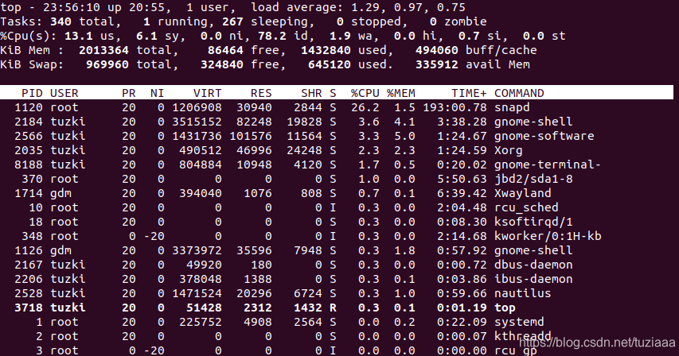

# gdb与Linux命令

## gdb命令

|     命令名称    |    命令缩写   |           命令说明           |
| :---------: | :-------: | :----------------------: |
|     run     |     r     |        运行一个待调试的程序        |
|   continue  |     c     |        让暂停的程序继续运行        |
|     next    |     n     |          运行到下一行          |
|     step    |     s     |       单步执行，遇到函数会进入       |
|    until    |     u     |         运行到指定行停下来        |
|    finish   |     fi    |    结束当前调用函数，回到上一层调用函数处   |
|    return   |   return  | 结束当前调用函数并返回指定值，到上一层函数调用处 |
|     jump    |     j     |     将当前程序执行流跳转到指定行或地址    |
|    print    |     p     |         打印变量或寄存器值        |
|  backtrace  |     bt    |        查看当前线程的调用堆栈       |
|    frame    |     f     |      切换到当前调用线程的指定堆栈      |
|    thread   |   thread  |          切换到指定线程         |
|    break    |     b     |           添加断点           |
|    tbreak   |     tb    |          添加临时断点          |
|    delete   |     d     |           删除断点           |
|    enable   |   enable  |          启用某个断点          |
|   disable   |  disable  |          禁用某个断点          |
|    watch    |   watch   |   监视某一个变量或内存地址的值是否发生变化   |
|     list    |     l     |           显示源码           |
|     info    |     i     |       查看断点 / 线程等信息       |
|    ptype    |   ptype   |          查看变量类型          |
| disassemble |    dis    |          查看汇编代码          |
|   set args  |  set args |        设置程序启动命令行参数       |
|  show args  | show args |        查看设置的命令行参数        |

## Linux命令

### 守护进程

进程一般分为三类：交互进程，批处理进程和守护进程。

守护进程（Daemon）是一种运行在后台的特殊进程。指的是在UNIX或其他多任务操作系统中在后台执行的电脑程序，并不会接受电脑用户的直接操控。此类程序会被以进程的形式初始化。它常常在系统启动时开始运行，在系统关闭时终止。

每一个从终端开始运行的进程都会依附于终端，因此终端也被称为这些进程的控制终端，当控制终端被关闭的时候，相应的进程都会自动关闭。但是守护进程却能突破这种限制，它脱离于终端并且在后台运行，并且它脱离终端的目的是为了避免进程在运行的过程中的信息在任何终端中显示并且进程也不会被任何终端所产生的终端信息所打断。

#### 守护进程原理

查看守护进程的命令为：

```sh
$ ps axj
```

守护进程必须与其运行前的环境隔离开来。这些环境包括未关闭的文件描述符，控制终端，会话和进程组，工作目录以及文件创建掩码等，通常这些环境是守护进程从执行它的父进程中继承下来的。

进程组：每运行一个程序或是命令就会产生一个进程组，而每一个进程组有一个组长进程（和创建用户一样，每创建一个用户都会有一个用户组。）进程组由进程组号(GID)标识,进程组号(GID)为组长进程PID,一般进程组的第一个进程是组长进程。多个进程进程组成我们的进程组。进程组的主要目的是为了实现作业控制（Job Control），即对一组相关的进程进行协调和管理。有些操作系统使用进程组来组织与终端会话（Terminal Session）相关的进程，以实现对终端的控制和管理。

会话:一次用户登录形成一个会话,一个会话可包含多个进程组(前台或后台), 但只能有一个前台进程组。这个会话的生命周期覆盖了用户登录到系统直到注销或者会话超时。

控制终端：会话的首进程(session leader，与组长进程不是一个概念，但可能是同一个)打开一个终端之后, 该终端就成为该会话的控制终端。与控制终端建立连接的会话首进程称为控制进程,一个会话只能有一个控制终端。

#### 守护进程的创建过程

<1>创建子进程，父进程退出

这是创建守护进程的第一步。由于守护进程是脱离控制终端的，因此，完成第一步后就会在Shell终端里造成一程序已经运行完毕的假象。之后的所有工作都在子进程中完成，而用户在Shell终端里则可以执行其他命令，从而在形式上做到了与控制终端的脱离。在Linux中父进程先于子进程退出会造成子进程成为孤儿进程，而每当系统发现一个孤儿进程是，就会自动由1号进程（init）收养它，这样，原先的子进程就会变成init进程的子进程。

<2>在子进程中创建的新会话 \[脱离控制终端]

Linux是一个多用户多任务系统，每个进程都有一个进程ID，同时每个进程还都属于某一个进程组，而每个进程组都有一个组长进程，组长进程的标识ID等于进程组的ID，且该进程组ID不会因组长进程的退出而受到影响。会话期是一个或多个进程组的集合，通常，一个会话开始与用户登录，终止于用户退出，在此期间该用户运行的所有进程都属于这个会话期。我们这里要用到setsid()函数。

setsid()函数的作用：创建一个新的会话，并且担任该会话组的组长。具体作用包括：让一个进程摆脱原会话的控制，让进程摆脱原进程的控制，让进程摆脱原控制终端的控制。

<3>改变进程的工作目录到"/"

使用fork创建的子进程继承了父进程的当前工作目录。守护进程不应当使用父进程的工作目录，应该设置自己的工作目录，通常可以通过chdir()来完成，一般可以将其设置为根目录

<4>重设文件掩码 umask(0)

守护进程从父进程继承来的文件创建方式掩码可能会拒绝设置某些许可权限，文件权限掩码是指屏蔽掉文件权限中的对应位。

<5>关掉不需要的文件描述符号 \[0,1,2]

分别表示标准输入、标准输出、标准出错

#### crontab命令

crontab 命令用于设置周期性被执行的指令，它一般从输入设备读取指令，并将其存放于 crontab 文件中，以供之后读取和执行。通常，crontab 储存的指令被守护进程激活，crond 为其守护进程，crond 常常在后台运行，每一分钟会检查一次是否有预定的作业需要执行。

通过 crontab 命令，我们可以在固定的间隔时间执行指定的系统指令或 shell 脚本。时间间隔的单位可以是分钟、小时、日、月、周的任意组合。

```sh
# 后台启动crontab
$ sudo crontab -f
# 添加一个计划任务，会打开一个文档，可在最后一行写入想要执行的命令
$ crontab -e
# 该任务是每分钟会在/home/skx 目录下创建一个以当前的年月日时分秒为名字的空白文件
*/1 * * * * touch /home/skx/$(date +\%Y\%m\%d\%H\%M\%S)
# 查看添加了哪些任务
$ crontab -l
# 查找cron是否成功在后台启动
$ ps aux | grep cron 
or
$ pgrep cron
# 删除任务
$ crontab -r
```

### 进程，线程状态查看

#### top

实时显示系统中各个进程的资源占用状况，类似于Windows的任务管理器

top \[-] \[d] \[q] \[c] \[S] \[s] \[i] \[n] \[b]

d : 改变显示的更新速度，或是在交谈式指令列( interactive command)按 s

q : 没有任何延迟的显示速度，如果使用者是有 superuser 的权限，则 top 将会以最高的优先序执行

c : 切换显示模式，共有两种模式，一是只显示执行档的名称，另一种是显示完整的路径与名称

S : 累积模式，会将己完成或消失的子行程 ( dead child process ) 的 CPU time 累积起来

s : 安全模式，将交谈式指令取消, 避免潜在的危机

i : 不显示任何闲置 (idle) 或无用 (zombie) 的行程

n : 更新的次数，完成后将会退出 top

b : 批次档模式，搭配 "n" 参数一起使用，可以用来将 top 的结果输出到档案内



可用内存=free + buffer + cached

对于内存监控，在top里我们要时刻监控第五行swap交换分区的used，如果这个数值在不断的变化，说明内核在不断进行内存和swap的数据交换，这是真正的内存不够用了。

第四行中使用的内存总量（used）指的是现在系统内核控制的内存数，空闲内存总量（free）是内核还未纳入其管控范围的数量。

纳入内核管理的内存不见得都在使用中，还包括过去使用过的现在可以被重复利用的内存，内核并不把这些可被重新使用的内存交还到free中去，因此在linux上free内存会越来越少，但不用为此担心。

常用示例：

```sh
top   # 每隔5秒显式所有进程的资源占用情况
top -d 2  # 每隔2秒显式所有进程的资源占用情况
top -c  # 每隔5秒显式进程的资源占用情况，并显示进程的命令行参数(默认只有进程名)
top -p 12345 -p 6789 # 每隔5秒显示pid是12345和pid是6789的两个进程的资源占用情况
top -d 2 -c -p 123456 # 每隔2秒显示pid是12345的进程的资源使用情况，并显式该进程启动的命令行参数
```

#### strace

strace是一个可用于诊断、调试和教学的Linux用户空间跟踪器。我们用它来监控用户空间进程和内核的交互，比如系统调用、信号传递、进程状态变更等。它可以跟踪系统调用的执行。最简单的方式，它可以从头到尾跟踪binary的执行，然后以一行文本输出系统调用的名字，参数和返回值。

strace常用来跟踪进程执行时的系统调用和接收所接收的信号，在Linux中，进程不能直接访问硬件设备，当进程需要访问硬件设备的时候（如读取磁盘，接收网络数据的时候），必须由用户态模式切换至内核态模式，通过系统调用访问硬件设备。strace可以跟踪到一个进程产生的系统调用，包括参数，返回值，执行消耗的时间。

Linux 操作系统有很多用来跟踪程序行为的工具，内核态的函数调用跟踪用「strace」，用户态的函数调用跟踪用「ltrace」

strace有两种运行模式：

一种是**通过它启动要跟踪的进程**。用法很简单，**在原本的命令前加上strace即可**。比如我们要跟踪 "ls -lh /var/log/messages" 这个命令的执行：

```sh
$ strace ls -lh /var/log/messages
```

另外一种运行模式，是**跟踪已经在运行的进程**，在不中断进程执行的情况下进行跟踪。 这种情况，**给strace传递个-p pid 选项即可**。

```sh
# 跟踪28979进程的所有系统调用（-e trace=all），并统计系统调用的花费时间，以及开始时间（并以可视化的时分秒格式显示），最后将记录结果存在output.txt文件里
$ strace -o output.txt -T -tt -e trace=all -p 28979
```

#### pstack

对指定PID的进程输出函数调用栈，这个命令在排查进程问题时非常有用，比如我们发现一个服务一直处于work状态（如假死状态，好似死循环），使用这个命令就能轻松定位问题所在；可以在一段时间内，多执行几次pstack，若发现代码栈总是停在同一个位置，那个位置就需要重点关注，很可能就是出问题的地方。

```sh
# 跟踪30222进程的函数调用栈
$ pstack 30222
```

### 内存状态查看

#### memstat

memstat可以帮你查看每个共享库的内存占用

运行 memstat -w 即可列出当前所有共享库的信息，如果不加 -w 参数，memstat 会把过长的信息截断到 80 列。

第一列为内存占用，随后的数字是使用这个共享库进程的 PID，最后是共享库的完整路径，同一共享库往往有很多 PID，表示这个共享库被多个进程所共享。

如果你想查看那个共享库占用的内存最多，只需要用 sort 过滤一下：memstat -w | sort -rn

#### free

free指令会显示内存的使用情况，包括物理内存，虚拟的交换文件内存，共享内存区段，以及内核缓冲区内存等。

free -bkmotV \[-s < 间隔秒数 >]

参数说明：

-b 　以Byte为单位显示内存使用情况。

-k 　以KB为单位显示内存使用情况。

-m 　以MB为单位显示内存使用情况。

-h 　以合适的单位显示内存使用情况，最大为三位数，自动计算对应的单位值。单位有：

-o 　不显示缓冲区调节列。

-s <间隔秒数> 　持续观察内存使用状况。

-t 　显示内存总和列。

-V 　显示版本信息。

### I/O状态查看

#### iostat

iostat命令被用于监视系统输入输出设备和CPU的使用情况。它的特点是汇报磁盘活动统计情况，同时也会汇报出CPU使用情况。同vmstat一样，iostat也有一个弱点，就是它不能对某个进程进行深入分析，仅对系统的整体情况进行分析。

iostat (选项) (参数)

选项 -c：仅显示CPU使用情况； -d：仅显示设备利用率； -k：显示状态以千字节每秒为单位，而不使用块每秒； -m：显示状态以兆字节每秒为单位； -p：仅显示块设备和所有被使用的其他分区的状态； -t：显示每个报告产生时的时间； -V：显示版号并退出； -x：显示扩展状态。 参数 间隔时间：每次报告的间隔时间（秒）； 次数：显示报告的次数。

```sh
# 观看磁盘I/O的详细情况
$ iostat -x /dev/sda1 
```

#### df

df命令用于显示磁盘分区上的可使用的磁盘空间。默认显示单位为KB。可以利用该命令来获取硬盘被占用了多少空间，目前还剩下多少空间等信息。

语法

​ df (选项) (参数)

选项

​ -a或--all：包含全部的文件系统；

​ --block-size=<区块大小>：以指定的区块大小来显示区块数目；

​ -h或--human-readable：以可读性较高的方式来显示信息；

​ -H或--si：与-h参数相同，但在计算时是以1000 Bytes为换算单位而非1024 Bytes；

​ -i或--inodes：显示inode的信息；

​ -k或--kilobytes：指定区块大小为1024字节；

​ -l或--local：仅显示本地端的文件系统；

​ -m或--megabytes：指定区块大小为1048576字节；

​ --no-sync：在取得磁盘使用信息前，不要执行sync指令，此为预设值；

​ -P或--portability：使用POSIX的输出格式；

​ --sync：在取得磁盘使用信息前，先执行sync指令；

​ -t<文件系统类型>或--type=<文件系统类型>：仅显示指定文件系统类型的磁盘信息；

​ -T或--print-type：显示文件系统的类型；

​ -x<文件系统类型>或--exclude-type=<文件系统类型>：不要显示指定文件系统类型的磁盘信息；

​ --help：显示帮助；

​ --version：显示版本信息。

参数

​ 文件：指定文件系统上的文件。

#### du

du命令也是查看使用空间的，但是与df命令不同的是Linux du命令是对文件和目录磁盘使用的空间的查看。

语法

du \[选项] \[文件]

选项

​ -a或-all：显示目录中个别文件的大小。

​ -b或-bytes：显示目录或文件大小时，以byte为单位。

​ -c或--total：除了显示个别目录或文件的大小外，同时也显示所有目录或文件的总和。

​ -k或--kilobytes：以KB(1024bytes)为单位输出。

​ -m或--megabytes：以MB为单位输出。

​ -s或--summarize：仅显示总计，只列出最后加总的值。

​ -h或--human-readable：以K，M，G为单位，提高信息的可读性。

​ -x或--one-file-xystem：以一开始处理时的文件系统为准，若遇上其它不同的文件系统目录则略过。

​ -L<符号链接>或--dereference<符号链接>：显示选项中所指定符号链接的源文件大小。

​ -S或--separate-dirs：显示个别目录的大小时，并不含其子目录的大小。

​ -X<文件>或--exclude-from=<文件>：在<文件>指定目录或文件。

​ --exclude=<目录或文件>：略过指定的目录或文件。

​ -D或--dereference-args：显示指定符号链接的源文件大小。

​ -H或--si 与-h：参数相同，但是K，M，G是以1000为换算单位。

​ -l或--count-links：重复计算硬件链接的文件。

### 文件属性变动

#### chown，chgrp和chmod

chown：改变文件(目录)的所有组和所有人(全能改变)

chgrp: 只能改变文件(目录)的所有组

chmod: 字符方式修改文件权限(只能修改权限)

```sh
$ chown username file或者dir      更改文件或者目录的拥有者
$ chown user-group file或者dir   
#user-group不是命令表示的是username.groupname 更改文件或者目录的用户和用户组
$ chown -R user-group dir       递归更改目录的用户和用户组 
$ chown  改用户名字
$ chgrp   改用户组名字
$ chown  -R  改用户名字及其子目录下的所有文件用户名（一改到底）
$ chgrp  -R  改用户组名字及其子目录下的所有文件的用户组名字（一改到底）
$ chmod +（增加权限）or -（去掉权限）来改变权限
```

### 文件传输

#### scp

SCP ：secure copy (remote file copy program) 也是一个基于SSH安全协议的文件传输命令。与sftp不同的是，它只提供主机间的文件传输功能，没有文件管理的功能。

复制local\_file 到远程目录remote\_folder下：

```sh
$ scp local_file remote_user@host:remote_folder
```

复制local\_folder 到远程remote\_folder：加个-r即可

#### sz/rz

sz/rz 是基于ZModem传输协议的命令。对传输的数据会进行核查，并且有很好的传输性能。使用起来更是非常方便，但前提是window端需要有能够支持ZModem的telnet或者SSH客户端，例如secureCRT。

首先需要在secureCRT中可以配置相关的本地下载和上传目录，然后用rz、sz命令即可方便的传输文件数据。

下载数据到本地下载目录：sz filename1 filename2 …

上传数据到远程：执行rz –be 命令，客户端会弹出上传窗口，用户自行选择(可多选)要上传的文件即可。

### 文件查找

#### which

在PATH变量指定的路径中，搜索某个系统命令的位置，并且返回第一个搜索结果，查询命令和可执行文件，而且是PATH里的。也就是说，使用which命令，就可以看到某个系统命令是否存在，以及执行的到底是哪一个位置的命令。例如 which ls

#### whereis

whereis只可以查找命令，（man中说只能查命令、源文件和man文件，实际测试可以查大多数文件）。在$PATH路径基础上增加了一些系统目录的查找，查找范围比which稍大，查找速度快。可以通过 -b 选项，限定只搜索二进制文件。

#### locate

ocate命令其实是“find -name”的另一种写法，但是要比后者快得多，原因在于它不搜索具体目录，而是搜索一个数据库（/var/lib/locatedb），这个数据库中含有本地所有文件信息。Linux系统自动创建这个数据库，并且每天自动更新一次，所以使用locate命令查不到最新变动过的文件。为了避免这种情况，可以在使用locate之前，先使用updatedb命令（root用户执行），手动更新数据库。

#### find

find是最常见和最强大的查找命令，可以用它找到任何想找的文件。

find <指定目录> <指定条件> <指定动作>，一般来说常用的有：

```sh
$ find . -name "my*" 搜索当前目录（含子目录，以下同）中，所有文件名以my开头的文件。

$ find /home/test_0  -name "*.txt"  查询/home/test_0目录下以.txt结尾的文件

$ find . -name "my*" -ls 搜索当前目录中，所有文件名以my开头的文件，并显示它们的详细信息

$ find . -type f -mmin -10 搜索当前目录中，所有过去10分钟中更新过的普通文件
```

#### grep 过滤查找及“|”管道符

### 软链接

为了方便用户访问文件，Linux提供了一种称为连接（link）的机制，可以将一个文件或目录与另一个文件或目录建立关联，**从而实现多个路径指向同一个文件或目录的效果**。Linux中的连接分为两种类型：硬链接（hard link）和软链接（symbolic link）

**硬链接**是指在同一个文件系统中，将一个文件名关联到一个已经存在的文件上，使得该文件名也可以访问该文件。硬链接与原文件共享inode，即它们有相同的inode号和相同的device号。因此，对于硬链接和原文件来说，它们的访问权限、所有者、大小等属性都是相同的。硬链接只有在同一个文件系统中才能创建，并且不能对目录建立硬链接。

**软链接**（也称符号链接）是指在不同的文件系统之间，将一个文件名关联到另一个文件上，使得该文件名也可以访问该文件。软链接与原文件不共享inode，它们有不同的inode号和device号。因此，\***对于软链接和原文件来说，它们的访问权限、所有者、大小等属性可能不同\***。软链接可以对目录进行链接，也可以对不存在的文件进行链接，还可以跨越文件系统。

更简单的说，软链接相当于windows的快捷方式

#### ln

ln是linux中又一个非常重要命令，它的功能是为某一个文件在另外一个位置建立一个同步的链接.当我们需要在不同的目录，用到相同的文件时，我们不需要在每一个需要的目录下都放一个必须相同的文件，我们只要在某个固定的目录，放上该文件，然后在其它的目录下用ln命令链接（link）它就可以，不必重复的占用磁盘空间。

ln 参数 源文件或目录 目标文件或目录

必要参数：

-b：删除，覆盖以前建立的链接 -d：允许超级用户制作目录的硬链接 -f：强制执行 -i：交互模式，文件存在则提示用户是否覆盖 -n：把符号链接视为一般目录 -s：软链接(符号链接) -v：显示详细的处理过程

选择参数:

-S：“-S<字尾备份字符串> ”或 “–suffix=<字尾备份字符串>” -V：“-V<备份方式>”或“–version-control=<备份方式>” –help：显示帮助信息 –version：显示版本信息

额外注意：

1. ln命令会保持每一处链接文件的同步性，也就是说，不论你改动了哪一处，其它的文件都会发生相同的变化
2. ln的链接又分软链接和硬链接两种，软链接就是ln –s 源文件 目标文件，它只会在你选定的位置上生成一个文件的镜像，不会占用磁盘空间，硬链接 ln 源文件 目标文件，没有参数-s， 它会在你选定的位置上生成一个和源文件大小相同的文件，无论是软链接还是硬链接，文件都保持同步变化
3. ln指令用在链接文件或目录，如同时指定两个以上的文件或目录，且最后的目的地是一个已经存在的目录，则会把前面指定的所有文件或目录复制到该目录中。若同时指定多个文件或目录，且最后的目的地并非是一个已存在的目录，则会出现错误信息

### 文件查看

#### lsof

命令 lsof （ list opened files ）负责列出系统中已经打开的文件，包括普通文件，目录，块特殊文件，字符特殊文件，正在执行的文本引用，库，流或网络文件（例如：网络套接字，NFS文件或UNIX域套接字）。

参数：

-p pid : 输出指定进程打开的文件；

-l : 输出中使用ID代替用户名；

-u userName : 输出指定用户打开的文件；

-c string : 输出 COMMAND 列中包含 string 的项；

-d fd : 输出包含指定描述符的项；

fileName : 输出打开文件 fileName 的所有项；

-i (4/6) (protocol) (@hostname|hostaddr) (:service|port) : 输出符合指定条件的项

​ 4/6：分别指 IPv4、IPv6；

​ protocol：指 TCP 或 UDP；

​ hostname：网络主机名；

​ hostaddr： IP 地址；

​ service：包含在 /etc/services 中的名称；

​ port：端口号，可以是多个；

### tcpdump

参数：

-i：指定抓取的网络接口

-c：指定抓取的数据包数量

-n：不解析IP和端口号

-s：设置抓包的数据包大小

-X：以十六进制和ASCII码形式输出数据包内容

host：指定抓取数据包的源主机或目标主机

port：抓取指定端口的数据包

src/dst：抓取指定源IP或目的IP的数据包

proto：指定抓取的协议类型

### 网络状态和防火墙状态查看

#### netstat

netstat命令用于显示Linux系统网络链接状态，还用于显示与IP、TCP、UDP和ICMP协议相关的统计数据，一般用于检验本机各端口的网络连接情况。

netstat是在内核中访问网络及相关信息的程序，它可以显示路由表、实际的网络连接以及每一个网络接口设备的状态信息。

**Linux服务器上11种网络连接状态**

LISTEN：侦听来自远方的TCP端口的连接请求

SYN-SENT：再发送连接请求后等待匹配的连接请求（如果有大量这样的状态包，检查是否中招了）

SYN-RECEIVED：再收到和发送一个连接请求后等待对方对连接请求的确认（如有大量此状态，估计被flood攻击了）

ESTABLISHED：代表一个打开的连接

FIN-WAIT-1：等待远程TCP连接中断请求，或先前的连接中断请求的确认

FIN-WAIT-2：从远程TCP等待连接中断请求

CLOSE-WAIT：等待从本地用户发来的连接中断请求

CLOSING：等待远程TCP对连接中断的确认

LAST-ACK：等待原来的发向远程TCP的连接中断请求的确认

TIME-WAIT：等待足够的时间以确保远程TCP接收到连接中断请求的确认

CLOSED：没有任何连接状态

#### ifconfig

用于显示或设置网络设备，同时用来配置或查看网卡接口

#### lptables
