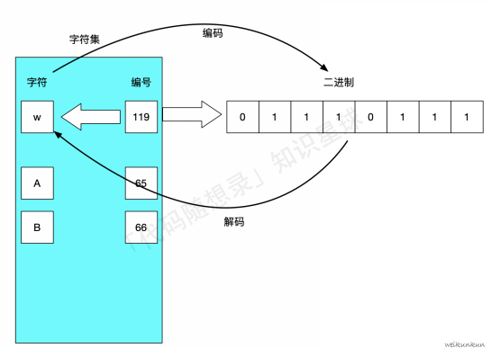
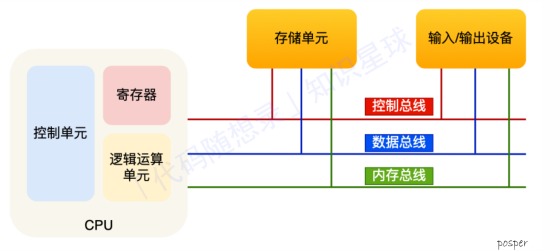

# 计算机系统

## 字符编码

我们通过在字符和⼆进制编码之间嵌套⼀个数字编号，通过数字编号，就能实现字符、⼆进制编码之间的关系绑定。

像这样收录了很多的字符并⾏⼀⼀编号得到的⼀个对照表，我们称之为字符集。从⼆进制 -> 字符称为编码，从字符 -> ⼆进制称为解码

同⼀个⼆进制，在不同的字符集可能对应的字符不同，这也就导致了同⼀个⽂件，通过不同的字符集进⾏解码，呈现的结果不同（也就是我们所说的乱码）。如果有⼀种统⼀的编码形式（很全的字符集），对所有的字符 都能提供唯⼀的⼆进制编码，那么就能解决上述的问题。Unicode就是这个很全的字符集。

对于编码策略来说，还分为固定长度编码/可变长度编码

固定长度编码能⾼效、快速进⾏编码、解码，但也会导致内存的浪费。同时随着编码越来越⼤，编码之间的跨度也就越⼤，这样定长编码造成的浪费就更加显著

可变长度编码让小编号占用的字节少，大编码占用的字节多

这种编码方式其实就是我们所熟知的UTF-8编码，同时也是Go默认的编码⽅式

## 冯诺依曼模型

分为五大部件：内存、CPU、总线、输⼊设备、输出设备

内存：从 0 开始编号，最先存储单位是字节（byte），程序和数据都在内存中

### CPU

​ CPU 位宽： CPU ⼀次能处理多少字节的数据，32位一次性能计算4个字节，64位一次可以计算8个字节

​ 为了能⼀次计算⼤数的运算，CPU需要⽀持多个byte⼀起计算，所以CPU位宽越⼤，可以计算的数值就越⼤

​ CPU内部还有⼀些组件，常见的有寄存器、控制单元和逻辑运算单元等

​ 控制单元： 控制CPU⼯作；逻辑运算单元： 负责计算；寄存器： 在 CPU 中，计算速度快

​ 常见寄存器类型：

​ 通⽤寄存器：放运算数据

​ 程序记数器（PC）：⽤来存放 CPU 下⼀条要执⾏指令的 内存地址；

​ 指令寄存器：⽤来存放 PC 执⾏的指令，即指令本⾝（取值后放⼊到指令寄存器中）

### 总线

⽤于 CPU 和内存以及其他设备之间的通信，总线可分为 3 种:

​ 地址总线：⽤于指定CPU将要操作的内存地址

​ 数据总线：⽤于读写内存的数据

​ 控制总线：⽤于发送和接收信号，⽐如中断、设备复位等信号，CPU收到信号后⾃然进⾏响应，这时也需要控制总线

当CPU要读写内存数据的时候．⼀般需要通过三个总线：

​ ⾸先要通过「地址总线」来指定内存的地址；

​ 然后通过「控制总线」控制是读或写命令；

​ 最后通过「数据总线」来传输数据

程序的执行过程：

现代⼤多数 CPU 都使⽤来流⽔线的⽅式来执⾏指令，所谓的流⽔线就是把⼀个任务拆分成多个⼩任务，具体步骤为：

​ 1.取指令

​ 2.CPU 的控制单元向\[地址总线]发送PC中的地址，从内存中找到待执⾏指令

​ 3.将待执⾏指令通过数据总线传⼊到CPU中的指令寄存器中

​ 4.⾃动更新 PC，指向下⼀条待执⾏指令的地址

​ 5.分析指令

​ 6.CPU分析「指令寄存器」中的指令，确定指令的类型和参数：

​ 如果是计算类型的指令，就把指令交给「逻辑运算单元」运算

​ 如果是存储类型的指令，则交由「控制单元」执⾏

​ 7.执行指令

​ 8.根据译指的结果，把指令交给 CPU 中响应的控件（逻辑运算单元/控制单元）执⾏

​ 9.数据回写

​ 10.CPU 将计算结果存回寄存器或者将寄存器的值存⼊内存

## 线路位宽和CPU位宽

数据通过通过操作电压进行线路传输，低电压表示 0，高压电压则表示 1。

如果构造了高低高这样的信号，其实就是 101 二进制数据，十进制则表示 5，如果只有一条线路，就意味着每次只能传递 1 bit 的数据，即 0 或 1，那么传输 101 这个数据，就需要 3 次才能传输完成，这样的效率非常低。这样一位一位传输的方式，称为串行，下一个 bit 必须等待上一个 bit 传输完成才能进行传输。当然，想一次多传一些数据，增加线路即可，这时数据就可以并行传输。

为了避免低效率的串行传输的方式，线路的位宽最好一次就能访问到所有的内存地址。

CPU 想要操作「内存地址」就需要「地址总线」：

* 如果地址总线只有 1 条，那每次只能表示 「0 或 1」这两种地址，所以 CPU 能操作的内存地址最大数量为 2（2^1）个（注意，不要理解成同时能操作 2 个内存地址）；
* 如果地址总线有 2 条，那么能表示 00、01、10、11 这四种地址，所以 CPU 能操作的内存地址最大数量为 4（2^2）个。

那么，想要 CPU 操作 4G 大的内存，那么就需要 32 条地址总线，因为 `2 ^ 32 = 4G`

CPU 的位宽最好不要小于线路位宽，比如 32 位 CPU 控制 40 位宽的地址总线和数据总线的话，工作起来就会非常复杂且麻烦，所以 32 位的 CPU 最好和 32 位宽的线路搭配，因为 32 位 CPU 一次最多只能操作 32 位宽的地址总线和数据总线。

64位CPU的性能在32位计算上与32位没有区别，只有当计算超过 32 位数字的情况下，64 位的优势才能体现出来

如果用 32 位 CPU 去加和两个 64 位大小的数字，就需要把这 2 个 64 位的数字分成 2 个低位 32 位数字和 2 个高位 32 位数字来计算，先加个两个低位的 32 位数字，算出进位，然后加和两个高位的 32 位数字，最后再加上进位，就能算出结果。

总结：

64 位相比 32 位 CPU 的优势在哪吗？64 位 CPU 的计算性能一定比 32 位 CPU 高很多吗？

64 位相比 32 位 CPU 的优势主要体现在两个方面：

* 64 位 CPU 可以一次计算超过 32 位的数字，而 32 位 CPU 如果要计算超过 32 位的数字，要分多步骤进行计算，效率就没那么高，但是大部分应用程序很少会计算那么大的数字，所以**只有运算大数字的时候，64 位 CPU 的优势才能体现出来，否则和 32 位 CPU 的计算性能相差不大**。
* 通常来说 64 位 CPU 的地址总线是 48 位，而 32 位 CPU 的地址总线是 32 位，所以 64 位 CPU 可以**寻址更大的物理内存空间**。如果一个 32 位 CPU 的地址总线是 32 位，那么该 CPU 最大寻址能力是 4G，即使你加了 8G 大小的物理内存，也还是只能寻址到 4G 大小的地址，而如果一个 64 位 CPU 的地址总线是 48 位，那么该 CPU 最大寻址能力是 `2^48`，远超于 32 位 CPU 最大寻址能力。

软件的 32 位和 64 位之间的区别吗？再来 32 位的操作系统可以运行在 64 位的电脑上吗？64 位的操作系统可以运行在 32 位的电脑上吗？如果不行，原因是什么？

64 位和 32 位软件，实际上代表指令是 64 位还是 32 位的：

* 如果 32 位指令在 64 位机器上执行，需要一套兼容机制，就可以做到兼容运行了。但是**如果 64 位指令在 32 位机器上执行，就比较困难了，因为 32 位的寄存器存不下 64 位的指令**；
* 操作系统其实也是一种程序，我们也会看到操作系统会分成 32 位操作系统、64 位操作系统，其代表意义就是操作系统中程序的指令是多少位，比如 64 位操作系统，指令也就是 64 位，因此不能装在 32 位机器上。

硬件的 64 位和 32 位指的是 CPU 的位宽，软件的 64 位和 32 位指的是指令的位宽
