# MySQL

## 执行一条 select 语句，期间发生了什么

MySQL 的架构共分为两层：**Server 层和存储引擎层**

* **Server 层负责建立连接、分析和执行 SQL**。MySQL 大多数的核心功能模块都在这实现，主要包括连接器，查询缓存、解析器、预处理器、优化器、执行器等。另外，所有的内置函数（如日期、时间、数学和加密函数等）和所有跨存储引擎的功能（如存储过程、触发器、视图等。）都在 Server 层实现。
* **存储引擎层负责数据的存储和提取**。支持 InnoDB、MyISAM、Memory 等多个存储引擎，不同的存储引擎共用一个 Server 层。现在最常用的存储引擎是 InnoDB，从 MySQL 5.5 版本开始， InnoDB 成为了 MySQL 的默认存储引擎。我们常说的索引数据结构，就是由存储引擎层实现的，不同的存储引擎支持的索引类型也不相同，比如 InnoDB 支持索引类型是 B+树 ，且是默认使用，也就是说在数据表中创建的主键索引和二级索引默认使用的是 B+ 树索引。

### 连接器

首先要连接mysql服务，使用以下命令进行连接：

```
# -h 指定 MySQL 服务得 IP 地址，如果是连接本地的 MySQL服务，可以不用这个参数；
# -u 指定用户名，管理员角色名为 root；
# -p 指定密码，如果命令行中不填写密码（为了密码安全，建议不要在命令行写密码），就需要在交互对话里面输入密码
mysql -h$ip -u$user -p
```

连接过程需要经过TCP三次握手，之后如果用户密码都没有问题，连接器就会获取该用户的权限，然后保存起来，后续该用户在此连接里的任何操作，都会基于连接开始时读到的权限进行权限逻辑的判断。

MySQL 定义了空闲连接的最大空闲时长，由 `wait_timeout` 参数控制的，默认值是 8 小时（28880秒），如果空闲连接超过了这个时间，连接器就会自动将它断开。当然，我们自己也可以手动断开空闲的连接，使用的是 `kill connection + id` 的命令

MySQL 服务支持的最大连接数由 `max_connections` 参数控制，超过这个值，系统就会拒绝接下来的连接请求

MySQL 的连接也跟 HTTP 一样，有短连接和长连接的概念，使用长连接的好处就是可以减少建立连接和断开连接的过程，所以一般是推荐使用长连接

但是，使用长连接后可能会占用内存增多，因为 MySQL 在执行查询过程中临时使用内存管理连接对象，这些连接对象资源只有在连接断开时才会释放。如果长连接累计很多，将导致 MySQL 服务占用内存太大，有可能会被系统强制杀掉，这样会发生 MySQL 服务异常重启的现象。

#### 如何解决MySQL长连接占用内存的问题

1.**定期断开长连接**。既然断开连接后就会释放连接占用的内存资源，那么我们可以定期断开长连接

2.**客户端主动重置连接**

### 查询缓存（MySQL8.0后已经删除）

MySQL 服务收到 SQL 语句后，如果 SQL 是查询语句（select 语句），MySQL 就会先去查询缓存（ Query Cache ）里查找缓存数据，看看之前有没有执行过这一条命令，这个查询缓存是以 key-value 形式保存在内存中的，key 为 SQL 查询语句，value 为 SQL 语句查询的结果。

查询缓存的命中率非常低，因此后来直接删除了

### 解析SQL

在正式执行 SQL 查询语句之前， MySQL 会先对 SQL 语句做解析，这个工作交由「解析器」来完成

解析器处理的顺序为：词法分析（类似于C编译阶段的符号扫描）->语法分析（类似于C编译阶段的语法分析+语义分析，负责构建语法树+检查是否符合语法）

解析器不会负责看表或者字段存不存在

### 执行SQL

每条`SELECT` 查询语句流程主要可以分为下面这三个阶段：prepare（预处理阶段），optimize（优化阶段），execute（执行阶段）

prepare：检查 SQL 查询语句中的表或者字段是否存在；将 `select *` 中的 `*` 符号，扩展为表上的所有列

optimize：为 SQL 查询语句先制定一个执行计划；在表里面有多个索引的时候，优化器会基于查询成本的考虑，来决定选择使用哪个索引

```sql
# 要想知道优化器选择了哪个索引，我们可以在查询语句最前面加个 explain 命令，这样就会输出这条 SQL 语句的执行计划
# 结果为key的结果
explain select * from product where id = 1;
```

execute：执行器和存储引擎以记录为单位进行交互（主键索引查询+全表扫描+索引下推）

#### 索引下推

索引下推能够减少二级索引（注意必须是二级索引才行）在查询时的回表操作，提高查询的效率，因为它将 Server 层部分负责的事情，交给存储引擎层去处理了。

单列索引不允许重复，二级索引允许重复。二级索引在创建时的先后性非常关键，它决定了查询的顺序和效率。查询语句的条件也需要根据索引创建的顺序进行（依照最左匹配原则）

```sql
# 针对age和reward创建二级索引
CREATE INDEX idx_age_reward ON t_user(age, reward);
# 如果已经有一个索引，希望新加一个索引组成二级索引
ALTER TABLE t_user ADD INDEX idx_age_reward(age, reward);
# 使用查询语句
select * from t_user  where age > 20 and reward = 100000;
```

联合索引当遇到范围查询 (>、<) 就会停止匹配，也就是 age 字段能用到联合索引，但是 reward 字段则无法利用到索引。每查询一个满足条件的键值对，就要先进行回表操作，在server中进一步判断（reward = 100000），如果成立则将其发送给客户端；否则跳过该记录。

显然，索引下推的核心就是：存储引擎定位到二级索引后，先不执行回表操作，而是先判断一下该索引中包含的列（reward列）的条件（reward 是否等于 100000）是否成立。如果条件不成立，则直接跳过该二级索引。如果成立，则执行回表操作，将完成记录返回给 Server 层。

## MySQL 一行记录是怎么存储的

每创建一个数据库，MySQL都会在 /var/lib/mysql/ 目录里面创建一个以 database 为名的目录，然后保存表结构和表数据的文件都会存放在这个目录里。

其中有三个文件，分别是.opt文件（保存字符集规则），.frm文件（保存表结构）以及.ibd文件（保存表数据）

表空间由段->区->页->行组成

行：数据库表中的记录都是按行（row）进行存放的，每行记录根据不同的行格式，有不同的存储结构。

页：InnoDB 的数据是按「页」为单位来读写的，也就是说，当需要读一条记录的时候，并不是将这个行记录从磁盘读出来，而是以页为单位，将其整体读入内存。默认每个页的大小为 16KB，也就是最多能保证 16KB 的连续存储空间。页是 InnoDB 存储引擎磁盘管理的最小单元，意味着数据库每次读写都是以 16KB 为单位的，一次最少从磁盘中读取 16K 的内容到内存中，一次最少把内存中的 16K 内容刷新到磁盘中。

区：在表中数据量大的时候，为某个索引分配空间的时候就不再按照页为单位分配了，而是按照区（extent）为单位分配。每个区的大小为 1MB，对于 16KB 的页来说，连续的 64 个页会被划为一个区，这样就使得链表中相邻的页的物理位置也相邻，就能使用顺序 I/O 了。区让B+树在查询的过程中可以使用顺序IO，让链表中相邻的页的物理位置也相邻，提高查询效率。

段：表空间是由各个段（segment）组成的，段是由多个区（extent）组成的。段一般分为数据段、索引段和回滚段等（C编译过程则是代码段和数据段）

* 索引段：存放 B + 树的非叶子节点的区的集合；
* 数据段：存放 B + 树的叶子节点的区的集合；
* 回滚段：存放的是回滚数据的区的集合，MVCC 就是利用了回滚段实现了多版本查询数据。

### InnoDB行格式

InnoDB 提供了 4 种行格式，分别是 Redundant、Compact、Dynamic和 Compressed 行格式

* Redundant在MySQL5.0之前就没人用了
* Compact 是一种紧凑的行格式，设计的初衷就是为了让一个数据页中可以存放更多的行记录，从 MySQL 5.1 版本之后，行格式默认设置成 Compact。
* Dynamic 和 Compressed 两个都是紧凑的行格式，它们的行格式都和 Compact 差不多，因为都是基于 Compact 的改进，从 MySQL5.7 版本之后，默认使用 Dynamic 行格式。

#### Compact行格式

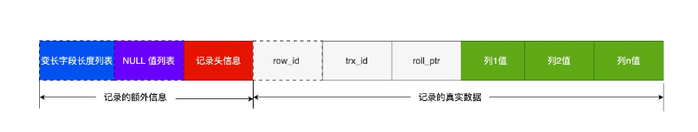

**变长字段长度列表**：对于变长字段来说（varchar等）实际存储的数据的长度（大小）是不固定的。所以，在存储数据的时候，也要把数据占用的大小存起来，存到「变长字段长度列表」里面，读取数据的时候才能根据这个「变长字段长度列表」去读取对应长度的数据。

这些变长字段的真实数据占用的字节数会按照列的顺序**逆序存放**，也就是说如果列1值，列2值都为变长字段。那么列2值实际占的字节数在左边，列1值实际占的字节数在右边。「变长字段长度列表」中的信息之所以要逆序存放，是因为这样可以使得位置靠前的记录的真实数据和数据对应的字段长度信息可以同时在一个 CPU Cache Line 中，这样就可以提高 CPU Cache 的命中率。（最左边的变长字段列在列表中的数据放在最右边可以最靠近）

NULL字段不在变长字段长度列表中。变长字段长度列表不是必须的，当数据表没有变长字段的时候，比如全部都是 int 类型的字段，这时候表里的行格式就不会有「变长字段长度列表」

**NULL值列表**：如果存在允许 NULL 值的列，则每个列对应一个二进制位（bit），二进制位按照列的顺序逆序排列（也是为了提高 CPU Cache 的命中率）。二进制位的值为1时，代表该列的值为NULL。当数据表的字段都定义成 NOT NULL 的时候，这时候表里的行格式就不会有 NULL 值列表了。在设计数据库表的时候，通常都是建议将字段设置为 NOT NULL，这样可以至少节省 1 字节的空间（NULL 值列表至少占用 1 字节空间）。

另外，NULL 值列表必须用整数个字节的位表示（1字节8位），如果使用的二进制位个数不足整数个字节，则在字节的高位补 0（最终值一定是8\*N位）

**记录头信息**：

* delete\_mask ：标识此条数据是否被删除。从这里可以知道，我们执行 detele 删除记录的时候，并不会真正的删除记录，只是将这个记录的 delete\_mask 标记为 1。
* next\_record：下一条记录的位置。从这里可以知道，记录与记录之间是通过链表组织的。在前面我也提到了，指向的是下一条记录的「记录头信息」和「真实数据」**之间的位置**，这样的好处是向左读就是记录头信息，向右读就是真实数据，比较方便。
* record\_type：表示当前记录的类型，0表示普通记录，1表示B+树非叶子节点记录，2表示最小记录，3表示最大记录

**记录的真实数据**：

* row\_id：如果我们建表的时候指定了主键或者唯一约束列，那么就没有 row\_id 隐藏字段了。如果既没有指定主键，又没有唯一约束，那么 InnoDB 就会为记录添加 row\_id 隐藏字段。row\_id不是必需的，占用 6 个字节。
* trx\_id：事务id，表示这个数据是由哪个事务生成的。 trx\_id是必需的，占用 6 个字节。
* roll\_pointer：记录上一个版本的指针。roll\_pointer 是必需的，占用 7 个字节。

### varchar(n) 中 n 最大取值为多少

MySQL 规定除了 TEXT、BLOBs 这种大对象类型之外，其他所有的行（不包括隐藏列和记录头信息）占用的字节长度加起来不能超过 65535 个字节（约等于64KB）。

varchar(n) 字段类型的 n 代表的是最多存储的字符数量，并不是字节大小。因此需要看数据库表的字符集 X n = 最大的字节数

如果有多个字段的话，要保证所有字段的长度 + 变长字段字节数列表所占用的字节数 + NULL值列表所占用的字节数 <= 65535。

### MySQL对于行溢出是如何处理的

在一个页（16KB）不能存下一条记录时，就会发生行溢出，多的数据就会存到另外的「溢出页」中

当发生行溢出时，在记录的真实数据处只会保存该列的一部分数据，而把剩余的数据放在「溢出页」中，然后真实数据处用 20 字节存储指向溢出页的地址，从而可以找到剩余数据所在的页。（Compact行格式下溢出的情况）

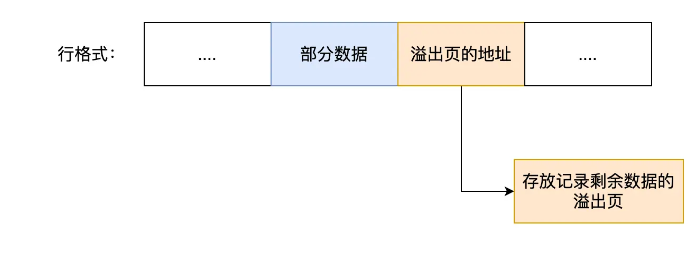

Compressed 和 Dynamic情况下溢真实数据处只会存储20个字节，而将实际的数据都存在溢出页中

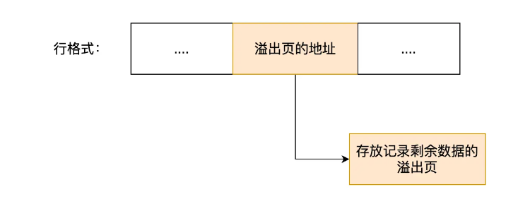

## mysql基础

主键，外键与索引：

​ 主键——唯⼀标识⼀条记录，不允许重复，不允许为空。用来保存数据的完整性

​ 外键——外键表⽰另⼀张表的主键，允许重复，可以是空值。主要⽤于和其它表建⽴联系。

​ （单列）索引——没有重复值，但可以有⼀个空值。为了提⾼查询排序的速度

表的优化策略：

​ 1.尽量使⽤TINYINT，SMALLINT，MEDIUM\_INT替代INT类型，如果是⾮负则加上UNSIGNED

​ 2.VARCHAR的长度只分配真正需要的空间

​ 3.尽量使⽤整数或者枚举替代字符串类型

​ 4.时间类型尽量使⽤TIMESTAMP⽽⾮DATETIME

​ 5.单表不要放太多字段

​ 6.尽量少使⽤NULL，很难查询优化⽽且占⽤额外索引空间

MySQL和MongoDB的区别：

​ 1.从数据库模型来说，前者为关系型，后者为非关系型

​ 2.存储方式上，前者针对不同引擎的存储方式不同，后者主要使用虚拟内存+持久化

​ 3.查询语句上，MySQL有专属的sql语句，MongoDB也有自己的查询方式

​ 4.常见架构上，MySQL包含单点，Master-Slave，MHA，Cluster；MongoDB通过副本集与分⽚来实现⾼可⽤

```
单点：数据库系统中的一个独立的、不可替代的节点，所有的请求都集中在这个节点上。这种架构存在单点故障的风险，因为如果单点发生故障，整个系统可能会受到影响。

Master-Slave（主从）：主从架构包括一个主数据库（Master）和多个从数据库（Slave）。主数据库负责处理写操作和同步数据到从数据库，而从数据库主要用于读取，提高读取性能和冗余备份。这种架构减轻了单点故障的压力，但主数据库仍然是关键节点。

MHA（MySQL Master High Availability，MySQL高可用）：通过监视主数据库的状态并在发生故障时自动切换到备用主数据库，从而减少停机时间。MHA的目标是实现主数据库的快速故障转移和自动恢复。本质上和Redis中的哨兵类似。

Cluster（集群）：集群是将多个计算机或服务器连接在一起，形成一个单一的系统，共同工作以提供更高的性能和可用性。在MySQL中，可以使用集群来水平扩展数据库性能，将数据分布在多个节点上。MySQL Cluster是一个用于实现高可用性和分布式数据库的解决方案。
```

​ 5.数据处理方式上，MySQL的每个引擎有不同的处理特点，MongoDB则基于内存，将热数据存储在物理内存中，从⽽达到⾼速读写的⽬的

​ 6.在数据存储上，MySQL效率相对较低，但是MongoDB不⽀持事务

## mysql表连接

内/外连接：

​ 内连接：驱动表中的记录在被驱动表中找不到记录，那么驱动表的这条记录也不会加入到最后的结果（两表的位置可以交换）

```sql
select * from 驱动表 join 被驱动表;
select * from 驱动表 inner join 被驱动表;
select * from 驱动表 cross join 被驱动表;
```

​ 外连接：驱动表的记录在被驱动表中找不到，也要加入到最后的结果（两表的位置一定不能换，因为驱动表的内容需要保留）

```sql
select * from 驱动表 left join 被驱动表 on 连接条件;
select * from 被驱动表 right join 驱动表 on 连接条件;
```

​ 使用的连接的时候常常需要过滤条件，分为on和where两种：

​ on：在内连接中与where等价；在外连接中，如果驱动表中的记录在被驱动表中没有记录可以匹配，该驱动表记录仍会加⼊到结果中，对应的被驱动表字段以null填充

​ where：不论内外连接，只要是不符合where⼦句的记录都不会加⼊到最后的结果中

## mysql锁

### 锁的种类

#### 全局锁

即对整个数据库实例加锁。

典型使⽤场景：全库逻辑备份，即把整个库的表都select出来存成⽂本。

MySQL 提供了⼀个加全局读锁的⽅法，命令是 Flush tables with read lock (FTWRL)。

```sql
flush tables with read lock
unlock tables
```

当你需要让整个库处于只读状态的时候，可以使⽤这个命令，之后其他线程的以下语句会被阻塞：

```
1. 数据更新语句（数据的增删改） 2. 数据定义语句（包括建表、修改表结构等） 3. 更新类事务的提交语句
```

可重复读隔离级别下，备份数据的事务不会因为其他事务的的插入而影响（因为无法影响Read View），所以不需要用到全局锁。但对于 MyISAM 这种不支持事务的引擎，在备份数据库时就要使用全局锁的方法。

#### 表级锁

包括四种，分别是表锁，元数据锁（meta data lock，MDL），意向锁和AUTO-INC锁

**表锁**

表锁在每次操作时锁住整张表，开销少，加锁快，同时并发程度最低

表锁的语法是 lock tables … read/write。与 FTWRL 类似，可以⽤ unlock tables 主动释放锁，也可以在客户端断开的时候⾃动释放。

需要注意： lock tables 语法除了会限制别的线程的读写外，也限定了本线程接下来的操作对象。

**元数据锁（MDL）**

元数据锁：MDL 不需要显式使⽤，在访问⼀个表的时候会被⾃动加上。MDL 的作⽤：保证读写的正确性。

当对⼀个表做增删改查操作（CRUD）的时候，加 MDL 读锁； 当要对表做结构变更操作的时候，加 MDL 写锁。

读锁之间不互斥，因此你可以有多个线程同时对⼀张表增删改查。读写锁之间、写锁之间是互斥的，⽤来保证变更表结构操作的安全性。因此，如果有两个线程要同时给⼀个表加字段，其中⼀个要等另⼀个执⾏完才能开始执⾏。同时，申请MDL锁时，写锁的优先级要高于读锁，一旦出现MDL写锁等待，会阻塞后面所有的CRUD操作。

事务中的MDL 锁，在语句执⾏开始时申请，但是语句结束后并不会马上释放，⽽会等到整个事务提交后再释放。 （这可能会产⽣死锁的问题）

**意向锁**

意向锁遵循以下两个规则：

在使用 InnoDB 引擎的表里对某些记录加上「共享锁」之前，需要先在表级别加上一个「意向共享锁」；

在使用 InnoDB 引擎的表里对某些纪录加上「独占锁」之前，需要先在表级别加上一个「意向独占锁」；

也就是，当执行插入、更新、删除操作，需要先对表加上「意向独占锁」，然后对该记录加独占锁。而普通的 select 是不会加行级锁的，普通的 select 语句是利用 MVCC 实现一致性读，是无锁的。不过，select 也是可以对记录加共享锁和独占锁的，具体方式如下：

```sql
# 先在表上加上意向共享锁，然后对读取的记录加共享锁
select ... lock in share mode;

# 先表上加上意向独占锁，然后对读取的记录加独占锁
select ... for update;
```

意向共享锁和意向独占锁是表级锁，不会和行级的共享锁和独占锁发生冲突，而且意向锁之间也不会发生冲突，只会和共享表锁（\*lock tables ... read\*）和独占表锁（lock tables ... write）发生冲突。

如果没有「意向锁」，那么加「独占表锁」时，就需要遍历表里所有记录，查看是否有记录存在独占锁，这样效率会很慢。有了「意向锁」，由于在对记录加独占锁前，先会加上表级别的意向独占锁，那么在加「独占表锁」时，直接查该表是否有意向独占锁，如果有就意味着表里已经有记录被加了独占锁，这样就不用去遍历表里的记录。

意向锁的目的是为了快速判断表里是否有记录被加锁

**AUTO-INC锁**

表里的主键通常都会设置成自增的，这是通过对主键字段声明 `AUTO_INCREMENT` 属性实现的。之后可以在插入数据时，可以不指定主键的值，数据库会自动给主键赋值递增的值，这主要就是通过 AUTO-INC 锁实现的。

AUTO-INC 锁是特殊的表锁机制，锁不是再一个事务提交后才释放，而是再执行完插入语句后就会立即释放。

在插入数据时，会加一个表级别的 AUTO-INC 锁，然后为被 `AUTO_INCREMENT` 修饰的字段赋值递增的值，等插入语句执行完成后，才会把 AUTO-INC 锁释放掉。那么，一个事务在持有 AUTO-INC 锁的过程中，其他事务的如果要向该表插入语句都会被阻塞，从而保证插入数据时，被 `AUTO_INCREMENT` 修饰的字段的值是连续递增的。

不过因为表锁的效率太低，所以后来InnoDB 存储引擎又提供了一种轻量级的锁来实现自增

#### 行锁

针对数据表中⾏记录的锁（也有⼈称为记录锁）。InnoDB 引擎是支持行级锁的，而 MyISAM 引擎并不支持行级锁。

行锁的类型主要有三类：

* Record Lock，记录锁，也就是仅仅把一条记录锁上
* Gap Lock，间隙锁，锁定一个范围，但是不包含记录本身
* Next-Key Lock：Record Lock + Gap Lock 的组合，锁定一个范围，并且锁定记录本身

**Record Lock**

每次操作锁住一行数据；开销大，加锁慢；但是发生锁冲突的概率较低，并发度也是最高的。而且记录锁是有 S 锁和 X 锁之分

在 InnoDB 事务中，⾏锁是在需要的时候才加上的，但并不是不需要了就⽴刻释放，⽽是要等到事务结束时才释放。这个就是两阶段锁协议。

如果事务中需要锁多个⾏，要把最可能造成锁冲突、最可能影响并发度的锁尽量往后放，以提高并发性。

**Gap Lock**

Gap Lock 称为间隙锁，只存在于可重复读隔离级别，目的是为了解决可重复读隔离级别下幻读的现象。

假设，表中有一个范围 id 为（3，5）间隙锁，那么其他事务就无法插入 id = 4 这条记录了，这样就有效的防止幻读现象的发生。

间隙锁虽然存在 X 型间隙锁和 S 型间隙锁，但是并没有什么区别，间隙锁之间是兼容的，即两个事务可以同时持有包含共同间隙范围的间隙锁，并不存在互斥关系，因为间隙锁的目的是防止插入幻影记录而提出的。

**Next-Key Lock**

临键锁，是 Record Lock + Gap Lock 的组合，锁定一个范围，并且锁定记录本身。核心在于：即能保护该记录，又能阻止其他事务将新纪录插入到被保护记录前面的间隙中。（注意只是保护前面的间隙）

假设，表中有一个范围 id 为（3，5] 的 next-key lock，那么其他事务即不能插入 id = 4 记录，也不能修改 id = 5 这条记录。

next-key lock 是包含间隙锁+记录锁的，如果一个事务获取了 X 型的 next-key lock，那么另外一个事务在获取相同范围的 X 型的 next-key lock 时，是会被阻塞的。

**插入意向锁**

一个事务在插入一条记录的时候，需要判断插入位置是否已被其他事务加了间隙锁（next-key lock 也包含间隙锁）。

如果有的话，插入操作就会发生阻塞，直到拥有间隙锁的那个事务提交为止（释放间隙锁的时刻），在此期间会生成一个插入意向锁，表明有事务想在某个区间插入新记录，但是现在处于等待状态。插入意向锁名字虽然有意向锁，但是它并不是意向锁，它是一种特殊的间隙锁，属于行级别锁。

### mysql是如何加锁的

行级锁加锁规则比较复杂，不同的场景，加锁的形式是不同的。加锁的对象是索引，加锁的基本单位是 next-key lock，它是由记录锁和间隙锁组合而成的，next-key lock 是前开后闭区间，而间隙锁是前开后开区间。

但是，next-key lock 在一些场景下会退化成记录锁或间隙锁。**在使用记录锁或者间隙锁就能避免幻读现象的场景下， next-key lock 就会退化成记录锁或间隙锁**。

#### 唯一索引等值查询

查询的记录存不存在，加锁的规则也会不同：

* 当查询的记录是「存在」的，在索引树上定位到这一条记录后，将该记录的索引中的 next-key lock 会**退化成「记录锁」**
* 当查询的记录是「不存在」的，在索引树找到第一条大于该查询记录的记录后，将该记录的索引中的 next-key lock 会**退化成「间隙锁」**

#### 唯一索引范围查询

当唯一索引进行范围查询时，**会对每一个扫描到的索引加 next-key 锁，然后如果遇到下面这些情况，会退化成记录锁或者间隙锁**：

* 针对「大于等于」的范围查询，因为存在等值查询的条件，那么如果等值查询的记录是存在于表中，那么该记录的索引中的 next-key 锁会**退化成记录锁**
* 针对「小于或者小于等于」的范围查询，要看条件值的记录是否存在于表中：
  * 当条件值的记录不在表中，那么不管是「小于」还是「小于等于」条件的范围查询，**扫描到终止范围查询的记录时，该记录的索引的 next-key 锁会退化成间隙锁**，其他扫描到的记录，都是在这些记录的索引上加 next-key 锁
  * 当条件值的记录在表中，如果是「小于」条件的范围查询，**扫描到终止范围查询的记录时，该记录的索引的 next-key 锁会退化成间隙锁**，其他扫描到的记录，都是在这些记录的索引上加 next-key 锁；如果「小于等于」条件的范围查询，扫描到终止范围查询的记录时，该记录的索引 next-key 锁不会退化成间隙锁。其他扫描到的记录，都是在这些记录的索引上加 next-key 锁。

#### 非唯一索引等值查询

因为存在两个索引，一个是主键索引，一个是非唯一索引（二级索引），所以在加锁时，同时会对这两个索引都加锁，但是对主键索引加锁的时候，只有满足查询条件的记录才会对它们的主键索引加锁。

针对非唯一索引等值查询时，查询的记录存不存在，加锁的规则也会不同：

* 当查询的记录「存在」时，由于不是唯一索引，所以肯定存在索引值相同的记录，于是非唯一索引等值查询的过程是一个扫描的过程，直到扫描到第一个不符合条件的二级索引记录就停止扫描，然后在扫描的过程中，对扫描到的二级索引记录加的是 next-key 锁，而**对于第一个不符合条件的二级索引记录，该二级索引的 next-key 锁会退化成间隙锁**。同时，在符合查询条件的记录的主键索引上加记录锁。
* 当查询的记录「不存在」时，**扫描到第一条不符合条件的二级索引记录，该二级索引的 next-key 锁会退化成间隙锁**。因为不存在满足查询条件的记录，所以不会对主键索引加锁。

#### 非唯一索引范围查询

非唯一索引范围查询，索引的 next-key lock 不会有退化为间隙锁和记录锁的情况，也就是非唯一索引进行范围查询时，对二级索引记录加锁都是加 next-key 锁。

#### 没有加索引的情况

锁定读查询语句，没有使用索引列作为查询条件，或者查询语句没有走索引查询，导致扫描是全表扫描。那么，每一条记录的索引上都会加 next-key 锁，这样就相当于锁住的全表，这时如果其他事务对该表进行增、删、改操作的时候，都会被阻塞。这是个非常严重的问题。

### update没加索引导致的问题

在 InnoDB 事务中，对记录加锁带基本单位是 next-key 锁，但是会因为一些条件会退化成间隙锁，或者记录锁。加锁的位置准确的说，锁是加在索引上的而非行上。比如，在 update 语句的 where 条件使用了唯一索引，那么 next-key 锁会退化成记录锁，也就是只会给一行记录加锁。

如果在 update 语句的 where 条件没有使用索引，就会全表扫描，于是就会对所有记录加上 next-key 锁（记录锁 + 间隙锁），相当于把整个表锁住了。关键还得看这条语句在执行过程种，优化器最终选择的是索引扫描，还是全表扫描，如果走了全表扫描，就会对全表的记录加锁了。

注意这里加的不是表锁，而是每个行都加了next-key lock。Innodb 源码里面在扫描记录的时候，都是针对索引项这个单位去加锁的。

#### 如何避免这种事故的发生

将 MySQL 里的 `sql_safe_updates` 参数设置为 1，开启安全更新模式。这使得以下语句发生变化：

1.update 语句必须满足如下条件之一才能执行成功：

* 使用 where，并且 where 条件中必须有索引列
* 使用 limit
* 同时使用 where 和 limit，此时 where 条件中可以没有索引列

2.delete 语句必须满足以下条件能执行成功：

* 同时使用 where 和 limit，此时 where 条件中可以没有索引列

### 锁的划分

#### 数据库角度

1.共享锁（也叫S锁或读锁）

​ 共享锁锁定的资源可以被其他⽤户读取，但不能修改。

​ 在进⾏SELECT的时候，会将对象进⾏共享锁锁定，当数据读取完毕之后，就会释放共享锁，这样就可以保证数据 在读取时不被修改。

​ 如果我们想要给某⼀⾏加上共享锁呢，⽐如想对 user\_id=10的数据⾏加上共享锁，可以像下⾯这样：

```sql
SELECT user_id FROM product_comment WHERE user_id = 10 LOCK IN SHARE MODE;
```

2.排他锁（也叫X锁，独占锁，写锁）

​ 排它锁锁定的数据只允许进⾏锁定操作的事务使⽤，其他事务⽆法对已锁定的数据进⾏查询或修改。

​ 如果我们想要在某个数据⾏上添加排它锁，⽐如针对 user\_id=10的数据⾏，则写成如下这样：

```sql
SELECT user_id FROM product_comment WHERE user_id = 10 FOR UPDATE;
```

另外当我们对数据进⾏更新的时候，也就是INSERT、DELETE或者UPDATE的时候，数据库也会⾃动使⽤排它锁， 防⽌其他事务对该数据⾏进⾏操作。

3.表级使用共享锁或排他锁

​ 共享锁对表的加锁和解锁

```sql
LOCK TABLE product_comment READ; 
UNLOCK TABLE; 
```

​ 排他锁对表的加锁和解锁

```sql
LOCK TABLE product_comment WRITE; 
UNLOCK TABLE;
```

4.意向锁

如果我们给某⼀⾏数据加上了排它锁，数据库会⾃动给更⼤⼀级的空间，⽐如数据页或数据表 加上意向锁，告诉其他⼈这个数据页或数据表已经有⼈上过排它锁了，这样当其他⼈想要获取数据表排它锁的时候，只需要了解是否有⼈已经获取了这个数据表的意向排他锁即可。

#### 程序员角度

1.乐观锁

​ 认为对同⼀数据的并发操作不会总发⽣，属于⼩概率事件，不⽤每次都对数据上锁，也就是不采⽤数据库⾃⾝的锁 机制，⽽是通过程序来实现。在程序上，我们可以采⽤版本号机制或者时间戳机制实现。

​ 适合读操作多的场景，相对来说写的操作⽐较少。它的优点在于程序实现，不存在死锁问题，不过适⽤场景也会相对乐观，因为它阻⽌不了除了程序以外的数据库操作。

2.悲观锁

​ 对数据被其他事务的修改持保守态度，会通过数据库⾃⾝的锁机制来实现，从⽽保证数据操作的排它性。

​ 适合写操作多的场景，因为写的操作具有排它性。采⽤悲观锁的⽅式，可以在数据库层⾯阻⽌其他事务对该数据的 操作权限，防⽌读 - 写和写 - 写的冲突。但是加锁的时间会⽐较长，可能会长时间限制其他⽤户的访问，也就是说他的并发访问性不好。

### mysql死锁

#### 死锁的原因

mysql死锁的原因是两阶段锁协议。指所有事务必须分两个阶段对数据加锁和解锁，在对任何数据进行读、写操作之前，事务首先要获得对该数据的锁，在释放一个锁之后，事务不再申请和获得任何其他锁。只有遵循两段锁协议，才能实现可串行化调度（并发调度）。

但是两阶段锁协议不要求事务必须一次将所有需要使用的数据加锁，并且在加锁阶段没有顺序要求，所以这种并发控制方式会形成死锁。

#### 死锁的场景

* 事务同时更新多个表：当一个事务同时更新多个表并且使用了不同的顺序。例如，事务A首先更新表X，然后获取锁，并在未释放锁的情况下尝试更新表Y；而事务B首先更新表Y，然后获取锁，并在未释放锁的情况下尝试更新表X。这种情况下，两个事务会相互等待对方的锁释放，从而形成死锁。
* 事务嵌套：一个事务内部开启了另一个事务，并在内层事务中更新了某个表，而外层事务也需要更新该表的同一行记录时，就有可能发生死锁。因为外层事务需要等待内层事务释放锁，而内层事务需要等待外层事务释放锁。
* 索引顺序不一致：当多个事务按照不同的顺序访问相同的数据行，并且使用了不同的索引时，可能会发生死锁。例如，事务A按照索引1的顺序访问数据行，事务B按照索引2的顺序访问同一组数据行，这样两个事务之间就会产生死锁。
* 不同事务同时更新相同的索引：多个事务同时更新相同的索引时，可能会导致死锁。这是因为事务在更新索引时会获取对应的锁，并在未释放锁的情况下尝试更新其他数据，从而形成死锁。

#### 死锁避免

死锁的四个必要条件：互斥、占有且等待、不可强占用、循环等待。二阶段锁协议强调了前三个方面。

在数据库层面，有两种策略通过「打破循环等待条件」来解除死锁状态：

* 设置事务等待锁的超时时间。当一个事务的等待时间超过该值后，就对这个事务进行回滚，于是锁就释放了，另一个事务就可以继续执行了。在 InnoDB 中，参数 `innodb_lock_wait_timeout` 是用来设置超时时间的，默认值时 50 秒。
* 开启主动死锁检测。主动死锁检测在发现死锁后，主动回滚死锁链条中的某一个事务，让其他事务得以继续执行。将参数 `innodb_deadlock_detect` 设置为 on，表示开启这个逻辑，默认就开启。

#### 死锁案例

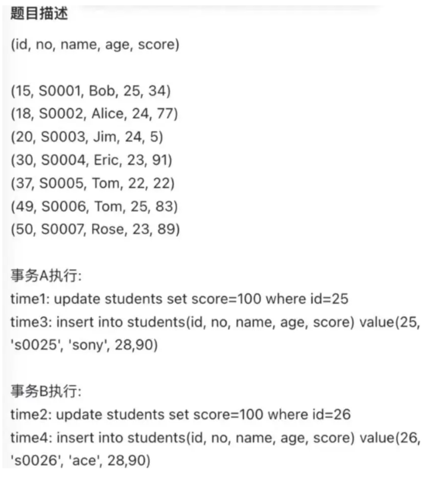

事务A和事务B会发生死锁。当它们在使用insert语句后，都陷入了等待状态，都在等待对方释放锁。

两个事务即使生成的间隙锁的范围是一样的，也不会发生冲突，因为间隙锁目的是为了防止其他事务插入数据，因此间隙锁与间隙锁之间是相互兼容的。

在执行插入语句时，如果插入的记录在其他事务持有间隙锁范围内，插入语句就会被阻塞，因为插入语句在碰到间隙锁时，会生成一个插入意向锁，然后插入意向锁和间隙锁之间是互斥的关系。如果两个事务分别向对方持有的间隙锁范围内插入一条记录，而插入操作为了获取到插入意向锁，都在等待对方事务的间隙锁释放，于是就造成了循环等待。

在这里，事务A，B都在主键索引上加入了间隙锁，锁范围为(20,30)。而它们接下来的insert语句都在这个范围内，造成需要等待对方间隙锁释放的情况，导致死锁。这是死锁场景中的“不同事务同时更新相同的索引”的情况。

## mysql事务

### 事务基础

事务是⼀个最⼩的不可再分的⼯作单元；通常情况下，⼀个事务对应⼀个完整的业务。

mysql事务特性：ACID

​ A：原⼦性（Atomicity），⼀个事务的所有操作，要么全部完成，要么都没完成，不能结束在中间环节。如果事务在执⾏过程中发⽣错误，会被回滚到事务开始之前的状态

​ C：⼀致性（Consistency），在事务开始之前以及事务结束之后，数据库的完整性不能被破坏

​ I：隔离性（Isolation），允许多个并发事务同时对数据进⾏修改和读写的能⼒，它可以防⽌由于多个事务并发执⾏时由于交叉执⾏⽽导致的数据不⼀致

​ D：持久性（Durability），事务处理结束了以后，对数据的修改是永久的，即使是发⽣了系统故障，数据也不会丢失

MVCC（多版本并发控制）四大问题：脏写，脏读，不可重复读，幻读

​ 脏写：一个事务写到另一个未提交事务修改过的数据

​ 脏读：一个事务读到另一个未提交事务修改过的数据

​ 不可重复读：在一个事务内多次读取同一个数据，如果出现前后两次读到的数据不一样的情况。这主要发生在前后两次读到的数据之间提交了一个新的修改事物修改了数据。（注意不可重复读和幻读的\[另一个事务]是提交了的）

​ 幻读：一个事务内多次查询某个符合查询条件的「记录数量」，如果出现前后两次查询到的记录数量不一样的情况，就意味着发生了「幻读」现象

不可重复读是内容发生变化，幻读是数量发生变化。

MVCC四大隔离级别：

​ RU读不提交：指一个事务还没提交时，它做的变更就能被其他事务看到。事务之间完全不隔离，会产⽣脏读，⼀般情况不会使⽤

​ RC 读提交：本事务读取到的是其它事务提交的最新数据，但有⼀个问题在同⼀个事务中，前后两相同的select可能会读到不同的结果

​ RR可重复读：在同⼀个事务中，select的结果是事务开始时时间点的状态，因此，同⼀个事务同样的select操作可以读到⼀致的结果。这是MySQL InnoDB 引擎的默认隔离级别

​ serializable串行化：隐式获取共享锁，保证不同事务之间的互斥。后访问的事务必须等前一个事务执行完成，才能继续执行

MySQL 在「可重复读」隔离级别下，可以很大程度上避免幻读现象的发生（注意是很大程度避免，并不是彻底避免），所以 MySQL 并不会使用「串行化」隔离级别来避免幻读现象的发生，因为使用「串行化」隔离级别会影响性能

### 如何在可重复读隔离级别下避免幻读

* 针对快照读（普通 select 语句），是通过 MVCC 方式解决了幻读，因为可重复读隔离级别下，事务执行过程中看到的数据，一直跟这个事务启动时看到的数据是一致的，即使中途有其他事务插入了一条数据，是查询不出来这条数据的，所以就很好了避免幻读问题。
* 针对当前读（select ... for update 等语句），是通过 next-key lock（记录锁+间隙锁）方式解决了幻读，因为当执行 select ... for update 语句的时候，会加上 next-key lock，如果有其他事务在 next-key lock 锁范围内插入了一条记录，那么这个插入语句就会被阻塞，无法成功插入，所以就很好了避免幻读问题。

### MySQL 可重复读隔离级别，完全解决幻读了吗？

同一个查询在不同的时间产生不同的结果集时，事务中就会出现所谓的幻象问题（注意不可重复读和幻读的核心区别在于一个前者select前后内容不同，后者前后行数不同）

快照读（普通select语句）使用MVCC，当前读（select...for update）使用next-key lock（记录锁+间隙锁）的方式解决幻读。但这两种方式并没有彻底解决幻读，包括两个场景：

* 对于快照读， MVCC 并不能完全避免幻读现象。因为当事务 A 更新了一条事务 B 插入的记录，那么事务 A 前后两次查询的记录条目就不一样了，所以就发生幻读（简单来说就是事务B的提交在A的两次查询之间）
* 对于当前读，如果事务开启后，并没有执行当前读，而是先快照读，然后这期间如果其他事务插入了一条记录，那么事务后续使用当前读进行查询的时候，就会发现两次查询的记录条目就不一样了，所以就发生幻读。

这种情况下，最好的解决方案就是先当前读，加入记录锁和间隙锁，以避免幻读。

### 事务开启

在 MySQL 有两种开启事务的命令，分别是：

* 第一种：begin/start transaction 命令；
* 第二种：start transaction with consistent snapshot 命令；

这两种开启事务的命令，事务的启动时机是不同的：

* 执行了 begin/start transaction 命令后，并不代表事务启动了。只有在执行这个命令后，执行了第一条 select 语句，才是事务真正启动的时机；
* 执行了 start transaction with consistent snapshot 命令，就会马上启动事务。

### 隔离级别的实现

* 对于「读未提交」隔离级别的事务来说，因为可以读到未提交事务修改的数据，所以直接读取最新的数据就好了；
* 对于「串行化」隔离级别的事务来说，通过加读写锁的方式来避免并行访问；
* 对于「读提交」和「可重复读」隔离级别的事务来说，它们是通过 Read View 来实现的，它们的区别在于创建 Read View 的时机不同，可以把 Read View 理解成一个数据快照。「**读提交」隔离级别是在「每个语句执行前」都会重新生成一个 Read View，而「可重复读」隔离级别是「启动事务时」生成一个 Read View，然后整个事务期间都在用这个 Read View**。

### Read View 在 MVCC 里如何工作的

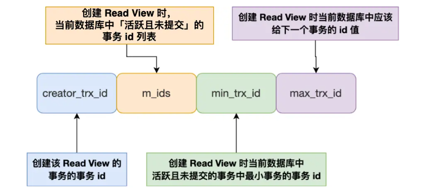

m\_ids：在创建 Read View 时，当前数据库中「活跃事务」的事务 id 列表，注意是一个列表，“活跃事务”指的就是，启动了但还没提交的事务

min\_trx\_id：「活跃事务」的事务 id 列表中id最小的事务。也就是m\_ids的最小值。

max\_trx\_id：这个并不是 m\_ids 的最大值，而是创建 Read View 时当前数据库中应该给下一个事务的 id 值，也就是全局事务（注意是所有已经产生的事务，而不是活跃事务）中最大的事务 id 值 + 1；

creator\_trx\_id ：指的是创建该 Read View 的事务的事务 id

行格式中还存在两个隐藏列，与事务相关：

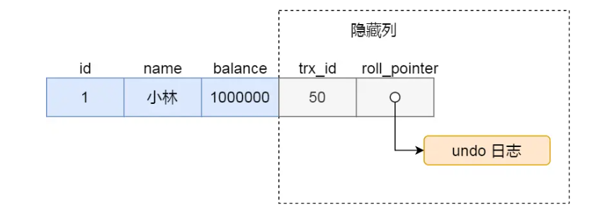

trx\_id，当一个事务对某条聚簇索引记录进行改动时，就会把该事务的事务 id 记录在 trx\_id 隐藏列里

roll\_pointer，每次对某条聚簇索引记录进行改动时，都会把旧版本的记录写入到 undo 日志中，这个隐藏列实际是个指针，指向每一个旧版本记录，于是就可以通过它找到修改前的记录。

在创建 Read View 后，记录中的 trx\_id 可以划分这三种情况

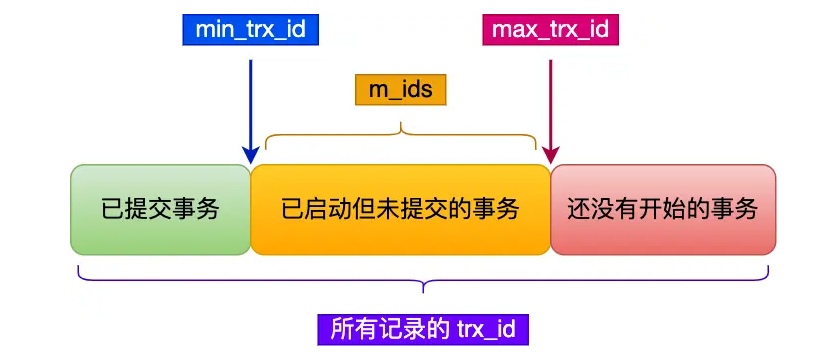

一个事务去访问记录的时候，除了自己的更新记录总是可见之外，还有这几种情况：

* 如果记录的 trx\_id 值小于 Read View 中的 `min_trx_id` 值，表示这个版本的记录是在创建 Read View 前已经提交的事务生成的，所以该版本的记录对当前事务可见。
* 如果记录的 trx\_id 值大于等于 Read View 中的 `max_trx_id` 值，表示这个版本的记录是在创建 Read View 后才启动的事务生成的，所以该版本的记录对当前事务不可见。
* 如果记录的 trx\_id 值在 Read View 的 `min_trx_id` 和 `max_trx_id` 之间，需要判断 trx\_id 是否在 m\_ids 列表中：
  * 如果记录的 trx\_id **在** `m_ids` 列表中，表示生成该版本记录的活跃事务依然活跃着（还没提交事务），所以该版本的记录对当前事务不可见。
  * 如果记录的 trx\_id **不在** `m_ids`列表中，表示生成该版本记录的活跃事务已经被提交，所以该版本的记录对当前事务可见。

这种通过「版本链」来控制并发事务访问同一个记录时的行为就叫 MVCC（多版本并发控制）

### 读提交/可重复读的工作方式

* 「读提交」隔离级别是在每个 select 都会生成一个新的 Read View，也意味着，事务期间的多次读取同一条数据，前后两次读的数据可能会出现不一致，因为可能这期间另外一个事务修改了该记录，并提交了事务。
* 「可重复读」隔离级别是启动事务时生成一个 Read View，然后整个事务期间都在用这个 Read View，这样就保证了在事务期间读到的数据都是事务启动前的记录。

## mysql索引

索引的出现其实就是为了提⾼数据查询的效率，就像书的⽬录⼀样，它位于存储引擎中

### 索引的分类

* 按「数据结构」分类：**B+tree索引、Hash索引、Full-text索引**。
* 按「物理存储」分类：**聚簇索引（主键索引）、二级索引（辅助索引）**。
* 按「字段特性」分类：**主键索引、唯一索引、普通索引、前缀索引**。
* 按「字段个数」分类：**单列索引、联合索引**。

#### 数据结构分类

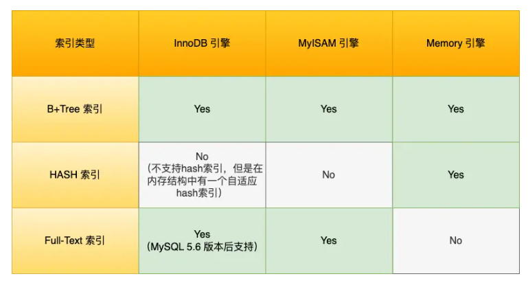

HASH所以使用与精确匹配查询，Full-Test

在创建表时，InnoDB 存储引擎会根据不同的场景选择不同的列作为索引：

*   如果有主键，默认会使用主键作为聚簇索引的索引键（key）；

    ```sql
    # 创建表时选择主键
    # 单一主键值
    CREATE TABLE your_table (
        id INT AUTO_INCREMENT PRIMARY KEY,
        -- other columns
    );
    # 复合主键
    CREATE TABLE your_table (
        column1 INT,
        column2 VARCHAR(50),
        PRIMARY KEY (column1, column2),
        -- other columns
    );
    ```
* 如果没有主键，就选择第一个不包含 NULL 值的唯一列作为聚簇索引的索引键（key）
* 在上面两个都没有的情况下，InnoDB 将自动生成一个隐式自增 id 列作为聚簇索引的索引键（key）；

其它索引都属于辅助索引（Secondary Index），也被称为二级索引或非聚簇索引。创建的主键索引和二级索引默认使用的是 B+Tree 索引。

**B+Tree索引**

B+Tree 是一种多叉树，叶子节点才存放数据，非叶子节点只存放索引，而且每个节点里的数据是按主键顺序存放的（也叫主键索引的B+Tree）。每一层父节点的索引值都会出现在下层子节点的索引值中，因此在叶子节点中，包括了所有的索引值信息，并且每一个叶子节点都有两个指针，分别指向下一个叶子节点和上一个叶子节点，形成一个双向链表。

注意，主键索引的B+ Tree和二级索引的B+ Tree完全不同，在实际查询的时候，如果用二级索引查询，需要先检索二级索引中的 B+Tree 的索引值，然后再通过主键索引中的 B+Tree 树查询到对应的叶子节点，然后获取整行数据。这个过程叫「回表」，也就是说要查两个 B+Tree 才能查到数据。

不过，当查询的数据是能在二级索引的 B+Tree 的叶子节点里查询到，这时就不用再查主键索引。这种在二级索引的 B+Tree 就能查询到结果的过程就叫作「覆盖索引」，也就是只需要查一个 B+Tree 就能找到数据。

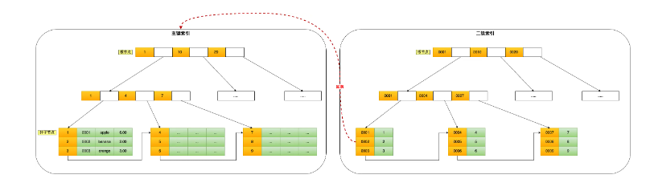

数据库的索引和数据都是存储在硬盘的，我们可以把读取一个节点当作一次磁盘 I/O 操作。B+Tree 存储千万级的数据只需要 3-4 层高度就可以满足，这意味着从千万级的表查询目标数据最多需要 3-4 次磁盘 I/O，所以B+Tree 相比于 B 树和二叉树来说，最大的优势在于查询效率很高，因为即使在数据量很大的情况，查询一个数据的磁盘 I/O 依然维持在 3-4次。

**B+树的优势**

B+树相较于B树，B+Tree 只在叶子节点存储数据，而 B 树 的非叶子节点也要存储数据，所以 B+Tree 的单个节点的数据量更小，在相同的磁盘 I/O 次数下，就能查询更多的节点。另外，B+Tree 叶子节点采用的是双链表连接，适合 MySQL 中常见的基于范围的顺序查找，而 B 树无法做到这一点。

B+树相较于二叉树，B+Tree 的高度依然维持在 3~~4 层左右，也就是说一次数据查询操作只需要做 3~~4 次的磁盘 I/O 操作就能查询到目标数据。在搜索复杂度上比二叉树低得多。这也是因为二叉树对一个父节点允许的子节点数只有2。

B+树相较于哈希，Hash 在做等值查询的时候效率很高，但不适合做范围查询，缺乏顺序性。

#### 物理存储分类

索引分为聚簇索引（主键索引）、二级索引（辅助索引）

* 主键索引的 B+Tree 的叶子节点存放的是实际数据，所有完整的用户记录都存放在主键索引的 B+Tree 的叶子节点里；
* 二级索引的 B+Tree 的叶子节点存放的是主键值，而不是实际数据。

在查询时使用了二级索引，如果查询的数据能在二级索引里查询的到，那么就不需要回表，这个过程就是覆盖索引。如果查询的数据不在二级索引里，就会先检索二级索引，找到对应的叶子节点，获取到主键值后，然后再检索主键索引，就能查询到数据了，这个过程就是回表。

二级索引查到主键值后，可以使用找到的主键值在主键索引的叶子节点中查找完整的数据行

注意把二级索引和联合索引区分开，在主键索引之上再建立一个索引也是二级索引。联合索引是二级索引的一种。

#### 字段特性分类

索引分为主键索引、唯一索引、普通索引、前缀索引

**主键索引**

建立在主键字段上的索引，通常在创建表的时候一起创建，一张表最多只有一个主键索引，索引列的值不允许有空值

```sql
# 创建表时创建主键索引
CREATE TABLE table_name  (
  ....
  PRIMARY KEY (index_column_1) USING BTREE
);
```

**唯一索引**

建立在 UNIQUE 字段上的索引，一张表可以有多个唯一索引，索引列的值必须唯一，但是允许有空值。

```sql
# 创建表时创建唯一索引
CREATE TABLE table_name  (
  ....
  UNIQUE KEY(index_column_1,index_column_2,...) 
);
# 建表后创建唯一索引
CREATE UNIQUE INDEX index_name
ON table_name(index_column_1,index_column_2,...); 
```

**普通索引**

建立在普通字段上的索引，既不要求字段为主键，也不要求字段为 UNIQUE

```sql
# 创建表时创建普通索引
CREATE TABLE table_name  (
  ....
  INDEX(index_column_1,index_column_2,...) 
);
# 建表后创建普通索引
CREATE INDEX index_name
ON table_name(index_column_1,index_column_2,...); 
```

**前缀索引**

前缀索引是指对字符类型字段的前几个字符建立的索引，而不是在整个字段上建立的索引，前缀索引可以建立在字段类型为 char、 varchar、binary、varbinary 的列上。

使用前缀索引的目的是为了减少索引占用的存储空间，提升查询效率。

```sql
# 创建表时创建前缀索引
CREATE TABLE table_name(
    column_list,
    INDEX(column_name(length))
); 
# 建表后创建前缀索引
CREATE INDEX index_name
ON table_name(column_name(length)); 
```

#### 字段个数分类

从字段个数的角度来看，索引分为单列索引、联合索引（复合索引）。

* 建立在单列上的索引称为单列索引，比如主键索引；
* 建立在多列上的索引称为联合索引；

**联合索引**

通过将多个字段组合成一个索引，该索引就被称为联合索引。

```sql
CREATE INDEX index_product_no_name ON product(product_no, name);
```

使用联合索引时，存在最左匹配原则，也就是按照最左优先的方式进行索引的匹配。在使用联合索引进行查询的时候，如果不遵循「最左匹配原则」，联合索引会失效，这样就无法利用到索引快速查询的特性了（因为有查询优化器，所以最左字段实际在 where 子句的顺序并不重要）

**联合索引范围查询**

联合索引有一些特殊情况，并不是查询过程使用了联合索引查询，就代表联合索引中的所有字段都用到了联合索引进行索引查询，也就是可能存在部分字段用到联合索引的 B+Tree。

这种特殊情况就发生在范围查询。联合索引的最左匹配原则会一直向右匹配直到遇到「范围查询」就会停止匹配。也就是范围查询的字段可以用到联合索引，但是在范围查询字段的后面的字段无法用到联合索引。（范围查询后的字段是无序的，从本质上来说）

以`select * from t_table where a > 1 and b = 2`为例，在符合 a > 1 条件的二级索引记录的范围里，b 字段的值是无序的。因此我们不能根据查询条件 b = 2 来进一步减少需要扫描的记录数量（b 字段无法利用联合索引进行索引查询的意思）

但是在`select * from t_table where a >= 1 and b = 2`中，对于a=1的情况下，b 字段的值是「有序」的（对于联合索引，是先按照 a 字段的值排序，然后在 a 字段的值相同的情况下，再按照 b 字段的值进行排序，简单来说就是相邻）

结论：**有等于边界的范围下，在范围查询的下一个字段可以用到联合索引，也不会停止匹配**

索引下推就是在联合索引遍历过程中，对联合索引中包含的字段先做判断，直接过滤掉不满足条件的记录，减少回表次数

**索引区分段**

在实际开发工作中，应该将区分度大的字段排到前面，这样越有可能被SQL使用的，有效提高效率

如果索引本身的区分度很小（MySQL中的查询优化器发现某个值出现在表的数据行中的百分比高于某个值时（一般为30%））它一般会忽略索引，进行全表扫描

#### 联合索引进行排序的场景

```sql
select * from order where status = 1 order by create_time asc
```

上述例子通过建立索引提高查询效率的方法？

如果单独对status 建立一个索引，但这条语句还需要对create\_time排序，这时就要用文件排序，增加了查询成本。

如果排序的时候按照 status 和 create\_time 列建立联合索引（ status 在最左边），这样根据 status 筛选后的数据就是按照 create\_time 排好序的，避免在文件排序，提高了查询效率

### 索引使用的场景

索引的缺点：

* 需要占用物理空间，数量越大，占用空间越大
* 创建索引和维护索引要耗费时间，这种时间随着数据量的增加而增大
* 会降低表的增删改的效率，因为每次增删改索引，B+ 树为了维护索引有序性，都需要进行动态维护

使用索引的场景：

* 字段有唯一性限制的，比如商品编码
* 经常用于 `WHERE` 查询条件的字段，这样能够提高整个表的查询速度，如果查询条件不是一个字段，可以建立联合索引
* 经常用于 `GROUP BY` 和 `ORDER BY` 的字段，这样在查询的时候就不需要再去做一次排序了，因为我们都已经知道了建立索引之后在 B+Tree 中的记录都是排序好的

什么时候不需要创建索引：

* `HERE` 条件，`GROUP BY`，`ORDER BY` 里用不到的字段，索引的价值是快速定位，如果起不到定位的字段通常是不需要创建索引的，因为索引是会占用物理空间的
* 字段中存在大量重复数据，不需要创建索引，查询优化器发现某个值出现在表的数据行中的百分比很高的时候，它一般会忽略索引，进行全表扫描。
* 表数据太少的时候，不需要创建索引
* 经常更新的字段不用创建索引，由于要维护 B+Tree的有序性，那么就需要频繁的重建索引，这个过程是会影响数据库性能的

### 索引优化手段

* 使用前缀索引（使用某个字段中字符串的前几个字符建立索引），可以有效减小索引字段大小。前缀索引的缺陷在于：1.order by 就无法使用前缀索引。2.无法把前缀索引用作覆盖索引
* 使用覆盖索引，避免回表（不需要查询出包含整行记录的所有信息，也就减少了大量的 I/O 操作）。具体来说就是把要频繁查询的东西一起做一个联合索引
* 主键索引自增，这样每次插入的新数据就会按顺序添加到当前索引节点的位置，不需要移动已有的数据，效率非常高。如果不使用自增的主键的话，就可能需要移动其它数据来满足新数据的插入，甚至需要从一个页面复制数据到另外一个页面，我们通常将这种情况称为页分裂。页分裂还有可能会造成大量的内存碎片，导致索引结构不紧凑，从而影响查询效率。另外，主键字段的长度不要太大，因为主键字段长度越小，意味着二级索引的叶子节点越小（二级索引的叶子节点存放的数据是主键值），这样二级索引占用的空间也就越小。
* 索引最好设置为Not NULL，这样有两个好处：1.索引列存在NULL就会导致优化器做索引选择的时候更加复杂，难以优化。2.NULL会占用存储NULL值列表的空间。
* 防止索引失效

### InnoDB的数据页结构

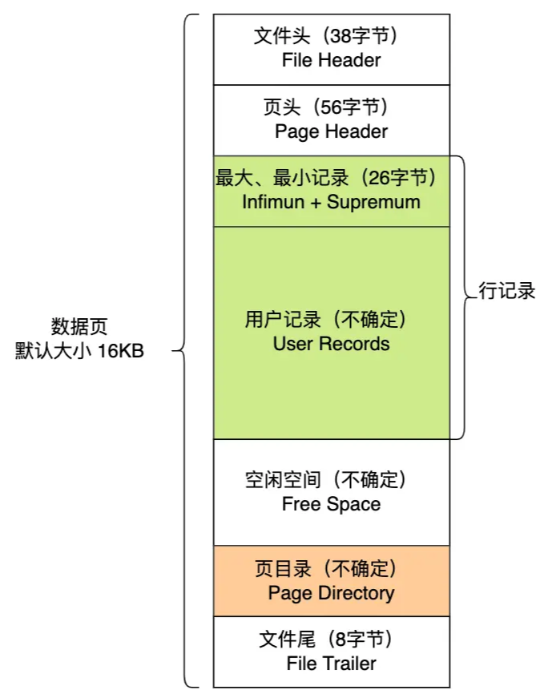

|    名称   |           说明           |
| :-----: | :--------------------: |
|   文件头   |         表示页的信息         |
|    页头   |        表示页的状态信息        |
| 最小和最大记录 | 两个虚拟的伪记录，表示页中最小记录和最大记录 |
|   用户记录  |         存储行记录内容        |
|   空闲空间  |        页中没使用的空间        |
|   页目录   |  存储用户记录的相对位置，对记录起索引作用  |
|   文件尾   |         校验页是否完整        |

在 File Header 中有两个指针，分别指向上一个数据页和下一个数据页，连接起来的页相当于一个双向的链表

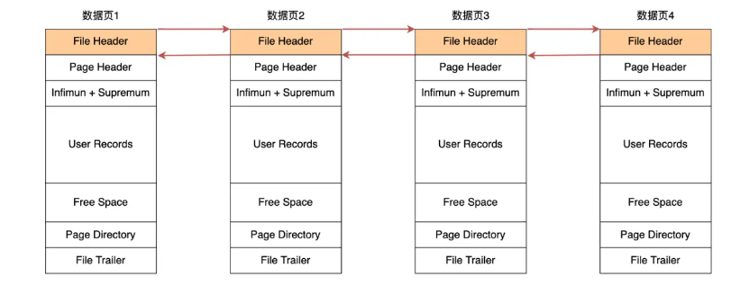

数据页中的记录按照「主键」顺序组成单向链表，单向链表的特点就是插入、删除非常方便，但是检索效率不高，最差的情况下需要遍历链表上的所有节点才能完成检索。因此，数据页中有一个页目录，起到记录的索引作用

#### 页目录与记录的关系

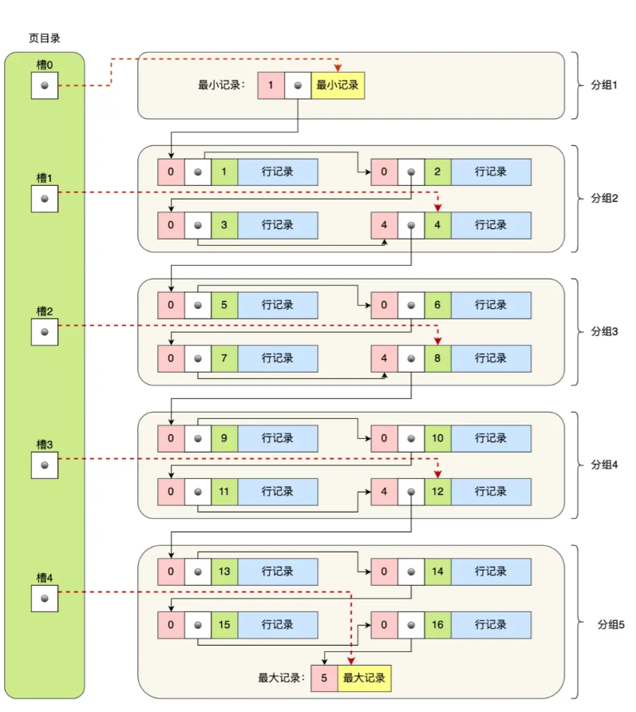

页目录由多个槽组成，槽相当于分组记录的索引。然后，因为记录是按照「主键值」从小到大排序的，所以我们通过槽查找记录时，可以使用二分法快速定位要查询的记录在哪个槽（哪个记录分组），定位到槽后，再遍历槽内的所有记录（具体的遍历过程大概率是从前一个槽指向的最后一个记录开始），找到对应的记录，无需从最小记录开始遍历整个页中的记录链表。

具体的页创建过程如下：

* 将所有的记录划分成几个组，这些记录包括最小记录和最大记录，但不包括标记为“已删除”的记录
* 每个记录组的最后一条记录就是组内最大的那条记录，并且最后一条记录的头信息中会存储该组一共有多少条记录，作为 n\_owned 字段（上图中粉红色字段）
* 页目录用来存储每组最后一条记录的地址偏移量，这些地址偏移量会按照先后顺序存储起来，每组的地址偏移量也被称之为槽（slot），每个槽相当于指针指向了不同组的最后一个记录

### B+树如何进行查询

InnoDB 里的 B+ 树中的每个节点都是一个数据页

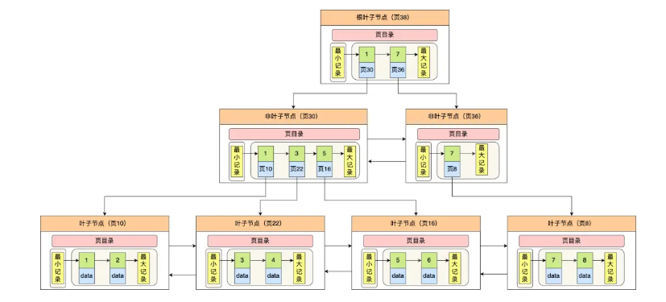

在定位记录所在哪一个页时，也是通过二分法快速定位到包含该记录的页。定位到该页后，又会在该页内进行二分法快速定位记录所在的分组（槽号），最后在分组内进行遍历查找。

### mysql为什么使用B+树作为索引

索引数据按照顺序排列，可以使用二分查找可以高效定位数据

但如果直接直接在数组中插入新元素，那么就会需要将这个元素之后的所有元素后移一位，这对于磁盘的效率而言是灾难性的。因此，需要将数组变为一个二叉查找树（二叉搜索树）。这样的话，不仅方便查找，而且二叉搜索树不需要连续排列。

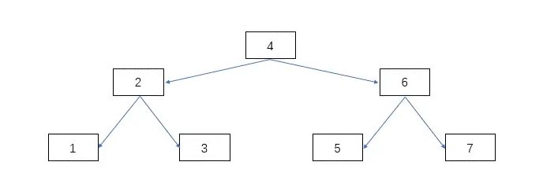

即便这样，二叉搜索树仍然存在非常大的问题，在于它的查找次数与高度息息相关。在极端情况下，如果插入的值一直比当前值大，那么最后会导致和原来数组的性能差不多。即：二叉查找树由于存在退化成链表的可能性，会使得查询操作的时间复杂度从 O(logn) 升为 O(n)

为了解决二叉查找树会在极端情况下退化成链表的问题，后面就有人提出平衡二叉查找树（AVL 树）。

主要是在二叉查找树的基础上增加了一些条件约束：每个节点的左子树和右子树的高度差不能超过 1。也就是说节点的左子树和右子树仍然为平衡二叉树，这样查询操作的时间复杂度就会一直维持在 O(logn) 。后来，又产生了红黑树，它也是一个自平衡二叉树。不管平衡二叉查找树还是红黑树，都会随着插入的元素增多，而导致树的高度变高，这就意味着磁盘 I/O 操作次数多，会影响整体数据查询的效率

为了进一步缩减IO操作次数，又提出了B树，B树就是N叉树，同时设定一个最大的子节点数，以此来降低树的高度。

B树的核心在于每个子节点都存有数据，因此每次都需要进入IO进行查询。另外，因为需要使用中序遍历，这会涉及多个节点的磁盘 I/O 问题，从而导致整体速度下降。

B+树对于B数的优势：

* 叶子节点才会存放实际数据，非叶子节点只会存放索引
* 所有索引都会在叶子节点出现，叶子节点之间构成一个有序链表
* 非叶子节点的索引也会同时存在在子节点中，并且是在子节点中所有索引的最大（或最小）
* 非叶子节点中有多少个子节点，就有多少个索引；

B+数在单点查询，插入和删除效率以及范围查询上比B树效果要好得多

索引结构不会影响单表最大行数，“最大2000W 行”只是推荐值，超过了这个值可能会导致 B + 树层级更高，影响查询性能

### 索引失效的场景

1.使用左或者左右模糊匹配的时候，也就是 `like %xx` 或者 `like %xx%`这两种方式都会造成索引失效

2.查询条件中对索引列使用函数，就会导致索引失效

3.在查询条件中对索引列进行表达式计算，也是无法走索引的

4.MySQL 在遇到字符串和数字比较的时候，会自动把字符串转为数字，然后再进行比较。如果字符串是索引列，而条件语句中的输入参数是数字的话，那么索引列会发生隐式类型转换，由于隐式类型转换是通过 CAST 函数实现的，等同于对索引列使用了函数，所以就会导致索引失效。

5.联合索引要能正确使用需要遵循最左匹配原则，也就是按照最左优先的方式进行索引的匹配，否则就会导致索引失效。

6.在 WHERE 子句中，如果在 OR 前的条件列是索引列，而在 OR 后的条件列不是索引列，那么索引会失效。

## count(\*)和count(1)

从结论上来说：

**count(\*)=coun(1)>count(主键字段)>count(字段)**

count() 是一个聚合函数，函数的参数不仅可以是字段名，也可以是其他任意表达式，该函数作用是统计符合查询条件的记录中，函数指定的参数不为 NULL 的记录有多少个。

```sql
# 统计「 t_order 表中，name 字段不为 NULL 的记录」有多少个
select count(name) from t_order;
# 统计 t_order 表中有多少个记录(1一定不为NULL)
select count(1) from t_order;
```

count(主键字段)，就需要循环遍历聚簇索引，将读取到的记录返回给 server 层，然后server进行判断。但对于count(1)而言，它不需要读取字段中的值给server，server直接对count+1即可。故：count(1)>count(主键字段)

count（\*）不是count所有字段，而是count(0)，与count(1)同理，所以效率相同

对于count(字段)，一般就需要全表扫描了，效率是最差的

### count(\*)的优化

即便count(\*)的效率相对其他count的效率高，但count本身因为需要循环遍历，效率也是很低的。（count不是必须循环遍历，InnoDB采用循环遍历是为了MVCC的必要）。同一个时刻的多个查询，由于多版本并发控制（MVCC）的原因，InnoDB 表“应该返回多少行”也是不确定的。

使用 MyISAM 引擎时，执行 count 函数只需要 O(1 )复杂度，这是因为每张 MyISAM 的数据表都有一个 meta 信息有存储了row\_count值，由表级锁保证一致性，所以直接读取 row\_count 值就是 count 函数的执行结果。

count(\*)的优化方法：

1.近似值（类似于Redis的布隆过滤器），在MySQL中使用 show table status 或者 explain 命令来表进行估算

```sql
explain select count(*) from t_order
```

2.额外表保存计数值

## mysql日志

### undo log，redo log和bin log

undo log（回滚日志）：是 Innodb 存储引擎层生成的日志，实现了事务中的原子性，主要用于事务回滚和 MVCC

redo log（重做日志）：是 Innodb 存储引擎层生成的日志，实现了事务中的持久性，主要用于掉电等故障恢复

binlog （归档日志）：是 Server 层生成的日志，主要用于数据备份和主从复制

#### undo log的使用

undo log 是一种用于撤销回退的日志。在事务没提交之前，MySQL 会先记录更新前的数据到 undo log 日志文件里面，当事务回滚时，可以利用 undo log 来进行回滚。每当 InnoDB 引擎对一条记录进行操作（修改、删除、新增）时，要把回滚时需要的信息都记录到 undo log 里。

一条记录的每一次更新操作产生的 undo log 格式都有一个 roll\_pointer 指针和一个 trx\_id 事务id：

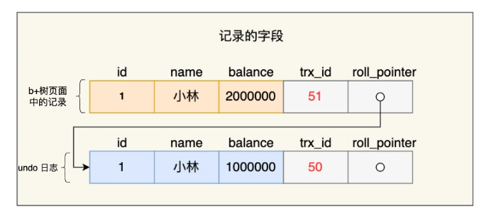

* 通过 trx\_id 可以知道该记录是被哪个事务修改的；
* 通过 roll\_pointer 指针可以将这些 undo log 串成一个链表，这个链表就被称为版本链；

undo log 和数据页的刷盘策略是一样的，都需要通过 redo log 保证持久化。

总结undo log的两大作用：

* **实现事务回滚，保障事务的原子性**。事务处理过程中，如果出现了错误或者用户执 行了 ROLLBACK 语句，MySQL 可以利用 undo log 中的历史数据将数据恢复到事务开始之前的状态。
* **实现 MVCC（多版本并发控制）关键因素之一**。MVCC 是通过 ReadView + undo log 实现的。undo log 为每条记录保存多份历史数据，MySQL 在执行快照读（普通 select 语句）的时候，会根据事务的 Read View 里的信息，顺着 undo log 的版本链找到满足其可见性的记录。

#### Buffer Pool的使用

MySQL 的数据都是存在磁盘中的，当更新一条记录时，先要从磁盘读取该记录，然后在内存中修改这条记录。之后，该修改会缓存起来，以避免频繁的IO操作。

为此，Innodb 存储引擎设计了一个**缓冲池（Buffer Pool）**，来提高数据库的读写性能。

在 MySQL 启动的时候，InnoDB 会为 Buffer Pool 申请一片连续的内存空间，然后按照默认的`16KB`的大小划分出一个个的页， Buffer Pool 中的页就叫做缓存页。此时这些缓存页都是空闲的，之后随着程序的运行，才会有磁盘上的页被缓存到 Buffer Pool 中。Buffer Pool 除了缓存「索引页」和「数据页」，还包括了 Undo 页，插入缓存、自适应哈希索引、锁信息等等。

注意，无论是查询还是更新都是以页为单位的，即便查询的是一条记录。InnoDB 是会把整个页的数据加载到 Buffer Pool 中，将页加载到 Buffer Pool 后，再通过页里的「页目录」去定位到某条具体的记录。

#### redo log的使用

为了防止断电导致数据丢失的问题，当有一条记录需要更新的时候，InnoDB 引擎就会先更新内存（同时标记为脏页），然后将本次对这个页的修改以 redo log 的形式记录下来，这个时候更新就算完成了。

后续，InnoDB 引擎会在适当的时候，由后台线程将缓存在 Buffer Pool 的脏页刷新到磁盘里，这就是 **WAL （Write-Ahead Logging）技术**。（注意与写时复制分开）**WAL 技术指的是， MySQL 的写操作并不是立刻写到磁盘上，而是先写日志，然后在合适的时间再写到磁盘上**。

redo log 是物理日志，记录了某个数据页做了什么修改，每当执行一个事务就会产生这样的一条或者多条物理日志。在事务提交时，只要先将 redo log 持久化到磁盘即可，可以不需要等到将缓存在 Buffer Pool 里的脏页数据持久化到磁盘。当系统崩溃时，虽然脏页数据没有持久化，但是 redo log 已经持久化，接着 MySQL 重启后，可以根据 redo log 的内容，将所有数据恢复到最新的状态。

redo log记录的是事务**完成后**的数据状态，而undo log记录的是**开始前**的数据状态。

同时，修改的undo log页会被记录在redo log中。

**redo log写入磁盘相较于数据直接写入磁盘的优点**

写入 redo log 的方式使用了追加操作， 所以磁盘操作是**顺序写**，而写入数据需要先找到写入位置，然后才写到磁盘，所以磁盘操作是**随机写**。

磁盘的「顺序写 」比「随机写」 高效的多，因此 redo log 写入磁盘的开销更小。

这也是WAL 技术的另外一个优点：**MySQL 的写操作从磁盘的「随机写」变成了「顺序写」**，提升语句的执行性能。这是因为 MySQL 的写操作并不是立刻更新到磁盘上，而是先记录在日志上，然后在合适的时间再更新到磁盘上 。

总结redo log的两大作用：

* **实现事务的持久性，让 MySQL 有 crash-safe 的能力**，能够保证 MySQL 在任何时间段突然崩溃，重启后之前已提交的记录都不会丢失
* **将写操作从「随机写」变成了「顺序写」**，提升 MySQL 写入磁盘的性能。

**redo log是直接写入磁盘的么**

redo log也有自己的缓存——**redo log buffer**，每当产生一条 redo log 时，会先写入到 redo log buffer，后续在持久化到磁盘

**redo log的刷盘时机**

主要有下面几个时机：

* MySQL 正常关闭时；
* 当 redo log buffer 中记录的写入量大于 redo log buffer 内存空间的一半时，会触发落盘；
* InnoDB 的后台线程每隔 1 秒，将 redo log buffer 持久化到磁盘。
* 每次事务提交时都将缓存在 redo log buffer 里的 redo log 直接持久化到磁盘（可由 innodb\_flush\_log\_at\_trx\_commit 参数控制）。

innodb\_flush\_log\_at\_trx\_commit可以被设置为0,1,2这三个参数中的一个：

* 参数为0时，表示每次事务提交时 ，还是将 redo log 留在 redo log buffer 中，即事务提交时不会主动触发写入磁盘的操作
* 参数为1时，表示每次事务提交时，都将缓存在 redo log buffer 里的 redo log 直接持久化到磁盘
* 参数为2时，表示每次事务提交时，将缓存在 redo log buffer 里的 redo log 文件写入到操作系统管理的 redo log 文件中（即写到操作系统的文件缓存）

数据安全性：参数 1 > 参数 2（操作系统崩溃或断电导致上一秒的数据丢失） > 参数 0（进程崩溃会导致上一秒的数据丢失）

写入性能：参数 0 > 参数 2> 参数 1

**redo log文件写满的怎么办**

默认情况下， InnoDB 存储引擎有 1 个重做日志文件组( redo log Group），一般由两个redo log文件组成。每个redo log的大小固定，一般为1 GB，合计为2 GB。

重做日志文件组是以**循环写**的方式工作的，从头开始写，写到末尾就又回到开头，相当于一个环形。所以 InnoDB 存储引擎会先写 ib\_logfile0 文件，当 ib\_logfile0 文件被写满的时候，会切换至 ib\_logfile1 文件，当 ib\_logfile1 文件也被写满时，会切换回 ib\_logfile0 文件。

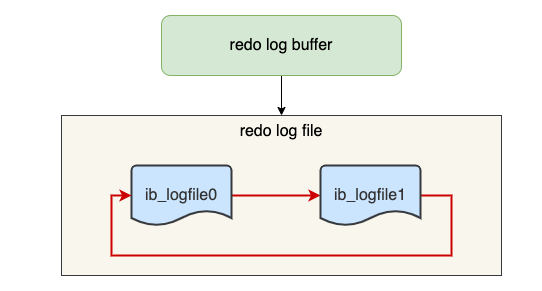

随着系统运行，Buffer Pool 的脏页刷新到了磁盘中，那么 redo log 对应的记录也就没用了，这时候我们擦除这些旧记录，以腾出空间记录新的更新操作。redo log 是循环写的方式，相当于一个环形，InnoDB 用 write pos 表示 redo log 当前记录写到的位置，用 checkpoint 表示当前要擦除的位置。

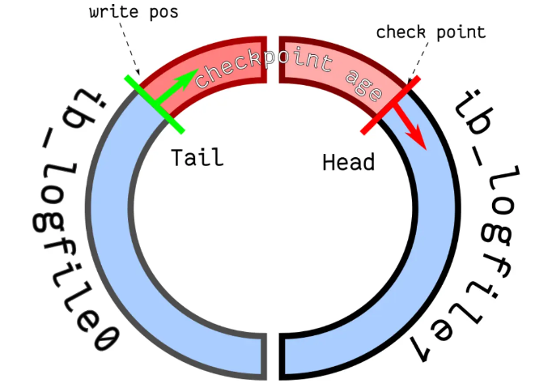

如果 write pos 追上了 checkpoint，就意味着 redo log 文件满了，这时 MySQL 不能再执行新的更新操作，也就是说 MySQL 会被阻塞（_因此所以针对并发量大的系统，适当设置 redo log 的文件大小非常重要_），此时会停下来将 Buffer Pool 中的脏页刷新到磁盘中，然后标记 redo log 哪些记录可以被擦除，接着对旧的 redo log 记录进行擦除，等擦除完旧记录腾出了空间，checkpoint 就会往后移动（图中顺时针），然后 MySQL 恢复正常运行，继续执行新的更新操作。

所以，一次 checkpoint 的过程就是脏页刷新到磁盘中变成干净页，然后标记 redo log 哪些记录可以被覆盖的过程。（注意，缓冲池本身的更新与脏页刷回磁盘没有关系，缓冲池的管理通常由数据库系统自身的算法（例如 LRU、MRU 等）负责，确保缓冲池中的数据是最常用的数据）

#### bin log的使用

MySQL 在完成一条更新操作后，Server 层还会生成一条 binlog，等之后事务提交的时候，会将该事物执行过程中产生的所有 binlog 统一写 入 binlog 文件。

binlog 文件是记录了所有数据库表结构变更和表数据修改的日志，不会记录查询类的操作，比如 SELECT 和 SHOW 操作。

**bin log与redo log的作用区别**

四个区别：

1.适用对象

* binlog 是 MySQL 的 Server 层实现的日志，所有存储引擎都可以使用；
* redo log 是 Innodb 存储引擎实现的日志；

2.文件格式不同

* binlog 有 3 种格式类型，分别是STATEMENT（默认格式）、ROW、 MIXED
* redo log 是物理日志，记录的是在某个数据页做了什么修改

3.写入方式不同：

* binlog 是追加写，写满一个文件，就创建一个新的文件继续写，不会覆盖以前的日志，保存的是全量的日志
* redo log 是循环写，日志空间大小是固定，全部写满就从头开始，保存未被刷入磁盘的脏页日志

4.用途不同：

* binlog 用于备份恢复、主从复制
* redo log 用于掉电等故障恢复

**bin log的三种格式**

STATEMENT（默认格式）：每一条修改数据的 SQL 都会被记录到 binlog 中（相当于记录了逻辑操作，所以针对这种格式， binlog 可以称为逻辑日志），主从复制中 slave 端再根据 SQL 语句重现。但 STATEMENT 有动态函数的问题，比如你用了 uuid 或者 now 这些函数，你在主库上执行的结果并不是你在从库执行的结果，这种随时在变的函数会导致复制的数据不一致。

ROW：记录行数据最终被修改成什么样了（这种格式的日志，就不能称为逻辑日志了），不会出现 STATEMENT 下动态函数的问题。但 ROW 的缺点是每行数据的变化结果都会被记录，比如执行批量 update 语句，更新多少行数据就会产生多少条记录，使 binlog 文件过大，而在 STATEMENT 格式下只会记录一个 update 语句而已；

MIXED：包含了 STATEMENT 和 ROW 模式，它会根据不同的情况自动使用 ROW 模式和 STATEMENT 模式；

**主从复制的实现**

MySQL 的主从复制依赖于 binlog ，也就是记录 MySQL 上的所有变化并以二进制形式保存在磁盘上。复制的过程就是将 binlog 中的数据从主库传输到从库上。

这个过程一般是**异步**的，也就是主库上执行事务操作的线程不会等待复制 binlog 的线程同步完成。

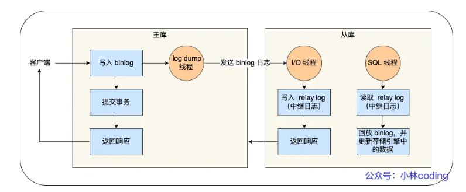

MySQL集群的主从复制过程主要分为三个阶段：

* 写入 Binlog：主库写 binlog 日志，提交事务，并更新本地存储数据。
* 同步 Binlog：把 binlog 复制到所有从库上，每个从库把 binlog 写到暂存日志中。
* 回放 Binlog：回放 binlog，并更新存储引擎中的数据。

具体来说，主库在客户端提交事务的请求之后，会先写入 binlog，再提交事务；从库会创建一个专门的 I/O 线程，连接主库的 log dump 线程，来接收主库的 binlog 日志，再把 binlog 信息写入 relay log 的中继日志里；从库会创建一个用于回放 binlog 的线程，去读 relay log 中继日志，然后回放 binlog 更新存储引擎中的数据，最终实现主从的数据一致性

**从库的数量不是越多越好**，因为从库数量增加，从库连接上来的 I/O 线程也比较多，主库也要创建同样多的 log dump 线程来处理复制的请求，对主库资源消耗比较高，同时还受限于主库的网络带宽。所以在实际使用中，一个主库一般跟 2～3 个从库（1 套数据库，1 主 2 从 1 备主），这就是一主多从的 MySQL 集群结构。

**MySQL主从复制模型**

* **同步复制**：MySQL 主库提交事务的线程要等待所有从库的复制成功响应，才返回客户端结果。这种方式在实际项目中，基本上没法用，原因有两个：一是性能很差，因为要复制到所有节点才返回响应；二是可用性也很差，主库和所有从库任何一个数据库出问题，都会影响业务。
* **异步复制**（默认模型）：MySQL 主库提交事务的线程并不会等待 binlog 同步到各从库，就返回客户端结果。这种模式一旦主库宕机，数据就会发生丢失。
* **半同步复制**：MySQL 5.7 版本之后增加的一种复制方式，介于两者之间，事务线程不用等待所有的从库复制成功响应，只要一部分复制成功响应回来就行，比如一主二从的集群，只要数据成功复制到任意一个从库上，主库的事务线程就可以返回给客户端。这种半同步复制的方式，兼顾了异步复制和同步复制的优点，即使出现主库宕机，至少还有一个从库有最新的数据，不存在数据丢失的风险。

**bin log的刷盘时机**

事务执行过程中，先把日志写到 binlog cache（Server 层的 cache），事务提交的时候，再把 binlog cache 写到 binlog 文件中。

一个事务的 binlog 是不能被拆开的，因此无论这个事务有多大（比如有很多条语句），也要保证一次性写入。这是因为有一个线程只能同时有一个事务在执行的设定，所以每当执行一个 begin/start transaction 的时候，就会默认提交上一个事务，这样如果一个事务的 binlog 被拆开的时候，在备库执行就会被当做多个事务分段自行，这样破坏了原子性，是有问题的。MySQL 给每个线程分配了一片内存用于缓冲 binlog ，该内存叫 binlog cache，参数 binlog\_cache\_size 用于控制单个线程内 binlog cache 所占内存的大小。如果超过了这个参数规定的大小，就要暂存到磁盘。

在事务提交的时候，执行器把 binlog cache 里的完整事务写入到 binlog 文件中，并清空 binlog cache。虽然每个线程有自己 binlog cache，但是最终都写到同一个 binlog 文件。

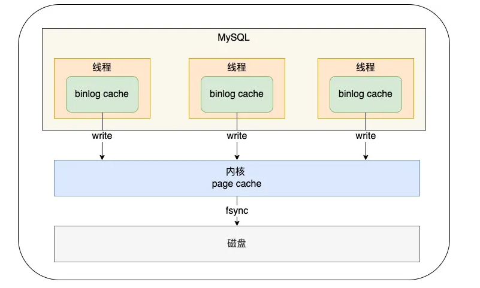

MySQL提供一个 sync\_binlog 参数来控制数据库的 binlog 刷到磁盘上的频率：

* sync\_binlog = 0 的时候，表示每次提交事务都只 write，不 fsync，后续交由操作系统决定何时将数据持久化到磁盘；
* sync\_binlog = 1 的时候，表示每次提交事务都会 write，然后马上执行 fsync；
* sync\_binlog =N(N>1) 的时候，表示每次提交事务都 write，但累积 N 个事务后才 fsync。

#### 两阶段提交

事务提交后，bin log和redo log都要持久化磁盘，但这两个是独立的逻辑。为了避免出现半成功的状态（例如redo log和bin log的一方刷入磁盘，而另一方没来得及写入），使用了两阶段提交来解决。其中一方没写入，都会导致主从不一致。

两阶段提交把单个事务的提交拆分成了 2 个阶段，分别是「准备（Prepare）阶段」和「提交（Commit）阶段」，每个阶段都由协调者（Coordinator）和参与者（Participant）共同完成。

在 MySQL 的 InnoDB 存储引擎中，开启 binlog 的情况下，MySQL 会同时维护 binlog 日志与 InnoDB 的 redo log，为了保证这两个日志的一致性，MySQL 使用了内部 XA 事务，内部 XA 事务由 binlog 作为协调者，存储引擎是参与者。

当客户端执行 commit 语句或者在自动提交的情况下，MySQL 内部开启一个 XA 事务，分两阶段来完成 XA 事务的提交：

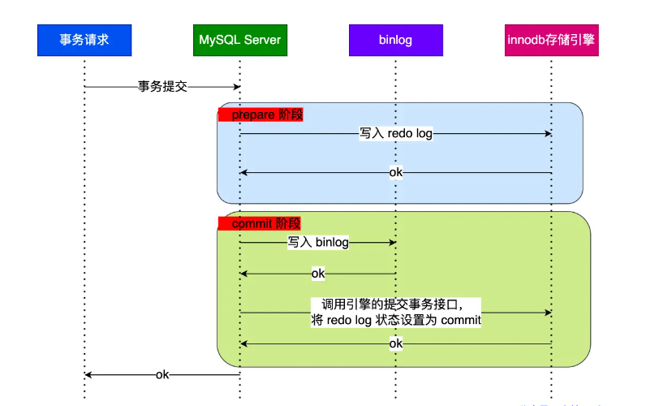

redo log 的写入拆成了两个步骤：prepare 和 commit，中间再穿插写入binlog，具体如下：

* **prepare 阶段**：将 XID（内部 XA 事务的 ID） 写入到 redo log，同时将 redo log 对应的事务状态设置为 prepare，然后将 redo log 持久化到磁盘（innodb\_flush\_log\_at\_trx\_commit = 1 的作用）；
* **commit 阶段**：把 XID 写入到 binlog，然后将 binlog 持久化到磁盘（sync\_binlog = 1 的作用），接着调用引擎的提交事务接口，将 redo log 状态设置为 commit，此时该状态并不需要持久化到磁盘，只需要 write 到文件系统的 page cache 中就够了，因为只要 binlog 写磁盘成功，就算 redo log 的状态还是 prepare 也没有关系，一样会被认为事务已经执行成功；

**异常重启在两阶段提交下的情况**

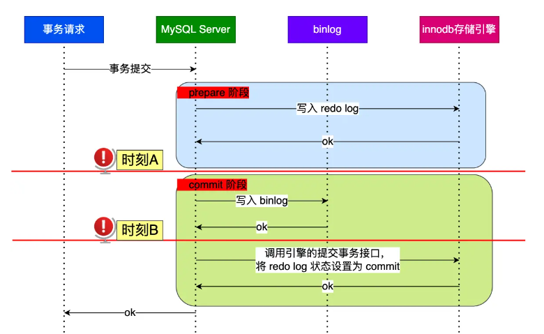

对于A，B而言，此时的redo log都已经完成。而A时的bin log下并没有当前内部XA事务的XID，说明bin log还没有完成刷盘，或回滚。而B就不会。

对于处于 prepare 阶段的 redo log，即可以提交事务，也可以回滚事务，这取决于是否能在 binlog 中查找到与 redo log 相同的 XID，如果有就提交事务，如果没有就回滚事务。这样就可以保证 redo log 和 binlog 这两份日志的一致性了。所以说，两阶段提交是以 binlog 写成功为事务提交成功的标识，因为 binlog 写成功了，就意味着能在 binlog 中查找到与 redo log 相同的 XID。

**事务没提交的时候，redo log也会持久化到磁盘么**

事务执行中间过程的 redo log 也是直接写在 redo log buffer 中的，这些缓存在 redo log buffer 里的 redo log 也会被「后台线程」每隔一秒一起持久化到磁盘。因此与事务是否提交无关。redo log 可以在事务没提交之前持久化到磁盘，但是 binlog 必须在事务提交之后，才可以持久化到磁盘。

**两阶段提交的问题**

两阶段提交虽然保证了两个日志文件的数据一致性，但是性能很差，主要有两个方面的影响：

* **磁盘 I/O 次数高**：对于“双1”配置（指的是为了避免日志丢失，每次事务提交都会将buffer或cache里的数据直接持久化到磁盘），每个事务提交都会进行两次 fsync（刷盘），一次是 redo log 刷盘，另一次是 binlog 刷盘。
* **锁竞争激烈**：两阶段提交虽然能够保证「单事务」两个日志的内容一致，但在「多事务」的情况下，却不能保证两者的提交顺序一致，因此，在两阶段提交的流程基础上，还需要加一个锁来保证提交的原子性，从而保证多事务的情况下，两个日志的提交顺序一致。

**组提交**

针对两阶段提交的问题，MySQL 引入了 binlog 组提交（group commit）机制，当有多个事务提交的时候，会将多个 binlog 刷盘操作合并成一个，从而减少磁盘 I/O 的次数，如果说 10 个事务依次排队刷盘的时间成本是 10，那么将这 10 个事务一次性一起刷盘的时间成本则近似于 1。

引入了组提交机制后，prepare 阶段不变，只针对 commit 阶段，将 commit 阶段拆分为三个过程：

* **flush 阶段**：多个事务按进入的顺序将 binlog 从 cache 写入文件（不刷盘）
* **sync 阶段**：对 binlog 文件做 fsync 操作（多个事务的 binlog 合并一次刷盘）；
* **commit 阶段**：各个事务按顺序做 InnoDB commit 操作；

上面的每个阶段都有一个队列，每个阶段有锁进行保护，因此保证了事务写入的顺序，第一个进入队列的事务会成为 leader，leader领导所在队列的所有事务，全权负责整队的操作，完成后通知队内其他事务操作结束。对每个阶段引入了队列后，锁就只针对每个队列进行保护，不再锁住提交事务的整个过程，可以看的出来，锁粒度减小了，这样就使得多个阶段可以并发执行，从而提升效率。

bin log组提交和redo log组提交都是存在的，redo log组提交在prepare操作中。

### mysql的磁盘IO优化

事务在提交的时候，需要将 binlog 和 redo log 持久化到磁盘，那么如果出现 MySQL 磁盘 I/O 很高的现象，我们可以通过控制以下参数，来 “延迟” binlog 和 redo log 刷盘的时机，从而降低磁盘 I/O 的频率：

* 设置组提交的两个参数， binlog\_group\_commit\_sync\_delay 和 binlog\_group\_commit\_sync\_no\_delay\_count 参数，延迟 binlog 刷盘的时机，从而减少 binlog 的刷盘次数。只要系统没有宕机，缓存在 page cache 里的 binlog 就会被持久化到磁盘。
* 将 sync\_binlog 设置为大于 1 的值（比较常见是 100\~1000），表示每次提交事务都 write，但累积 N 个事务后才 fsync，相当于延迟了 binlog 刷盘的时机。但是这样做的风险是，主机掉电时会丢 N 个事务的 binlog 日志。
* 将 innodb\_flush\_log\_at\_trx\_commit 设置为 2。表示每次事务提交时，都只是缓存在 redo log buffer 里的 redo log 写到 redo log 文件，注意写入到「 redo log 文件」并不意味着写入到了磁盘，因为操作系统的文件系统中有个 Page Cache，专门用来缓存文件数据的，所以写入「 redo log文件」意味着写入到了操作系统的文件缓存，然后交由操作系统控制持久化到磁盘的时机。但是这样做的风险是，主机掉电的时候会丢数据。

## mysql Buffer Pool

### Buffer Pool基础

实现了数据从磁盘取出后，缓存在内存中，下次查询同样数据的时候直接在内存中读取。

有了缓冲池后：

* 当读取数据时，如果数据存在于 Buffer Pool 中，客户端就会直接读取 Buffer Pool 中的数据，否则再去磁盘中读取
* 当修改数据时，首先是修改 Buffer Pool 中数据所在的页，然后将其页设置为脏页，最后由后台线程将脏页写入到磁盘

默认配置下 Buffer Pool 只有 `128MB`。可以通过调整 `innodb_buffer_pool_size` 参数来设置 Buffer Pool 的大小，一般建议设置成可用物理内存的 60%\~80%。

Buffer Pool 中的页就叫做缓存页（与存储页大小上没有差别，都是16KB）。此时这些缓存页都是空闲的，之后随着程序的运行，才会有磁盘上的页被缓存到 Buffer Pool 中。

为了更好的管理这些在 Buffer Pool 中的缓存页，InnoDB 为每一个缓存页都创建了一个**控制块**，控制块信息包括「缓存页的表空间、页号、缓存页地址、链表节点」等等。控制块也是占有内存空间的，它是放在 Buffer Pool 的最前面，接着才是缓存页

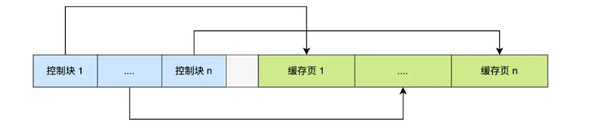

控制块和缓存页之间灰色部分称为碎片空间。往往出现在不够一对控制块和缓存页的大小时。

注意，即便查询的是一条记录，InnoDB 还是会把整个页的数据加载到 Buffer Pool 中。

### 如何管理Buffer Pool

为了能够快速找到空闲的缓存页，可以使用链表结构，将空闲缓存页的「控制块」作为链表的节点，这个链表称为 **Free 链表**（空闲链表），它是一个双向链表。

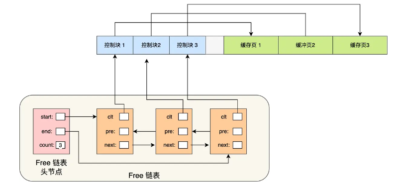

Free 链表上除了有控制块，还有一个头节点，该头节点包含链表的头节点地址，尾节点地址，以及当前链表中节点的数量等信息。Free 链表节点是一个一个的控制块，而每个控制块包含着对应缓存页的地址，所以相当于 Free 链表节点都对应一个空闲的缓存页。

有了 Free 链表后，每当需要从磁盘中加载一个页到 Buffer Pool 中时，就从 Free链表中取一个空闲的缓存页，并且把该缓存页对应的控制块的信息填上，然后把该缓存页对应的控制块从 Free 链表中移除。

### 如何管理脏页

更新数据的时候，不需要每次都要写入磁盘，而是将 Buffer Pool 对应的缓存页标记为**脏页**，然后再由后台线程将脏页写入到磁盘。那为了能快速知道哪些缓存页是脏的，于是就设计出 **Flush 链表**，它跟 Free 链表类似的，链表的节点也是控制块，区别在于 Flush 链表的元素都是脏页。

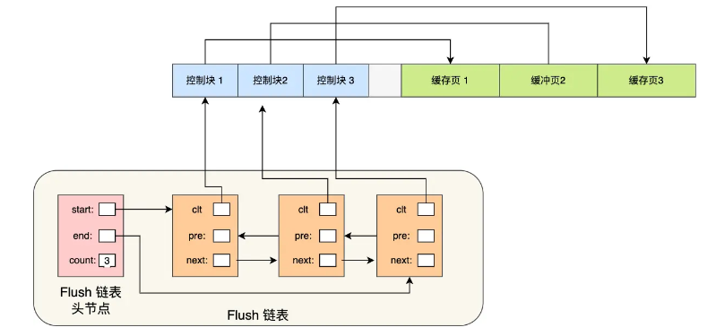

### 脏页什么时候会被刷入磁盘

InnoDB 的更新操作采用的是 Write Ahead Log 策略，即先写日志，再写入磁盘，通过 redo log 日志让 MySQL 拥有了崩溃恢复能力，因此即便脏页在MySQL 宕机前没有刷入磁盘，还是不会丢失数据的。（一致性）

脏页的刷新被触发的情况：

* 当 redo log 日志满了的情况下，会主动触发脏页刷新到磁盘；
* Buffer Pool 空间不足时，需要将一部分数据页淘汰掉，如果淘汰的是脏页，需要先将脏页同步到磁盘；
* MySQL 认为空闲时，后台线程会定期将适量的脏页刷入到磁盘；
* MySQL 正常关闭之前，会把所有的脏页刷入到磁盘；

MySQL的“抖动”现象，即发现「偶尔」会出现一些用时稍长的 SQL，表明脏页在刷新到磁盘时给数据库带来性能开销，导致数据库操作抖动。果间断出现这种现象，就需要调大 Buffer Pool 空间或 redo log 日志的大小。

### 缓存命中率如何提高

LRU（最近最少使用）算法：

链表头部的节点是最近使用的，而链表末尾的节点是最久没被使用的。那么，当空间不够了，就淘汰最久没被使用的节点，从而腾出空间。它的思路具体如下：

* 当访问的页在 Buffer Pool 里，就直接把该页对应的 LRU 链表节点移动到链表的头部。
* 当访问的页不在 Buffer Pool 里，除了要把页放入到 LRU 链表的头部，还要淘汰 LRU 链表末尾的节点。

这种算法无法避免两个很大的问题：预读失效，Buffer Pool污染

* 预读失效：MySQL 在加载数据页时，会提前把它相邻的数据页一并加载进来，目的是为了减少磁盘 IO，这叫“预读”。但如果使用简单的 LRU 算法，就会把预读页放到 LRU 链表头部，而当 Buffer Pool空间不够的时候，还需要把末尾的页淘汰掉。如果这些预读页如果一直不会被访问到，就会出现一个很奇怪的问题，不会被访问的预读页却占用了 LRU 链表前排的位置，而末尾淘汰的页，可能是频繁访问的页，这样就大大降低了缓存命中率。
* Buffer Pool污染：当某一个 SQL 语句扫描了大量的数据时，在 Buffer Pool 空间比较有限的情况下，可能会将 Buffer Pool 里的所有页都替换出去，导致大量热数据被淘汰了，等这些热数据又被再次访问的时候，由于缓存未命中，就会产生大量的磁盘 IO，MySQL 性能就会急剧下降，这个过程被称为 Buffer Pool 污染。

LRU的优化算法：

要避免预读失效带来影响，最好就是**让预读的页停留在 Buffer Pool 里的时间要尽可能的短**，让真正被访问的页才移动到 LRU 链表的头部，从而保证真正被读取的热数据留在 Buffer Pool 里的时间尽可能长。

MySQL改进了 LRU 算法，将 LRU 划分了 2 个区域：**old 区域 和 young 区域**。old 区域占整个 LRU 链表长度的比例可以通过 `innodb_old_blocks_pct` 参数来设置，默认是 37，代表整个 LRU 链表中 young 区域与 old 区域比例是 63:37。

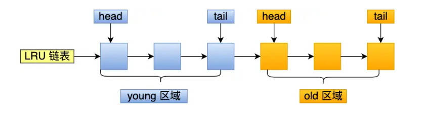

划分这两个区域后，预读的页就只需要加入到 old 区域的头部，当页被真正访问的时候，才将页插入 young 区域的头部。如果预读的页一直没有被访问，就会从 old 区域移除，这样就不会影响 young 区域中的热点数据。

要避免Buffer Pool污染的问题，需要提高进入young区域的门槛，避免热数据被替换。因此，进入到 young 区域条件增加了一个停留在 old 区域的时间判断。在对某个处在 old 区域的缓存页进行第一次访问时，就在它对应的控制块中记录下来这个访问时间：

**只有同时满足「被访问」与「在 old 区域停留时间超过一定时间」两个条件，才会被插入到 young 区域头部**，这样就解决了 Buffer Pool 污染的问题 。

这个间隔时间是由 `innodb_old_blocks_time` 控制的，默认是 1000 ms（1s）。

另外，MySQL 针对 young 区域其实做了一个优化，为了防止 young 区域节点频繁移动到头部。young 区域前面 1/4 被访问不会移动到链表头部，只有后面的 3/4被访问了才会。

## mysql查询优化

1.条件化简

2.移除不必要的括号

3.常量传递

4.移除没用的条件：例如一定为true或false

5.表达式计算：

​ （1）表达式只包含常量的话，值会被计算出来

​ （2）如果某个列在函数中或者以运算形式出现，优化器不会进⾏化简

6.having和where⼦句的合并：

​ （1）查询语句中没有sum、max这样的聚集函数以及group⼦句的话，优化器会将having和where⼦句合并

​ （2）having⼦句⽤于分组后过滤，where⽤于分组前合并

7.常量表检测：

​ （1）使⽤主键等值匹配、使⽤唯⼀⼆级索引列等值匹配进⾏查询的表称为常量表

​ （2）优化器会优先执⾏常量表查询，因为速度⾮常快

8.外连接消除

9.优化器会将右连接转化为左连接

10.空值拒绝：

​ （1）在外连接查询中，指定的where⼦句中包含被驱动表的列不为null值的条件（就是不允许查出来的记录中含有null值）

​ （2）被驱动表的where⼦句符合空值拒绝的条件后，外连接和内连接可以相互转换

11.子查询优化

## mysql子查询

在⼀个查询语句中的某个位置可以出现另⼀个查询语句，这另⼀个查询就叫⼦查询

（1）按出现位置分类

```sql
#在select子句中
select (select m1 from t1 limit 1);
#在from子句中，将这种⼦查询的结果当做⼀个表，在from⼦句中的⼦查询称为派⽣表
select m, n from (select ...);
#在where或on子句中
select * from t1 where m1 in (select ...);
```

（2）按返回的结果集分类

```sql
#标量子查询，只返回一个单一值
select (select m1 from t1 limit 1);
#行子查询，返回一条记录，需要包含多个列，使⽤limit 1保证⼦查询的结果只有⼀条记录
select * from t1 where (m1, n1) = (select m2, n2 from t2 limit 1);
#列子查询，返回⼀个列的数据，可能包含多条纪录
select * from t1 where m1 in (select m2 from t2);
#表子查询，⼦查询的结果既有多条纪录，又有多个列
select * from t1 where (m1, n1) = (select m2, n2 from t2);
```

（3）按外层查询关系分类

```sql
#不相关⼦查询,⼦查询可以单独运⾏出结果，不依赖于外层查询的值

#相关子查询，子查询的执行需要依赖外部查询的值
select * from t1 where m1 in (select m2 from t2 where n1 = n2);
```

## mysql高性能

### mysql主从复制

数据可以从⼀个MySQL数据库服务器主节点复制到⼀个或者多个从节点。

MySQL默认采⽤异步复制⽅式，这样从节点就不⽤⼀直访问主服务器来更新最新数据。

从节点可以复制主节点数据库中的所有数据库、特定的数据库或者特定的表。

用途：

​ 1.数据实时备份

​ 当系统中某个节点发⽣故障时，可以⽅便故障切换

​ 2.读写分离

​ 在开发过程中，如果遇到某个sql语句需要锁表，导致暂时不能使⽤读的服务

​ 使⽤主从复制，让主数据库负责写，从数据库负责读，即使主库出现锁表的情景，也可以通过从库正常读数据

​ 3.架构扩展

​ 随着系统中业务访问量的增加，如果是单机部署数据，会导致I/O访问频率过⾼

​ 通过主从复制，增加多个数据存储结点，将负载分布在多个从节点上，降低单机的I/O访问频率，提⾼单机的I/O性能

原理：

mysql主从复制涉及到三个线程，一个运行在主节点（binary log dump thread），两个运行在从节点（I/O thread、SQL thread）

binary log dump thread：

​ 当从节点连接主节点的时候，主节点创建该线程，⽤于发送bin-log内容

I/O thread：

​ 当从节点执⾏“start slave”命令之后，从节点会创建⼀个I/O线程⽤来连接主节点，请求其中的数据。I/O线程接收到主节点binlog dump的更新数据之后，保存在本地的relay log中

SQL thread：

​ 该线程负责读取relay log中的内容，解析或具体的操作并执⾏，最终保证主从数据的⼀致性

基本过程：

1.从节点I/O进程连接主节点

请求指定⽇志⽂件的指定位置后⾯的内容

2.主节点接收到请求之后

通过负责复制的I/O进程根据请求的信息读取指定的⽇志位置之后的⽇志信息，返回给从节点。返回信息中除了⽇ 志所包含的指定⽇志信息还包含了本次返回信息的 bin-log file 以及 bin-log position

3.从节点的I/O线程接收到内容之后

将接收到的⽇志内容更新到本机的 relay log 中，并且把读取到的 binary log ⽂件名和位置保存到 master-info ⽂件 中，⽅便下⼀次告知 master 从节点需要更新的位置

4.Slave 的 SQL 线程检测到 relay-log 中新增了内容

将 relay-log 的内容解析成在主节点上实际执⾏的操作，并在数据库中执⾏

主从复制模式：

1.异步模式

​ 主服务器将更新操作写入自己的日志文件，而从服务器则异步地从主服务器的日志文件读取并应用这些更新。

​ 异步模式下，主服务器不等待从服务器的响应，而是继续处理其他请求。这意味着主从服务器之间的数据可能存在一定程度的延迟。

2.半同步模式

​ 主服务器在将更新写入自己的日志文件后，等待至少一个从服务器接收并确认接收了这个更新，然后主服务器才继续。

​ 半同步模式相对于异步模式来说，提高了数据一致性，因为主服务器会等待至少一个从服务器确认接收更新。

3.全同步模式

​ 主服务器在将更新写入自己的日志文件后，等待所有的从服务器都接收并确认接收了这个更新，然后主服务器才继续。

​ 全同步模式要求所有的从服务器都接收到更新，因此相对于半同步模式来说，提高了更高的数据一致性，但也增加了延迟。

4.GTID复制模式

​ GTID是MySQL 5.6及以上版本引入的一项特性，用于跟踪和标识复制中的事务。GTID复制模式使用全局唯一的标识符来标记每个事务，使得复制更加可靠和容错。

​ GTID模式简化了复制配置，更容易管理和维护。它还提供了在复制中进行故障切换时更容易恢复的好处。

### 分库分表

原因：

​ 1.单库太大，单个数据库处理能⼒有限，所在的服务器上的磁盘空间也有限，单库存在I/O操作瓶颈。 因此需要切分成更多更⼩的库

​ 2.单表太大，索引膨胀，查询超时。因此需要切分成多个数据集更小的表

拆分方案：

1.垂直拆分

​ （1）垂直分表

​ “⼤表拆⼩表“，基于列的字段进⾏

​ ⼀般表中字段较多，将不常⽤的，数据较⼤的，长度较长的，拆分到“扩展表”

​ （2）垂直分库

​ 针对⼀个系统中不同业务进⾏拆分，拆分之后放到多个服务器上

2.水平拆分

​ （1）水平分表

​ 针对数据量巨⼤的单张表（⽐如订单），按照某种规则（RANGE，HASH取模），切分到多张表中，这些表还在 ⼀个数据库中

​ （2）水平分库

​ 将单张表的数据切分到多个服务器上，每个服务器都有相应的库和表，只是表中的数据集合不同

​ ⽔平分库能够有效的缓解单机和单库的性能瓶颈，I/O，连接数和硬件资源等瓶颈

​ ⽔平分库分表切分规则：

​ 1.range： 根据范围，⽐如0-1000⼀个表，1001到2000⼀个表

​ 2.hash取模： ⽐如取ID，进⾏hash取模，根据模数分配到不同的数据库中

​ 3.地理区域/时间范围： 按照地理范围/时间进⾏划分

## MySQL常见问题

### 幻读与锁

1.什么是幻读

幻读是指在同⼀个事务中，存在前后两次查询同⼀个范围的数据，但是第⼆次查询却看到了第⼀次查询没看到的⾏

出现的场景是：a.事务的隔离级别为可重复读，且是当前读。 b.幻读仅专指新插⼊的⾏

2.幻读带来的问题

对⾏锁语义的破坏，破坏了数据的一致性

3.如何避免幻读

存储引擎采⽤加间隙锁的⽅式来避免出现幻读

4.为啥会出现幻读

⾏锁只能锁定存在的⾏，针对新插⼊的操作没有限定

5.什么是间隙锁？间隙锁如何避免幻读？它引入了什么新的问题

间隙锁是专门⽤于解决幻读这种问题的锁，它锁的了⾏与⾏之间的间隙，能够阻塞新插⼊的操作

间隙锁的引⼊也带来了⼀些新的问题，⽐如：降低并发度，可能导致死锁

间隙锁之间是不冲突的，间隙锁会阻塞插⼊操作。另外，间隙锁在可重复读级别下才是有效的

⾏锁和间隙锁合称 next-key lock，这个锁是左开右闭的区间。

MySQL 为了解决幻读问题，在线程更新数据并 next-key lock 的过程中，⾸先必须在可重复读的隔离级别下，执⾏以下的原则和优化：

​ 原则：1.加锁的基本单位是 next-key lock，next-key lock 是前开后闭区间

​ 2.查找过程中访问到的对象才会加锁

​ 优化：1.索引上的等值查询，给唯⼀索引加锁的时候，next-key lock 退化为⾏锁，如果不存在这个索引，退化为间隙锁

​ 2.索引上的等值查询，向右遍历时且最后⼀个值不满⾜等值条件的时候，next-key lock 退化为间隙锁

⾮唯⼀索引的范围查询：范围查询都会访问到不满⾜条件的第⼀个值，并且不会执⾏上述的两个优化。唯⼀索引的范围查询仍旧会执⾏上述的优化

delete 语句的和查询的加锁⽅式相同

limit 语句，遍历到满⾜条件的 n 条数据后，之后不再加 next-key lock

如果两个都给同⼀个间隙上锁，之后两个线程都没办法在这个间隙上更新数据了，都会陷⼊等待另⼀个线程的间隙锁释放，也就是死锁

如果使⽤读提交隔离级别，那么只加⾏锁，不加间隙锁，语句执⾏过程中加上的⾏锁，在语句执⾏完成后，就要把 “不满⾜条件的⾏”上的⾏锁直接释放了，不需要等到事务提交才释放

### 事务相关

1.for update的使用场景

for update会进行数据加锁，防止高并发的情况下数据出错，即使事务保持当前读的状态。

for update仅适用于InnoDB，且必须在事务块(BEGIN/COMMIT)中才能生效。在进行事务操作时，通过“for update”语句，MySQL会对查询结果集中每行数据都添加排他锁，其他线程对该记录的更新与删除操作都会阻塞。排他锁包含行锁、表锁。

2.事务隔离

innodb支持RC和RR隔离级别的实现用的是一致性视图

事务在启动时会拍⼀个快照,这个快照是基于整个库的。基于整个库的意思就是说⼀个事务内,整个库的修改对于该事务都是不可见的(对于快照读的情况)

如果在事务内 select 表,另外的事务执⾏了DDL（数据定义语言操作，包括表的创建和删除，修改表结构等）表,根据发⽣时间,只有两种情况：报错或者锁住

3.事务如何实行多版本并发控制（MVCC）

每个事务都有一个事务ID，叫做transaction id(严格递增)

事务在启动时,找到已提交的最⼤事务ID记为up\_limit\_id

事务在更新⼀条语句时，首先，（更新前）会将原始数据写到 undo log （记录事务修改之前数据的机制，以便在回滚或撤销操作时使用）⾥；然后再对数据页进行相应更改；更新后，数据库会在被修改的记录的行头（record header）中记录执行该修改的事务的ID。这是为了跟踪记录的修改历史，以便实现并发控制和事务隔离。

一个事务要查看⼀条数据时,必须先⽤该事务的 up\_limit\_id（事务的上界ID） 与该⾏的transaction id 做⽐对：

​ 如果 up\_limit\_id >= transaction id,那么可以看

​ 如果 up\_limit\_id < transaction id,则只能去 undo log ⾥去取

去 undo log 查找数据的时候,也需要做⽐对,必须 up\_limit\_id > transaction id，才返回数据

如果 up\_limit\_id <= transaction id，则可能表示该数据已经是事务能够查看的最新版本，无法从undo log中进行恢复

4.什么是当前读

由于当前读都是先读后写,只能读当前的值,所以为当前读会更新事务内的 up\_limit\_id 为该事务的 transaction

5.为什么 rr 能实现可重复读⽽ rc 不能

分两种情况：

​ 1.快照读的情况下，rr不能更新事务内的 up\_limit\_id ,⽽ rc 每次会把 up\_limit\_id 更新为快照读之前最新已提交事务的 transaction id,则 rc 不能可重复读

​ 2.当前读的情况下，rr 是利⽤ record lock+gap lock来实现的,⽽ rc 没有 gap,所以 rc 不能可重复读

6.普通索引和唯一索引的区别

对于查询过程来说：

​ 普通索引查到满⾜条件的第⼀个记录后，继续查找下⼀个记录，直到第⼀个不满⾜条件的记录

​ 由于索引唯⼀性，查到第⼀个满⾜条件的记录后，停⽌检索 但是，两者的性能差距微乎其微。因为InnoDB根据数据页来读写的。

对于更新过程来说：

​ 唯一索引不能使用change buffer，而它对性能提升非常明显，因此更优先使用普通索引

change buffer：

​ 当需要更新一个数据页时，如果数据页在内存中就直接更新；如果不在内存中，在不影响数据⼀致性的前提下，InnoDB 会将这些更新操作缓存在change buffer 中

​ 下次查询需要访问这个数据页的时候，将数据页读⼊内存，然后执⾏ change buffer 中的与这个页有关的操作

​ change buffer 是可以持久化的数据。在内存中有拷贝，也会被写⼊到磁盘上

​ change buffer 因为减少了随机磁盘访问，所以对更新性能的提升很明显

​ 将 change buffer 中的操作应⽤到原数据页上，得到最新结果的过程，称为 purge。访问这个数据页会触发 purge，系统有后台线程定期 purge，在数据库正常关闭的过程中，也会执⾏ purge。

​ 在⼀个数据页做purge之前，change buffer记录的变更越多，收益就越⼤。对于写多读少的业务来说，页⾯在写完以后马上被访问到的概率⽐较⼩，此时change buffer的使⽤效果最好。这种 业务模型常见的就是账单类、⽇志类的系统。相反，对于写少读多的业务来说，随机访问IO的次数不会减少，反⽽增加了change buffer的维护代价。

​ redo log（记录已经执行的修改操作，undo log记录的是事务回滚前的数据版本）主要节省的是随机写磁盘的IO消耗(将事务的修改操作以顺序写的方式记录到 Redo Log 中，最小化对磁盘的随机写入)，⽽change buffer主要节省的则是随机读磁盘的IO消耗。

### 数据库记录相关

1.char和varchar的区别

char是固定长度类型，即便存入的字符大小比声明的大小小，实际占据的大小仍然为声明的大小。

varchar则可变，变长字段所占用的字节数被单独放在变长字段列表中，并且按照表的顺序逆序存放，因此仍然需要额外的存储。

2.mysql抖一下是什么情况

偶尔慢一下，此时mysql的运行不稳定，需要花费更多的资需源处理别的事情，会使SQL语句的执⾏效率明显变慢

InnoDB内mysql抖的原因是InnoDB 会在后台刷脏页，⽽刷脏页的过程是要将内存页写⼊磁盘。在这种情况下，刷脏页的逻辑会占⽤ IO 资源并可能影响到了更新语句，导致突然慢一下

mysql突然变慢导致的性能下降对业务是很不友好的

让mysql不抖的核心在两点：

​ 1.设置合理参数配配置，尤其是设置好innodb\_io\_capacity 的值（代表系统的期望 I/O 能力。这个值是一个正整数，单位是 I/O 操作每秒（IOPS）。通过设置这个参数，你可以告诉 InnoDB 引擎系统的磁盘性能水平，以便在执行各种操作时更好地调整其行为）

​ 2.多关注脏页⽐例，不要让它经常接近 75%（优化查询和事务，调整事务大小，适当调整缓冲池大小，使用合理的刷新策略，增加磁盘性能）

3.脏页/干净页是什么

脏页：当内存数据页跟磁盘数据页内容不⼀致的时候，我们称这个内存页为“脏页”

干净页：内存数据写⼊到磁盘后，内存和磁盘上的数据页的内容就⼀致了，称为“⼲净页”

4.为什么会产生脏页

因为使⽤了WAL技术，这个技术会把数据库的随机写转化为顺序写，但副作⽤就是会产⽣脏页。

Write-Ahead Logging 是一种事务处理的机制，它要求在修改数据库内容之前，先将修改的操作记录到一个称为日志（WAL日志）的地方。

WAL 日志是一个顺序写的日志文件，其中记录了事务对数据库的修改操作。在事务提交前，WAL 日志中的记录已经写入磁盘，表示该事务的修改操作已经持久化。

当使用 WAL 技术时，事务的修改操作首先被写入 WAL 日志，这个过程是顺序写入的，因为 WAL 是一个追加写入的顺序文件。这意味着，即使实际数据库的数据页是通过随机写进行修改，WAL 日志的写入是按照顺序进行的。这有助于减少磁盘寻址的开销，提高写入性能。

5.随机写/顺序写

随机写指的是数据在存储介质上的写入位置不是连续的，而是分散在不同的位置。每次写入都可能导致磁头的移动到不同的磁道或扇区，因此需要进行随机寻址。在随机写的情况下，磁盘的读写头需要频繁地在不同的位置进行跳跃，导致更高的磁盘访问延迟。

顺序写指的是数据在存储介质上的写入位置是连续的，按照顺序进行。数据依次写入相邻的位置，使得磁头的移动是顺序的，无需频繁的寻址。顺序写通常具有更高的性能，因为它可以充分利用磁盘的带宽。顺序写减少了磁头的寻址成本，减小了磁盘读写的延迟。

写redo log是顺序写的，先写redo log等合适的时候再写磁盘，间接的将随机写变成了顺序写，性能确实会提⾼不 少。

### 数据库信息相关

1.当删除表的数据后，表文件的大小为什么不会有变化

因为delete 命令其实只是把记录的位置，或者数据页标记为了“可复⽤”，但磁盘⽂件的⼤⼩是不会变的。也可以认为是⼀种逻辑删除，所以物理空间没有实际释放，只是标记为可复⽤，表⽂件的⼤⼩不变

2.表的数据信息/结构信息存在哪里

数据信息：存储在共享表空间⾥，也可以单独存储在⼀个以.ibd为后缀的⽂件⾥。在使用文件管理时，使⽤ drop table 命令也能直接把对应的⽂件删除，如果存储在共享空间之中即使表删除了空间也不会释放

结构信息：存储在系统数据表中，主要⽤于存储MySQL的系统数据，⽐如：数据字典、undo log(默认)等⽂件

3.如何才能真正在表删除删除后，对应的表文件大小减小

```sql
# optimize(优化)等于 recreate+analyze，会重建一个新的，紧凑的表，有助于减少表碎片并提高性能 
optimize table t
# truncate（清空）等于 drop+create，会将原表中数据全部删除，但保留表的结构
truncate table t 
```

4.什么是空洞

空洞就是那些被标记可复⽤但是还没被使⽤的存储空间。

​ 使⽤delete命令删除数据会产⽣空洞，标记为可复⽤。

​ 插⼊新的数据可能引起页分裂，也可能产⽣空洞

​ 修改操作，有时⼀些先删后插的动作也可能产⽣空洞

5.count()计数相关

count使用的形式：

​ 1.count(字段)，表示对某个特定字段（列）进行计数。它将计算该字段非空的行数，不包括字段值为 NULL 的行

​ 2.count(主键id)，表示对主键 id 进行计数。主键 id 通常是一个唯一标识符，不应该包含 NULL 值。这个计数将统计表中主键列非空的行数

​ 3.count(1)和count(\*)，都表示计算所有行的数量，包括包含 NULL 值的行

每个存储引擎对count的实现不同，对于innodb来说，count() 是⼀个聚合函数，对于返回的结果集，⼀⾏⾏地判断，如果 count 函数的参数不是 NULL，累计值就加 1， 否则不加，最后返回累计值

### 数据库语句和存储相关

1.order by是怎样工作的

涉及到⽤户语句的排序，mysql 会给每个线程分配⼀块内存⽤于排序，也就是 sort\_buffer。

```sql
select city,name,age from t where city='杭州' order by name limit 1000;
```

这条语句的执⾏逻辑是：

​ 1.先初始化 sort\_bufer

​ 2.然后放⼊ city,name,age 字段，不断地由主键id索引到整⾏再到三个字段的值，匹配查找的值存⼊ sort\_buff

​ 3.然后按 name 排序，返回前 1000 个值

但是如果 sort\_buffer\_size 设置的太⼩，⽆法存放所有匹配的字段，排序就⽆法在内存中完成

如果要记录的字段太长，这样内存⾥能够同时放下的⾏数很少，要分成很多个临时⽂件，排序的性能会很差

这时会换⼀个算法，叫做rowid排序，顾名思义，就是对主键 id 以及排序字段进⾏存放，这样就节省了空间，但是 最后需要通过主键 id 去找到之前未取出的字段。对⽐全字段排序，rowid 排序多访问了⼀次表 t 的主键索引。（是否进行rowid排序是根据sort\_buffer的大小决定的）

2.SQL语句性能差异巨大的原因

```
1.条件字段的函数操作，对索引字段对函数进程操作，可能会破坏索引值的有序性，因此优化器就决定放弃⾛树搜索功能，转⽽进⾏全表扫描，所以运⾏就变慢了
```

​ 2.隐式类型转换，同样会额外调用函数（例如为了避免错误将字符串隐式转换为整数值），导致优化器放弃B+树搜索，转而使用全表搜索

​ 3.隐式字符编码转换，如果执⾏两个表的联合查询，两个表通过外键进⾏联结，如果两个表使⽤的字符集不同，会对低⽔平的字符集执⾏升级转换函数，这时优化器也会转而使用全表搜索

总结：对索引字段做函数操作，可能会破坏索引值的有序性，因此优化器就决定放弃⾛树搜索功能

3.只查询一行语句也很慢的原因

从大到小分为三种情况

​ 1.MySQL 数据库本⾝被堵住了，⽐如：系统或⽹络资源不够

​ 2.SQL 语句被堵住了，⽐如：表锁，⾏锁等，导致存储引擎不执⾏对应的 SQL 语句

​ 3.索引使⽤不当，没有⾛索引

​ 4.是表中数据的特点导致的，⾛了索引，但由于⼀致性读，需要回滚多次才能读取出当前事务对应的值

4.临时表为什么可以重名

由于临时表是每个线程⾃⼰可见的，所以不需要考虑多个线程执⾏同⼀个处理逻辑时，临时表的重名问题。在线程 退出的时候，临时表也能⾃动删除，省去了收尾和异常处理的⼯作。

这⾥说到的临时表是⽤户临时表，⽽不是内存临时表

5.group-by使⽤原则

​ 1.如果对 group by 语句的结果没有排序要求，要在语句后⾯加 order by null；

​ 2.尽量让 group by 过程⽤上表的索引，确认⽅法是 explain 结果⾥没有 Using temporary 和 Using filesort；

​ 3.如果 group by 需要统计的数据量不⼤，尽量只使⽤内存临时表；也可以通过适当调⼤ tmp\_table\_size 参数，来避免⽤到磁盘临时表；

​ 4.如果数据量实在太⼤，使⽤ SQL\_BIG\_RESULT 这个提⽰，来告诉优化器直接使⽤排序算法得到 group by 的结果， 不要使⽤内存临时表。

6.一张表可以存储多少条信息

假设采⽤的是InnoDB引擎，本质上是在求⼀个 B+树 能够存储多少数据，根据 B+树 定义也就转变成了2个⼦问题

​ 1.每个叶⼦结点存储能存储多少条记录

​ 假设⼀条记录的⼤⼩为1kb，InnoDB中默认每页为16kb，则⼀个叶⼦节点可存储16条数据

​ 2.⼀共有多少个叶⼦结点

​ 根据B+树的形式，确定了该B+树为⼏阶的B+树，以及树的⾼度，就能确定叶⼦节点有最多有多少个

​ ⾮叶⼦节点存储的数据为关键字+指针。关键字也就是我们常说的主键，如果为int类型则4字节，指针⼤⼩也假设为4字节，那么⼀个⾮叶⼦节点最多能够存储 16384（默认大小，单位为字节） / 8 = 2048 个，同时，每一个非叶子节点的指针对应一个叶子节点，最终的存储数量为2048 X 16 = 32768条记录（索引高度为两层）

7. 有⼀个联合索引(A,B,C),select \* from test where a,c会不会使⽤索引？

不会，根据索引的创建过程，这棵 b+ 树的叶⼦节点的记录以及 ⼆级索引记录 是按照 abc 的规则来排序的，也就是 说，先按照 a的⼤⼩来排序，a 相等的情况下，再按照 b 的⼤⼩来排序，b 相等的话，最后再是 c 。这样的话，符合 where 条件的记录不⼀定相邻，查询效率并没有变高，还是得一条一条查。

## sql基本语句

| SQL语句                                                                                                   | 说明                                                                                                                                                                        |
| ------------------------------------------------------------------------------------------------------- | ------------------------------------------------------------------------------------------------------------------------------------------------------------------------- |
| show databases;                                                                                         | 显示所有数据库                                                                                                                                                                   |
| drop database/table (if exists) 数据库/表名称;                                                                | 删除数据库或表                                                                                                                                                                   |
| use + 数据库名称; show tables;                                                                               | 指定在某个库下进行操作;显示库下所有表，要在use后用                                                                                                                                               |
| create table + 表名 （ 列名1 数据类型1，列名2 数据类型2 ）;                                                              | Eg. create table student ( id int, name varchar(20))                                                                                                                      |
| insert into 表名 values（值列表）;                                                                             | Eg. insert into student values（1，'zhangsan'); 一般来说varchar不支持中文。可以只插入一列，但要具体指定插入的列名 Eg. insert into student (id) values (11);                                              |
| select 列名 as "其他名称" from 表名;                                                                            | 其他名称是别名，只在这一次select有用，再重新select就没了                                                                                                                                        |
| alter table+表名+rename column 原列名+新列名                                                                    | 永久修改列名                                                                                                                                                                    |
| alter table+表名+change 原列名+新列名+新数据类型（必要）                                                                 | 永久修改列名                                                                                                                                                                    |
| select distinct 列名 from 表名                                                                              | 返回无重复值的列，仅一次select（PS.当出现了表或库的名称与关键字冲突时，可以用单引号（着重号）将名称放在里面避免影响）                                                                                                           |
| describe/desc 表格名                                                                                       | 显示表结构，会显示一个表格，其中“NULL”代表是否可以存储NULL值                                                                                                                                       |
| select 列名 from 表名 where 过滤条件                                                                            | where子句紧随from子句，列名与过滤条件可以不一一对应（条件支持各种运算符）                                                                                                                                 |
| order by子句                                                                                              | 在select语句结尾进行排序， 指定排序的列（可以是单列也可以是多列）以及升序（关键词是ASC）还是降序（关键词DESC）                                                                                                            |
| select \* from 表名 limit 0，10                                                                            | limit表示限制仅查询某一部分（行），这里表示从第一行开始（偏移0行），查询10行                                                                                                                                |
| limit 3 offset 4                                                                                        | 从第五条记录开始后面的三条记录（4为偏移量，3为行数）                                                                                                                                               |
| employees.department\_id = departments.department\_id                                                   | 在表中有相同列时，在列名之前加上表名前缀，属于等值连接                                                                                                                                               |
| select 字段列表 from A表 inner join B表 on 关联条件 where 等其他子句                                                   | 合并具有两个以上同一列的表的行，结果不包含一个表与另一个表不匹配的行，被称作内连接                                                                                                                                 |
| select 字段列表 from A表 left join B表 on 关联条件 where 等其他子句                                                    | 表示左外连接，其中A为主表；对于右外连接，B为主表。外连接除了返回满足连接条件的行外还返回主表剩下的内容，不匹配的部分（on子句专门用于连接的匹配条件）用NULL值填充。 满外连接：full join 返回连接表中的所有行，无论是否满足连接条件。在满外连接中，如果一个表中的行在另一个表中没有匹配的行，仍然会保留下来，并使用NULL填充。 |
| AVG(),SUM(),MAX(),MIN(),COUNT()                                                                         | 聚合函数                                                                                                                                                                      |
| group by子句                                                                                              | 将表中的数据分成若干组，group甚至可以不包含在select列表中（分组的逻辑是列下的值相同）。还可以使用多个列进行分组，group by后面加多几个列即可。                                                                                          |
| having子句                                                                                                | 过滤分组。在行已被分组（group by）且使用了聚合函数的情况下，满足having子句中条件的分组将被显示。                                                                                                                   |
| Select last\_name from employees where salary > (select salary from employees where emplotee\_id = 149) | 子查询是将一个查询语句嵌套在另一个查询语句内部的查询，增强了select查询的能力。子查询（内查询）在主查询之前一次执行完成。子查询的结果被主查询（外查询）使用。关联子查询通常也会和exists操作符一起使用，用来检查是否满足相关条件。                                                    |
| CASE WHEN condition1 THEN result1 ... END                                                               | case条件语句可以使用子查询表示不同的结果                                                                                                                                                    |
| alter table 表名 add 列名 数据类型 first/after（可选）                                                              | 表示追加一个列，如果需要修改add->modify，重命名add->change（change 原本列名 新列名 数据类型），删除add->drop                                                                                                |
| truncate table 表名                                                                                       | 表示表清空，和删除表（drop）一样不能回滚                                                                                                                                                    |
| insert into 列名 values {…}，{…}（…代表具体的数据）                                                                 | .values方式，一次只能加入一条数据；另一种是在insert下加入子查询                                                                                                                                    |
| update 表名 set 修改内容 where 限定条件（没有限定条件会被全部更新）                                                             | 如果需要回滚数据，应设置set autocommit = false                                                                                                                                        |
| not null / unique / primary key / foreign key / default                                                 | 建表时的约束，分别表示非空/唯一值/主键/外键（表示这个列的值必须是另一表中主键列的值）/默认值约束                                                                                                                        |
| auto\_increment                                                                                         | 某个字段的值进行自增，一个表中只能有一个这样的类，通常用于主键列                                                                                                                                          |
| create view 视图名称 as 查询语句（select语句）                                                                      | 视图可以使用表的一部分，是一种虚拟表 ，本身是不具有数据的，占用很少的内存空间，可以将视图理解为存储起来的 SELECT 语句。视图不会保存数据，数据真正保存在数据表中。当对视图中的数据进行增加、删除和修改操作时，数据表中的数据会相应地发生变化                                                |

select查询时的两个顺序：

1.关键词顺序： select, from, where, group by, having, order by, limit

2.select语句的执行顺序： FROM -> WHERE -> GROUP BY -> HAVING -> SELECT 的字段 -> DISTINCT -> ORDER BY -> LIMIT
