# WebRTC介绍

## 客户端架构

四层——接口层，Session层，核心引擎层和设备层

接口层（API层）包括两个部分：一是Web接口，二是Native层接口，即支持两种开发客户端的方式。

Session层：控制业务逻辑，如媒体协商，收集Candidate等。

核心引擎层：大的方面包含音频引擎，视频引擎和网络传输层。音频引擎层包括NetEQ，音视频编解码器（如Opus，iLBC），3A等；视频引擎包括JitterBuffer，视频编解码器（VP8，VP9，H264）等；网络传输层包括SRTP，网络I/O多路复用，P2P等。

设备层：与硬件相关，涉及到相关内容的采集等。

引擎层是最为重要的，其中音频引擎和视频引擎都需要通过网络传输层发送出去。此外，音频引擎和视频引擎由于需要进行音视频同步，因此他们之间也存在着关联关系。

## 实时通信的要求

### 视频相关基本概念

分辨率：图像占用屏幕上像素的多少。

帧率：视频每秒播放帧（图像）的数量。

码率：视频压缩后，每秒数据流的大小。

### 解决实时通信矛盾的五个方法

实时通信的主要矛盾在于网络延迟和服务质量之间的权衡。

解决矛盾的五个主要方法——增加带宽，减少数据量，适当增加时延，提高网络质量，快速准确评估带宽。

#### 增加带宽

网络服务的质量是由网络最差的用户决定的，因此，这里说的增加带宽，是指全部用户带宽的增加。

5G提升网络能力是一个被动的方法，主动变相增加带宽的方案可以分为客户端方案和服务端方案。

在客户端方案中，最典型的是WebRTC支持的选路方案——它可以按优先级选择最优质的网络连接线路。

在服务端方案中，有三种间接提升带宽的方法——提供更优质的接入服务，保证云端网络的带宽和质量，以及更合理的路由调度策略。

更优质的接入服务——让用户连接同一地区，统一运营商的接入服务器，以保障用户与服务器之间的连接通道。

保证云端网络的带宽和质量——购买优质的BGP网络作为云内部使用。

更合理的路由调度策略——选路的基本原则就是距离最近，网络质量最好，服务器负载最低的线路。

#### 减少数据量

包括了五种方法：更好地压缩算法，SVC技术，Simulcast技术，动态码率，甩帧或减少业务。

更好地压缩算法——H265等最新的压缩算法比H264要好的多。

SVC技术——将视频和时间，空间及质量分成多层编码，然后把它们装在一路发给服务端。服务端收到后，再根据每个用户的带宽情况选择不同的层下发。其优点是可以让不同带宽的用户都获得相对较好的服务质量。但它的缺点也很明显，一是上行码没减少反而增加了，所以需要上行用户配置很好的带宽；二是由于SVC实现复杂，没有硬件支持，终端解码对CPU的消耗很大。

Simulcast技术（像是SVC的多路版本）——将视频编码出多个不同分辨率的多路码流，然后上传给服务端。服务端收到码流后，根据各个用户不同的带宽情况，选择其中一路最合适的码流发给用户。其相对于SVC技术的优势有三点，一是上传的每一路流可以单独解码，二是因为可以单独解码，所以解码复杂度和普通解码一致，三是由于上传的是多路的流，所以上传码率要更快。

动态码率——当网络带宽评估出用户带宽不够时，会通过编译器让其减少输出码率。

甩帧或减少业务——极端情况下使用。

一般最常使用的是Simulcast和动态码率两种方法。

#### 适当增加时延

让数据在队列中缓存，再从队列中取出，单向延迟小于500ms即可。

#### 提高网络质量

网络质量相关的三点：丢包，延迟和抖动。

丢包——优质的网络丢包率低于2%，对于WebRTC而言，大于2%，小于10%的丢包率是正常的网络。

延迟——如果两端之间的数据传输延迟持续增大，说明网络可能发生了拥塞。

抖动（乱序）——如果抖动很小，可以通过循环队列将其消除，如果抖动过大，则将乱序包当做丢包处理。在WebRTC中，抖动时长不能超过10ms。即如果有包乱序了，最多等待其10ms。

解决网络质量问题的五种方法：

1.NACK/RTX：NACK是RTCP中的一种消息类型，由接收端向发送端报告一段时间内有哪些包丢失了；RTX是指发送端重传丢失包，并使用新的SSRC（将传输的音视频包和重传包进行区分）。

2.FEC前向纠错：使用异或操作传输数据，以便在丢包时可以通过这种机制恢复丢失的包。FEC适合随机少量丢包的场景。

3.JitterBuffer，用于防抖动，可以将抖动较小的乱序包恢复成有序包。

4.NetEQ，专用于音频控制，里面包括了JitterBuffer。除此之外，它还可以利用音频的变速不变调机制将积攒的音频数据快速播放或将不足的音频拉长播放，以实现音频的防抖动。

5.拥塞控制

#### 快速准确估计带宽

为了防止发生拥塞，需要准确评估带宽情况。实时通信领域主要有四种常见的带宽评估方法，分别是Goog-REMB，Goog-TCC，NADA，SCReAM。

## WebRTC信令服务器

信令服务器的作用——

1.业务层的管理，如用户创建房间，加入房间，退出房间等。

2.让通信的双方彼此交换信息，最常见的是交换通信双方的IP地址和端口。

WebRTC由四个部分组成，分别为两个WebRTC终端，一个信令服务器，一台中继服务器（STUN（会话穿越实用工具协议）/TURN（中继方式穿越）)和两个NAT（网络地址转换）。其中，信令服务器和中级服务器都在NAT外，也就属于外网。而两个WebRTC终端在NAT内，属于内网。

两个WebRTC终端的通信步骤：

1.两个终端通信前都需要与信令服务器连接。

2.WebRTC终端还要与中继服务器（STUN/TURN）建立连接，以获得各自的外网IP地址和端口。

3.在拿到自己的外网IP地址和端口后，再通过信令服务器交换给对方。当彼此获得对方地址后，就可以尝试NAT穿越，进行P2P连接了。

### 细分步骤

通信的双方被称为Call和Called。

在Call端内部，其通信步骤具体为：

1.检测终端是否有可用的音视频设备，并采集音视频数据，开启客户端录制。

2.通过信令模块与信令服务器建立连接。

3.创建RTCPeerConnection对象（RTCPeerConnection对象是WebRTC最核心的对象，最后音视频的传输靠它来完成）。创建完成后，将该对象与之前采集的音视频数据绑定到一起，这样该对象才知道从哪里获取要发送的数据。

4.RTCPeerConnection对象接下来会创建socket连接，首先向中继服务器发送请求，服务器收到Call的请求后，会将Call的外网IP地址和端口号作为应答消息发送返回去。

5.之后终端通过信令服务器将Call的连接地址发送给对端。同理，Called也将自己的IP地址和端口发给对端。

6.socket连接建立。

### 信令状态机

每次发送/接受一个命令后，客户端都根据状态机当前的状态做相应的逻辑处理。

例如，在客户端刚启动时，其处于Init状态，在此状态下，用户只能向服务端发送join消息，待服务器返回joined消息后，客户端的状态发生了变化，变成了joined状态后，才能开展后续工作。

## 网络中继

在遇到NAT无法打通的情况时，WebRTC会使用TURN协议通过中转的方式实现端对端之间的通信。

TURN协议底层依赖于STUN协议，采用了典型的客户端/服务器模式，服务器端称为TurnServer，客户端被称为TurnClient，它们之间通过信令控制数据流的发送。

具体来说，客户端X首先向服务器的3478端口发送Allocate指令，服务器收到该消息后，在TURN服务端分配一个与客户端对应的relay地址，任何发送到relay地址的信息都会被转发给客户端。主机A,B被称为Peer端，Peer端并不是客户端，它们使用UDP向服务器端的relay地址发送数据，然后这些数据被转发到客户端X，实现通信。客户端和服务端之间的传输协议可以是UDP/TCP。但TurnServer上分配的relay地址使用的都是UDP。

客户端X也可以发送数据给Peer端（主机A，B）。可以使用Send indication指令/tunnel机制（目标绑定）来具体控制数据传递给哪一个。

简单来说就是如果希望发送信息给客户端，只需要知道客户端在服务器上的relay地址即可。

### WebRTC使用TURN协议

WebRTC收集到的Relay类型的Candidate，指的就是通过TURN协议的Allocation指令分配的地址。

WebRTC下，主机A和B都既是TurnClient（客户端），也都是Peer。

TurnServer（服务器）会为两个主机分别分配Retry地址，两个Peer端调用的Retry地址也不相同。

所有发往服务端的数据都要经过端口3478，即3478是一个多路复用的端口，也是TURN协议的默认端口。

## SDP

SDP：Session Description Protocol 会话描述协议

在整个SDP中，只能有一个会话描述，而媒体描述可以有多个。通常SDP中包含两个媒体描述：一个音频媒体描述，一个视频媒体描述。除会话描述是对整个SDP起约束作用外，各媒体描述之间的约束互不影响。

SDP规范中要求所有的描述都以行为单位，即格式为：< type > = < value >

其中type为描述的目标，由单个字符构成，< value >是对< type >的解释或约束。

### SDP整体结构

WebRTC中的媒体描述主要分为四大类：媒体信息，网络描述，安全描述以及服务质量描述。

媒体信息——是SDP中最核心的内容，其最重要的是“m=“行描述，在”m=“行中描述了媒体类型，传输类型，PayloadType等信息。

网络描述——记录了传输媒体数据时使用的网络信息，包括IP地址，端口号，连续复用等信息。

安全描述——仅用于通信双方交换一些必要描述

服务质量描述——SDP会控制服务质量中的一小部分的开关。

#### 媒体信息

**m行媒体信息**

具体格式为：m=/ ...

其中，meida代表媒体类型，可以是audio，video等。/表示该媒体使用的端口号（因为WebRTC实际上不使用SDP描述的网络信息，因此该端口号无意义）。表示使用的传输协议，如TCP，UDP等。表示媒体数据类型，一般为PayloadType列表，其具体含义需要通过"a=rtpmap"具体阐述。

m行例子如下：

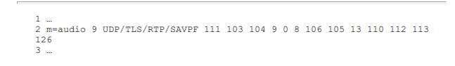

在传输协议方面，传输时底层使用UDP，在UDP上使用TLS协议交换证书；证书交换完成后，媒体数据由RTP（实时传输协议）进行传输保障可靠性；媒体数据的安全性由SRTP负责，即对RTP包中的Body部分进行加密。此外，传输时还使用RTCP的feedback机制对传输信息进行实时反馈（SAVPF），以便进行拥塞控制。

111及之后的数字为fmtlist的值，每一个数字代表一个PlayloadType，不同的PlayloadType表示媒体数据使用了不同的编解码器参数。

**音频媒体信息**

使用大量的“a=rtpmap”对fmtlist中的内容（每个数字）进行进一步的介绍

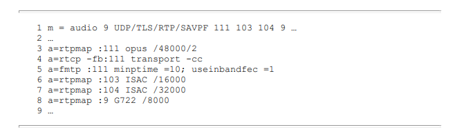

其中，3,6,7,8行解释了PayloadType使用的编解码器以及参数是什么；第5行指定了数据格式，即音频帧最小10ms一帧，使用带内FEC（前向纠错）。

“a=rtpmap”就是一张PayloadType和编解码器的映射表，他的格式为：

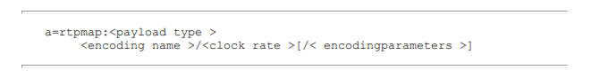

例如，对于第3行，111表明它使用opus编码器，采样率为48000，通道数为2。

“a=fmtp”用于指定媒体数据格式，格式为：

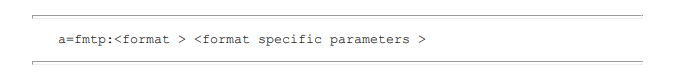

对于第5行，"minptime=10"表明以10ms长的音频数据为1帧，并且这些数据已经经过FEC编码（前面已经声明使用FEC）。“useinbandfec=1”是WebRTC针对Opus增加的fmtp值。

**视频媒体信息**

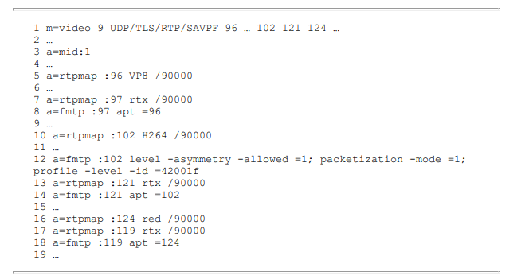

视频信息单独存在一个m行，媒体类型和PayloadType存在一定的差别。

a=mid:1表明视频媒体的编号为1

VP8为默认视频编码器（在第一位），时钟频率为90000

第7行的rtx不是指编码器，而是丢包重传，与第8行一起使用。在第8行的apt的值为96，表明96和97是关联在一起的，PayloadType97是96的补充。所以，第7行的实际意义是：“当WebRTC使用VP8（PayloadType=96）是，如果丢包需要重传”。

第16-18行有一些特殊，其中“red”是一种在WebRTC中使用的FEC算法，用于防止丢包。默认情况下WebRTC会将VP8/H264等编码器编码后的数据交由red模块编码，生成带冗余信息的数据包，如果在传输中某个包丢了，就可以通过其他包将其恢复，而不用重传丢失的包。显然，第16-18行就是执行“red编码后并启动丢包重传”

第12行的“fmtp”行中，“level-asymmetry-allowed=1”指明通信双方使用的H264Level是否要保持一致：0，必须一致；1，可以不一致。“packetization-mode”指明由H264编码后的视频数据如何打包，打包模式有三种：0，单包；1，非交错包；2，交错包。三种打包模式中，0,1用在低延时的实时通信领域。模式0的含义就是每个包就是一帧视频数据；模式1的含义是可以将视频帧拆成多个顺序的RTP包发送，接收端收到数据包后，再按顺序进行还原。“profile-level-id”由三部分组成，每个组成部分各占8位，即1个字节。十六进制下就是2个数。

**SSRC/CNAME**

除了音频/视频媒体信息外，媒体描述中还包括SSRC（Sychronization Source），SSRC是媒体源的唯一标识，每一路媒体流都有唯一一个SSRC来标识它。

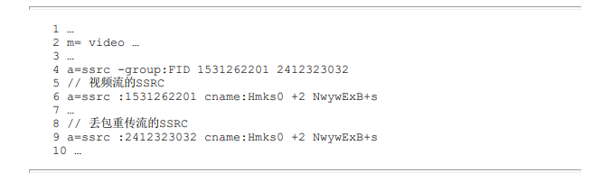

在一个视频流下存在两个SSRC，“ssrc -group”表明两个SSRC之间存在关系，第二个SSRC仅在视频流丢包时使用。

“cname”关键字可以帮助创建别名，如果两个SSRC的别名一致，则表明他们属于同一个媒体流。

#### 安全信息

**WebRTC如何保障数据安全**

存在三个级别，分别是应用级防护，信令级防护以及数据级防护。

应用级防护——用户在使用音视频通信产品时，一般都要先进行注册，然后登录到应用系统上。这一级防护不属于WebRTC的范畴。

信令级防护——用户通过服务器进行媒体协商，在这之中交换用户名/密码信息等，以验证是否为合法用户。

媒体数据加密——通信的双方会使用DTLS协议彼此交换证书，证书中保存的最重要信息就是公钥。

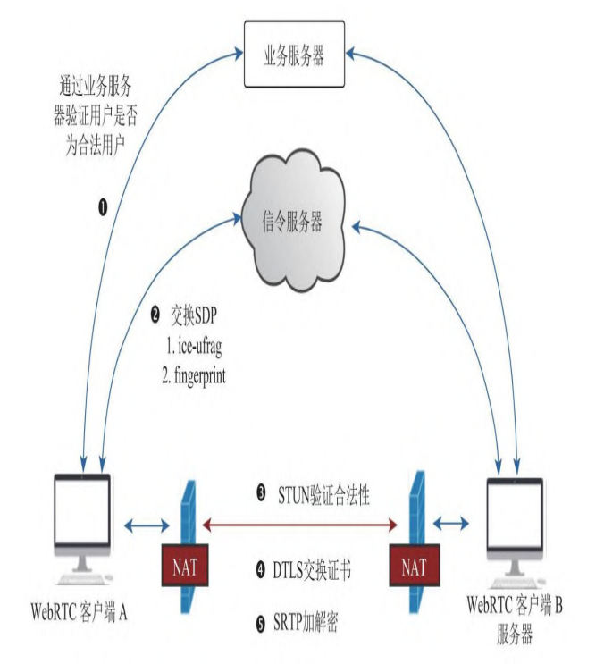

SDP中的安全描述如下：

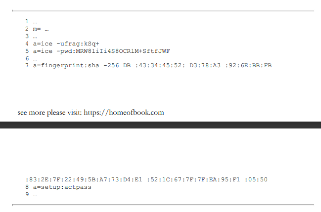

其中，“ice-ufrag”和“ice-pwd”分别代表了用户名和密码，WebRTC终端通信时需要使用这两个值进行用户有效性验证。

"a=setup:..."用于决定使用DTLS协议时通信双方的角色，也可以设置多重角色（例如既是客户端又是服务端）。

"a=fingerprint"属性用于验证加密证书的有效性，加密证书通过这个fingerprint（指纹）来确认是否发生篡改，交换完成后的指纹会重新生成。

#### 服务质量描述

属性“a=rtcp-fb”描述了服务质量。在WebRTC中，rctp\_fb（rtcp feedback）有两层含义：一是指RTCP消息中专门反馈信息的一类消息；二是指SDP中使用的“a=rtcp-fb”属性，该属性用来设置WebRTC终端支持哪些rtcp feedback消息。

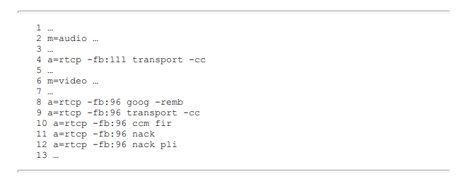

第4行表明PT=111的编码器（Opus）支持Transport-CC这种类型的rtcp feedback消息，Transport-CC和Goog-REMB都是常见的拥塞控制算法，这里支持消息也表明Opus编解码器开启了Transport-CC拥塞控制算法。对第8，9行，就是同时支持两个拥塞控制算法。

新的OTRC有替代SDP的趋势，它通过对象来实现而不是通过媒体协商来实现。

#### PlanB和UnifiedPlan

WebRTC中的SDP包含两种规格，即PlanB和UnifiedPlan，它们的发展顺序如下：标准SDP->PlanB->UnifiedPlan

PlanB和UnifiedPlan的最大区别在于，在PlanB规格中，只有两个媒体描述，即音频媒体描述和视频媒体描述，如果要传输多路视频，则它们在视频媒体描述中需要通过SSRC来区分。而在UnifiedPlan中允许有多个媒体描述。

PlanB规格的描述如下：

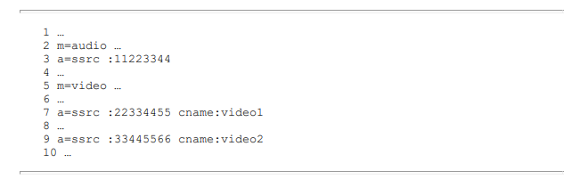

UnifiedPlan规格的描述如下：

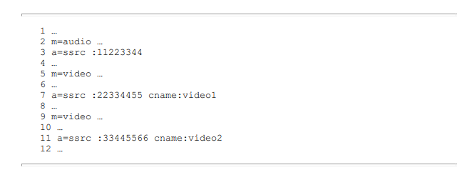

## WebRTC拥塞控制

WebRTC中包含多种拥塞控制算法，有GCC（Google拥塞控制），BBR（瓶颈带宽和往返传播时间）和PCC（基于性能的拥塞控制）。GCC根据它的实现又分为基于发送端的拥塞控制算法Transport-CC和基于接收端的拥塞控制算法Goog-REMB。Transport-CC是基于Goog-REMB改进而来。

### Goog-REMB

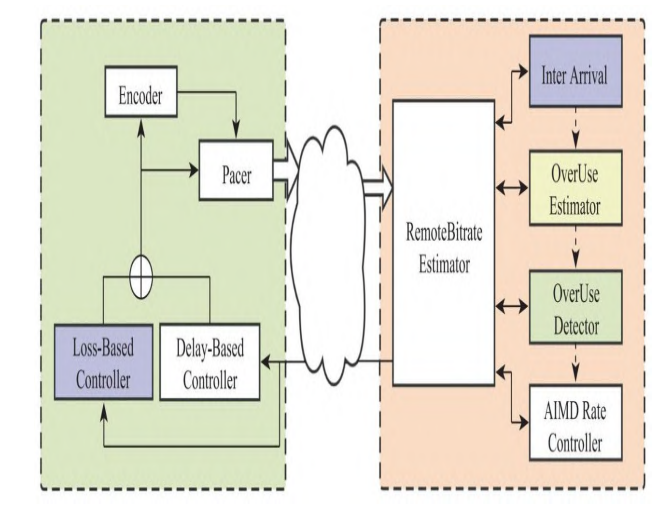

由两个部分组成，左侧为发送端，用来控制码流的发送；右侧为接收端，用来拥塞评估和测算。右侧的拥塞评估由多个模块组成.

RemoteBitrate Estimator模块：接收端延时拥塞控制算法的管理模块，即“总负责人”。它一方面负责从网络收/发模块中获取RTP包的传输信息用于拥塞评估，或将内部评估的下一时刻的发送码流（大小）输出给网络收/发模块，让其通知发送端进行流控；另一方面，它还要组织内部的Inter Arrival、OverUserEstimator等模块，根据当前观测到的延时差和之前的评估值推测出下一时刻的网络拥塞情况。

Inter Arrival模块：它的作用比较简单，首先将数据包按帧进行分组，然后对相邻的两组数据包进行单向梯度计算。计算的内容包括三项：每组数据包的发送时长，每组数据包的接收时长，两组数据包大小之差。

OverUse Estimator模块：它利用Inter Arrival模块的计算结果，通过卡尔曼滤波器估算出下一时刻发送队列的增长趋势。

OverUse Detector模块：用于检测当前网络的拥塞状态。它利用OverUser Estimator模块计算出的队列延时梯度mi值与自适应阈值γi进行比较：如果mi大于γi，表示网络即将发生拥塞，其状态为kBwOverusing，此时应减少发包量；如果mi小于−γi，表示用户发包量不大，目前网络资源充足，其状态为kBwUnderusing，否则表明发包量与带宽是匹配的，其状态为kBwNormal，此时可以尝试增大发包量，抢占更多的带宽。

AIMD Rate Controller模块：该模块用于计算发送码流大小。它通过OverUse Detector模块检测出的当前网络状态来变更自己的状态，并计算出发送码流的大小。码流控制会与其他信息一起被RemoteBitrate Estimator打包成RTCP消息包，最终将计算好的码流反馈给发送端。发送端收到消息后再进行码流控制即可。

总结：

计算相邻两组数据包的发送时长/接受时长/大小之差-->卡尔曼滤波预测下一时刻-->看是否到达阈值，对具体的发包量进行调整-->计算具体发送的码流并由接收端发送信息提醒发送端。

### Transport-CC

与Goog-REMB最大的区别有：1.将拥塞评估算法从接收端移动到了发送端，使得评估和控制合为一体。2.拥塞评估算法由卡尔曼滤波器换成了TrendLine滤波器（又称为最小二乘法滤波器，通过斜率的增大或减小来判断当前网络的拥塞情况）

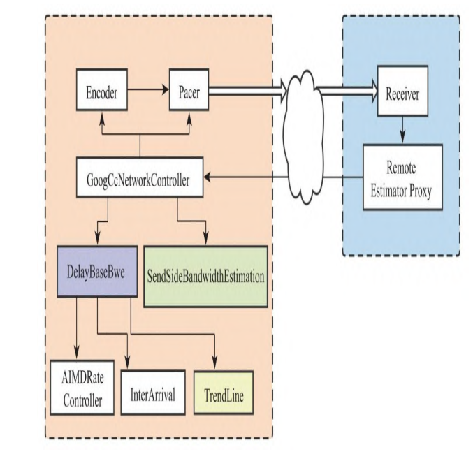

GoogCcNetworkController模块：当收到接收端返回的RTCP包后，它会调用子模块（根据RTCP的内容）评估出下一时刻网络的拥塞状态和码流大小，并将评估出的码流交由Pacer和编码器模块进行码流控制。

SendSideBandwidthEstimation模块：是比较基于接收端延时评估出的码流值、基于发送端延时评估出的码流值以及基于丢包评估出的码流值的大小，从中选择最小的码流值作为最终评估出的码流值。

DelayBaseBwe模块：是发送端的延时拥塞评估模块。其由InterArrival、TrendLine、AIMDRateController等模块组成。其中InterArrival和AIMDRateController模块与接收端延时拥塞评估模块中的逻辑是一样的。

Trendline模块：即Trendline滤波器，又称最小二乘法滤波器。

### 基于丢包的拥塞评估算法

上面介绍的两种基于延时的拥塞评估算法，是通过一段时间内网 络延时的趋势来判断下一时刻网络是否会发生拥塞的算法，这种预判 的方法可以有效地防止网络拥塞的真正发生。而基于丢包的拥塞评估 算法则是当网络真的出现状况（大量丢包）后采用的一种应急手段， 所以基于丢包的拥塞评估算法在控制码流方面要比基于延时的拥塞评估算法严格得多。

不过，基于丢包的拥塞评估算法的实现相对于基于延时的拥塞评估算法的实现要简单得多，其规则为：当丢包率低于2％时，说明目前网络质量很好，可以 增大码率，码率在当前基础上增加8％；如果丢包率在2％∼10％之间， 说明当前网络与发送码率是匹配的，因此当前码率不变；如果丢包率 超过10％，说明网络质量很差，需要降低码率，当前码率下降至（1- 0.5×丢包率）×当前码率。
