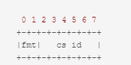
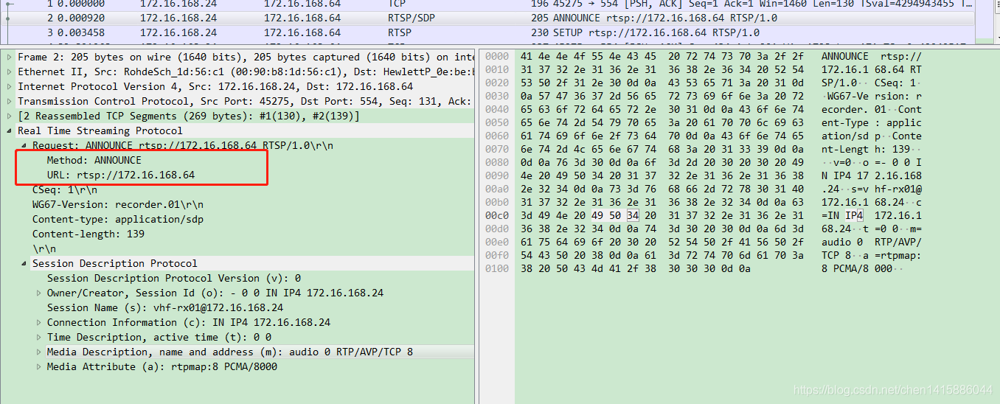

# 音视频编码与协议

## 音视频编码与协议

H264，AAC，MP3等是编码标准，FLV，MP4，HLS等是流媒体封装格式，RTMP，RTSP等是流媒体传输协议。

实际上，编码完成的数据可以直接通过流媒体传输协议直接进行传输，这种方式通常被称为裸流传输（Raw Stream Transport）或裸流（Raw Stream）传输。

流媒体封装主要是为了更加轻松的进行平台适应，多轨道组织，嵌入元数据，错误检测和修复，容纳不同类型的媒体轨道（支持不同的编码格式）等。

### RTMP协议

RTMP协议（实时传输信息协议）是应用层协议，使用TCP来保证信息传输的可靠性的。在基于传输层协议的链接建立完成后，RTMP协议也要客户端和服务器通过“握手”来建立基于传输层链接之上的RTMP Connection链接。

#### RTMP握手

要建立一个有效的RTMP Connection链接，首先要“**握手**”:客户端要向服务器发送C0,C1,C2（按序）三个chunk，服务器向客户端发送S0,S1,S2（按序）三个chunk，然后才能进行有效的信息传输。RTMP协议本身并没有规定这6个Message的具体传输顺序，但RTMP协议的实现者需要保证这几点：

​ 1.客户端要等收到S1之后才能发送C2

​ 2.客户端要等收到S2之后才能发送其他信息（控制信息和真实音视频等数据）

​ 3.服务端要等到收到C0之后发送S1

​ 4.服务端必须等到收到C1之后才能发送S2

​ 5.服务端必须等到收到C2之后才能发送其他信息（控制信息和真实音视频等数据）


只要满足上述条件，如何发送这6个Message都是可以的，不过在实际情况中为了保证减少通信次数，往往是C0+C1-->S0+S1+S2-->C2的顺序

**C0和S0格式**

占用一字节，表示RTMP的版本，一般为3，如果服务器无法识别客户端的版本号，应该回复版本 3,。客户端可以选择降低到版本 3，或者终止握手过程


**C1和S1格式**

包含两部分数据：key（random bytes(cont)）和digest（random bytes）

time：本字段包含一个时间戳，客户端应该使用此字段来标识所有流块的时刻。时间戳取值可以为零或其他任意值。为了同步多个块流，客户端可能希望多个块流使用相同的时间戳

zero：字段必须为0

random（一共1528bytes，分别占764bytes）：本字段可以包含任意数据。由于握手的双方需要区分另一端，此字段填充的数据必须足够随机（以防止与其他握手端混淆）。不过没有必要为此使用加密数据或动态数据。


**C2和S2格式**

C2/S2本质是作为S1/C1（客户端要收到S1后才能发送C2，同理服务端需要收到C1才能发送S2）的回应

time：本字段必须包含对端发送的时间戳

time2：本字段必须包含时间戳，取值为接收对端发送过来的握手包的时刻

random（还是一共1528bytes）：必须包含对端发送过来的随机数据。握手的双方可以使用时间 1 和时间 2 字段来估算 网络连接的带宽和/或延迟，但是不一定有用


```
简单来说，C1和S1是各说各话，都分别需要对应的S2/C2进行回应
```

#### RTMP Chunk Stream

Chunk Stream是对传输RTMP Chunk的流的逻辑上的抽象，客户端和服务器之间有关RTMP的信息都在这个流上通信。

Chunk（块）可以组成为Message，Message是我们需要的内容，而Chunk是拆分后的部分（也要加头部进行标识，类似于TCP分段/IP分块）

通过拆分，数据量较大的Message可以被拆分成较小的“Message”，这样就可以避免优先级低的消息持续发送阻塞优先级高的数据，比如在视频的传输过程中，会包括视频帧，音频帧和RTMP控制信息，如果持续发送音频数据或者控制数据的话可能就会造成视频帧的阻塞，然后就会造成看视频时最烦人的卡顿现象。同时对于数据量较小的Message，可以通过对Chunk Header的字段来压缩信息，从而减少信息的传输量。

Chunk格式如下：

块的基本头（1-3字节）：这个字段包含块流ID和块类型（固定大小，两比特）。块类型决定了编码过的消息头的格式。这个字段是一个变长字段，长度取决于块的流ID

消息头（0,3,7,11字节）：字段包含被发送的消息信息。字段长度由块头中的块类型来决定

扩展时间戳（0,4字节）：是否存在取决于块消息头中编码的时间戳

块数据（可变大小）：当前块的有效数据，上限为配置的最大块大小。（ Chunk的默认大小是128字节，这里的大小仅指这个部分的大小，不包括头部和扩展时间戳。在传输过程中，通过一个叫做Set Chunk Size的控制信息可以设置Chunk数据量的最大值，在发送端和接受端会各自维护一个Chunk Size，可以分别设置这个值来改变自己这一方发送的Chunk的最大大小，类似于TCP的MSS，不过后者是避免进一步分片）

```
大一点的Chunk减少了计算每个chunk的时间从而减少了CPU的占用率，但是它会占用更多的时间在发送上，尤其是在低带宽的网络情况下，很可能会阻塞后面更重要信息的传输。
小一点的Chunk可以减少这种阻塞问题，但小的Chunk会引入过多额外的信息（Chunk中的Header），少量多次的传输也可能会造成发送的间断导致不能充分利用高带宽的优势，因此并不适合在高比特率的流中传输
```


**块的基本头**

Basic Header中的块id被简写为CSID，用来唯一标识一个块。RTMP协议支持用户自定义［3，65599］之间的CSID，Chunk type作为最前端的两位，它的内容一定为0,1,2中的一个。分别表示Basic Header要占用1,2,3字节。2标识符还额外代表该块是控制信息和命令信息。

CSID对应的长度分别为6,14,22；CSID的大小为\[3，63]，\[64，319]，\[64，65599]

type=0时，6位，范围为\[3，63]



type=1时，协议将块类型所在字节的其他bit都置为0，剩下一个字节表示CSID-64，因为8bits可以表示的范围为\[0，255]，因此CSID的范围为\[64,319]


type=2时，同理剩下两个字节表示CSID-64，CSID范围为\[0,65535]


注意，Basic Header采用的是小端存储的方式，越往后的字节数量级越高，因此通过3个字节的每一个bit的值来计算CSID时，应该是: <第三个字节的值> \* 256 + <第二个字节的值> + 64

**消息头**

包含了要发送的实际信息（可能是完整的，也可能是一部分）的描述信息。Message Header的格式和长度取决于Basic Header的chunk type，共有4种不同的格式，由上面所提到的Basic Header中的fmt字段控制。

Type=0：11字节

其他三种能表示的数据它都能表示，但对于chunk stream 的开始第一个chunk和头信息中的时间戳后退的chunk（即值与上一个chunk相比减小，通常在回退播放的时候会出现这种情况）的时候必须采用这种格式

timestamp（时间戳）：占用3个字节，因此它最多能表示到16777215=0xFFFFFF=2\*\*24-1, 当它的值超过这个最大值时，这三个字节都置为1，这样实际的timestamp会转存到Extended Timestamp字段中，接受端在判断timestamp字段24个位都为1时就会去Extended timestamp中解析实际的时间戳

message length（消息数据的长度）：占用3个字节，表示实际发送的消息的数据如音频帧、视频帧等数据的长度，单位是字节。注意这里是Message的长度，也就是chunk属于的Message的总数据长度，而不是chunk本身Data的数据的长度。

message type id(消息的类型id)：占用1个字节，表示实际发送的数据的类型，如8代表音频数据、9代表视频数据。

msg stream id（消息的流id）：占用4个字节，表示该chunk所在的流的ID（CSID是块的标识符），和Basic Header的CSID一样，它采用小端存储的方式


Type=1：7字节

与Type=0的11字节相比，省去了表示message stream id的4个字节，表示此chunk和上一次发的 chunk 所在的流相同，如果在发送端和对端有一个流链接的时候可以尽量采取这种格式。

timestamp（时间戳）：同样占用3 bytes，这里和type=0时不同，存储的是和上一个chunk的时间差。类似上面提到的timestamp，当它的值超过3个字节所能表示的最大值时，三个字节都置为1，实际的时间戳差值就会转存到Extended Timestamp字段中，接收端在判断timestamp delta字段24个bit都为1时就会去Extended Timestamp 中解析实际的与上次时间戳的差值。


Type=2：3字节

type 为 2 时占用 3 个字节，相对于 type = 1 格式又省去了表示消息长度的3个字节和表示消息类型的1个字节，表示此 chunk和上一次发送的 chunk 所在的流、消息的长度和消息的类型都相同。余下的这三个字节表示 timestamp delta，使用同type=1。（即表示的是差值，这是为什么回退需要Type=0，因为差值不能为负数）


Type=3：0字节

表示这个chunk的Message Header和上一个是完全相同的。

当它跟在type=0的chunk后面时，表示和前一个 chunk 的时间戳都是相同；而当它跟在 type = 1或 type = 2 的chunk后面时的chunk后面时，表示和前一个 chunk 的时间戳的差是相同的

**扩展时间戳（Extended Timestamp）**

在时间戳或时间戳差大于3字节时，会用扩展时间戳。当它启用时，timestamp字段或者timestamp delta要全置为1，表示应该去扩展时间戳字段来提取真正的时间戳或者时间戳差。注意扩展时间戳存储的是完整值，而不是减去时间戳或者时间戳差的值

#### 协议控制消息

RTMP的chunk流会用一些特殊的值来代表协议的控制消息，它们的Message Stream ID必须为0（代表控制流信息），CSID必须为2，Message Type ID（消息头中表示消息类型的，8是音频9是视频）可以为1，2，3，5，6。控制消息的接受端会忽略掉chunk中的时间戳，收到后立即生效。

**ID = 1（设置块大小）**

设置chunk中Data字段所能承载的最大字节数，默认为128字节，通信过程中可以通过发送该消息来设置chunk Size的大小（不得小于128字节），而且通信双方会各自维护一个chunkSize，两端的chunkSize是独立的。

当A想向B发送一个200B的Message，但默认的chunkSize是128B，因此就要将该消息拆分为Data分别为128B和72B的两个chunk发送，如果此时先发送一个设置chunkSize为256B的消息，再发送Data为200B的chunk，本地不再划分Message，B接受到Set Chunk Size的协议控制消息时会调整的接受的chunk的Data的大小，也不用再将两个chunk组成为一个Message

在这种情况下的chunk Data部分如下：

​ 

其中第一位必须为0，chunk Size占31个位，最大可代表2147483647＝0x7FFFFFFF＝231-1，但实际上所有大于16777215=0xFFFFFF的值都用不上，因为chunk size不能大于Message的长度，表示Message的长度字段是用3个字节表示的，最大只能为0xFFFFFF

**ID = 2（中断）**

当一个Message被切分为多个chunk，接受端只接收到了部分chunk时，发送该控制消息表示发送端不再传输同Message的chunk，接受端接收到这个消息后要丢弃这些不完整的chunk。Data数据中只需要一个CSID，表示丢弃该CSID的所有已接收到的chunk。


块流ID（32比特）：本字段包含了块流ID，用来标识哪个块流ID的消息将被丢弃

**ID = 3（应答）**

客户端和服务器在接收到与接收窗口大小相等的数据后，必须发送应答消息给对方。窗口大小的定义为发送方在接收到接收方的任何应答前，可以发送的最大数据量。本消息包含了序列号，序列号为截至目前接收到的数据总和，以字节为单位。


序列号（32比特）：本字段包含了截止目前接收到的数据总和，以字节为单位

**ID = 5（应答窗口大小）**

客户端和服务器发送这个消息来通知对方应答窗口的大小。发送方在发送了等于窗口大小的数据之后，等待接收对方的应答消息（在接收到应答之前停止发送数据）。接收方必须发送应答消息，在会话开始时，或从上一次发送应答之后接收到了等于窗口大小的数据


窗口大小（32比特）

**ID = 6（设置流带宽）**

客户端和服务器发送此消息来说明对方的出口带宽限制。接收方以此来限制自己的出口带宽，即限制未被应答的消息数据大小。接收到此消息的一方，如果窗口大小与上次发送的不一致，应该回复应答窗口大小的消息。

限制类型的取值为下面的之一：

​ 1.硬限制（0）：应该限制出口带宽为指明的窗口大小。

​ 2.软限制（1）：应该限制出口带宽为指明的窗口大小，或已经生效的小一点的窗口大小。

​ 3.动态限制（2）：如果上一次为硬限制，此消息被视为硬限制，否则忽略此消息。


#### 其他类型的RTMP Message

**Command Message（命令消息）**

Message ID为17或20

表示在客户端盒服务器间传递的在对端执行某些操作的命令消息，如connect表示连接对端，对端如果同意连接的话会记录发送端信息并返回连接成功消息，publish表示开始向对方推流，接受端接到命令后准备好接受对端发送的流信息，后面会对比较常见的Command Message具体介绍。当信息使用AMF0编码时，Message Type ID＝20，AMF3编码时Message Type ID＝17

可以认为发送命令消息的对象（也是实际编程的类对象）有两种，一种是NetConnection，表示双端的上层连接，一种是NetStream，表示流信息的传输通道，控制流信息的状态，如Play播放流，Pause暂停。

**命令消息中的网络连接**

网络连接管理着客户端和服务器之间的双向连接。另外，它也支持异步远程命令调用。

网络连接允许以下命令：

​ 1.连接 connect：客户端发送连接命令给服务器，来获取一个和服务器通信的实例，消息的内容（包含在chunk data下）如下：


​ 2.调用 call：会在接收端执行远程过程调用（RPC）。被调用的 RPC 方法名作为 call 方法的参数传输。

​ 发送段发送的内容如下：


​ 如果事务ID不为0需要对端响应时，对端发送的内容如下：

​ 

​ 3.创建流 create stream：客户端通过发送此消息给服务器来创建一个用于消息交互的逻辑通道。

​ 音频，视频，和元数据都是通过 createStream 命令创建的流通道发布出去的。


**命令消息中的网络流命令（都是客户端发给服务器的）**

​ 网络流定义了通过网络连接把音频，视频和数据消息流在客户端和服务器之间进行交换的通道。一个网络连接对象可以有多个网络流，进而支持多个数据流。

​ 服务端收到命令后会通过onStatus的命令来响应客户端，表示当前NetStream的状态，onStatus命令的消息结构如下：

|     字段     |   类型   | 说明                                                                                                                                                                                                                      |
| :--------: | :----: | ----------------------------------------------------------------------------------------------------------------------------------------------------------------------------------------------------------------------- |
|     命令名    | String | “onStatus”                                                                                                                                                                                                              |
|    事务ID    | Number | 恒为0                                                                                                                                                                                                                     |
|   命令参数对象   |  NULL  | 不需要此字段，设为空                                                                                                                                                                                                              |
| infoObject | Object | AMF类型的Object，至少包含以下三个属性：1，“level”，String类型，可以为“warning”、"status"、"error"中的一种；2，"code",String类型，代表具体状态的关键字,比如"NetStream.Play.Start"表示开始播流；3，"description"，String类型，代表对当前状态的描述，提供对当前状态可读性更好的解释，除了这三种必要信息，用户还可以自己增加自定义的键值对 |

​ 客户端可以通过网络流发送到服务器的命令如下：

​ 1.播放 play：由客户端向服务器发起请求从服务器端接受数据（如果传输的信息是视频的话就是请求开始播流），可以多次调用，这样本地就会形成一组数据流的接收者。注意其中有一个reset字段，表示是覆盖之前的播流（设为true）还是重新开始一路播放（设为false）

|   字段   |    类型   | 说明                                                                                                                                                                                                    |
| :----: | :-----: | ----------------------------------------------------------------------------------------------------------------------------------------------------------------------------------------------------- |
|   命令名  |  String | “play”                                                                                                                                                                                                |
|  事务ID  |  Number | 恒为0                                                                                                                                                                                                   |
| 命令参数对象 |   NULL  | 不需要此字段，设为空                                                                                                                                                                                            |
|   流名称  |  String | 要播放的流的名称                                                                                                                                                                                              |
|  开始位置  |  Number | 可选参数，表示从何时开始播流，以秒为单位。默认为－2，代表选取对应该流名称的直播流，即当前正在推送的流开始播放，如果对应该名称的直播流不存在，就选取该名称的流的录播版本，如果这也没有，当前播流端要等待直到对端开始该名称的流的直播。如果传值－1，那么只会选取直播流进行播放，即使有录播流也不会播放；如果传值或者正数，就代表从该流的该时间点开始播放，如果流不存在的话就会自动播放播放列表中的下一个流 |
|   周期   |  Number | 可选参数，表示回退的最小间隔单位，以秒为单位计数。默认值为－1，代表直到直播流不再可用或者录播流停止后才能回退播放；如果传值为0，代表从当前帧开始播放                                                                                                                           |
|   重置   | Boolean | 可选参数，true代表清除之前的流，重新开始一路播放，false代表保留原来的流，向本地的播放列表中再添加一条播放流                                                                                                                                            |

​ 命令执行过程的消息体如下：

​ 1.当客户端接收到服务器返回的 createStream 成功的消息时，开始发送播放命令

​ 2.服务器接收到播放命令后，发送设置块大小的消息

​ 3.服务器发送了一条用户控制消息消息内包含了 StreamlsRecorded 事件和流ID。事件类型位于消息的前 2 个字节，流ID位于消息的后四个字节

​ 4.服务器发送一条用户控制消息，消息内包含了 StreamBegin 事件，用于通知客户端开始播放流

​ 5.如果客户端已经成功发送了播放命令，那么服务器发送两条 onStatus 命令给客户端，命令的内容为 NetStream.Play.Start和和 NetStream.Play.Reset。服务器只有在客户端发送了设置有重置标签的播放命令后，才能发送 NetStream.Play.Reset命令。如果服务器找不到客户端请求播放的流，那么发送NetStream.Play.StreamNotFound 命令给客户端。

​ 6.之后，服务器发送音频和视频数据给客户端

​ 2.播放 paly2：和上面的play命令不同的是，play2命令可以将当前正在播放的流切换到同样数据但不同比特率的流上，服务器端会维护多种比特率的文件来供客户端使用play2命令来切换

|   字段   |   类型   | 说明                                                                           |
| :----: | :----: | ---------------------------------------------------------------------------- |
|   命令名  | String | “play2”                                                                      |
|  事务ID  | Number | 恒为0                                                                          |
| 命令参数对象 |  NULL  | 不需要此字段，设为空                                                                   |
|   参数   | Object | AMF编码的Flash对象，包括了一些用于描述flash.net.NetstreamPlayOptions ActionScript obejct的参数 |

​ 3.删除流 deleteStream：用于客户端告知服务器端本地的某个流对象已被删除，不需要再传输此路流

|   字段   |   类型   | 说明                        |
| :----: | :----: | ------------------------- |
|   命令名  | String | “deleteStream”            |
|  事务ID  | Number | 恒为0                       |
| 命令参数对象 |  NULL  | 不需要此字段，设为空                |
|   流ID  | Number | 内容为“本地已删除，不再需要服务器传输的流的ID” |

​ 4.接收音频 receiveAudio：通知服务器端该客户端是否要发送音频（注意是客户端发送）

|    字段   |    类型   | 说明                                                                                                                              |
| :-----: | :-----: | ------------------------------------------------------------------------------------------------------------------------------- |
|   命令名   |  String | “receiveAudio”                                                                                                                  |
|   事务ID  |  Number | 恒为0                                                                                                                             |
|  命令参数对象 |   NULL  | 不需要此字段，设为空                                                                                                                      |
| Bool标志位 | Boolean | true表示发送音频，如果该值为false，服务器端不做响应，如果为true的话，服务器端就会准备接受音频数据，会向客户端回复NetStream.Seek.Notify和NetStream.Play.Start的Onstatus命令告知客户端当前流的状态 |

​ 5.接收视频 receiveVideo：通知服务器端该客户端是否要发送视频

​ 和接受音频基本一致，命令名为“receiveVideo”，Bool标志位为true时服务端会准备接收视频数据

​ 6.推送数据 publish：由客户端向服务器发起请求推流到服务器

|   字段   |   类型   | 说明                                                                                                                                                                                         |
| :----: | :----: | ------------------------------------------------------------------------------------------------------------------------------------------------------------------------------------------ |
|   命令名  | String | “publish”                                                                                                                                                                                  |
|  事务ID  | Number | 恒为0                                                                                                                                                                                        |
| 命令参数对象 |  NULL  | 不需要此字段，设为空                                                                                                                                                                                 |
|  推流名称  | String | 流名称                                                                                                                                                                                        |
|  推流类型  | String | "live"、"record"、"append"中的一种。live表示该推流文件不会在服务器端存储；record表示该推流的文件会在服务器应用程序下的子目录下保存以便后续播放，如果文件已经存在的话删除原来所有的内容重新写入；append也会将推流数据保存在服务器端，如果文件不存在的话就会建立一个新文件写入，如果对应该流的文件已经存在的话保存原来的数据，在文件末尾接着写入 |

​ 7.定位流的位置 seek：定位到视频或音频的某个位置，以毫秒为单位

|   字段   |   类型   | 说明           |
| :----: | :----: | ------------ |
|   命令名  | String | “seek”       |
|  事务ID  | Number | 恒为0          |
| 命令参数对象 |  NULL  | 不需要此字段，设为空   |
|   毫秒   | Number | 定位到该文件的xx毫秒处 |

​ 8.暂停 pause：客户端告知服务端停止或恢复播放

|   字段   |    类型   | 说明                 |
| :----: | :-----: | ------------------ |
|   命令名  |  String | “publish”          |
|  事务ID  |  Number | 恒为0                |
| 命令参数对象 |   NULL  | 不需要此字段，设为空         |
|  暂停标志  | Boolean | true表示暂停，false表示恢复 |
|   毫秒   |  Number | 暂停或者恢复的时间，以毫秒为单位   |

**Data Message（数据消息）**

Message ID为15或18，传递一些元数据（MetaData，比如视频名，分辨率等等）或者用户自定义的一些消息。当信息使用AMF0编码时，Message Type ID＝18，AMF3编码时Message Type ID＝15。

**Shared Object Message（共享消息）**

Message Type ID＝16或19，表示一个Flash类型的对象，由键值对的集合组成，用于多客户端，多实例时使用。当信息使用AMF0编码时，Message Type ID＝19，AMF3编码时Message Type ID＝16。

**Aggregate Message（聚集信息）**

Message Type ID＝22，表示多个RTMP子消息的集合。

**User Control Message Events（用户控制消息）**

Message Type ID=4，告知对方执行该信息中包含的用户控制事件，比如Stream Begin事件告知对方流信息开始传输。和前面提到的协议控制信息（Protocol Control Message）不同，这是在RTMP协议层的，而不是在RTMP chunk流协议层的。

该信息在chunk流中发送时，Message Stream ID=0（消息头内标识消息流ID）,Chunk Stream ID=2（CSID，在块的基本头中，标识块的ID）,Message Type Id=4（消息头内，表示消息类型的）

### RTSP协议

RTSP（实时流传输协议），是TCP/IP协议体系中的一个应用层协议。该协议定义了一对多应用程序如何有效地通过IP网络传送多媒体数据。RTSP在体系结构上位于RTP和RTCP之上，使用TCP或UDP完成数据传输。

RTSP对流媒体提供诸如暂停、快进等控制，而它本身并不传输数据。RTSP的作用相当于流媒体服务器的远程控制。它的语法和运作跟HTTP1.1类似，但并不特别强调时间同步，所以比较能容忍网络延迟。


#### RTSP和HTTP的区别与联系

* \*\*联系：\*\*两者都用纯文本来发送消息，且RTSP协议语法也和HTTP类似。RTSP一开始这样设计，也是为了能够兼容使用以前写的HTTP协议分析代码。
* \*\*区别：\*\*RTSP有状态，RTSP的命令需要知道现在处于一个什么状态，也就是说RTSP的命令总是按照顺序来发送的，某个命令总在另外一个命令之前发送。RTSP不管处于什么状态都不会断掉连接。而HTTP则不保存状态，协议在发送一个命令以后，连接就会断开（特指1.0版本），且命令之间没有依赖性，RTSP协议使用544端口，HTTP协议使用80端口。

#### RTSP和RTP（RTCP）的联系

* RTP：Realtime Transport Protocol实时传输协议。RTP提供时间标志，序列号以及其他能够保证在实时数据传输时处理时间的方法。
* RTCP：Realtime Transport Control Protocol 实时传输控制协议。RCTP是RTP的控制部分，用来保证服务质量和成员管理。RTP和RTCP是一起使用的。
* RTSP：Realtime Streaming Protocol 实时流传输协议。RTSP具体数据传输交割RTP，提供对流的控制。

#### RTSP消息

RTSP的消息有两大类，一是请求消息(request)，一是回应消息(response)，两种消息的格式不同。

**RTSP请求消息格式**

```c++
方法 URI RTSP版本 CR LF
消息头 CR LF CR LF
消息体 CR LF
```

其中 CR LF就是“\r\n”，表示回车和换行，注意消息头有两个

方法包括：OPTIONS、SETUP、PLAY、TEARDOWN、DESCRIBE。

URI是接收方（服务器端）的地址，例如：rtsp://192.168.6.136:5000/v0

具体的方法介绍：

​ 1.SETUP——指定如何传输单个媒体流，必须在发送PLAY请求前完成此操作，该请求包含媒体流 URL 和传输说明符（消息体中包含Transport关键字）。该说明符通常包括一对本地端口（client\_port），一个用于接收 RTP 数据（音频或视频），另一个用于 RTCP 数据（元信息）。服务器答复通常会确认选定的参数，并填写缺少的部分，例如服务器的选定端口。必须先使用 SETUP 配置每个媒体流，然后才能发送聚合播放请求。


​ 2.PLAY——播放一个或所有媒体流。可以通过发送多个 PLAY 请求来堆叠播放请求。该 URL 可以是聚合 URL（以播放所有媒体流），也可以是单个媒体流 URL（仅播放该流）。可以指定范围。如果未指定范围，则从头开始播放并播放到结尾，或者，如果流已暂停，则在暂停点恢复播放。


​ 3.PAUSE——暂时中止一个或所有媒体流，因此稍后可以通过 PLAY 请求将其恢复。该请求包含聚合或媒体流 URL。PAUSE 请求上的 range 参数指定何时暂停。如果省略 range 参数，则暂停将立即无限期地发生。


​ 4.RECORD——记录一系列媒体数据。时间戳反映开始时间和结束时间（UTC）。如果没有给出时间范围就会使用媒体对象提供的开始时间或结束时间，如果已经连接就会立即开始录制。服务器决定是否将记录的数据存储在请求 URl 或其他 URI 下。如果服务器未使用请求 URI，则响应应为 201，并包含描述请求状态并引用新资源的实体和位置标头。


​ 5.ANNOUNCE——将请求 URL 标识的演示或媒体对象的描述发布到服务器。ANNOUNCE 会实时更新会话描述。如果将新的媒体流添加到演示文稿中（例如，在现场演示文稿中），则应再次发送整个演示文稿说明，而不仅仅是其他组件，以便可以删除这些组件。



​ 6.TEARDOWN——用于终止会话。它停止所有媒体流并释放服务器上所有与会话相关的数据。


​ 7.GET\_PARAMETER——请求检索 URI 中指定的表示形式或流的参数值。答复和响应的内容留给实现。


​ 8.SET\_PARAMETRY——URI 指定的表示或流设置参数值


​ 9.DESCRIBE——向服务端发起该请求，为了得到会话描述信息（SDP）

​ 10.OPTION——得到服务器提供的可用方法

**RTSP回应消息格式**

```c++
RTSP版本 状态码 解释 CR LF
消息头 CR LF CR LF
消息体 CR LF
```

#### RTSP交互流程

C表示客户端，S表示服务端


#### SDP

SDP描述由许多文本行组成，文本行的格式为<类型>=<值>，<类型>是一个字母，<值>是结构化的文本串，其格式依<类型>而定。

＜type＞=\[CRLF]

```
(协议版本)v=<version>
(所有者/创建者和会话标识符)o=<username> <session id> <version> <network type> <address type> <address>
(会话名称)s=<session name>
(会话信息)i=<session description>
(URI描述)u=<URI>
(Email地址)e=<email address>
(电话号码)p=<phone number>
(连接消息)c=<network type> <address type> <connection address>
(带宽信息)b=<modifier>:<bandwidth-value>
(时间区域)t=<start time> <stop time>
r=<repeat interval> <active duration> <list of offsets from start-time>
z=<adjustment time> <offset> <adjustment time> <offset> ....
(加密秘钥)k=<method>
k=<method>:<encryption key>
(会话属性)a=<attribute>
a=<attribute>:<value>
m=<media> <port> <transport> <fmt list>
```

### RTP/RTCP协议

RTSP需要和RTP/RTCP一起使用，这也是RTSP流控分离的思想

其中RTSP控制状态，RTP发送数据，RTCP控制质量

RTP：该协议提供的信息包括：时间戳（用于同步）、序列号（用于丢包和重排序检测）、以及负载格式（用于说明数据的编码格式）

RTCP：用于QoS反馈和同步媒体流。相对于RTP来说，RTCP所占的带宽非常小，通常只有5%

#### RTP如何解决时延问题

RTP协议是一种基于UDP的传输协议（也可以在TCP之上），RTP本身并不能为按顺序传送数据包提供可靠的传送机制，也不提供流量控制或拥塞控制，它依靠RTCP提供这些服务。

这样，对于那些丢失的数据包，不存在由于超时检测而带来的延时，同时，对于那些丢弃的包，也可以由上层根据其重要性来选择性的重传。比如，对于I帧、P帧、B帧数据，由于其重要性依次降低，故在网络状况不好的情况下，可以考虑在B帧丢失甚至P帧丢失的情况下不进行重传，这样，在客户端方面，虽然可能会有短暂的不清晰画面，但却保证了实时性的体验和要求。

注意，RTP在OSI模型上属于传输层，并且建立在UDP之上。不过从应用开发者的角度上来看，RTP 应当是应用层的一部分。在应用的发送端，开发者必须编写用 RTP 封装分组的程序代码，然后把 RTP 分组交给 UDP 插口接口。在接收端，RTP 分组通过 UDP 插口接口进入应用层后，还要利用开发者编写的程序代码从 RTP 分组中把应用数据块提取出来。

#### RTP分组

**RTP头部**


版本号（V）：用来标志使用的RTP版本，占2位，当前协议版本号为2

填充位（P）：填充标志，占1位，如果P=1，则该RTP包的尾部就包含附加的填充字节，在该报文的尾部填充一个或多个额外的8位组，它们不是有效载荷的一部分。（这是为了让其达到一个特定边界，注意可以填充多个8位组）

扩展位（X）：扩展标志，占1位，如果X=1，则在RTP固定头部后面就跟有一个扩展头部

CSRC计数器（参与源数，CC）：指示固定头部后面跟着的CSRC 标识符的个数，也就是参与到当前RTP数据包中的源的个数。后面的CSRC标识符用于标识哪些参与者（源）贡献了数据，特别是在混音或混合的情况下。

标记位（M）：标记，占1位，该位的解释由配置文档（Profile）来承担，不同的有效载荷有不同的含义，一般而言，对于视频，标记一帧的结束；对于音频，标记会话的开始。

载荷类型（PayloadType）： 有效荷载类型，占7位，用于说明RTP报文中有效载荷的类型，如GSM音频、JPEM图像等,在流媒体中大部分是用来区分音频流和视频流的，这样便于客户端进行解析。

序列号（SN）：占16位，用于标识发送者所发送的RTP报文的序列号，每发送一个报文，序列号增1。接收端可以据此检测丢包和重建包序列，当下层的承载协议用UDP的时候，网络状况不好的时候可以用来检查丢包，同时出现网络抖动的情况可以用来对数据进行重新排序，序列号的初始值是随机的，同时音频包和视频包的sequence是分别记数的。（作用等于TCP的序列号）

时间戳(Timestamp): 占32位，记录了该包中数据的第一个字节的采样时刻。在一次会话开始时，时间戳初始化成一个初始值。即使在没有信号发送时，时间戳的数值也要随时间而不断地增加（时间在流逝嘛）。时钟频率依赖于负载数据格式，并在描述文件（profile）中进行描述。一般而言，必须使用90 kHz 时钟频率。接收者使用时戳来计算延迟和延迟抖动，并进行同步控制。

同步源标识符(SSRC)：占32位，用于标识同步信源，同步源就是指RTP包流的来源。在同一个RTP会话中不能有两个相同的SSRC值。该标识符是随机选取的，RFC1889推荐了MD5随机算法。

贡献源列表（CSRC List）：可以有0～15个，每个CSRC标识符占32位，用来标志对一个RTP混合器产生的新包有贡献的所有RTP包的源。由混合器将这些有贡献的SSRC标识符插入表中。SSRC标识符都被列出来，以便接收端能正确指出交谈双方的身份。

注意，上述包头是RTP基于UDP的包头，tp基于tcp的包头比基于udp的包头多了4个字节：

* magic固定为0x24
* channel用来区分音视频等多路流媒体的通道，其中偶数通道为流媒体内容，奇数通道为RTCP
* n表示数据包的长度减去开始的4个字节，即len字段之后的数据长度

**RTP基于TCP的优势**

* UDP协议上的RTSP/RTP需要打开许多UDP端口,一个端口用于RTSP通信，n个端口用于RTP，n个端口用于RTCP
* 中间网络路由器很容易就过滤或者忽略掉UDP数据包
* UDP是不可靠传输协议，媒体包在因特网上传输时会面临着丢包

**RTP扩展头部**


若 RTP 固定头中的扩展比特位置1（注意：如果有CSRC列表，则在CSRC列表之后），则一个长度可变的头扩展部分被加到 RTP 固定头之后。头扩展包含 16 比特的长度域（length位2字节），指示扩展项（header extension）中 32 比特字的个数，这不包括length+defined部分的扩展部分的头部（4字节）

RTP 固定头之后只允许有一个头扩展（指的是开始的四字节）。为允许多个互操作实现独立生成不同的头扩展，或某种特定实现有多种不同的头扩展,扩展项的前 16 比特用以识别标识符或参数。这 16 比特的格式由具体实现的上层协议定义。基本的 RTP 说明并不定义任何头扩展本身。

#### RTCP的封装

RTCP的主要功能是：服务质量的监视与反馈、媒体间的同步，以及多播组中成员的标识。在RTP会话期 间，各参与者周期性地传送RTCP包。RTCP包中含有已发送的数据包的数量、丢失的数据包的数量等统计资料，因此，各参与者可以利用这些信息动态地改变传输速率，甚至改变有效载荷类型。RTP和RTCP配合使用，它们能以有效的反馈和最小的开销使传输效率最佳化，因而特别适合传送网上的实时数据。

RTCP也是用UDP来传送的，但RTCP封装的仅仅是一些控制信息，因而分组很短，所以可以将多个RTCP分组封装在一个UDP包中。RTCP有如下五种分组类型。

|  类型 |              缩写表示              |   用途  |
| :-: | :----------------------------: | :---: |
| 200 |        SR（Sender Report）       | 发送端报告 |
| 201 |       RR（Receiver Report）      | 接收端报告 |
| 202 | SDES（Source Description items） |  源点描述 |
| 203 |               BYE              |  结束传输 |
| 204 |               APP              |  特定应用 |

#### RTP与RTCP的通信过程


当应用程序建立一个RTP会话时，应用程序将确定一对目的传输地址。目的传输地址由一个网络地址和一对端口组成，有两个端口：一个给RTP包，一个给RTCP包，使得RTP/RTCP数据能够正确发送。RTP数据发向偶数的UDP端口，而对应的控制信号RTCP数据发向相邻的奇数UDP端口（偶数的UDP端口＋1），这样就构成一个UDP端口对。 RTP的发送过程如下，接收过程则相反。

​ 1.RTP协议从上层接收流媒体信息码流（如H.263），封装成RTP数据包；RTCP从上层接收控制信息（不是RTSP），封装成RTCP控制包。

​ 2.RTP将RTP 数据包发往UDP端口对中偶数端口；RTCP将RTCP控制包发往UDP端口对中的接收端口。

RTSP的请求和响应通过一个独立的控制通道传输

#### H264码流封装RTP

H264编码后的码流又NAL（网络抽象层）和VCL（视频编码层）构成。VCL数据传输或者存储之前，会被映射到一个NALU中，H264数据包含一个个的NALU，H.264的编码帧序列包括一系列的NAL单元，每个NAL单元包含一个RBSP，单元的信息头定义了RBSP单元的类型，NAL单元其余部分为RBSP数据，RTP封装方式，主要针对NALU头进行处理。


NALU头前通常包含一个 StartCode，StartCode 必须是 0x00000001 或者 0x000001，紧接着就是一个字节的nalu header，nalu header格式如下：


由于H264帧大小差别较大，较小的帧小于MTU，则可单包直接发送，或者多帧组合发送，较大的帧大于MTU需要分片发送，RTP发送H264模式主要有三种：单一NALU模式、组合帧封装模式、分片封装模式

**单一NALU模式**

此模式一个RTP包包含一个完整的视频帧，RTP头部之后的一个字节为 NALU Header，之后是NALU数据部分，此视频帧大小需要小于MTU，可以单帧通过网络发送。其RTP封装格式如下：


以SPS为例，SPS一般小于MTU，可采用单NALU封装模式。本质上就是RTP头后直接附加去除起始标识的NALU数据。

**组合帧封装模式**

此模式是针对多个较小的帧，采用组合成一个RTP包发送的方式，此种方式在H264视频传输中较少使用，一般较小的帧都是通过单一NALU模式发送。


上述图片以STAP-A组合类型为例，组合发送SPS和PPS

**分片封装模式**

如果视频帧大小超过MTU，则RTP封装需要分片封装，H264较常用的分片模式位FU-A，其格式大致如下：


RTP头部之后的第一个字节为 FU indicator，第二个字节为 FU header

FU indicator如下：


F（禁止），NRI（重要性指示）和Type（NALU类型）都是原来NALU的内容相同

FU header如下：


S：start标记位，当为1时表示NALU分片的起始分片

E：end标记位，当为1时表示NALU分片的最后一个分片

R：保留位

Type：NALU头里的Type类型，等于帧类型

这两个字节之后跟的是NALU的数据，去掉起始位及NALU header之后的数据，按照分片大小进行分包，同一个帧的分片的头两个字节除了起始和结束FU header中的S和E位不同，其他分片这两个自己都一样，这里起始分片要注意去掉H264起始字符和nalu header，通过FU indicator的F/NRI以及FU header即可组合成NALU header，RTP解封装的时候注意生成NALU头及起始标识。

一般H264进行RTP封装，SPS/PPS采用单一NALU封装方式，I帧/P帧采用FU-A分片模式，如果带有SEI及AUD可过滤掉，也可以采用单一NALU封装方式

### SRTP

安全传输协议（Secure Real-time Transport），即安全的 RTP/RTCP 协议

SRTP要解决的问题：

​ 1.对 RTP/RTCP 的负载 (payload) 进行加密，保证数据安全

​ 2.保证 RTP/RTCP 包的完整性，同时防止重放攻击（恶意参与者多次复制并重新传输（“重放”）同一数据包，以试图提取有关用于保护数据包的密码的信息）

#### SRTP结构


加密部分Encrypted Portion，由payload, RTP padding 和 RTP pad count 部分组成。也就是我们通常所说的仅对 RTP 负载数据加密

需要校验部分 Authenticated Portion，由 RTP Header, RTP Header extension 和 Encrypted Portion 部分组成

通常情况下只需要对 RTP 负载数据进行加密，如果需要对 RTP header extension 进行加密也是可以的，在libsrtp中也完成了实现

#### SRTCP结构


加密部分 Encrypted Portion，为 RTCP Header 之后的部分，对 Compound RTCP 也是同样

E-flag 显式给出了 RTCP 包是否加密

SRTCP index 显示给出了 RTCP 包的序列号，用来防重放攻击

待校验部分 Authenticated Portion，由 RTCP Header 和 Encrypted Portion 部分组成

#### 数据流加密/身份验证

SRTP和SRTCP默认使用AES作为加密算法。定义了两种密码模式（分段整数计数器模式，f8模式），使用AES分组密码作为流密码

加密算法本身不能确保消息完整性，攻击者将无法解密数据，但可能能够伪造或重放先前传输的数据。因此，SRTP标准还提供了确保数据完整性和防止重放的手段。

为了验证消息并保护其完整性，使用HMAC-SHA1算法。这会产生一个160位的结果，然后被截断为80位或32位，成为附加到每个数据包的身份验证标签。HMAC是在数据包有效载荷以及数据包头部的材料上计算的，包括数据包序列号。为了防止重放攻击，接收方维护了先前接收的消息的序列号，并将它们与每个新接收消息中的序列号（SRTCP index）进行比较，只有在先前未接收过该消息时才接受新消息。这种方法依赖于完整性保护，以使修改序列号而不被检测变得不可能。

### HLS

HLS（HTTP live Streaming）协议，是2009年由苹果公司实现的基于HTTP的流媒体传输协议，可实现流媒体的直播和点播。他的工作原理是把整个流分成一个个小的基于HTTP的文件来下载，每次只下载一些。

HLS协议规定：

​ 1.视频的封装格式是TS，后来也支持了MP4

​ 2.视频的编码格式为H264、H265、VP9(17年支持H265、VP9)，音频编码格式为MP3、AAC或者AC-3

​ 3.除了TS视频文件本身，还定义了用来控制播放的m3u8文件(文本文件)

HLS协议由三部分组成：

​ 1.HTTP：传输协议

​ 2.m3u8：索引文件(本质是采用了 UTF-8 编码的 m3u 文件。)

​ 3.TS：音视频媒体信息

HLS点播，其实就是分段HTTP点播，他的分段特别小，在服务器端将直播数据流存储为连续的、很短时长的媒体文件（MPEG-TS格式），而客户端则不断的下载并播放这些小文件。因为服务器端总是会将最新的直播数据生成新的小文件，这样客户端只要不停的按顺序播放从服务器获取到的文件，就实现了直播。

相对于常见的流媒体直播协议，例如RTMP协议、RTSP协议、MMS协议等，HLS直播最大的不同在于，直播客户端获取到的，并不是一个完整的数据流。从本质上来说，HLS是以点播的技术方式来实现直播。

HLS的特点：

​ 1.数据通过HTTP协议传输，所以完全不用考虑防火墙或者代理的问题

​ 2.因为分段文件的时长很短，客户端可以很快的选择和切换码率，以适应不同带宽条件下的播放。不过他的延迟一般总是会高于普通的流媒体直播协议。

​ 3.因为使用的是标准的HTTP接口传输数据（80端口），因此不会遇到被防火墙屏蔽的情况。而RTMP等协议不使用标准的HTTP接口传输数据(TCP、UDP端口)，在一些特殊网络环境下会被直接屏蔽。

#### HLS架构

HLS的架构分为三部分：Server，CDN，Client 。即服务器、分发组件和客户端。


视频传递到server的协议和格式可以任意。在server服务器中，视频被转换成HLS格式的视频（包括TS+m3u8文件）文件。Distribution其实只是一个普通的HTTP文件服务器，然后客户端只需要访问一级index文件（后面会具体讲）的路径就会自动播放HLS视频流了。

#### TS

全称为MPEG2-TS（Transport Stream），它的特点就是要求从视频流的任一片段开始都是可以独立解码的，主要用于实时广播的电视节目。

这种独立解码的特点，也是与MPEG2-PS（Program Stream）最大的差别。MPEG2-PS常用于DVD电影等，如果其中数据损坏则一定无法解码。

在开始一个流媒体会话时，客户端会下载一个包含元数据的extended M3U(m3u8) playlist文件，用于寻找可用的媒体流(将视频分为一个个视频小分片，然后用m3u8索引表进行管理，由于客户端下载到的视频都是5-10秒的完整数据，所以视频的流畅性很好，但是同样也引入了很大的延迟(一般延迟在10-30s左右))。

* m3u8是一个索引地址/播放列表，通过FFmpeg将本地的xxx.mp4进行切片处理，生成m3u8播放列表（索引文件）和N多个 .ts文件，并将其（m3u8、N个ts）放置在本地搭建好的webServer服务器的指定目录下，就可以得到一个可以实时播放的网址，我们把这个m3u8地址复制到 VLC（一个开源播放器） 上就可以实时观看！ 在 HLS 流下，本地视频被分割成一个一个的小切片，一般10秒一个，这些个小切片被 m3u8管理，并且随着终端的FFmpeg 向本地拉流的命令而实时更新，影片进度随着拉流的进度而更新，播放过的片段不在本地保存，自动删除，直到该文件播放完毕或停止，ts 切片会相应的被删除，流停止，影片不会立即停止，影片播放会滞后于拉流一段时间
*   Media encoder(媒体编码)

    媒体编码器获取到音视频设备的实时信号，将其编码后压缩用于传输
*   Stream segmenter(流切片器)

    通常是一个软件，将流进行切片，切片的同时会创建一个索引文件(index file)，索引文件会包含这些切片的引用。

#### 多码率适配流（Master Playlist）

客户端播放HLS视频流的逻辑其实非常简单，先下载一级Index file，它里面记录了二级索引文件（Alternate-A、Alternate-B、Alternate-C）的地址，然后客户端再去下载二级索引文件，二级索引文件中又记录了TS文件的下载地址，这样客户端就可以按顺序下载TS视频文件并连续播放。


#### HLS的优势/劣势

优势：

* 客户端支持简单, 只需要支持 HTTP 请求即可, HTTP 协议无状态, 只需要按顺序下载媒体片段即可.
* 使用 HTTP 协议网络兼容性好, HTTP 数据包也可以方便地通过防火墙或者代理服务器, CDN 支持良好.
* Apple 的全系列产品支持
* 自带多码率自适应

劣势：

* 相比 RTMP 这类长连接协议, 延时较高, 难以用到互动直播场景.HLS 理论延时 = 1 个切片的时长 + 0-1个 td (td 是 EXT-X-TARGETDURATION, 可简单理解为播放器取片的间隔时间) + 0-n 个启动切片(苹果官方建议是请求到 3 个片之后才开始播放) + 播放器最开始请求的片的网络延时(网络连接耗时)。为了追求低延时效果, 可以将切片切的更小, 取片间隔做的更小, 播放器未取到 3 个片就启动播放. 但是, 这些优化方式都会增加 HLS 不稳定和出现错误的风险.通常 HLS 直播延时会达到 20-30s，而高延时对于需要实时互动体验的直播来说是不可接受的。
* 对于点播服务来说, 由于 TS 切片通常较小, 海量碎片在文件分发, 一致性缓存, 存储等方面都有较大挑战
* HLS 基于短连接 HTTP，HTTP 是基于 TCP 的，这就意味着 HLS 需要不断地与服务器建立连接，TCP 每次建立连接时的三次握手、慢启动过程、断开连接时的四次挥手都会产生消耗

#### TS相比MP4的劣势

* TS包按188字节分割过于细小，其包头虽然仅占4字节，累积起来仍嫌浪费
* 包内的重复内容过多，同时由于TS包的字节数限制，当视频或音频包不足字节数时，需要加上许多无用的填充字节。因此会浪费非常大的带宽。

## 音视频编解码

### 音频/视频编解码一览

音频：

|      |        |         |                                                    |                                                                                            |
| ---- | ------ | ------- | -------------------------------------------------- | ------------------------------------------------------------------------------------------ |
| 种类   | 压缩比    | 支持声道数   | 优点                                                 | 缺点                                                                                         |
| MP3  | 10\~12 | 2个声道    | 压缩比高，适合用于互联网上的传播                                   | 在 128KBitrate 及以下时，会出现明显的高频丢失                                                              |
| WMA  | 10\~12 |         | 当 Bitrate 小于 128K 时， WMA 最为出色且编码后得到的音频文件很小。        | 当 Bitrate 大于 128K 时， WMA 音质损失过大。                                                           |
| OGG  |        | 支持多声道   | OGG Vobis在压缩技术上比MP3好，而且它的多声道                       |                                                                                            |
| AAC  | 18\~20 | 支持多声道   | 支持多种音频声道组合，提供优质的音质                                 | 与时下流行的APE、FLAC等无损格式相比音质存在“本质上”的差距。加之，传输速度更快的USB3.0和16G以上大容量MP3正在加速普及，也使得AAC头上“小巧”的光环不复存在了。 |
| APE  | 无损压缩   |         | 用做网络音频文件传输，因为被压缩后的APE文件容量要比WAV源文件小一半多，可以节约传输所用的时间。 |                                                                                            |
| FLAC | 2      |         |                                                    |                                                                                            |
| WAV  | 无损压缩   | 单声道和立体声 | WAVE文件作为最经典的Windows多媒体音频格式                         |                                                                                            |

视频：

| 性能           | MPEG2                                                     | MPEG4                                                                           | H264                                                   | VC-1                        |
| ------------ | --------------------------------------------------------- | ------------------------------------------------------------------------------- | ------------------------------------------------------ | --------------------------- |
| 压缩比(MPEG2为1) | 100%                                                      | 50%\~60%                                                                        | 25%\~40%                                               | 30%\~40%                    |
| 对硬件的要求       | 最低                                                        | 较低                                                                              | 最高                                                     | 较高                          |
| 授权成本         | 最低                                                        | 较高                                                                              | 最低                                                     | 较低                          |
| 画面质量         | 一般                                                        | 较好                                                                              | 最好                                                     | 最好                          |
| 适用场景         | 适用于广播级的数字电视的编码和传送，被认定为SDTV和HDTV的编码标准。DVD影碟就是采用MPEG-2压缩标准。 | MPEG-4在提供高压缩比的同时，对数据的损失很小。所以，mpeg-4的应用能大 幅度的降低录像存储容量，获得较高的录像清晰度，特别适用于长时间实时录像的需求 | H.264可以工作在实时通信应用（如视频会议）低延时模式下，也可以工作在没有延时的视频存储或视频流服务器中。 | 高压缩比,画面质量好但是对硬件要求没有H264高的场景 |

### AAC编码

#### AAC编码的特点

* AAC是一种高压缩比的音频压缩算法，但它的压缩比要远超过较老的音频压缩算法，如AC-3、MP3等。并且其质量可以同未压缩的CD音质相媲美。更高的压缩比实现是通过变换编码算法，后向自适应线性预测，联合立体声技术，量化霍夫曼编码等最新技术实现的。AAC几乎不损失声音频率中的高、低频率成分，并且比WMA在频谱结构上更接近于原始音频，因而声音的保真度更好。
* AAC支持更多种采样率和比特率、支持1个到48个音轨、支持多达15个低频音轨、具有多种语言的兼容能力、还有多达15个内嵌数据流
* AAC支持更宽的声音频率范围，最高可达到96kHz，最低可达8KHz，远宽于MP3的16KHz-48kHz的范围
* AAC采用优化的算法达到了更高的解码效率，解码时只需较少的处理能力

#### AAC音频格式

AAC的音频文件格式有ADIF ＆ ADTS：

**ADIF**：Audio Data Interchange Format 音频数据交换格式。这种格式的特征是可以确定的找到这个音频数据的开始，不需进行在音频数据流中间开始的解码，即它的解码必须在明确定义的开始处进行，这种格式常用在磁盘文件中。

**ADTS**：Audio Data Transport Stream 音频数据传输流。这种格式的特征是它是一个有同步字的比特流，解码可以在这个流中任何位置开始。它的特征类似于mp3数据流格式。

ADTS可以在任意帧解码，也就是说它每一帧都有头信息。ADIF只有一个统一的头，所以必须得到所有的数据后解码。这两种的header的格式也是不同的，一般编码后的和抽取出的都是ADTS格式的音频流。

#### ADTS格式结构

ADTS的组成单元是ADTS Frame，ADTS Frame由ADTS Header和AAC ES组成。


ADTS Header包含采样率、声道数、帧长度的信息，它的长度是7个字节或9字节（有CRC的情况）

```
CRC：冗余循环校验，检测数据传输或者保存后是否出现错误
```

ADTS\_Header的可以分为以下三部分：

* adts\_fixed\_header：固定头信息，每一帧的内容是不变的。
* adts\_variable\_header：每一帧的内容是存在变化的。
* crc：16bits，protection\_absent字段为0时存在。

**adts\_fixed\_header**

|             字段             | 比特数 |           说明           |
| :------------------------: | :-: | :--------------------: |
|        syncword（同步头）       |  12 | 所有位必须为1，即0xFFF，代表一帧的开始 |
|             ID             |  1  |  0代表MPEG-4, 1代表MPEG-2  |
|            layer           |  2  |         所有位必须为0        |
|     protection\_absent     |  1  |      1代表没有CRC，0代表有     |
|           profile          |  2  |      表示使用哪个级别的AAC      |
| sampling\_frequency\_index |  4  |        标识使用的采样频率       |
|        private\_bit        |  1  |                        |
|   channel\_configuration   |  3  |   声道数. 比如`2`表示立体声双声道   |
|        original/copy       |  1  |      编码时设置为0，解码时忽略     |
|            home            |  1  |      编码时设置为0，解码时忽略     |

**adts\_variable\_header**

|                    字段                    | 比特数 |                              说明                              |
| :--------------------------------------: | :-: | :----------------------------------------------------------: |
|      copyright\_identification\_bit      |  1  |                         编码时设置为0，解码时忽略                        |
|     copyright\_identification\_start     |  1  |                         编码时设置为0，解码时忽略                        |
|               frame\_length              |  13 |                  帧长度，包括ADTS头和AAC原始流，单位为byte                  |
|          adts\_buffer\_fullness          |  11 |                       0x7FF 说明是码率可变的码流                       |
| number\_of\_raw\_data\_blocks\_in\_frame |  2  | 表示ADTS帧中有number\_of\_raw\_data\_blocks\_in\_frame + 1个AAC原始帧 |

**AAC算法处理流程**

1.判断文件格式，确定为ADIF或ADTS

2.若为ADIF，解ADIF头信息，跳至第6步

3.若为ADTS，寻找同步头（表示一帧的开始）

4.解ADTS帧头信息

5.若有错误检测，进行错误检测

6.解块信息

7.解元素信息

**AAC与MP3的不同**

1.更优秀的滤波器组（滤波器组采用适当数量的时间采样并将其转换为频率采样）

2.时域噪音修整（Temporal Noise Shaping，TNS）：通过在频率域上的预测，修整时域上的量化噪音的分布

3.预测：对音频信号进行预测可以减少重复冗余信号的处理，提高效率

3.量化：使用两个巢状循环进行反复运算。通过对量化分析的良好控制，比特率能够被更高效地利用

4.比特流格式：信息的传输都要经过熵编码，以保证冗余尽可能少。此外AAC拥有一个弹性的比特流结构，使得编码效率进一步提高

5.长时预测：用来减少连续两个编码音框之间的信号冗余，对于处理低码率的语音非常有效

6.知觉噪音代替（Perceptual Noise Substitution，PNS）：当编码器发现类似噪音的信号时，并不对其进行量化，而是作个标记就忽略过去，当解码时再还原出来，这样就提高了效率

### H264编解码协议

#### H264编码原理

H264使⽤帧内压缩和帧间压缩的⽅式提⾼编码压缩率；H264采⽤了独特的I帧、P帧和B帧策略来实现连续帧之间的压缩


压缩率：B帧>P帧>I帧

帧—— 在视频编码中，帧是视频序列中的一个图像。帧可以分为不同类型，包括 I 帧、P 帧、B 帧等

帧组（GOP）——一组相关联的帧的集合。在 H.264 编码中，一个 GOP 通常包含一个关键帧（通常是 IDR 帧）和其后的一系列非关键帧。关键帧是独立于其他帧的，而非关键帧则依赖于前面的帧

IDR帧——是一种特殊的关键帧，它可以作为 GOP 的第一个帧。IDR 帧之前的所有帧在解码时被丢弃，解码器重新开始解码

**I帧**

intra picture：帧内编码帧

I 帧通常是每个 GOP（MPEG 所使⽤的⼀种视频压缩技术）的第⼀个帧，经过适度地压缩，做为随机访问的参考点，可以当成图象，I帧可以看成是⼀个图像经过压缩后的产物。

⾃身可以通过视频解压算法解压成⼀张单独的完整的图⽚

I帧的特点：

​ 1.是一个全帧压缩编码帧，它将全帧图像信息进⾏JPEG压缩编码及传输

​ 2.解码时仅⽤I帧的数据就可重构完整图像，也作为P帧和B帧的参考帧

​ 3.I帧所占数据的信息量比较大

​ 4.I帧和IDR帧的概念不同，但他们都可以作为帧组的第一个帧（也就是关键帧），同时后者一定是前者

**P帧**

predictive-frame：前向预测编码帧

通过充分将低于图像序列中前⾯已编码帧的时间冗余信息来压缩传输数据量的编码图像，也叫预测帧。

需要参考其前⾯的⼀个I frame 或者P frame来⽣成⼀张完整的图片

P帧表示的是这⼀帧跟之前的⼀个关键帧（或P帧）的差别，解码时需要用之前缓存的画⾯叠加上本帧定义的差别生成最终画面。（也就是差别帧，P帧没有完整画⾯数据，只有与前⼀帧的画⾯差别的数据）。

P帧的预测与重构：P帧是以I帧为参考帧，在I帧中找出P帧“某点”的预测值和运动⽮量，取预测差值和运动⽮量⼀起传送。在接收端根据运动⽮量从I帧中找出P帧“某点”的预测值并与差值相加以得到P帧“某点”样值，从⽽可得到完整的P帧

P帧的特点：

​ 1.P帧是I帧后⾯相隔1\~2帧的编码帧

​ 2.解码时必须将I帧中的预测值与预测误差求和后才能重构完整的P帧图像

​ 3.P帧可以是后面P帧或前后B帧的参考帧，但因为P帧是参考帧，它可能造成解码错误的扩散

​ 4.由于是差值传送，P帧的压缩比较高

**B帧**

B帧是双向差别帧，也就是B帧记录的是本帧与前后帧的差别（具体比较复杂），换⾔之，要解码B帧，不仅要取得之前的缓存画⾯，还要解码之后的画⾯，通过前后画⾯的与本帧数据的叠加取得最终的画⾯。B帧压缩率⾼，但是解码时CPU会⽐较累。

B帧的预测和重构：B帧以前⾯的I或P帧和后⾯的P帧为参考帧,“找出”B帧“某点”的预测值和两个运动⽮量，并取预测差值和运动⽮量传送。接收端根据运动⽮量在两个参考帧中“找出(算出)”预测值并与差值求和，得到B帧“某点”样值,从⽽可得到完整的B帧。

B帧的特点：

​ 1.B帧是由前⾯的I或P帧和后⾯的P帧来进⾏预测的

​ 2.B帧传送的是它与前⾯的I或P帧和后⾯的P帧之间的预测误差及运动⽮量

​ 3.B帧是双向预测编码帧

​ 4.B帧压缩比最高，因为它只反映两参考帧间运动主体的变化情况，预测⽐较准确

​ 5.B帧不是参考帧，不会造成解码错误的扩散

实际上，I、B、P各帧是根据压缩算法的需要，是⼈为定义的，它们都是实实在在的物理帧。⼀般来说，I帧的压缩率是7（跟JPG差不多），P帧是20，B帧可以达到50。可⻅使⽤B帧能节省⼤量空间，节省出来的空间可以⽤来保存多⼀些I帧，这样在相同码率下，可以提供更好的画质。

**IDR帧**

⼀个序列的第⼀个图像叫做IDR图像（⽴即刷新图像），IDR 图像都是I帧图像

I和IDR帧都使⽤帧内预测。I帧不⽤参考任何帧，但是之后的P帧和B帧是有可能参考这个I帧之前的帧的。IDR就不允许这样。

IDR核⼼作⽤是，是为了解码的重同步，当解码器解码到 IDR 图像时，⽴即将参考帧队列清空，将已解码的数据全部输出或抛弃，重新查找参数集，开始⼀个新的序列。这样，如果前⼀个序列出现重⼤错误，在这⾥可以获得重新同步的机会。IDR图像之后的图像永远不会使⽤IDR之前的图像的数据来解码。

⼀个序列就是⼀段内容差别不是很⼤的图像编码后生成的⼀串数据流。当运动变化比较少的时候，⼀个序列可以很长，因为运动变化的少就代表图像画⾯的内容变动很小，所以就可以编⼀个I帧，然后⼀直P帧、B帧了。当运动变化多时，可能⼀个序列就比较短了，比如就包含⼀个I帧和3、4个P帧。


从图中可以看出，B帧不能用来做参考帧

**GOP**

GOP（帧组）指的是两个I帧之间的间隔，计算方式为GOP大小/帧率

例如GOP为120，帧率为60帧每秒（60fps），则I帧的间隔为120/60=2s

Reference（参考周期）指两个P帧之间的距离，⼀个I帧所占⽤的字节数⼤于⼀个P帧，⼀个P帧所占⽤的字节数⼤于⼀个B帧。所以在码率不变的前提下，GOP值越⼤，P、B帧的数量会越多，平均每个I、P、B帧所占⽤的字节数就越多，也就更容易获取较好的图像质量；Reference越⼤，B帧的数量越多，同理也更容易获得较好的图像质量。

通过提⾼GOP值来提⾼图像质量是有限度的，在遇到场景切换的情况时，H.264编码器会⾃动强制插⼊⼀个I帧，此时实际的GOP值被缩短了。另⼀⽅⾯，在⼀个GOP中，P、B帧是由I帧预测得到的，当I帧的图像质量⽐较差时，会影响到⼀个GOP中后续P、B帧的图像质量，直到下⼀个GOP开始才有可能得以恢复，所以GOP值也不宜设置过⼤。

同时，由于P、B帧的复杂度⼤于I帧，所以过多的P、B帧会影响编码效率，使编码效率降低。另外，过⻓的GOP还会影响seek操作（也就是快进和快退）的响应速度，由于P、B帧是由前⾯的I或P帧预测得到的，所以Seek操作需要直接定位，解码某⼀个P或B帧时，需要先解码得到本GOP内的I帧及之前的N个预测帧才可以，GOP值越⻓，需要解码的预测帧就越多，seek响应的时间也越⻓。（直接点就是seek操作需要找到I帧）

#### H264码流结构

H264除了实现了对视频的压缩处理之外，为了⽅便⽹络传输，提供了对应的视频编码和分⽚策略；类似于⽹络数据封装成IP帧，在H264中将其称为组(GOP, group of pictures)、⽚（slice）、宏块（Macroblock）这些⼀起组成了H264的码流分层结构；H264将其组织成为序列(GOP)、图⽚(pictrue)、⽚(Slice)、宏块(Macroblock)、⼦块(subblock)五个层次


H264将视频分为连续的帧进⾏传输，在连续的帧之间使⽤I帧、P帧和B帧。同时对于帧内而⾔，将图像分块为⽚、宏块和字块进⾏分⽚传输；通过这个过程实现对视频⽂件的压缩包装。

**片**

一帧图片经过 H.264 编码器之后，就被编码为一个或多个片（slice），装载着这些片（slice）的载体是 NALU （码流的基本传输单位）


片（slice）的概念不同与帧（frame），帧（frame）是用作描述一张图片的，一帧（frame）对应一张图片，而片（slice），是 H.264 中提出的新概念，是通过编码图片后切分通过高效的方式整合出来的概念，一张图片至少有一个或多个片（slice）。

片（slice）都是由 NALU 装载并进行网络传输的，但是这并不代表 NALU 内就一定是切片，这是充分不必要条件，因为 NALU 还有可能装载着其他用作描述视频的信息，比如后面提到的SPS、PPS。

片的主要作用是用作宏块（Macroblock）的载体，同时限制误码的扩散和传输

每个片（slice）都应该是互相独立被传输的，某片的预测（片（slice）内预测和片（slice）间预测）不能以其它片中的宏块（Macroblock）为参考图像。


一帧中有多个片->一个片中有多个宏块

每个分片也包含着片头和数据两部分，其中分片头中包含着分片类型、分片中的宏块类型、分片帧的数量、分片属于那个图像以及对应的帧的设置和参数等信息。分片数据中则是宏块，这里就是我们要找的存储像素数据的地方。

片的类型：

|     slice     |         意义         |
| :-----------: | :----------------: |
|    I slice    |       只包含I宏块       |
|    P slice    |       包含P和I宏块      |
|    B slice    |       包含B和I宏块      |
| SP slice（切换P） | 包含P和I宏块，用于不同码流间的转换 |
|    SI slice   |      特殊类型的编码宏块     |

**宏块**

宏块是视频信息的主要承载者，因为它包含着每一个像素的亮度和色度信息。视频解码最主要的工作则是提供高效的方式从码流中获得宏块中的像素阵列


宏块数据由一个16×16亮度像素的亮度分量字块和附加的一个8×8 Cb和一个 8×8 Cr 彩色像素块组成

子块也叫子宏块，是宏块中更小的块，通常是亮度和色度分量的一部分。它们可以是一个像素、一个小块或者更大的块，具体取决于编码标准。

CPB：编码的块格式

QP：量化参数

宏块类型与帧类型几乎一致，分为I，P，B宏块，注意他们能参考到的只有片内的其他宏块

I宏块：利用当前片中已经解码的像素作为参考进行帧内预测

P宏块：利用前面已编码图像作为参考进行帧内预测

B宏块：利用双向的参考图像进行帧内预测

**NALU**

H.264原始码流（裸流）是由⼀个接⼀个NALU组成，它的功能分为两层，VCL（视频编码层）和NAL（⽹络提取层）

​ VCL：包括核⼼压缩引擎和块，宏块和⽚的语法级别定义，设计⽬标是尽可能地独⽴于⽹络进⾏⾼效的编码。

​ NAL：负责将VCL产⽣的⽐特字符串适配到各种各样的⽹络和多元环境中，覆盖了所有⽚级以上的语法级别。

在VCL进⾏数据传输或存储之前，这些编码的VCL数据，被映射或封装进NAL单元

⼀个NALU = ⼀组对应于视频编码的NALU头部信息 + ⼀个原始字节序列负荷(RBSP，Raw Byte Sequence Payload)


一个原始的H.264 NALU单元通常由\[StartCode] \[NALU Header] \[NALU Payload]三部分组成，其中 Start Code ⽤于标示这是⼀个NALU 单元的开始，必须是"00 00 00 01" 或"00 00 01"

NALU Header：


F：禁止位，1位，当网络发现NAL单元有比特错误时，可设置该比特为1，以便接收方丢掉该单元。在 H.264 规范中规定了这⼀位必须为 0

NRI：重要性指示位，标志该NAL单元用于重建时的重要性，值越大，越重要，取值00\~11。00的NALU解码器可以丢弃它而不影响图像的回放，不过一般情况下不太关心这个属性。如果当前NAL是属于参考帧的⽚，或是序列参数集，或是图像参数集这些重要的单位时，本句法元素必需⼤于0。

TYPE：NALU类型

由NALU组成的码流内容：


PS.并不是I帧内一定有两个NALU，这里只是例子

发I帧之前，⾄少要发⼀次SPS和PPS。

SPS：序列参数集，SPS中保存了⼀组编码视频序列(Coded video sequence)的全局参数

PPS：图像参数集，对应的是⼀个序列中某⼀幅图像或者某⼏幅图像的参数

#### 霍夫曼编码

核心在于其将固定长度的信源输出分组将映射成可变长度的二进制分组

其思想是将频繁出现的固定长度序列映射成较短的二进制序列, 而将出现频率较低的固定长度序列映射成较长的二进制序列

## 音视频封装

封装本质就是“复用”（mutex），将音频和视频打包起来。


### FLV封装格式

FLV封装格式是由一个文件头(flie header)和 文件体(file Body)组成。其中，FLV body由一对对的(Previous Tag Size字段 + tag)组成。Previous Tag Size字段 排列在Tag之前，占用4个字节。Previous Tag Size记录了前面一个Tag的大小，用于逆向读取处理。FLV header后的第一个Pervious Tag Size的值为0。Tag一般可以分为3种类型：脚本(帧)数据类型、音频数据类型、视频数据。

FLV数据以大端序进行存储，在解析时需要注意。


#### FLV Header

所有 FLV 格式文件都以 FLV Header 开头。FLV Header 类型是 FLVHEADER，FLVHEADER 定义如下：

"UI"表示无符号整型，“UI8”表示一个字节的无符号整型

|     字段     |  类型  |                说明               |
| :--------: | :--: | :-----------------------------: |
|  Signature |  UI8 |            “F”（0x46）            |
|  Signature |  UI8 |            "L"（0x4C）            |
|  Signature |  UI8 |            "V"（0x56）            |
|   Version  |  UI8 |      FLV版本，例如0x01代表FLV的版本1      |
|  TypeFlags |  UI8 | b\[0]是否存在视频流，b\[2]是否存在音频流，其他位为0 |
| DataOffset | UI32 |        FLU Header 长度（字节）        |

“FLV”三个字段作为文件标识总是存在，共占3字节

Version为版本，当前为0x01

Flags的第6位和第8位分别表示是否存在音频和视频Tag（注意是大端排序），其他位为0。显然那，一个flv文件最多只有一个音频流，一个视频流，不存在多个独立的音视频流在一个文件的情况。

#### FLV Body

Previous Tag Size为4字节，表示前一个Tag的长度

每一个FLV Tag由两部分组成：Tag header 和 Tag data。Tag Header里存放的是当前Tag的类型、数据区(Tag data)的长度等信息。Tag Header一般占11个字节的内存空间。FLV Tag的类型是FLVTAG，他的定义如下：

|    字段    |     类型    |                           说明                          |
| :------: | :-------: | :---------------------------------------------------: |
|   Tag类型  |    UI8    |                8：音频，9：视频，18：脚本数据，其他未使用                |
|   数据区大小  |    UI24   |                   当前tag的数据区的大小，不包含包头                  |
|    时间戳   |    UI24   |            当前帧时间戳，单位是毫秒，相对值，第一个tag的时间戳总是为0            |
|   时间戳扩展  |    UI8    | 如果时间戳内容大于0xFFFFFF，表示需要使用扩展位，这个字节是时间戳的高8位，上面的三个字节是低24位 |
| StreamID |    UI24   |                          总是为0                         |
|    数据区   | UI\[8\*n] |                         数据区数据                         |

根据Tag类型的不同，数据区Tag Data的结构也存在区别

**Script Tag Data结构（脚本类型，帧类型）**

该类型Tag又被称为MetaData Tag,存放一些关于FLV视频和音频的元信息，比如：duration、width、height等。通常该类型Tag会作为FLV文件的第一个tag，并且只有一个，跟在File Header后。

一般来说，该Tag Data结构包含两个AMF包。AMF（Action Message Format）是Adobe设计的一种通用数据封装格式。具体来说，该类型Tag Data的结构如下所示：


第一个AMF包：

第1个字节表示AMF包类型，一般总是0x02，表示字符串。第2-3个字节为UI16类型值，标识字符串的长度，一般总是0x000A（“onMetaData”长度，也就是10个字节）。后面字节为具体的字符串，一般总为“onMetaData”（6F,6E,4D,65,74,61,44,61,74,61）。

第二个AMF包：

第1个字节表示AMF包类型，一般总是0x08，表示数组。第2-5个字节为UI32类型值，表示数组元素的个数。后面即为各数组元素的封装，数组元素为元素名称和值组成的对。常见的数组元素包括时长，视频宽度，高度，码率，音频采样率等等元数据。

**Audio Tag Data结构(音频类型)**

音频Tag Data区域开始的第一个字节包含了音频数据的参数信息，从第二个字节开始为音频流数据。


|  字段  |     类型    |                                   说明                                  |
| :--: | :-------: | :-------------------------------------------------------------------: |
| 音频格式 | UB4（4bit） |                          16个数（0-15）对应16种音频格式                          |
|  采样率 |    UB2    |               0=5.5kHZ，1=11kHZ，2=22kHZ,3=44kHZ，对于AAC总是3               |
| 采样精度 |    UB1    |                      0=8bit，1=16bit，压缩过的音频都是16bit                     |
| 音频声道 |    UB1    |                        0=单声道，1=立体声/双声道，对于AAC总是1                       |
| 音频数据 | UI\[8\*n] | 如果是PCM，存储的时候为16bit（采样深度）小端存储，有符号；如果为AAC，则存储的数据是AAC Audio Data，否则为线性数据 |

对于音频格式，FLV不支持g711a，如果要用，需要使用线性音频

对于采样率，FLV不支持48kHZ采样率

对于采样精度，采样精度表示可以采样多少个档位的电平信号，越高代表越精确，记录声音的动态范围越大

对于音频声道，如果是立体声道，则左右声道采样点交织存放

**Video Tag Data结构(视频类型)**

视频Tag Data开始的第一个字节包含视频数据的参数信息，从第二个字节开始为视频流数据。


|  字段  |     类型    |                      说明                     |
| :--: | :-------: | :-----------------------------------------: |
|  帧类型 | UB4（4bit） |                  1-5共5种编码类型                 |
| 编码ID |    UB4    |                  1-7共7种编码类型                 |
| 视频数据 | UI\[8\*n] | 如果是AVC，则在Header部分要多4字节的数据（AVC VIDEO PACKET） |

帧类型具体如下：

* 1.H264的IDR，关键帧，可重入帧
* 2.H264的普通帧
* 3.一次性普通帧（H263专用）
* 4.generate keyframe，表示视频帧是一个关键帧
* 5.video info/command frame，表示该帧包含视频的信息或命令，而不是实际的图像数据

AAC和AVC分别叫做高级音频编码和高级视频编码，后者就是H264，只是叫法不同

如果编码格式是H264，那么后面还需要4字节的数据在原始TagHeader部分之后（不在Data里，在FLV Body的TagHeader后），分别为AVCPacketType（1字节） 和CompositionTime（3字节），它用于指定视频帧的解码时间相对于其显示时间的偏移（一般是针对B帧以更准确的表示帧的解码时间）

|          字段          |     类型    |                说明               |
| :------------------: | :-------: | :-----------------------------: |
|     AVCPacketType    |    UI8    |   0：AVC序列头，1：NALU单元，2：AVC序列结束   |
| CompositionTime（CTS） |    UI24   |  如果type为1，值为cts偏移；如果type为0，值为0  |
|          数据          | UI\[8\*n] | 如果type为0，值为解码器配置；如果值为1，值为NALU单元 |

在AVC序列头（type为0时），需要sps和pps信息送出，否则的话解码器不能正常解码。而且在解码器stop之后再次start之前，如seek、快进快退状态切换等，都需要重新送一遍sps和pps的信息。（SPS和PPS就是H264码流的开头信息）

cts偏移：cts = (pts（显示时间） - dts（解码时间）) / 90 。cts的单位是毫秒。

显示时间和解码时间单位都是1/90000秒

pts和dts的时间不一样，只出现在含有B帧的情况下。baseline是没有这个问题的，baseline的pts和dts一直相同，所以cts一直为0。

AVC VIDEO PACKET中Data的结构：

（4字节的NALU长度+NALU数据）\*N

```
帧类型+编码ID的8bit视频参数在这里就是NALU的一部分，它们包含在NALU 数据中的第一个 NALU（通常是 SPS 或者 PPS）中
```

#### HTTP FLV

HttpFlv 就是 http+flv ，将音视频数据封装成FLV格式，然后通过 HTTP 协议传输给客户端。当下的直播平台中大部分的主线路使用的都是HTTP-FLV协议，备线路多为RTMP。

HTTP-FLV流，而不是基于HTTP的FLV视频文件点播，也不是能够随意SEEK的HTTP FLV伪流

FLV渐进式下载：通过HTTP协议将FLV下载到播放器中播放，无法直接拉到中间去播放

HTTP FLV伪流：支持SEEK，可从未下载的部分开始播放

HTTP-FLV流：拥有和流式协议RTMP一样的特征，长连接，流式数据

**HTTP FLV的技术实现**

HTTP协议中有个content-length字段的约定，即http的body部分的长度。服务器回复http请求时如果有这个字段，客户端就接收这个长度的数据然后认为数据传输完成了，开始播放。

如果服务器回复http请求中没有这个字段，客户端就一直保持长连接接收数据，直到服务器跟客户端的socket断开。

HTTP-FLV流就利用了上述的第二个原理，服务器回复客户端请求的时候不加content-length字段，在回复了http内容之后，进行持续的数据发送，客户端就一直接收数据，以此实现了HTTP-FLV流直播。每一个音视频数据都被封装成包含时间戳信息头的数据包，封装格式采用FLV，传输协议采用http。

**RTMP与HTTP FLV的比较**

穿墙：很多防火墙会墙掉RTMP，但是不会墙HTTP，因此HTTPFLV更不容易出问题。

调度：虽然RTMP也能支持302，单实现起来较麻烦。HTTP FLV本身就支持302，更方便CDN进行重定向以便更精准的调度。

容错： HTTP-FLV回源时也可以回多个源，能做到和RTMP一样，支持多级热备。

简单：FLV是最简单的流媒体封装，HTTP是最广泛的协议，这两个组合在一起维护性更高，比RTMP简单。

友好：HTTP-FLV代码量更小，集成SDK也更轻便。使用起来也更简单。

**HTTP FLV的优点和缺点**

优点：

* 服务器兼容性好：基于 HTTP 协议
* 低延迟：直接传输 FLV 流，而且基于 HTTP 长链接

缺点：

* 播放端兼容性不好：需要 Flash 支持，不支持多音视频流，不便于 Seek。

## 音视频其他

### 音视频同步原理

#### 音视频同步介绍

对于一个播放器，一般来说，其基本构成均可划分为以下几部分：

数据接收（网络/本地）->解复用->音视频解码->音视频同步->音视频输出

CDN：内容分发网络，作用是通过将内容分布在全球多个服务器上，使用户能够更快、更可靠地访问音视频数据。这有助于降低网络延迟，提高内容加载速度，同时减轻源服务器的负载压力。


媒体数据经过解复用流程后，音频/视频解码便是独立的，也是独立播放的。而在音频流和视频流中，其播放速度都是有相关信息指定的：

* 视频：帧率，表示视频一秒显示的帧数。
* 音频：采样率，表示音频一秒播放的样本的个数。

从帧率及采样率，即可知道视频/音频播放速度。声卡和显卡均是以一帧数据来作为播放单位，如果单纯依赖帧率及采样率来进行播放，在理想条件下，应该是同步的，不会出现偏差。但实际情况下，会出现音视频不同步的情况，原因是：

1. 一帧的播放时间，难以精准控制。音视频解码及渲染的耗时不同，可能造成每一帧输出有一点细微差距，长久累计，不同步便越来越明显。（例如受限于性能，42ms才能输出一帧）
2. 音频输出是线性的，而视频输出可能是非线性，从而导致有偏差。
3. 媒体流本身音视频有差距。（特别是TS实时流，音视频能播放的第一个帧起点不同）

所以，解决音视频同步问题，引入了时间戳： 首先选择一个参考时钟（要求参考时钟上的时间是线性递增的）； 编码时依据参考时钟上的内容给每个音视频数据块都打上时间戳； 播放时，根据音视频时间戳及参考时钟，来调整播放。 所以，视频和音频的同步实际上是一个动态的过程，同步是暂时的，不同步则是常态。以参考时钟为标准，放快了就减慢播放速度；播放快了就加快播放的速度。

#### DTS/PTS

由于编码方式的不同，视频中的画面帧就分为了不同的类别，其中包括：I 帧、P 帧、B 帧。（H264编码的内容）

一个 I 帧可以不依赖其他帧就解码出一幅完整的图像，而 P 帧、B 帧不行。P 帧需要依赖视频流中排在它前面的帧才能解码出图像。B 帧则需要依赖视频流中排在它前面或后面的I/P帧才能解码出图像。 对于I帧和P帧，其解码顺序和显示顺序是相同的，但B帧不是，如果视频流中存在B帧，那么就会打乱解码和显示顺序。 正因为解码和显示的这种非线性关系，所以需要DTS、PTS来标识帧的解码及显示时间。

具体来说：

* DTS（Decoding Time Stamp）：即解码时间戳，这个时间戳的意义在于告诉播放器该在什么时候解码这一帧的数据。
* PTS（Presentation Time Stamp）：即显示时间戳，这个时间戳用来告诉播放器该在什么时候显示这一帧的数据。 当视频流中没有 B 帧时，通常 DTS 和 PTS 的顺序是一致的。但如果有 B 帧时，就回到了我们前面说的问题：解码顺序和播放顺序不一致了，即视频输出是非线性的。 比如一个视频中，帧的显示顺序是：I B B P，因为B帧解码需要依赖P帧，因此这几帧在视频流中的顺序可能是：I P B B，这时候就体现出每帧都有 DTS 和 PTS 的作用了。DTS 告诉我们该按什么顺序解码这几帧图像，PTS 告诉我们该按什么顺序显示这几帧图像。

虽然 DTS、PTS 是用于指导播放端的行为，但它们是在编码的时候由编码器生成的。

#### 常用同步策略

参考时钟的选择一般来说有以下三种：

1. 将视频同步到音频上：就是以音频的播放速度为基准来同步视频。
2. 将音频同步到视频上：就是以视频的播放速度为基准来同步音频。
3. 将视频和音频同步外部的时钟上：选择一个外部时钟为基准，视频和音频的播放速度都以该时钟为标准。

当播放源比参考时钟慢，则加快其播放速度，或者丢弃；快了，则延迟播放。

这三种是最基本的策略，考虑到人对声音的敏感度要强于视频，频繁调节音频会带来较差的观感体验，且音频的播放时钟为线性增长，所以一般会以音频时钟为参考时钟，视频同步到音频上。 在实际使用基于这三种策略做一些优化调整，例如：

* 调整策略可以尽量采用渐进的方式，因为音视频同步是一个动态调节的过程，一次调整让音视频PTS完全一致，没有必要，且可能导致播放异常较为明显。
* 调整策略仅仅对早到的或晚到的数据块进行延迟或加快处理，有时候是不够的。如果想要更加主动并且有效地调节播放性能，需要引入一个反馈机制，也就是要将当前数据流速度太快或太慢的状态反馈给“源”，让源去放慢或加快数据流的速度。
* 对于起播阶段，特别是TS实时流，由于视频解码需要依赖第一个I帧，而音频是可以实时输出，可能出现的情况是视频PTS超前音频PTS较多，这种情况下进行同步，势必造成较为明显的慢同步。处理这种情况的较好方法是将较为多余的音频数据丢弃，尽量减少起播阶段的音视频差距。


### STUN

STUN（Simple Traversal of UDP over NATs）， NAT的UDP的简单穿越，是一种客户机-服务器的网络协议。该协议定义了一些消息格式，大体上分为Request/Response。这个协议主要作用就是可以用来在两个处于NAT路由器之后的主机之间建立UDP通信。它允许位于NAT后的客户端找出自己的公网地址，确定自己位于的NAT是哪种类型，以及NAT为这个客户端的本地端口所绑定的对外端口。

例如，一个软件包可能会包括一个STUN客户端A，这个客户端A会向STUN服务器发送请求，之后，服务器就会向STUN客户端A发送NAT路由器的公网IP地址以及NAT为这个客户端A开通的端口号，这个端口号是允许从别的客户端B传入流量传回到这个客户端A的。

为什么需要STUN？

一般情况下，通信的两个客户端主机往往是位于NAT之后的，用传统的方法无法建立连接

#### STUN的主要功能

STUN主要有3个功能，分别是检测是否位于NAT后面，检测NAT的类型，获取经过NAT转换后的地址和端口。

在内网安装一个STUN Client，在公网上安装一个STUN Server。client 向server 发送request，server 发送response给client。

1. 检测是否位于NAT后面： Server 在收到client 发送的UDP包以后，Server 将接收该包的地址和端口利用UDP再传回给client，client把Server发送过来的地址和端口信息与本机的ip地址和端口进行比较，如果不同，说明在NAT后面；如果相同就说明client位于NAT前面，client也是公网。
2. 检测NAT的类型： 这个主要发送响应的时候使用不同IP地址和端口或者改变端口等等。这个检测是对NAT一般情况下有效，但是对防火墙就无能为力了，因为防火墙可能不会打开UDP端口。

NAT 主要分为4种类型，即Full Cone（完全锥型）、Restricted Cone（IP限制锥型）、Port Restricted Cone（端口限制锥型）和Symmetric（对称型）。

其中Full Cone、Restricted Cone、Port Restricted Cone可以统称为Cone NAT，它们有一个共同点就是，只要是从同一个内网的地址和端口出来的包，NAT转换后的公网地址和端口一定是相同的。

而对于Symmetric，如果是同一个内网的地址和端口出来的包，到同一个外部目标地址和端口，那么NAT转换后的公网地址和端口号也是相同的，但是如果到不同的外部目标地址和端口，NAT会转换成不同的端口号（公网地址是不变的，因为只有一个）

1. Full Cone NAT 从内网主机 in ipx和端口in portx发送的数据会映射为相同的公网ip x 和端口 port x。从其他机器上如果通过UDP发送数据到公网ip x和端口 port x上，最终数据都会被转发到内网主机上（in ipx ：in portx）。 发送给内网的ip 和 port 都不受限。
2. Restricted Cone 从内网主机 in ipx和端口in portx发送的数据会映射为相同的公网ip x 和端口 port x。外部机器主动请求通信的源IP地址必须和内部主机主动向这个外部机器发送请求时的外部机器接收ip地址一致。即ip地址受限，端口不限。内网能接收信息的外部机器必须是内网主动发送请求过的外部机器。
3. Port Restricted Cone 从内网主机 in ipx和端口in portx发送的数据会映射为相同的公网ip x 和端口 port x。外部机器主动请求通信的源IP地址、端口必须和内部主机主动向这个外部机器发送请求时外部机器接收的ip地址、端口一致。即ip地址受限，端口都受限。内网能接收信息的外部机器必须是内网主动发送请求过的外部机器（ip相同），同时外网给内网发送数据包的端口还必须是接收内网数据包时所采用的端口号（端口相同）。
4. 对称NAT 发送包的目的ip和port 相同，那么NAT 映射的ip和port会相同。如果目的地址不同，即使同一台内网机器、同一个端口，mapping的端口也不同，但是ip还是相同（因为同一个公网ip）。所以只有它主动连的服务器才会知道它的端口

#### NAT穿透的例子

A机器在内网（192.168.0.4） NAT服务器（210.21.12.140） B机器在公网（210.15.27.166） C机器在公网（210.15.27.140）

如果 A 连接过机器B，假设是如下：A（192.168.0.4:5000）-> NAT（转换后210.21.12.140:8000）-> B（210.15.27.166:2000）。A和C从来没有通讯过。

1. Full Cone NAT C 将数据发送到 210.21.12.140:8000，NAT 会将数据包送到A（192.168.0.4:5000）。因为NAT上已经有192.168.0.4:5000到210.21.12.140:8000的映射。也就是说只要机器A与任何公网上机器通讯过，其它任何公网上机器都能发送数据给A，通过发送数据包给NAT上转换后的ip和端口之后，NAT会自动将数据包送到机器A。NAT 对发送给A的数据包来者不拒，不过滤。
2. Restricted Cone C无法和A进行通信，因为A从来没有和C通信过，NAT会拒绝C试图与A连接的动作，但是B可以通过发送数据到210.21.12.140:8000和A的192.168.0.4:5000通信，这里机器B自己可以使用任何端口和A通信，譬如210.15.27.166:2001 -> 210.21.12.140:8000，NAT会将数据送到A的5000端口上。注意这里B使用的端口是2001 不是初始A连接B时，B接收A数据使用的端口2000。即只能是通信过的机器才能够进行通信，但是再通信时端口不需要固定。
3. Port Restricted Cone C无法和A进行通信，因为A从来没有和C通信过，NAT会拒绝C试图与A连接的动作，而且机器B只能用它的210.15.27.166:2000与A的192.168.0.4:5000通信。即只有曾经收到内网地址A发送过数据包的公网机器，才能通过NAT映射后的地址向内网机制发送UDP包。
4. Symmetric NAT 如果A机器还想连接C机器，则NAT上产生一个新的映射，对应的转换可能为A（192.168.0.4:5000）-> NAT（转换后210.21.12.140:8001）-> C（210.15.27.140:2000）。
