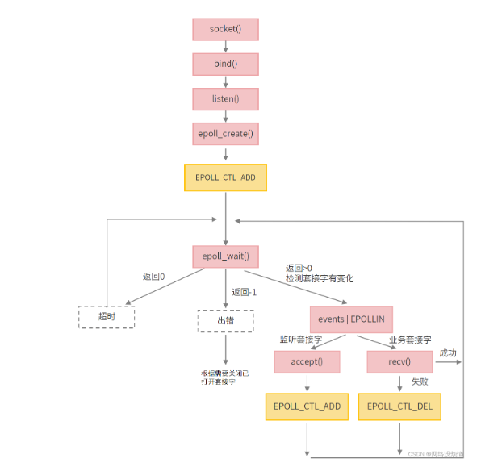

# A Tiny Webserver

## Webbench测试结果

500/5000客户端成功

8000-10000客户端fork资源不足

## 线程池/线程设计

### 线程池

线程池维护两个容器，任务容器`queue_`和线程容器`threads_`，线程容器在尾部构造，任务容器加入任务->取出并让线程（消费者）竞争执行

函数`runInThread`使用while+条件变量`cond_`实现任务消费，注意一上来是都构造好了的，也就是说线程池的最大并发数就是`threadSize_`

对任务队列中任务的调度采用先来先服务算法

线程池中的工作线程是处于一直阻塞等待的模式下（`cond_.wait(lock)`避免了忙等）

```
线程池的线程数量最直接的限制因素是CPU处理器的个数
如果CPU是四核的，那么对于CPU密集的任务，线程池的线程数量最好也为4，或者+1防止其他因素导致阻塞。
如果是IO密集的任务，一般要多于CPU的核数，因为线程间竞争的不是CPU资源而是IO，IO的处理一般比较慢，多于核数的线程将为CPU争取更多的任务，不至于在线程处理IO的时候造成CPU空闲导致资源浪费。
```

#### 线程池工作线程处理完一个任务后的状态是什么

两种情况：

1.当处理完任务后如果请求队列为空时，则这个线程重新回到阻塞等待的状态

2.当处理完任务后如果请求队列不为空时，那么这个线程将处于与其他线程竞争资源的状态，谁获得锁谁就获得了处理事件的资格

#### 如果同时1000个客户端进行访问请求，线程数不多，怎么能及时响应处理每一个

IO复用的并发模式下，不是一个客户连接对应一个线程。当客户连接有事件需要处理的时，epoll会进行事件提醒，而后讲对应的任务加入请求队列，等待工作线程竞争执行。

主要的方法如下：

1.任务队列大小调整，以允许一定数量的客户端请求排队等待处理

2.增加一定量的线程数，但不能过度增加以免引起资源竞争和性能下降

3.异步操作：可能的情况下使用异步进行处理，以允许线程在等待资源时可以切换到处理其他任务

4.优先级队列：确保重要和紧急的请求能够得到更快的处理

5.错误处理和超时：Thread对象设置定时器，防止请求执行过长导致其他请求被阻塞

6.连接池：客户端在涉及到资源访问时，使用连接池复用连接，避免频繁的断开和连接操作

7.分布式集群与负载均衡：使用负载均衡机制来分担请求到多个服务器或实例上，以提高整体的并发处理能力

```c++
#include "Logging.h"
#include <deque>
#include <vector>
#include <mutex>
#include <condition_variable>

class ThreadPool : noncopyable
{
public:
    using ThreadFunction = std::function<void()>;

    explicit ThreadPool(const std::string& name = std::string("ThreadPool"));
    ~ThreadPool();

    void setThreadInitCallback(const ThreadFunction& cb) { threadInitCallback_ = cb; }
    void setThreadSize(const int& num) { threadSize_ = num; }
    void start();
    void stop();

    const std::string& name() const { return name_; }
    size_t queueSize() const;

    void add(ThreadFunction ThreadFunction);

private:
    bool isFull() const { return threads_.size() == threadSize_; }
    void runInThread();

    mutable std::mutex mutex_;
    std::condition_variable cond_;
    std::string name_;
    // 每个线程的初始化回调函数
    ThreadFunction threadInitCallback_;
    std::vector<std::unique_ptr<Thread>> threads_;
    std::deque<ThreadFunction> queue_;
    bool running_;
    size_t threadSize_;
};

# endif // THREAD_POOL_H

```

```c++
#include "ThreadPool.h"

ThreadPool::ThreadPool(const std::string& name)
    : mutex_(),
      cond_(),
      name_(name),
      running_(false)
{
}

ThreadPool::~ThreadPool()
{
    stop();
    for (const auto& t : threads_) 
    {
        // 等待直到线程结束
        t->join();
    }
}

void ThreadPool::start()
{
    running_ = true;
    // vector.reserve：在不改变vector元素的情况下改变容量,主要用于预分配内存
    // 而resize用于改变vector的大小，可能导致元素的增加（按默认值赋值）和删除
    threads_.reserve(threadSize_);
    for (int i = 0; i < threadSize_; ++i)
    {
        char id[32];
        // snprintf保证输出不会超过指定的缓冲区大小
        snprintf(id, sizeof(id), "%d", i + 1);
        // emplace_back相比于push_back可以直接在容器内部构造，省去了拷贝的操作
        // name_默认为空字符串
        threads_.emplace_back(new Thread(
            std::bind(&ThreadPool::runInThread, this), name_ + id));
        threads_[i]->start();
    }
    // 不创建新线程
    if (threadSize_ == 0 && threadInitCallback_)
    {
        threadInitCallback_();
    }
}

void ThreadPool::stop()
{
    std::lock_guard<std::mutex> lock(mutex_);
    running_ = false;
    cond_.notify_all(); // 唤醒所有线程，以保证所有线程都能够在 ThreadPool 停止时得到通知
}

size_t ThreadPool::queueSize() const
{
    std::lock_guard<std::mutex> lock(mutex_);
    return queue_.size();
}

void ThreadPool::add(ThreadFunction ThreadFunction)
{
    std::unique_lock<std::mutex> lock(mutex_);
    queue_.push_back(ThreadFunction);
    cond_.notify_one();
}

void ThreadPool::runInThread()
{
    try 
    {
        if (threadInitCallback_)
        {
            threadInitCallback_();
        }
        ThreadFunction task;
        // 之前写成了 while (true)，这会导致出不去循环，现在通过cond_来控制
        // 注意这里是无限循环，在工作线程执行完一个任务之后，会通过争抢锁竞争下一个任务
        while (true)
        {
            {
                std::unique_lock<std::mutex> lock(mutex_);
                while (queue_.empty())
                {   
                    // 如果线程池不工作了，直接返回
                    if (!running_)
                    {
                        return;
                    }
                    // 队列为空但线程池仍在运行
                    // 就调用 cond_.wait(lock) 进入等待状态，此时会释放 mutex_ 锁
                    // 它的优势在于它允许线程在等待期间释放锁，从而允许其他线程继续执行
                    // 这有助于提高线程池的效率，避免了忙等的情况，因为线程在没有可执行任务时会自动进入等待状态，而不是不断地检查任务队列
                    // 然后等待被其他线程通过 cond_.notify_one() 或 cond_.notify_all() 唤醒(add方法负责)
                    // 这也是生产者-消费者模型的经典场景
                    cond_.wait(lock);
                }
                
                task = queue_.front();
                queue_.pop_front();
            }
            if (task != nullptr) 
            {
                task();
            }
        }
    } 
    catch(...) 
    {
        LOG_WARN << "runInThread throw exception";
    }
}
```

#### 根据并发量，任务执行时间使用线程池

高并发，任务执行时间短的业务：

使用无界队列（队列长度要大），允许将任务排队等待执行。这样可以确保在高并发的情况下不会因为任务来不及处理而导致任务丢失。

并发不高、任务执行时间长的业务：

使用有界队列，限制任务的排队数量，以避免在长时间内积累过多的任务。 可以设置任务的超时时间，防止执行时间过长影响系统响应。

并发高、业务执行时间长的业务：

考虑使用优先级队列或其他调度策略，确保重要任务能够得到及时处理。

**考虑核心**

线程池本质上是**生产者和消费者**模型，包括三要素：

* 往线程池队列中投**递任务的生产者**；
* **任务队列**；
* 从任务队列取出任务执行的**工作线程（消费者）**。

要想合理的配置线程池的大小，得分析线程池任务的特性，可以从以下几个方面来分析：

* 根据任务的性质来分：CPU 密集型任务；IO 密集型任务；混合型任务。
* 根据任务的优先级：高、中、低
* 根据任务的执行时间：长、中、短

不同性质的任务可以交给不同配置的线程池执行。

#### 线程池的线程数量

最直接的限制因素是CPU处理器的个数。

* 如果CPU是4核的，那么对于CPU密集的任务，线程池的线程数量最好也为4，或者+1防止其他因素导致阻塞。
* 如果是IO密集的任务，一般要多于CPU的核数，因为 IO 操作不占用 CPU，线程间竞争的不是CPU资源而是IO，IO的处理一般比较慢，多于核数的线程将为CPU争取更多的任务，不至于在线程处理IO的时候造成CPU空闲导致资源浪费。
* 而对于混合型的任务，如果可以拆分，拆分成 IO 密集型和 CPU 密集型分别处理，前提是两者运行的时间是差不多的，如果处理时间相差很大，则没必要拆分了。

如果**任务执行时间长**，在工作线程数量有限的情况下，工作线程很快就很被任务占完，导致后续任务不能及时被处理，此时应适当**增加工作线程数量**；反过来，如果**任务执行时间短**，那么**工作线程数量不用太多**，太多的工作线程会导致过多的时间浪费在线程上下文切换上。

回到这个问题本身来，这里的“高并发”应该是生产者生产任务的速度比较快，此时需要适当**增大任务队列上限**。

但是对于第三个问题并发高、业务执行时间长这种情形单纯靠线程池解决方案是不合适的，即使服务器有再高的资源配置，每个任务长周期地占用着资源，最终服务器资源也会很快被耗尽，因此对于这种情况，应该配合**业务解耦**，做些模块拆分优化整个系统结构。

#### 介绍一下生产者和消费者

生产者和消费者主要用于对于数据的同步使用，生产者生产数据，然后放到共享缓冲区中，消费者在缓冲区没有数据之前会阻塞等待，当生产者生产数据之后，会用signal函数唤醒阻塞，开始消费数据，而当数据生产充满缓冲区之后，生产者就会阻塞等待。其中的阻塞都使用条件变量。

### 线程

有一个std::thread类型的共享指针`thread_`成员，它可以在构造完成的时候直接执行，也是实际执行函数的线程

构造`thread_`的同时获取线程id作为唯一标识，使用信号量确保线程构造之后，线程的`tid_`已经被设置（注意这里并没有确保线程被构造，`sem_post`在构造函数内）

```c++
#ifndef THREAD_H
#define THREAD_H

#include <thread>
#include <functional>
#include <memory>
#include <string>
#include <atomic>
#include "noncopyable.h"

class Thread : noncopyable
{
public:
    using ThreadFunc = std::function<void()>;
    explicit Thread(ThreadFunc, const std::string &name = std::string());
    ~Thread();

    void start(); // 开启线程
    void join();  // 等待线程

    bool started() const { return started_; }
    pid_t tid() const { return tid_; }
    const std::string& name() const { return name_; }

    static int numCreated() { return numCreated_; }

private:
    void setDefaultName();  // 设置线程名

    bool started_;  // 是否启动线程
    bool joined_;   // 是否等待该线程
    std::shared_ptr<std::thread> thread_;
    pid_t tid_;     // 线程tid
    // Thread::start() 调用的回调函数
    // 其实保存的是 EventLoopThread::threadFunc()
    ThreadFunc func_;   
    std::string name_;  // 线程名
    static std::atomic_int32_t numCreated_; // 线程索引
};

#endif // THREAD_H
```

```c++
#include <semaphore.h>
#include "Thread.h"
#include "CurrentThread.h"

std::atomic_int32_t Thread::numCreated_(0);

/**
 * TODO:error  
 * default argument given for parameter 2 of ‘Thread::Thread(Thread::ThreadFunc, const string&)’GCC
 * 默认参数在定义和声明中只能出现一次，不能声明和定义都有默认参数
 */
Thread::Thread(ThreadFunc func, const std::string &name) :
    started_(false), // 还未开始
    joined_(false),  // 还未设置等待线程
    tid_(0),         // 初始 tid 设置为0
    func_(std::move(func)), // EventLoopThread::threadFunc()
    name_(name)     // 默认姓名是空字符串

{
    // 设置线程索引编号和姓名
    setDefaultName();
}

Thread::~Thread()
{
    // 现场感启动时并且未设置等待线程时才可调用
    if (started_ && !joined_)
    {
        // 设置线程分离(守护线程，不需要等待线程结束，不会产生孤儿线程)
        thread_->detach();
    }
}

void Thread::start()
{
    started_ = true;
    sem_t sem;
    sem_init(&sem, false, 0);
    // 注意这里已经开始执行了，std::thread会在构造完成就开始执行
    thread_ = std::shared_ptr<std::thread>(new std::thread([&](){
        // 获取线程tid
        tid_ = CurrentThread::tid();
        // v操作，增加1,表明获取到了tid
        sem_post(&sem);
        // 开启一个新线程专门执行该线程函数
        func_();
    }));

    /**
     * 这里必须等待获取上面新创建的线程的tid
     * 未获取到信息则不会执行sem_post，所以会被阻塞住
     * 如果不使用信号量操作，则别的线程访问tid时候，可能上面的线程还没有获取到tid
     */
    sem_wait(&sem);
}

void Thread::join()
{
    joined_ = true;
    // 等待线程执行完毕
    thread_->join();
}

void Thread::setDefaultName()
{
    int num = ++numCreated_;
    if (name_.empty())
    {
        char buf[32] = {0};
        snprintf(buf, sizeof(buf), "Thread%d", num);
        name_ = buf;
    }
}
```

## Socket编程相关

### Socket绑定

```c++
// 将socket绑定到端口
// 地址为sockaddr结构体，len为sockaddr的长度
bind(int fd, sockaddr* addr, int len)
// sockaddr是C的地址结构体，C++实际使用的是sockaddr_in(IPv4)和sockaddr_in6(IPv6)，因此需要转型，len为实际的长度
struct sockaddr_in{
    in_port_t sin_port // Port16位地址
    in_addr sin_addr // IP32位地址，可以将它设置为特定的 IP 地址，或者使用 INADDR_ANY，表示绑定到所有可用的网络接口。
    sin_zero // 填充位
}
// 实际使用
// 注意要转成大端序
sockaddr_in addr_;
// 初始化最好加上
::bzero(&addr_, sizeof(addr_));
// sin_family的声明可加可不加
addr_.sin_family = AF_INET;
addr_.sin_port = ::htons(port);
addr_.sin_addr.s_addr = htonl(INADDR_ANY);
::bind(sockfd_, (sockaddr *)addr_, sizeof(sockaddr_in));

// 扩展：sockaddr_in6
struct sockaddr_in6{
    in_port_t sin6_port; // 端口地址
    uint32_t sin6_flowinfo; // IPv6的流信息
    struct in6_addr sin6_addr; // IPv6地址
    uint32_t sin6_scope_id; // IPv6的接口标识符（仅在链接本地通信时具有意义）
}
```

### Socket监听

```c++
listen(int sockfd_, int backlog)
```

### Socket连接

1. accept 函数会从已连接队列中取出一个连接请求，并为该连接创建一个新的套接字（通常是非阻塞的）。
2. 返回的新套接字可以用于与客户端进行通信，而原始监听套接字（通过 socket 和 bind 创建）仍然用于接受其他连接请求。

一个服务器通常仅仅创建一个监听套接字，它在该服务器生命周期内一直存在。内核为每个由服务器进程接受的客户端连接创建一个已连接套接字。当服务器完成对某个给定的客户端的服务时，相应的已连接套接字就被关闭。

accept4可以通过flags给套接字设定属性

```c++
// 注意这里的addr输入的是空值，需要sockfd的内容来填充
int accept(int sockfd, struct sockaddr *addr, socklen_t *addrlen);
int accept4(int sockfd, struct sockaddr *addr, socklen_t *addrlen, int flags);

// 实际使用
sockaddr_in addr;
socklen_t len = sizeof(addr);
::memset(&addr, 0, sizeof(addr));
::accept4(sockfd_, (sockaddr *)&addr, &len, SOCK_NONBLOCK | SOCK_CLOEXEC);
```

### Socket改变套接字属性

第一个参数socket是套接字描述符。第二个参数level是被设置的选项的级别，如果想要在套接字级别上设置选项，就必须把level设置为 SOL\_SOCKET。 option\_name指定准备设置的选项，option\_name可以有哪些取值，这取决于level

```c++
int setsockopt( int socket, int level, int option_name, const void *option_value, size_t ，ption_len);

// 实际使用
// optval这里作为标志位，1代表启用，0代表不启用，可以自由设置
int optval = 1;
// 下面的这些函数每个要分别设置optval
// 设置启用无延迟（不启用Nagle算法）
::setsockopt(sockfd_, IPPROTO_TCP, TCP_NODELAY, &optval, sizeof(optval));
// 设置地址复用，其实就是可以使用处于Time-wait的端口
::setsockopt(sockfd_, SOL_SOCKET, SO_REUSEADDR, &optval, sizeof(optval));
// 设置多个进程可以绑定同一个地址，即多个服务的ip+port是一样
::setsockopt(sockfd_, SOL_SOCKET, SO_REUSEPORT, &optval, sizeof(optval));
// 设置TCP长连接
::setsockopt(sockfd_, SOL_SOCKET, SO_KEEPALIVE, &optval, sizeof(optval));
```

### Socket获取套接字属性上的值

常用于获取套接字上待处理的错误，形式上和setsocketopt完全一致，并且它并不返回实际的错误，而是告诉你是否存在。如果存在返回1，实际的错误码在errno上。

```c++
int getsockopt( int socket, int level, int option_name, const void *option_value, size_t ，ption_len);

// 实际使用
int optval;
socklen_t optlen = sizeof(optval);
int err = 0;
if(::getsockopt(channel_->fd(), SOL_SOCKET, SO_ERROR, &optval, &optlen)){
    err = errno;  
}
```

### Socket半关闭

shutdown是针对socket 连接的操作，它会影响整个的这个socket 连接，但不会影响文件操作符，例如当socket关闭写时，仍可以用文件操作符读，但所有基于这个socket链接 文件操作符，都无法再发送数据了。

而socket::close可以可以被多个程序引用。 当执行一次 close时，该描述符的引用减 1， 当前程序中的文件描述符不可用，但socket 连接仍然有效，直到描述符的引用为0时才 关闭 socket 连接。

一般来说我们只用shutdown进行半关闭操作

```c++
// how有三种参数值：SHUT_RD(只关读端)，SHUT_WR（只关写端）, SHUT_DOWN（写端和读端都关闭，并且不管其他线程是否关闭）
int shutdown(int sockfd, int how);

// 实际使用
::shutdown(sockfd_, SHUT_WR)
```

## 多Reactor多线程的主要思想

通常会有一个主循环（base loop）和多个子循环（sub loop），每个`SubLoop` 都关联一个线程池，用于执行具体的业务逻辑任务。

1. **Base Loop：**
   * 主循环（base loop）是整个网络应用程序的主要循环，负责监听新的连接、接受连接、将连接交给子循环处理等主要任务。在 muduo 中，这个主循环通常是在主线程中运行的。
   * 主循环不直接处理具体的连接的读写事件，而是将这些事件分发给子循环。
   * 当有新连接到达时，`BaseLoop` 的 `Channel` 上会触发连接事件，比如 `EPOLLIN` 事件。`Channel` 上连接事件的回调函数会被调用，该回调函数通常会执行 `accept` 操作，建立新的连接。新建立的连接会被分配给一个具体的 `SubLoop`，并在该 `SubLoop` 中处理后续的读写事件和业务逻辑。
   * `Channel` 对象在连接后仍然保留在主循环中，因为主循环需要负责事件的分发。一旦有事件发生，主循环会通过 `Channel` 对象找到对应的 `SubLoop`，然后将事件分发给相应的 `SubLoop` 处理。
2. **Sub Loop：**
   * 子循环（sub loop）是实际处理连接的循环，每个连接都被分配给一个子循环。子循环负责处理特定连接上的读写事件，执行具体的业务逻辑。
   * 子循环通常在独立的线程中运行，允许并行处理多个连接，提高了并发性能。

## epoll

### epoll\_create

用于创建 epoll 文件描述符，该文件描述符用于后续的epoll操作，参数size目前还没有实际用处，我们只要填一个大于0的数就行。

```c++
#include <sys/epoll.h>
int epoll_create(int size);
参数：
size:目前内核还没有实际使用，只要大于0就行
返回值：
返回epoll文件描述符
```

红黑树：用于管理等待队列。等待队列中的每个节点代表一个被监视的文件描述符（fd）。红黑树的目的是使得对等待队列的查询和修改操作的时间复杂度维持在 O(log n) 级别。这使得 `epoll` 在处理大量文件描述符时能够保持高效。

双链表： 用于管理就绪队列。就绪队列中的每个节点表示一个就绪的事件。当有文件描述符上的事件就绪时，将其从等待队列中移动到就绪队列中。双链表的目的是实现高效的事件通知。


### epoll\_ctl

epoll\_ctl函数用于增加，删除，修改epoll事件，epoll事件会存储于内核epoll结构体红黑树中。

```c++
#include <sys/epoll.h>
 
int epoll_ctl(int epfd, int op, int fd, struct epoll_event *event);
 
参数：
epfd：epoll文件描述符
op：操作码,包括——
	EPOLL_CTL_ADD:插入事件
	EPOLL_CTL_DEL:删除事件
	EPOLL_CTL_MOD:修改事件
fd：事件绑定的套接字文件描述符
events：事件结构体
 
返回值：
成功：返回0
失败：返回-1
```

### epoll\_event结构体

```c++
#include <sys/epoll.h>
 
struct epoll_event{
  uint32_t events; //epoll事件，参考事件列表 
  epoll_data_t data;
} ;
typedef union epoll_data {  
    void *ptr;  
    int fd;  //套接字文件描述符
    uint32_t u32;  
    uint64_t u64;
} epoll_data_t;
```

### epoll事件列表（events）

```c++
头文件：<sys/epoll.h>
 
enum EPOLL_EVENTS
{
    EPOLLIN = 0x001, //读事件
    EPOLLPRI = 0x002,
    EPOLLOUT = 0x004, //写事件
    EPOLLRDNORM = 0x040,
    EPOLLRDBAND = 0x080,
    EPOLLWRNORM = 0x100,
    EPOLLWRBAND = 0x200,
    EPOLLMSG = 0x400,
    EPOLLERR = 0x008, //出错事件
    EPOLLHUP = 0x010, //出错事件
    EPOLLRDHUP = 0x2000,
    EPOLLEXCLUSIVE = 1u << 28,
    EPOLLWAKEUP = 1u << 29,
    EPOLLONESHOT = 1u << 30,
    EPOLLET = 1u << 31 //边缘触发
  };
```

### epoll\_wait

注意，epoll\_wait中的epoll\_event结构体就是负责填充就绪事件的

```c++
#include <sys/epoll.h>
 
int epoll_wait(int epfd, struct epoll_event *events,              
int maxevents, int timeout);
 
参数：
epfd：epoll文件描述符
events：epoll事件数组
maxevents：epoll事件数组长度
timeout：超时时间
小于0：一直等待
等于0：立即返回
大于0：等待超时时间返回，单位毫秒
 
返回值：
小于0：出错
等于0：超时
大于0：返回就绪事件个数
```

### epoll架构



### LT模式与ET模式

LT模式：水平触发 socket读触发：socket接收缓冲区有数据，会一直触发epoll\_wait EPOLLIN事件，直到数据被用户读取完。 socket写触发：socket可写，会一直触发epoll\_wait EPOLLOUT事件。

ET模式：边缘触发 socket读触发：socket数据从无到有，会触发epoll\_wait EPOLLIN事件，只会触发一次EPOLLIN事件，用户检测到事件后，需一次性把socket接收缓冲区数据全部读取完，读取完的标志为recv返回-1，errno为EAGAIN。 socket写触发：socket可写，会触发一次epoll\_wait EPOLLOUT事件。

### 阻塞和非阻塞

* epoll阻塞：epoll自身是阻塞的，我们可以通过epoll\_wait超时参数设置epoll阻塞行为。
* epoll监听套接字阻塞：epoll监听套接字阻塞是指插入epoll监听事件的套接字设置为阻塞模式。

epoll监听套接字一般设置成非阻塞，因为epoll是为高并发设计的，任何的其他阻塞行为，都会影响epoll高效运行。

### epoll为什么高效

* 红黑树红黑树提高epoll事件增删查改效率。
* 回调通知机制

当epoll监听套接字有数据读或者写时，会通过注册到socket的回调函数通知epoll，epoll检测到事件后，将事件存储在就绪队列

同时，epoll\_wait返回成功后，会将所有就绪事件存储在事件数组（epoll\_event结构体），用户不需要进行无效的轮询，从而提高了效率。

## HTTP请求解析

1.采用reactor事件处理模式，主线程只负责监听IO，获取io请求后把请求对象放入请求队列，交给工作线程，工作线程负责数据读取以及逻辑处理。

proactor模式将所有IO读写操作 都交给主线程和内核来处理，工作线程仅仅负责业务逻辑。

2.在主线程循环监听到读写套接字有报文传过来以后，在工作线程调用requestData中的handleRequest进行使用**状态机**解析了HTTP请求

在一趟循环过程中，状态机先read一个数据包，然后根据当前状态变量判断如何处理该数据包。当数据包处理完之后，状态机通过给当前状态变量传递目标状态值来实现状态转移。那么当状态机进行下一趟循环时，将执行新的状态对应的逻辑。

### GET/POST报文解析

```c++
//get报文:请求访问的资源。（客户端：我想访问你的某个资源）
GET /0606/01.php HTTP/1.1\r\n  请求行:请求方法 空格 URL 空格 协议版本号 回车符 换行符
Host: localhost\r\n         首部行 首部行后面还有其他的这里忽略
\r\n                空行分割
空                实体主体
```

```c++
//post报文:传输实体主体。（客户端：我要把这条信息告诉你）
POST /0606/02.php HTTP/1.1 \r\n   请求行
Host: localhost\r\n             首部行 首部行中必须有Contenr-length，告诉服务器我要给你发的实体主体有多少字节 
Content-type: application/x-www-form-urlencoded\r\n
Contenr-length: 23\r\n       
 \r\n                                                       空行分割
username=zhangsan&age=9 \r\n    实体主体
```

如果是post报文的话，首部行里面必然会有Content-length字段而get没有，所以取出这个字段，求出后面实体主体时候要取用的长度。然后往下走回送相应的http响应报文即可。而get报文，实体主体是空的，直接读取请求行的url数据，然后往下走回送相应的http响应报文即可。

#### 优化解析过程

解析报文函数不直接将buffer输入，而是在buffer中实现迭代器及相关方法，函数只需输入begin指针和end指针即可实现高效解析

### 如何支持长连接 keep-alive

在首部行读取出来数据以后如果请求方设置了长连接，则Connection字段为keep-alive以此作为依据

如果读取到这个字段的话就在报文解析，报文回送完毕之后将requestData重置

然后将该套接字属性也用epoll\_ctl重置，再次加入epoll监听。

## 定时器

使用set对定时器进行管理，以时间戳作为键值来获取定时器。set 内部实现是红黑树，红黑树中序遍历便可以得到按照键值排序过后的定时器节点。

当然也可以使用小根堆，此时添加一个定时器的时间复杂度是O(log(n))，删除定时器的时间复杂度是O(1)，执行定时器任务的时间复杂度是O(1)。

## Reactor/Preactor

### Reactor模式

Reactor 模式：主线程只负责监听文件描述符上是否有事件发生，有的话就立即将该事件通知工作线程（逻辑单元）。除此之外，主线程不做任何其他实质性的工作。 读写数据，接受新的连接，以及处理客户请求均在工作线程中完成。

* 使用同步 I/O 模型（以 epoll\_wait 为例）实现的 Reactor 模式的工作流程：

1. 主线程往 epoll 内核事件表中注册 socket 上的读就绪事件。
2. 主线程调用 epoll\_wait 等待 socket 上有数据可读。
3. 当 socket 上有数据可读时， epoll\_wait 通知主线程。主线程则**将 socket 可读事件放入请求队列**。
4. 睡眠在请求队列上的**某个工作线程被唤醒**，它从 socket 读取数据，并处理客户请求，然后往 epoll 内核事件表中注册该 socket 上的写就绪事件。
5. 主线程调用 epoll\_wait 等待 socket 可写。
6. 当 socket 可写时，epoll\_wait 通知主线程。主线程将 socket 可写事件放入请求队列。
7. 睡眠在请求队列上的某个工作进程被唤醒，它往 socket 上写入服务器处理客户请求的结果。


工作线程从请求队列中取出事件后，将根据事件类型来决定如何处理它：对于可读事件，执行读数据和处理请求的操作；对于可写事件，执行写数据的操作。因此，Reactor 模式中没必要区分所谓的 “读工作线程” 和 “写工作线程”。

主线线程职责为：事件监听+事件分发（请求队列）

工作线程职责为：事件处理+写事件完成（传回给客户端）

### Preactor模式

Preactor 模式 **将所有 I/O 操作都交给主线程和内核来处理， 工作线程仅仅负责业务逻辑。**

* 使用异步 I/O 模型（以 aio\_read 和 aio\_write为例）实现的 Proactor 模式的工作流程：

1. 主线程调用 aio\_read 函数向内核注册 socket 上的读完成事件，并告诉内核用户读缓冲区的位置，以及读操作完成时如何通知应用程序(这里以信号为例) 主线程继续处理其他逻辑。
2. 当 socket 上的数据被读入用户缓冲区后，**内核**将向应用程序发送一个信号，以 **通知应用程序数据已经可用。**
3. 应用程序预先定义好的**信号处理函数**选择一个工作线程来处理客户请求。工作线程处理完客户请求之后，调用 aio\_write 函数向内核注册 socket 上的写完成事件，并告诉**内核用户写缓冲区的位置**，以及写操作完成时如何通知应用程序（仍然以信号为例）
4. 主线程继续处理其他逻辑
5. 当用户缓冲区的数据被写入 socket 之后，内核将向应用程序发送一个信号，以**通知应用程序数据已经发送完毕**。
6. 应用程序预先定义好的信号处理函数选择一个工作线程来做善后处理，比如决定是否关闭 socket。


连接 socket 上的读写事件是通过 aio\_read/aio\_write 向内核注册的，因此内核将通过信号来向应用程序报告连接 socket 上的读写事件。所以，**主线程中的 epoll\_wait 调用仅能用来检测监听 socket 上的连接请求事件，而不能用来检测 socket 上的读写事件。**

### 区别及优缺点

* Reactor 是非阻塞同步网络模式，感知的是就绪可读写事件。在每次感知到有事件发生（比如可读就绪事件）后，就需要应用进程主动调用 read 方法来完成数据的读取，也就是要应用进程主动将 socket 接收缓存中的数据读到应用进程内存中，这个过程是同步的，读取完数据后应用进程才能处理数据。
  *   优缺点：

      Reactor实现相对简单，对于耗时短的处理场景处理高效；事件的串行化对应用是透明的，可以顺序的同步执行而不需要加锁；

      Reactor处理耗时长的操作会造成事件分发的阻塞，影响到后续事件的处理；
* Proactor 是异步网络模式， 感知的是已完成的读写事件。在发起异步读写请求时，需要传入数据缓冲区的地址（用来存放结果数据）等信息，这样系统内核才可以自动帮我们把数据的读写工作完成，这里的读写工作全程由操作系统来做，并不需要像 Reactor 那样还需要应用进程主动发起 read/write 来读写数据，操作系统完成读写工作后，就会通知应用进程直接处理数据。
  *   优缺点

      Proactor性能更高，这种设计允许多个任务并发的执行，从而提高吞吐量；并可执行耗时长的任务（各个任务间互不影响）

      Proactor实现逻辑复杂；依赖操作系统对异步的支持。

### 适用场景

Reactor：同时接收多个服务请求，并且依次同步的处理它们的事件驱动程序；

Proactor：异步接收和同时处理多个服务请求的事件驱动程序；

### 使用同步I/O模拟Proactor模式


核心在于主线程执行数据读写操作，读写完成后发送给工作线程，实现了类似“异步I/O”的效果

模拟的核心——

1.主线程承担内核的工作

2.读写分开，读事件由主线程承担，写事件的数据读入也由主线程负责，然后插入请求队列的不是事件，而是具体的数据

## MySQL连接池

实现一个数据库连接池来帮助项目加快对数据库的操作

数据库的连接是一个很耗时的操作，也容易对数据库造成安全隐患。所以，在程序初始化的时候，集中创建多个数据库连接，并把他们集中管理，供程序使用，可以保证较快的数据库读写速度，还更加安全可靠。 在不使用 MySQL 连接池的情况下访问数据库，那么每一次创建数据库连接都需要经过如下步骤：

1. TCP 建立连接的三次握手（客户端与 MySQL 服务器的连接基于 TCP 协议）
2. MySQL 认证的三次握手
3. 真正的 SQL 执行
4. MySQL 的关闭
5. TCP 的四次握手关闭

使用数据库连接池的步骤：

第一次访问的时候，需要建立连接。 但是之后的访问，均会复用之前创建的连接，直接执行SQL语句。

优点：

1. 较少了网络开销
2. 系统的性能会有一个实质的提升
3. 没了麻烦的TIME\_WAIT状态

### 连接池的工作原理

连接池主要由三部分构成，分别是：

1.连接池的建立

一般在系统初始化时，连接池会根据系统配置建立，并在池中创建了几个连接对象，以便使用时能从连接池中获取。连接池中的连接不能随意创建和关闭，这样避免了连接随意建立和关闭造成的系统开销。

2.连接池的管理

当客户请求数据库连接时，首先查看连接池中是否有空闲连接，如果存在空闲连接，则将连接分配给客户使用；如果没有空闲连接，则查看当前所开的连接数是否已经达到最大连接数，如果没达到就重新创建一个连接给请求的客户；如果达到就按设定的最大等待时间进行等待，如果超出最大等待时间，则抛出异常给客户。

当客户释放数据库连接时，先判断该连接的引用次数是否超过了规定值，如果超过就从连接池中删除该连接，否则保留为其他客户服务。

该策略保证了数据库连接的有效复用，避免频繁的建立、释放连接所带来的系统资源开销。

3.连接池的关闭

连接池的关闭。当应用程序退出时，关闭连接池中所有的连接，释放连接池相关的资源，该过程正好与创建相反。

### 连接池主要参数

最小连接数：是连接池一直保持的数据库连接,所以如果应用程序对数据库连接的使用量不大,将会有大量的数据库连接资源被浪费.

最大连接数：是连接池能申请的最大连接数,如果数据库连接请求超过次数,后面的数据库连接请求将被加入到等待队列中,这会影响以后的数据库操作

最大空闲时间

获取连接超时时间

超时重试连接次数

### 连接池主要API

mysql相关API都在\<mysql/mysql.h>下

`MYSQL* mysql_init(MYSQL *mysql)`：分配或初始化与 mysql\_real\_connect() 相适应的 MYSQL 对象

`void mysql_close(MYSQL *mysql)`：关闭前面打开的连接。如果句柄是由 mysql\_init() 或 mysql\_connect() 自动分配的，mysql\_close() 还将解除分配由 mysql 指向的连接句柄

`MYSQL *mysql_real_connect (MYSQL *mysql, const char *host, const char *user, const char *passwd, const char *db, unsigned int port, const char *unix_socket, unsigned long client_flag)`：与Mysql引擎进行连接，mysql\_connect()是老的版本，前者中的参数可以为NULL

`int mysql_query(MYSQL *mysql, const char *query)`：执行由「Null 终结的字符串」终结的SQL查询语句，字符串 query 必须包含 1 条 SQL 语句，而且不应为语句添加终结分号`‘;’`或`\g`。该函数也可以执行插入等 SQL 语句。 如果查询成功，返回0。如果出现错误，返回非0值。

`MYSQL_RES *mysql_store_result(MYSQL *mysql)`：查询成功的结构会被储存到 MYSQL\_RES 结果集中，我们需要检索此结果集获取我们想要的结果。使用 mysql\_store\_result 从 MYSQL 连接中获取结果集。还有一个mysql\_use\_result函数的实现效果与它类似，但前者是一口气获得整个数据结果集，后者是逐行获取数据集，有利于减少内存占用。

`MYSQL_ROW mysql_fetch_row(MYSQL_RES *result)`：检索结果集的下一行。在 mysql\_store\_result() 之后使用时，如果没有要检索的行，mysql\_fetch\_row() 返回NULL。 我们查询 MySQL 得到的是一行行的形式，我们取出结果也是一行行的取出，我们还可以获取其中的字段值。

`MYSQL_FIELD *mysql_fetch_field(MYSQL_RES *result)`：返回采用 MYSQL\_FIELD 结构的结果集的列。重复调用该函数，以检索关于结果集中所有列的信息。未剩余字段时，mysql\_fetch\_field() 返回 NULL。

### 连接池问题

#### 如何还回连接

使用一个智能指针并规定其删除器，这个删除器并不执行删除行为，而是将其空闲时间刷新并重新放到vector中。

#### 提交事务和回滚事务

`mysql_commit(MYSQL *mysql)`以及`mysql_rollback(MYSQL *mysql)`，它们执行的条件是前面mysql\_query函数中的sql语句包含了事务相关sql语句。

## 其他

### web服务器是你自己申请的域名么？域名号是多少

没有申请，因为服务器是放在同一网段的虚拟机里，然后在本地的浏览器里面访问。

或者也可以在同一局域网的不同主机下实验，在同一局域网下通过私有IP+端口号就可以访问。

又或者或者直接把服务器程序放在本地，然后使用本地回环地址127.0.0.1就可以。

本地回环地址主要作用有两个：一是测试本机的网络配置，能PING通127.0.0.1说明本机的网卡和IP协议安装都没有问题；另一个作用是某些SERVER/CLIENT的应用程序在运行时需调用服务器上的资源，一般要指定SERVER的IP地址，但当该程序要在同一台机器上运行而没有别的SERVER时就可以把SERVER的资源装在本机，SERVER的IP地址设为127.0.0.1同样也可以运行。
