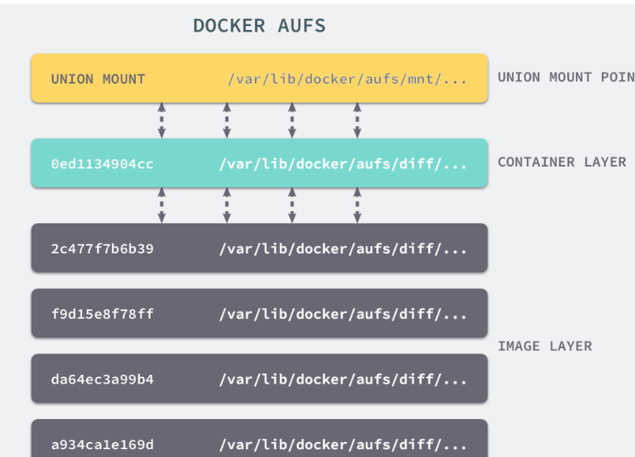

# Docker

## Docker的意义

不同软件的环境配置问题，在不同的操作系统下，甚至在同一操作系统的版本下都有可能出现问题。

解决方案——安装的时候，把原始环境一模一样地复制过来，最开始的手段就是虚拟机

虚拟机（virtual machine）就是带环境安装的一种解决方案。它可以在一种操作系统里面运行另一种操作系统，比如在 Windows 系统里面运行 Linux 系统。应用程序对此毫无感知，因为虚拟机看上去跟真实系统一模一样，而对于底层系统来说，虚拟机就是一个普通文件，不需要了就删掉，对其他部分毫无影响。

虚拟机的缺陷：

1.资源占用多：

虚拟机会独占一部分内存和硬盘空间。它运行的时候，其他程序就不能使用这些资源了。哪怕虚拟机里面的应用程序，真正使用的内存只有 1MB，虚拟机依然需要几百 MB 的内存才能运行。

2.冗余步骤多

虚拟机是完整的操作系统，一些系统级别的操作步骤，往往无法跳过，比如用户登录。

3.启动慢

启动操作系统需要多久，启动虚拟机就需要多久。可能要等几分钟，应用程序才能真正运行。

### Linux容器

由于虚拟机存在这些缺点，Linux 发展出了另一种虚拟化技术：Linux 容器（Linux Containers，缩写为 LXC）。

\*\*Linux 容器不是模拟一个完整的操作系统，而是对进程进行隔离。\*\*或者说，在正常进程的外面套了一个保护层。对于容器里面的进程来说，它接触到的各种资源都是虚拟的，从而实现与底层系统的隔离。由于容器是进程级别的，相比虚拟机有很多优势。

1.启动快

容器里面的应用，直接就是底层系统的一个进程，而不是虚拟机内部的进程。所以，启动容器相当于启动本机的一个进程，而不是启动一个操作系统，速度就快很多。

2.资源占用少

容器只占用需要的资源，不占用那些没有用到的资源；虚拟机由于是完整的操作系统，不可避免要占用所有资源。另外，多个容器可以共享资源，虚拟机都是独享资源。

3.体积小

容器只要包含用到的组件即可，而虚拟机是整个操作系统的打包，所以容器文件比虚拟机文件要小很多。

总之，容器有点像轻量级的虚拟机，能够提供虚拟化的环境，但是成本开销小得多。

### Docker介绍

\*\*Docker 属于 Linux 容器的一种封装，提供简单易用的容器使用接口。\*\*它是目前最流行的 Linux 容器解决方案。

Docker 将应用程序与该程序的依赖，打包在一个文件里面。运行这个文件，就会生成一个虚拟容器。程序在这个虚拟容器里运行，就好像在真实的物理机上运行一样。有了 Docker，就不用担心环境问题。总体来说，Docker 的接口相当简单，用户可以方便地创建和使用容器，把自己的应用放入容器。容器还可以进行版本管理、复制、分享、修改，就像管理普通的代码一样。

Docker本身是一个Client-Server结构的系统，Docker守护进程运行在主机上， 然后通过Socket连接从客户端访问Docker守护进程。Docker守护进程从客户端接受命令，并按照命令，管理运行在主机上的容器。

新建一个容器的时候，docker不需要像虚拟机一样重新加载一个操作系统，避免引导。docker是利用宿主机的操作系统，省略了这个复杂的过程，速度为秒级。

## Docker的用途

Docker 的主要用途，目前有三大类。

\*\*（1）提供一次性的环境。\*\*比如，本地测试他人的软件、持续集成的时候提供单元测试和构建的环境。

\*\*（2）提供弹性的云服务。\*\*因为 Docker 容器可以随开随关，很适合动态扩容和缩容。

\*\*（3）组建微服务架构。\*\*通过多个容器，一台机器可以跑多个服务，因此在本机就可以模拟出微服务架构。

## Image文件

\*\*Docker 把应用程序及其依赖，打包在 image 文件里面。\*\*只有通过这个文件，才能生成 Docker 容器。image 文件可以看作是容器的模板。Docker 根据 image 文件生成容器的实例。同一个 image 文件，可以生成多个同时运行的容器实例。

mage 是二进制文件。实际开发中，一个 image 文件往往通过继承另一个 image 文件，加上一些个性化设置而生成。举例来说，你可以在 Ubuntu 的 image 基础上，往里面加入 Apache 服务器，形成自己的 image。

```sh
# 列出本机的所有 image 文件。
$ docker image ls

# 删除 image 文件
$ docker image rm [imageName]
```

一般来说，为了节省时间，我们应该尽量使用别人制作好的 image 文件，而不是自己制作。即使要定制，也应该基于别人的 image 文件进行加工，而不是从零开始制作。同时，为了方便共享，image 文件制作完成后，可以上传到网上的仓库。Docker 的官方仓库 [Docker Hub](https://hub.docker.com/) 是最重要、最常用的 image 仓库。此外，出售自己制作的 image 文件也是可以的。

将 image 文件从仓库抓取到本地：

```sh
$ docker image pull library/hello-world
```

`docker image pull`是抓取 image 文件的命令。`library/hello-world`是 image 文件在仓库里面的位置，其中`library`是 image 文件所在的组，`hello-world`是 image 文件的名字。由于 Docker 官方提供的 image 文件，都放在[`library`](https://hub.docker.com/r/library/)组里面，所以它的是默认组，可以省略。抓取成功以后，就可以在本机看到这个 image 文件了。

运行image文件：

```sh
$ docker container run hello-world
```

`docker container run`命令会从 image 文件，生成一个正在运行的容器实例。注意，`docker container run`命令具有自动抓取 image 文件的功能。如果发现本地没有指定的 image 文件，就会从仓库自动抓取。因此，前面的`docker image pull`命令并不是必需的步骤。

有些容器会自动终止，因为提供的是服务，但对于不自动终止的容器，必须使用`docker container kill` 命令手动终止：

```sh
# 显示当前正在运行的容器信息
$ docker ps
# 查看所有的容器（包括已经停止的）
$ docker ps -a
$ docker container kill [containID]
```

## 容器文件

\*\*image 文件生成的容器实例，本身也是一个文件，称为容器文件。\*\*也就是说，一旦容器生成，就会同时存在两个文件： image 文件和容器文件。而且关闭容器并不会删除容器文件，只是容器停止运行而已。

```sh
# 列出本机正在运行的容器
$ docker container ls

# 列出本机所有容器，包括终止运行的容器
$ docker container ls --all
```

终止运行的容器文件，依然会占据硬盘空间，可以使用`docker container rm`命令删除

```sh
$ docker container rm [containerID]
```

运行上面的命令之后，再使用`docker container ls --all`命令，就会发现被删除的容器文件已经消失了。

### 其他有用的容器相关命令

docker container start：

前面的`docker container run`命令是新建容器，每运行一次，就会新建一个容器。同样的命令运行两次，就会生成两个一模一样的容器文件。如果希望重复使用容器，就要使用`docker container start`命令，它用来启动已经生成、已经停止运行的容器文件。

```sh
$ docker container start [containerID]
```

docker container stop

前面的`docker container kill`命令终止容器运行，相当于向容器里面的主进程发出 SIGKILL 信号。而`docker container stop`命令也是用来终止容器运行，相当于向容器里面的主进程发出 SIGTERM 信号，然后过一段时间再发出 SIGKILL 信号。

```sh
$ docker container stop [containerID]
```

docker container logs

`docker container logs`命令用来查看 docker 容器的输出，即容器里面 Shell 的标准输出。如果`docker run`命令运行容器的时候，没有使用`-it`参数，就要用这个命令查看输出。

```sh
$ docker container logs [containerID]
```

docker container exec

`docker container exec`命令用于进入一个正在运行的 docker 容器。如果`docker run`命令运行容器的时候，没有使用`-it`参数，就要用这个命令进入容器。一旦进入了容器，就可以在容器的 Shell 执行命令了。

```sh
$ docker container exec -it [containerID] /bin/bash
```

docker container cp

`docker container cp`命令用于从正在运行的 Docker 容器里面，将文件拷贝到本机。下面是拷贝到当前目录的写法。

```sh
$ docker container cp [containID]:[/path/to/file] 
```

## Docker技术实现

Linux 命名空间、控制组和 UnionFS 三大技术支撑了目前 Docker 的实现，也是 Docker 能够出现的最重要原因。

### namespace

命名空间，是容器隔离的基础，保证A容器看不到B容器。命名空间在linux中是内核级别的抽象，包含6个命名空间：User（隔离用户身份），Mnt（隔离文件系统挂载点），Network（隔离网络配置），UTS（隔离主机的主机名和域名），IPC（隔离进程间通信），Pid（进程隔离）

### cgroups

Cgroups 是 Control Group 的缩写，表示控制组，主要用于容器的资源统计和隔离

主要用到的cgroups子系统：cpu（CPU控制），blkio（控制块设备IO），device（控制设备访问），freezer（冻结和恢复进程组），memory（控制和限制内存使用）

### Unionfs

联合文件系统。是一种为 Linux 操作系统设计的用于把多个文件系统『联合』到同一个挂载点的文件系统服务。

还有AUFS ，即 Advanced UnionFS ，其实就是 UnionFS 的升级版，它能够提供更优秀的性能和效率。AUFS 作为先进联合文件系统，它能够将不同文件夹中的层联合（Union）到了同一个文件夹中，这些文件夹在 AUFS 中称作分支，整个『联合』的过程被称为联合挂载（Union Mount）。

image是Docker 部署的基本单位，一个 Image 包含了我们的程序文件，以及这个程序依赖的资源的环境。Docker Image 对外是以一个文件的形式展示的（更准确的说是一个 mount 点）。

Unionfs实现了：在联合的子目录中， 有一部分是可读可写的，但是有一部分只是可读的。当你对可读的目录内容做出修改的时候，其结果只会保存到可写的目录下，不会影响只读的目录。

比如，我们可以把我们的服务的源代码目录和一个存放代码修改记录的目录「联合」起来构成一个 AUFS。前者设置只读权限，后者设置读写权限。那么，一切对源代码目录下文件的修改都只会影响那个存放修改的目录，不会污染原始的代码。

### Dorker镜像分层机制

Docker Image 是有一个层级结构的，最底层的 Layer 为 BaseImage（一般为一个操作系统的 ISO 镜像），然后顺序执行每一条指令，生成的 Layer 按照入栈的顺序逐渐累加，最终形成一个 Image。每一次都是一个被联合的目录，从目录的角度来说，大致如下图所示：



一个 Image 是通过一个 DockerFile 定义的，然后使用 docker build 命令构建它。DockerFile 中的每一条命令的执行结果都会成为 Image 中的一个 Layer。

Docker也正是通过AUFS来管理Layer 和 Image 之间的关系的。
