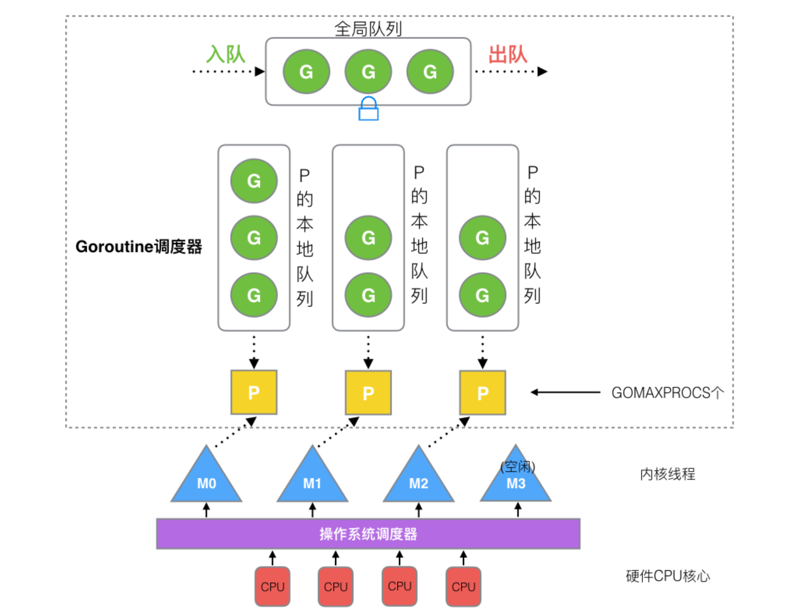

# Go

## golang的优势

1.可直接编译成机器码，不依赖其他库，因此直接运行可部署（二进制文件）

2.静态类型语言，编译的时候能检查出大部分的问题

3.语言层面的并发，这是天生的基因（底层）支持，可以充分利用多核

4.强大的标准库，包括runtime系统调度机制（执行垃圾回收及调度），以及丰富的库内容

5.简单，仅仅25个关键字，内嵌c语言语法支持，包含面向对象特征，同时跨平台

## golang适合场景

云计算基础设施：docker，kubernetes，etcd，consul，cloudflare CDN，七牛云存储等

基础后端软件：tidb（服务器），influxdb，cockroachdb

微服务：go-kit，micro，monzo bank，typhon，bilibili等

互联网基础设施：以太坊，hyperledger等

## golang的不足

1.包管理，大部分都在github上，库不稳定

2.没有泛化类型（泛型编程，在go1.18后新增）

3.所有Execption都用Error来处理（C语言也是一样，没有抛出异常）

4.对C的降级处理，并非无缝，没有C降级汇编（asm）的完美（底层的序列化问题）

## 从main函数看golang语法

```go
package main // 项目如果有main函数，那么一定有一个main包

import "fmt" // 导入的内容也是包而不是库
import "time"

// 多个包的import可以使用如下形式
/*
import(
	"fmt"
	"time"
)
*/

// 对go语言来说，“{”必须与函数名在相同行，否则编译错误
func main() {
	fmt.Printf("Hello world.\n") // 有没有分号，对go来说无所谓

	time.Sleep(1 * time.Second)
}
```

package：go语言使用包来组织源代码，实现命名空间的管理，对于main函数来说，它作为代码执行的唯一入口，只能使用main包。

## import导包路径和init方法调用

go语言导包的路径先从外层进入到最底层的package，然后从底层往上依次调用init函数进行初始化

这个init函数是会在import后就执行的

```go
// test_init.go
package main

import (
  // 包名一般与目录名一致,多个文件在一个包下使用的是一个包名
  // 对外部来说，调用的方法是一样的，不需要知道具体的文件
	"Helloworld/init/include1"
	"Helloworld/init/include2"
)

func main() {
  // 不是找不到包，而是go语言规定对外暴露的函数名必须大写
	include1.L1()
	include2.L2()
}


```

import导入包必须使用（也就是调用具体的接口），不然语法会报错

这就可能出现一个情况，希望使用init而不希望使用接口，这需要匿名的导包方式

匿名导包——

1.\_"Helloworld/init/include1"：前面加一个下划线，表示匿名调用

2.mylib1 "Helloworld/init/include1"：使用别名，这样同时还实现了匿名的功能，允许不调用接口导包，还可以用别名调接口，例如mylib1.L1()

3.. Helloworld/init/include1"：前面加一个“.”，表示将包的所有内容导入当前包中，实现匿名，同时这样调用的时候不需要写包名，直接调用接口即可，也就是L1()

PS.不要轻易使用第三种，可能出现多个重名函数导入出现歧义的情况

## 25个关键字

### var && const

使用 var 关键字或 “:=” 定义变量

```go
var name string
var name string = "keywards"
var name1, name2 = "name1", "name2"
var (
	name string = "keywards",
    const int = 2
)
```

使用 “:=” 一般被称为**简短声明**，它只能作用在函数内部，函数外部无法使用，因此一般用 var 定义全局变量

const 用来声明一个常量，const语句可以出现在任何var语句可以出现的地方，声明常量方式和var相同。const声明的是一个常量，一旦创建，不能赋值修改。

### package && import

包是函数和数据的集合。用 package 关键字定义一个包，用 import 关键字引入一个包，文件名不需要和包名一致。包名的约定是使用小写字符。Go 包可以由多个文件组成，但是使用相同的 package 这一行。

当函数或者变量等首字母为大写时，会被导出，可在外部直接调用。

包名是导入的默认名称。可以通过在导入语句指定其他名称来覆盖默认名称

```go
import bar "bytes"
```

### map

map 是 Go 内置关联数据类型，也被称为哈希或者字典。

```go
// 创建一个空 map
m := make(map[string]int)

// 设置键值对对map赋值
m["k"] = 7

// 使用name[key]获取一个键的值
v := m["k"]

// 对一个map调用内建的len时，返回键值对数目
len(m)

// delete可以从一个map删除键值对
delete(m, "k")

// 从一个 map 中取值时，可选的第二返回值指示这个键是在这个 map 中。这可以用来消除键不存在和键有零值，像 0 或者 "" 而产生的歧义。
val, ok := m["k"]
```

### func

函数定义关键字

```go
func test(a, b int) int {
  return a + b
}
```

其中，有返回值的函数，必须有明确的终止语句，否则会引发编译错误

函数是可变参的，变参的本质上是slice，只能有一个，且必须是最后一个：

```go
func test(s string, n ...int) string {
  var x int
  for _, i := range n {
    x += i
  }
  return fmt.Sprintf(s, x)
}
```

Golang 函数支持多返回值

```go
func vals() (int, int) {
  return 3, 7
}
```

### return && defer

defer用于资源的释放，会在函数返回之前进行调用。一般有以下用途：

1. 关闭文件句柄
2. 锁资源释放
3. 数据库连接释放

```go
func test() {
  f, err := os.Open(filename)
  if err != nil {
      panic(err)
  }
  defer f.Close()
}
```

如果有多个defer表达式，调用顺序类似于栈，越后面的defer越先被调用，即后入先出的原则：

```go
func test() {
	defer fmt.Println(1)
	defer fmt.Println(2)
}
```

函数返回的过程是这样的：先给返回值赋值，然后调用defer表达式，最后才是返回到调用函数中。

defer表达式可能会在设置函数返回值之后，在返回到调用函数之前，修改返回值，使最终的函数返回值与想象的不一致。本质原因是return xxx语句并不是一条原子指令，defer 被插入到了赋值与 return 之间，因此可能有机会改变最终的返回值。

goroutine的控制结构中，有一张表记录defer，调用runtime.deferproc时会将需要defer的表达式记录在表中，而在调用runtime.deferreturn的时候，则会依次从defer表中出栈并执行。

注意区分**defer的执行顺序和拿值顺序**，拿到的值还是按照从前往后依次正常执行时的拿到的值

**defer+闭包**

```go
package main

import "fmt"

func main() {
    var whatever [5]struct{}
    for i := range whatever {
        defer func() { fmt.Println(i) }()
    }
} 
```

这个函数会正常执行，但会输出5个4，因为在defer执行之前，i 已经变为了4，所以输出全部都是4

**defer f.Close**

```go
package main

import "fmt"

type Test struct {
    name string
}

func (t *Test) Close() {
    fmt.Println(t.name, " closed")
}
func main() {
    ts := []Test{{"a"}, {"b"}, {"c"}}
    for _, t := range ts {
    	// 这里输入的都是c，主要是因为defer后面的语句在执行的时候，函数调用的参数会被保存起来，但是不执行
        // 这里并没有把t当做一个指针看待，还是一个常量，所以会执行c
        defer t.Close()
    }
} 

// 解决方案1：将t包裹在里面
func main() {
    ts := []Test{{"a"}, {"b"}, {"c"}}
    for _, t := range ts {
        defer Close(t)
    }
} 

// 解决方案2：显式的将t用另外一个变量存储
func main() {
    ts := []Test{{"a"}, {"b"}, {"c"}}
    for _, t := range ts {
        t2 := t
        defer t2.Close()
    }
} 
```

延迟调用的参数可以实现进一步传到闭包中实现“延时”读取

```go
package main

func test() {
    x, y := 10, 20

    defer func(i int) {
        println("defer:", i, y) // y 闭包引用
    }(x) // x 被复制

    x += 10
    y += 100
    println("x =", x, "y =", y)
}

func main() {
    test()
}  
```

太多的defer可能会导致性能问题

如果 defer 后面跟的不是一个 closure 最后执行的时候我们得到的并不是最新的值

```go
package main

import (
    "errors"
    "fmt"
)

func foo(a, b int) (i int, err error) {
    defer fmt.Printf("first defer err %v\n", err)
    defer func(err error) { fmt.Printf("second defer err %v\n", err) }(err)
    defer func() { fmt.Printf("third defer err %v\n", err) }()
    if b == 0 {
        err = errors.New("divided by zero!")
        return
    }

    i = a / b
    return
}

func main() {
    foo(2, 0)
}

// 最后的结果:
third defer err divided by zero!
// second和first时err都没被赋值，显然是nil
second defer err <nil>
first defer err <nil>
```

### type

定义类型的关键字

```go
// 结构体定义
type Person struct {
  name string
}
// 类型等价替换
type name string
func main() {
  var myname name = "golang" //其实就是字符串类型
  fmt.Println(myname)
}
// 接口定义
type Person interface {
  Run()
}
```

### struct

go的结构体，是各个字段类型的集合，是值类型，赋值和传参会赋全部内容

```go
type Person struct {
	Name string
	Age  int
}

func main() {
    // 顺序初始化必须包含全部字段。否则会报错
	p := Person{
		Name: "ck",
		Age:  20,
	}
	p.Age = 25
	fmt.Println(p)
}

// 支持匿名结构，可用作结构成员
type Person struct {
	Name string
	Attr struct{
    age int
  }
}

// 支持 "=="、"!=" 相等操作符，可用作 map 键类型
type Person struct {
	Name string
}

m := map[Person]int{
  Person{"ck"}: 10,
}
```

当被嵌入结构中的某个字段与当前struct中已存在的字段同名时，编译器从外向内逐级查找所有层次的匿名字段，直到发现目标或者报错。

如果想要访问内部的，使用“.”访问即可

### interface

interface 是一种类型，从它的定义可以看出来用了 type 关键字，更准确的说 interface 是一种具有一组方法的类型，这些方法定义了 interface 的行为。

如果一个类型实现了一个 interface 中所有方法，我们说类型实现了该 interface，所以所有类型都实现了 empty interface，因为任何一种类型至少实现了 0 个方法。go 没有显式的关键字用来实现 interface，只需要实现 interface 包含的方法即可。

类型断言：一个 interface 被多种类型实现时，有时候我们需要区分 interface 的变量究竟存储哪种类型的值。go 可以使用 comma, ok 的形式做区分 value, ok := em.(T)：em 是 interface 类型的变量，T代表要断言的类型，value 是 interface 变量存储的值，ok 是 bool 类型表示是否为该断言的类型 T。

如果需要区分多种类型，可以使用 switch 断言，更简单直接，这种断言方式只能在 switch 语句中使用。

```go
type Dog interface {
	Animal
}

type Animal interface {
	Category()
}

type Ha struct {
	Name string
}

func (h Ha) Category() {
	fmt.Println("狗子")
}

func main() {
	h := Ha{"二哈"}
	h.Category()
	test(h)
}
// case方式
func test(a Dog) {
	switch v := a.(type) {
	case Ha:
		fmt.Println(v.Name)
	default:
		fmt.Println("暂未匹配到该类型")
	}
}
// 类型断言
func test(a Dog) {
	if v, ok := a.(Ha); ok {
		fmt.Println(v.Name)
	}
}
```

空接口 interface{} 没有任何方法签名，也就意味着任何类型都实现了空接口。其作用类似于面向对象语言中的根对象 Object

```go
var dataSlice []int = foo()
var interfaceSlice []interface{} = make([]interface{}, len(dataSlice))
for i, d := range dataSlice {
	interfaceSlice[i] = d
}
```

### for break continue goto range

for 是 Go 中唯一的循环结构。这里有 for 循环的三个基本使用方式。

1.带单个循环条件

```go
i := 1
for i <= 3 {
  fmt.Println(i)
  i = i + 1
}
```

2.初始化/条件/后续形式 for 循环

```go
for j := 7; j <= 9; j++ {
  fmt.Println(j)
}
```

3.不带条件的for循环一直执行，直到在循环体内使用了 break 或者 return 来跳出循环

```go
for {
  fmt.Println("loop")
  break
}
```

其中break是跳出本次循环，continue是跳过该次循环，继续下次循环。

goto是跳回到相应标签的操作，实现了一种直接的内部的无条件跳转方法

### if else

go 中 if 的使用注意：

1. 可省略条件表达式的括号
2. 支持初始化语句(C++17)，可定义代码局部变量
3. 代码块左大括号必须在条件表达式尾部
4. 不支持三元操作符 “a > b ? a : b”

```go
if num := 9; num < 0 {
  fmt.Println(num, "is negative")
} else if num < 10 {
  fmt.Println(num, "has 1 digit")
} else {
  fmt.Println(num, "has multiple digits")
}
```

### switch case default

```go
// sExpr和expr1、expr2、expr3的类型必须一致,但不需要一定为常量或整数
// go里面switch默认相当于每个case最后带有break，匹配成功后不会自动向下执行其他case，而是跳出整个switch
switch sExpr {
  case expr1:
      some instructions
  case expr2:
      some other instructions
  case expr3:
      some other instructions
  default:
      other code
}
```

### fallthrough

在switch中，使用fallthrough可以强制执行后面的case代码，也就是将break取消

### go

golang通过goroutine实现高并发，开启并发并执行的语句是：

```go
go funcName()
```

### select

select关键字可以让你同时等待多个通道操作，将协程（goroutine），通道（channel）和select结合起来构成了Go的强大特性。

C 语言的 `select` 系统调用可以同时监听多个文件描述符的可读或者可写的状态，Go 语言中的 `select` 也能够让 Goroutine 同时等待多个 Channel 可读或者可写，在多个文件或者 Channel状态改变之前，`select` 会一直阻塞当前线程或者 Goroutine。

```go
package main

import "time"
import "fmt"

func main() {

  // 本例中，我们从两个通道中选择
  c1 := make(chan string)
  c2 := make(chan string)

  // 为了模拟并行协程的阻塞操作，我们让每个通道在一段时间后再写入一个值
  go func() {
    time.Sleep(time.Second * 1)
    c1 <- "one"
  }()
  go func() {
    time.Sleep(time.Second * 2)
    c2 <- "two"
  }()

  // 我们使用select来等待这两个通道的值，然后输出
  for i := 0; i < 2; i++ {
    select {
    case msg1 := <-c1:
      fmt.Println("received", msg1)
    case msg2 := <-c2:
      fmt.Println("received", msg2)
    }
  }
}
```

对select语句而言，它不断地检测通道是否有值过来，一旦发现有值过来，立刻获取输出。

`select` 是与 `switch` 相似的控制结构，与 `switch` 不同的是，`select` 中虽然也有多个 `case`，但是这些 `case` 中的表达式必须都是 Channel 的收发操作。

```go
func fibonacci(c, quit chan int) {
	x, y := 0, 1
	for {
		select {
		case c <- x:
			x, y = y, x+y
		case <-quit:
			fmt.Println("quit")
			return
		}
	}
}
// 上述控制结构会等待 c <- x 或者 <-quit 两个表达式中任意一个返回
// 无论哪一个表达式返回都会立刻执行 case 中的代码，当 select 中的两个 case 同时被触发时，会随机执行其中的一个
```

**select的两个现象**

使用 `select` 控制结构时，有两个有趣的现象：

1. `select` 能在 Channel 上进行非阻塞的收发操作
2. `select` 在遇到多个 Channel 同时响应时，会随机执行一种情况

对于1，非阻塞的收发主要出现在设置default的场景下：

```go
func main() {
	ch := make(chan int)
	select {
	case i := <-ch:
		println(i)

	default:
		println("default")
	}
}
```

显然，当多个channel不能执行时，只需要走default即可实现非阻塞。

这在很多场景下都有使用，即不希望 Channel 操作阻塞当前 Goroutine，只是想看看 Channel 的可读或者可写状态时。

对于2，随机执行的核心是避免不会出现后面条件不执行导致饥饿的情况。

**数据结构**

Select本身在Go语言源码中不存在对应的结构体，但是使用runtime.scase结构体来表示select控制结构中的case

```go
type scase struct {
	c    *hchan         // chan
	elem unsafe.Pointer // data element
}
```

因为非默认的 `case` 中都与 Channel 的发送和接收有关，所以 runtime.scase 结构体中也包含一个 runtime.hchan 类型的字段存储 `case` 中使用的 Channel。

### chan

一个channel可以理解为一个先进先出的消息队列

创建channel有以下几种方式，

```go
var ch chan string; // nil channel
ch := make(chan string); // zero channel
ch := make(chan string, 10); // buffered channel
```

channel里面的value buffer的容量也就是channel的容量。channel的容量为零表示这是一个阻塞型通道，非零表示缓冲型通道\[非阻塞型通道]。

当channel的容量为0时，for循环一次开10个goroutine打印输出，此时理论上应该是顺序输出的，但是确实无序输出的，这是因为现在的 Go 默认就是启用的多核，不像以前版本还需要手动设置使用多核。

## Array，Slice，Map原理解析

### Array

Array初始化的几种方式：

```go
a := [10]int{ 1, 2, 3, 4 } // 未提供初始化值的元素为默认值 0
b := [...]int{ 1, 2 } // 由初始化列表决定数组⻓度，不能省略 "..."，否则就成 slice 了。
c := [10]int{ 2:1, 5:100 } // 按序号初始化元素
```

数组⻓度下标 n 必须是编译期正整数常量 (或常量表达式)。 ⻓度是类型的组成部分，也就是说 "\[10]int" 和 "\[20]int" 是完全不同的两种数组类型。

数组是值类型，也就是说会拷⻉整个数组内存进⾏值传递（一定是值类型）。可⽤ slice 或指针（专门用于指针拷贝）代替。

```go
func test(x *[4]int) {
  for i := 0; i < len(x); i++ {
    println(x[i])
  }
  x[3] = 300
}

// 取地址传入
a := [10]int{ 1, 2, 3, 4 }
test(&a)

// 也可以⽤ new() 创建数组，返回数组指针。
var a = new([10]int) // 返回指针。
test(a)
```

### Slice

一个slice是一个数组某个部分的引用。在内存中，它是一个包含3个域的结构体：指向slice中第一个元素的指针，slice的长度，以及slice的容量。长度是下标操作的上界，如x\[i]中i必须小于长度。容量是分割操作的上界，如x\[i:j]中j不能大于容量。

```go
// Slice的数据结构
// Slice是数组的引用
// len是Slice引用Array部分的长度，cap是Array的长度
struct Slice {
  byte* array  // actual data
  uint32 len  // number of elements
  uint32 cap  // allocated number of elements
};

// 对Sclie的修改就是对底层数组的修改
func main() {
	x := [...]int{0, 1, 2, 3, 4, 5, 6, 7, 8, 9}
	// 前6个（索引0-5的内容）引用
    s := x[:6]
    // s增加了10在索引6处，对应会修改数组x索引6处的值
    // 注意append只会在后面加，如果数组预设了容量并使用append会在前面多出对应容量的空格
	s = append(s, 10)
	s[0] = 100
	fmt.Println(x) // [100 1 2 3 4 5 10 7 8 9]
	fmt.Println(s) // [100 1 2 3 4 5 10]
}

// 当Slice的len超出底层数组的cap，就会开辟一个新的内存区域
func main() {
	x := [...]int{0, 1, 2, 3, 4, 5, 6, 7, 8, 9}
	s := x[:]
	s = append(s, 10)
	s[0] = 100
	fmt.Println(x)
	fmt.Println(s)
}
```

函数 copy ⽤于在 slice 间复制数据，可以是指向同⼀底层数组的两个 slice。复制元素数量受限于src 和 dst 的 len 值 (两者的最⼩值)。在同⼀底层数组的不同 slice 间拷⻉时，元素位置可以重叠。

重叠的核心是“互不影响”，因为数组的slice并不会实际复制一份数据，它只是创建一个新的数据结构，包含了另外的一个指针，一个长度和一个容量数据。 如同分割一个字符串，分割数组也不涉及复制操作：它只是新建了一个结构来放置一个不同的指针，长度和容量。

**slice的扩容规则**

在对slice进行append等操作时，可能会造成slice的自动扩容，这里的扩容对象是cap。其扩容时的大小在go 1.18前的增长规则是：

* 如果期望容量的大小是当前大小2倍以上，则大小增长为新大小
* 否则循环以下操作：如果当前大小小于1024，按每次2倍增长，否则每次按当前大小1/4增长。直到增长的大小超过或等于新大小。

这个增长策略的问题在于：在slice的容量刚刚触发**大于1024增长1.25倍**这个条件的时候，计算出来的新容量要小于之前计算出的容量。例如旧容量为1024时，新容量应该是2048，而旧容量为1025时，新容量应该是1025 \* 1.25

在 go 1.18开始，扩容方法更新为：

1. 双倍量扩容的最大阈值**从1024降为了256**，只要超过了256，就开始进行缓慢的增长
2. 缓慢增长的逻辑是循环增加前面新容量的0.25倍和0.75倍的256，直到大于旧容量。

**结论：随着切片容量的变大，增长比例逐渐向着1.25进行靠拢**

### Map

Go中的map在底层是用哈希表实现的。Golang采用了HashTable的实现，解决冲突采用的是链地址法。也就是说，使用数组+链表来实现map。

Map存储的是无序的键值对集合。不是所有的key都能作为map的key类型，只有能够比较的类型才能作为key类型。所以例如切片，函数，map类型是不能作为map的key类型的。（仅针对key，value随意）

map 查找操作⽐线性搜索快很多，但⽐起⽤序号访问 array、slice，⼤约慢 100x 左右。通过 map\[key] 返回的只是⼀个 "临时值拷⻉"，修改其⾃⾝状态没有任何意义，只能重新 value 赋值或改⽤指针修改所引⽤的内存。**核心在于对这个value对象进行操作没有意义**，但是赋值还是有意义的。

每个bucket中存放最多8个key/value对, 如果多于8个，那么会申请一个新的bucket，并将它与之前的bucket链起来。

注意一个细节是Bucket中key/value的放置顺序，是将keys放在一起，values放在一起。而不将key和对应的value放在一起。这主要是为了考虑到字节对齐，避免浪费很多存储空间。

底层数据结构 hashmap 的定义如下：

```go
type hmap struct {
  count     int    // 元素的个数
  flags     uint8  // 状态标志
  B         uint8  // 可以最多容纳 6.5 * 2 ^ B 个元素，6.5为装载因子
  noverflow uint16 // 溢出的个数
  hash0     uint32 // 哈希种子

  buckets    unsafe.Pointer // 桶的地址
  oldbuckets unsafe.Pointer // 旧桶的地址，用于扩容
  nevacuate  uintptr        // 搬迁进度，小于nevacuate的已经搬迁
  overflow *[2]*[]*bmap 
}
```

其中，overflow是一个指针，指向一个元素个数为2的数组，数组的类型是一个指针，指向一个slice，slice的元素是桶(bmap)的地址，这些桶都是溢出桶；为什么有两个？因为Go map在hash冲突过多时，会发生扩容操作，为了不全量搬迁数据，使用了增量搬迁，\[0]表示当前使用的溢出桶集合，\[1]是在发生扩容时，保存了旧的溢出桶集合；overflow存在的意义在于防止溢出桶被gc。

**map扩容**

扩容会建立一个大小是原来2倍的新的表，将旧的bucket搬到新的表中之后，并不会将旧的bucket从oldbucket中删除，而是加上一个已删除的标记。

正是由于这个工作是逐渐完成的，这样就会导致一部分数据在old table中，一部分在new table中， 所以对于hash table的insert, remove, lookup操作的处理逻辑产生影响。只有当所有的bucket都从旧表移到新表之后，才会将oldbucket释放掉。

## go 指针

go的指针不能进行偏移和计算，只有两个符号：&（取地址）和 \*（根据地址取址）

```
    1.对变量进行取地址（&）操作，可以获得这个变量的指针变量。
    2.指针变量的值是指针地址。
    3.对指针变量进行取值（*）操作，可以获得指针变量指向的原变量的值。
```

### new 和 make

new是一个内置的函数，它的函数签名如下：

```go
func new(Type) *Type
// Type表示类型，new函数只接受一个参数，这个参数是一个类型
// *Type表示类型指针，new函数返回一个指向该类型内存地址的指针。
```

new函数不太常用，使用new函数得到的是一个类型的指针，并且该指针对应的值为该类型的零值。

make也是用于内存分配的，区别于new，它只用于slice、map以及chan的内存创建，而且它返回的类型就是这三个类型本身，而不是他们的指针类型，因为这三种类型就是引用类型，所以就没有必要返回他们的指针了：

```go
func make(t Type, size ...IntegerType) Type
// 必须使用make函数对slice、map以及chan进行初始化，才能进行赋值
func main() {
    var b map[string]int
    b = make(map[string]int, 10)
    b["测试"] = 100
    fmt.Println(b)
}
```

new与make的区别是：

```
1.二者都是用来做内存分配的。
2.make只用于slice、map以及channel的初始化，返回的还是这三个引用类型本身；
3.而new用于类型的内存分配，并且内存对应的值为类型零值，返回的是指向类型的指针。
```

## 函数

### 匿名函数

匿名函数是指不需要定义函数名的一种函数实现方式，即C++中即 lambda 表达式，在go中直接用变量存储func即可：

```go
package main

import (
    "fmt"
    "math"
)

func main() {
    // 注意这个函数没有函数名
    getSqrt := func(a float64) float64 {
        return math.Sqrt(a)
    } // 匿名函数还允许这里增加一个()，类似于捕获队列，但只是“作为参数值”的捕获队列
    
    fmt.Println(getSqrt(4))
}
```

### 闭包，递归

闭包是由函数及其相关引用环境组合而成的实体(即：闭包=函数+引用环境)，闭包的核心在于隐蔽内部实现的同时阻止其被GC回收。

不过，如果被不同的变量引用，就是两个独立的闭包了，不能有任何的关联

**闭包可以出现多重嵌套么？本质是函数所以可以**

```go
package main

import (
    "fmt"
)

// 返回一个func()，这个func()返回一个int
func a() func() int {
    i := 0
    b := func() int {
        i++
        fmt.Println(i)
        return i
    }
    return b
}

func main() {
    // 直接执行a是没有内容的
    c := a()
    // 这里的返回值可以声明新的变量进行存储，也可以不存，属于局部变量
    c()
    c()
    c()
}

输出结果为:
	1
	2
	3
```

**闭包的核心原理就在于延迟引用（defer），只有内部的匿名函数执行了，才真正引用了相关的局部变量**.这种延迟引用的特性可以让我们在编写函数时更加灵活，可以将一些状态保存在函数外部，以便后续使用。

```go
package main

import "fmt"

func test() func() {
    x := 100
    fmt.Printf("x (%p) = %d\n", &x, x)

    return func() {
        fmt.Printf("x (%p) = %d\n", &x, x)
    }
}

func main() {
    f := test()
    // 这里才实现了打印，打印了两次
    f()
}
```

多个闭包返回

```go
package main

import "fmt"

// 返回2个函数类型的返回值
func test01(base int) (func(int) int, func(int) int) {
    // 定义2个函数，并返回
    // 相加
    add := func(i int) int {
        base += i
        return base
    }
    // 相减
    sub := func(i int) int {
        base -= i
        return base
    }
    // 返回
    return add, sub
}

func main() {
    f1, f2 := test01(10)
    // base在这里是都是10
    fmt.Println(f1(1), f2(2))
    // 此时base是9（也就是说base经过了+1，-2之后）
    // 核心还是一个环境的局部变量持续存在
    fmt.Println(f1(3), f2(4))
}
```

递归函数

```go
package main

import "fmt"

func factorial(i int) int {
    if i <= 1 {
        return 1
    }
    return i * factorial(i-1)
}

func main() {
    var i int = 7
    fmt.Printf("Factorial of %d is %d\n", i, factorial(i))
}
```

## 异常处理

Golang 没有结构化异常，使用 panic 抛出错误，recover 捕获错误。Go中可以抛出一个panic的异常，然后在defer中通过recover捕获这个异常，然后正常处理。

Panic：

1. 内置函数，假如函数F中书写了panic语句，会终止其后要执行的代码，在panic所在函数F内如果存在要执行的defer函数列表，按照defer的逆序执行
2. G调用函数F发生panic，会终止其后要执行的代码，先执行F的defer，再执行G的defer，可以理解么。注意如果出现了多个panic，只会有最后一个panic被报告，之前的会被忽略
3. 整个goroutine 整个退出，并报告错误

Recover：

1. 内置函数，用来捕获一个goroutinue的panic行为
2. 一般的调用建议：

​ a. 在defer函数中，通过recever来终止一个goroutine的panicking过程，从而恢复正常代码的执行

​ b. 可以获取通过panic传递的error

PS：

1. recover在defer函数内，必须在panic之前定义，并且必须在defer调用的函数中才能生效。否则当panic时，recover无法捕获到panic，无法防止panic扩散。
2. recover 处理异常后，逻辑不会恢复到panic那个点，而是跑到defer之后那个点。

```go
package main

func main() {
    test()
}

func test() {
    defer func() {
        if err := recover(); err != nil {
            println(err.(string)) // 将 interface{} 转型为具体类型。
        }
    }()
	// 注意这里不会打印
    panic("panic error!")
}  
```

导致关键流程出现不可修复性错误的使用 panic，其他使用 error

## 方法

golang的方法绑定对象实例，并且隐式的将实例作为第一实参（可以直接调用实例内的内容），即receiver

一个方法就是一个包含了接受者的函数，接受者可以是命名类型或者结构体类型的一个值或者是一个指针

不支持方法重载

同时，方法的 receiver 如果是值对象，那么只是一个副本，想要修改对象本体，需要传指针

### 匿名字段

```go
package main

import "fmt"

type User struct {
    id   int
    name string
}

type Manager struct {
    User
}

// 也就是说这里使用self实现了类似继承的复用查找
func (self *User) ToString() string { // receiver = &(Manager.User)
    return fmt.Sprintf("User: %p, %v", self, self)
}

func main() {
    m := Manager{User{1, "Tom"}}
    fmt.Printf("Manager: %p\n", &m)
    fmt.Println(m.ToString())
```

### 表达式

方法分为两种形式，一个是 method value，另一个是method expression

这两者仅仅是需要隐式还是显式传参的区别，method value已经有实例了，而后者并没，因此需要把实例传进去。

而前者对receiver实现了一个复制，并不对原来的receiver产生影响。

```go
package main

import "fmt"

type User struct {
    id   int
    name string
}

func (self User) Test() {
    fmt.Println(self)
}

func main() {
    u := User{1, "Tom"}
    mValue := u.Test // 立即复制 receiver，因为不是指针类型，不受后续修改影响。
    mExpression := (*u).Test

    u.id, u.name = 2, "Jack"
    u.Test()

    mValue()
    
    mexpression(&u)
} 
```

## 接口

interface是一组method的集合，它是一种类型，只要某个receiver实现了接口内的所有方法，它就可以用这个接口名接受自己去实现内容（receiver类似于纯虚类下的派生实现，我们实际上调用的是接口类，即“class A ------ class AImpl”）

注意接口绝对不能有任何的实现，只有方法声明，没有数据字段（可以有输入参数，只是不能有数据成员）

接口类型变量能够存储所有实现了该接口的实例

### 值接收者和指针接收者实现接口

值接收者实现接口，对于接口类型变量而言可以既能接受相应的指针变量，也能接受值变量

指针接收者实现接口只能接受相应的指针变量

### 多个类型实现一个接口

如果类型直接存在嵌套，就可以分别实现一个接口的不同类，最后实现多个类型实现同一个接口

### 接口嵌套

接口可以实现嵌套，最后只需要调用最顶层的接口即可

```go
type cat struct {
    name string
}

func (c cat) say() {
    fmt.Println("喵喵喵")
}

func (c cat) move() {
    fmt.Println("猫会动")
}

func main() {
    var x animal
    x = cat{name: "花花"}
    x.move()
    x.say()
} 
```

### 空接口

没有实现任何方法的接口，可以存储任何类型的值，类似于C++17的any 但是强大很多。

```go
func main() {
    // 定义一个空接口x
    var x interface{}
    s := "pprof.cn"
    x = s
    fmt.Printf("type:%T value:%v\n", x, x)
    i := 100
    x = i
    fmt.Printf("type:%T value:%v\n", x, x)
    b := true
    x = b
    fmt.Printf("type:%T value:%v\n", x, x)
}
```

空接口的使用场景如下：

1. 使用空接口实现可以接收任意类型的函数参数
2. 使用空接口实现可以保存任意值的字典

空接口可以存储任意类型的值，如果想要判断空接口中的值这个时候就可以使用类型断言，其语法格式：

```go
x.(T) 
// x：表示类型为interface{}的变量
// T：表示断言x可能是的类型。
```

该语法返回两个参数，第一个参数是x转化为T类型后的变量，第二个值是一个布尔值，若为true则表示断言成功，为false则表示断言失败

```go
func justifyType(x interface{}) {
    switch v := x.(type) {
    case string:
        fmt.Printf("x is a string，value is %v\n", v)
    case int:
        fmt.Printf("x is a int is %v\n", v)
    case bool:
        fmt.Printf("x is a bool is %v\n", v)
    default:
        fmt.Println("unsupport type！")
    }
} 
```

## 并发编程

```
协程：独立的栈空间，共享堆空间，调度由用户自己控制，本质上有点类似于用户级线程，这些用户级线程的调度也是自己实现的。
线程：一个线程上可以跑多个协程，协程是轻量级的线程。
```

### goroutinue

goroutine是由用户实现的超级“线程池”，`4~5KB`的栈内存占用和由于实现机制而大幅减少的创建和销毁开销是go高并发的根本原因。

goroutine 奉行通过通信来共享内存，而不是共享内存来通信

只需要在调用函数的时候在前面加上go关键字，就可以为一个函数创建一个goroutine

```go
func hello() {
    fmt.Println("Hello Goroutine!")
}
func main() {
    go hello()
    fmt.Println("main goroutine done!")
}
```

这样实际上无法成功打印Hello Goroutine!，这是因为在程序启动时，Go程序就会为main()函数创建一个默认的goroutine。同时当main()函数返回的时候该goroutine就结束了，所有在main()函数中启动的goroutine会一同结束，也就是说没等hello执行完成，就结束了。

结局的方法就是time.Sleep即可，因为在创建新的goroutine的时候需要花费一些时间，而此时main函数所在的goroutine是继续执行的。

```go
func main() {
    go hello() // 启动另外一个goroutine去执行hello函数
    fmt.Println("main goroutine done!")
    time.Sleep(time.Second)
}  
```

### goroutine与线程/GMP

OS线程（操作系统线程）一般都有固定的栈内存（通常为2MB）,一个goroutine的栈在其生命周期开始时只有很小的栈（典型情况下2KB），goroutine的栈不是固定的，他可以按需增大和缩小，goroutine的栈大小限制可以达到1GB，虽然极少会用到这个大。所以在Go语言中一次创建十万左右的goroutine也是可以的。

**GMP**是Go语言运行时（runtime）层面的实现，是go语言自己实现的一套调度系统。区别于操作系统调度OS线程。

```
1.G就是goroutine本体，一种轻量级线程，里面除了存放本goroutine信息外 还有与所在P的绑定等信息
2.P管理着一组goroutine队列，P里面会存储当前goroutine运行的上下文环境（函数指针，堆栈地址及地址边界），并对自己管理的goroutine队列做一些调度（比如把占用CPU时间较长的goroutine暂停、运行后续的goroutine等等）当自己的队列消费完了就去全局队列里取，如果全局队列里也消费完了会去其他P的队列里抢任务。
3.M（machine）是Go运行时（runtime）对操作系统内核线程的虚拟， M与内核线程一般是一一映射的关系， 一个groutine最终是要放到M上执行的
```

P与M一般也是一一对应的。他们关系是： P管理着一组G挂载在M上运行。当一个G长久阻塞在一个M上时，runtime会新建一个M，阻塞G所在的P会把其他的G 挂载在新建的M上。当旧的G阻塞完成或者认为其已经死掉时 回收旧的M。

P的个数是通过runtime.GOMAXPROCS设定（最大256），Go1.5版本之后默认为物理线程数。 在并发量大的时候会增加一些P和M，但不会太多，切换太频繁的话得不偿失。

单从线程调度讲，Go语言相比起其他语言的优势在于OS线程是由OS内核来调度的，goroutine则是由Go运行时（runtime）自己的调度器调度的，这个调度器使用一个称为m:n调度的技术（复用/调度m个goroutine到n个OS线程）。 其一大特点是goroutine的调度是在用户态下完成的， 不涉及内核态与用户态之间的频繁切换，包括内存的分配与释放，都是在用户态维护着一块大的内存池， 不直接调用系统的malloc函数（除非内存池需要改变），成本比调度OS线程低很多。 另一方面充分利用了多核的硬件资源，近似的把若干goroutine均分在物理线程上， 再加上本身goroutine的超轻量，以上种种保证了go调度方面的性能。

<figure><figcaption><p>GMP</p></figcaption></figure>

M与P的数量没有绝对关系，一个M阻塞，P就会去创建或者切换另一个M，所以，即使P的默认数量是1，也有可能会创建很多个M出来。

P，M何时创建：

P何时创建：在确定了P的最大数量n后，运行时系统会根据这个数量创建n个P。

M何时创建：没有足够的M来关联P并运行其中的可运行的G。比如所有的M此时都阻塞住了，而P中还有很多就绪任务，就会去寻找空闲的M，而没有空闲的，就会去创建新的M。

### goroutine的调度策略

复用线程：避免频繁的创建、销毁线程，而是对线程的复用。

1）work stealing 机制

当本线程无可运行的 G 时，尝试从其他线程绑定的 P 偷取 G，而不是销毁线程。

2）hand off 机制

当本线程因为 G 进行系统调用阻塞时，线程释放绑定的 P，把 P 转移给其他空闲的线程执行。

利用并行：GOMAXPROCS 设置 P 的数量，最多有 GOMAXPROCS 个线程分布在多个 CPU 上同时运行。GOMAXPROCS 也限制了并发的程度，比如 GOMAXPROCS = 核数/2，则最多利用了一半的 CPU 核进行并行。

抢占：在 coroutine 中要等待一个协程主动让出 CPU 才执行下一个协程，在 Go 中，一个 goroutine 最多占用 CPU 10ms，防止其他 goroutine 被饿死，这就是 goroutine 不同于 coroutine 的一个地方。

全局 G 队列：在新的调度器中依然有全局 G 队列，但功能已经被弱化了，当 M 执行 work stealing 从其他 P 偷不到 G 时，它可以从全局 G 队列获取 G。

### go func () 的调度流程

* go func () 创建一个 goroutine
* 有两个存储 G 的队列，一个是局部调度器 P 的本地队列、一个是全局 G 队列。新创建的 G 会先保存在 P 的本地队列中，如果 P 的本地队列已经满了就会保存在全局的队列中
* G 只能运行在 M 中，一个 M 必须持有一个 P，M 与 P 开始是 1：1 的关系。M 会从 P 的本地队列弹出一个可执行状态的 G 来执行，如果 P 的本地队列为空，就会想其他的 MP 组合偷取一个可执行的 G 来执行
* 一个 M 调度 G 执行的过程是一个循环机制。当 M 执行某一个 G 时候如果发生了 syscall 或则其余阻塞操作，M 会阻塞，如果当前有一些 G 在执行，runtime 会把这个线程 M 从 P 中摘除 (detach)，然后再创建一个新的操作系统的线程 (如果有空闲的线程可用就复用空闲线程) 来服务于这个 P；
* 当 M 系统调用结束时候，会尝试获取一个空闲的 P 执行。如果获取不到 P，那么这个线程 M 变成休眠状态， 加入到空闲线程中。

注意，正在执行的G不在P的本地队列上，而是已经被取出。

### runtime.Gosched()，runtime.Goexit()

`runtime.Gosched()` 函数用于让当前 `Goroutine` 主动让出 CPU 时间片，以便其他 `Goroutine` 有机会执行。在调用 `runtime.Gosched()` 函数后，当前 `Goroutine` 会被放回到 `Goroutine` 队列中，等待下一次被调度。这个函数通常用于避免某个 `Goroutine` 长时间占用 CPU 资源，从而导致其他 `Goroutine` 无法得到执行的情况。

```go
package main

import (
    "fmt"
    "runtime"
)

func main() {
    // 最后执行的效果是交替执行，避免其中一个Goroutine一直占着线程
    go func() {
        for i := 0; i < 10; i++ {
            fmt.Println("goroutine:", i)
            runtime.Gosched()
        }
    }()
    for i := 0; i < 10; i++ {
        fmt.Println("main:", i)
        runtime.Gosched()
    }
}
```

`runtime.Goexit()` 函数用于终止当前 `Goroutine` 的执行。在调用 `runtime.Goexit()` 函数后，当前 `Goroutine` 会立即退出，并且不会继续执行该 `Goroutine` 中后续的代码。这个函数通常用于在某些特定条件下，强制终止当前 `Goroutine` 的执行。

```go
package main

import (
    "fmt"
    "runtime"
)

func main() {
    go func() {
        // 最多只会打印5行，之后这个goroutine会被销毁
        defer fmt.Println("goroutine exit")
        for i := 0; i < 10; i++ {
            fmt.Println("goroutine:", i)
            if i == 5 {
                runtime.Goexit()
            }
        }
    }()
    for i := 0; i < 10; i++ {
        fmt.Println("main:", i)
    }
}
```

### channel

Go语言的并发模型是CSP（Communicating Sequential Processes），提倡通过通信共享内存而不是通过共享内存而实现通信。如果说goroutine是Go程序并发的执行体，channel就是它们之间的连接。channel是可以让一个goroutine发送特定值到另一个goroutine的通信机制。

Go 语言中的通道（channel）是一种特殊的类型。通道像一个传送带或者队列，总是遵循先入先出（First In First Out）的规则，保证收发数据的顺序。每一个通道都是一个具体类型的导管，也就是声明channel的时候需要为其指定元素类型。

通道是引用类型，通道类型的空值是nil，声明的通道后需要使用make函数初始化之后才能使用

```go
 make(chan 元素类型, [缓冲大小])   
```

通道有发送（send）、接收(receive）和关闭（close）三种操作。

发送和接收都使用<-符号

```go
ch := make(chan int)    
ch <- 10 // 把10发送到ch中
x := <- ch // 从ch中接收值并赋值给变量x
<-ch       // 从ch中接收值，忽略结果   
close(ch)  // 关闭通道
```

关于关闭通道需要注意的事情是，只有在通知接收方goroutine所有的数据都发送完毕的时候才需要关闭通道。通道是可以被垃圾回收机制回收的，它和关闭文件是不一样的，在结束操作之后关闭文件是必须要做的，但关闭通道不是必须的。

关闭后的通道有以下特点：

```
    1.对一个关闭的通道再发送值就会导致panic。
    2.对一个关闭的通道进行接收会一直获取值直到通道为空。
    3.对一个关闭的并且没有值的通道执行接收操作会得到对应类型的零值。
    4.关闭一个已经关闭的通道会导致panic。  
```

#### 无缓冲通道

此时通道的容量未设定，为0。对于无缓冲通道，必须要有接收才能发送。

无缓冲通道上的发送操作会阻塞，直到另一个goroutine在该通道上执行接收操作，这时值才能发送成功，两个goroutine将继续执行。相反，如果接收操作先执行，接收方的goroutine将阻塞，直到另一个goroutine在该通道上发送一个值。使用无缓冲通道进行通信将导致发送和接收的goroutine同步化。因此，无缓冲通道也被称为同步通道。

#### 有缓冲通道

对于有容量的通道，通道的容量表示通道中能存放元素的数量。可以通过内置的close()函数关闭channel。

#### 判断通道关闭后再取值

```go
// channel 练习
func main() {
    ch1 := make(chan int)
    ch2 := make(chan int)
    // 开启goroutine将0~100的数发送到ch1中
    go func() {
        for i := 0; i < 100; i++ {
            ch1 <- i
        }
        close(ch1)
    }()
    // 开启goroutine从ch1中接收值，并将该值的平方发送到ch2中
    go func() {
        for {
            i, ok := <-ch1 // 通道关闭后再取值ok=false
            if !ok {
                break
            }
            ch2 <- i * i
        }
        close(ch2)
    }()
    // 在主goroutine中从ch2中接收值打印
    for i := range ch2 { // 通道关闭后会退出for range循环
        fmt.Println(i)
    }
}   
```

#### 单向通道

如果想要限制通道只能发送或者接收，可以使用：

```
chan<- int是一个只能发送的通道，可以发送但是不能接收；
<-chan int是一个只能接收的通道，可以接收但是不能发送。   
```

### 定时器

两种：Timer（时间到了只执行一次） 和 Ticker（时间到了执行多次）

```go
timer1 := time.NewTimer(2 * time.Second)
t1 := time.Now()
// 经过两秒后才能拿到，实现了到期执行的功能
// 可以复用
t2 := <-timer1.C
// 停止定时器
timer1.Stop()
// 重置定时器
timer1.Reset(1 * time.Second)
```

```go
 ticker := time.NewTicker(1 * time.Second)
 // 其他与timer基本一致，但会重复执行，而timer会直接结束
```

### 并发安全

互斥锁 sync.Mutex 包含 Lock，Unlock两种方法

读写互斥锁 sync.RWMutex 包含 Lock，Unlock（写锁），RLock，RUnlock（读锁）

并发任务同步 sync.WaitGroup：

```go
Add(delta int) // 计数器+delta
Done()  // 计数器-1
Wait()  // 阻塞直到计数器变为0
// sync.WaitGroup是一个结构体，传递的时候要传递指针
package main

import (
    "fmt"
    "sync"
)

func main() {
    var wg sync.WaitGroup
    wg.Add(2)
    go func(wg *sync.WaitGroup) {
        defer wg.Done()
        fmt.Println("Goroutine 1")
    }(&wg)
    go func(wg *sync.WaitGroup) {
        defer wg.Done()
        fmt.Println("Goroutine 2")
    }(&wg)
    wg.Wait()
    fmt.Println("All goroutines finished")
}
```

并发任务中只执行一次 sync.Once：

```go
var icons map[string]image.Image

func loadIcons() {
    icons = map[string]image.Image{
        "left":  loadIcon("left.png"),
        "up":    loadIcon("up.png"),
        "right": loadIcon("right.png"),
        "down":  loadIcon("down.png"),
    }
}

// Icon 被多个goroutine调用时不是并发安全的，此时加锁又会引发性能问题
func Icon(name string) image.Image {
    if icons == nil {
        loadIcons()
    }
    return icons[name]
}

// 使用sync.Once改造即可
func Icon(name string) image.Image {
    loadIconsOnce.Do(loadIcons)
    return icons[name]
}
```

sync.Once其实内部包含一个互斥锁和一个布尔值，互斥锁保证布尔值和数据的安全，而布尔值用来记录初始化是否完成。这样设计就能保证初始化操作的时候是并发安全的并且初始化操作也不会被执行多次。

并发安全的map sync.Map：

go内置的map并不是线程安全的，sync.Map解决了这一点，并且不需要像内置的map一样使用make初始化

同时sync.Map内置了诸如Store、Load、LoadOrStore、Delete、Range等操作方法

```go
var m = sync.Map{}

func main() {
    wg := sync.WaitGroup{}
    for i := 0; i < 20; i++ {
        wg.Add(1)
        go func(n int) {
            key := strconv.Itoa(n)
            m.Store(key, n)
            value, _ := m.Load(key)
            fmt.Printf("k=:%v,v:=%v\n", key, value)
            wg.Done()
        }(i)
    }
    // 阻塞直到计数器变为0
    wg.Wait()
} 
```

## Go GC

**标记清除**，经典的垃圾收集算法，标记清除收集器是跟踪式垃圾收集器，其执行过程可以分为标记（Mark）和清除（Sweep）两个阶段：

1. 标记——从根对象出发查找并标记堆中的所有存活对象
2. 清除阶段——遍历堆中的全部对象，回收未被标记的垃圾对象并将回收的内存加入空闲链表

整个过程需要标记对象的存活状态，用户程序在垃圾收集的过程中也不能执行，我们需要用到更复杂的机制来解决 STW （Stop the world, 暂停程序）的问题。（即需要暂停程序来清理垃圾）

### 三色标记算法

三色标记算法将程序中的对象分成白色，黑色和灰色三类：

* 白色——潜在垃圾，内存可能会被垃圾回收器回收
* 黑色——活跃对象，包括不存在任何外部指针的对象以及从根对象可达的对象
* 灰色——活跃对象，**因为存在指向白色对象的外部指针，垃圾收集器会扫描这些对象的子对象**

在垃圾收集器开始工作时，程序中不存在任何的黑色对象，垃圾收集的根对象会被标记成灰色，垃圾收集器只会从灰色对象集合中取出对象开始扫描，当灰色集合中不存在任何对象时，标记阶段就会结束。

三色标记的步骤为：

1. 将所有对象标记为白色
2. 从根节点集合出发（从根开始扫描的含义是从 .bss 段（未初始化全局变量），.data 段（已初始化全局变量）以及 goroutine 的栈开始扫描），将第一次遍历到的节点标记为灰色放入集合列表中
3. 遍历灰色集合，将灰色节点遍历到的白色节点标记为灰色，并把灰色节点标记为黑色
4. 循环这个过程
5. 直到灰色节点集合为空，回收所有的白色节点

当三色的标记清除的标记阶段结束之后，应用程序的堆中就**不存在任何的灰色对象**，我们只能看到黑色的存活对象以及白色的垃圾对象，垃圾收集器可以回收这些白色的垃圾。（白色就是与当前任何黑对象都无关的）

### 强弱三色不等式

三色标记法在并发过程中可能会出现无法预料的问题：

程序与GC是一起运行的，中间如果出现 “白色对象被引用，或在成为新的引用链路中的白色对象”的情况，这是草率删除会导致不可逆的情况。

因此三色机制再分化为了两种方法：强三色不等式和弱三色不等式

1. 强三色不等式：不允许黑色对象引用白色对象
2. 弱三色不等式：黑色对象可以引用白色，白色对象存在其他灰色对象对他的引用，或者他的链路上存在灰色对象

屏障机制：

即在程序的执行过程中加一个判断机制，满足判断机制则执行回调函数

屏障机制分为插入屏障和删除屏障，插入屏障实现的是强三色不变式，删除屏障则实现了弱三色不变式。值得注意的是为了保证栈的运行效率，屏障只对堆上的内存对象启用，栈上的内存会在 GC 结束后启用 STW 重新扫描。

插入屏障：对象被引用时触发的机制，当白色对象被黑色对象引用时，白色对象被标记为灰色。（栈上对象无插入屏障，因此没法阻止回收）

删除屏障：对象被删除时触发的机制。如果灰色对象引用的白色对象被删除时，那么白色对象会被标记为灰色。（这种做法回收精度较低，一个对象即使被删除仍可以活过这一轮再被下一轮回收，同时还存在对栈的二次扫描影响程序的效率）

### 三色标记+混合写屏障

基于插入写屏障和删除写屏障在结束时需要 STW 来重新扫描栈，所带来的性能瓶颈，Go 在 1.8 引入了混合写屏障的方式实现了弱三色不变式的设计方式，混合写屏障分下面四步：

1. GC 开始时将栈上可达对象全部标记为黑色（不需要二次扫描，无需 STW）
2. GC 期间，任何栈上创建的新对象均为黑色
3. 被删除引用的对象标记为灰色
4. 被添加引用的对象标记为灰色

### GC的触发条件

触发 GC 有俩个条件：

1. 堆内存的分配达到控制器计算的触发堆大小，初始大小环境变量 GOGC（默认值是100，主要这是触发阈值，表示下一次触发两倍，不是大小），之后堆内存达到上一次垃圾收集的 2 倍时才会触发 GC。
2. 如果一定时间内没有触发，就会触发新的循环，该触发条件由 runtime.forcegcperiod 变量控制，默认为 2 分钟。

## Go string 和 \[]byte 的区别

byte就是uint8的别名

可变性：

1. string 不可变，创建后无法修改，修改string的操作只会产生一个新的string（string的指针指向的内容不可修改，每一次修改都需要重新分配一次内存），内存分配由Go进行管理
2. \[]byte 是一个可变的切片

类型转换：

1. 对于 \[]byte b，string(b) 可以创建一个新的string
2. 对于 string b, byte(b) 可以创建一个 \[]byte

## new 与 make 的区别

* new 只负责分配内存，返回一个指向地址的指针。它为每个新类型分配一片内存，初始化为0且返回类型\*T的内存地址，相当于 \&T()
* make 只用于 **slice,map,channel** 的初始化,返回的是引⽤

## 数组与切片的区别

数组：

* 固定长度，在声明数组时需要执行数组的长度且不能更改
* 值类型。赋值运算符进行的是值拷贝，因此修改一个数组的副本不会影响原始数组
* 数组的元素在内存中顺序存储

切片：

* 切片可以不指定长度，如果要显式确认需要和和容量一起指定
* 切片是引用类型，赋值运算符引用的是相同的底层数组，修改一个切片的元素影响到其他引用该底层数组的切片
* 切片本身不存储元素，而是引用一个底层数组。切片的底层数组会在需要的时候动态扩展

```go
切片创建的三个方式：
slice1 := make([]int, 3, 5)  // ⻓度为3，容量为5的切⽚
slice2 := []int{1, 2, 3}  // 直接初始化切⽚   
slice3 := arr1[:]  // 从数组截取切⽚   
```

## 切片如何扩容

1.18前

```
1.两倍以上，直接到新申请的量
2.没到2倍，1024前，2倍增长，到了之后，1.25倍
```

1.18后

```
1.两倍以上，直接到新申请的量
2.双倍量扩容的最大阈值从1024降为了256，只要超过了256，就开始进行缓慢的增长
3.缓慢增长循环增长0.25*容量 + 0.75*256，直到超过新申请的量
```

系统会尽可能在原地进行扩容，否则会分配一个新的数组，将原有元素复制到新数组中。

Slice的核心是通过指针引用底层数组，设定属性将底层数组的读写操作设定在一定范围内

```go
type slice struct {
 array unsafe.Pointer // 指向底层数组的指针
 len   int            // 切⽚的当前⻓度
 cap   int            
}
```

## Go 参数传递

对于基本数据类型（如整数、浮点数、布尔值等）和结构体，传递的是值的副本，修改形参的值不会影响实参。

对于切⽚、映射、通道等引⽤类型，传递的是引⽤的副本，修改形参的内容会影响到实参。

## Go Map

哈希表，链式法解决冲突，自动触发扩容，桶的数量固定，由map的大小和负载因子确定。

map的扩容方式为：

1. 计算新的存储桶数量：map的元素数量达到负载上限时（容量 \* 负载因子 = 最大负载），会触发扩容，新的存储桶数量一般为2倍
2. 创建新的存储桶和哈希表，大小为新的存储桶数量
3. 重新散列元素，遍历map的每个存储桶，将其中的元素重新分配到新的存储桶中
4. 将map的内部数据结构指向新的存储桶和哈希表
5. 释放旧的内存空间

Go 中的标准 map 类型是⾮并发安全的，这意味着在多个 Goroutine 中并发读写同⼀个不确定的⾏为。为了在并发环境中使⽤ map ，Go提供了 sync.Map 类型，它是并发安全的。

## Go 错误处理/panic和recover

Go语⾔使⽤返回值来处理错误，函数通常返回两个值，⼀个是正常的返回值，另⼀个是 error 类型的值，⽤ 于表示可能出现的错误。开发者需要显式地检查错误并进⾏处理，通过判断 error 值是否为 nil 判定返回的函数是否执⾏成功。

Go中的错误是普通的值，是实现了 error 值是否为 nil 来确 error 接⼝的类型。

Go的错误处理机制在性能上通常更为⾼效，因为它不会引⼊额外的控制流程（异常栈的构建和查找等）

Go的错误声明关键字包括 panic 和 recover

panic：

* 内建函数，引发运行时错误，表示程序遇到不可修复的错误
* 当执行到panic语句时，程序会停止当前函数的执行，并沿着函数调用栈向上搜索，执行被调用的defer函数，然后程序终止。注意panic在当前函数相当于return，没有recover处理捕获到的panic则会导致整个程序终止。
* panic通常用来表现致密错误

recover：

* recover是一个内建函数，用于从panic引发的运行时错误进行恢复
* recover只能在defer延迟函数中使用，用于捕获panic的值，防止程序因为panic而崩溃

## Go 面向对象如何实现

Go没有类的概念，⽽是通过结构体（struct）和接⼝（interface）来实现⾯向对象的特性。

结构体是用户定义的数据类型，包含字段和方法。

Go 通过接口定义对象的行为，一个类型只要实现了接口定义的方法，就被视为实现了该接口。

Go语⾔通过结构体的组合特性来实现对象的组合。⼀个结构体可以包含其他结构体作为其字段，从⽽实现对象的复⽤

⾸字⺟⼤写的成员是公有的，可以被外部包访问；⾸字⺟⼩写的成员是私有的，只能在定义的包内访问。

## Go 并发

Go语⾔的并发模型建⽴在goroutine和channel之上。其设计理念是**共享数据通过通信⽽不是通过共享内存**来实现

* Goroutines 是Go中的轻量级线程，**由Go运⾏时（runtime）管理**。与传统线程相⽐，goroutines的创建和销毁开销很⼩。程序可以同时运⾏多个goroutines，它们共享相同的地址空间。
* Goroutines之间的通信通过channel（通道）实现。通道提供了⼀种安全、同步的⽅式，⽤于在goroutines之 间传递数据。使⽤通道可以避免多个goroutines同时访问共享数据⽽导致竞态条件的问题。
* Select 语句允许在多个通道操作中选择⼀个执⾏。这种⽅式可以有效地处理多个通道的并发操 作，避免了阻塞。

互斥锁和条件变量和原子操作：

* Go提供了 sync 包，其中包括Mutex （互斥锁）等同步原语，⽤于在多个goroutines之间进⾏互斥访问共享资源
* sync包还提供了Cond（条件变量），用于在goroutines之间建立更加复杂的同步
* Go提供了sync/atomic包，包括一系列原子操作，用于在不实现锁的情况下进行安全并发

## Channel用途/如何处理阻塞

用途：数据传输，同步执行，消息传递，多路复用

如何处理阻塞：

* 缓冲通道，在创建通道时指定缓冲区大小，即创建一个缓冲通道，当缓冲区未满时，发送数据不会阻塞，当缓冲区非空时，接收数据不会阻塞
* select语句用于处理多个通道操作，避免阻塞
* time.After创建一个定时器，在超时后执行特定操作，避免永久阻塞
* select语句使用default分支，可以在所有通道都阻塞的情况下执行非阻塞的操作

## Mutex模式

两种，分别是 normal 和 starvation

正常模式中，锁的获取是公平的，等待锁的 Goroutine 不保证按照先来先服务（FIFO）的顺序获得锁

饥饿模式中，系统保证锁的获取按照一定公平模式，即避免某些 Goroutine长时间无法获取的情况

饥饿模式的开启是自动的，条件为“当一个 goroutine 等待锁时间超过 1 毫秒时，或者当前 队列只剩下一个 goroutine 的时候，Mutex 切换到饥饿模式”

Mutex的四种状态：

* mutexLocked —— 互斥锁锁定状态
* mutexWoken —— 从正常模式被唤醒
* mutexStarving —— 当前互斥锁进入饥饿状态
* waitersCount —— 当前互斥锁上等待的Goroutine个数

## Go 当前的垃圾回收机制

三色标记法 + 混合写屏障

⼀次完整的GC分为四个阶段：

1. 准备标记（需要STW），开启写屏障。
2. 开始标记
3. 标记结束（STW），关闭写屏障
4. 清理（并发）

混合写屏障分为以下四步：

1. GC开始时，将栈上的全部对象标记为⿊⾊（不需要⼆次扫描，⽆需STW）
2. GC期间，任何栈上创建的新对象均为⿊⾊
3. 被删除引⽤的对象标记为灰⾊
4. 被添加引⽤的对象标记为灰⾊

## GMP

GMP 指的是 Go 的运⾏时系统（Runtime）中的三个关键组件：Goroutine、M（Machine）、P（Processor）

Gotoutine：Goroutine 是 Go 语⾔中的轻量级线程，它由 Go 运⾏时管理。Goroutines 是并发执⾏的基本单位，相 ⽐于传统的线程，它们更轻量，消耗更少的资源，并由运⾏时系统调度。

M（Machine）：M 表示调度器的线程，它负责将 Goroutines 映射到真正的操作系统线程上。在运⾏时系统中，有⼀个 全局的 M 列表，每个 M 负责调度 Goroutines。当⼀个 Goroutine 需要执⾏时，它会被分配给⼀个 M，并在该 M 的线程上运⾏。M 的数量可以根据系统的负载动态调整。

P（Processor）：P 表示处理器，它是⽤于执⾏ Goroutines 的上下⽂。P 可以看作是调度上下⽂，它保存了 Goroutines 的执⾏状态、调度队列等信息。P 的数量也是可以动态调整的，它不是直接与物理处理器核⼼对应的， ⽽是与运⾏时系统中的 Goroutines 数⽬和负载情况有关。

GMP的工作原理如下：

* 当⼀个 Goroutine 被创建时，它会被放⼊⼀个 P 的本地队列
* 当 P 的本地队列满了，或者某个 Goroutine ⻓时间没有被调度执⾏时，P 会尝试从全局队列中获取 Goroutine
* 如果全局队列也为空，P 会从其他 P 的本地队列中偷取⼀些 Goroutines，以保证尽可能多地利⽤所有的处理器
* M 的数量决定了同时并发执⾏的 Goroutine 数⽬。如果某个 M 阻塞（⽐如在系统调⽤中），它的⼯作会被其 他 M 接管

## Go 内存逃逸

内存逃逸（Memory Escape）是指⼀个变量在函数内部创建，但在函数结束后仍然被其他部分引⽤，导致变量的 ⽣命周期超出了函数的范围，从⽽使得该变量的内存需要在堆上分配⽽不是在栈上分配。

内存逃逸发生的场景：

1.当在函数内部创建⼀个局部变量，然后返回该变量的指针，⽽该指针被函数外部的代码引⽤时，这个局部变量 会发⽣内存逃逸

```go
func createPointer() *int {
  x := 42
  return &x // x 的内存逃逸
}
```

2.当将局部变量通过 channel 或 goroutine 传递给其他部分，⽽这些部分可能在原始函数退出后访问这个变量时，也会导致内存逃逸

```c++
func sendData(ch chan<- *int) {
  x := 42
  ch <- &x // x 的内存逃逸
}
```

3.如果在函数内部使⽤ new 或 make 分配的变量，即使返回的是指针，但这个指针可能被外部持有，从⽽导致变量在堆上分配⽽不是在栈上分配

```go
func createWithNew() *int {
  x := new(int) // x 的内存逃逸
  return x
}
```

## Go的内存对齐

CPU 访问内存时，并不是逐个字节访问，⽽是以字⻓（word size）为单位访问。⽐如 32 位的 CPU ，字⻓为 4 字 节，那么 CPU 访问内存的单位也是 4 字节。

CPU 始终以字⻓访问内存，如果不进⾏内存对⻬，很可能增加 CPU 访问内存的次数

内存对⻬对实现变量的原⼦性操作也是有好处的，每次内存访问是原⼦的，如果变量的⼤⼩不超过字 ⻓，那么内存对⻬后，对该变量的访问就是原⼦的，这个特性在并发场景下⾄关重要。
