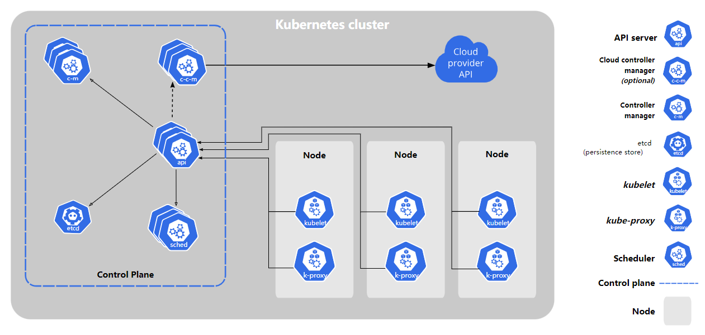

# kubernetes

## 概念

是一种生产级别的容器编排系统，或者说是微服务和云原生平台。

简单来说，**微服务就是采用容器技术的面向服务架构**。它依然使用"服务"作为功能单元，但是变成了轻量级实现，不需要新增服务器，只需要新建容器（一个进程），所以才叫做"微服务"。**一个微服务就是一个独立的**[**进程**](https://www.ruanyifeng.com/blog/2013/04/processes_and_threads.html)**。** 这个进程可以运行在本机，也可以运行在别的服务器，或者在云端（比如云服务和云函数 FaaS）。注意，容器的实现不仅仅是Docker。

微服务框架目前主要就是三种：Spring Cloud（Netflix）、Dubbo（阿里）和K8S（谷歌）

## 组成元件

Container：

容器，将应用程序沙箱化，且包含应用程序执行所需的所有内容，让其无需再透过另外部署安装，即可在容器平台上执行。

Pod：

Pod是K8s运作的最小单位，可以称为“容器集”，即一个Pod内部可能包含一个或多个容器。而一个Pod会对应到一个应用程序，同一个Pod下的所有容器则可以共享相同的网络资源（例如IP地址，主机名称等）。

Node：

分为两种——Worker Node 和 Control Plane

Worker Node 为主要的运行节点，且一个Worker Node会对应一个机器。内部还可以细分为kublet（容器控制），kube-proxy（网络服务）及Container Runtime（容器运行）3个元件。Worker Node 中包含多个Pod，是实际运行的单位。

Control Plane 也称为 Master Node，负责各个 Worker Node 的管理，其内部由kube-apiserver（API入口）、etcd（配置信息）、kube-scheduler（节点绑定）以及kube-controller-manager（集群管理）四个元件组成。总管，本身没有Pod。

### Worker Node

**kublet**：kubelet 是运行在每个 Worker Node 上的主要组件，负责与控制平面通信，并确保容器在 Pod 中按照用户定义的方式运行。

功能：

* 接收由控制平面提供的 Pod 规范，并确保容器在这些规范下按预期运行。
* 监控容器的状态，报告给控制平面。
* 与容器运行时（如Docker、Containerd）交互，启动或停止容器。

**kube-proxy**：kube-proxy 是负责维护节点上的网络规则的网络代理。它在每个节点上运行，支持 Kubernetes 服务抽象

功能：

* 监听 API server 上 Service 和 Endpoint 的变化。
* 在节点上维护网络规则以确保 Service 可以路由到相应的 Pod。
* 提供负载均衡，将服务流量分发到后端的 Pod。

**Container Runtime**：容器运行时是 Kubernetes 用来运行容器的软件，负责管理容器的生命周期、镜像和资源隔离

功能：

* 与 kubelet 通信，通过容器运行时创建和管理容器。
* 处理容器的启动、停止、暂停等操作。
* 提供容器隔离，确保容器之间相互隔离。

### Control Plane

**kube-apiserver**： kube-apiserver 是 Kubernetes 控制平面的入口，是整个系统的 API 服务器。所有的操作都通过 kube-apiserver 进行处理。

功能：

* 提供 RESTful API，允许用户、管理者和其他组件与 Kubernetes 集群进行交互。
* 将用户操作转换为内部的操作，然后传递给其他控制平面组件。

**etcd**： etcd 是一个分布式键值存储系统，用于存储 Kubernetes 集群的所有配置数据，包括集群状态、配置信息等。

功能：

* 作为控制平面的数据存储后端，存储集群的持久化数据。
* 提供高可用性，保证数据的一致性和可靠性。

**kube-scheduler**： kube-scheduler 负责监视新创建的未指定运行节点的 Pod，并选择一个节点来运行该 Pod

功能：

* 考虑诸多因素，如硬件/软件要求、亲和性和阻挡性规则，选择最优节点。
* 将 Pod 绑定到选定的节点上。

**kube-controller-manager**：启动控制器，它们负责集群中的常规运行和管理进程

功能：

* Node Controller：负责维护节点的状态，确保节点正常运行。
* Replication Controller：负责维护系统中的副本集，确保指定数量的 Pod 副本在运行。
* Service Controller：负责创建、更新和删除服务。
* Endpoint Controller：负责将 Service 与相关的 Pod 集合关联起来。

## 优势

1.服务，系统部署方便：容器的部署方便

2.自动化管理：K8s会自动侦测，管理各容器的状态。如果有需要，可对Container执行自动扩展。若侦测到容器发生故障，可自动重启以确保服务正确且持续运行

3.弹性化运用：K8s的每个服务和每个容器都可以修改，使得使用范围非常大。
