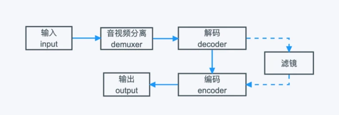

# FFmpeg基本命令

## ffmpeg处理流程

插入文件 -> 解封装数据包 -> 解码数据帧 -> 编码数据帧 -> 封装数据包 -> 输出文件


## ffmpeg处理音视频数据

### 音视频转换

```sh
ffmpeg -i input.mp4 -acodec copy -vcodec libx264 -s 1280x720 output.flv
```

-acodec copy 对音频文件不做编解码处理

-vcodec libx264 对视频文件进行libx264编码（是一个实现了H.264编码的库），得到flv后缀文件

### 仅提取音频/视频

```sh
ffmpeg -i test.mp4 -acodec copy -vn audio.mp4    仅提取音频（-vn代表对视频不做处理）
ffmpeg -i test.mp4 -vcodec copy -an video.mp4    仅提取视频
```

仅提取视频与音频的命令行最好分别写上-an和-vn

强制更改格式时修改copy为对应的编解码器全名即可

### 提取YUV/RGB

YUV——描述图像颜色的颜色空间，将图像的亮度（Y）和色度（UV）分离，是一种颜色表示方式。

RGB也是颜色空间，但一般用于显示，而YUV主要用于压缩，以实现视频的高效传输。

这里提取3秒数据，分辨率转为320x240

```sh
ffmpeg -i test.mp4 -t 3 -pix_fmt(指定像素格式) yuv420p -s(指定分辨率，也就是视频的宽和高) 320x240 yuv420p_320x240.yuv
```

-s后的分辨率一定要与原输入一致，不然生成的yuv数据播放的内容只有色块

提取RGB同理，仅需要更改指定像素格式，-s后的分辨率与原输入一致

```sh
ffmpeg -i test.mp4 -t 3 -pix_fmt(指定像素格式) rgb24 -s 320x240 yuv420p_320x240.rgb
```

RGB和YUV之间的转换

```sh
ffmpeg -i yuv420p_320x240.yuv  -s 320x240 -pix_fmt rgb24 rgb24_320x240.rgb
```

-video_size 选项通常在编码器初始化时使用，而 -s 选项在编码器被打开后进行修改。但在大多数情况下，这两个选项是等效的。

### 提取PCM

```sh
ffmpeg -i 1.mp3 -ar 48000 -ac 2 -sample_fmt s16le s16le.pcm
```

-ar：采样率

-ac：音频通道数，一般不指定视频通道数（没有-vc的选项）

-sample_fmt s16le：将输出文件的音频采样格式设置为 16 位小端字节序的线性 PCM（也可以用-f）

-f：指定封装格式，一般不需要线性指定

### 修改视频帧率

```sh
ffmpeg -i test.mp4 -r 15 output2.mp4
```

-r： 帧率

修改帧率时不能加-codec copy，因为帧率的改变可能会与视频流的时间基（Time Base）不匹配

### 修改视频/音频码率

码率：单位时间内文件的数据量，以每秒的比特数表示，它决定了视频的压缩程度和清晰度，即高码率通常对应更高的视频质量，但也导致文件更大。

```sh
ffmpeg -i test.mp4 -b:v 400k output_b.mkv
ffmpeg -i test.mp4 -b:a 192k output_b.mkv
```


## ffmpeg裁剪与合并视频

### 三个不同的视频每个视频截取10秒内容

```sh
ffmpeg -i first.mp4 -ss 00:05:00 -t 10 -codec copy 1.mp4
ffmpeg -i second.mp4 -ss 00:05:00 -t 10 -codec copy 2.mp4
ffmpeg -i third.mp4 -ss 00:05:00 -t 10 -codec copy 3.mp4
```

-ss：用于指定从输入文件的哪个时间点开始处理。可以将其看作是起始时间戳。可以与-t一起使用，不然就从开始点一直到结尾。

### 将上述的1/2/3.mp4转换成ts格式

```sh
ffmpeg -i 1.mp4 -codec copy -vbsf h264_mp4toannexb 1.ts
ffmpeg -i 2.mp4 -codec copy -vbsf h264_mp4toannexb 2.ts
ffmpeg -i 3.mp4 -codec copy -vbsf h264_mp4toannexb 3.ts
```

-vbsf是视频比特流滤镜的选项，和-vf的视频滤镜不同

视频比特流滤镜用于处理视频编码的比特流。它通常用于执行一些特定的编码或封装格式的处理，如将 H.264 编码的比特流从一个封装格式转换为另一个。

h264_mp4toannexb滤镜的作用是将 H.264 编码的视频比特流从 MP4 封装格式转换为 Annex B 格式。在转成ts格式时需要使用-vbsf来实现兼容性。

### 以mp4格式进行拼接(ts格式同理)

```sh
第一种：
ffmpeg -i "concat:1.mp4|2.mp4|3.mp4" -codec copy out_mp4.mp4
第二种：
ffmpeg -f concat -i mp4list.txt -codec copy out_mp4_2.mp4
在mp4list.txt写下文件名称，这里三个文件分成三行，分别写上file '1/2/3.mp3'
```


## ffmpeg滤镜使用

滤镜主要是用来实现图像的各种特殊效果



ffmpeg内置了大概近400种滤镜，我们可以用 ffmpeg -filters 命令查看所有的滤镜，也可以用命令 ffmpeg -h filter=xxx 或者查看官方文档了解每一种滤镜。

针对滤镜的处理，ffmpeg提供了两种处理方式，简单滤镜和复杂滤镜。

### 简单滤镜

只有一个输入和输出，而且保证输入和输出的流类型相同

例如在末尾提到的把原视频 r3.mp4 等比例缩放一倍：

```sh
ffmpeg -i r3.mp4 -vf scale=272:480 -y filter.mp4
```

-vf 是 -filter:v 的简写，类似的我们还可以使用 -filter:a 或者 -af 针对音频流做处理。

scale滤镜用于调整视频的大小，比如等比例缩放、等比例放大，不做等比例操作输出就变形了，变形结果我们一般不考虑。原视频 r1ori.mp4 的分辨率是 544x960，所以等比例缩放一倍，上面的命令直接指定了 272x480。

原视频缩放一倍我们还可以这样写：

```sh
ffmpeg -i r3.mp4 -vf scale=iw/2:ih/2 -y filter.mp4
```

iw/ih：视频宽度/高度

当结果不整除时的情况，如iw=301，直接写/2会失败，这时候可以使用-2来让ffmpeg自己等比例计算，等比例计算需要有一边提供比例

```sh
ffmpeg -i r1ori.mp4 -vf scale=300:-2 -y filter.mp4 输出结果视频的分辨率是 300 × 530
```

当遇到需要的比例特殊且不能变形时，则需要遵循以下规则：

1. 宽高都偏小，不拉伸，不缩放
2. 宽高都偏大，等比例缩小，以高度为准
3. 宽超出范围，等比例缩小，以宽为准
4. 高超出范围，等比例缩小，以高为准

### 复杂滤镜

相对于简单滤镜，复杂滤镜是可以处理任意数量输入和输出效果的滤镜图。

复杂滤镜用命令 -filter_complex 表示，它还有一个别名 -lavfi。

使用复杂滤镜将输入视频 r3.mp4 等比例缩放一倍

```sh
ffmpeg -i r3.mp4 -filter_complex "[0]scale=272:480[out]" -map 0:a -map "[out]" -y filter.mp4
```

命令行内容为：

1. 命令 "[0]scale=272:480[out]" 中的[0]表示第一个输入的视频，因为要对视频做处理，所以也可以用[0:v]表示，如果要对音频单独处理，就需要用 [0:a] 了；
2. [0] 结合scale滤镜，表示的就是把第一个输入的视频作为scale滤镜的参数输入；
3. [out] 中括号是必须要的，out是自定义的一个别名，结合scale滤镜，表示的是把scale滤镜输出的结果命名为[out]，但并非是最终输出的结果，只能作为中间过程输出的一个结果；
4. -map 0:a在如果只有一个音频流的情况下可以省略
5. -map "[out]" 就是直接选择[out] 流作为输出
6. -y 选项用于覆盖目标文件（如果存在）而无需用户确认

复杂滤镜严格要求一个滤镜的输出作为另一个滤镜的输入，这样就极大的避免了写多条命令反复编解码操作。因为有损编解码器反复编解码操作会降低原视频质量。

比如现在要把原视频 r1ori.mp4 的中间部分裁剪出来，但仍保持原视频的分辨率544x960

```sh
ffmpeg -i r1ori.mp4 -filter_complex "nullsrc=s=544x960[background]; \
crop=iw:(ih/2 - 110):0:250[middle]; \
[background][middle]overlay=shortest=1:x=(main_w-overlay_w)/2:y=(main_h-overlay_h)/2[out]" \
-map "[out]" 
-map 0:a 
-movflags +faststart 
-y fc.mp4
```

nullsrc滤镜：用于创建一个空的视频，简单的说就是一个空的画布或者说是绿布，因为默认创建的颜色是绿色的。s用于指定画布的大小，默认是320x240，这里表示我们创建一个544x960的画布，并命名为background；

crop滤镜：用于裁剪视频，也就是说视频的任意区域任意大小都可以裁剪出来。这里裁剪原视频的中间部分并命名为middle

```sh
crop=out_w:out_h:x:y
out_w： 输出视频的宽度。
out_h： 输出视频的高度。
x： 裁剪区域的起始 X 坐标。
y： 裁剪区域的起始 Y 坐标。
```

overlay滤镜：表示两个视频相互叠加。main_w和main_h表示主视频的宽高，overlay_w和overlay_h表示叠加视频的宽高。shortest设为1，表示以middle的视频时间为最终时间。（nullsrc创建了一个没有时间轴的画布）

如果要把A视频叠加到B视频上，则main_w和main_h表示B视频的宽高，overlay_w和overlay_h表示A视频的宽高。合起来便是把middle叠加到background之上且置于out的中间，叠加了层。

最后一个参数是-movflags，它跟mp4的元数据有关，设为faststart表示会将moov移动到mdat的前面，在线播放的时候会稍微快一些。


