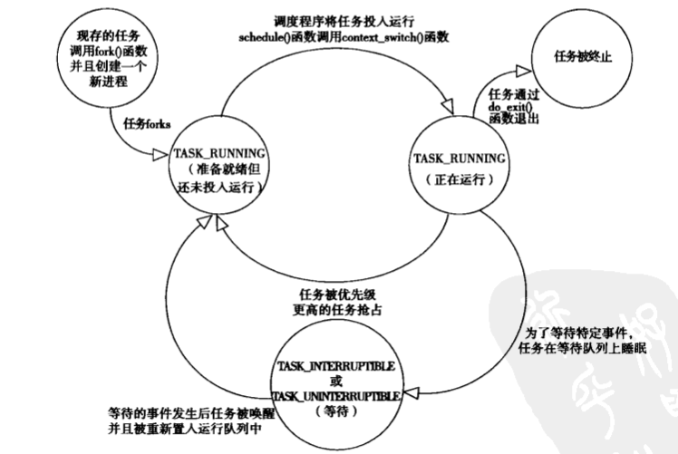
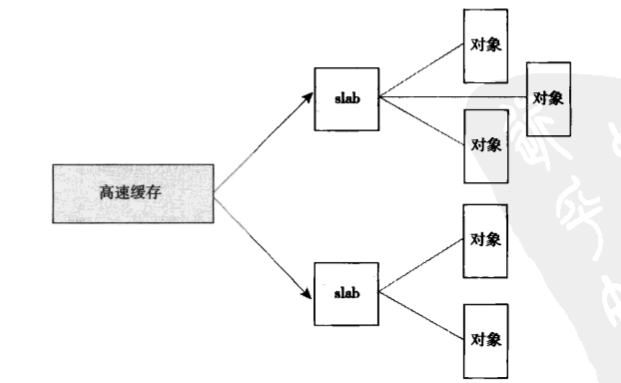
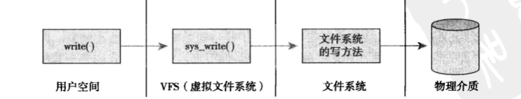
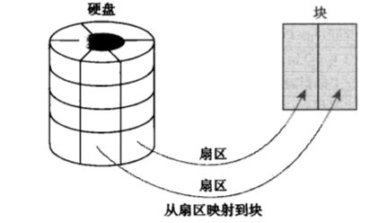

# Linux内核设计与实现

## 进程管理

### 进程描述符

内核把进程的列表存放在叫做任务队列的双向循环链表中，链表中每一项都是类型为task_struct，称为进程描述符的结构，进程描述符包含一个具体进程的所有信息。task_struct相对较大，包含的数据能够完整的描述一个正在执行的程序：打开的文件，进程的地址空间，挂起的信号，进程的状态等。

task_struct（进程描述符）具体包括了：

1. **标示符**： 描述本进程的唯一标识符，用来区别其他进程。
2. **状态** ：任务状态，退出代码，退出信号等。
3. **优先级** ：相对于其他进程的优先级。
4. **程序计数器**：程序中即将被执行的下一条指令的地址。
5. **内存指针**：包括程序代码和进程相关数据的指针，还有和其他进程共享的内存块的指针。
6. **上下文数据**：进程执行时处理器的寄存器中的数据。
7. **I/O状态信息**：包括显示的I/O请求,分配给进程的I/O设备和被进程使用的文件列表。
8. **记账信息**：可能包括处理器时间总和，使用的时钟数总和，时间限制，记账号等。

#### 分配进程描述符

Linux通过slab分配器分配task_struct结构，这样能达到对象复用和缓存着色的目的。这样的优势还在于让寄存器较少的硬件结构只通过栈指针就能计算出它的位置，而避免使用额外的寄存器专门记录。现在用slab分配器动态生成task_struct，所以只需要在栈底或栈顶（沿着栈的增长方向）创建一个新的结构struct thread_info。

1. slab分配器是Linxu内核中用于管理内存的机制，它将内存划分为多个slabs，每个slab包含相同大小的内存块，当需要分配内存时，直接从slab中提取内存块，而不是每次都申请新的内存，提高了内存管理的效率。
2. 每个任务（进程）都有一个对应的内核栈，这个内核栈用于处理进程在内核态下的函数调用，中断处理和异常处理等，当进程从用户态切换到内核态时，会使用相应的内核栈执行内核代码。进程的内核栈并不保存task_struct结构，而是使用thread_info结构定位或操作相应的task_struct。
3. 进程的内核栈通常在内核空间中，用于在内核模式下执行时保存执行上下文，函数调用信息和局部变量等。

#### 进程描述符的存放

内核通过唯一的进程标识符或PID来表示每个进程。PID为pid_t隐含类型，实际就是一个int类型，为了与老版本兼容，这个指的设定默认值为32768（short int的最大值，注意有一个位要表示符号位）。

#### 进程状态（注意与操作系统中进程的状态区分）

系统中的每个进程必然处于五种进程状态中的一种，task_struct结构下的state值也必为以下五种状态标志之一：

1. TASK_RUNNING（运行）——进程是可执行的，此时要么正在运行，要么在运行队列中等待运行。这是进程在用户空间中执行的唯一可能的状态，这种状态也可以应用到内核空间中正在执行的进程。
2. TASK_INTERRUPTABLE（可中断）——进程正在睡眠（被阻塞），等待某一些条件的达成。一旦条件达成，内核就会把状态设置为运行，处于此状态的进程的进程也会因为接收到信号而提前被唤醒并准备运行。
3. TASK_UNINTERRUPTABLE（不可中断）——除了就算是接收到信号也不会被唤醒或准备投入运行外，这个状态与可打断状态相同。这个任务通常在进程必须在等待时不受干扰或等待事件很快就会发生时出现。处于此状态的任务对信号不做相应，因此相较于中断中断运用的较少。不可中断状态的关键在于强制性的独占，**用来保证原子性**，它不需要切换到运行状态，因为它已经在独占的执行内核代码了。
4. TASK_TRACED（跟踪）——被其他进程跟踪的进程，例如通过ptrace对调试程序进行跟踪。
5. TASK_STOPPED(停止)——进程停止执行，进程没有投入运行也不能进行运行。这种状态往往发生在接收到SIGSTOP，SIGTSTP，SIGTTIN，SIGTTOU等信号的时候。此外，在调试期间接受到任何信号，都会使进程进入这个状态。



如果想要调整进程的状态，可以使用如下函数：

```c
set_task_state(task, state);  // 将任务task的状态设置为state
```

#### 进程上下文

可执行程序代码是进程的重要组成部分，这些代码从一个可执行文件载入到进程的地址空间执行。一般程序在用户空间执行。当一个程序执行了系统调用或触发了某个异常，它就需要进入内核空间进行相应的处理。此时，我们称**内核“代表进程执行”并处于进程上下文中**。

除非在此间隙有更高优先级的进程需要执行并由调度器做出了相应的调整，否则在内核退出时，程序在用户空间会恢复并继续执行。

除了进程上下文外，还有**中断上下文**。中断上下文中，系统不代表进程执行，而是执行一个中断处理程序。不会有进程去干扰这些中断处理程序，所以此时不存在进程上下文。

#### 进程家族树

Unix系统的进程之间存在明显的继承关系，Linux中也是如此。所有的进程都是PID为1的init进程的后代。内核在系统启动的最后阶段启动init进程。该进程读取系统的初始化脚本并执行其他的相关程序，最终完成系统启动的整个过程。

系统中的每个进程必有一个父进程，对应的，每个进程也可以拥有0或多个子进程。进程间的关系也存放在进程描述符中。每个task_struct都包含一个指向父进程task_struct，叫做parent的指针，还包含一个称为children的子进程链表。

### 进程创建

Unix的进程创建与其他操作系统差别很大，其他的操作系统往往采用产生（spawn）进程的机制，首先在新的地址空间里创建进程，读入可执行文件，最后开始执行。

Unix将上述步骤分成了两个函数去执行：fork函数和exec函数族（内核实现了execve函数，再次基础上还实现了其他接口）。首先，fork()通过拷贝当前进程创建了一个子进程。子进程与父进程的区别仅仅在于PID（每个进程唯一），PPID（父进程的进程号，子进程将其设置为被拷贝过程的PID）和某些资源和统计量（例如挂起的信号，它并没有被继承）。exec()函数负责读取可执行文件并将其载入地址空间开始运行。

#### 写时拷贝

传统的fork函数的缺陷：

1. 传统的fork()会直接把所有的资源复制给新创建的进程，这种实现简单但效率低下，因为它拷贝的数据也许并不共享（文件描述符，内存空间，挂起的信号等都是独立的，或者说父进程并不共享的内容）。
2. 如果新进程打算执行一个新的image，那么所有的拷贝并没有意义。

当前Linux的fork()使用写时拷贝页（copy-on-write）实现。写时拷贝是一种可以推迟甚至免除拷贝数据的技术，内核此时并不复制整个进程地址空间，而是让父进程和子进程共享一个拷贝。只有在需要写入的时候，数据才会被复制，从而使各个进程拥有各自的拷贝。在这种情况下，资源的复制被推迟到了写入操作发生时进行。在页没有被写入的情况下（即没有调用exec()时），它就无需复制了。

fork()的实际开销就是复制父进程的页表以及给子进程创建唯一的进程描述符。在一般情况下，进程创建后都会马上执行一个可执行文件(执行exec函数)，这种优化避免了拷贝不会被使用的数据。

#### fork()

Linux通过系统调用clone实现fork等库函数的实现。这个调用通过一系列的参数标志来指明父子进程需要共享的资源。

在没有引入写时复制到fork中时，常常使用vfork()来代替fork()的实现，vfork()和fork()的区别在于不拷贝父进程的页表项，并且子进程作为父进程的单独线程在地址空间里运行，父进程被阻塞，直到子进程退出或执行exec()。

### 线程在Linux中的实现

线程提供了在同一程序内共享内存地址空间运行的一组线程。这些线程还可以共享打开的文件和其他资源。线程机制支持并发程序设计，并且在多核处理器上能保证真正的并行处理。

Linux实现线程的机制非常独特，它并没有线程这个概念，因此将线程都当做进程来实现。它仅仅被视为一个与某些进程共享某些资源的进程。每个线程都拥有隶属于自己的task_struct，所以在内核中，它就是一个独立的进程。

对于其他操作系统而言，它们的内核为线程提供了专门的机制，它们的进程描述符中往往包含着指向多个不同线程的指针，而Linux则是简单的拥有相应数量的进程描述符，更加直接。线程被称为“轻量级进程”也是专属于Linux的实现模式。

#### 创建线程

线程的创建和普通进程的创建类似，但在clone()的时候需要传递一些参数标志来指明共享的资源，例如：

```c
clone(CLONE_VM | CLONE_FS | CLONE_FILES | CLONE_SIGHAND, 0);
// 分别表示“共享地址空间”，“共享文件系统信息”，“共享打开文件”，“共享信号处理函数和被阻断的信号”
```

#### 内核线程

内核经常需要在后台执行一些操作，这些任务可以通过内核线程完成。内核线程是独立运行在内核空间的标准进程。

内核线程和普通进程的核心区别在于内核线程没有独立的地址空间（指向地址空间的指针被设置为NULL）。它们只在内核空间运行，不切换到用户空间中去。不过他们既可以被调度，也可以被抢占。内核线程是只能由其他内核线程创建的。

### 进程终结

进程无论是正常还是异常退出，最终都需要do_exit()进行收尾工作，在该函数执行完成后，与进程相关联的资源就会被全部释放（假设进程是这些资源的唯一使用者）。进程不可运行（没有地址空间让他运行）并处于EXIT_ZOMBIE退出状态。它占用的所有内存就是内核栈，thread_info结构和task_struct结构。此时进程存在的唯一目的就是向它的父进程提供信息。父进程检测到信息后通知内核，进一步将剩下的占用内存释放。

#### 删除进程描述符

do_exit后保留进程描述符的唯一目的是让系统仍然可在它终结后获得信息。当父进程获得了已终结的子进程信息后，子进程的task_struct结构才被释放。

删除进程描述符是通过wait族函数和release_task()实现的，wait族函数通过系统调用wait4()实现。它挂起调用它的进程，直到其中的一个子进程退出，此时函数会返回子进程的PID。此外，调用此函数时提供的指针会包含子函数退出时的退出代码。再之后调用release_task()，释放进程描述符。

#### 孤儿进程

显然，如果此时父进程在子进程之前退出，必须有机制来保证子进程一定能找到一个新的父亲，否则这些称为孤儿的进程会在退出之前永远处于僵死状态，白白消耗内存。对于这个问题，解决方法是给子进程在当前所在的线程组内找到一个线程作为父亲，如果不行，就让init做他们的父进程。


## 进程调度

### 多任务

多任务系统可以划分为两类：非抢占式和抢占式多任务。Linux执行的是抢占式的多任务模式。

抢占式的多任务下，由调度程序决定什么时候停止一个进程的运行，以便其他进程能够得到执行机会。这个强制的挂起动作叫做抢占。进程在被抢占之前能够运行的时间都是预先被设置好的，而且有一个专门名称，叫做进程的时间片。

### 进程的消耗类型

进程可以被分为I/O消耗型和处理器消耗型。前者指进程的大部分时间用来提交I/O请求或等待I/O请求。因此，这样的进程经常处于可运行状态，但运行的时间往往很短，因为他在等待更多的I/O请求时一定会阻塞。

相反，处理器耗费型进程把时间大多用在执行代码上。除非被抢占，否则他们通常会一直不停地运行，因为他们没有什么IO需求。但是，对于系统的响应速度而言，调度器不应该让他们反复运行（即快用快还）。对于这类处理器消耗型的进程，调度策略往往是尽量降低他们的调度频率，而延长他们的运行时间。

不过，这种划分方式并非决定，有些进程可以同时展现出这两种行为，例如服务器等等。

调度策略通常要在两个矛盾的目标中寻找平衡：进程响应迅速（响应时间短）和最大系统利用率（高吞吐率）

不同的调度策略对于上述两种类型的倾向是不同的，对于Linux，为了保证桌面系统和交互式应用的性能，更倾向于优先调度I/O消耗型进程。

### 进程优先级

Linux采用两种不同的优先级策略：

1.nice值，他的范围从-20到+19，默认值是0，越大的nice值代表更低的优先级（“nice”表示对系统中的其他进程更加优待）。nice值的使用方式在不同的Unix系统下各不相同，例如在Mac OS中，进程的nice值表示分配给进程的时间片的绝对值，而Linux系统中，nice值表示分配给进程的时间片的比例。

2.实时优先级，它的值可配置，默认范围为0到99（包括边界）。越高的数值表示进程的优先级越高。任何实时进程的优先级都高于普通进程，即实时优先级和nice优先级处于不同的两个范畴。

### Linux调度算法

Linux的调度器是以模块方式提供的，这样做的目的是允许不同类型的进程可以有针对性的选择调度算法。

这种模块化结构被称为调度器类，它允许多个不同的可动态添加的调度算法并存，调度属于自己范畴的进程。每个调度器都有一个优先级，它会按照优先级顺序遍历调度器，拥有一个可执行进程的最高优先级的调度器类胜出，去选择下面要执行的程序。

完全公平调度（CFS）是一个针对普通进程的调度类，也是最常用的一种调度方法。

### CFS公平调度

CFS的出发点基于一个简单的理念：进程调度的效果应如同系统具备一个理想的多任务处理器。当然这种理想情况缺乏对调度抢占和缓存效率等的考虑，不过CFS则更加充分考虑了这种额外损耗，并确保性能不受损失。

CFS的做法是允许每个进程运行一段时间，循环轮转，选择运行最少的进程作为下一个运行进程，而不再采用分配给每个进程时间片的做法了。CFS在所有可运行进程总数基础上计算出下一个进程应该运行多久，而不是依靠nice值来计算时间片。nice值在CFS中被作为进程获得的处理器运行比的权重，越高的nice值获得更低的权重。

每个进程都按照其权重在全部可运行程序中所占比例的“时间片”来运行，为了计算精确的时间片，CFS为完美多任务中的无限小调度周期的近似值设立了一个目标，这个目标称为“目标延迟”，越小的调度周期带来越好的交互性，但必须也要能够接受更高的切换代价和更差的系统总吞吐。显然，当可运行数量趋近于无限时，它们获得处理器时间片一定会不断趋于0，这就无疑造成了不可接受的切换损耗。CFS为此引入每个进程获得的时间片底线（即最小的运行时间），确保切换消耗被限制在一定范围内。任何进程实际可获得处理器时间由nice的相对差值（一定注意是相对差值）和时间片底线决定。

如何找到下一个相对较小的vruntime（虚拟运行时间）——使用红黑树查找实现。

### 抢占和上下文切换

#### 上下文切换

指的是一个可执行进程切换到另一个可执行进程，它完成两项工作：

1. 调用switch_mm()，把虚拟内存从上一个进程映射到新进程中（虚拟地址变换，从一个进程的页表切换到另一个进程的页表）
2. 调用switch_io()，负责从上一个进程的处理器状态切换到新进程的处理器状态。这包括保存，恢复栈信息和寄存器信息，还有其他与体系结构相关的信息，都必须以每个进程为对象进行管理和保存

#### 抢占

抢占包括两种，即用户抢占和内核抢占。

用户抢占是指从内核空间返回到用户空间时发生的抢占，显然这种抢占发生的时间只能是中断和系统调用返回时。

Linux还完整的支持内核抢占，只要没有持有锁，就可以进行内核抢占。

内核抢占发生的场合如下：

​	1.中断处理程序正在执行，且返回内核空间之前。

​	2.内核代码再一次具有可抢占性的时候。

​	3.如果内核中的任务显式地调用schedule()。

​	4.如果内核中的任务阻塞（此时也会导致调用schedule()）。

### 实时调度策略

Linux提供两种实时调度策略：SCHED_FIFO和SCHED_RR。而普通的，非实时的调度策略是SCHED_NORMAL。

SCHED_FIFO实现了一种简单的，先入先出的调度算法：不使用时间片，处于可运行状态的SCHED_FIFO级进程一定会比SCHED_NORMAL优先调度。并且在执行时实现部分的非抢占（除非有更高优先级的SCHED_FIFO或SCHED_RR进行抢占）。

SCHED_RR和SCHED_FIFO大体上相同，只是SCHED_RR级的进程在耗尽预先分配的时间后就不能再继续执行了。显然，SCHED_RR是带有时间片的SCHED_FIFO。

这两种实时算法实现的都是静态优先级，内核不需要对优先级进行额外的计算，这能保证给定优先级别的实时级别进程一定能抢占比他优先级低的进程。

Linux的实时调度算法提供了一种软实时的工作方式，软实时的含义是，内核调度进程，尽力使进程在它的限定时间到来前运行，但内核不保证总能满足这些进程的要求。


## 系统调用

系统调用在用户空间进程和硬件设备之间添加了一个中间层。这个层的主要作用有三个：

1. 为用户空间提供了一种硬件的抽象接口
2. 系统调用保证了系统的稳定和安全
3. 为了让每个进程运行在虚拟地址空间下，同时实现多任务运行，需要通过公共接口来提醒内核进行运行

要访问系统调用（在Linux中常被称作syscall），通常通过C库中定义的函数调用进行。

每个系统调用会被赋予一个系统调用号，系统调用号唯一且不可删除。

用户空间程序无法直接执行内核代码，它们不能直接调用内核空间中的函数，因为内核驻留在受保护的地址空间上。如果进程可以直接在内核的地址空间读写，呢么就无法保证系统的安全与稳定性。因此应用程序应该以某种方式通知系统来执行相应的系统调用。

通知内核的机制是通过软中断实现的。通过引发一个异常来促使系统切换到内核态去执行异常的处理程序。此时的异常处理流程实际上就是系统调用处理程序。

在陷入内核时，还需要把系统调用号一并传给内核。系统调用时需要的外部参数也在此时一并传给内核。

### API，POSIX和C库

一般情况下，应用程序通过在用户空间实现的应用编程接口（API）编程，一个API定义了一组应用程序使用的编程接口。

在Unix系统中，这些API接口大多是基于POSIX标准的，POSIX标准保证了在UNIX系统上的兼容性。即便非Unix系统，例如Windows，也提供了与POSIX兼容的库进行支持。

Linux的系统调用和大多数Unix系统一样，作为C库的一部分提供。C库实现了Unix系统的主要API，包括标准C库接口和系统调用接口。此外，C库提供了POSIX的绝大部分API。

程序员与API交互，内核与系统调用交互。实现了一种普遍的隔离。


## 中断和中断处理

Linux在相应一个特定中断的时候，内核会执行一个函数，叫做中断处理程序或中断服务例程（ISR）。产生中断的每个设备都有一个相应的中断处理程序。

中断处理程序与其他内核函数的核心区别在于，中断处理程序是被内核调用来响应中断的，而它们运行在名为中断上下文的特殊上下文中。

**系统调用使用了软中断的机制，因此也可以视为一种中断**

### 中断处理

中断处理首先会被切分成两个部分，中断处理程序是上半部，即接受一个中断后立即执行处理程序，但只做有严格时限的内容（往往是硬件层面的）。允许稍后完成的工作会被推迟到下半部。在合适的时机，下半部会开始执行。

下半部的任务是执行与中断处理密切相关的程序。下半部分的关键是可以响应所有的中断，不会如同上半部分一直处在中断屏蔽状态。

下半部分的实现分为三种：软中断，tasklets和工作队列。

软中断/tasklet：tasklets也是使用软中断机制实现的，相较于软中断来说接口更简单，锁保护的要求更低。软中断机制会检查哪些中断的流程需要再下半部执行，并依次执行它们。总的来说，tasklet的使用范围更广。

工作队列：工作队列可以把工作推后，交给一个内核线程执行，这个部分则会在进程上下文中执行，并允许调度和睡眠。因此如果推后执行的任务需要睡眠，就需要使用工作队列而不是软中断/tasklets。

### 中断上下文

当执行一个中断处理程序时，内核处于中断上下文中。

进程上下文是内核所处的操作模式，表示内核代表进程运行，在进程上下文中，可以调用current宏关联当前进程。此外，因为进程是以进程上下文的形式连接到内核中的，因此，进程上下文可以睡眠，也可以调用调度程序。

与进程上下文不同，中断上下文与进程无关，因为没有后备进程，所以中断上下文不可以睡眠。且中断上下文往往具有较为严格的代码，因为它打断了其他的代码。“打断代码”的特性决定了我们需要将工作和中断处理分开，工作放在整个程序的下半部执行，而在上半部执行打断的部分，尽可能减少打断的影响。


## 内核同步方法

1. 原子操作：利用原子性

2. 自旋锁：Linux内核实现的自旋锁不可递归，如果试图等待一个正持有的锁，必须自旋，等待自己释放这个锁。自旋锁可以使用在中断处理程序中（不能使用信号量，因为会导致睡眠）。自旋锁的问题主要包括：高负载（频繁争用导致性能浪费），优先级反转，忙等待（线程一直运行）。

3. 读写锁：读多写少的情况，但写锁优先，可能导致读锁的饥饿，且写多的情况不如简单的互斥锁。读锁S锁，写锁X锁。

4. 信号量：当加锁时间可能很长且会出现睡眠情况时使用。

5. 读写信号量：读者数不限，只有在没有读者，且只有一个写者时才能获得写锁（信号量-1）。读写信号量和读写锁除了锁粒度方面的差别外其他差别很少，都不能保证写者的优先级。

6. 互斥量mutex：信号量外允许睡眠的锁。

7. BKL大内核锁：可以睡眠，不会导致任务死锁。是一个递归锁，不能在中断上下文请求，只能用在进程上下文中。

8. 顺序锁：seq锁，依靠一个序列计数器，当有数据被写入时会得到一个锁，并且序列值会增加，在释放该锁时也会增加序列值。在读取数据之前和之后都会对这个序列值进行检查，如果读取的值前后不变，表明没有写操作。此外，如果读取的值是偶数，表明一个写操作已经处理完成。（锁的初值为0，写锁会导致值变奇数，释放后变成偶数）。

    seq锁的开销更低，并且读者和写者在等待时是不会持有锁的，因此不会对其他线程发生阻塞。seq锁还更适合非互斥的场景，这里的非互斥指的是读者的非互斥，读者在进入前会检查序列号是否为奇数，如果不是就会进入，在读取完毕后会再检查一次序列号，如果序列号发生了变化（只要变了），说明读取期间可能有写者修改了共享资源，读者需要重新读取。通过序列号的比较，实现了读者的非互斥性。


## 内存管理

内核的内存分配方法和其他地方非常不同，一方面是内核并不能奢侈的进行分配，另一方面是内核不能睡眠。

### 页

内核把物理页作为内存管理的基本单位。尽管处理器的最小寻址单元通常为子节，但内存管理单元（MMU，管理内存并将虚拟地址转换为物理地址的硬件）通常以页作为单位进行处理。MMU以页为大小来管理系统中的页表。从虚拟内存的角度来看，页就是最小单位。

大多数32位体系支持4KB的页，而64位系统一般会支持8KB。

系统中的每个物理页都需要分配一个结构体page来管理这个物理页。

### 页表

虽然应用程序操作的是虚拟内存，但处理器操作的物理内存。当用程序访问一个虚拟地址时，首先需要将虚拟地址转化为物理地址，然后处理器才能解析地址的访问请求。地址的转换工作需要通过查询页表才能完成。总的来说，地址转换需要将虚拟地址分段，使每段虚拟地址都作为一个索引指向页表，而页表项则指向下一级别的页表或最终的物理页面。

Linux使用三级页表完成地址转换：

1. 顶层页表是页全局目录，指向二级页目录的表项
2. 二级页表是中间页目录，指向页表
3. 最后一级页表就简称页表

为了更快搜索，绝大部分体系都实现了TLB作为虚拟地址映射到物理地址的缓存。

### 区

由于硬件的限制，有些页位于内存中特定的物理地址上，不能将其用于一些特定的任务。由于这种限制，内核把页划分为不同的区，内核使用区对具体相似特征的页进行分组。Linux必须处理如下两种由于硬件存在缺陷而引起的内存寻址问题：

1. 一些硬件只能用特定的内存地址来执行DMA（直接内存访问）
2. 一些体系结构的内存的物理寻址范围比虚拟寻址范围大的多，这样有一些内存不能永久地映射到内核空间中

根据这2种限制，Linux主要使用四种区：

1. ZONE_DMA——这个区包含的页能用来执行DMA操作。
2. ZONE_DMA32——和ZONE_DMA相似，该区包含的页面可用来执行DMA操作，而和ZONE_DMA不同的核心在于这些页面只有用32位访问。在某些体系结构中该区比ZONE_DMA更大
3. ZONE_NORMAL——能正常映射的页
4. ZONE_HIGHEM——“高端内存”（也可以理解为高位内存），其中的页不能永久地映射到内核地址空间

### slab分配器

为了便于数据的频繁分配和回收，常常需要使用空闲链表的数据结构。空闲链表包含可供使用的，已经分配好的数据结构块，当代码需要一个新的数据结构实例时，就可以从空闲链表中抓取一个，而不是额外声明内存分配。从这个意义上来说，空闲链表相当于对象高速缓存——快速存储频繁使用的对量类型。

仅仅使用空间链表面临的主要问题是难以全局控制，当可用内存变得紧缺时，内核无法通知每个空闲链表，让它收缩缓存的大小以便释放一些内存。实际上，内核根本不知道空闲链表的存在。针对这个问题，slab层（slab分配器）扮演了通用数据结构缓存层的角色。

slab分配器的核心原则和平衡点在于：

1. 频繁使用的数据结构需要缓存他们
2. 频繁分配和回收必然导致内存碎片（大块连续的可用内存会越来越难找）。为了避免这种情况，空闲链表的缓存会连续的存放。因为已释放的内存结构又会放回空闲链表，因此不会导致碎片
3. 回收的对象可以立即进入下一次分配
4. 对存放的对象进行着色，以防止多个对象映射到相同的高速缓存行

### slab层的设计

slab层将不同对象划分为高速缓存组，每个高速缓存组存放不同类型的对象。每种对象类型对应一个高速缓存。例如一个高速缓存用于存放进程描述符（进程描述符task_struct结构组成的空间链表）

然后，这些高速缓存又被划分为多个slab，每个slab由一个或多个物理上连续的页组成（一般情况下为一个页）。

每个slab都包含一些对象成员，即被缓存的数据结构。每个slab处于三种状态：满，部分满或空。当内核需要一个对象时，顺序为从部分满到空（部分满分配完之后才到空）。如果连空的都没有了，则要重新创建一个slab。这种方式可以有效减少内存碎片。




## 虚拟文件系统

虚拟文件系统（有时也叫虚拟文件交换，VFS）作为内核子系统，为用户空间程序提供了文件和文件系统相关的接口。系统中所有文件系统不但依赖VFS共存，而且也依赖VFS系统协同工作。

### 通用文件接口

VFS使得用户可以直接使用open()，read()，write()这样的系统调用而无需考虑具体文件系统和实际物理介质。

之所以能使用抽象的通用接口对所有文件系统进行操作，是因为内核在它的底层文件系统接口上建立了一个抽象层，这个抽象层使Linux能够支持各种文件系统。同时VFS还提供了一个通用文件系统模型，定义了所有文件系统都支持的，基本的，概念上的接口和数据结构。



### Unix文件系统

Unix使用了四种和文件系统相关的传统抽象概念：文件，目录项，索引节点和安装点。

文件系统是特殊的数据分层存储结构，它包含文件，目录和相关的控制信息。在Unix中，文件系统被安装在一个特定的安装点上，该安装点被称为命名空间。所有的已安装文件系统都在一个特定的安装点的枝叶出现在系统中。这种单一且统一的树结构与Windows下将文件的命名空间划分为设备和分区的做法（例如我们常见的C盘，D盘）是相反的。

文件本身可以视为一个有序字符串，通过目录组织起来。Unix系统将文件的相关信息和文件本身区分开来，例如访问控制权限，大小，拥有者等文件相关信息。这些信息也被称为文件的元数据，被存储在一个单独的数据结构中，该结构被称为索引节点（inode）。

### VFS对象及其数据结构

VFS采用面向对象的设计思路，使用一组数据结构来代表通用文件对象。这些数据结构类似于对象，不过因为C语言并不是面向对象的语言，因此结构体在包含数据时同时包含操作这些数据的函数指针，其中操作函数由具体文件系统决定。

VFS有四个主要的对象类型，分别是：

1. 超级块对象，代表一个具体的已安装的文件系统。用于存储特定文件系统信息，通常对应于存放在磁盘特定扇区中的文件系统超级块
2. 索引节点对象，代表一个具体文件。包含了内核在操作文件或目录时所需要的全部信息，以便文件系统使用
3. 目录项对象，代表一个目录项。把目录当做文件，每一个目录项都是单一的部分，这样可以有效避免常规的字符串比较过程。目录项还包括目录项缓存以帮助系统更快找到文件，目录项缓存包含三个部分：被使用的目录项链表，最近被使用的双向链表，用于对给定地址解析相关目录项的散列表
4. 文件对象：由进程打开的文件。进程直接处理的对象

目录项与目录不同，但目录也是另外一种形式的文件。


## 块与I/O层

系统能够随机访问固定大小数据片的硬件设备称为块设备，这些固定大小的数据片就被称为块。最常见的块设备就是硬盘。它们都是以安装文件系统的方式使用的。另一种基本的设备类型是字符设备，它按照字符流的方式有序访问，例如串口和硬盘。与块设备最大的差别在于，字符设备是顺序访问的，而块设备则是随机的。

内核管理块设备比管理字符设备要细致的多，因为块设备需要保证“随机”，即能够在介质的不同区前后移动。而字符设备只需要控制当前位置即可。

块设备的最小可寻址单位是扇区，扇区一般是2的整数倍，最常见的是512字节。扇区是所有块设备的基本单元——块设备无法对比它还小的单元进行寻址和操作。

扇区是物理的寻址单位，但对文件系统来说，他们使用的最小逻辑可寻址单位为“块”。块是文件系统的一种抽象——只能基于块来访问文件系统。虽然物理磁盘寻址都是以扇区级进行，但内核执行所有磁盘操作都是以块进行。同时，由于扇区是设备的最小可寻址单元，因此块一定要比扇区大。另外，内核还要求块大小是2的整数倍，不能超过一个页的长度。通常块的大小是512字节，1KB或者4KB。



### I/O调度程序

他的核心是管理块设备的请求队列，减少磁盘寻址时间，从而提高全局吞吐量。

I/O调度程序通过两种方法减少磁盘寻址时间：合并和排序。合并是指将两个或多个请求结合成一个新请求（例如访问的位置相同或相邻）。排序是指整个请求队列将按照扇区增长方向有序排列，方便磁头以一个方向运动，减少磁盘寻址时间，这种方式类似电梯，也被称为电梯调度。

电梯调度显然很容易引发严重饥饿的问题。这种饥饿在写操作上体现的尤其明显，因为读操作往往具有连续和同步性。

为了解决电梯调度的问题，又提出了以下IO调度算法：

1. 最终期限I/O调度：每个请求有一个超时时间。分成了三个队列进行存储，FIFO的特性保证了在一定时间内一定会执行，其他与Linus电梯调度基本一致。

    派发队列是Linus电梯调度的实现方式，而如果超时，最后期限I/O程序会直接从FIFO队列中提取请求进行服务

2. 预期I/O调度：基础为最终期限I/O调度。它的改进是增加了预测启发能力，在一个请求提交后进行短暂的空闲，通过预测的方法对程序进行重排序，然后按照重新排列的顺序继续进行请求处理。这主要针对读操作进行的优化

3. 完全公正排队I/O调度：将进入的I/O请求放入特点的队列中，这种队列是根据进程的种类区分的。然后在每个队列中进行合并和排序操作。CFQ I/O调度以时间片轮转调度队列，从每个队列中选取请求数进行执行。

4. 空操作的I/O调度：只进行合并，不进行排序，然后根据FIFO队列的方式进行存储和响应。

空操作->电梯调度->最终期限->预期IO，完全公正和基于优先级不在这个讨论范围内


## 页高速缓存和页回写

页高速缓存是Linux内核实现磁盘缓存的手段，它主要用来减少对磁盘的I/O操作。具体来说，是把磁盘中的数据缓存到物理内存中，把对磁盘的访问变为物理内存的访问。

页回写指的是将页高速缓存中的变更数据刷新回磁盘的操作（脏页回写）。

PS.脏页回写和交换（swap）不同，后者是将不活跃的页面（内存中的页）移动到磁盘上的交换空间，以释放物理内存供其他进程使用。

页高速缓存是由内存中的物理页面组成的，用于存储从磁盘或其他存储介质中读取的数据页。这些数据页是虚拟内存中的页，而不是直接表示物理地址。页高速缓存的大小可以动态调整，当内核开始读操作时，会首先检查文件是否在缓存中，如果在，则直接从内存中读取，这个行为称为缓存命中。如果不在，内核通过I/O在磁盘中读取数据，然后内核将读来的数据放入缓存页中。

**缺页代表了页高速缓存不命中**，缺页也分为硬缺页和软缺页，前者需要进行磁盘 I/O 操作，后者则表示可以在其他进程的虚拟内存中找到时，发生了软缺页。在这种情况下，操作系统可以通过页面交换等机制，将页面移动到物理内存中，而不涉及磁盘 I/O 操作。

注意，系统不一定会将整个文件全部放入缓存中，缓存可以持有一部分内容。页高速缓存和平常提到的高速缓存有区别，后者是减少内存的访问延迟（即上一层的CPU Cache缓存）。

### 写缓存

缓存在执行写操作时的使用方法可以分为三种——

1. 不缓存，也就是说页高速缓存不去缓存任何写数据。直接使用IO写到磁盘，同时使对应的缓存内数据失效
2. 自动更新内存缓存，同时更新磁盘文件。这种方式也称为写透缓存，因为写操作会同时穿透缓存到磁盘中
3. 回写，也是Linux采用的方式。这种策略下，程序执行写操作会直接写到缓存中，后端存储不会立刻更新。而是将页高速缓存中对应的页面标记成“脏”，并且被加入到脏页链表中。由单独的回写进程周期性的将脏页链表中的页回写到磁盘。这里的“脏页”指的是“未同步的页面”

虽然这里的写缓存指的是页高速缓存的写缓存策略，但实际上**写缓存策略包括了所有的上一级的缓存向下一级的内容的写策略**

包括写回，写穿透，不缓存，以及各种刷盘策略等。


