# Redis

## Redis数据类型

### String

String 是最基本的 key-value 结构，key 是唯一标识，value 是具体的值，value不仅可以是字符串， 也可以是数字（整数或浮点数），value 最多可以容纳的数据长度是 `512M`。

String 类型的底层的数据结构实现主要是 int 和 SDS（简单动态字符串）。SDS与C的原生字符串相比：

- **SDS 不仅可以保存文本数据，还可以保存二进制数据**。因为 `SDS` 使用 `len` 属性的值而不是空字符来判断字符串是否结束，并且 SDS 的所有 API 都会以处理二进制的方式来处理 SDS 存放在 `buf[]` 数组里的数据
- **SDS 获取字符串长度的时间复杂度是 O(1)**。因为 C 语言的字符串并不记录自身长度，所以获取长度的复杂度为 O(n)；而 SDS 结构里用 `len` 属性记录了字符串长度，所以复杂度为 `O(1)`
- **Redis 的 SDS API 是安全的，拼接字符串不会造成缓冲区溢出**。因为 SDS 在拼接字符串之前会检查 SDS 空间是否满足要求，如果空间不够会自动扩容，所以不会导致缓冲区溢出的问题。

Redis 字符串的内部编码模式有三种：int，raw和embstr，后两者用来编码字符串。在长度特别短时，使⽤ embstr 形式存储(embeded)，⽽当长度超过 44 字节时， 使⽤ raw 形式存储。（Redis 5.0是44字节，不同版本边界不同）

embstr 和 raw 编码都会使用SDS来保存值，但不同之处在于 embstr 会通过一次内存分配函数来分配一块连续的内存空间来保存 redisObject 和 SDS，而raw编码会通过调用两次内存分配函数来分别分配两块空间来保存 redisObject 和 SDS 。embstr的内存分配和使用效率要高得多。

embstr的缺陷在于如果字符串的长度增加需要重新分配内存时，整个redisObject和sds都需要重新分配空间，所以**embstr编码的字符串对象实际上是只读的**。如果要修改得先将对象的编码从embstr转换成raw，然后再执行修改命令。

#### String常用指令

字符串设置

```sql
# 设置键值对
SET key_name value_name 
# 根据key获得balue
GET key_name
# 判断key是否存在
EXISTS key_name
# 返回key存储的字符串值的长度
STRLEN key_name
# 删除key对应的值
DEL key_name
# 批量设置key_value类型的值
MGET key1 value1 key2 value2
```

计数器（字符串的内容为整数的时候可以使用）

```sql
# 将key中储存的数字值增1
INCR key_name
# 将key中储存的数字值增10
INCRBY key_name 10
# 将key中储存的数字值减1
DECR key_name
# 将key中储存的数字值减10
DECR key_name 10
```

过期

```sql
# 设置 key 在 60 秒后过期(针对已经存在的key)
EXPIRE key_name 60
# 查看数据还有多久过期
TTL key_name
# 设置 key-value 类型的值，并设置该key的过期时间为 60 秒
SET key_name value_name EX 60
```

不存在就插入

```sql
SETNX key_name value_name
```

#### String的应用场景：分布式锁

缓存对象：既可以缓存整个对象的JSON，也可以采用将key分离分别存储。

常规计数

分布式锁：

```sql
SET lock_key unique_value NX PX 10000
```

NX 参数表示唯一值（即只允许被一个客户端占用），如果key 不存在，则显示插入成功，可以用来表示加锁成功；如果key 存在，则会显示插入失败，可以用来表示加锁失败。PX 10000 表示设置 lock_key 的过期时间为 10s，这是为了避免客户端发生异常而无法释放锁。

Redis的分布式锁不能解决超时问题，如果业务的执行逻辑超过了锁设定的超时时间，那么就会出现“一方锁已经超时但仍在执行，但另一方获得了锁也在执行”的情况，这违反了锁的独占性。解决这种问题的方式就是在锁释放时，检查新获取锁的进程与当前进程（预先设定的一个随机数）是否一致。具体来说，使用set指令的value参数设置一个随机数，释放锁时先匹配随机数是否一致，然后再删除key。

可重入：在持有锁的情况下再次请求加锁。Redis分布式锁如果要支持可重入，需要对客户端的set方法进行包装，使用线程的Threadlocal变量存储当前持有锁的计数。

使用 SET 命令和 Lua 脚本在 Redis 单节点上可以完成分布式锁的加锁和解锁、

#### 加锁失败的处理

一般有三种策略

1.直接抛出异常，通知用户稍后重试

2.sleep一会再重试（sleep会阻塞当前消息线程，导致队列的后续消息处理出现延迟，可能会导致线程完全堵死）

3.将请求转移至延时队列，过一会再试（这种方式比较适合异步消息处理，将当前冲突的请求扔到另一个队列延后处理以避开冲突）

### list

一个链表，链表上的每个节点都包含了⼀个字符串。按照插入顺序排序，可以从头部或尾部向 List 列表添加元素。

List 类型的底层数据结构原来是由双向链表或压缩列表实现的， Redis 3.2 版本之后，List 数据类型底层数据结构就只由 quicklist 实现了，替代了双向链表和压缩列表。

#### list常用命令

```sql
# 将一个或多个值value插入到key列表的表头(最左边)，最后的值在最前面
LPUSH key value [value ...] 
# 将一个或多个值value插入到key列表的表尾(最右边)
RPUSH key value [value ...]
# 移除并返回key列表的头元素
LPOP key     
# 移除并返回key列表的尾元素
RPOP key 

# 返回列表key中指定区间内的元素，区间以偏移量start和stop指定，从0开始
LRANGE key start stop

# 从key列表表头弹出一个元素，没有就阻塞timeout秒，如果timeout=0则一直阻塞
BLPOP key [key ...] timeout
# 从key列表表尾弹出一个元素，没有就阻塞timeout秒，如果timeout=0则一直阻塞
BRPOP key [key ...] timeout
```

#### list的应用场景：消息队列

消息队列在存取消息时，必须要满足三个需求，分别是**消息保序、处理重复的消息和保证消息可靠性**。

消息保序——

List 本身就是按先进先出的顺序对数据进行存取的，所以，如果使用 List 作为消息队列保存消息的话，就已经能满足消息保序的需求了。

不过，生产者在往 List 中写入数据时，List 并不会主动地通知消费者有新消息写入，如果消费者想要及时处理消息，就需要在程序中不停地调用 `RPOP` 命令（比如使用一个while(1)循环）。如果有新消息写入，RPOP命令就会返回结果，否则，RPOP命令返回空值，再继续循环，导致消费者的性能损失。

为了解决这个问题，Redis提供了 BRPOP 命令。**BRPOP命令也称为阻塞式读取，客户端在没有读到队列数据时，自动阻塞，直到有新的数据写入队列，再开始读取新数据**（类似于条件变量）。和消费者程序自己不停地调用RPOP命令相比，这种方式能节省CPU开销。

处理重复消息——

实现重复消息的判断，需要两个条件：1.每个消息都有一个全局的 ID。2.消费者要记录已经处理过的消息的 ID。

List本身不会为每个消息生成ID，因此需要自行为每个消息生成一个全局唯一ID，生成之后，我们在用 LPUSH 命令把消息插入 List 时，需要在消息中包含这个全局唯一 ID。

保证消息可靠性——

当消费者程序从 List 中读取一条消息后，List 就不会再留存这条消息了。所以，如果消费者程序在处理消息的过程出现了故障或宕机，就会导致消息没有处理完成，那么，消费者程序再次启动后，就没法再次从 List 中读取消息了。

为了留存消息，List 类型提供了 `BRPOPLPUSH` 命令，这个命令的**作用是让消费者程序从一个 List 中读取消息，同时，Redis 会把这个消息再插入到另一个 List（可以叫作备份 List）留存**。

#### list作为消息队列的缺陷

1.List 不支持多个消费者消费同一条消息，因为一旦消费者拉取一条消息后，这条消息就从 List 中删除了，无法被其它消费者再次消费。

要实现一条消息可以被多个消费者消费，那么就要将多个消费者组成一个消费组，使得多个消费者可以消费同一条消息，但是 **List 类型并不支持消费组的实现**。后面的Stream和Pub Sub（发布订阅者模型）实现了这一点。

2.当队列空时，客户端继续轮询获取浪费了CPU资源，QPS（每秒查询数据）也会拉的非常高，redis慢查询也会显著增多（慢查询指的是执行时间超过用户设置的阈值的Redis命令。当某个Redis命令的执行时间超过设定的阈值时，就会被记录为慢查询。这能够帮助用户识别和定位系统中执行时间较长的命令，从而进行性能分析和优化）

解决这个问题最简单的方法就是睡眠，但睡眠会导致消息的延迟增大。降低延迟的方案就是指令blpop/brpop，其中，“b”代表blocking，即阻塞读。阻塞读在队列中没有数据的情况下会立刻休眠，有数据时立刻苏醒，消息的延迟几乎为0.如果空闲的时间太久，服务器一般会主动断开连接，这是blpop/brpop会抛出异常。

3.redis是在内存上存储，即非持久化存储，一旦出现实例崩溃会丢失所有消息，额外的持久化策略需要开销。

4.Redis不提供显式的消息确认机制，我们无法得知消息释放被正确处理。

5.Redis的消息队列可能不满足一些场景下的消息顺序性要求。因为出队时不按照入队的顺序。

### hash

包含键值对的⽆序散列表

Hash 类型的底层数据结构是由**压缩列表或哈希表**实现的：

- 如果哈希类型元素个数小于 `512` 个（默认值，可由 `hash-max-ziplist-entries` 配置），所有值小于 `64` 字节（默认值，可由 `hash-max-ziplist-value` 配置）的话，Redis 会使用**压缩列表**作为 Hash 类型的底层数据结构；
- 如果哈希类型元素不满足上面条件，Redis 会使用**哈希表**作为 Hash 类型的 底层数据结构。

**在 Redis 7.0 中，压缩列表数据结构已经废弃了，交由 listpack 数据结构来实现了**。

#### hash常用命令

```sql
# 存储一个哈希表key的键值
HSET key field value   
# 获取哈希表key对应的field键值
HGET key field

# 在一个哈希表key中存储多个键值对
HMSET key field value [field value...] 
# 批量获取哈希表key中多个field键值
HMGET key field [field ...]       
# 删除哈希表key中的field键值
HDEL key field [field ...]    

# 返回哈希表key中field的数量
HLEN key       
# 返回哈希表key中所有的键值
HGETALL key 

# 为哈希表key中field键的值加上增量n
HINCRBY key field n 
```

#### hash的应用场景

缓存对象，相较于String，hash可以保存一整个对象的所有属性在一个键的值中，同时可以全部查找。在获取部分信息的时候也可以部分获取，节省网络流量提高响应。

### Set

Set 类型是一个无序并唯一的键值集合，它的存储顺序不会按照插入的先后顺序进行存储。概念和数学中个的集合基本类似，可以交集，并集，差集等等，所以 Set 类型除了支持集合内的增删改查，同时还支持多个集合取交集、并集、差集。

Set 类型和 List 类型的区别如下：

- List 可以存储重复元素，Set 只能存储非重复元素；
- List 是按照元素的先后顺序存储元素的，而 Set 则是无序方式存储元素的。

Set 类型的底层数据结构是由**哈希表或整数集合**实现的：

- 如果集合中的元素都是整数且元素个数小于 `512` （默认值，`set-maxintset-entries`配置）个，Redis 会使用**整数集合**作为 Set 类型的底层数据结构；
- 如果集合中的元素不满足上面条件，则 Redis 使用**哈希表**作为 Set 类型的底层数据结构。

#### Set常用命令

```sql
# 往集合key中存入元素，元素存在则忽略，若key不存在则新建
SADD key member [member ...]
# 从集合key中删除元素
SREM key member [member ...] 
# 获取集合key中所有元素
SMEMBERS key
# 获取集合key中的元素个数
SCARD key

# 判断member元素是否存在于集合key中
SISMEMBER key member

# 从集合key中随机选出count个元素，元素不从key中删除
SRANDMEMBER key [count]
# 从集合key中随机选出count个元素，元素从key中删除
SPOP key [count]

# 交集运算
SINTER key [key ...]
# 将交集结果存入新集合destination中
SINTERSTORE destination key [key ...]

# 并集运算
SUNION key [key ...]
# 将并集结果存入新集合destination中
SUNIONSTORE destination key [key ...]

# 差集运算
SDIFF key [key ...]
# 将差集结果存入新集合destination中
SDIFFSTORE destination key [key ...]
```

#### Set的应用场景

 Set 类型比较适合用来数据去重和保障数据的唯一性，例如点赞。

不过Set 的差集、并集和交集的计算复杂度较高，在数据量较大的情况下，如果直接执行这些计算，会导致 Redis 实例阻塞。在主从集群中，为了避免主库因为 Set 做聚合计算（交集、差集、并集）时导致主库被阻塞，我们可以选择一个从库完成聚合统计，或者把数据返回给客户端，由客户端来完成聚合统计。

### Zset

Zset 类型（有序集合类型）相比于 Set 类型多了一个排序属性 score（分值），对于有序集合 ZSet 来说，每个存储元素相当于有两个值组成的，一个是有序集合的元素值，一个是排序值。有序集合保留了集合不能有重复成员的特性（分值可以重复），但不同的是，有序集合中的元素可以排序。

Zset 类型的底层数据结构是由**压缩列表或跳表**实现的：

- 如果有序集合的元素个数小于 `128` 个，并且每个元素的值小于 `64` 字节时，Redis 会使用**压缩列表**作为 Zset 类型的底层数据结构；
- 如果有序集合的元素不满足上面的条件，Redis 会使用**跳表**作为 Zset 类型的底层数据结构；

**在 Redis 7.0 中，压缩列表数据结构已经废弃了，交由 listpack 数据结构来实现了。**

#### Zset常用命令

```SQL
# 往有序集合key中加入带分值元素
ZADD key score member [[score member]...]   
# 往有序集合key中删除元素
ZREM key member [member...]                 
# 返回有序集合key中元素member的分值
ZSCORE key member
# 返回有序集合key中元素个数
ZCARD key 

# 为有序集合key中元素member的分值加上increment
ZINCRBY key increment member 

# 正序获取有序集合key从start下标到stop下标的元素
ZRANGE key start stop [WITHSCORES]
# 倒序获取有序集合key从start下标到stop下标的元素
ZREVRANGE key start stop [WITHSCORES]

# 返回有序集合中指定分数区间内的成员，分数由低到高排序。
ZRANGEBYSCORE key min max [WITHSCORES] [LIMIT offset count]

# 返回指定成员区间内的成员，按字典正序排列, 分数必须相同。
ZRANGEBYLEX key min max [LIMIT offset count]
# 返回指定成员区间内的成员，按字典倒序排列, 分数必须相同
ZREVRANGEBYLEX key max min [LIMIT offset count]

# 并集计算(相同元素分值相加)，numberkeys一共多少个key，WEIGHTS每个key对应的分值乘积
ZUNIONSTORE destkey numberkeys key [key...] 
# 交集计算(相同元素分值相加)，numberkeys一共多少个key，WEIGHTS每个key对应的分值乘积
ZINTERSTORE destkey numberkeys key [key...]
```

#### Zset的应用

Zset 类型（Sorted Set，有序集合） 可以根据元素的权重来排序，可以自己来决定每个元素的权重值。比如说，我们可以根据元素插入 Sorted Set 的时间确定权重值，先插入的元素权重小，后插入的元素权重大。在面对需要展示最新列表、排行榜等场景时，如果数据更新频繁或者需要分页显示，可以优先考虑使用 Sorted Set。

#### Zset的应用场景：延时队列

延时队列可以通过Redis的zset（有序列表）来实现。我们将消息序列化成一个字符串zset的value，这个消息的到期处理时间作为score，然后用多个线程轮询zset获取到期的任务进行处理，多个线程是为了保障可用性。同时也因为多个线程，需要考虑并发争抢任务，确保任务不会被多次执行。

### Bitmap

Bitmap，即位图，是一串连续的二进制数组（0和1），可以通过偏移量（offset）定位元素。BitMap通过最小的单位bit来进行`0|1`的设置，表示某个元素的值或者状态，时间复杂度为O(1)。由于 bit 是计算机中最小的单位，使用它进行储存将非常节省空间，特别适合一些数据量大且使用**二值统计的场景**。

Bitmap 本身是用 String 类型作为底层数据结构实现的一种统计二值状态的数据类型。String 类型是会保存为二进制的字节数组，所以，Redis 就把字节数组的每个 bit 位利用起来，用来表示一个元素的二值状态，你可以把 Bitmap 看作是一个 bit 数组。

#### Bitmap常用命令

bitmap基本操作

```sql
# 设置值，其中value只能是 0 和 1
SETBIT key offset value

# 获取值
GETBIT key offset

# 获取指定范围内值为 1 的个数
# start 和 end 以字节为单位
BITCOUNT key start end
```

bitmap运算操作

```sql
# BitMap间的运算
# operations 位移操作符，枚举值
  AND 与运算 &
  OR 或运算 |
  XOR 异或 ^
  NOT 取反 ~
# result 计算的结果，会存储在该key中
# key1 … keyn 参与运算的key，可以有多个，空格分割，not运算只能一个key
# 当 BITOP 处理不同长度的字符串时，较短的那个字符串所缺少的部分会被看作 0。返回值是保存到 destkey 的字符串的长度（以字节byte为单位），和输入 key 中最长的字符串长度相等。
BITOP [operations] [result] [key1] [keyn…]

# 返回指定key中第一次出现指定value(0/1)的位置
BITPOS [key] [value]
```

#### Bitmap使用场景

Bitmap 类型非常适合二值状态统计的场景，这里的二值状态就是指集合元素的取值就只有 0 和 1 两种，在记录海量数据时，Bitmap 能够有效地节省内存空间。

### HyperLogLog

 HyperLogLog 提供不精确的去重计数，是 Redis 2.8.9 版本新增的数据类型。HyperLogLog 的优点是，在输入元素的数量或者体积非常非常大时，计算基数所需的内存空间总是固定的、并且是很小的。在 Redis 里面，每个 HyperLogLog 键只需要花费 12 KB 内存，就可以计算接近 `2^64` 个不同元素的基数，和元素越多就越耗费内存的 Set 和 Hash 类型相比，HyperLogLog 就非常节省空间。

#### HyperLogLog常用命令

```sql
# 添加指定元素到 HyperLogLog 中
PFADD key element [element ...]

# 返回给定 HyperLogLog 的基数估算值。
PFCOUNT key [key ...]

# 将多个 HyperLogLog 合并为一个 HyperLogLog
PFMERGE destkey sourcekey [sourcekey ...]
```

#### HyperLogLog应用场景

百万级网页 UV 计数，销售额计算等。

### GEO

GEO 本身并没有设计新的底层数据结构，而是直接使用了 Sorted Set 集合类型。

GEO 类型使用 GeoHash 编码方法实现了经纬度到 Sorted Set 中元素权重分数的转换，这其中的两个关键机制就是「对二维地图做区间划分」和「对区间进行编码」。一组经纬度落在某个区间后，就用区间的编码值来表示，并把编码值作为 Sorted Set 元素的权重分数。

#### GEO常用命令

```sql
# 存储指定的地理空间位置，可以将一个或多个经度(longitude)、纬度(latitude)、位置名称(member)添加到指定的 key 中。
GEOADD key longitude latitude member [longitude latitude member ...]

# 从给定的 key 里返回所有指定名称(member)的位置（经度和纬度），不存在的返回 nil。
GEOPOS key member [member ...]

# 返回两个给定位置之间的距离。
GEODIST key member1 member2 [m|km|ft|mi]

# 根据用户给定的经纬度坐标来获取指定范围内的地理位置集合。
GEORADIUS key longitude latitude radius m|km|ft|mi [WITHCOORD] [WITHDIST] [WITHHASH] [COUNT count] [ASC|DESC] [STORE key] [STOREDIST key]
```

#### GEO应用场景

滴滴叫车等地理位置相关应用。

### Stream

Redis Stream 是 Redis 5.0 版本新增加的数据类型，Redis 专门为消息队列设计的数据类型。在 Redis 5.0 Stream 没出来之前，消息队列的实现方式都有着各自的缺陷，例如：

- 发布订阅模式，不能持久化也就无法可靠的保存消息，并且对于离线重连的客户端不能读取历史消息的缺陷；
- List 实现消息队列的方式不能重复消费，一个消息消费完就会被删除，而且生产者需要自行实现全局唯一 ID。

Stream相比于基于 List 类型实现的消息队列，有这两个特有的特性：自动生成全局唯一消息ID，支持以消费组形式消费数据。

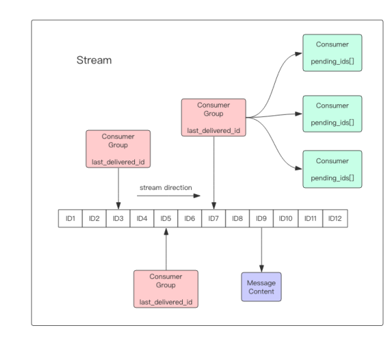

Stream主体是一个消息链表，将所有加入的消息都串起来，每个消息都有一个唯一的 ID 和对应的内容。消息是持久化的，Redis 重启后，内容还在。

每个 Stream 都有唯一的名称，它就是 Redis 的 key，在我们首次使用 xadd 指令追加消息时自动创建。

每个 Stream 都可以挂多个消费组，每个消费组会有个游标 last_delivered_id 在 Stream 数组之上往前移动，表示当前消费组已经消费到哪条消息了。每个消费组都有一个 Stream 内唯一的名称。

消费组不会自动创建，它需要单独的指令 xgroup create 进行创建，需要指定从 Stream 的某个消息 ID 开始消费，这个 ID 用来初始化last_delivered_id 变量。

每个消费组 (Consumer Group) 的状态都是独立的，相互不受影响。也就是说同一份Stream 内部的消息会被每个消费组都消费到。

同一个消费组 (Consumer Group) 可以挂接多个消费者 (Consumer)，这些消费者之间是竞争关系，任意一个消费者读取了消息都会使游标 last_delivered_id 往前移动。每个消费者有一个组内唯一名称。

消费者 (Consumer) 内部会有个状态变量 pending_ids，它记录了当前已经被客户端读取的消息，但是还没有 ack。如果客户端没有 ack，这个变量里面的消息 ID 会越来越多，一旦某个消息被 ack，它就开始减少。这个 pending_ids 变量在 Redis 官方被称之为 PEL，也就是 Pending Entries List，这是一个很核心的数据结构，它用来确保客户端至少消费了消息一次，而不会在网络传输的中途丢失了没处理。

#### Stream常用命令

- XADD：插入消息，保证有序，可以自动生成全局唯一 ID；
- XLEN ：查询消息长度；
- XREAD：用于读取消息，可以按 ID 读取数据；
- XDEL ： 根据消息 ID 删除消息；
- DEL ：删除整个 Stream；
- XRANGE ：读取区间消息
- XREADGROUP：按消费组形式读取消息；
- XPENDING 和 XACK：
    - XPENDING 命令可以用来查询每个消费组内所有消费者「已读取、但尚未确认」的消息；
    - XACK 命令用于向消息队列确认消息处理已完成；

其中各个命令的作用如下：

- 消息保序：XADD/XREAD
- 阻塞读取：XREAD block
- 重复消息处理：Stream 在使用 XADD 命令，会自动生成全局唯一 ID；
- 消息可靠性：内部使用 PENDING List 自动保存消息，使用 XPENDING 命令查看消费组已经读取但是未被确认的消息，消费者使用 XACK 确认消息；
- 支持消费组形式消费数据

#### Redis 基于 Stream 消息队列与专业的消息队列有哪些差距

Redis 在队列中间件环节无法保证消息不丢。像 RabbitMQ 或 Kafka 这类专业的队列中间件，在使用时是部署一个集群，生产者在发布消息时，队列中间件通常会写「多个节点」，也就是有多个副本，这样一来，即便其中一个节点挂了，也能保证集群的数据不丢失。

Redis 的数据都存储在内存中，这就意味着一旦发生消息积压，则会导致 Redis 的内存持续增长，如果超过机器内存上限，就会面临被 OOM 的风险。所以Redis的消息队列当达到指定队列最大长度时，队列长度超过上限后，旧消息会被删除，只保留固定长度的新消息。这么来看，Stream 在消息积压时，如果指定了最大长度，还是有可能丢失消息的。

Redis作为消息队列使用的场景：业务场景足够简单，对于数据丢失不敏感，而且消息积压概率比较小的情况

#### Redis 发布/订阅机制为什么不可以作为消息队列

1. 发布/订阅机制不具备「数据持久化」的能力，也就是发布/订阅机制的相关操作，不会写入到 RDB 和 AOF 中，当 Redis 宕机重启，发布/订阅机制的数据也会全部丢失。
2. 发布订阅模式是“发后既忘”的工作模式，如果有订阅者离线重连之后不能消费之前的历史消息。
3. 当消费端有一定的消息积压时，也就是生产者发送的消息，消费者消费不过来时，如果超过 32M 或者是 60s 内持续保持在 8M 以上，消费端会被强行断开，这个参数是在配置文件中设置的

所以，发布/订阅机制只适合即时通讯的场景，比如构建哨兵集群的场景采用了发布/订阅机制


## Redis 数据结构

void * key 和 void * value 指针指向的是 **Redis 对象**，Redis 中的每个对象都由 redisObject 结构表示

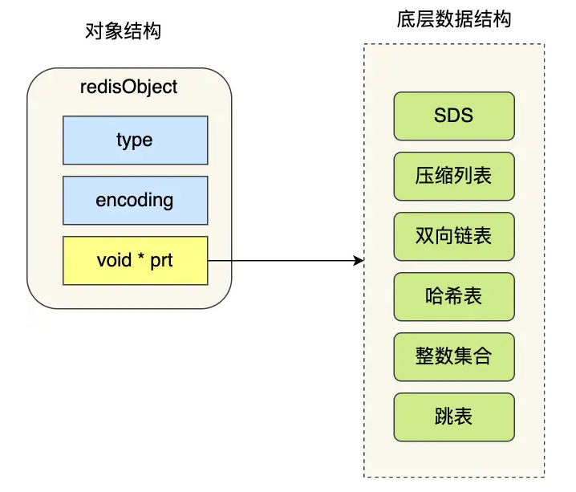

对象结构里包含的成员变量：

- type，标识该对象是什么类型的对象（String 对象、 List 对象、Hash 对象、Set 对象和 Zset 对象）；
- encoding，标识该对象使用了哪种底层的数据结构；
- ptr，指向底层数据结构的指针。

### SDS

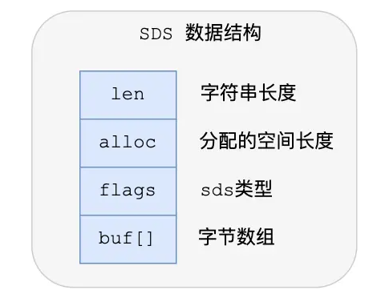

- **len，记录了字符串长度**。这样获取字符串长度的时候，只需要返回这个成员变量值就行，时间复杂度只需要 O（1）。
- **alloc，分配给字符数组的空间长度（容量）**。这样在修改字符串的时候，可以通过 `alloc - len` 计算出剩余的空间大小，可以用来判断空间是否满足修改需求，如果不满足的话，就会自动将 SDS 的空间扩展至执行修改所需的大小，然后才执行实际的修改操作，所以使用 SDS 既不需要手动修改 SDS 的空间大小，也不会出现前面所说的缓冲区溢出的问题。
- **flags，用来表示不同类型的 SDS**。一共设计了 5 种类型，分别是 sdshdr5、sdshdr8、sdshdr16、sdshdr32 和 sdshdr64。
- **buf[]，字符数组，用来保存实际数据**。不仅可以保存字符串，也可以保存二进制数据。

len使得获取字符串长度的事件复杂度为O(1)，同时保证了二进制安全（不会对写入数据进行更改）。

alloc自动扩容，使得SDS不会发生缓冲区溢出。

flags的5种类型，主要区别在于它们数据结构中的 len 和 alloc 成员变量的数据类型不同。（字符数据长度和分配空间大小不会超过2的多少次方）

#### SDS扩容策略

- 如果所需的 sds 长度小于 1 MB，那么最后的扩容是按照翻倍扩容来执行的，即 2 倍的newlen
- 如果所需的 sds 长度超过 1 MB，那么最后的扩容长度应该是 newlen + 1MB。

在扩容 SDS 空间之前，SDS API 会优先检查未使用空间是否足够，如果不够的话，API 不仅会为 SDS 分配修改所必须要的空间，还会给 SDS 分配额外的「未使用空间」。这样的好处是，下次在操作 SDS 时，如果 SDS 空间不够的话，API 就会直接使用「未使用空间」，而无须执行内存分配，**有效的减少内存分配次数**。（内存池策略）

### 链表

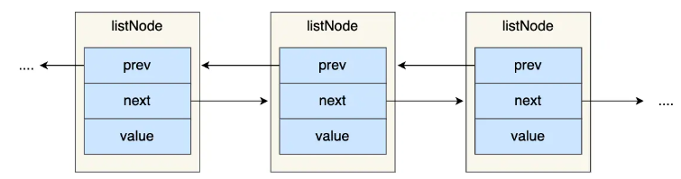

list 结构还为链表提供了链表头指针 head、链表尾节点 tail、链表节点数量 len、以及可以自定义实现的 dup、free、match 函数。最后组成的链表如下：

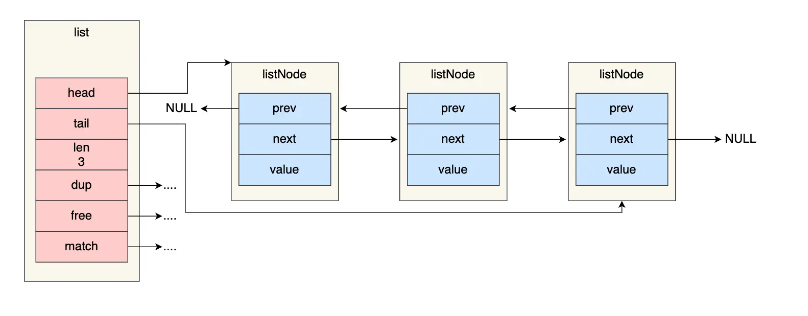

#### 链表的优势和劣势

Redis 的链表实现优点如下：

- listNode 链表节点的结构里带有 prev 和 next 指针，获取某个节点的前置节点或后置节点的时间复杂度只需O(1)，而且这两个指针都可以指向 NULL，所以链表是无环链表；
- list 结构因为提供了表头指针 head 和表尾节点 tail，所以获取链表的表头节点和表尾节点的时间复杂度只需O(1)；
- list 结构因为提供了链表节点数量 len，所以获取链表中的节点数量的时间复杂度只需O(1)；
- listNode 链表节使用 void* 指针保存节点值，并且可以通过 list 结构的 dup（复制链表节点保存的值）、free（释放节点保存的值）、match（对比链表所保存的值与另一个输入值是否相同） 函数指针为节点设置该节点类型特定的函数，因此链表节点可以保存各种不同类型的值；

链表的缺陷：

- 链表每个节点之间的内存都是不连续的，意味着无法很好利用 CPU 缓存。能很好利用 CPU 缓存的数据结构就是数组，因为数组的内存是连续的，这样就可以充分利用 CPU 缓存来加速访问。
- 还有一点，保存一个链表节点的值都需要一个链表节点结构头的分配，内存开销较大。

因此，Redis 3.0 的 List 对象在数据量比较少的情况下，会采用「压缩列表」作为底层数据结构的实现，它的优势是节省内存空间，并且是内存紧凑型的数据结构。

### 压缩列表

压缩列表的最大特点，就是它被设计成一种内存紧凑型的数据结构，占用一块连续的内存空间，不仅可以利用 CPU 缓存，而且会针对不同长度的数据，进行相应编码，这种方法可以有效地节省内存开销。

压缩列表的缺陷是：

- 不能保存过多的元素，否则查询效率就会降低；
- 新增或修改某个元素时，压缩列表占用的内存空间需要重新分配，甚至可能引发连锁更新的问题。

因此，Redis 对象（List 对象、Hash 对象、Zset 对象）包含的元素数量较少，或者元素值不大的情况才会使用压缩列表作为底层数据结构。

压缩列表是由连续内存块组成的顺序型数据结构，有点类似于数组。

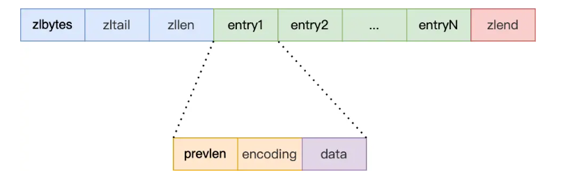

压缩列表在表头有三个字段：

- ***zlbytes***，记录整个压缩列表占用的内存字节数；
- ***zltail***，记录压缩列表「尾部」节点距离起始地址由多少字节，也就是列表尾的偏移量。方便确定尾部地址；
- ***zllen***，记录压缩列表包含的节点数量；
- ***zlend***，标记压缩列表的结束点，固定值 0xFF（十进制255）。

压缩列表在查找第一个和最后一个以外的元素时可以通过表头的三个字段直接定位，时间复杂度为O(1)外，其他的时间复杂度都为O(N)，因此不适合保存过多的元素。

压缩列表节点包含三部分内容：

- ***prevlen***，记录了「前一个节点」的长度，目的是为了实现从后向前遍历；（如果前一个节点的长度小于 254 字节，那么 prevlen 属性需要用 1 字节的空间来保存这个长度值，相反则用5字节，第一个字节作为标记位直接标记为0XFF，然后后四个字节表示具体长度）
- ***encoding***，记录了当前节点实际数据的「类型和长度」，类型主要有两种：字符串和整数。（为整数时，使用1字节进行编码，为字符串时，根据字符串的长度，使用1/2/5字节的空间进行编码）
- ***data***，记录了当前节点的实际数据，类型和长度都由 `encoding` 决定；

压缩列表除了查找复杂度高的问题，还有一个问题，即“连锁更新”。压缩列表新增某个元素或修改某个元素时，如果空间不不够，压缩列表占用的内存空间就需要重新分配。而当新插入的元素较大时，可能会导致后续元素的 prevlen 占用空间都发生变化，从而引起「连锁更新」问题，导致每个元素的空间都要重新分配，造成访问压缩列表性能的下降。

### 哈希表

哈希表优点在于，它能以 O(1) 的复杂度快速查询数据。为了避免哈希冲突，Redis 采用了「链式哈希」来解决哈希冲突，在不扩容哈希表的前提下，将具有相同哈希值的数据串起来，形成链接起，以便这些数据在表中仍然可以被查询到。

#### rehash

Redis 定义一个 dict 结构体，需要定义了两个哈希表，这是rehash的需要。

rehash 的操作过程分为三步：

- 给「哈希表 2」 分配空间，一般会比「哈希表 1」 大一倍（两倍的意思）；
- 将「哈希表 1 」的数据迁移到「哈希表 2」 中；
- 迁移完成后，「哈希表 1 」的空间会被释放，并把「哈希表 2」 设置为「哈希表 1」，然后在「哈希表 2」 新创建一个空白的哈希表，为下次 rehash 做准备。

为了避免 rehash 在数据迁移过程中，因拷贝数据的耗时，影响 Redis 性能的情况，所以 Redis 采用了**渐进式 rehash**，也就是将数据的迁移的工作不再是一次性迁移完成，而是分多次迁移。在 rehash 进行期间，每次哈希表元素进行新增、删除、查找或者更新操作时，Redis 除了会执行对应的操作之外，还会顺序将「哈希表 1 」中索引位置上的所有 key-value 迁移到「哈希表 2」 上；

即：在渐进式 rehash 进行期间，哈希表元素的删除、查找、更新等操作都会在这两个哈希表进行。

rehash的触发条件与负载因子相关，负载因子=哈希表已保存的节点数量/哈希表大小。

当负载因子大于等于 1 ，并且 Redis 没有在执行 bgsave 命令或者 bgrewiteaof 命令，也就是没有执行 RDB 快照或没有进行 AOF 重写的时候，就会进行 rehash 操作。当负载因子大于等于 5 时，此时说明哈希冲突非常严重了，不管有没有有在执行 RDB 快照或 AOF 重写，都会强制进行 rehash 操作。

### 整数集合

整数集合是 Set 对象的底层实现之一。当一个 Set 对象只包含整数值元素，并且元素数量不大时，就会使用整数集这个数据结构作为底层实现。整数集合本质上是一块连续内存空间。

```c++
typedef struct intset {
    //编码方式
    uint32_t encoding;
    //集合包含的元素数量
    uint32_t length;
    //保存元素的数组
    int8_t contents[];
} intset;
```

保存元素的容器是一个 contents 数组，虽然 contents 被声明为 int8_t 类型的数组，但是实际上 contents 数组并不保存任何 int8_t 类型的元素，contents 数组的真正类型取决于 intset 结构体里的 encoding 属性的值

#### 整数集合的升级操作

整数集合会有一个升级规则，就是当我们将一个新元素加入到整数集合里面，如果新元素的类型（int32_t）比整数集合现有所有元素的类型（int16_t）都要长时，整数集合需要先进行升级，也就是按新元素的类型（int32_t）扩展 contents 数组的空间大小，然后才能将新元素加入到整数集合里，当然升级的过程中，也要维持整数集合的有序性。

整数集合升级的过程不会重新分配一个新类型的数组，而是在原本的数组上扩展空间，然后在将每个元素按间隔类型大小分割，如果 encoding 属性值为 INTSET_ENC_INT16，则每个元素的间隔就是 16 位。

整数升级可以节省内存资源，不需要额外进行内存分配，同时原有的数据进行了保留。

整数集合不支持降级操作。

### 跳表（skiplist）

Redis zset 是⼀个复合结构，⼀⽅⾯它需要⼀个 hash 结构来存储 value和 score 的对应关系，另⼀⽅⾯需要提供按照 score 排序的功能，还需要能够指定 score 的范围来获取 value 列表的功能，所以需要跳表来帮忙实现。Redis 的跳跃列表共有64 层，可容纳 2 ^ 64 个元素.

zset 结构体里有两个数据结构：一个是跳表，一个是哈希表。这样的好处是既能进行高效的范围查询，也能进行高效单点查询。Zset 对象在执行数据插入或是数据更新的过程中，会依次在跳表和哈希表中插入或更新相应的数据，从而保证了跳表和哈希表中记录的信息一致。

跳表的本质是一个多层的有序链表，这样可以更好地定位数据。

Zset 对象要同时保存「元素」和「元素的权重」，对应到跳表节点结构里就是 sds 类型的 ele 变量和 double 类型的 score 变量。每个跳表节点都有一个后向指针（struct zskiplistNode *backward），指向前一个节点，目的是为了方便从跳表的尾节点开始访问节点，这样倒序查找时很方便。

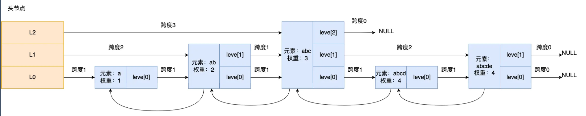

#### 跳表节点查询过程

查找一个跳表节点的过程时，跳表会从头节点的最高层开始，逐一遍历每一层。在遍历某一层的跳表节点时，会用跳表节点中的 SDS 类型的元素和元素的权重来进行判断，共有两个判断条件：

- 如果当前节点的权重「小于」要查找的权重时，跳表就会访问该层上的下一个节点
- 如果下一节点的权重「等于」要查找的权重时，并且下一节点的 SDS 类型数据「小于」要查找的数据时，跳表就会访问该层上的下一个节点

当想查到[4,level[0]]时，查找顺序如下：

[3，level[2]]------>[3, level[1]]------->[3, level[0]]（[4,level[1]]要大于[4,level[0]]，所以不访问下一个节点，而是继续往下一层）----->[4,level[0]]

跳表在创建的过程中，会生成范围为[0-1]的一个随机数，如果这个随机数小于 0.25（相当于概率 25%），那么层数就增加 1 层，然后继续生成下一个随机数，直到随机数的结果大于 0.25 结束，最终确定该节点的层数。

#### 为什么用跳表而不是平衡树

内存占用上来比较，跳表比平衡树更灵活一些，跳表每个节点占用的指针数量平均为1/(1-p)，取决于参数p（随机数）的大小

在做范围查找的时候，跳表比平衡树操作要简单，平衡树需要做额外的中序遍历继续寻找不超过其最大值的节点

从算法实现难度上来比较，跳表比平衡树要简单得多

### quicklist

quicklist 就是「双向链表 + 压缩列表」组合，因为一个 quicklist 就是一个链表，而链表中的每个元素又是一个压缩列表。

quicklist通过控制每个链表节点中的压缩列表的大小或者元素个数，来规避连锁更新的问题。因为压缩列表元素越少或越小，连锁更新带来的影响就越小，从而提供了更好的访问性能。

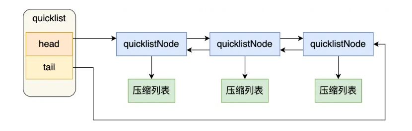

在向 quicklist 添加一个元素的时候，不会像普通的链表那样，直接新建一个链表节点。而是会检查插入位置的压缩列表是否能容纳该元素，如果能容纳就直接保存到 quicklistNode 结构里的压缩列表，如果不能容纳，才会新建一个新的 quicklistNode 结构。

quicklist 会控制 quicklistNode 结构里的压缩列表的大小或者元素个数，来规避潜在的连锁更新的风险，但是这并没有完全解决连锁更新的问题。

### listpack

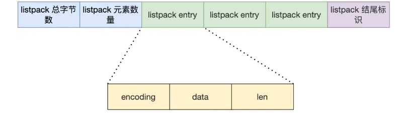

listpack 为了避免压缩列表的连锁更新问题，没有压缩列表中记录前一个节点长度的字段了，listpack 只记录当前节点的长度，当我们向 listpack 加入一个新元素的时候，不会影响其他节点的长度字段的变化，从而避免了压缩列表的连锁更新问题。

压缩列表的 entry 保存 prevlen 是为了实现节点从后往前遍历，知道前一个节点的长度，就可以计算前一个节点的偏移量。listpack 一样可以支持从后往前遍历的。

listpack等于说彻底解决了压缩列表的连锁更新问题。


## Redis分片

将数据拆分到多个redis实例的过程 

功能：

​	1.允许使⽤很多电脑的内存总和来⽀持更⼤的数据库

​	2.允许伸缩计算能⼒到多核或者多服务器，伸缩⽹络带宽到多服务器或者多⽹络适配器 

方式（哈希分片）：

​	1.使⽤哈希函数对键名转换为⼀个数字

​	2. 对这个数字进⾏取模，取模的基数等于redis实例的对象 


## Redis缓存

缓存的场景：

​	1.不需要实时更新又极其消耗数据库的数据

​	2.需要实时更新，但更新的频率不⾼

简单来说，就是需要在应⽤程序中新增缓存逻辑处理的代码。Redis就是旁路缓存，因为需要应⽤程序调⽤它。电脑内存⾥的磁盘⽂件就不是旁路缓存，因为是⾃动调⽤的，对应⽤程序透明。

Redis做缓存的两种模式：

​	1.只读缓存：

​		加强读请求性能。查询数据时，缓存缺失需要从DB加载。更新数据时到DB更新，Redis上的⽼数据直接删除。

​	2.读写缓存：

​		读操作和只读缓存⼀样。写操作分为同步直写和异步写回两种模式，根据实际的业务场景需求来进⾏选择：

​			1.同步直写模式

​				Redis和DB同时删改写回。侧重于保证数据可靠性。 

​			2.异步写回模式

​				只写Redis，数据要被淘汰时再写回DB（淘汰指的是系统空间不足，需要腾出空间时再写入）。侧重于提供低延迟访问。

### 什么是缓存雪崩，击穿，穿透

#### 缓存雪崩

为了保证缓存中的数据与数据库中的数据一致性，会给 Redis 里的数据设置过期时间，当缓存数据过期后，用户访问的数据如果不在缓存里，业务系统需要重新生成缓存，因此就会访问数据库，并将数据更新到 Redis 里，这样后续请求都可以直接命中缓存。

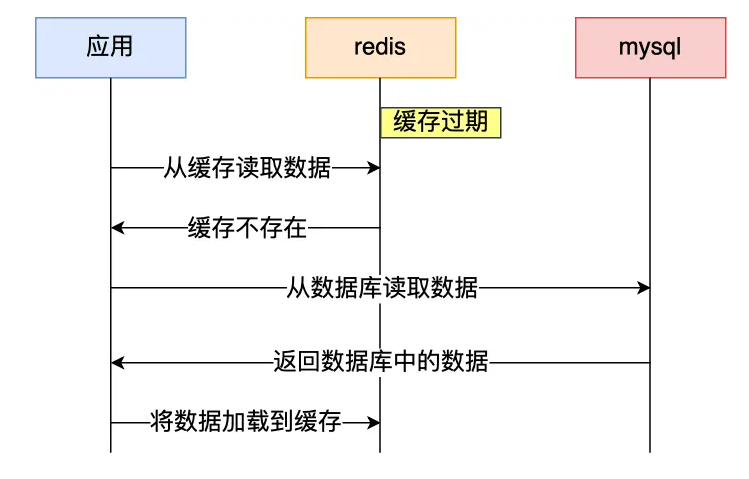

那么，当大量缓存数据在同一时间过期（失效）或者 Redis 故障宕机时，如果此时有大量的用户请求，都无法在 Redis 中处理，于是全部请求都直接访问数据库，从而导致数据库的压力骤增，严重的会造成数据库宕机，从而形成一系列连锁反应，造成整个系统崩溃，这就是缓存雪崩的问题。

发生缓存雪崩的两个原因：大量数据同时过期；Redis 故障宕机；

##### 大量数据同时过期

针对大量数据同时过期而引发的缓存雪崩问题，常见的应对方法有下面这几种：

- 均匀设置过期时间，避免将大量的数据设置成同一个过期时间。我们可以在对缓存数据设置过期时间时，给这些数据的过期时间加上一个随机数，这样就保证数据不会在同一时间过期。
- 互斥锁，当业务线程在处理用户请求时，如果发现访问的数据不在 Redis 里，就加个互斥锁，保证同一时间内只有一个请求来构建缓存（从数据库读取数据，再将数据更新到 Redis 里），当缓存构建完成后，再释放锁。未能获取互斥锁的请求，要么等待锁释放后重新读取缓存，要么就返回空值或者默认值。同时，互斥锁也需要设置超时时间。
- 后台更新缓存，业务线程不再负责更新缓存，缓存也不设置有效期，而是让缓存“永久有效”，并将更新缓存的工作交由后台线程定时更新。此时并不是意味着数据一直能在内存里，因为当系统内存紧张的时候，有些缓存数据会被“淘汰”，而在缓存被“淘汰”到下一次后台定时更新缓存的这段时间内，业务线程读取缓存失败就返回空值，业务的视角就以为是数据丢失了。解决这个问题的放肆有以下两种
    - 1.后台线程不仅负责定时更新缓存，而且也负责频繁地检测缓存是否有效，检测到缓存失效了，原因可能是系统紧张而被淘汰的，于是就要马上从数据库读取数据，并更新到缓存。这种方式的检测时间间隔不能太长，太长也导致用户获取的数据是一个空值而不是真正的数据，所以检测的间隔最好是毫秒级的，但是总归是有个间隔时间，用户体验一般。
    - 2.在业务线程发现缓存数据失效后（缓存数据被淘汰），通过消息队列发送一条消息通知后台线程更新缓存，后台线程收到消息后，在更新缓存前可以判断缓存是否存在，存在就不执行更新缓存操作；不存在就读取数据库数据，并将数据加载到缓存。这种方式相比第一种方式缓存的更新会更及时，用户体验也比较好。

实际上，在业务刚上线的时候，我们最好提前把数据缓起来，而不是等待用户访问才来触发缓存构建，这就是所谓的**缓存预热**，后台更新缓存的机制刚好也适合干这个事情。

##### Redis故障宕机

针对 Redis 故障宕机而引发的缓存雪崩问题，常见的应对方法有下面这几种：

- 服务熔断或请求限流机制。服务熔断——暂停业务应用对缓存服务的访问，直接返回错误，不用再继续访问数据库，从而降低对数据库的访问压力，保证数据库系统的正常运行，然后等到 Redis 恢复正常后，再允许业务应用访问缓存服务。服务熔断机制是保护数据库的正常允许，但是暂停了业务应用访问缓存服系统，全部业务都无法正常工作。请求限流——只将少部分请求发送到数据库进行处理，再多的请求就在入口直接拒绝服务，等到 Redis 恢复正常并把缓存预热完后，再解除请求限流的机制。
- 构建 Redis 缓存高可靠集群。最好通过主从节点的方式构建 Redis 缓存高可靠集群。如果 Redis 缓存的主节点故障宕机，从节点可以切换成为主节点，继续提供缓存服务，避免了由于 Redis 故障宕机而导致的缓存雪崩问题。

#### 缓存击穿

业务通常会有几个数据会被频繁地访问，比如秒杀活动，这类被频繁访问的数据被称为热点数据。如果缓存中的某个热点数据过期了，此时大量的请求访问了该热点数据，就无法从缓存中读取，直接访问数据库，数据库很容易就被高并发的请求冲垮，这就是缓存击穿的问题。

缓存击穿跟缓存雪崩很相似，可以认为缓存击穿是缓存雪崩的一个子集。

应对缓存击穿可以采取前面说到两种方案：

- 互斥锁方案，保证同一时间只有一个业务线程更新缓存，未能获取互斥锁的请求，要么等待锁释放后重新读取缓存，要么就返回空值或者默认值。
- 不给热点数据设置过期时间，由后台异步更新缓存，或者在热点数据准备要过期前，提前通知后台线程更新缓存以及重新设置过期时间。

#### 缓存穿透

当发生缓存雪崩或击穿时，数据库中还是保存了应用要访问的数据，一旦缓存恢复相对应的数据，就可以减轻数据库的压力，而缓存穿透就不一样了。

当用户访问的数据，**既不在缓存中，也不在数据库中**，导致请求在访问缓存时，发现缓存缺失，再去访问数据库时，发现数据库中也没有要访问的数据，没办法构建缓存数据，来服务后续的请求。那么当有大量这样的请求到来时，数据库的压力骤增，这就是缓存穿透的问题。

缓存穿透的发生一般有两种情况：

- 业务误操作，缓存中的数据和数据库中的数据都被误删除了，所以导致缓存和数据库中都没有数据；
- 黑客恶意攻击，故意大量访问某些读取不存在数据的业务；

针对缓冲穿透的方案一般有三种：

- 非法请求的限制，当有大量恶意请求访问不存在的数据的时候，也会发生缓存穿透，因此在 API 入口处我们要判断求请求参数是否合理，请求参数是否含有非法值、请求字段是否存在，如果判断出是恶意请求就直接返回错误，避免进一步访问缓存和数据库。
- 缓存空值或者默认值，当我们线上业务发现缓存穿透的现象时，可以针对查询的数据，在缓存中设置一个空值或者默认值，这样后续请求就可以从缓存中读取到空值或者默认值，返回给应用，而不会继续查询数据库。
- 使用**布隆过滤器**判断数据是否存在而不是通过查询数据库，在写入数据库数据时，使用布隆过滤器做个标记，然后在用户请求到来时，业务线程确认缓存失效后，可以通过查询布隆过滤器快速判断数据是否存在，如果不存在，就不用通过查询数据库来判断数据是否存在。即使发生了缓存穿透，大量请求只会查询 Redis 和布隆过滤器，而不会查询数据库，保证了数据库能正常运行，Redis 自身也是支持布隆过滤器的。

#### 布隆过滤器的工作方式

想要知道一个数据是否在数据库中，频繁查询数据库和大规模的缓存都是不可能的。（例如新闻推送）

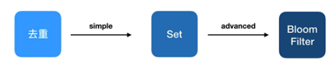

布隆过滤器由「初始值都为 0 的位图数组」和「 N 个哈希函数」两部分组成。当我们在写入数据库数据时，在布隆过滤器里做个标记，这样下次查询数据是否在数据库时，只需要查询布隆过滤器，如果查询到数据没有被标记，说明不在数据库中。

布隆过滤器会通过 3 个操作完成标记：

- 第一步，使用 N 个哈希函数分别对数据做哈希计算，得到 N 个哈希值
- 第二步，将第一步得到的 N 个哈希值对位图数组的长度取模，得到每个哈希值在位图数组的对应位置。
- 第三步，将每个哈希值在位图数组的对应位置的值设置为 1

当查询数据时，只需要通过布隆过滤器查到位图数组的相应位置的值是否全为 1，只要有一个为 0，就认为数据 x 不在数据库中。查询布隆过滤器说数据存在，并不一定证明数据库中存在这个数据，但是查询到数据不存在，数据库中一定就不存在这个数据。

布隆过滤器存在哈希冲突的可能性，即数据 x 和数据 y 可能都落在第 1、4、6 位置，而事实上，可能数据库中并不存在数据 y，存在误判的情况。

### 数据库和缓存的一致性保证

无论是「先更新数据库，再更新缓存」，还是「先更新缓存，再更新数据库」，这两个方案都存在并发问题，当两个请求并发更新同一条数据的时候，可能会出现缓存和数据库中的数据不一致的现象。

正确的做法是旁路缓存策略，即：在更新数据时不更新缓存，而是删除缓存中的数据。然后，到读取数据时，发现缓存中没了数据之后，再从数据库中读取数据，更新到缓存中。该策略又可以细分为「读策略」和「写策略」。

写策略的步骤：

- 更新数据库中的数据；
- 删除缓存中的数据。

读策略的步骤：

- 如果读取的数据命中了缓存，则直接返回数据；
- 如果读取的数据没有命中缓存，则从数据库中读取数据，然后将数据写入到缓存，并且返回给用户

对于写策略而言，「先更新数据库 + 再删除缓存」的方案，是可以保证数据一致性的。但这个操作本质是个两段操作，如果删除缓存内的旧值失败，就会导致读取的仍然是旧值。

#### 如何保证先更新数据库 + 再删除缓存两个操作都成功

两种方案：

- 重试机制，可以引入消息队列，将第二个操作（删除缓存）要操作的数据加入到消息队列，由消费者来操作数据。如果应用删除缓存失败，可以从消息队列中重新读取数据，然后再次删除缓存，这个就是重试机制。当然，如果重试超过的一定次数，还是没有成功，我们就需要向业务层发送报错信息了。如果删除缓存成功，就要把数据从消息队列中移除，避免重复操作，否则就继续重试。
- 订阅mysql binlog，再删除缓存，可以通过订阅 binlog 日志，拿到具体要操作的数据，然后再执行缓存删除，阿里巴巴开源的 Canal 中间件就是基于这个实现的。

这两种方法有一个共同的特点，都是采用异步操作缓存。


## Redis替换策略

### 过期删除策略

Redis 是可以对 key 设置过期时间的，因此需要有相应的机制将已过期的键值对删除，而做这个工作的就是过期键值删除策略。

每当我们对一个 key 设置了过期时间时，Redis 会把该 key 带上过期时间存储到一个**过期字典**（expires dict）中，也就是说「过期字典」保存了数据库中所有 key 的过期时间。当我们查询一个 key 时，Redis 首先检查该 key 是否存在于过期字典中：如果不在，则正常读取键值；如果存在，则会获取该 key 的过期时间，然后与当前系统时间进行比对，如果比系统时间大，那就没有过期，否则判定该 key 已过期。

过期删除策略一共有三种：

1.定时删除，在设置 key 的过期时间时，同时创建一个定时事件，当时间到达时，由事件处理器自动执行 key 的删除操作。但这种行为会占用相当一部分内存，对CPU相当不友好。

2.惰性删除，不主动删除过期键，每次从数据库访问 key 时，都检测 key 是否过期，如果过期则删除该 key。这虽然对CPU最友好，但不用的key占用的内存一直不释放，会导致一定的内存浪费。

3.定期删除，每隔一段时间「随机」从数据库中取出一定数量的 key 进行检查，并删除其中的过期key。最大的问题在于难以确定频率。

 Redis 选择「惰性删除+定期删除」这两种策略配和使用，以求在合理使用 CPU 时间和避免内存浪费之间取得平衡

### 内存淘汰策略

在缓存满时，Redis共有8种淘汰策略

1.不进行数据淘汰（1种）

​	no-enviction：禁⽌驱逐数据，这种情况下会直接导致写入错误

2.进行数据淘汰

​	（1）设置过期时间对数据进行淘汰（4种）

​		volatile-ttl、volatile-random、volatile-lru、volatile-lfu

​		volatile-ttl：从已设置过期时间的数据集中，选择将要过期的数据进⾏淘汰

​		volatile-random：从已设置过期时间的数据集中，随机选择数据进⾏淘汰

​		volatile-lru：从已设置过期时间的数据集中，挑选最近最少使⽤的数据淘汰

​		volatile-lfu（Redis 4.0后新增的默认淘汰策略）：从已设置过期时间的数据集中，挑选最不经常使⽤的数据淘汰（相较于lru的频率算法策略不一样）

​	（2）所有数据范围内进行淘汰（3种）

​		allkeys-random：随机淘汰任意键值

​		allkeys-lru：淘汰整个键值中最久未使用的键值

​		allkeys-lfu（Redis 4.0 后新增的内存淘汰策略）：淘汰整个键值中最少使用的键值

​		相比于上面唯一的区别就是在整个数据集中

传统的LRU（最近最少使用）算法，需要维护⼀个⼤链表，随着数据访问，更新数据在链表中的位置。 

Redis 中对 LRU 算法进⾏了简化，简单来说就是增加了⼀个随机选取候选集合的操作，具体如下：

​	1.记录每个数据的访问时间。Redis 默认会记录每个数据的最近⼀次访问的时间戳（由键值对数据结构 RedisObject 中的 lru 字段记录）

​	2.随机选取⼀个集合。Redis 在决定淘汰的数据时，第⼀次会随机选出 N 个数据，把它们作为⼀个候选集合

​	3.淘汰集合中lru字段最⼩的数据。接下来，Redis 会⽐较这 N 个数据的 lru 字段，把 lru 字段值最⼩的数据从缓存中淘汰出去

​	4.需要再次淘汰数据时。选取集合外，lru 字段值⼩于候选集合中最⼩的 lru 值的数据，进⼊候选集合，直到选满集合。重复步骤3。

这样，Redis就不⽤维护⼀个⼤链表了，也不⽤频繁的进⾏链表数据交换操作。 但是 LRU 算法有一个问题，无法解决缓存污染问题，比如应用一次读取了大量的数据，而这些数据只会被读取这一次，那么这些数据会留存在 Redis 缓存中很长一段时间，造成缓存污染。因此，在 Redis 4.0 之后引入了 LFU 算法来解决这个问题。

LFU算法，翻译为最近最不常用。FU 算法是根据数据访问次数来淘汰数据的，它的核心思想是“如果数据过去被访问多次，那么将来被访问的频率也更高”。

所以， LFU 算法会记录每个数据的访问次数。当一个数据被再次访问时，就会增加该数据的访问次数。这样就解决了偶尔被访问一次之后，数据留存在缓存中很长一段时间的问题，相比于 LRU 算法也更合理一些。LFU 算法相比于 LRU 算法的实现，多记录了「数据的访问频次」的信息。

访问频次信息 logc 和访问次数相关但不相同。在每次 key 被访问时，会先对 logc 做一个衰减操作，衰减的值跟前后访问时间的差距有关系，如果上一次访问的时间与这一次访问的时间差距很大，那么衰减的值就越大。衰减后，增加操作也并不是单纯的 + 1，而是根据概率增加，如果 logc 越大的 key，它的 logc 就越难再增加

Redis缓存⼤⼩选取建议：结合实际应⽤的数据总量、热数据的体量，以及成本预算，设置在总数据量的 15% 到 30% 这个区间。


## Redis备份

持久化机制：RDB，AOF

RDB：在指定的时间间隔内将内存中的数据集快照写⼊磁盘

AOF：以⽇志的形式记录服务器所处理的每⼀个写操作，redis服务器启动之初，会读取该⽇志来重新构建数据库，以保证启动后的数据库是完整的。注意AOF日志只会记录写操作命令，读操作命令是不会被记录的

### AOF

AOF ⽇志是写后⽇志，"写后" 的意思是 Redis 是先执⾏命令，把数据写⼊内存，然后才记录⽇志。

Redis的写后⽇志AOF相对于内存而言，mysql的写前⽇志redo log相对于磁盘数据而言。它们都只记录写操作。redo log相对于内存而言也是写后日志。

Redis 使⽤写后⽇志这⼀⽅式的好处：

​	1.可以避免出现记录错误命令的情况。

​	2. 它是在命令执⾏后才记录⽇志，所以不会阻塞当前的写操作。

#### AOF三种刷盘策略（和MySQL redo log的刷盘策略放在一起理解）

​	Always，同步写回；Everysec，每秒写回；No，操作系统控制的写回

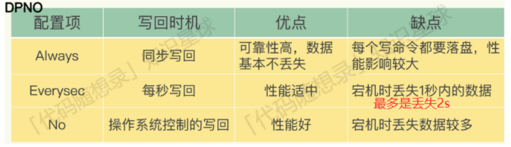

​	想要获得⾼性能，就选择 No 策略；如果想要得到⾼可靠性保证，就选择 Always 策略；如果允许数据有⼀点丢 失，又希望性能别受太⼤影响的话，那么就选择 Everysec 策略。这三种策略的核心只是在控制 `fsync()` 函数的调用时机。

- Always 策略就是每次写入 AOF 文件数据后，就执行 fsync() 函数；对应redo log就是每个事务执行完执行刷盘。
- Everysec 策略就会创建一个异步任务来执行 fsync() 函数；对应redo log就是事务不触发刷盘，InnoDB 的后台线程每隔 1 秒，将 redo log buffer 持久化到磁盘，或redo log buffer 中记录的写入量大于 redo log buffer 内存空间的一半时，会触发落盘。
- No 策略就是永不执行 fsync() 函数，对应redo log就是只将buffer内的内容写到操作系统文件缓存;

#### AOF重写

AOF通过AOF重写的⽅式进⾏减⼩AOF⽂件⼤⼩，优化存储结构。当 AOF 文件的大小超过所设定的阈值后，Redis 就会启用 AOF 重写机制，来压缩 AOF 文件。

AOF 重写机制是在重写时，读取当前数据库中的所有键值对，然后将每一个键值对用一条命令记录到「新的 AOF 文件」，等到全部记录完后，就将新的 AOF 文件替换掉现有的 AOF 文件。

AOF重写过程：⼀处拷贝，两处⽇志

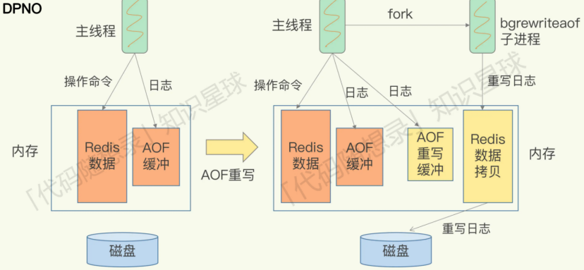

​	AOF有四个触发时机：

​		1.bgrewriteaof 命令被执⾏

​		2.主从复制完成 RDB ⽂件解析和加载（⽆论是否成功）

​		3.AOF 重写被设置为待调度执⾏

​		4.AOF 被启⽤，同时 AOF ⽂件的⼤⼩⽐例超出阈值，以及 AOF ⽂件的⼤⼩绝对值超出阈值。

在这四个时机下，都不能有正在执⾏的 RDB ⼦进程和 AOF 重写⼦进程，否则的话， AOF 重写⽆法执⾏

AOF 重写和 RDB 创建的过程类似，它也是创建了⼀个⼦进程来完成重写⼯作。这是因为 AOF 重写操作，实际上需要遍历 Redis server 上的所有数据库，把每个键值对以插⼊操作的形式写⼊⽇志⽂件，⽽⽇志⽂件又要进⾏写盘操作。所以，Redis 源码使⽤⼦进程来实现 AOF 重写，这就避免了阻塞主线程，也减 少了对 Redis 整体性能的影响。同时，子进程（操作系统）只有在发生写操作的时候，才会去复制父进程的内容，以提供给AOF继续进行重写。防止由于物理内存数据的复制时间过长而导致父进程长时间阻塞的问题。

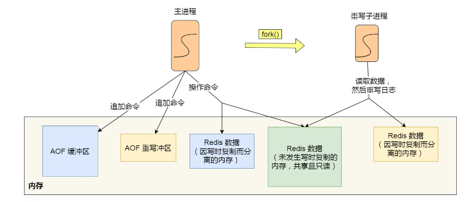

在子进程执行AOF重写期间，主进程主要执行以下三个工作：

- 执行客户端发来的命令；
- 将执行后的写命令追加到 「AOF 缓冲区」；
- 将执行后的写命令追加到 「AOF 重写缓冲区」；

当子进程完成 AOF 重写工作（扫描数据库中所有数据，逐一把内存数据的键值对转换成一条命令，再将命令记录到重写日志）后，会向主进程发送一条信号，主进程收到信号后调用信号处理函数执行：

- 将 AOF 重写缓冲区中的所有内容追加到新的 AOF 的文件中，使得新旧两个 AOF 文件所保存的数据库状态一致；
- 新的 AOF 的文件进行改名，覆盖现有的 AOF 文件

信号函数执行完后，主进程就可以继续像往常一样处理命令了。

在整个 AOF 后台重写过程中，除了发生写时复制会对主进程造成阻塞，还有信号处理函数执行时也会对主进程造成阻塞，在其他时候，AOF 后台重写都不会阻塞主进程。

### RDB

Redis 提供了两个命令来生成 RDB 文件，分别是 `save` 和 `bgsave`，他们的区别就在于是否在「主线程」里执行：

- 执行了 save 命令，就会在主线程生成 RDB 文件，由于和执行操作命令在同一个线程，所以如果写入 RDB 文件的时间太长，**会阻塞主线程**；
- 执行了 bgsave 命令，会创建一个子进程来生成 RDB 文件，这样可以**避免主线程的阻塞**；

RDB 文件的加载工作是在服务器启动时自动执行的，Redis 并没有提供专门用于加载 RDB 文件的命令。Redis 还可以通过配置文件的选项来实现每隔一段时间自动执行一次 bgsave 命令。

执行 bgsave 过程中，Redis 依然可以继续处理操作命令的，也就是数据是能被修改的。fork()创建的子进程和父进程共享同一片内存数据，直到父进程要修改数据时。操作系统会把这块数据的物理内存复制一份，然后主线程在这个数据副本进行修改操作。与此同时，bgsave 子进程可以继续把原来的数据写入到 RDB 文件。

而主线程在修改数据后是无法第一时间写入 RDB 文件的，只能交由下一次的 bgsave 快照。

### RDB与AOF混合

尽管 RDB 比 AOF 的数据恢复速度快，但是快照的频率不好把握。频率太低，两次快照间一旦服务器发生宕机，就可能会比较多的数据丢失。频率太高，频繁写入磁盘和创建子进程会带来额外的性能开销。

混合使用 AOF 日志和内存快照，也叫混合持久化。配置文件的命令为 aof-use-rdb-preamble yes

当开启了混合持久化时，在 AOF 重写日志时，`fork` 出来的重写子进程会先将与主线程共享的内存数据以 RDB 方式写入到 AOF 文件，然后主线程处理的操作命令会被记录在重写缓冲区里，重写缓冲区里的增量命令会以 AOF 方式写入到 AOF 文件，写入完成后通知主进程将新的含有 RDB 格式和 AOF 格式的 AOF 文件替换旧的的 AOF 文件。（RDB全量同步+AOF增量同步）

这样的好处在于，重启 Redis 加载数据的时候，由于前半部分是 RDB 内容，这样加载的时候速度会很快。加载完 RDB 的内容后，才会加载后半部分的 AOF 内容，这里的内容是 Redis 后台子进程重写 AOF 期间，主线程处理的操作命令，可以使得数据更少的丢失。

### 大Key对持久化的影响

#### 对AOF日志的影响

当使用 Always 策略的时候，如果写入是一个大 Key，主线程在执行 fsync() 函数的时候，阻塞的时间会比较久，因为当写入的数据量很大的时候，数据同步到硬盘这个过程是很耗时的。

当使用 Everysec 策略的时候，由于是异步执行 fsync() 函数，所以大 Key 持久化的过程（数据同步磁盘）不会影响主线程。

当使用 No 策略的时候，由于永不执行 fsync() 函数，所以大 Key 持久化的过程不会影响主线程。

#### 对AOF重写和RDB的影响

大Key在AOF重写和RDB时会在两个阶段阻塞父进程：

- 大key导致页表的大小很大，fork时因为子进程要复制父进程的页表，因此造成阻塞的时间很长
- 大key发生修改，触发写时复制，需要拷贝物理内存，也会造成阻塞的时间很长


## Redis扩容

集群：动态增加 Redis 节点

主从同步，读写分离：对 Redis 的访问分为读和写

hash算法：分成多个实例进⾏存储，增加 Redis 服务器数量。在客户端对存储的 key 进⾏ hash 运算，存⼊不同的服务器中， 读取时，也进⾏相同的 hash 运算，找到对应的 redis 服务器


## Redis主从复制

Redis 为了避免单点故障，提供了主从库模式，以保证数据副本的⼀致，主从库之间采⽤的是读写分离的⽅式

主服务器可以进行读写操作，当发生写操作时自动将写操作同步给从服务器，而从服务器一般是只读，并接受主服务器同步过来写操作命令，然后执行这条命令。

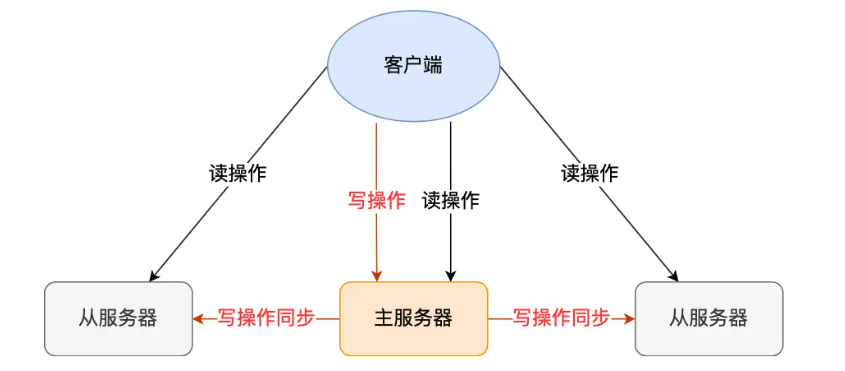

读操作：主库、从库都可以接收

写操作：⾸先到主库执⾏，然后，主库将写操作同步给从库

我们可以使用 `replicaof`（Redis 5.0 之前使用 slaveof）命令形成主服务器和从服务器的关系。

```sql
# 服务器 B 执行这条命令，这样的话B就成为了A的从库
replicaof <服务器 A 的 IP 地址> <服务器 A 的 Redis 端口号>
```

### 全量复制

全量复制为主从库间进行的第一次复制操作

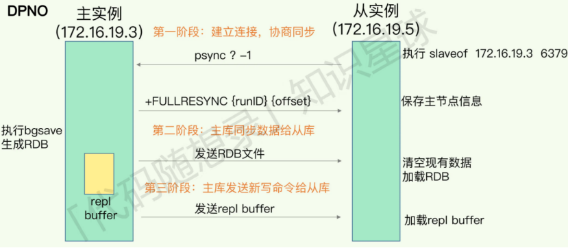

第⼀阶段：

从库和主库建⽴起连接，并告诉主库即将进⾏同步，主库确认回复后，主从库间就可以开始同步了

psync 命令包含两个参数，分别是**主服务器的 runID** 和**复制进度 offset**。

- runID，每个 Redis 服务器在启动时都会自动生产一个随机的 ID 来唯一标识自己。当从服务器和主服务器第一次同步时，因为不知道主服务器的 run ID，所以将其设置为 "?"。
- offset，表示复制的进度，第一次同步时，其值为 -1。

主服务器收到 psync 命令后，会用 `FULLRESYNC` 作为响应命令返回给对方。且这个响应命令会带上两个参数：主服务器的 runID 和主服务器目前的复制进度 offset。从服务器收到响应后，会记录这两个值。

第⼆阶段：

主服务器会执行 bgsave 命令来生成 RDB 文件，然后把文件发送给从服务器。从服务器收到 RDB 文件后，会先清空当前的数据，然后载入 RDB 文件。

bgsave是不会阻塞主线程的，因此这期间的写操作并没有记录在生成的RDB文件中，这时主从服务器的数据就不一致了。

那么为了保证主从服务器的数据一致性，主服务器在下面这三个时间间隙中将收到的写操作命令，写入到 replication buffer 缓冲区里：

- 主服务器生成 RDB 文件期间
- 主服务器发送 RDB 文件给从服务器期间
- 「从服务器」加载 RDB 文件期间

第三个阶段：

在主服务器生成的 RDB 文件发送完，从服务器收到 RDB 文件后，丢弃所有旧数据，将 RDB 数据载入到内存。完成 RDB 的载入后，会回复一个确认消息给主服务器。

接着，主服务器将 replication buffer 缓冲区里所记录的写操作命令发送给从服务器，从服务器执行来自主服务器 replication buffer 缓冲区里发来的命令，这时主从服务器的数据就一致了。

### 命令传播

主从服务器在完成第一次同步后，双方之间就会维护一个 TCP 连接。

后续主服务器可以通过这个连接继续将写操作命令传播给从服务器，然后从服务器执行该命令，使得与主服务器的数据库状态相同。

而且这个连接是长连接的，目的是避免频繁的 TCP 连接和断开带来的性能开销。

这个过程被称为基于长连接的命令传播，通过这种方式来保证第一次同步后的主从服务器的数据一致性。

### 分摊主服务器的压力

从服务器底下还可以再设从服务器，这样的目的是避免每个从服务器都和主服务器进行同步带来的两个问题：

- 由于是通过 bgsave 命令来生成 RDB 文件的，那么主服务器就会忙于使用 fork() 创建子进程，如果主服务器的内存数据非大，在执行 fork() 函数时是会阻塞主线程的，从而使得 Redis 无法正常处理请求；
- 传输 RDB 文件会占用主服务器的网络带宽，会对主服务器响应命令请求产生影响。

### 增量复制

增量复制发生在从库发生宕机，重新连接后

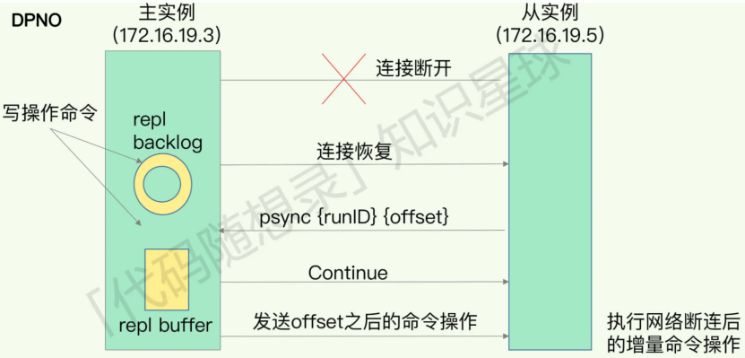

​				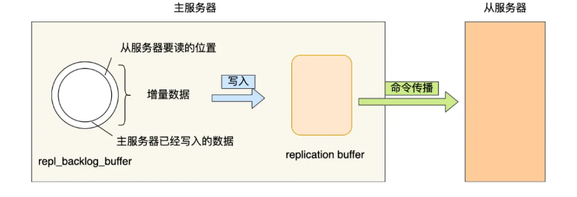	

若从库发⽣宕机，主库会把断连期间收到的写操作命令，写到repl_backlog_buffer中，当从库重连后，从库⾸先会 给主库发送 psync 命令，并把⾃⼰当前的 slave_repl_offset 发给主库，主库会判断⾃⼰的 master_repl_offset 和 slave_repl_offset 之间的差距。若此时从库相差 > repl_backlog_buffer说明可能⼀个从库如果和主库断连时间过长，不能够进⾏增量复制(因为前⾯的值被覆盖的了，会导致数据不⼀致)，所以直接进⾏全量复制

​	⽽从库相差 < repl_backlog_buffer，则将master_repl_offset 和 slave_repl_offset 之间的差距发送给从库进⾏执⾏

### 总结/面试题

Redis 的主从库同步的基本原理，总结来说，有三种模式：全量复制、基于长连接的命令传播，以及增量复制

​	第⼀次同步(本来就是全量复制)或者增量复制时master_repl_offset 和 slave_repl_offset差值>repl_backlog_buffer 时(repl_backlog_size这个配置参数) 就⽆法增量复制，就被迫导致全量复制

​	主从库正常运⾏后的常规同步阶段，在这个阶段中，主从库之间通过命令传播实现同步。

​	从库断开重连后进⾏增量复制

#### 主从全量同步使⽤RDB⽽不使⽤AOF的原因

​	1.RDB⽂件内容是经过压缩的⼆进制数据（不同数据类型数据做了针对性优化），⽂件很⼩。⽽AOF⽂件记录的 是每⼀次写操作的命令，写操作越多⽂件会变得很⼤，其中还包括很多对同⼀个key的多次冗余操作

​	2.打开AOF就要选择⽂件刷盘的策略，选择不当会严重影响Redis性能。⽽RDB只有在需要定时备份和主从全量同步数据时才会触发⽣成⼀次快照

#### 如何判断Redis某个节点正常工作

Redis 判断节点是否正常工作，基本都是通过互相的 ping-pong 心跳检测机制，如果有一半以上的节点去 ping 一个节点的时候没有 pong 回应，集群就会认为这个节点挂掉了，会断开与这个节点的连接。

Redis 主从节点发送的心态间隔是不一样的，而且作用也有一点区别：

- Redis 主节点默认每隔 10 秒对从节点发送 ping 命令，判断从节点的存活性和连接状态，可通过参数repl-ping-slave-period控制发送频率。
- Redis 从节点每隔 1 秒发送 replconf ack{offset} 命令，给主节点上报自身当前的复制偏移量，目的是为了：
    - 实时监测主从节点网络状态；
    - 上报自身复制偏移量， 检查复制数据是否丢失， 如果从节点数据丢失， 再从主节点的复制缓冲区中拉取丢失数据

#### 主从复制架构中，过期key如何处理

主节点处理了一个key或者通过淘汰算法淘汰了一个key，这个时间主节点模拟一条del命令发送给从节点，从节点收到该命令后，就进行删除key的操作。

#### 主从复制中两个 Buffer(replication buffer 、repl backlog buffer)有什么区别

出现的阶段不同：

- repl backlog buffer 是在增量复制阶段出现，一个主节点只分配一个 repl backlog buffer；
- replication buffer 是在全量复制阶段和增量复制阶段都会出现，主节点会给每个新连接的从节点，分配一个 replication buffer

这两个 Buffer 都有大小限制的，当缓冲区满了之后，发生的事情不一样：

- 当 repl backlog buffer 满了，因为是环形结构，会直接覆盖起始位置数据
- 当 replication buffer 满了，会导致连接断开，删除缓存，从节点重新连接，重新开始全量复制

#### 如何应对主从数据不一致

主从数据不一致的现象，是因为主从节点间的命令复制是异步进行的，所以无法实现强一致性保证（主从数据时时刻刻保持一致）。

应对的方法有：

1. 尽量保证主从节点间的网络连接状况良好，避免主从节点在不同的机房
2. 开发一个外部程序来监控主从节点间的复制进度，及时监控 master_repl_offset 和 slave_repl_offset 之间的差距，如果大于设定的阈值，可以让客户端先不与这个从节点进行数据读取

#### 主从切换如何减少数据丢失

主从切换过程中，产生数据丢失的情况有两种：异步复制同步丢失，集群产生脑裂数据丢失。

##### 异步复制同步丢失

异步复制同步丢失指的是主节点还没来得及同步给从节点时发生了断电，那么主节点内存中的数据会丢失。

Redis 配置里有一个参数 min-slaves-max-lag，表示一旦所有的从节点数据复制和同步的延迟都超过了 min-slaves-max-lag 定义的值，那么主节点就会拒绝接收任何请求。这样可以将主节点和从节点的数据差控制在10s内，即使 master 宕机也只是这未复制的 10s 数据。

那么对于客户端，当客户端发现 master 不可写后，我们可以采取降级措施，将数据暂时写入本地缓存和磁盘中，在一段时间（等 master 恢复正常）后重新写入 master 来保证数据不丢失，也可以将数据写入 kafka 消息队列，等 master 恢复正常，再隔一段时间去消费 kafka 中的数据，让将数据重新写入 master。

##### 集群产生脑裂数据丢失

主节点网络出现问题与从节点失联，但客户端仍然写数据到这个主节点中。哨兵机制检测到主节点挂了，从从节点中推举出一个新的主节点。失联的主节点重新连接，但因为已经出现新的主节点，所以将自己降级为从节点。从节点需要做全量同步，因此就会丢失“客户端仍然写数据到这个主节点”时的数据。

解决方案为：当主节点发现「从节点下线的数量太多」，或者「网络延迟太大」的时候，那么主节点会禁止写操作，直接把错误返回给客户端。

#### 主从节点如何实现故障自动转换

哨兵机制


## Redis 哨兵

核心是实现主从节点故障转移。哨兵其实是一个运行在特殊模式下的 Redis 进程，所以它也是一个节点。它相当于是“观察者节点”，观察的对象是主从节点。

哨兵节点主要负责三件事情：监控，选主，通知

### 如何判断主节点真的故障

哨兵会每隔 1 秒给所有主从节点发送 PING 命令，当主从节点收到 PING 命令后，会发送一个响应命令给哨兵，这样就可以判断它们是否在正常运行。

如果主节点或者从节点没有在规定的时间内响应哨兵的 PING 命令，哨兵就会将它们标记为「**主观下线**」。这个「规定的时间」是配置项 `down-after-milliseconds` 参数设定的，单位是毫秒。

除了主观下线外，还有客观下线，后者只适用于主节点。之所以针对「主节点」设计「主观下线」和「客观下线」两个状态，是因为有可能「主节点」其实并没有故障，可能只是因为主节点的系统压力比较大或者网络发送了拥塞，导致主节点没有在规定时间内响应哨兵的 PING 命令。

所以，为了减少误判的情况，哨兵在部署的时候不会只部署一个节点，而是用多个节点部署成哨兵集群（*最少需要三台机器来部署哨兵集群*），通过多个哨兵节点一起判断，就可以就可以避免单个哨兵因为自身网络状况不好，而误判主节点下线的情况。同时，多个哨兵的网络同时不稳定的概率较小，由它们一起做决策，误判率也能降低。

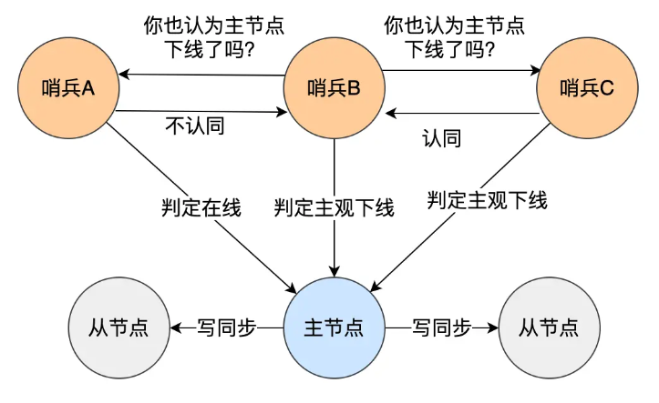

当一个哨兵判断主节点为「主观下线」后，就会向其他哨兵发起命令，其他哨兵收到这个命令后，就会根据自身和主节点的网络状况，做出赞成投票或者拒绝投票的响应。一般来说，赞成数达到哨兵个数的1/2+1时，就将主节点从主观下线判断为客观下线，并准备选出一个从节点来做新主节点。

### 由哪个哨兵进行主从故障转移

从上面的“减少误判”的行为可看出，哨兵是以哨兵集群的方式存在的。

实际让哪个哨兵进行主从故障转移，需要在哨兵集群中选出一个 leader，让 leader 来执行主从切换。leader的候选者是判断主节点为「客观下线」的人。候选者会向其他哨兵发送命令，表明希望成为 Leader 来执行主从切换，并让所有其他哨兵对它进行投票。每个哨兵只有一次投票机会，如果用完后就不能参与投票了，可以投给自己或投给别人，但是只有候选者才能把票投给自己。

因此，哨兵节点实际上至少要有三个，不然当一个哨兵挂掉了后，就无法获得多数票并进行主从节点切换了。哨兵节点的数量最好是奇数，哨兵个数最好为1/2+1。

### 主从故障转移的过程

主从故障转移操作包含以下四个步骤：

1.在已下线主节点（旧主节点）属下的所有「从节点」里面，挑选出一个从节点，并将其转换为主节点。

​	从节点的选择标准：网络连接状态--优先级（越小越靠前）--复制进度--ID号（越小越靠前）

​	网络连接状态时通过主节点故障前主从网络之前记录的断连次数确定的，如果发生断连的次数超过了 10 次，就说明这个从节点的网络状况不好，不适合作为新主节点。

​	在选举出从节点后，哨兵 leader 向被选中的从节点发送 `SLAVEOF no one` 命令，让这个从节点解除从节点的身份，将其变为新主节点。在发送 `SLAVEOF no one` 命令之后，哨兵 leader 会以每秒一次的频率向被升级的从节点发送 `INFO` 命令（没进行故障转移之前，`INFO` 命令的频率是每十秒一次），并观察命令回复中的角色信息，当被升级节点的角色信息从原来的 slave 变为 master 时，哨兵 leader 就知道被选中的从节点已经顺利升级为主节点了。

2.让已下线主节点属下的所有「从节点」修改复制目标，修改为复制「新主节点」

​	哨兵 leader 下一步要做的就是，让已下线主节点属下的所有「从节点」指向「新主节点」，这一动作可以通过向「从节点」发送 `SLAVEOF` 命令来实现。

3.将新主节点的 IP 地址和信息，通过「发布者/订阅者机制」通知给客户端

​	每个哨兵节点提供发布者/订阅者机制，客户端可以从哨兵订阅消息。哨兵提供的消息订阅频道有很多，不同频道包含了主从节点切换过程中的不同关键事件.

​	客户端和哨兵建立连接后，客户端会订阅哨兵提供的频道。主从切换完成后，哨兵就会向 `+switch-master` 频道(主库地址发生变化)发布新主节点的 IP 地址和端口的消息，这个时候客户端就可以收到这条信息，然后用这里面的新主节点的 IP 地址和端口进行通信了。

​	通过发布者/订阅者机制机制，有了这些事件通知，客户端不仅可以在主从切换后得到新主节点的连接信息，还可以监控到主从节点切换过程中发生的各个重要事件。这样，客户端就可以知道主从切换进行到哪一步了，有助于了解切换进度。

4.继续监视旧主节点，当这个旧主节点重新上线时，将它设置为新主节点的从节点

​	故障转移操作最后要做的是，继续监视旧主节点，当旧主节点重新上线时，哨兵集群就会向它发送 `SLAVEOF` 命令，让它成为新主节点的从节点。

### 哨兵集群

哨兵集群也使用了发布者/订阅者机制，在配置哨兵的信息时，只需要填下面这几个参数，设置主节点名字、主节点的 IP 地址和端口号以及 quorum 值。

```c
sentinel monitor <master-name> <ip> <redis-port> <quorum> 
```

在主从集群中，主节点上有一个名为`__sentinel__:hello`的频道，不同哨兵就是通过它来相互发现，实现互相通信的。例如，哨兵 A 把自己的 IP 地址和端口的信息发布到`__sentinel__:hello` 频道上，哨兵 B 和 C 订阅了该频道。那么此时，哨兵 B 和 C 就可以从这个频道直接获取哨兵 A 的 IP 地址和端口号。然后，哨兵 B、C 可以和哨兵 A 建立网络连接。通过这个方式，哨兵 B 和 C 也可以建立网络连接，这样一来，哨兵集群就形成了。

#### 哨兵集群如何知道从节点的信息

主节点知道所有「从节点」的信息，所以哨兵会每 10 秒一次的频率向主节点发送 INFO 命令来获取所有「从节点」的信息。主节点接受到这个命令后，就会把从节点列表返回给哨兵。接着，哨兵就可以根据从节点列表中的连接信息，和每个从节点建立连接，并在这个连接上持续地对从节点进行监控。

正是通过 Redis 的发布者/订阅者机制，哨兵之间可以相互感知，然后组成集群，同时，哨兵又通过 INFO 命令，在主节点里获得了所有从节点连接信息，于是就能和从节点建立连接，并进行监控了。


## Redis集群方案

### Codis

#### Codis介绍

针对单个Redis实例只能利用单个核心，存在海量数据管理的压力，Redis集群方案应运而生，Codis是其中的方案之一。

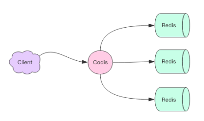

Codis是一个代理中间件，它和Redis一样使用Redis协议对外提供服务，当客户端向Codis发送指令时，Codis 负责将指令转发到后面的 Redis 实例来执行，并将返回结果再转回给客户端。Codis 上挂接的所有 Redis 实例构成一个 Redis 集群，当集群空间不足时，可以通过动态增加 Redis 实例来实现扩容需求。

同时，可以启动多个Codis 代理，显著增加整体的 QPS 需求，还能起到容灾功能，挂掉一个 Codis 代理没关系，还有很多 Codis 代理可以继续服务。

#### Codis分片

Codis 要负责将特定的 key 转发到特定的 Redis 实例，因此它将所有的 key 默认划分为 1024 个槽位(slot)，它首先对客户端传过来的 key 进行 crc32 运算计算哈希值，再将 hash 后的整数值对 1024 这个整数进行取模得到一个余数，这个余数就是对应 key 的槽位。

每个槽位都会唯一映射到后面的多个 Redis 实例之一，Codis 会在内存维护槽位和Redis 实例的映射关系。这样有了上面 key 对应的槽位，Codis可以很清晰的知道应该转发到哪个槽位。

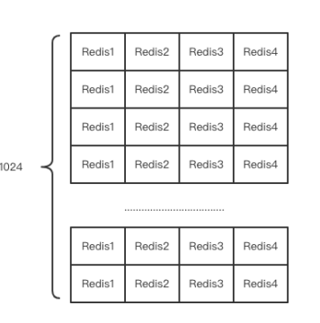

#### 不同的Codis实例之间的槽位关系如何同步


Codis 将槽位关系存储在 zk 中，并且提供了一个 Dashboard 可以用来观察和修改槽位关系，当槽位关系变化时，Codis Proxy 会监听到变化并重新同步槽位关系，从而实现多个Codis Proxy 之间共享相同的槽位关系配置。

#### Codis扩容

通过遍历指定的slot下所有的key，然后挨个迁移到新的Redis节点。如果中间出现了“正在迁移的key接收请求”的情况，Codis会强制对单个key进行迁移，然后再将请求转发到新的Redis实例。注意迁移的对象是key而不是槽。

#### Codis的优势与缺陷

优势——

1.提供了扩容和自动均衡（当每个Redis实例下对应的槽位数量不均衡时，会自动进行迁移）

2.基于zk/etcd负责，因此省去了复杂的分布式一致性代码的编写工作

缺陷——

1.更新速度慢，需要随着Redis版本的更新而更新

2.性能开销

3.因为Codis中所有key分散在不同的Redis实例中，因此很多Redis的基本内容就无法只吃了，例如事务，rename操作等

4.为了支持扩容，单个key的数据不能很大，否则在迁移时会带来很大的卡顿，官方建议小于1M

### RedisCluste

#### RedisCluste定义

RedisCluste是Redis自己提供的Redis集群化方案。与Codis不同，它是去中心化的。

该集群有三个 Redis 节点组成，每个节点负责整个集群的一部分数据，每个节点负责的数据多少可能不一样。这三个节点相互连接组成一个对等的集群，它们之间通过一种特殊的二进制协议相互交互集群信息。

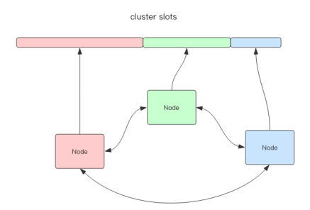

Redis Cluster将所有数据划分为16384的槽位，相比于Codis的1024个槽位划分更精细，每个节点负责其中一部分槽位。槽位的信息存储于每个节点中，它不像Codis，不需要另外的分布式存储来存储节点的槽位信息。

当 Redis Cluster 的客户端来连接集群时，它也会得到一份集群的槽位配置信息。这样当客户端要查找某个 key 时，可以直接定位到目标节点。

Cluster 默认会对 key 值使用 crc32 算法进行 hash 得到一个整数值，然后用这个整数值对 16384 进行取模来得到具体槽位。

Cluster 还允许用户强制某个 key 挂在特定槽位上，通过在 key 字符串里面嵌入 tag 标记，这就可以强制 key 所挂在的槽位等于 tag 所在的槽位。

#### RedisCluster跳转

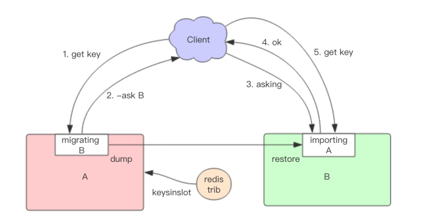

Redis Cluster迁移的单位是槽（迁移的内容是一整个槽下的所有key），Redis Cluster一个槽一个槽进行迁移，当一个槽正在迁移时，这个槽就处于中间过渡状态。这个槽在原节点的状态为 migrating，在目标节点的状态为 importing，表示数据正在从源流向目标。

迁移工具首先会在在源和目标节点设置好中间过渡状态，然后一次性获取源节点槽位的所有 key 列表（也可以获取部分key）。每个 key 的迁移过程是以原节点作为目标节点的「客户端」，原节点对当前的 key 执行 dump 指令得到序列化内容，然后通过「客户端」向目标节点发送指令 restore 携带序列化的内容作为参数，目标节点再进行反序列化就可以将内容恢复到目标节点的内存中，然后返回「客户端」OK，原节点「客户端」收到后再把当前节点的 key 删除掉就完成了单个 key 迁移的整个过程。

源节点获取内容 => 存到目标节点 => 从源节点删除内容

这里的迁移过程是同步的，即在目标节点执行 restore 指令到原节点删除 key 之间，原节点的主线程会处于阻塞状态，直到 key 被成功删除。

如果迁移过程中突然出现网络故障，整个 slot 的迁移只进行了一半。这时两个节点依旧处于中间过渡状态。待下次迁移工具重新连上时，会提示用户继续进行迁移。

#### Redis Cluster下的哨兵系统

Cluster提供哨兵系统，可以为每个主节点设置若干个从节点，单主节点故障时，集群会自动将其中某个从节点提升为主节点。如果某个主节点没有从节点，那么当它发生故障时，集群将完全处于不可用状态。

因为 Redis Cluster 是去中心化的，一个节点认为某个节点失联了并不代表所有的节点都认为它失联了。所以集群还得经过一次协商的过程，只有当大多数节点都认定了某个节点失联了，集群才认为该节点需要进行主从切换来容错。

Redis 集群节点采用 Gossip 协议来广播自己的状态以及自己对整个集群认知的改变。比如一个节点发现某个节点失联了 (PFail)，它会将这条信息向整个集群广播，其它节点也就可以收到这点失联信息。如果一个节点收到了某个节点失联的数量 (PFail Count) 已经达到了集群的大多数，就可以标记该节点为确定下线状态 (Fail)，然后向整个集群广播，强迫其它节点也接收该节点已经下线的事实，并立即对该失联节点进行主从切换。


## Redis事务

Redis使用multi/exec/discord来表示事务的begin/commit/rollback，所有指令在收到exec之前不执行，而是缓存到一个事务队列中，在接收exec后才开始完整执行并返回，实现了原子性。discord用于丢弃事务缓存队列中的所有指令。

Redis 事务在发送每个指令到事务缓存队列时都要经过一次网络读写，当一个事务内部的指令较多时，需要的网络 IO 时间也会线性增长。所以通常 Redis 的客户端在执行事务时都会结合 pipeline 一起使用，这样可以将多次 IO 操作压缩为单次 IO 操作。

Redis提供了watch的机制，它是一种乐观锁。watch 会在事务开始之前盯住 1 个或多个关键变量，当事务执行时，也就是服务器收到了 exec 指令要顺序执行缓存的事务队列时，Redis 会检查关键变量自 watch 之后，是否被修改了 (包括当前事务所在的客户端)。如果关键变量被人动过了，exec 指令就会返回 null 回复告知客户端事务执行失败，这个时候客户端一般会选择重试。

Redis 禁止在 multi 和 exec 之间执行 watch 指令，而必须在 multi 之前做好盯住关键变量，否则会出错。


## Redis面试题

### Redis是什么

Redis 是一种基于内存的数据库，对数据的读写操作都是在内存中完成，因此读写速度非常快，常用于缓存，消息队列、分布式锁等场景。

Redis 提供了多种数据类型来支持不同的业务场景，比如 String(字符串)、Hash(哈希)、 List (列表)、Set(集合)、Zset(有序集合)、Bitmaps（位图）、HyperLogLog（基数统计）、GEO（地理信息）、Stream（流），并且对数据类型的操作都是原子性的，因为执行命令由单线程负责的，不存在并发竞争的问题。

除此之外，Redis 还支持事务 、持久化、Lua 脚本、多种集群方案（主从复制模式、哨兵模式、切片机群模式）、发布/订阅模式，内存淘汰机制、过期删除机制等等

### Redis和Memcached有什么区别

Redis 作为缓存，但是 Memcached 也是基于内存的数据库，为什么不选择它作为缓存呢？

Redis 与 Memcached 共同点：

- 都是基于内存的数据库，一般都用来当做缓存使用
- 都有过期策略
- 性能都非常高

Redis 与 Memcached 的区别：

- Redis 支持的数据类型更丰富（String、Hash、List、Set、ZSet），而 Memcached 只支持最简单的 key-value 数据类型
- Redis 支持数据的持久化，可以将内存中的数据保持在磁盘中，重启的时候可以再次加载进行使用，而 Memcached 没有持久化功能，数据全部存在内存之中，Memcached 重启或者挂掉后，数据就没了；
- Redis 原生支持集群模式，Memcached 没有原生的集群模式，需要依靠客户端来实现往集群中分片写入数据；
- Redis 支持发布订阅模型、Lua 脚本、事务等功能，而 Memcached 不支持；

### 为什么用 Redis 作为 MySQL 的缓存

因为 Redis 具备「高性能」和「高并发」两种特性。

Redis的高性能体现在用户在“下一次访问数据”的时候只需要直接从缓存中读取即可（不考虑缓存预热的情况）。操作 Redis 缓存就是直接操作内存，所以速度相当快。如果 MySQL 中的对应数据改变的之后，同步改变 Redis 缓存中相应的数据即可，不过这里会有 Redis 和 MySQL 双写一致性的问题。

Redis具备高并发，单台设备的 Redis 的 QPS（Query Per Second，每秒钟处理完请求的次数） 是 MySQL 的 10 倍，Redis 单机的 QPS 能轻松破 10w，而 MySQL 单机的 QPS 很难破 1w。

所以，直接访问 Redis 能够承受的请求是远远大于直接访问 MySQL 的，所以我们可以考虑把数据库中的部分数据转移到缓存中去，这样用户的一部分请求会直接到缓存这里而不用经过数据库。

### Redis 数据类型以及使用场景分别是什么

Redis 提供了丰富的数据类型，常见的有五种数据类型：String（字符串），Hash（哈希），List（列表），Set（集合）、Zset（有序集合）。随着 Redis 版本的更新，后面又支持了四种数据类型： BitMap（2.2 版新增）、HyperLogLog（2.8 版新增）、GEO（3.2 版新增）、Stream（5.0 版新增）。

- String 类型的应用场景：缓存对象、常规计数、分布式锁、共享 session 信息等。
- List 类型的应用场景：消息队列（但是有两个问题：1. 生产者需要自行实现全局唯一 ID；2. 不能以消费组形式消费数据）等。
- Hash 类型：缓存对象、购物车等。
- Set 类型：聚合计算（并集、交集、差集）场景，比如点赞、共同关注、抽奖活动等。
- Zset 类型：排序场景，比如排行榜、电话和姓名排序等。
- BitMap（2.2 版新增）：二值状态统计的场景，比如签到、判断用户登陆状态、连续签到用户总数等；
- HyperLogLog（2.8 版新增）：海量数据基数统计的场景，比如百万级网页 UV 计数等；
- GEO（3.2 版新增）：存储地理位置信息的场景，比如滴滴叫车；
- Stream（5.0 版新增）：消息队列，相比于基于 List 类型实现的消息队列，有这两个特有的特性：自动生成全局唯一消息ID（进行重复消息判断），支持以消费组形式消费数据。

Redis数据类型如何实现：

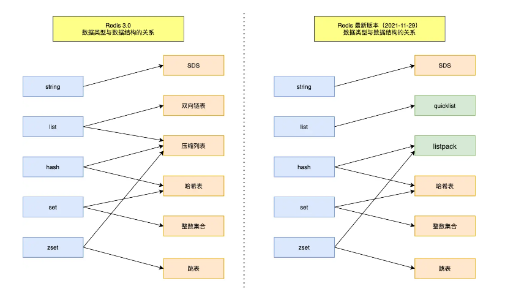

### Redis是单线程么

Redis 单线程指的是「接收客户端请求->解析请求 ->进行数据读写等操作->发送数据给客户端」这个过程是由一个线程（主线程）来完成的，这也是我们常说 Redis 是单线程的原因。但是，Redis 程序并不是单线程的，Redis 在启动的时候，是会启动后台线程（BIO）的：

- Redis 在 2.6 版本，会启动 2 个后台线程，分别处理关闭文件、AOF 刷盘这两个任务；
- Redis 在 4.0 版本之后，新增了一个新的后台线程，用来异步释放 Redis 内存，也就是 lazyfree 线程。

之所以 Redis 为「关闭文件、AOF 刷盘、释放内存」这些任务创建单独的线程来处理，是因为这些任务的操作都是很耗时的，如果把这些任务都放在主线程来处理，那么 Redis 主线程就很容易发生阻塞，这样就无法处理后续的请求了。后台线程相当于一个消费者，生产者把耗时任务丢到任务队列中，消费者（BIO）不停轮询这个队列，拿出任务就去执行对应的方法即可。关闭文件、AOF 刷盘、释放内存这三个任务都有各自的任务队列。

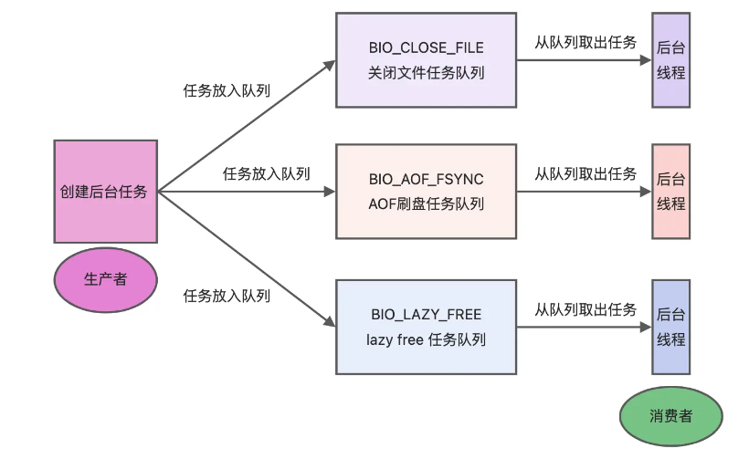

### Redis单线程模式是怎样的

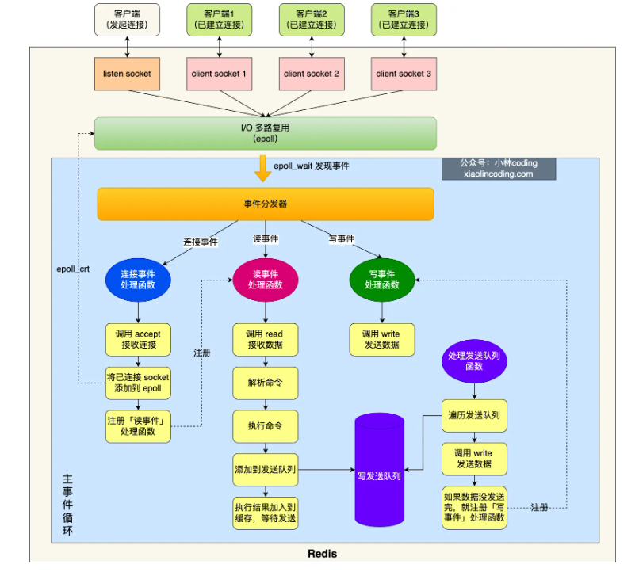

### Redis单线程为什么这么快

单线程的 Redis 吞吐量可以达到 10W/每秒，之所以 Redis 采用单线程（网络 I/O 和执行命令）那么快，有如下几个原因：

- Redis 的大部分操作**都在内存中完成**，并且采用了高效的数据结构，因此 Redis 瓶颈可能是机器的内存或者网络带宽，而并非 CPU，既然 CPU 不是瓶颈，那么自然就采用单线程的解决方案了；
- Redis 采用单线程模型可以**避免了多线程之间的竞争**，省去了多线程切换带来的时间和性能上的开销，而且也不会导致死锁问题
- Redis 采用了 **I/O 多路复用机制**处理大量的客户端 Socket 请求，IO 多路复用机制是指一个线程处理多个 IO 流，就是我们经常听到的 select/epoll 机制。简单来说，在 Redis 只运行单线程的情况下，该机制允许内核中，同时存在多个监听 Socket 和已连接 Socket。内核会一直监听这些 Socket 上的连接请求或数据请求。一旦有请求到达，就会交给 Redis 线程处理，这就实现了一个 Redis 线程处理多个 IO 流的效果。

实际上，对于Redis来说，CPU性能并不是最大的瓶颈，更多是受到内存大小和网络I/O的限制，所以 Redis 核心网络模型使用单线程并没有什么问题，如果想要使用服务的多核CPU，可以在一台服务器上启动多个节点或者采用分片集群的方式。

### Redis6.0后为什么引入了多线程

虽然 Redis 的主要工作（网络 I/O 和执行命令）一直是单线程模型，但是在 Redis 6.0 版本之后，也采用了多个 I/O 线程来处理网络请求，这是因为随着网络硬件的性能提升，Redis 的性能瓶颈有时会出现在网络 I/O 的处理上。

所以为了提高网络 I/O 的并行度，Redis 6.0 对于网络 I/O 采用多线程来处理。但是对于命令的执行，Redis 仍然使用单线程来处理。

Redis 6.0 版本之后，Redis 在启动的时候，默认情况下会额外创建 6 个线程（*这里的线程数不包括主线程*）：

- Redis-server ： Redis的主线程，主要负责执行命令；
- bio_close_file、bio_aof_fsync、bio_lazy_free：三个后台线程，分别异步处理关闭文件任务、AOF刷盘任务、释放内存任务；
- io_thd_1、io_thd_2、io_thd_3：三个 I/O 线程，io-threads 默认是 4 ，所以会启动 3（4-1）个 I/O 多线程，用来分担 Redis 网络 I/O 的压力。

### Redis如何实现数据不丢失

Redis 实现了数据持久化的机制，这个机制会把数据存储到磁盘，这样在 Redis 重启就能够从磁盘中恢复原有的数据。Redis 共有三种数据持久化的方式：

- **AOF 日志**：每执行一条写操作命令，就把该命令以追加的方式写入到一个文件里；
- **RDB 快照**：将某一时刻的内存数据，以二进制的方式写入磁盘；
- **混合持久化方式**：Redis 4.0 新增的方式，集成了 AOF 和 RBD 的优点；

### AOF日志如何实现

Redis 在执行完一条写操作命令后，就会把该命令以追加的方式写入到一个文件里，然后 Redis 重启时，会读取该文件记录的命令，然后逐一执行命令的方式来进行数据恢复。

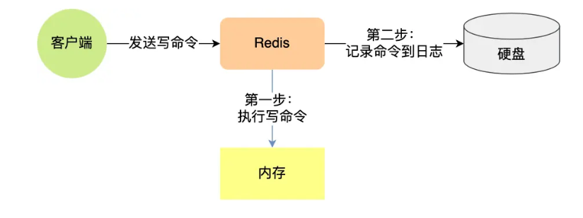

Reids 是先执行写操作命令后，才将该命令记录到 AOF 日志里的（与redo log的WAL策略在行为上相同），这么做其实有两个好处。

- **避免额外的检查开销**：因为如果先将写操作命令记录到 AOF 日志里，再执行该命令的话，如果当前的命令语法有问题，那么如果不进行命令语法检查，该错误的命令记录到 AOF 日志里后，Redis 在使用日志恢复数据时，就可能会出错。
- **不会阻塞当前写操作命令的执行**：因为当写操作命令执行成功后，才会将命令记录到 AOF 日志。

当然，这样做也会带来风险：

- **数据可能会丢失：** 执行写操作命令和记录日志是两个过程，那当 Redis 在还没来得及将命令写入到硬盘时，服务器发生宕机了，这个数据就会有丢失的风险。
- **可能阻塞其他操作：** 由于写操作命令执行成功后才记录到 AOF 日志，所以不会阻塞当前命令的执行，但因为 AOF 日志也是在主线程中执行，所以当 Redis 把日志文件写入磁盘的时候，还是会阻塞后续的操作无法执行。

AOF有三种回写策略，本质是fsycn函数的执行时机不同：

- **Always**，它的意思是每次写操作命令执行完后，同步将 AOF 日志数据写回硬盘；
- **Everysec**，意思是每次写操作命令执行完后，先将命令写入到 AOF 文件的内核缓冲区，然后每隔一秒将缓冲区里的内容写回到硬盘；
- **No**，不由 Redis 控制写回硬盘的时机，转交给操作系统控制写回的时机，也就是每次写操作命令执行完后，先将命令写入到 AOF 文件的内核缓冲区，再由操作系统决定何时将缓冲区内容写回硬盘。

AOF日志过大，会触发AOF重写机制，来压缩 AOF 文件。AOF 重写机制是在重写时，读取当前数据库中的所有键值对，然后将每一个键值对用一条命令记录到「新的 AOF 文件」，等到全部记录完后，就将新的 AOF 文件替换掉现有的 AOF 文件。

重写工作完成后，就会将新的 AOF 文件覆盖现有的 AOF 文件，这就相当于压缩了 AOF 文件，使得 AOF 文件体积变小了。（因为每个键值对只需要一条命令即可）

Redis 的重写 AOF 过程是由后台子进程 **bgrewriteaof** 来完成的，这么做可以达到两个好处：

- 子进程进行 AOF 重写期间，主进程可以继续处理命令请求，从而避免阻塞主进程；
- 子进程带有主进程的数据副本，这里使用子进程而不是线程，因为如果是使用线程，多线程之间会共享内存，那么在修改共享内存数据的时候，需要通过加锁来保证数据的安全，而这样就会降低性能。而使用子进程，创建子进程时，父子进程是共享内存数据的，不过这个共享的内存只能以只读的方式，而当父子进程任意一方修改了该共享内存，就会发生「写时复制」，于是父子进程就有了独立的数据副本，就不用加锁来保证数据安全。

触发重写机制后，主进程就会创建重写 AOF 的子进程，此时父子进程共享物理内存，重写子进程只会对这个内存进行只读，重写 AOF 子进程会读取数据库里的所有数据，并逐一把内存数据的键值对转换成一条命令，再将命令记录到重写日志（新的 AOF 文件）。

重写过程中，主进程依然可以正常处理命令，因此为了解决数据不一致问题，Redis 设置了一个 **AOF 重写缓冲区**，这个缓冲区在创建 bgrewriteaof 子进程之后开始使用。在重写 AOF 期间，当 Redis 执行完一个写命令之后，它会**同时将这个写命令写入到 「AOF 缓冲区」和 「AOF 重写缓冲区」**。

主线程在收到子进程完成AOF重写工作的信号后，调用一个信号处理函数，该函数主要做以下工作：

- 将 AOF 重写缓冲区中的所有内容追加到新的 AOF 的文件中，使得新旧两个 AOF 文件所保存的数据库状态一致；
- 新的 AOF 的文件进行改名，覆盖现有的 AOF 文件。

**注意，AOF重写过程中旧的AOF不能撂担子，还是在继续工作的，所以还需要一个AOF缓冲区**

AOF缓冲区:是正常使用AOF作为数据落地中间地带，所有的数据先到AOF缓冲区再到AOF文件中。为了减少频繁地写入 AOF 文件，提高性能。

AOF缓冲区不可以替代AOF重写缓冲区的原因是AOF重写缓冲区记录的是从重写开始后的所有需要重写的命令，而AOF缓冲区本身在不断更新，将里面的部分写到旧AOF文件后缓存的相应部分就会消失。

### RDB快照如何实现

因为 AOF 日志记录的是操作命令，不是实际的数据，所以用 AOF 方法做故障恢复时，需要全量把日志都执行一遍，一旦 AOF 日志非常多，势必会造成 Redis 的恢复操作缓慢。

为了解决这个问题，Redis 增加了 RDB 快照。RDB 快照就是记录某一个瞬间的内存数据，记录的是实际数据，而 AOF 文件记录的是命令操作的日志，而不是实际的数据。因此在 Redis 恢复数据时， RDB 恢复数据的效率会比 AOF 高些，因为直接将 RDB 文件读入内存就可以，不需要像 AOF 那样还需要额外执行操作命令的步骤才能恢复数据。

edis 提供了两个命令来生成 RDB 文件，分别是 save 和 bgsave，他们的区别就在于是否在「主线程」里执行。

Redis 的快照是**全量快照**，也就是说每次执行快照，都是把内存中的「所有数据」都记录到磁盘中。所以执行快照是一个比较重的操作，如果频率太频繁，可能会对 Redis 性能产生影响。如果频率太低，服务器故障时，丢失的数据会更多。

执行 bgsave 过程中，Redis 依然**可以继续处理操作命令**的，也就是数据是能被修改的，关键的技术就在于**写时复制技术（Copy-On-Write, COW）**执行 bgsave 命令的时候，会通过 fork() 创建子进程，此时子进程和父进程是共享同一片内存数据的，因为创建子进程的时候，会复制父进程的页表（大key可能导致阻塞），但是页表指向的物理内存还是一个，此时如果主线程执行读操作，则主线程和 bgsave 子进程互相不影响。

### 为什么会有混合持久化

RDB 优点是数据恢复速度快，但是快照的频率不好把握。频率太低，丢失的数据就会比较多，频率太高，就会影响性能。AOF 优点是丢失数据少，但是数据恢复不快。

为了集成了两者的优点， Redis 4.0 提出了**混合使用 AOF 日志和内存快照**，也叫混合持久化，既保证了 Redis 重启速度，又降低数据丢失风险。

混合持久化工作在 **AOF 日志重写过程**，当开启了混合持久化时，在 AOF 重写日志时，fork 出来的重写子进程会先将与主线程共享的内存数据以 RDB 方式写入到 AOF 文件，然后主线程处理的操作命令会被记录在重写缓冲区里，重写缓冲区里的增量命令会以 AOF 方式写入到 AOF 文件，写入完成后通知主进程将新的含有 RDB 格式和 AOF 格式的 AOF 文件替换旧的的 AOF 文件。也就是说，使用了混合持久化，AOF 文件的**前半部分是 RDB 格式的全量数据，后半部分是 AOF 格式的增量数据**。混合持久化的本质是“全量同步+增量同步”

混合持久化的优点：

- 混合持久化结合了 RDB 和 AOF 持久化的优点，开头为 RDB 的格式，使得 Redis 可以更快的启动，同时结合 AOF 的优点，有减低了大量数据丢失的风险。

混合持久化的缺点：

- AOF 文件中添加了 RDB 格式的内容，使得 AOF 文件的可读性变得很差；
- 兼容性差，如果开启混合持久化，那么此混合持久化 AOF 文件，就不能用在 Redis 4.0 之前版本了。

### Redis如何实现服务高可用

三个策略：主从复制（避免单点故障导致服务不可用），哨兵模式（主从节点故障转移），切片集群（负载均衡）

#### 切片集群模式

当 Redis 缓存数据量大到一台服务器无法缓存时，就需要使用 **Redis 切片集群**（Redis Cluster ）方案，它将数据分布在不同的服务器上，以此来降低系统对单主节点的依赖，从而提高 Redis 服务的读写性能。

Redis Cluster 方案采用哈希槽（Hash Slot），来处理数据和节点之间的映射关系。在 Redis Cluster 方案中，**一个切片集群共有 16384 个哈希槽**，这些哈希槽类似于数据分区，每个键值对都会根据它的 key，被映射到一个哈希槽中。哈希槽又映射到具体的 Redis 节点上（即每个节点保存一定量的哈希槽）。

### 集群脑裂导致数据丢失的问题如何解决

由于网络问题，集群节点之间失去联系。主从数据不同步；重新平衡选举，产生两个主服务。等网络恢复，旧主节点会降级为从节点，再与新主节点进行同步复制的时候，由于会从节点会清空自己的缓冲区，所以导致之前客户端写入的数据丢失了。

解决方案就是：当主节点发现从节点下线或者通信超时的总数量小于阈值时，那么禁止主节点进行写数据，直接把错误返回给客户端。这样就能避免数据写入到旧主节点的问题。

### Redis使用的过期删除策略是什么

Redis 是可以对 key 设置过期时间的，因此需要有相应的机制将已过期的键值对删除，而做这个工作的就是过期键值删除策略。每当我们对一个 key 设置了过期时间时，Redis 会把该 key 带上过期时间存储到一个**过期字典**（expires dict）中，也就是说「过期字典」保存了数据库中所有 key 的过期时间。

当我们查询一个 key 时，Redis 首先检查该 key 是否存在于过期字典中：

- 如果不在，则正常读取键值；
- 如果存在，则会获取该 key 的过期时间，然后与当前系统时间进行比对，如果比系统时间大，那就没有过期，否则判定该 key 已过期。

Redis 使用的过期删除策略是「惰性删除+定期删除」这两种策略配和使用。

惰性删除：不主动删除过期键，每次从数据库访问 key 时，都检测 key 是否过期，如果过期则删除该 key

定期删除：每隔一段时间「随机」从数据库中取出一定数量的** key 进行检查，并删除其中的过期key

### Redis 持久化时，对过期键会如何处理的

RDB 文件分为两个阶段，RDB 文件生成阶段和加载阶段：

- RDB 文件生成阶段：从内存状态持久化成 RDB（文件）的时候，会对 key 进行过期检查，过期的键「不会」被保存到新的 RDB 文件中，因此 Redis 中的过期键不会对生成新 RDB 文件产生任何影响。
- RDB 加载阶段：RDB 加载阶段时，要看服务器是主服务器还是从服务器，分别对应以下两种情况：
    - 如果 Redis 是「主服务器」运行模式的话，在载入 RDB 文件时，程序会对文件中保存的键进行检查，过期键「不会」被载入到数据库中。所以过期键不会对载入 RDB 文件的主服务器造成影响；
    - 如果 Redis 是「从服务器」运行模式的话，在载入 RDB 文件时，不论键是否过期都会被载入到数据库中。但由于主从服务器在进行数据同步时，从服务器的数据会被清空。所以一般来说，过期键对载入 RDB 文件的从服务器也不会造成影响。

AOF 文件分为两个阶段，AOF 文件写入阶段和 AOF 重写阶段。

- AOF 文件写入阶段：当 Redis 以 AOF 模式持久化时，如果数据库某个过期键还没被删除，那么 AOF 文件会保留此过期键，当此过期键被删除后，Redis 会向 AOF 文件追加一条 DEL 命令来显式地删除该键值。
- AOF 重写阶段：执行 AOF 重写时，会对 Redis 中的键值对进行检查，已过期的键不会被保存到重写后的 AOF 文件中，因此不会对 AOF 重写造成任何影响。

### Redis主从模式中，会对过期键如何处理

当 Redis 运行在主从模式下时，从库不会进行过期扫描，从库对过期的处理是被动的。也就是即使从库中的 key 过期了，如果有客户端访问从库时，依然可以得到 key 对应的值，像未过期的键值对一样返回。

从库的过期键处理依靠主服务器控制，主库在 key 到期时，会在 AOF 文件里增加一条 del 指令，同步到所有的从库，从库通过执行这条 del 指令来删除过期的 key。

### Redis内存满了会发生什么

在 Redis 的运行内存达到了某个阀值，就会触发内存淘汰机制，这个阀值就是我们设置的最大运行内存

### Redis内存淘汰策略有哪些

Redis 内存淘汰策略共有八种，这八种策略大体分为「不进行数据淘汰」和「进行数据淘汰」两类策略。

1、不进行数据淘汰的策略

**noeviction**（Redis3.0之后，默认的内存淘汰策略） ：它表示当运行内存超过最大设置内存时，不淘汰任何数据，而是不再提供服务，直接返回错误。

2、进行数据淘汰的策略

针对「进行数据淘汰」这一类策略，又可以细分为「在设置了过期时间的数据中进行淘汰」和「在所有数据范围内进行淘汰」这两类策略。 在设置了过期时间的数据中进行淘汰：

- **volatile-random**：随机淘汰设置了过期时间的任意键值；
- **volatile-ttl**：优先淘汰更早过期的键值。
- **volatile-lru**（Redis3.0 之前，默认的内存淘汰策略）：淘汰所有设置了过期时间的键值中，最久未使用的键值；
- **volatile-lfu**（Redis 4.0 后新增的内存淘汰策略）：淘汰所有设置了过期时间的键值中，最少使用的键值；

在所有数据范围内进行淘汰：

- **allkeys-random**：随机淘汰任意键值;
- **allkeys-lru**：淘汰整个键值中最久未使用的键值；
- **allkeys-lfu**（Redis 4.0 后新增的内存淘汰策略）：淘汰整个键值中最少使用的键值。

### LRU算法和LFU算法的区别

LRU 全称是 Least Recently Used 翻译为最近最少使用，会选择淘汰最近最少使用的数据。

传统 LRU 算法的实现是基于「链表」结构，链表中的元素按照操作顺序从前往后排列，最新操作的键会被移动到表头，当需要内存淘汰时，只需要删除链表尾部的元素即可，因为链表尾部的元素就代表最久未被使用的元素。

Redis 并没有使用这样的方式实现 LRU 算法，因为传统的 LRU 算法存在两个问题：

- 需要用链表管理所有的缓存数据，这会带来额外的空间开销；
- 当有数据被访问时，需要在链表上把该数据移动到头端，如果有大量数据被访问，就会带来很多链表移动操作，会很耗时，进而会降低 Redis 缓存性能。

Redis 实现的是一种近似 LRU 算法，目的是为了更好的节约内存，它的实现方式是在 Redis 的对象结构体中添加一个额外的字段，用于记录此数据的最后一次访问时间。当 Redis 进行内存淘汰时，会使用随机采样的方式来淘汰数据，它是随机取 5 个值（此值可配置），然后淘汰最久没有使用的那个。

Redis 实现的 LRU 算法的优点：

- 不用为所有的数据维护一个大链表，节省了空间占用；
- 不用在每次数据访问时都移动链表项，提升了缓存的性能；

RU 算法有一个问题，无法解决缓存污染问题，比如应用一次读取了大量的数据，而这些数据只会被读取这一次，那么这些数据会留存在 Redis 缓存中很长一段时间，造成缓存污染。因此，在 Redis 4.0 之后引入了 LFU 算法来解决这个问题。

LFU 算法会记录每个数据的访问次数。当一个数据被再次访问时，就会增加该数据的访问次数。这样就解决了偶尔被访问一次之后，数据留存在缓存中很长一段时间的问题，相比于 LRU 算法也更合理一些。

### 如何避免缓存雪崩、缓存击穿、缓存穿透

缓存雪崩的两种策略：

- **将缓存失效时间随机打散：** 我们可以在原有的失效时间基础上增加一个随机值（比如 1 到 10 分钟）这样每个缓存的过期时间都不重复了，也就降低了缓存集体失效的概率。
- **设置缓存不过期：** 我们可以通过后台服务来更新缓存数据，从而避免因为缓存失效造成的缓存雪崩，也可以在一定程度上避免缓存并发问题。

缓存击穿的两种策略：

- **互斥锁方案**（Redis 中使用 setNX 方法设置一个状态位，表示这是一种锁定状态），保证同一时间只有一个业务线程请求缓存，未能获取互斥锁的请求，要么等待锁释放后重新读取缓存，要么就返回空值或者默认值。
- **不给热点数据设置过期时间**，由后台异步更新缓存，或者在热点数据准备要过期前，提前通知后台线程更新缓存以及重新设置过期时间；

缓存穿透的三种策略：

- **非法请求的限制**：当有大量恶意请求访问不存在的数据的时候，也会发生缓存穿透，因此在 API 入口处我们要判断求请求参数是否合理，请求参数是否含有非法值、请求字段是否存在，如果判断出是恶意请求就直接返回错误，避免进一步访问缓存和数据库。
- **设置空值或者默认值**：当我们线上业务发现缓存穿透的现象时，可以针对查询的数据，在缓存中设置一个空值或者默认值，这样后续请求就可以从缓存中读取到空值或者默认值，返回给应用，而不会继续查询数据库。
- **使用布隆过滤器快速判断数据是否存在，避免通过查询数据库来判断数据是否存在**：我们可以在写入数据库数据时，使用布隆过滤器做个标记，然后在用户请求到来时，业务线程确认缓存失效后，可以通过查询布隆过滤器快速判断数据是否存在，如果不存在，就不用通过查询数据库来判断数据是否存在，即使发生了缓存穿透，大量请求只会查询 Redis 和布隆过滤器，而不会查询数据库，保证了数据库能正常运行，Redis 自身也是支持布隆过滤器的。

### 如何设计一个缓存策略，可以动态缓存热点数据呢

由于数据存储受限，系统并不是将所有数据都需要存放到缓存中的，而**只是将其中一部分热点数据缓存起来**，所以我们要设计一个热点数据动态缓存的策略。

热点数据动态缓存的策略总体思路：**通过数据最新访问时间来做排名，并过滤掉不常访问的数据，只留下经常访问的数据**。

Tips：动态调整缓存大小，自适应过期策略，缓存分区，实时监控，LRU链表/队列

以电商平台场景中的例子，现在要求只缓存用户经常访问的 Top 1000 的商品。具体细节如下：

- 先通过缓存系统做一个排序队列（比如存放 1000 个商品），系统会根据商品的访问时间，更新队列信息，越是最近访问的商品排名越靠前；
- 同时系统会定期过滤掉队列中排名最后的 200 个商品，然后再从数据库中随机读取出 200 个商品加入队列中；
- 这样当请求每次到达的时候，会先从队列中获取商品 ID，如果命中，就根据 ID 再从另一个缓存数据结构中读取实际的商品信息，并返回。

### 常见的缓存更新策略

常见的缓存更新策略共有3种：

- Cache Aside（旁路缓存）策略；
- Read/Write Through（读穿 / 写穿）策略；
- Write Back（写回）策略；

#### Cache Aside（旁路缓存）策略

Cache Aside（旁路缓存）策略是最常用的，应用程序直接与「数据库、缓存」交互，并负责对缓存的维护，该策略又可以细分为「读策略」和「写策略」。

写策略：先更新数据库中的数据，再删除缓存中的数据

读策略：如果读取的数据命中了缓存，则直接返回数据；如果读取的数据没有命中缓存，则从数据库中读取数据，然后将数据写入到缓存，并且返回给用户。

写策略的步骤的顺序不能倒过来，即不能先删除缓存再更新数据库，原因是在「读+写」并发的时候，会出现缓存和数据库的数据不一致性的问题。

之所以先更新数据库，再删除缓存出现问题的概率很低，是因为因为缓存的写入通常要远远快于数据库的写入。

Cache Aside 策略适合读多写少的场景，不适合写多的场景，因为当写入比较频繁时，缓存中的数据会被频繁地清理，这样会对缓存的命中率有一些影响。如果业务对缓存命中率有严格的要求，那么可以考虑两种解决方案：

- 一种做法是在更新数据时也更新缓存，只是在更新缓存前先加一个分布式锁，因为这样在同一时间只允许一个线程更新缓存，就不会产生并发问题了。当然这么做对于写入的性能会有一些影响；
- 另一种做法同样也是在更新数据时更新缓存，只是给缓存加一个较短的过期时间，这样即使出现缓存不一致的情况，缓存的数据也会很快过期，对业务的影响也是可以接受。

#### Read/Write Through（读穿 / 写穿）策略

原则是应用程序只和缓存交互，不再和数据库交互，而是由缓存和数据库交互，相当于更新数据库的操作由缓存自己代理了。

Read Through 策略：先查询缓存中数据是否存在，如果存在则直接返回，如果不存在，则由缓存组件负责从数据库查询数据，并将结果写入到缓存组件，最后缓存组件将数据返回给应用。

Write Through 策略：当有数据更新的时候，先查询要写入的数据在缓存中是否已经存在：

- 如果缓存中数据已经存在，则更新缓存中的数据，并且由缓存组件同步更新到数据库中，然后缓存组件告知应用程序更新完成。
- 如果缓存中数据不存在，直接更新数据库，然后返回；

Read Through/Write Through 策略的特点是由缓存节点而非应用程序来和数据库打交道，在开发过程中相比 Cache Aside 策略要少见一些，原因是我们经常使用的分布式缓存组件，无论是 Memcached 还是 Redis 都不提供写入数据库和自动加载数据库中的数据的功能。而我们在使用本地缓存的时候可以考虑使用这种策略。

#### Write Back（写回）策略

Write Back（写回）策略在更新数据的时候，只更新缓存，同时将缓存数据设置为脏的，然后立马返回，并不会更新数据库。对于数据库的更新，会通过批量异步更新的方式进行。实际上，Write Back（写回）策略也不能应用到我们常用的数据库和缓存的场景中，因为 Redis 并没有异步更新数据库的功能。

Write Back 是计算机体系结构中的设计，比如 CPU 的缓存、操作系统中文件系统的缓存都采用了 Write Back（写回）策略。

**Write Back 策略特别适合写多的场景**，因为发生写操作的时候， 只需要更新缓存，就立马返回了。比如，写文件的时候，实际上是写入到文件系统的缓存就返回了，并不会写磁盘。

**但是带来的问题是，数据不是强一致性的，而且会有数据丢失的风险**，因为缓存一般使用内存，而内存是非持久化的，所以一旦缓存机器掉电，就会造成原本缓存中的脏数据丢失。所以你会发现系统在掉电之后，之前写入的文件会有部分丢失，就是因为 Page Cache 还没有来得及刷盘造成的。

### Redis 如何实现延迟队列

延迟队列是指把当前要做的事情，往后推迟一段时间再做：例如超过一定时间未付款的订单，订单会自动取消

在 Redis 可以使用有序集合（ZSet）的方式来实现延迟消息队列的，ZSet 有一个 Score 属性可以用来存储延迟执行的时间。

使用 zadd score1 value1 命令就可以一直往内存中生产消息。再利用 zrangebysocre 查询符合条件的所有待处理的任务， 通过循环执行队列任务即可。

### Redis的大key如何处理

大 key 并不是指 key 的值很大，而是 key 对应的 value 很大。一般而言，下面这两种情况被称为大 key：

- String 类型的值大于 10 KB；
- Hash、List、Set、ZSet 类型的元素的个数超过 5000个；

大 key 会带来以下四种影响：

- **客户端超时阻塞**。由于 Redis 执行命令是单线程处理，然后在操作大 key 时会比较耗时，那么就会阻塞 Redis，从客户端这一视角看，就是很久很久都没有响应。
- **引发网络阻塞**。每次获取大 key 产生的网络流量较大，如果一个 key 的大小是 1 MB，每秒访问量为 1000，那么每秒会产生 1000MB 的流量，这对于普通千兆网卡的服务器来说是灾难性的。
- **阻塞工作线程**。如果使用 del 删除大 key 时，会阻塞工作线程，这样就没办法处理后续的命令。
- **内存分布不均**。集群模型在 slot 分片均匀情况下，会出现数据和查询倾斜情况，部分有大 key 的 Redis 节点占用内存多，QPS 也会比较大。

#### 如何找到大key

- 通过 redis-cli --bigkeys 命令查找大 key
- 使用 SCAN 命令查找大 key
- 使用 RdbTools 工具查找大 key

#### 如何删除大key

大key的删除本质是要释放键值对占用的内存空间，为了更加高效地管理内存空间，在应用程序释放内存时，操作系统需要把释放掉的内存块插入一个空闲内存块的链表，以便后续进行管理和再分配。这个过程本身需要一定时间，而且会阻塞当前释放内存的应用程序。

所以，如果一下子释放了大量内存，空闲内存块链表操作时间就会增加，相应地就会造成 Redis 主线程的阻塞，如果主线程发生了阻塞，其他所有请求可能都会超时，超时越来越多，会造成 Redis 连接耗尽，产生各种异常。

因此，删除的策略主要有两种：

- 分批次删除，每次删除一小部分
- 异步删除（Redis 4.0版本以上），即用 unlink 命令代替 del 来删除

### Redis管道有什么用

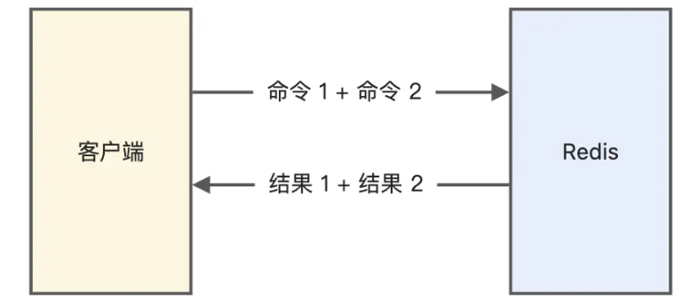

管道技术（Pipeline）是客户端提供的一种批处理技术，用于一次处理多个 Redis 命令，从而提高整个交互的性能。

使用管道技术可以解决多个命令执行时的网络等待，它是把多个命令整合到一起发送给服务器端处理之后统一返回给客户端，这样就免去了每条命令执行后都要等待的情况，从而有效地提高了程序的执行效率。但使用管道技术也要注意避免发送的命令过大，或管道内的数据太多而导致的网络阻塞。

要注意的是，管道技术本质上是客户端提供的功能，而非 Redis 服务器端的功能。

### Redis支持事务回滚么

Redis 中并没有提供回滚机制，虽然 Redis 提供了 DISCARD 命令（MULTI开启事务，EXEC提交事务），但是这个命令只能用来主动放弃事务执行，把暂存的命令队列清空，起不到回滚的效果。

事务执行过程中，如果命令入队时没报错，而事务提交后，实际执行时报错了，正确的命令依然可以正常执行，所以这可以看出 Redis 并不一定保证原子性（原子性：事务中的命令要不全部成功，要不全部失败）。

### Redis如何实现分布式锁

分布式锁是用于分布式环境下并发控制的一种机制，用于控制某个资源在同一时刻只能被一个应用所使用。

Redis 的 SET 命令有个 NX 参数可以实现「key不存在才插入」，所以可以用它来实现分布式锁：

- 如果 key 不存在，则显示插入成功，可以用来表示加锁成功；
- 如果 key 存在，则会显示插入失败，可以用来表示加锁失败。

基于 Redis 节点实现分布式锁时，对于加锁操作，我们需要满足三个条件：

- 加锁包括了读取锁变量、检查锁变量值和设置锁变量值三个操作，但需要以原子操作的方式完成，所以，我们使用 SET 命令带上 NX 选项来实现加锁；
- 锁变量需要设置过期时间，以免客户端拿到锁后发生异常，导致锁一直无法释放，所以，我们在 SET 命令执行时加上 EX/PX 选项，设置其过期时间；
- 锁变量的值需要能区分来自不同客户端的加锁操作，以免在释放锁时，出现误释放操作，所以，我们使用 SET 命令设置锁变量值时，每个客户端设置的值是一个唯一值，用于标识客户端；

分布式锁的命令如下：

```sql
SET lock_key unique_value NX PX 10000 
```

基于 Redis 实现分布式锁的优点：

1. 性能高效（这是选择缓存实现分布式锁最核心的出发点）。
2. 实现方便。很多研发工程师选择使用 Redis 来实现分布式锁，很大成分上是因为 Redis 提供了 setnx 方法，实现分布式锁很方便。
3. 避免单点故障（因为 Redis 是跨集群部署的，自然就避免了单点故障）。

基于 Redis 实现分布式锁的缺点：

1. 超时时间不好设置。如果锁的超时时间设置过长，会影响性能，如果设置的超时时间过短会保护不到共享资源。
2. Redis 主从复制模式中的数据是异步复制的，这样导致分布式锁的不可靠性。

### Redis 如何解决集群情况下分布式锁的可靠性（Read Lock）

在Sentinel集群中，主节点挂掉时，从节点会取而代之，客户端上却没有明显感知。原先的第一个客户端在主节点中申请到了一把锁，但主节点在锁没有同步到从节点时挂掉。导致另一个客户端也会从从节点获得锁。不安全性由此产生：在大多数场景下，因为其持续时间极短且只在主从发生failover的情况下发生，因此可以容忍。

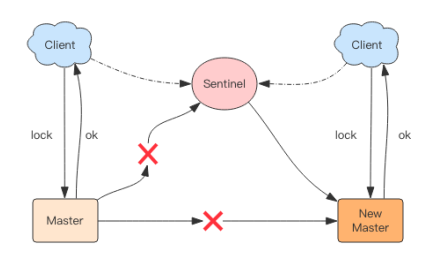

为了保证集群环境下分布式锁的可靠性，Redis 官方已经设计了一个分布式锁算法 Redlock（红锁）。

它是基于多个 Redis 节点的分布式锁，即使有节点发生了故障，锁变量仍然是存在的，客户端还是可以完成锁操作。官方推荐是至少部署 5 个 Redis 节点，而且都是主节点，它们之间没有任何关系，都是一个个孤立的节点。

Redlock 算法的基本思路，是让客户端和多个独立的 Redis 节点依次请求申请加锁，如果客户端能够和半数以上的节点成功地完成加锁操作，那么我们就认为，客户端成功地获得分布式锁，否则加锁失败。这样一来，即使有某个 Redis 节点发生故障，因为锁的数据在其他节点上也有保存，所以客户端仍然可以正常地进行锁操作，锁的数据也不会丢失。

加锁成功要同时满足两个条件：

- 从超过半数的 Redis 节点成功的获取到了锁
- 总耗时没有超过锁的有效时间


