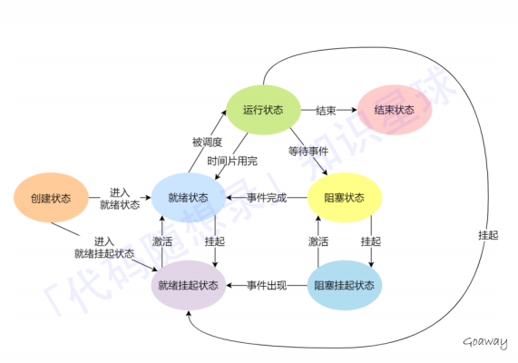
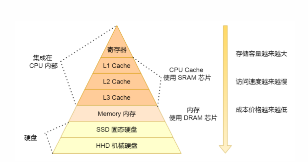
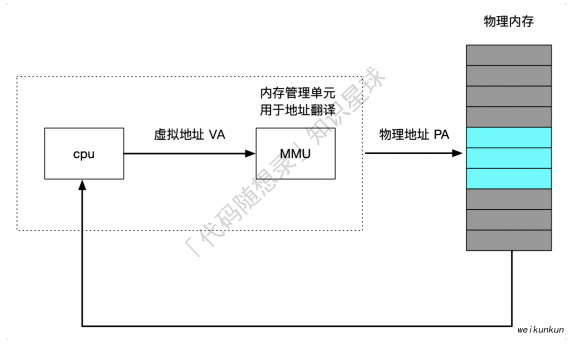
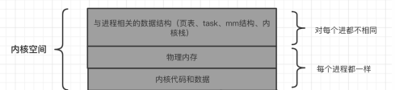

# 操作系统

## 操作系统基础

操作系统主要有以下功能：

​	1.资源分配与回收

​	2.为应用程序提供服务：提供统一的接口（系统调用）供开发者使用

​	3.管理应用程序

操作系统内核的功能：

​	1.进程调度

​	2.内存管理

​	3.硬件通信

​	4.系统调用


## 进程

### 进程基础

#### 概念

编译的代码可执⾏⽂件只是储存在硬盘的静态⽂件，运⾏时被加载到内存，CPU执⾏内存中指令，这个运⾏的程序被称为进程。进程是对运⾏时程序的封装，操作系统进⾏资源调度和分配的基本单位。

#### 进程表

为了实现进程模型，操作系统为一个表格(⼀个结构数组)，即进程表。

每个进程占有⼀个进程表项(或称为进程控制块)，该表项包含了⼀个进程状态的重要信息，包括程序计数器、堆栈指针、内存分配状况、所打开⽂件的状态、账号的调度信息，以及其他在进程由运⾏态转换 到就绪态或阻塞态时必须保存的信息，从⽽保证该进程随后能再次启动，就像从未中断过⼀样。

#### 并发与并行

单个核⼼在很短时间内分别执⾏多个进程，称为并发；多个核⼼同时执⾏多个进程称为并⾏

对于并发来说，CPU需要从⼀个进程切换到另⼀个进程，这个过程需要保存进程的状态信息

#### 进程的状态

某个进程在某个时刻所处的状态分为以下⼏种，运⾏态、就绪态、阻塞态。（除了创建与结束之外的基础状态）

运⾏态： 该时刻进程占⽤CPU

就绪态： 可运⾏，由于其他进程处于运⾏状态⽽暂时停⽌运⾏

阻塞态： 该进程正在等待某⼀事件发⽣（如等待输⼊/输出操作的完成）⽽暂时停⽌运⾏

对于阻塞状态，进程会占⽤内存空间，这是⼀种浪费⾏为。有时操作系统会将阻塞的进程置换到磁盘中，此时进程未占⽤物理内存，我们称之为挂起。挂起不仅仅可能是物理内存不⾜，可能是程序员自身需求。等需要再次运⾏的时候，再从硬盘换⼊到物理内存。

挂起态：新的状态，描述进程没有占⽤实际的物理内存空间的情况，这个状态就是挂起状态

阻塞挂起状态： 进程在外存（硬盘）并等待某个事件的出现 

就绪挂起状态： 进程在外存（硬盘），但只要进⼊内存，马上运⾏



特点：

​	1.就绪态和运行态可以相互转换，其他的都是单向转换。就绪态的进程通过调度算法获得CPU时间，转为运行状态

​	2.运⾏态的进程，在分配给它的 CPU 时间⽚⽤完之后就会转为就绪状态，等待下⼀次调度

​	3.阻塞态是缺少需要的资源从⽽由运⾏态转换⽽来，但是该资源不包括 CPU 时间，缺少 CPU 时间会从运⾏态转换为就绪态，如果此时没有其他进程运⾏，就转换为运⾏态，否则该进程将处于就绪态，等待CPU空闲轮到它运⾏

#### 进程控制块PCB

操作系统对进程的感知，是通过进程控制块PCB数据结构来描述的。它是进程存在的唯⼀标识，其包括以下信息：

​	1.进程描述信息： 进程标识符、⽤户标识符等

​	2.进程控制和管理信息： 进程状态，进程优先级等

​	3.进程资源分配清单： 虚拟内存地址空间信息，打开⽂件列表，IO设备信息等

​	4.CPU相关信息： 当进程切换时，CPU寄存器的值都被保存在相应PCB中，以便CPU重新执⾏该进程时能从断点 处继续执⾏

PCB通过链表形式组织起来，⽐如有就绪队列、阻塞队列等，⽅便增删，⽅便进程管理

#### 进程切换比线程慢的原因

涉及到虚拟内存的问题，进程切换涉及虚拟地址空间的切换⽽线程不会。

因为每个进程都有⾃⼰的虚拟地址空间，⽽线程是共享所在进程的虚拟地址空间的，所以同⼀个进程中的线程进⾏ 线程切换时不涉及虚拟地址空间的转换。

把虚拟地址转换为物理地址需要查找页表，页表查找是⼀个很慢的过程（⾄少访问2次内存），因此通常使⽤Cache 来缓存常⽤的地址映射，这样可以加速页表查找，这个cache就是TLB（快表）。

由于每个进程都有⾃⼰的虚拟地址空间，那么显然每个进程都有⾃⼰的页表，那么当进程切换后页表也要进⾏切换，页表切换后TLB就失效了，cache失效导致命中率降低，那么虚拟地址转换为物理地址就会变慢，表现出来的就 是程序运⾏会变慢，⽽线程切换则不会导致TLB失效，因为线程线程⽆需切换地址空间，这也就是进程切换要⽐同 进程下线程切换慢的原因。 

#### 守护进程

指的是在后台运⾏的，没有控制终端与它相连的进程。它独⽴于控制终端，周期性地执⾏某种任务。Linux的⼤多数服务器就是⽤守护进程的⽅式实现的，如web服务器进程http等。

守护进程的创建要点：

​	1.让程序在后台运行：具体来说，fork()产生一个子进程，然后使父进程退出

​	2.调用setsid()创建一个新的对话期：守护进程需要摆脱⽗进程的影响，⽅法是调⽤setsid()使进程成为⼀个会话组长。setsid()调⽤成功后，进程成为新的 会话组长和进程组长，并与原来的登录会话、进程组和控制终端脱离。

​	3.禁止进程重新打开控制终端：经过1和2，进程已经成为⼀个⽆终端的会话组长，但是它可以重新申请打开⼀个终端。为了避免这种情况发⽣，可 以通过使进程不再是会话组长来实现。再⼀次通过fork（）创建新的⼦进程，使调⽤fork的进程退出。

​	4.关闭不再需要的⽂件描述符：⼦进程从⽗进程继承打开的⽂件描述符。如不关闭，将会浪费系统资源，造成进程所在的⽂件系统⽆法卸下以及引 起⽆法预料的错误。⾸先获得最⾼⽂件描述符值，然后⽤⼀个循环程序，关闭0到最⾼⽂件描述符值的所有⽂件描述符。

​	5.将当前目录更改为根目录：脱离终端会话，并让它对文件的读写不受限制。

​	6.⼦进程从⽗进程继承的⽂件创建屏蔽字可能会拒绝某些许可权：需要使用unmask(0)将屏蔽字清零

​	7.处理SIGCHLD信号：对于服务器进程，在请求到来时往往⽣成⼦进程处理请求。如果⼦进程等待⽗进程捕获状态，则⼦进程将成为僵⼫进程（zombie），从⽽占⽤系统资源。如果⽗进程等待⼦进程结束，将增加⽗进程的负担，影响服务器进程的并发性能。在Linux下可以简单地将SIGCHLD信号的操作设为SIG_IGN。这样，⼦进程结束时不会产⽣僵⼫进程。

#### 僵尸进程

多进程程序，⽗进程⼀般需要跟踪⼦进程的退出状态，当⼦进程退出，⽗进程在运⾏，⼦进程必须等到⽗进程捕获到了⼦进程的退出状态才真正结束。在⼦进程结束后，⽗进程读取状态前，此时⼦进程为僵⼫进程。

设置僵⼫进程的⽬的是维护⼦进程的信息，以便⽗进程在以后某个时候获取。这些信息⾄少包括进程ID，进程的终 ⽌状态，以及该进程使⽤的CPU时间。所以当终⽌⼦进程的⽗进程调⽤wait或waitpid时就可以得到这些信息。

但是⼦进程停⽌在僵⼫态会占据内核资源，所以需要避免僵⼫进程的产⽣或⽴即结束⼦进程的僵⼫态，方法有：

​	1.⽗进程调⽤wait/waitpid等函数等待⼦进程结束，如果尚⽆⼦进程退出wait会导致⽗进程阻塞。waitpid只会等 待由pid参数指定的⼦进程，同时也是⾮阻塞，⽬标进程正常退出返回⼦进程PID，还没结束返回0。

​	2.在事件已经发⽣情况下执⾏⾮阻塞调⽤可以提⾼程序效率。对waitpid，最好在⼦进程退出后调⽤。使⽤ SIGCHLD信号通知⽗进程，⼦进程结束。

#### 多进程

进程结构由以下⼏个部分组成：代码段、堆栈段、数据段。代码段是静态的⼆进制代码，多个程序可以共享。

⽗进程创建⼦进程之后，⽗、⼦进程除了pid外，⼏乎所有的部分⼏乎⼀样。

⽗、⼦进程共享全部数据，⼦进程在写数据时会使⽤写时复制（COW）技术将公共的数据重新拷贝⼀份，之后在拷贝出的数据上进⾏操作；不是对同⼀块数据进⾏操作。

如果⼦进程想要运⾏⾃⼰的代码段，还可以通过调⽤execv()函数重新加载新的代码段，之后就和⽗进程独⽴开了。

### 进程调度算法

#### 批处理系统中的调度

系统按照一定的固定规则执行调度，而不需要与用户进行交互，这种调度不仅涉及到进程，还可以设计到其他资源，如IO设备的调度

（1）先来先服务：

​	⾮抢占式的调度算法，按照请求的顺序进⾏调度。

​	有利于长作业，但不利于短作业，因为短作业必须⼀直等待前⾯的长作业执⾏完毕才能执⾏，⽽长作业又需要执⾏很长时间，造成了短作业等待时间过长。

（2）最短作业优先：

​	⾮抢占式的调度算法，按估计运⾏时间最短的顺序进⾏调度。

​	长作业有可能会饿死，处于⼀直等待短作业执⾏完毕的状态。因为如果⼀直有短作业到来，那么长作业永远得不到调度。 

（3）最短剩余时间调度：

​	最短作业优先的抢占式版本，按剩余运⾏时间的顺序进⾏调度。

​	当⼀个新的作业到达时，其整个运⾏时间与当前进程的剩余时间作⽐较。如果新的进程需要的时间更少，则挂起当前进程，运⾏新的进程。否则新的进程等待

#### 交互式系统中的调度

（1）时间片轮转调度：

​	将所有就绪进程按 FCFS 的原则（FCFS：先来先到，非抢占）排成⼀个队列，每次调度时，把 CPU 时间分配给队⾸进程，该进程可以执⾏⼀个时间⽚。当时间⽚⽤完时，由计时器发出时钟中断，调度程序便停⽌该进程的执⾏，并将它送往就绪队列的末尾，同时继续把 CPU 时间分配给队⾸的进程

（2）优先级调度：

​	为每个进程分配⼀个优先级，按优先级进⾏调度。为了防⽌低优先级的进程永远等不到调度，可以随着时间的推移增加等待进程的优先级。

（3）多级队列：

​	如果⼀个进程需要执⾏ 100 个时间⽚，如果采⽤时间⽚轮转调度算法，那么需要交换 100 次

​	多级队列是为这种需要连续执⾏多个时间⽚的进程考虑，它设置了多个队列，每个队列时间⽚⼤⼩都不同，例如 1,2,4,8,..。进程在第⼀个队列没执⾏完，就会被移到下⼀个队列。这种⽅式下，之前的进程只需要交换 7 次。

​	每个队列优先权也不同，最上⾯的优先权最⾼。因此只有上⼀个队列没有进程在排队，才能调度当前队列上的进程。（即：优先级高的队列被分配更大的时间片，并且高优先级的队列会被优先执行）

​	可以将这种调度算法看成是时间⽚轮转调度算法和优先级调度算法的结合

（4）最短进程优先：

​	如果我们将每⼀条命令的执⾏看作是⼀个独⽴的“作业”，则我们可以通过⾸先运⾏最短的作业来使响应事件最短 

### 进程通信


## 线程

### 线程基础

线程是轻量级进程，也有PCB，创建线程使用的底层函数和进程一样，都是clone

从内核里看进程和线程是一样的，都有各自不同的PCB

在Linux下，线程是最小的执行单位，进程是最小的资源分配单位

实际上，⽆论是创建进程的fork，还是创建线程的pthread_create，底层实现都是调⽤同⼀个内核函数 clone：

​	1.如果复制对⽅的地址空间，那么就产出⼀个“进程”

​	2.如果共享对⽅的地址空间，就产⽣⼀个“线程”

Linux内核是不区分进程和线程的, 只在⽤户层⾯上进⾏区分。所以，线程所有操作函数 pthread_* 是库函数，⽽⾮ 系统调⽤

### 三种线程：用户线程，内核线程和轻量级线程

（1）用户线程

​	用户空间实现的线程，基于用户态的线程库管理

优点：

​	1.管理不需要内核直接参与，因此可⽤于不⽀持线程技术的操作系统

​	2.⽤户线程切换由线程库调度，不需要⽤户态与内核态之间转换

缺点：

​	1.由于不由操作系统调度，⼀旦⽤户线程发起系统调⽤⽽阻塞，那么此进程下⽤户线程都⽆法运⾏

​	2.⼀旦某个⽤户线程正在运⾏，只有当其交出CPU执⾏权，其他⽤户线程才可以运⾏，⽆法被打断，因为只有操作 系统才有权限打断运⾏，但是操作系统不直接参与调度

​	3.⽤户线程操作系统⽆法感知，CPU资源是直接分配给线程所在的进程，因此分到具体⽤户线程的时间⽚很短。其TCB线程控制块⽆法被操作系统所感知，因此⽤户线程的创建、终⽌、同步、调度等都不是由操作系统直接参与

（2）内核线程

​	由操作系统管理、调度，其TCB是存放在内核中。⼀般由操作系统事先创建内核线程集(类似于线程池)，数量有限。一般用来执行系统调度，I/O操作等操作系统的关键任务。

优点：

​	1.当⼀个内核线程发起系统调⽤阻塞时不会影响其它内核线程的执⾏

​	2. 操作系统将CPU资源直接分配给内核线程，更多CPU时间

缺点：

​	1.需要由内核来维护内核线程的上下⽂信息及运⾏状态等，占⽤内核资源

​	2. 内核线程创建、终⽌、切换都是在内核中进⾏，开销⽐较⼤

（3）轻量级线程（LWP）

内核⽀持的⽤户线程，像普通进程⼀样被调度，其类似于进程中的执⾏线程

每个LWP都需要⼀个内核线程的⽀持(CPU资源分配、调度)，实际上⽤户线程是运⾏在LWP上的

用户线程现在比较少用，更多的还是LWP

### 线程的共享/非共享资源

共享资源包括：

​	1.文件描述符表

​	2.信号处理方式

​	3.当前工作目录

​	4.用户ID和组ID

非共享资源包括：

​	1.线程id

​	2.处理器现场和栈指针（内核栈）

​	3.独立的栈空间（用户空间栈）

​	4.errno变量

​	5.信号屏蔽字

​	6.调度优先级

### 线程的优缺点

优点：

​	1.提高程序并发性

​	2.开销小

​	3.数据通信，共享数据方便

缺点：

​	1.库函数，不稳定

​	2.调试，编写困难

​	3.对信号的支持不好

线程减少开销的方式：

​	1.线程创建快，进程创建需要资源管理信息，⽐如内存管理信息和⽂件管理信息，⽽线程创建后是共享其所属进程 的资源管理信息

​	2.线程终⽌时间快，需要回收的仅有少量寄存器和私有的栈区

​	3.线程切换快，因为线程切换仅涉及到少量寄存器和栈区，⽽进程上下⽂切换有CPU寄存器和程序计数器(CPU上下⽂)、虚拟内存空间、页表切换、TLB失效等

​	4.线程因为创建时共享了其所述进程绝⼤多数资源，因此天⽣具有很好的线程间通信交互效率

### 线程的常用操作API

1.pthread_self

```c++
#include <pthread.h>
/**
* 获取线程号.
* @return 返回调⽤线程的线程.
*/
pthread_t pthread_self(void);
```

2.pthread_equal

```c++
/**
* 判断线程号 t1 和 t2 是否相等。为了⽅便移植，尽量使⽤函数来⽐较线程 ID.
* @param t1 待判断的线程号.
* @param t2 待判断的线程号.
* @return 相等: ⾮0; 不相等: 0.
*/
int pthread_equal(pthread_t t1, pthread_t t2);
```

3.pthread_create

```c++
#include <pthread.h>
/**
* 创建⼀个线程.
* @param thread 线程标识符地址.
* @param attr 线程属性结构体地址，通常设置为 NULL.
* @param start_routine 线程函数的⼊⼝地址.
* @param arg 传给线程函数的参数.
* @return 成功: 0; 失败: ⾮0.
*/
int pthread_create(pthread_t *thread,
 				const pthread_attr_t *attr,
 				void *(*start_routine)(void *),
 				void *arg );
// 由于pthread_create的错误码不保存在errno中，
// 因此不能直接⽤perror()打印错误信息，
// 可以先⽤strerror()把错误码转换成错误信息再打印。
```

4.pthread_join：负责线程回收

```c++
#include <pthread.h>
/**
* 等待线程结束（此函数会阻塞），并回收线程资源，类似进程的 wait() 函数。如果线程已经结束，那么该函数
会⽴即返回.
* @param thread 被等待的线程号.
* @param retval ⽤来存储线程退出状态的指针的地址.
* @return 成功: 0; 失败: ⾮0.
*/
int pthread_join(pthread_t thread, void **retval);
```

调⽤该函数的线程将挂起等待，直到id为thread的线程终⽌。 thread线程以不同的⽅法终⽌，通过pthread_join得到的终⽌状态是不同的。

​	1.如果thread线程通过return返回，retval所指向的单元⾥存放的是thread线程函数的返回值。

​	2.如果thread线程被别的线程调⽤pthread_cancel异常终⽌掉，retval所指向的单元⾥存放的是常数 PTHREAD_CANCELED。 

​	3.如果thread线程是⾃⼰调⽤pthread_exit终⽌的，retval所指向的单元存放的是传给pthread_exit的参数。

5.pthread_detach：实现线程分离，不会阻塞

```c++
#include <pthread.h>
/**
* 使调⽤线程与当前进程分离，分离后不代表此线程不依赖与当前进程，
* 线程分离的⽬的是将线程资源的回收⼯作交由系统⾃动来完成，
* 也就是说当被分离的线程结束之后，系统会⾃动回收它的资源。所以，此函数不会阻塞.
*
* @param thread 线程号.
* @return 成功: 0; 失败: ⾮0.
*/
int pthread_detach(pthread_t thread);

```

线程终⽌后，其终⽌状态⼀直保留到其它线程调⽤pthread_join获取它的状态为⽌。但是线程也可以被置为 detach状态，这样的线程⼀旦终⽌就⽴刻回收它占⽤的所有资源，⽽不保留终⽌状态。

不能对⼀个已经处于detach状态的线程调⽤pthread_join，这样的调⽤将返回EINVAL错误。也就是说，如果已 经对⼀个线程调⽤了pthread_detach就不能再调⽤pthread_join了。

6.phread_exit：线程退出，但资源不会释放

```c++
#include <pthread.h>
/**
* 退出调⽤线程。⼀个进程中的多个线程是共享该进程的数据段，因此，通常线程退出后所占⽤的资源并不会释放.
* @param retval 存储线程退出状态的指针.
*/
void pthread_exit(void *retval);
```

线程从执⾏函数中返回。线程从执⾏函数中返回。线程可以被同⼀进程中的其它线程取消。

7.pthread_cancel：线程取消

```c++
#include <pthread.h>
/**
* 杀死(取消)线程.
* @param thread ⽬标线程ID.
* @return 成功: 0; 失败: 出错编号.
* 注意: 线程的取消并不是实时的，⽽⼜⼀定的延时。需要等待线程到达某个取消点(检查点)
*/
int pthread_cancel(pthread_t thread);
```

### 线程通信

线程间的通信⽬的主要是⽤于线程同步。所以线程没有像进程通信中的⽤于数据交换的通信机制。

同⼀进程的不同线程共享同⼀份内存区域，所以线程之间可以⽅便、快速地共享信息。只需要将数据复制到共享 （全局或堆）变量中即可。但是需要避免出现多个线程试图同时修改同⼀份信息。

线程存在分离和非分离两个状态：

​	1.线程的默认属性是⾮分离状态，这种情况下，原有的线程等待创建的线程结束。只有当pthread_join()函数返回时， 创建的线程才算终⽌，才能释放⾃⼰占⽤的系统资源。

​	2.分离线程没有被其他的线程所等待，⾃⼰运⾏结束了，线程也就终⽌了，马上释放系统资源。应该根据⾃⼰的需 要，选择适当的分离状态。 

### 多线程

⽤户态的多线程模型，同⼀个进程内部有多个线程，所有的线程共享同⼀个进程的内存空间，进程中定义的全局变量会被所有的线程共享

i++在计算机中并不是原⼦操作，涉及内存取数，计算和写⼊内存⼏个环节，⽽线程的切换有可能发⽣在上述任何 ⼀个环节中间，所以不同的操作顺序很有可能带来意想不到的结果

多线程的优势：

​	1.许多应⽤中同时发⽣多个活动，某些活动随着时间推移⽽阻塞，将这些应⽤程序分解成并发运⾏的多个 线程，简化设计模型。同时多线程有共享同⼀地址空间和可⽤数据的能⼒，这是多进程没有的。

​	2.线程⽐进程开销⼩，更容易创建和释放。

​	3.多个线程是IO密集型时，多线程可以使这些活动彼此重叠运⾏，可以加快程序执⾏的速度。

多线程需要考虑：

​	1.线程之间有⽆先后访问顺序（线程依赖关系）

​	2.多个线程共享访问同⼀变量（同步互斥问题）

​	3.同⼀进程的多个线程共享进程的资源，除了标识线程的tid，每个线程还有⾃⼰独⽴的栈空间，线程彼此之间是⽆法访问其他线程栈上内容的


## 互斥与同步

### 互斥锁mutex

也叫互斥量，互斥锁锁是⼀种简单的加锁的⽅法来控制对共享资源的访问，互斥锁只有两种状态,即加锁( lock )和解锁 ( unlock ) 

在访问共享资源后临界区域前，对互斥锁进⾏加锁；在访问完成后释放互斥锁导上的锁；对互斥锁进⾏加锁后，任何其他试图再次对互斥锁加锁的线程将会被阻塞，直到锁被释放

互斥锁的数据类型为：pthread_mutex_t

#### 互斥锁API

​	1.pthread_mutex_init()：互斥锁创建

```c++
#include <pthread.h>
/**
* 初始化⼀个互斥锁.
* @param mutex 互斥锁地址。类型是 pthread_mutex_t.
* @param attr 设置互斥量的属性，通常可采⽤默认属性，即可将 attr 设为 NULL.
* @return 成功: 0 成功申请的锁默认是打开的; 失败: ⾮0(错误码).
*/
int pthread_mutex_init(pthread_mutex_t *restrict mutex,
						const pthread_mutexattr_t *restrict attr);
// 这种⽅法等价于使⽤ NULL 指定的 attr 参数调⽤ pthread_mutex_init() 来完成动态初始化，
// 不同之处在于 PTHREAD_MUTEX_INITIALIZER 宏不进⾏错误检查。
```

​	2.pthread_mutex_destroy()：互斥锁销毁

```c++
#include <pthread.h>
/**
* 销毁指定的⼀个互斥锁。互斥锁在使⽤完毕后，必须要对互斥锁进⾏销毁，以释放资源.
* @param mutex 互斥锁地址。类型是 pthread_mutex_t.
* @return 成功: 0; 失败: ⾮0(错误码).
*/
int pthread_mutex_destroy(pthread_mutex_t *mutex);
```

​	3.pthread_mutex_lock()：互斥锁上锁

```c++
#include <pthread.h>
/**
* 对互斥锁上锁，若互斥锁已经上锁，则调⽤者阻塞，直到互斥锁解锁后再上锁.
* @param mutex 互斥锁地址.
* @return 成功: 0; 失败: ⾮0(错误码).
*/
int pthread_mutex_lock(pthread_mutex_t *mutex);
/**
* 调⽤该函数时，若互斥锁未加锁，则上锁，返回 0;
* 若互斥锁已加锁，则函数直接返回失败，即 EBUSY.
*/
int pthread_mutex_trylock(pthread_mutex_t *mutex);
```

​	4.pthread_mutex_unlock() ：互斥锁解锁

```c++
#include <pthread.h>
/**
* 对指定的互斥锁解锁.
* @param mutex 互斥锁地址.
* @return 成功: 0; 失败: ⾮0(错误码)
*/
int pthread_mutex_unlock(pthread_mutex_t *mutex);

```

#### 死锁问题

抢占/不可抢占资源：是否可以从拥有它的进程中抢占，例如存储器就是一类可抢占资源

死锁的必要条件：

​	1.互斥：每个程序要么已经分配给一个进程，要么是可用的

​	2.占有和等待：已经得到了某个资源的进程可以再请求新的资源 

​	3.不可抢占：已经分配给⼀个进程的资源不能强制性地被抢占，它只能被占有它的进程显式地释放

​	4.环路等待：死锁发⽣时，系统中⼀定有由两个或两个以上的进程组成的⼀条环路，该环路中的每个进程都在等待着下⼀个进程所占有的资源

面对死锁的处理方法：

​	1.无视：都死锁不造成太大影响是就不管它，也叫鸵鸟算法

​	2.死锁检测：

​		对于每种类型一个资源的死锁（死锁发生时只占有一个资源），通过检测有向图中是否存在环来实现，从⼀个节点出发进⾏深度优先搜索，对访问过的节点进⾏标记，如果访问了已经标记的节点，就表⽰有向图存在环，也就是检测到死锁发⽣。

​		对于每种类型多个资源的死锁，每个进程最开始时都不被标记，执⾏过程有可能被标记。当算法结束时，任何没有被标记的进程都是死锁进程（银行家算法）。具体来是由以下步骤：

​			a.寻找⼀个没有标记的进程Pi，它所请求的资源⼩于或等于A

​			b.如果真找到这样⼀个进程，那么将C矩阵（也称为最大需求矩阵）的第i⾏向量加到A中，标记该进程，并转回第1步。最大需求矩阵表示每个进程对每种资源的最大需求量，显然，这是在模拟资源分配的过程。

​			c.如果没有这样的进程，那么算法终⽌（即请求超过了该进程对该资源的最大需求C）

​	3.死锁恢复：

​		（1）利用抢占恢复：将进程挂起，强行取走资源给另一个进程使用，用完再放回。

​		（2）利用回滚回复：复位到更早的状态，那时它还没有取得所需的资源。

​		（3）通过杀死进程恢复：杀掉环中的一个进程或多个，牺牲掉一个环外进程

```
牺牲一个环外进程的意义：
	1.资源释放： 被牺牲的环外进程通常占有一些资源，通过释放这些资源，系统可以满足其他进程的资源请求，有助于解除死锁。
	2.维持系统运行： 牺牲环外进程可以确保系统能够继续运行。如果只是杀死环中的进程而不释放额外的资源，可能会导致系统无法正常执行其他任务。
	3.避免连锁效应：杀死环外进程有助于避免因死锁而导致更广泛的系统故障。如果不采取措施，死锁可能会蔓延，影响到更多的进程，甚至导致整个系统崩溃。
```

​	4.死锁预防：

​		（1）破坏互斥条件

​		（2）破坏占有等待条件

​			a.规定所有进程在开始执⾏前请求所需要的全部资源

​			b.当⼀个进程请求资源时，先暂时释放其当前占⽤的所有资源，然后在尝试⼀次获得所需的全部资源

​		（3）破坏不可抢占条件

​			a.保证每⼀个进程在任何时刻只能占⽤⼀个资源，如果请求另⼀个资源必须先释放第⼀个资源

​			b.将所有的资源统⼀编号，进程可以在任何时刻提出资源请求，但是所有请求必须按照资源编号的顺序(升序)提出

​		（4）破坏环路等待

​	5.死锁避免：

​		（1）安全状态：如果没有死锁发⽣，并且即使所有进程突然请求对资源的最⼤需求，也仍然存在某种调度次序能够使得每⼀个进程运⾏完毕，则称该状态是安全的。

​		（2）单个资源/多个资源的银行家算法

#### 读写锁

在对数据的读写操作中，更多的是读操作，写操作较少，例如对数据库数据的读写应⽤

特点：

​	1.在对数据的读写操作中，更多的是读操作，写操作较少，例如对数据库数据的读写应⽤

​	2.如果有其它线程写数据，则其它线程都不允许读、写操作

读写锁分为读锁和写锁，规则如下：

​	1.如果某线程申请了读锁，其它线程可以再申请读锁，但不能申请写锁

​	2.如果某线程申请了写锁，其它线程不能申请读锁，也不能申请写锁

POSIX定义的读写锁数据类型为：pthread_rwlock_t

读写锁API：

​	1.pthread_rwlock_init()：初始化读写锁

```c++
/**
* ⽤来初始化 rwlock 所指向的读写锁.
* @param rwlock 指向要初始化的读写锁指针.
* @param attr：读写锁的属性指针。如果 attr 为 NULL 则会使⽤默认的属性初始化读写锁，否则使⽤指定的
attr 初始化读写锁.
* 可以使⽤宏 PTHREAD_RWLOCK_INITIALIZER 静态初始化读写锁，⽐如:
* pthread_rwlock_t my_rwlock = PTHREAD_RWLOCK_INITIALIZER;
* 这种⽅法等价于使⽤ NULL 指定的 attr 参数调⽤ pthread_rwlock_init() 来完成动态初始化，
* 不同之处在于PTHREAD_RWLOCK_INITIALIZER 宏不进⾏错误检查.
* @return 成功: 0，读写锁的状态将成为已初始化和已解锁; 失败: ⾮ 0 错误码.
*/
#include <pthread.h>
int pthread_rwlock_init(pthread_rwlock_t *restrict rwlock,
						const pthread_rwlockattr_t *restrict attr);
```

​	2.pthread_rwlock_destroy()：销毁读写锁

```c++
/**
* ⽤于销毁⼀个读写锁，并释放所有相关联的资源（所谓的所有指的是由 pthread_rwlock_init() ⾃动申请的
资源.
* @param rwlock 读写锁指针.
* @return 成功: 0; 失败: ⾮0错误码.
*/
#include <pthread.h>
int pthread_rwlock_destroy(pthread_rwlock_t *rwlock);
```

​	3.pthread_rwlock_rdlock()：读锁定

```c++
#include <pthread.h>
/**
* 以阻塞⽅式在读写锁上获取读锁（读锁定）.
* 如果没有写者持有该锁，并且没有写者阻塞在该锁上，则调⽤线程会获取读锁.
* 如果调⽤线程未获取读锁，则它将阻塞直到它获取了该锁。⼀个线程可以在⼀个读写锁上多次执⾏读锁定.
* 线程可以成功调⽤ pthread_rwlock_rdlock() 函数 n 次，但是之后该线程必须调⽤
pthread_rwlock_unlock() 函数 n 次才能解除锁定.
* @param rwlock 读写锁指针.
* @return 成功: 0; 失败: ⾮0错误码.
*/
int pthread_rwlock_rdlock(pthread_rwlock_t *rwlock);
/**
* ⽤于尝试以⾮阻塞的⽅式来在读写锁上获取读锁.
* 如果有任何的写者持有该锁或有写者阻塞在该读写锁上，则⽴即失败返回.
*/
int pthread_rwlock_tryrdlock(pthread_rwlock_t *rwlock);
```

​	4.pthread_rwlock_wrlock()：写锁定

```c++
#include <pthread.h>
/**
* 在读写锁上获取写锁（写锁定）.
* 如果没有写者持有该锁，并且没有写者读者持有该锁，则调⽤线程会获取写锁.
* 如果调⽤线程未获取写锁，则它将阻塞直到它获取了该锁.
* @param rwlock 读写锁指针.
* @return 成功: 0; 失败: ⾮0错误码.
*/
int pthread_rwlock_wrlock(pthread_rwlock_t *rwlock);
/**
* ⽤于尝试以⾮阻塞的⽅式来在读写锁上获取写锁.
* 如果有任何的读者或写者持有该锁，则⽴即失败返回.
*/
int pthread_rwlock_trywrlock(pthread_rwlock_t *rwlock);
```

​	5.pthread_rwlock_unlock()：解锁

```c++
#include <pthread.h>
/**
* ⽆论是读锁或写锁，都可以通过此函数解锁.
* @param rwlock 读写锁指针.
* @return 成功: 0; 失败: ⾮0错误码.
*/
int pthread_rwlock_unlock(pthread_rwlock_t *rwlock);

```

###  条件变量

与互斥锁不同，条件变量是⽤来等待⽽不是⽤来上锁的，条件变量本⾝不是锁

条件变量⽤来⾃动阻塞⼀个线程，直到某特殊情况发⽣为⽌。通常条件变量和互斥锁同时使⽤

条件变量的两个动作：

​	1.条件不满，阻塞线程（调用wait方法）

​	2.当条件满足，通知阻塞的线程开始工作（调用notify方法进行唤醒）

条件变量的类型为：pthread_cond_t

#### 条件变量API

​	1.pthread_cond_init()：创建条件变量

```c++
#include <pthread.h>
/**
* 初始化⼀个条件变量.
* @param cond 指向要初始化的条件变量指针.
* @param attr 条件变量属性，通常为默认值，传NULL即可.
* 也可以使⽤静态初始化的⽅法，初始化条件变量;
* pthread_cond_t cond = PTHREAD_COND_INITIALIZER.
* return 成功: 0; 失败: ⾮0错误号.
*/
int pthread_cond_init(pthread_cond_t *restrict cond,
						const pthread_condattr_t *restrict attr);
```

​	2.pthread_cond_destroy()：删除条件变量

```c++
#include <pthread.h>
/**
* 销毁⼀个条件变量.
* @param cond 指向要初始化的条件变量指针.
* @return 成功: 0; 失败: ⾮0错误号.
*/
int pthread_cond_destroy(pthread_cond_t *cond);
```

​	3.pthread_cond_signal()：唤醒线程

```c++
#include <pthread.h>
/**
* 唤醒⾄少⼀个阻塞在条件变量上的线程.
* @param cond 指向要初始化的条件变量指针.
* @return 成功: 0; 失败: ⾮0错误号.
*/
int pthread_cond_signal(pthread_cond_t *cond);
/**
* 唤醒全部阻塞在条件变量上的线程.
* @param cond 指向要初始化的条件变量指针.
* @return 成功: 0; 失败: ⾮0错误号.
*/
int pthread_cond_broadcast(pthread_cond_t *cond);
```

​	4.pthread_cond_wait()：阻塞线程

```c++
#include <pthread.h>
struct timespec {
 time_t tv_sec; /* seconds */ // 秒
 long tv_nsec; /* nanosecondes*/ // 纳秒
}
// time_t cur = time(NULL); //获取当前时间。
// struct timespec t; //定义timespec 结构体变量t
// t.tv_sec = cur + 1; // 定时1秒
// pthread_cond_timedwait(&cond, &t);
/**
* 阻塞等待⼀个条件变量
* 1. 阻塞等待条件变量cond（参1）满⾜
* 2. 释放已掌握的互斥锁（解锁互斥量）相当于pthread_mutex_unlock(&mutex);
* ((1), (2)两步为⼀个原⼦操作)
* 3. 当被唤醒，pthread_cond_wait函数返回时，解除阻塞并重新申请获取互斥锁
pthread_mutex_lock(&mutex);
* @param cond 指向要初始化的条件变量指针.
* @param mutex 互斥锁.
* @return 成功: 0; 失败: ⾮0错误号.
*/
int pthread_cond_wait(pthread_cond_t *restrict cond,
 							pthread_mutex_t *restrict mutex);
/**
* 限时等待⼀个条件变量.
* @param cond 指向要初始化的条件变量指针.
* @param mutex 互斥锁.
* @param abstime 绝对时间.
* @return 成功: 0; 失败: ⾮0错误号.
*/
int pthread_cond_timedwait(pthread_cond_t *restrict cond,
 						pthread_mutex_t *restrict mutex,
 						const struct *restrict abstime);
```

#### 条件变量的优势

​	1.相较于mutex⽽⾔，条件变量可以减少竞争。如直接使⽤mutex，除了⽣产者、消费者之间要竞争互斥量以外，消费者之间也需要竞争互斥量。有了条件变量机制以后，只有⽣产者完成⽣产，才会引起消费者之间的竞争。提⾼了程序效率。

​	2.使用条件变量可以避免忙等待，即线程不断地检查某个条件是否满足，而是在条件不满足时进入阻塞状态，只有在条件满足时才继续执行。

​	3.条件变量提供了一种有效的线程同步机制，允许线程在某个条件成立之前等待，以避免忙等待和提高效率。

### 信号量

信号量⼴泛⽤于进程或线程间的同步和互斥，信号量本质上是⼀个⾮负的整数计数器，它被⽤来控制对公共资源的访问。编程时可根据操作信号量值的结果判断是否对公共资源具有访问的权限，当信号量值⼤于 0 时，则可以访问，否则将阻塞。

PV 原语是对信号量的操作方式，⼀次 P 操作使信号量减１，⼀次 V 操作使信号量加１。

#### 信号量API

​	1.sem_init()：创建信号量

```c++
#include <semaphore.h>
/**
* 创建⼀个信号量并初始化它的值。⼀个⽆名信号量在被使⽤前必须先初始化.
* @param sem 信号量的地址.
* @param pshared 等于 0，信号量在线程间共享（常⽤）; 不等于0，信号量在进程间共享.
* @param value 信号量的初始值.
* @return 成功: 0; 失败: -1.
*/
int sem_init(sem_t *sem, int pshared, unsigned int value);
```

​	2.sem_destroy()：删除信号量

```c++
#include <semaphore.h>
/**
* 删除 sem 标识的信号量.
* @return 成功: 0; 失败: -1.
*/
int sem_destroy(sem_t *sem);
```

​	3.sem_wait()：P操作

```c++
#include <semaphore.h>
/**
* 将信号量的值减 1。操作前，先检查信号量（sem）的值是否为 0;
* 若信号量为 0，此函数会阻塞，直到信号量⼤于 0 时才进⾏减 1 操作。
* @param sem 信号量的地址.
* @return 成功: 0; 失败: -1.
*/
int sem_wait(sem_t *sem);
/**
* 以⾮阻塞的⽅式来对信号量进⾏减 1 操作。
* 若操作前，信号量的值等于 0，则对信号量的操作失败，函数⽴即返回。
*/
int sem_trywait(sem_t *sem);
/**
* 限时尝试将信号量的值减 1
* abs_timeout：绝对时间
*/
int sem_timedwait(sem_t *sem, const struct timespec *abs_timeout);

```

​	4.sem_post()：V操作

```c++
#include <semaphore.h>
/**
* 将信号量的值加 1 并发出信号唤醒等待线程(sem_wait()).
* @param sem 信号量的地址.
* @return 成功: 0; 失败: -1.
*/
int sem_post(sem_t *sem);
```

​	5.sem_getvalue() ：获取信号量的值

```c++
#include <semaphore.h>
/**
* 获取 sem 标识的信号量的值，保存在 sval 中.
* @param sem 信号量的地址.
* @param sval 保存信号量值的地址.
* @return 成功: 0; 失败: -1.
*/
int sem_getvalue(sem_t *sem, int *sval);
```

### 管程

也叫监视器，是一种高级同步机制。

对于传统的信号量等同步机制而言，缺点如下：

​	1.程序易读性差

​	2.程序不利于维护和修改

​	3.正确性难以保证

对于管程来说，本质上是一个整体的集合，让进程可以更加清晰的调用相对应的内容。

同时，在利用管程实现进程同步时，当某进程通过管程请求获得临界资源而未能满足时，管程便调用wait原语使该进程等待，并将其排在等待队列上。仅当另一个进程访问完成并释放该资源后，管程才又调用signal原语，唤醒等待队列中的队首进程。（保证了同一时刻只有一个进程在管程内活动）


## 存储系统

### 存储系统层级

#### 存储器的存储结构

寄存器：

寄存器的访问速度非常快，一般要求在半个CPU 时钟周期内完成读写，CPU 时钟周期跟 CPU 主频息息相关，⽐ 如 2 GHz 主频的 CPU，那么它的时钟周期就是 1/2G，也就是 0.5ns（纳秒）。

CPU Cache：

使用的是一种叫SRAM（Static Random-Access Memory，静态随机存储器）的芯⽚，之所以叫「静态」存储器，是因为只要有电，数据就可以保持存在，⽽⼀旦断电，数据就会丢失了。

CPU Cache 通常分为三层，也是常说的L1，L2，L3缓存

内存：

内存⽤的芯⽚和 CPU Cache 有所不同，它使⽤的是⼀种叫作 DRAM （Dynamic Random Access Memory，动态随机存取存储器） 的芯⽚。相⽐ SRAM，DRAM 的密度更⾼，功耗更低，有更⼤的容量，⽽且造价⽐ SRAM 芯⽚便宜很多。

DRAM 存储⼀个 bit 数据，只需要⼀个晶体管和⼀个电容就能存储，但是因为数据会被存储在电容⾥，电容会不断 漏电，所以需要「定时刷新」电容，才能保证数据不会被丢失，这就是 DRAM 之所以被称为「动态」存储器的原 因，只有不断刷新，数据才能被存储起来。

DRAM 的数据访问电路和刷新电路都⽐ SRAM 更复杂，所以访问的速度会更慢，内存速度⼤概在 200~300 个 时钟 周期之间。

SSD/HDD硬盘：

SSD（Solid-state disk） 就是我们常说的固体硬盘，结构和内存类似，但是它相⽐内存的优点是断电后数据还是存 在的，⽽内存、寄存器、⾼速缓存断电后数据都会丢失。内存的读写速度⽐ SSD ⼤概快 10~1000 倍。

机械硬盘（Hard Disk Drive, HDD），它是通过物理读写的⽅式来访问 数据的，因此它访问速度是⾮常慢的，它 的速度⽐内存慢 10W 倍左右。

#### 存储器的层次关系

CPU 并不会直接和每⼀种存储器设备直接打交道，⽽是每⼀种存储器设备只和它相邻的存储器设备打交道

CPU只与内存通信，硬盘只与内存通信

CPU（SRAM）主要涉及到了数据的快速访问需求，而与页面置换无关



### 页面置换算法（是针对内存DRAM芯片的）

1.最佳页⾯置换算法(OPT) ：

置换在「未来」最⻓时间不访问的⻚⾯,但是实际系统中⽆法实现，因为程序访问⻚⾯时是动态的  我们是⽆法预知每个⻚⾯在「下⼀次」访问前的等待时间，因此作为实际算法效率衡量标准

2.先进先出置换算法(FIFO)：

顾名思义，将页⾯以队列形式保存，先进⼊队列的页⾯先被置换进⼊磁盘。

3.最近最久未使⽤的置换算法（LRU）：

 根据页⾯未被访问时长⽤升序列表将页⾯排列，每次将最久未被使⽤页⾯置换出去。

4.时钟页⾯置换算法：

把所有的页⾯都保存在⼀个类似钟⾯的「环形链表」中，页⾯包含⼀个访问位。当发⽣缺页中断时（当程序访问的页面（页）不在主存（RAM）中时），顺时针遍历页⾯，如果访问位为1，将其改为0，继续遍历，直到访问到访问位为0页⾯，进⾏置换。

5.最不常用算法：

记录每个页⾯访问次数，当发⽣缺页中断时候，将访问次数最少的页⾯置换出去，此⽅法需要对每个页⾯访问次数统计，额外开销。

### 分段

虚拟内存采⽤的是分页技术，也就是将地址空间划分成固定⼤⼩的页，每⼀页再与内存进⾏映射。

如果使⽤分页系统的⼀维地址空间，动态增长的特点会导致覆盖问题的出现。当程序需要更多内存时，操作系统可能需要重新分配新的页来扩展地址空间。如果新分配的页的地址范围与已经存在的页有重叠，那么新页的分配可能会导致覆盖已有的数据，从而造成覆盖问题。

分段的做法是把每个页表分成段，⼀个段构成⼀个独⽴的地址空间。每个段的长度可以不同，并且可以动态增长。

#### 纯分段

分页与分段的本质不同，页面是固定长度的，而段不是。

优点：

​	1.共享：有助于⼏个进程之间共享过程和数据。 ⽐如共享库

​	2.保护：每个段都可以独⽴地增⼤或减⼩⽽不会影响其他的段 

#### 分段与分页的结合

程序的地址空间划分成多个拥有独⽴地址空间的段，每个段上的地址空间划分成⼤⼩相同的页。

这样既拥有分段系统的共享和保护，又拥有分页系统的虚拟内存功能.

#### 分段与分页的比较

​	1.对程序员的透明性：

​		分页透明，但是分段需要程序员显式划分每个段。

​	2.地址空间的维度：

​		分页是⼀维地址空间，分段是⼆维的。 

​	3.大小是否应该改变：

​		页的⼤⼩不可变，段的⼤⼩可以动态改变。

分页主要⽤于实现虚拟内存，从⽽获得更⼤的地址空间；分段主要是为了使程序和数据可以被划分为逻辑上独⽴的地址空间并且有助于共享和保护。 

### 虚拟内存

#### 虚拟内存概念相关

虚拟地址空间构成虚拟内存，它使得应⽤程序认为⾃⼰拥有连续的可⽤内存 空间，但实际上是被分隔的多个物理内存页、以及部分暂时存储在磁盘上的交换分区所构成的。虚拟内存的位置在每个进程的地址空间中。

地址空间：地址空间是物理内存的抽象，是⼀个进程可⽤于寻址内存的⼀套地址集合。

分页：地址空间被分割成多个块，每⼀块称作⼀页或页⾯(Page)。每⼀页有连续的地址范围，这些页被映射到连续的物理内存(页框)。

页表：把虚拟页⾯(虚拟地址)映射为页框(物理地址)。页表给出了虚拟地址与物理地址的映射关系。从数学的⾓度说页表是⼀个函数，他的参数是虚拟页号，结果是物理页页框号 。通常，每个进程都会维护一个页表。

TLB加速分页：将虚拟地址直接映射到物理地址，⽽不必再访问页表，这种设备被称为转换检测缓冲区（TLB），它连接存储器或快表。

TLB的加速过程：

​	1.将⼀个虚拟地址放⼊MMU中进⾏转换时，硬件⾸先通过将该虚拟页号与TLB中所有表项同时进⾏匹配，判断虚拟页⾯是否在其中

​	2.虚拟页号在TLB中。如果MMU检测⼀个有效的匹配并且访问操作并不违反保护位，则将页框号直接从TLB中取出⽽不必访问页表

​	3.虚拟页号不在TLB中。如果MMU检测到没有有效的匹配项就会进⾏正常的页表查询。接着从TLB中淘汰⼀个表项，然后⽤新的页表项替换它

针对大内存的页表：多级页表，倒排页表（每个表项不再对应一个进程的一部分地址空间，而是对应一个物理页框，因此所有进程的页表项都存储在同一个结构中，而不是每个进程有自己独立的页表）

#### 虚拟内存的三个重要能力

1.高速缓存

虚拟内存通过透明地将数据从磁盘加载到内存，减少磁盘访问次数，提高了程序的灵活性、可用性和整体性能

在虚拟内存中的虚拟页共分为三种类型：

​	1.未分配（没有被进程申请使⽤的，也就是空闲的虚拟内存， 不占⽤虚拟内存磁盘的任何空间）

​	2.未缓存（仅仅加载到磁盘中的页）

​	3.已缓存（已经加载到内存中的内存页（页框）） 

2.内存管理

3.内存保护

现代操作系统中，⽤户进程不应该被允许修改它的只读代码段; ⽽且也不应该允许它读取或修改任何内核中的代码和数据结构; 并且也不允许其读取或者修改其他进程的私有内存，以及修改和其他进程共享的虚拟页⾯。

如果不对进程的内存访问进⾏限制，攻击者就能够访问和修改其他进程的私有内存，进⽽导致整个系统崩溃。⼤体的虚拟寻址如下：



通过MMU（内存管理单元），每次都会读取页表中的⼀个页表条⽬(PTE)，通过在这些页表条⽬(PTE)中添加⼀些标志位，就能够实现对⼀个虚拟页的访问控制权限

#### 虚拟内存中内核空间的内容



#### 其他相关

用户态和内核态：

​	处理器提供寄存器中的一个模式位来实现用户态和内核态的转换，该寄存器描述了当前进程享有的特权

​	当设置了模式位时，进程运行在内核态中，可以执⾏指令集中的任何指令，并且可以访问系统中的任何内存位置

​	当没有设置时，进程就运⾏在⽤户态。⽤户模式中的进程不允许执⾏特权指令。

​	⽐如：停⽌处理器、改变模式位、或者发起⼀个I/O操作。同时也不允许⽤户态下的进程直接引⽤地址空间中内核空间的代码和数据。

#### 为什么需要虚拟内存

1. 虚拟内存可以结合磁盘和物理内存的优势为进程提供看起来速度⾜够快并且容量⾜够⼤的存储
2. 虚拟内存可以为进程提供独⽴的内存空间并引⼊多层的页表结构将虚拟内存翻译成物理内存，进程之间可以共享 物理内存减少开销，也能简化程序的链接、装载以及内存分配过程; 
3. 虚拟内存可以控制进程对物理内存的访问，隔离不同进程的访问权限，提⾼系统的安全性。


## 文件系统

### 文件系统的实现

⽂件系统存放在磁盘上。多数磁盘划分为⼀个或多个分区，每个分区中有⼀个独⽴的⽂件系统。

磁盘0号扇区称为主引导记录(MBR)，⽤来引导计算机。在MBR结尾是分区表。该表给出每个分区的起始结束地址。 

表中的⼀个分区被标记为活动区。在计算机被引导时，BIOS读⼊并执⾏MBR。MBR做的第⼀件事是确定活动分 区，读⼊它的第⼀个块，称为引导块，并执⾏之。

引导块中的程序将装载该分区中的操作系统。

当⼏个⽤户同在⼀个项⽬⾥⼯作时，他们常常需要共享⽂件。共享⽂件与⽬录的联系称为⼀个链接（link）。这样⽂件系统本⾝就是⼀个有向⽆环图（DAG），⽽不是⼀棵树。

#### 文件的实现

1.连续分配：把每个⽂件作为⼀连串连续数据块存储在磁盘。

它实现简单，记录每个⽂件⽤到磁盘块简化为只需记住两个数字即可：第⼀块的磁盘地址和⽂件的块数。给定了第⼀块编号，⼀ 个简单的加法就可以找到任何其他块的编号。同时，操作性能较好，单个操作中就能从磁盘上读出整个⽂件，只需⼀次寻找。

2.链表分配：为每个⽂件构造磁盘块链表。每⼀块的第⼀个字作为指向下⼀块的指针，块的其他部分存放数据。

它可以可以充分利⽤磁盘块，不会因为磁盘碎⽚浪费存储内存，同时随机访问快。

不过，指针会占用一个字节，同时，每个磁盘块存储数据的字节数不再是2的整数次幂。降低了系统的运行效率，每个块前⼏个字节被指向下⼀个块的指针所占据，需要从两个磁盘中获取拼接信息，这就因复制⽽引发额外的开销。

3.采用内存中的表进行链表分配

取出每个磁盘块的指针字，把他放在内存的⼀个表中，解决链表分配的不⾜。内存中这样的表格称为⽂件分配表 (File Allocation Table，FAT) 

4.i节点

最后⼀个记录各⽂件分别包含哪些磁盘块的⽅法是给每个⽂件赋予⼀个称为i节点的数据结构，其中列出了⽂件属性和⽂件的磁盘地址。

#### 目录的实现

在读⽂件之前，必须先打开⽂件。打开⽂件时，操作系统利⽤⽤户给出的路径名找到相应的⽬录项。

简单⽬录：包含固定⼤⼩的⽬录，在⽬录项中有磁盘地址和属性

采⽤i节点的系统：把⽂件属性存放在i节点中⽽不是⽬录项中。这种情形下，⽬录项会更短。 

### 文件系统的管理和优化

磁盘空间管理：

⼏乎所有⽂件系统都把⽂件分割成固定⼤⼩的块来存储，各块之间不⼀定相邻。

块大小：从历史的观点上来说，⽂件系统将⼤⼩设在1~4KB之间，但现在随着磁盘超过了1TB，还是将块的⼤⼩提升到64KB并且接受浪费的磁盘孔空间，这样也许更好。磁盘空间⼏乎不再会短缺。

记录空闲块：

​	1.磁盘块链表：链表的每个块中包含尽可能多的空闲磁盘块号。 通常情况下，采⽤空闲块存放空闲表，这样不会影响存储器。

​	2.位图：在位图中，空闲块⽤1表⽰，已分配块⽤0表⽰。

​	3.磁盘配额：为防⽌⼈们贪⼼⽽占有太多的磁盘空间，⽤户操作系统常常提供⼀种强制性磁盘配额机制。 其思想是系统管理员分给每个⽤户拥有⽂件和块的最⼤数量，操作系统确保每个⽤户不超过分给他们的配额。（配 额表、打开⽂件表） 

文件系统性能：

​	1.高速缓存：减少磁盘访问次数技术是块⾼速缓存（block cache）或者缓冲区⾼速缓存（buffer cache）。在这里，⾼速缓存指的是⼀系列的块，它们在逻辑上属于磁盘，但实际上基于性能的考虑被保存在内存中。

​	2.块提取读：在需要⽤到块之前，试图提前将其写⼊⾼速缓存，从⽽提⾼命中率。 块提前读策略只适⽤于实际顺序读取的⽂件。对随机访问⽂件，提前读丝毫不起作⽤。

​	3.减少磁盘臂运动 ：把可能顺序访问的块放⼀起，当然最好是同⼀柱⾯上，从⽽减少磁盘臂的移动次数。 


## 磁盘


## Linux下的IO复用

### 五种IO模型

1.阻塞式I/O

2.非阻塞式I/O

3.I/O复⽤（select和poll）

4.信号驱动式I/O（SIGIO）

5.异步I/O（POSIX的aio_系列函数）

### 阻塞I/O

进程或线程等待某个条件，如果条件不满⾜，则⼀直等下去。条件满⾜，则进⾏下⼀步操作。

应⽤进程通过系统调⽤ recvfrom 接收数据，但由于内核还未准备好数据报，应⽤进程就会阻塞住，直到内核准备 好数据报，recvfrom 完成数据报复制⼯作，应⽤进程才能结束阻塞状态。


优点：设备⽂件不可操作时，可进⼊休眠状态，将CPU资源让出；当设备⽂件可以操作的时候就必须唤醒进程，⼀般在中断函数中完成唤醒⼯作;

缺点：耗费时间，适合并发低，时效性要求低的情况。

### 非阻塞式IO

应⽤进程与内核交互，⽬的未达到之前，不再⼀味的等着，⽽是直接返回

通过轮询的⽅式，不停的去问内核数据有没有准备好。如果某⼀次轮询发现数据已经准备好了，那就把数据拷贝到⽤户空间中

轮询（polling）： 应⽤进程持续轮询内核，以查看某个操作是否就绪;

缺点：往往耗费⼤量CPU时间

### IO复用

通过调⽤ select 或 poll，阻塞在这两个系统调⽤中的某⼀个之上，⽽不是阻塞在真正的I/O系统调⽤上。

阻塞于 select 调⽤，等待数据报套接字变为可读，当 select 返回套接字可读这⼀条件时，调⽤ recvfrom 把所读数据报复制到应⽤进程缓存区。

多个进程I/O注册到同⼀个 select，当⽤户进程调⽤ select，select 监听所有注册好的IO：

​	1.若所有被监听的I/O需要的数据未准备好，则阻塞

​	2.任意⼀个所需数据准备好后，select调⽤返回

​	3.⽤户进程通过 recvfrom 进⾏数据拷贝

优点：可以等待多个描述符就绪

### 信号驱动I/O

开启套接字信号驱动I/O功能，通过 sigaction 系统调⽤安装⼀个信号处理函数，该系统函数⽴即返回，不阻塞

数据报准备好后，内核为该进程产⽣⼀个 SIGIO 信号递交给进程

可以在信号处理函数中调⽤ recvfrom 读取数据报，通知主循环数据已准备好待处理；可以⽴即通知主循环，读取数据报

优点：等待数据报到达期间进程不被阻塞。主循环可以继续执⾏，等待来⾃信号处理函数的通知：既可以是数据已经准备好被处理，也可以是数据报已经准备好被读取

### 异步IO

⽤户进程告知内核启动某个操作，并由内核在整个操作中完成后通知⽤户进程

与信号驱动I/O的区别：

​	1.信号驱动I/O是由内核通知我们何时可以启动⼀个I/O操作

​	2.异步I/O是由内核通知我们I/O操作何时完成

步骤：

​	1.⽤户进程调⽤aio_read函数，给内核传递描述符、缓冲区指针、缓冲区⼤⼩和⽂件偏移，告诉内核整个操作完成 时如何通知我们，然后就⽴刻去做其他事情;

​	2.当内核收到aio_read后，会⽴刻返回，然后内核开始等待数据准备，数据准备好以后，直接把数据拷贝到⽤户空 间，然后再通知进程本次IO已经完成

### IO模型的比较

同步IO：

​	1.导致请求进程阻塞，直到I/O操作完成;

​	2.四种同步模型的区别在于第⼀阶段等待数据的处理⽅式不同，第⼆阶段均为将数据从内核空间复制到⽤户空间缓冲区期间，进程阻塞于recvfrom调⽤。

异步IO：

​	不导致请求进程阻塞

IO复用函数：

​	多路复⽤接口select/poll/epoll ，内核提供给⽤户态的多路复⽤系统调⽤，进程可以通过⼀个系统调⽤函数从内核中获取多个事件：

​	select-->两次遍历+两次拷贝：

​		1.把已连接的socket放在⼀个⽂件描述符集合，调⽤ select 函数将⽂件描述符集合拷贝到内核⾥，让内核来检查是否有⽹络事件产⽣

​		2.通过遍历，有事件产⽣就把此socket标记为可读/可写，然后再整个拷贝回⽤户态

​		3.⽤户态还需要遍历找到刚刚标记的socket

​	poll：

​		动态数组，以链表形式来组织，相⽐于select，没有⽂件描述符个数限制，当然还会受到系统⽂件描述符限制

​	epoll-->红黑树：

​		1.在内核⾥使⽤红⿊树来跟踪进程所有待检测的⽂件描述字

​		2.调⽤epoll_ctl() 函数，把需要监控的 socket 加⼊内核中的红⿊树⾥：（红⿊树的增删查时间复杂度是O(logn)，不需 要每次操作都传⼊整个集合，只需要传⼊⼀个待检测的socket，减少了内核和⽤户空间的⼤量数据拷贝和内存分配）

​		3.epoll 使⽤事件驱动的机制，内核⾥维护了⼀个链表来记录就绪事件（当某个 socket 有事件发⽣时，通过回调函数，内核会将其加⼊到这个就绪事件列表中）

​		4.当⽤户调⽤ epoll_wait() 函数时，只会返回有事件发⽣的⽂件描述符的个数，不需要像 select/poll 那样轮询扫描整个 socket 集合，⼤⼤提⾼了检测的效率

epoll触发模式：

​	边缘触发模式ET：

​	当被监控的 Socket 描述符上有可读事件发⽣时，服务器只会从 epoll_wait中苏醒⼀次，即使进程没有调⽤ read 函数从内核读取数据，也依然只苏醒⼀次，因此我们程序要保证⼀次性将内核缓冲区的数据读取完，只有第⼀次满⾜条件的时候才触发，之后就不会再传递同样的事件了

​	水平触发模式LT：

​	当被监控的 Socket 上有可读事件发⽣时，服务器不断地从 epoll_wait中苏醒，直到内核缓冲区数据被 read 函数读 完才结束，⽬的是告诉我们有数据，只要满⾜事件的条件，⽐如内核中有数据需要读，就⼀直不断地把这个事件传递给⽤户。

select和epoll的区别：

​	1.select 和 poll 采⽤轮询的⽅式检查就绪事件，每次都要扫描整个⽂件描述符，复杂度O(N); 

​	2.epoll 采⽤回调⽅式检查就绪事件，只会返回有事件发⽣的⽂件描述符的个数，复杂度O(1);

​	3.select 只⼯作在低效的LT模式，epoll 可以在 ET ⾼效模式⼯作; 

​	4.epoll 是 Linux 所特有，⽽ select 则应该是 POSIX 所规定，⼀般操作系统均有实现;

​	5.select 单个进程可监视的fd数量有限，即能监听端⼜的⼤⼩有限，64位是2048；epoll 没有最⼤并发连接的限制， 能打开的 fd 的上限远⼤于2048（1G的内存上能监听约10万个端口）

​	6.select 内核需要将消息传递到⽤户空间，都需要内核拷贝动作；epoll通过内核和⽤户空间共享⼀块内存来实现的。

