# 数据库（MySQL）

## 执行一条 select 语句，期间发生了什么

 MySQL 的架构共分为两层：**Server 层和存储引擎层**

- **Server 层负责建立连接、分析和执行 SQL**。MySQL 大多数的核心功能模块都在这实现，主要包括连接器，查询缓存、解析器、预处理器、优化器、执行器等。另外，所有的内置函数（如日期、时间、数学和加密函数等）和所有跨存储引擎的功能（如存储过程、触发器、视图等。）都在 Server 层实现。
- **存储引擎层负责数据的存储和提取**。支持 InnoDB、MyISAM、Memory 等多个存储引擎，不同的存储引擎共用一个 Server 层。现在最常用的存储引擎是 InnoDB，从 MySQL 5.5 版本开始， InnoDB 成为了 MySQL 的默认存储引擎。我们常说的索引数据结构，就是由存储引擎层实现的，不同的存储引擎支持的索引类型也不相同，比如 InnoDB 支持索引类型是 B+树 ，且是默认使用，也就是说在数据表中创建的主键索引和二级索引默认使用的是 B+ 树索引。

### 连接器

首先要连接mysql服务，使用以下命令进行连接：

```
# -h 指定 MySQL 服务得 IP 地址，如果是连接本地的 MySQL服务，可以不用这个参数；
# -u 指定用户名，管理员角色名为 root；
# -p 指定密码，如果命令行中不填写密码（为了密码安全，建议不要在命令行写密码），就需要在交互对话里面输入密码
mysql -h$ip -u$user -p
```

连接过程需要经过TCP三次握手，之后如果用户密码都没有问题，连接器就会获取该用户的权限，然后保存起来，后续该用户在此连接里的任何操作，都会基于连接开始时读到的权限进行权限逻辑的判断。

MySQL 定义了空闲连接的最大空闲时长，由 `wait_timeout` 参数控制的，默认值是 8 小时（28880秒），如果空闲连接超过了这个时间，连接器就会自动将它断开。当然，我们自己也可以手动断开空闲的连接，使用的是 `kill connection + id` 的命令

MySQL 服务支持的最大连接数由 `max_connections` 参数控制，超过这个值，系统就会拒绝接下来的连接请求

MySQL 的连接也跟 HTTP 一样，有短连接和长连接的概念，使用长连接的好处就是可以减少建立连接和断开连接的过程，所以一般是推荐使用长连接

但是，使用长连接后可能会占用内存增多，因为 MySQL 在执行查询过程中临时使用内存管理连接对象，这些连接对象资源只有在连接断开时才会释放。如果长连接累计很多，将导致 MySQL 服务占用内存太大，有可能会被系统强制杀掉，这样会发生 MySQL 服务异常重启的现象。

#### 如何解决MySQL长连接占用内存的问题

1.**定期断开长连接**。既然断开连接后就会释放连接占用的内存资源，那么我们可以定期断开长连接

2.**客户端主动重置连接**

### 查询缓存（MySQL8.0后已经删除）

MySQL 服务收到 SQL 语句后，如果 SQL 是查询语句（select 语句），MySQL 就会先去查询缓存（ Query Cache ）里查找缓存数据，看看之前有没有执行过这一条命令，这个查询缓存是以 key-value 形式保存在内存中的，key 为 SQL 查询语句，value 为 SQL 语句查询的结果。

查询缓存的命中率非常低，因此后来直接删除了

### 解析SQL

在正式执行 SQL 查询语句之前， MySQL 会先对 SQL 语句做解析，这个工作交由「解析器」来完成

解析器处理的顺序为：词法分析（类似于C编译阶段的符号扫描）->语法分析（类似于C编译阶段的语法分析+语义分析，负责构建语法树+检查是否符合语法）

解析器不会负责看表或者字段存不存在

### 执行SQL

每条`SELECT` 查询语句流程主要可以分为下面这三个阶段：prepare（预处理阶段），optimize（优化阶段），execute（执行阶段）

prepare：检查 SQL 查询语句中的表或者字段是否存在；将 `select *` 中的 `*` 符号，扩展为表上的所有列

optimize：为 SQL 查询语句先制定一个执行计划；在表里面有多个索引的时候，优化器会基于查询成本的考虑，来决定选择使用哪个索引

```sql
# 要想知道优化器选择了哪个索引，我们可以在查询语句最前面加个 explain 命令，这样就会输出这条 SQL 语句的执行计划
# 结果为key的结果
explain select * from product where id = 1;
```

execute：执行器和存储引擎以记录为单位进行交互（主键索引查询+全表扫描+索引下推）

#### 索引下推

索引下推能够减少二级索引（注意必须是二级索引才行）在查询时的回表操作，提高查询的效率，因为它将 Server 层部分负责的事情，交给存储引擎层去处理了。

单列索引不允许重复，二级索引允许重复。二级索引在创建时的先后性非常关键，它决定了查询的顺序和效率。查询语句的条件也需要根据索引创建的顺序进行（依照最左匹配原则）

```sql
# 针对age和reward创建二级索引
CREATE INDEX idx_age_reward ON t_user(age, reward);
# 如果已经有一个索引，希望新加一个索引组成二级索引
ALTER TABLE t_user ADD INDEX idx_age_reward(age, reward);
# 使用查询语句
select * from t_user  where age > 20 and reward = 100000;
```

联合索引当遇到范围查询 (>、<) 就会停止匹配，也就是 age 字段能用到联合索引，但是 reward 字段则无法利用到索引。每查询一个满足条件的键值对，就要先进行回表操作，在server中进一步判断（reward = 100000），如果成立则将其发送给客户端；否则跳过该记录。

显然，索引下推的核心就是：存储引擎定位到二级索引后，先不执行回表操作，而是先判断一下该索引中包含的列（reward列）的条件（reward 是否等于 100000）是否成立。如果条件不成立，则直接跳过该二级索引。如果成立，则执行回表操作，将完成记录返回给 Server 层。


## MySQL 一行记录是怎么存储的

每创建一个数据库，MySQL都会在 /var/lib/mysql/ 目录里面创建一个以 database 为名的目录，然后保存表结构和表数据的文件都会存放在这个目录里。

其中有三个文件，分别是.opt文件（保存字符集规则），.frm文件（保存表结构）以及.ibd文件（保存表数据）

表空间由段->区->页->行组成

行：数据库表中的记录都是按行（row）进行存放的，每行记录根据不同的行格式，有不同的存储结构。

页：InnoDB 的数据是按「页」为单位来读写的，也就是说，当需要读一条记录的时候，并不是将这个行记录从磁盘读出来，而是以页为单位，将其整体读入内存。默认每个页的大小为 16KB，也就是最多能保证 16KB 的连续存储空间。页是 InnoDB 存储引擎磁盘管理的最小单元，意味着数据库每次读写都是以 16KB 为单位的，一次最少从磁盘中读取 16K 的内容到内存中，一次最少把内存中的 16K 内容刷新到磁盘中。

区：在表中数据量大的时候，为某个索引分配空间的时候就不再按照页为单位分配了，而是按照区（extent）为单位分配。每个区的大小为 1MB，对于 16KB 的页来说，连续的 64 个页会被划为一个区，这样就使得链表中相邻的页的物理位置也相邻，就能使用顺序 I/O 了。区让B+树在查询的过程中可以使用顺序IO，让链表中相邻的页的物理位置也相邻，提高查询效率。

段：表空间是由各个段（segment）组成的，段是由多个区（extent）组成的。段一般分为数据段、索引段和回滚段等（C编译过程则是代码段和数据段）

- 索引段：存放 B + 树的非叶子节点的区的集合；
- 数据段：存放 B + 树的叶子节点的区的集合；
- 回滚段：存放的是回滚数据的区的集合，MVCC 就是利用了回滚段实现了多版本查询数据。

### InnoDB行格式

InnoDB 提供了 4 种行格式，分别是 Redundant、Compact、Dynamic和 Compressed 行格式

- Redundant在MySQL5.0之前就没人用了
- Compact 是一种紧凑的行格式，设计的初衷就是为了让一个数据页中可以存放更多的行记录，从 MySQL 5.1 版本之后，行格式默认设置成 Compact。
- Dynamic 和 Compressed 两个都是紧凑的行格式，它们的行格式都和 Compact 差不多，因为都是基于 Compact 的改进，从 MySQL5.7 版本之后，默认使用 Dynamic 行格式。

#### Compact行格式

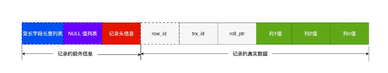

**变长字段长度列表**：对于变长字段来说（varchar等）实际存储的数据的长度（大小）是不固定的。所以，在存储数据的时候，也要把数据占用的大小存起来，存到「变长字段长度列表」里面，读取数据的时候才能根据这个「变长字段长度列表」去读取对应长度的数据。

这些变长字段的真实数据占用的字节数会按照列的顺序**逆序存放**，也就是说如果列1值，列2值都为变长字段。那么列2值实际占的字节数在左边，列1值实际占的字节数在右边。「变长字段长度列表」中的信息之所以要逆序存放，是因为这样可以使得位置靠前的记录的真实数据和数据对应的字段长度信息可以同时在一个 CPU Cache Line 中，这样就可以提高 CPU Cache 的命中率。（最左边的变长字段列在列表中的数据放在最右边可以最靠近）

NULL字段不在变长字段长度列表中。变长字段长度列表不是必须的，当数据表没有变长字段的时候，比如全部都是 int 类型的字段，这时候表里的行格式就不会有「变长字段长度列表」

**NULL值列表**：如果存在允许 NULL 值的列，则每个列对应一个二进制位（bit），二进制位按照列的顺序逆序排列（也是为了提高 CPU Cache 的命中率）。二进制位的值为1时，代表该列的值为NULL。当数据表的字段都定义成 NOT NULL 的时候，这时候表里的行格式就不会有 NULL 值列表了。在设计数据库表的时候，通常都是建议将字段设置为 NOT NULL，这样可以至少节省 1 字节的空间（NULL 值列表至少占用 1 字节空间）。

另外，NULL 值列表必须用整数个字节的位表示（1字节8位），如果使用的二进制位个数不足整数个字节，则在字节的高位补 0（最终值一定是8*N位）

**记录头信息**：

- delete_mask ：标识此条数据是否被删除。从这里可以知道，我们执行 detele 删除记录的时候，并不会真正的删除记录，只是将这个记录的 delete_mask 标记为 1。
- next_record：下一条记录的位置。从这里可以知道，记录与记录之间是通过链表组织的。在前面我也提到了，指向的是下一条记录的「记录头信息」和「真实数据」**之间的位置**，这样的好处是向左读就是记录头信息，向右读就是真实数据，比较方便。
- record_type：表示当前记录的类型，0表示普通记录，1表示B+树非叶子节点记录，2表示最小记录，3表示最大记录

**记录的真实数据**：

- row_id：如果我们建表的时候指定了主键或者唯一约束列，那么就没有 row_id 隐藏字段了。如果既没有指定主键，又没有唯一约束，那么 InnoDB 就会为记录添加 row_id 隐藏字段。row_id不是必需的，占用 6 个字节。
- trx_id：事务id，表示这个数据是由哪个事务生成的。 trx_id是必需的，占用 6 个字节。
- roll_pointer：记录上一个版本的指针。roll_pointer 是必需的，占用 7 个字节。

### varchar(n) 中 n 最大取值为多少

MySQL 规定除了 TEXT、BLOBs 这种大对象类型之外，其他所有的行（不包括隐藏列和记录头信息）占用的字节长度加起来不能超过 65535 个字节（约等于64KB）。

varchar(n) 字段类型的 n 代表的是最多存储的字符数量，并不是字节大小。因此需要看数据库表的字符集 X n = 最大的字节数

如果有多个字段的话，要保证所有字段的长度 + 变长字段字节数列表所占用的字节数 + NULL值列表所占用的字节数 <= 65535。

### MySQL对于行溢出是如何处理的

在一个页（16KB）不能存下一条记录时，就会发生行溢出，多的数据就会存到另外的「溢出页」中

当发生行溢出时，在记录的真实数据处只会保存该列的一部分数据，而把剩余的数据放在「溢出页」中，然后真实数据处用 20 字节存储指向溢出页的地址，从而可以找到剩余数据所在的页。（Compact行格式下溢出的情况）

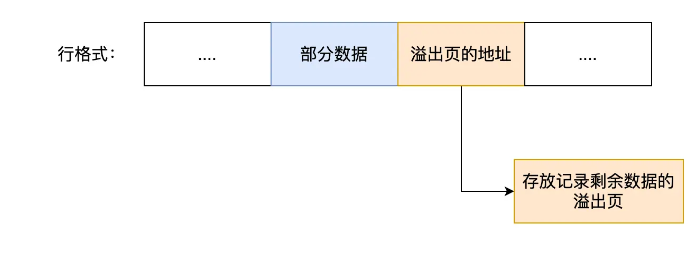

Compressed 和 Dynamic情况下溢真实数据处只会存储20个字节，而将实际的数据都存在溢出页中

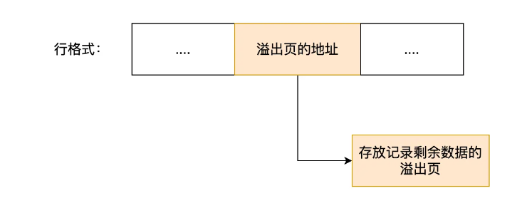


## mysql基础

主键，外键与索引：

​	主键——唯⼀标识⼀条记录，不允许重复，不允许为空。用来保存数据的完整性

​	外键——外键表⽰另⼀张表的主键，允许重复，可以是空值。主要⽤于和其它表建⽴联系。

​	（单列）索引——没有重复值，但可以有⼀个空值。为了提⾼查询排序的速度

表的优化策略：

​	1.尽量使⽤TINYINT，SMALLINT，MEDIUM_INT替代INT类型，如果是⾮负则加上UNSIGNED 

​	2.VARCHAR的长度只分配真正需要的空间

​	3.尽量使⽤整数或者枚举替代字符串类型

​	4.时间类型尽量使⽤TIMESTAMP⽽⾮DATETIME

​	5.单表不要放太多字段

​	6.尽量少使⽤NULL，很难查询优化⽽且占⽤额外索引空间

MySQL和MongoDB的区别：

​	1.从数据库模型来说，前者为关系型，后者为非关系型

​	2.存储方式上，前者针对不同引擎的存储方式不同，后者主要使用虚拟内存+持久化

​	3.查询语句上，MySQL有专属的sql语句，MongoDB也有自己的查询方式

​	4.常见架构上，MySQL包含单点，Master-Slave，MHA，Cluster；MongoDB通过副本集与分⽚来实现⾼可⽤

```
单点：数据库系统中的一个独立的、不可替代的节点，所有的请求都集中在这个节点上。这种架构存在单点故障的风险，因为如果单点发生故障，整个系统可能会受到影响。

Master-Slave（主从）：主从架构包括一个主数据库（Master）和多个从数据库（Slave）。主数据库负责处理写操作和同步数据到从数据库，而从数据库主要用于读取，提高读取性能和冗余备份。这种架构减轻了单点故障的压力，但主数据库仍然是关键节点。

MHA（MySQL Master High Availability，MySQL高可用）：通过监视主数据库的状态并在发生故障时自动切换到备用主数据库，从而减少停机时间。MHA的目标是实现主数据库的快速故障转移和自动恢复。本质上和Redis中的哨兵类似。

Cluster（集群）：集群是将多个计算机或服务器连接在一起，形成一个单一的系统，共同工作以提供更高的性能和可用性。在MySQL中，可以使用集群来水平扩展数据库性能，将数据分布在多个节点上。MySQL Cluster是一个用于实现高可用性和分布式数据库的解决方案。
```

​	5.数据处理方式上，MySQL的每个引擎有不同的处理特点，MongoDB则基于内存，将热数据存储在物理内存中，从⽽达到⾼速读写的⽬的

​	6.在数据存储上，MySQL效率相对较低，但是MongoDB不⽀持事务 


## mysql表连接

内/外连接：

​	内连接：驱动表中的记录在被驱动表中找不到记录，那么驱动表的这条记录也不会加入到最后的结果（两表的位置可以交换）

```sql
select * from 驱动表 join 被驱动表;
select * from 驱动表 inner join 被驱动表;
select * from 驱动表 cross join 被驱动表;
```

​	外连接：驱动表的记录在被驱动表中找不到，也要加入到最后的结果（两表的位置一定不能换，因为驱动表的内容需要保留）

```sql
select * from 驱动表 left join 被驱动表 on 连接条件;
select * from 被驱动表 right join 驱动表 on 连接条件;
```

​	使用的连接的时候常常需要过滤条件，分为on和where两种：

​	on：在内连接中与where等价；在外连接中，如果驱动表中的记录在被驱动表中没有记录可以匹配，该驱动表记录仍会加⼊到结果中，对应的被驱动表字段以null填充

​	where：不论内外连接，只要是不符合where⼦句的记录都不会加⼊到最后的结果中


## mysql锁

### 锁的种类

#### 全局锁

即对整个数据库实例加锁。

典型使⽤场景：全库逻辑备份，即把整个库的表都select出来存成⽂本。

MySQL 提供了⼀个加全局读锁的⽅法，命令是 Flush tables with read lock (FTWRL)。 

```sql
flush tables with read lock
unlock tables
```

当你需要让整个库处于只读状态的时候，可以使⽤这个命令，之后其他线程的以下语句会被阻塞： 

	1. 数据更新语句（数据的增删改） 2. 数据定义语句（包括建表、修改表结构等） 3. 更新类事务的提交语句

可重复读隔离级别下，备份数据的事务不会因为其他事务的的插入而影响（因为无法影响Read View），所以不需要用到全局锁。但对于 MyISAM 这种不支持事务的引擎，在备份数据库时就要使用全局锁的方法。

#### 表级锁

包括四种，分别是表锁，元数据锁（meta data lock，MDL），意向锁和AUTO-INC锁

##### 表锁

表锁在每次操作时锁住整张表，开销少，加锁快，同时并发程度最低

表锁的语法是 lock tables … read/write。与 FTWRL 类似，可以⽤ unlock tables 主动释放锁，也可以在客户端断开的时候⾃动释放。

需要注意： lock tables 语法除了会限制别的线程的读写外，也限定了本线程接下来的操作对象。

##### 元数据锁（MDL）

元数据锁：MDL 不需要显式使⽤，在访问⼀个表的时候会被⾃动加上。MDL 的作⽤：保证读写的正确性。

当对⼀个表做增删改查操作（CRUD）的时候，加 MDL 读锁； 当要对表做结构变更操作的时候，加 MDL 写锁。

读锁之间不互斥，因此你可以有多个线程同时对⼀张表增删改查。读写锁之间、写锁之间是互斥的，⽤来保证变更表结构操作的安全性。因此，如果有两个线程要同时给⼀个表加字段，其中⼀个要等另⼀个执⾏完才能开始执⾏。同时，申请MDL锁时，写锁的优先级要高于读锁，一旦出现MDL写锁等待，会阻塞后面所有的CRUD操作。

事务中的MDL 锁，在语句执⾏开始时申请，但是语句结束后并不会马上释放，⽽会等到整个事务提交后再释放。 （这可能会产⽣死锁的问题）

##### 意向锁

意向锁遵循以下两个规则：

在使用 InnoDB 引擎的表里对某些记录加上「共享锁」之前，需要先在表级别加上一个「意向共享锁」；

在使用 InnoDB 引擎的表里对某些纪录加上「独占锁」之前，需要先在表级别加上一个「意向独占锁」；

也就是，当执行插入、更新、删除操作，需要先对表加上「意向独占锁」，然后对该记录加独占锁。而普通的 select 是不会加行级锁的，普通的 select 语句是利用 MVCC 实现一致性读，是无锁的。不过，select 也是可以对记录加共享锁和独占锁的，具体方式如下：

```sql
# 先在表上加上意向共享锁，然后对读取的记录加共享锁
select ... lock in share mode;

# 先表上加上意向独占锁，然后对读取的记录加独占锁
select ... for update;
```

意向共享锁和意向独占锁是表级锁，不会和行级的共享锁和独占锁发生冲突，而且意向锁之间也不会发生冲突，只会和共享表锁（\*lock tables ... read\*）和独占表锁（lock tables ... write）发生冲突。

如果没有「意向锁」，那么加「独占表锁」时，就需要遍历表里所有记录，查看是否有记录存在独占锁，这样效率会很慢。有了「意向锁」，由于在对记录加独占锁前，先会加上表级别的意向独占锁，那么在加「独占表锁」时，直接查该表是否有意向独占锁，如果有就意味着表里已经有记录被加了独占锁，这样就不用去遍历表里的记录。

意向锁的目的是为了快速判断表里是否有记录被加锁

##### AUTO-INC锁

表里的主键通常都会设置成自增的，这是通过对主键字段声明 `AUTO_INCREMENT` 属性实现的。之后可以在插入数据时，可以不指定主键的值，数据库会自动给主键赋值递增的值，这主要就是通过 AUTO-INC 锁实现的。

AUTO-INC 锁是特殊的表锁机制，锁不是再一个事务提交后才释放，而是再执行完插入语句后就会立即释放。

在插入数据时，会加一个表级别的 AUTO-INC 锁，然后为被 `AUTO_INCREMENT` 修饰的字段赋值递增的值，等插入语句执行完成后，才会把 AUTO-INC 锁释放掉。那么，一个事务在持有 AUTO-INC 锁的过程中，其他事务的如果要向该表插入语句都会被阻塞，从而保证插入数据时，被 `AUTO_INCREMENT` 修饰的字段的值是连续递增的。

不过因为表锁的效率太低，所以后来InnoDB 存储引擎又提供了一种轻量级的锁来实现自增

#### 行锁

针对数据表中⾏记录的锁（也有⼈称为记录锁）。InnoDB 引擎是支持行级锁的，而 MyISAM 引擎并不支持行级锁。

行锁的类型主要有三类：

- Record Lock，记录锁，也就是仅仅把一条记录锁上
- Gap Lock，间隙锁，锁定一个范围，但是不包含记录本身
- Next-Key Lock：Record Lock + Gap Lock 的组合，锁定一个范围，并且锁定记录本身

##### Record Lock

每次操作锁住一行数据；开销大，加锁慢；但是发生锁冲突的概率较低，并发度也是最高的。而且记录锁是有 S 锁和 X 锁之分

在 InnoDB 事务中，⾏锁是在需要的时候才加上的，但并不是不需要了就⽴刻释放，⽽是要等到事务结束时才释放。这个就是两阶段锁协议。

如果事务中需要锁多个⾏，要把最可能造成锁冲突、最可能影响并发度的锁尽量往后放，以提高并发性。

##### Gap Lock

Gap Lock 称为间隙锁，只存在于可重复读隔离级别，目的是为了解决可重复读隔离级别下幻读的现象。

假设，表中有一个范围 id 为（3，5）间隙锁，那么其他事务就无法插入 id = 4 这条记录了，这样就有效的防止幻读现象的发生。

间隙锁虽然存在 X 型间隙锁和 S 型间隙锁，但是并没有什么区别，间隙锁之间是兼容的，即两个事务可以同时持有包含共同间隙范围的间隙锁，并不存在互斥关系，因为间隙锁的目的是防止插入幻影记录而提出的。

##### Next-Key Lock

临键锁，是 Record Lock + Gap Lock 的组合，锁定一个范围，并且锁定记录本身。核心在于：即能保护该记录，又能阻止其他事务将新纪录插入到被保护记录前面的间隙中。（注意只是保护前面的间隙）

假设，表中有一个范围 id 为（3，5] 的 next-key lock，那么其他事务即不能插入 id = 4 记录，也不能修改 id = 5 这条记录。

next-key lock 是包含间隙锁+记录锁的，如果一个事务获取了 X 型的 next-key lock，那么另外一个事务在获取相同范围的 X 型的 next-key lock 时，是会被阻塞的。

##### 插入意向锁

一个事务在插入一条记录的时候，需要判断插入位置是否已被其他事务加了间隙锁（next-key lock 也包含间隙锁）。

如果有的话，插入操作就会发生阻塞，直到拥有间隙锁的那个事务提交为止（释放间隙锁的时刻），在此期间会生成一个插入意向锁，表明有事务想在某个区间插入新记录，但是现在处于等待状态。插入意向锁名字虽然有意向锁，但是它并不是意向锁，它是一种特殊的间隙锁，属于行级别锁。

### mysql是如何加锁的

行级锁加锁规则比较复杂，不同的场景，加锁的形式是不同的。加锁的对象是索引，加锁的基本单位是 next-key lock，它是由记录锁和间隙锁组合而成的，next-key lock 是前开后闭区间，而间隙锁是前开后开区间。

但是，next-key lock 在一些场景下会退化成记录锁或间隙锁。**在使用记录锁或者间隙锁就能避免幻读现象的场景下， next-key lock 就会退化成记录锁或间隙锁**。

#### 唯一索引等值查询

查询的记录存不存在，加锁的规则也会不同：

- 当查询的记录是「存在」的，在索引树上定位到这一条记录后，将该记录的索引中的 next-key lock 会**退化成「记录锁」**
- 当查询的记录是「不存在」的，在索引树找到第一条大于该查询记录的记录后，将该记录的索引中的 next-key lock 会**退化成「间隙锁」**

#### 唯一索引范围查询

当唯一索引进行范围查询时，**会对每一个扫描到的索引加 next-key 锁，然后如果遇到下面这些情况，会退化成记录锁或者间隙锁**：

- 针对「大于等于」的范围查询，因为存在等值查询的条件，那么如果等值查询的记录是存在于表中，那么该记录的索引中的 next-key 锁会**退化成记录锁**
- 针对「小于或者小于等于」的范围查询，要看条件值的记录是否存在于表中：
    - 当条件值的记录不在表中，那么不管是「小于」还是「小于等于」条件的范围查询，**扫描到终止范围查询的记录时，该记录的索引的 next-key 锁会退化成间隙锁**，其他扫描到的记录，都是在这些记录的索引上加 next-key 锁
    - 当条件值的记录在表中，如果是「小于」条件的范围查询，**扫描到终止范围查询的记录时，该记录的索引的 next-key 锁会退化成间隙锁**，其他扫描到的记录，都是在这些记录的索引上加 next-key 锁；如果「小于等于」条件的范围查询，扫描到终止范围查询的记录时，该记录的索引 next-key 锁不会退化成间隙锁。其他扫描到的记录，都是在这些记录的索引上加 next-key 锁。

#### 非唯一索引等值查询

因为存在两个索引，一个是主键索引，一个是非唯一索引（二级索引），所以在加锁时，同时会对这两个索引都加锁，但是对主键索引加锁的时候，只有满足查询条件的记录才会对它们的主键索引加锁。

针对非唯一索引等值查询时，查询的记录存不存在，加锁的规则也会不同：

- 当查询的记录「存在」时，由于不是唯一索引，所以肯定存在索引值相同的记录，于是非唯一索引等值查询的过程是一个扫描的过程，直到扫描到第一个不符合条件的二级索引记录就停止扫描，然后在扫描的过程中，对扫描到的二级索引记录加的是 next-key 锁，而**对于第一个不符合条件的二级索引记录，该二级索引的 next-key 锁会退化成间隙锁**。同时，在符合查询条件的记录的主键索引上加记录锁。
- 当查询的记录「不存在」时，**扫描到第一条不符合条件的二级索引记录，该二级索引的 next-key 锁会退化成间隙锁**。因为不存在满足查询条件的记录，所以不会对主键索引加锁。

#### 非唯一索引范围查询

非唯一索引范围查询，索引的 next-key lock 不会有退化为间隙锁和记录锁的情况，也就是非唯一索引进行范围查询时，对二级索引记录加锁都是加 next-key 锁。

#### 没有加索引的情况

锁定读查询语句，没有使用索引列作为查询条件，或者查询语句没有走索引查询，导致扫描是全表扫描。那么，每一条记录的索引上都会加 next-key 锁，这样就相当于锁住的全表，这时如果其他事务对该表进行增、删、改操作的时候，都会被阻塞。这是个非常严重的问题。

### update没加索引导致的问题

在 InnoDB 事务中，对记录加锁带基本单位是 next-key 锁，但是会因为一些条件会退化成间隙锁，或者记录锁。加锁的位置准确的说，锁是加在索引上的而非行上。比如，在 update 语句的 where 条件使用了唯一索引，那么 next-key 锁会退化成记录锁，也就是只会给一行记录加锁。

如果在 update 语句的 where 条件没有使用索引，就会全表扫描，于是就会对所有记录加上 next-key 锁（记录锁 + 间隙锁），相当于把整个表锁住了。关键还得看这条语句在执行过程种，优化器最终选择的是索引扫描，还是全表扫描，如果走了全表扫描，就会对全表的记录加锁了。

注意这里加的不是表锁，而是每个行都加了next-key lock。Innodb 源码里面在扫描记录的时候，都是针对索引项这个单位去加锁的。

#### 如何避免这种事故的发生

将 MySQL 里的 `sql_safe_updates` 参数设置为 1，开启安全更新模式。这使得以下语句发生变化：

1.update 语句必须满足如下条件之一才能执行成功：

- 使用 where，并且 where 条件中必须有索引列
- 使用 limit
- 同时使用 where 和 limit，此时 where 条件中可以没有索引列

2.delete 语句必须满足以下条件能执行成功：

- 同时使用 where 和 limit，此时 where 条件中可以没有索引列

### 锁的划分

#### 数据库角度

1.共享锁（也叫S锁或读锁）

​	共享锁锁定的资源可以被其他⽤户读取，但不能修改。

​	在进⾏SELECT的时候，会将对象进⾏共享锁锁定，当数据读取完毕之后，就会释放共享锁，这样就可以保证数据 在读取时不被修改。

​	如果我们想要给某⼀⾏加上共享锁呢，⽐如想对 user_id=10的数据⾏加上共享锁，可以像下⾯这样：

```sql
SELECT user_id FROM product_comment WHERE user_id = 10 LOCK IN SHARE MODE;
```

2.排他锁（也叫X锁，独占锁，写锁）

​	排它锁锁定的数据只允许进⾏锁定操作的事务使⽤，其他事务⽆法对已锁定的数据进⾏查询或修改。

​	如果我们想要在某个数据⾏上添加排它锁，⽐如针对 user_id=10的数据⾏，则写成如下这样：

```sql
SELECT user_id FROM product_comment WHERE user_id = 10 FOR UPDATE;
```

另外当我们对数据进⾏更新的时候，也就是INSERT、DELETE或者UPDATE的时候，数据库也会⾃动使⽤排它锁， 防⽌其他事务对该数据⾏进⾏操作。

3.表级使用共享锁或排他锁

​	共享锁对表的加锁和解锁

```sql
LOCK TABLE product_comment READ; 
UNLOCK TABLE; 
```

​	排他锁对表的加锁和解锁

```sql
LOCK TABLE product_comment WRITE; 
UNLOCK TABLE;
```

4.意向锁

如果我们给某⼀⾏数据加上了排它锁，数据库会⾃动给更⼤⼀级的空间，⽐如数据页或数据表 加上意向锁，告诉其他⼈这个数据页或数据表已经有⼈上过排它锁了，这样当其他⼈想要获取数据表排它锁的时候，只需要了解是否有⼈已经获取了这个数据表的意向排他锁即可。

#### 程序员角度

1.乐观锁

​	认为对同⼀数据的并发操作不会总发⽣，属于⼩概率事件，不⽤每次都对数据上锁，也就是不采⽤数据库⾃⾝的锁 机制，⽽是通过程序来实现。在程序上，我们可以采⽤版本号机制或者时间戳机制实现。

​	适合读操作多的场景，相对来说写的操作⽐较少。它的优点在于程序实现，不存在死锁问题，不过适⽤场景也会相对乐观，因为它阻⽌不了除了程序以外的数据库操作。

2.悲观锁

​	对数据被其他事务的修改持保守态度，会通过数据库⾃⾝的锁机制来实现，从⽽保证数据操作的排它性。

​	适合写操作多的场景，因为写的操作具有排它性。采⽤悲观锁的⽅式，可以在数据库层⾯阻⽌其他事务对该数据的 操作权限，防⽌读 - 写和写 - 写的冲突。但是加锁的时间会⽐较长，可能会长时间限制其他⽤户的访问，也就是说他的并发访问性不好。

### mysql死锁

#### 死锁的原因

mysql死锁的原因是两阶段锁协议。指所有事务必须分两个阶段对数据加锁和解锁，在对任何数据进行读、写操作之前，事务首先要获得对该数据的锁，在释放一个锁之后，事务不再申请和获得任何其他锁。只有遵循两段锁协议，才能实现可串行化调度（并发调度）。

但是两阶段锁协议不要求事务必须一次将所有需要使用的数据加锁，并且在加锁阶段没有顺序要求，所以这种并发控制方式会形成死锁。

#### 死锁的场景

- 事务同时更新多个表：当一个事务同时更新多个表并且使用了不同的顺序。例如，事务A首先更新表X，然后获取锁，并在未释放锁的情况下尝试更新表Y；而事务B首先更新表Y，然后获取锁，并在未释放锁的情况下尝试更新表X。这种情况下，两个事务会相互等待对方的锁释放，从而形成死锁。
- 事务嵌套：一个事务内部开启了另一个事务，并在内层事务中更新了某个表，而外层事务也需要更新该表的同一行记录时，就有可能发生死锁。因为外层事务需要等待内层事务释放锁，而内层事务需要等待外层事务释放锁。
- 索引顺序不一致：当多个事务按照不同的顺序访问相同的数据行，并且使用了不同的索引时，可能会发生死锁。例如，事务A按照索引1的顺序访问数据行，事务B按照索引2的顺序访问同一组数据行，这样两个事务之间就会产生死锁。
- 不同事务同时更新相同的索引：多个事务同时更新相同的索引时，可能会导致死锁。这是因为事务在更新索引时会获取对应的锁，并在未释放锁的情况下尝试更新其他数据，从而形成死锁。

#### 死锁避免

死锁的四个必要条件：互斥、占有且等待、不可强占用、循环等待。二阶段锁协议强调了前三个方面。

在数据库层面，有两种策略通过「打破循环等待条件」来解除死锁状态：

- 设置事务等待锁的超时时间。当一个事务的等待时间超过该值后，就对这个事务进行回滚，于是锁就释放了，另一个事务就可以继续执行了。在 InnoDB 中，参数 `innodb_lock_wait_timeout` 是用来设置超时时间的，默认值时 50 秒。
- 开启主动死锁检测。主动死锁检测在发现死锁后，主动回滚死锁链条中的某一个事务，让其他事务得以继续执行。将参数 `innodb_deadlock_detect` 设置为 on，表示开启这个逻辑，默认就开启。

#### 死锁案例

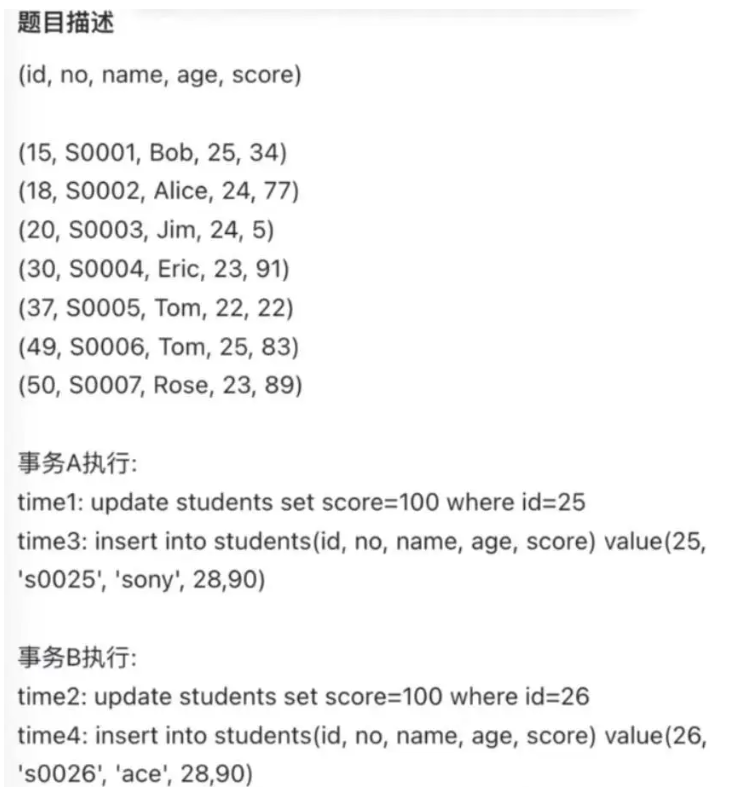

事务A和事务B会发生死锁。当它们在使用insert语句后，都陷入了等待状态，都在等待对方释放锁。

两个事务即使生成的间隙锁的范围是一样的，也不会发生冲突，因为间隙锁目的是为了防止其他事务插入数据，因此间隙锁与间隙锁之间是相互兼容的。

在执行插入语句时，如果插入的记录在其他事务持有间隙锁范围内，插入语句就会被阻塞，因为插入语句在碰到间隙锁时，会生成一个插入意向锁，然后插入意向锁和间隙锁之间是互斥的关系。如果两个事务分别向对方持有的间隙锁范围内插入一条记录，而插入操作为了获取到插入意向锁，都在等待对方事务的间隙锁释放，于是就造成了循环等待。

在这里，事务A，B都在主键索引上加入了间隙锁，锁范围为(20,30)。而它们接下来的insert语句都在这个范围内，造成需要等待对方间隙锁释放的情况，导致死锁。这是死锁场景中的“不同事务同时更新相同的索引”的情况。


## mysql事务

### 事务基础

事务是⼀个最⼩的不可再分的⼯作单元；通常情况下，⼀个事务对应⼀个完整的业务。

mysql事务特性：ACID

​	A：原⼦性（Atomicity），⼀个事务的所有操作，要么全部完成，要么都没完成，不能结束在中间环节。如果事务在执⾏过程中发⽣错误，会被回滚到事务开始之前的状态

​	C：⼀致性（Consistency），在事务开始之前以及事务结束之后，数据库的完整性不能被破坏 

​	I：隔离性（Isolation），允许多个并发事务同时对数据进⾏修改和读写的能⼒，它可以防⽌由于多个事务并发执⾏时由于交叉执⾏⽽导致的数据不⼀致 

​	D：持久性（Durability），事务处理结束了以后，对数据的修改是永久的，即使是发⽣了系统故障，数据也不会丢失

MVCC（多版本并发控制）四大问题：脏写，脏读，不可重复读，幻读

​	脏写：一个事务写到另一个未提交事务修改过的数据

​	脏读：一个事务读到另一个未提交事务修改过的数据

​	不可重复读：在一个事务内多次读取同一个数据，如果出现前后两次读到的数据不一样的情况。这主要发生在前后两次读到的数据之间提交了一个新的修改事物修改了数据。（注意不可重复读和幻读的[另一个事务]是提交了的）

​	幻读：一个事务内多次查询某个符合查询条件的「记录数量」，如果出现前后两次查询到的记录数量不一样的情况，就意味着发生了「幻读」现象

不可重复读是内容发生变化，幻读是数量发生变化。

MVCC四大隔离级别：

​	RU读不提交：指一个事务还没提交时，它做的变更就能被其他事务看到。事务之间完全不隔离，会产⽣脏读，⼀般情况不会使⽤

​	RC 读提交：本事务读取到的是其它事务提交的最新数据，但有⼀个问题在同⼀个事务中，前后两相同的select可能会读到不同的结果

​	RR可重复读：在同⼀个事务中，select的结果是事务开始时时间点的状态，因此，同⼀个事务同样的select操作可以读到⼀致的结果。这是MySQL InnoDB 引擎的默认隔离级别

​	serializable串行化：隐式获取共享锁，保证不同事务之间的互斥。后访问的事务必须等前一个事务执行完成，才能继续执行

MySQL 在「可重复读」隔离级别下，可以很大程度上避免幻读现象的发生（注意是很大程度避免，并不是彻底避免），所以 MySQL 并不会使用「串行化」隔离级别来避免幻读现象的发生，因为使用「串行化」隔离级别会影响性能

### 如何在可重复读隔离级别下避免幻读

- 针对快照读（普通 select 语句），是通过 MVCC 方式解决了幻读，因为可重复读隔离级别下，事务执行过程中看到的数据，一直跟这个事务启动时看到的数据是一致的，即使中途有其他事务插入了一条数据，是查询不出来这条数据的，所以就很好了避免幻读问题。
- 针对当前读（select ... for update 等语句），是通过 next-key lock（记录锁+间隙锁）方式解决了幻读，因为当执行 select ... for update 语句的时候，会加上 next-key lock，如果有其他事务在 next-key lock 锁范围内插入了一条记录，那么这个插入语句就会被阻塞，无法成功插入，所以就很好了避免幻读问题。

### MySQL 可重复读隔离级别，完全解决幻读了吗？

同一个查询在不同的时间产生不同的结果集时，事务中就会出现所谓的幻象问题（注意不可重复读和幻读的核心区别在于一个前者select前后内容不同，后者前后行数不同）

快照读（普通select语句）使用MVCC，当前读（select...for update）使用next-key lock（记录锁+间隙锁）的方式解决幻读。但这两种方式并没有彻底解决幻读，包括两个场景：

- 对于快照读， MVCC 并不能完全避免幻读现象。因为当事务 A 更新了一条事务 B 插入的记录，那么事务 A 前后两次查询的记录条目就不一样了，所以就发生幻读（简单来说就是事务B的提交在A的两次查询之间）
- 对于当前读，如果事务开启后，并没有执行当前读，而是先快照读，然后这期间如果其他事务插入了一条记录，那么事务后续使用当前读进行查询的时候，就会发现两次查询的记录条目就不一样了，所以就发生幻读。

这种情况下，最好的解决方案就是先当前读，加入记录锁和间隙锁，以避免幻读。

### 事务开启

在 MySQL 有两种开启事务的命令，分别是：

- 第一种：begin/start transaction 命令；
- 第二种：start transaction with consistent snapshot 命令；

这两种开启事务的命令，事务的启动时机是不同的：

- 执行了 begin/start transaction 命令后，并不代表事务启动了。只有在执行这个命令后，执行了第一条 select 语句，才是事务真正启动的时机；
- 执行了 start transaction with consistent snapshot 命令，就会马上启动事务。

### 隔离级别的实现

- 对于「读未提交」隔离级别的事务来说，因为可以读到未提交事务修改的数据，所以直接读取最新的数据就好了；
- 对于「串行化」隔离级别的事务来说，通过加读写锁的方式来避免并行访问；
- 对于「读提交」和「可重复读」隔离级别的事务来说，它们是通过 Read View 来实现的，它们的区别在于创建 Read View 的时机不同，可以把 Read View 理解成一个数据快照。「**读提交」隔离级别是在「每个语句执行前」都会重新生成一个 Read View，而「可重复读」隔离级别是「启动事务时」生成一个 Read View，然后整个事务期间都在用这个 Read View**。

### Read View 在 MVCC 里如何工作的

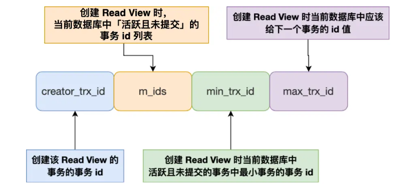

m_ids：在创建 Read View 时，当前数据库中「活跃事务」的事务 id 列表，注意是一个列表，“活跃事务”指的就是，启动了但还没提交的事务

min_trx_id：「活跃事务」的事务 id 列表中id最小的事务。也就是m_ids的最小值。

max_trx_id：这个并不是 m_ids 的最大值，而是创建 Read View 时当前数据库中应该给下一个事务的 id 值，也就是全局事务（注意是所有已经产生的事务，而不是活跃事务）中最大的事务 id 值 + 1；

creator_trx_id ：指的是创建该 Read View 的事务的事务 id

行格式中还存在两个隐藏列，与事务相关：

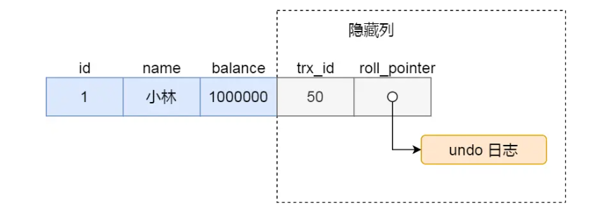

trx_id，当一个事务对某条聚簇索引记录进行改动时，就会把该事务的事务 id 记录在 trx_id 隐藏列里

roll_pointer，每次对某条聚簇索引记录进行改动时，都会把旧版本的记录写入到 undo 日志中，这个隐藏列实际是个指针，指向每一个旧版本记录，于是就可以通过它找到修改前的记录。

在创建 Read View 后，记录中的 trx_id 可以划分这三种情况

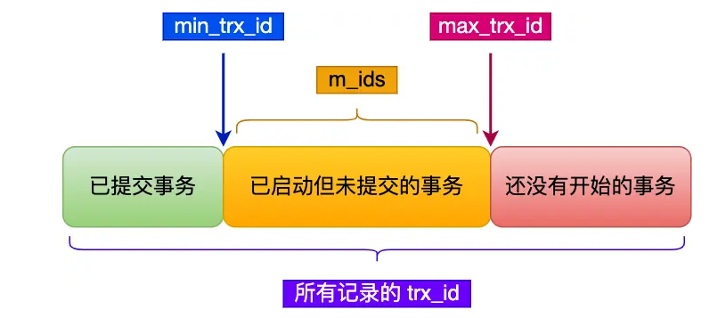

一个事务去访问记录的时候，除了自己的更新记录总是可见之外，还有这几种情况：

- 如果记录的 trx_id 值小于 Read View 中的 `min_trx_id` 值，表示这个版本的记录是在创建 Read View 前已经提交的事务生成的，所以该版本的记录对当前事务可见。
- 如果记录的 trx_id 值大于等于 Read View 中的 `max_trx_id` 值，表示这个版本的记录是在创建 Read View 后才启动的事务生成的，所以该版本的记录对当前事务不可见。
- 如果记录的 trx_id 值在 Read View 的 `min_trx_id` 和 `max_trx_id` 之间，需要判断 trx_id 是否在 m_ids 列表中：
    - 如果记录的 trx_id **在** `m_ids` 列表中，表示生成该版本记录的活跃事务依然活跃着（还没提交事务），所以该版本的记录对当前事务不可见。
    - 如果记录的 trx_id **不在** `m_ids`列表中，表示生成该版本记录的活跃事务已经被提交，所以该版本的记录对当前事务可见。

这种通过「版本链」来控制并发事务访问同一个记录时的行为就叫 MVCC（多版本并发控制）

### 读提交/可重复读的工作方式

- 「读提交」隔离级别是在每个 select 都会生成一个新的 Read View，也意味着，事务期间的多次读取同一条数据，前后两次读的数据可能会出现不一致，因为可能这期间另外一个事务修改了该记录，并提交了事务。
- 「可重复读」隔离级别是启动事务时生成一个 Read View，然后整个事务期间都在用这个 Read View，这样就保证了在事务期间读到的数据都是事务启动前的记录。


## mysql索引

索引的出现其实就是为了提⾼数据查询的效率，就像书的⽬录⼀样，它位于存储引擎中

### 索引的分类

- 按「数据结构」分类：**B+tree索引、Hash索引、Full-text索引**。
- 按「物理存储」分类：**聚簇索引（主键索引）、二级索引（辅助索引）**。
- 按「字段特性」分类：**主键索引、唯一索引、普通索引、前缀索引**。
- 按「字段个数」分类：**单列索引、联合索引**。

#### 数据结构分类

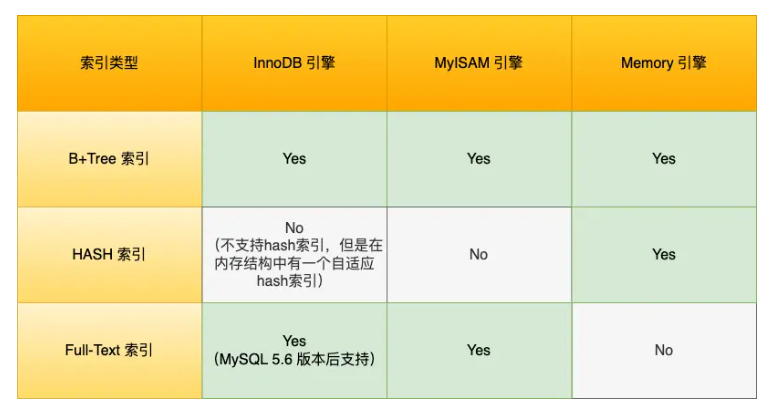

HASH所以使用与精确匹配查询，Full-Test

在创建表时，InnoDB 存储引擎会根据不同的场景选择不同的列作为索引：

- 如果有主键，默认会使用主键作为聚簇索引的索引键（key）；

    ```sql
    # 创建表时选择主键
    # 单一主键值
    CREATE TABLE your_table (
        id INT AUTO_INCREMENT PRIMARY KEY,
        -- other columns
    );
    # 复合主键
    CREATE TABLE your_table (
        column1 INT,
        column2 VARCHAR(50),
        PRIMARY KEY (column1, column2),
        -- other columns
    );
    ```

- 如果没有主键，就选择第一个不包含 NULL 值的唯一列作为聚簇索引的索引键（key）

- 在上面两个都没有的情况下，InnoDB 将自动生成一个隐式自增 id 列作为聚簇索引的索引键（key）；

其它索引都属于辅助索引（Secondary Index），也被称为二级索引或非聚簇索引。创建的主键索引和二级索引默认使用的是 B+Tree 索引。

##### B+Tree索引

B+Tree 是一种多叉树，叶子节点才存放数据，非叶子节点只存放索引，而且每个节点里的数据是按主键顺序存放的（也叫主键索引的B+Tree）。每一层父节点的索引值都会出现在下层子节点的索引值中，因此在叶子节点中，包括了所有的索引值信息，并且每一个叶子节点都有两个指针，分别指向下一个叶子节点和上一个叶子节点，形成一个双向链表。

注意，主键索引的B+ Tree和二级索引的B+ Tree完全不同，在实际查询的时候，如果用二级索引查询，需要先检索二级索引中的 B+Tree 的索引值，然后再通过主键索引中的 B+Tree 树查询到对应的叶子节点，然后获取整行数据。这个过程叫「回表」，也就是说要查两个 B+Tree 才能查到数据。

不过，当查询的数据是能在二级索引的 B+Tree 的叶子节点里查询到，这时就不用再查主键索引。这种在二级索引的 B+Tree 就能查询到结果的过程就叫作「覆盖索引」，也就是只需要查一个 B+Tree 就能找到数据。

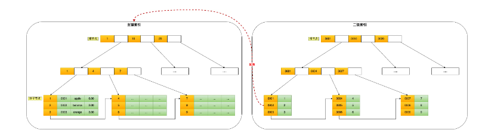

数据库的索引和数据都是存储在硬盘的，我们可以把读取一个节点当作一次磁盘 I/O 操作。B+Tree 存储千万级的数据只需要 3-4 层高度就可以满足，这意味着从千万级的表查询目标数据最多需要 3-4 次磁盘 I/O，所以B+Tree 相比于 B 树和二叉树来说，最大的优势在于查询效率很高，因为即使在数据量很大的情况，查询一个数据的磁盘 I/O 依然维持在 3-4次。

##### B+树的优势

B+树相较于B树，B+Tree 只在叶子节点存储数据，而 B 树 的非叶子节点也要存储数据，所以 B+Tree 的单个节点的数据量更小，在相同的磁盘 I/O 次数下，就能查询更多的节点。另外，B+Tree 叶子节点采用的是双链表连接，适合 MySQL 中常见的基于范围的顺序查找，而 B 树无法做到这一点。

B+树相较于二叉树，B+Tree 的高度依然维持在 3~4 层左右，也就是说一次数据查询操作只需要做 3~4 次的磁盘 I/O 操作就能查询到目标数据。在搜索复杂度上比二叉树低得多。这也是因为二叉树对一个父节点允许的子节点数只有2。

B+树相较于哈希，Hash 在做等值查询的时候效率很高，但不适合做范围查询，缺乏顺序性。

#### 物理存储分类

索引分为聚簇索引（主键索引）、二级索引（辅助索引）

- 主键索引的 B+Tree 的叶子节点存放的是实际数据，所有完整的用户记录都存放在主键索引的 B+Tree 的叶子节点里；
- 二级索引的 B+Tree 的叶子节点存放的是主键值，而不是实际数据。

在查询时使用了二级索引，如果查询的数据能在二级索引里查询的到，那么就不需要回表，这个过程就是覆盖索引。如果查询的数据不在二级索引里，就会先检索二级索引，找到对应的叶子节点，获取到主键值后，然后再检索主键索引，就能查询到数据了，这个过程就是回表。

二级索引查到主键值后，可以使用找到的主键值在主键索引的叶子节点中查找完整的数据行

注意把二级索引和联合索引区分开，在主键索引之上再建立一个索引也是二级索引。联合索引是二级索引的一种。

#### 字段特性分类

索引分为主键索引、唯一索引、普通索引、前缀索引

##### 主键索引

建立在主键字段上的索引，通常在创建表的时候一起创建，一张表最多只有一个主键索引，索引列的值不允许有空值

```sql
# 创建表时创建主键索引
CREATE TABLE table_name  (
  ....
  PRIMARY KEY (index_column_1) USING BTREE
);
```

##### 唯一索引

建立在 UNIQUE 字段上的索引，一张表可以有多个唯一索引，索引列的值必须唯一，但是允许有空值。

```sql
# 创建表时创建唯一索引
CREATE TABLE table_name  (
  ....
  UNIQUE KEY(index_column_1,index_column_2,...) 
);
# 建表后创建唯一索引
CREATE UNIQUE INDEX index_name
ON table_name(index_column_1,index_column_2,...); 
```

##### 普通索引

建立在普通字段上的索引，既不要求字段为主键，也不要求字段为 UNIQUE

```sql
# 创建表时创建普通索引
CREATE TABLE table_name  (
  ....
  INDEX(index_column_1,index_column_2,...) 
);
# 建表后创建普通索引
CREATE INDEX index_name
ON table_name(index_column_1,index_column_2,...); 
```

##### 前缀索引

前缀索引是指对字符类型字段的前几个字符建立的索引，而不是在整个字段上建立的索引，前缀索引可以建立在字段类型为 char、 varchar、binary、varbinary 的列上。

使用前缀索引的目的是为了减少索引占用的存储空间，提升查询效率。

```sql
# 创建表时创建前缀索引
CREATE TABLE table_name(
    column_list,
    INDEX(column_name(length))
); 
# 建表后创建前缀索引
CREATE INDEX index_name
ON table_name(column_name(length)); 
```

#### 字段个数分类

从字段个数的角度来看，索引分为单列索引、联合索引（复合索引）。

- 建立在单列上的索引称为单列索引，比如主键索引；
- 建立在多列上的索引称为联合索引；

##### 联合索引

通过将多个字段组合成一个索引，该索引就被称为联合索引。

```sql
CREATE INDEX index_product_no_name ON product(product_no, name);
```

使用联合索引时，存在最左匹配原则，也就是按照最左优先的方式进行索引的匹配。在使用联合索引进行查询的时候，如果不遵循「最左匹配原则」，联合索引会失效，这样就无法利用到索引快速查询的特性了（因为有查询优化器，所以最左字段实际在 where 子句的顺序并不重要）

##### 联合索引范围查询

联合索引有一些特殊情况，并不是查询过程使用了联合索引查询，就代表联合索引中的所有字段都用到了联合索引进行索引查询，也就是可能存在部分字段用到联合索引的 B+Tree。

这种特殊情况就发生在范围查询。联合索引的最左匹配原则会一直向右匹配直到遇到「范围查询」就会停止匹配。也就是范围查询的字段可以用到联合索引，但是在范围查询字段的后面的字段无法用到联合索引。（范围查询后的字段是无序的，从本质上来说）

以`select * from t_table where a > 1 and b = 2`为例，在符合 a > 1 条件的二级索引记录的范围里，b 字段的值是无序的。因此我们不能根据查询条件 b = 2 来进一步减少需要扫描的记录数量（b 字段无法利用联合索引进行索引查询的意思）

但是在`select * from t_table where a >= 1 and b = 2`中，对于a=1的情况下，b 字段的值是「有序」的（对于联合索引，是先按照 a 字段的值排序，然后在 a 字段的值相同的情况下，再按照 b 字段的值进行排序，简单来说就是相邻）

结论：**有等于边界的范围下，在范围查询的下一个字段可以用到联合索引，也不会停止匹配**

索引下推就是在联合索引遍历过程中，对联合索引中包含的字段先做判断，直接过滤掉不满足条件的记录，减少回表次数

##### 索引区分段

在实际开发工作中，应该将区分度大的字段排到前面，这样越有可能被SQL使用的，有效提高效率

如果索引本身的区分度很小（MySQL中的查询优化器发现某个值出现在表的数据行中的百分比高于某个值时（一般为30%））它一般会忽略索引，进行全表扫描

####  联合索引进行排序的场景

```sql
select * from order where status = 1 order by create_time asc
```

上述例子通过建立索引提高查询效率的方法？

如果单独对status 建立一个索引，但这条语句还需要对create_time排序，这时就要用文件排序，增加了查询成本。

如果排序的时候按照 status 和 create_time 列建立联合索引（ status 在最左边），这样根据 status 筛选后的数据就是按照 create_time 排好序的，避免在文件排序，提高了查询效率

### 索引使用的场景

索引的缺点：

- 需要占用物理空间，数量越大，占用空间越大
- 创建索引和维护索引要耗费时间，这种时间随着数据量的增加而增大
- 会降低表的增删改的效率，因为每次增删改索引，B+ 树为了维护索引有序性，都需要进行动态维护

使用索引的场景：

- 字段有唯一性限制的，比如商品编码
- 经常用于 `WHERE` 查询条件的字段，这样能够提高整个表的查询速度，如果查询条件不是一个字段，可以建立联合索引
- 经常用于 `GROUP BY` 和 `ORDER BY` 的字段，这样在查询的时候就不需要再去做一次排序了，因为我们都已经知道了建立索引之后在 B+Tree 中的记录都是排序好的

什么时候不需要创建索引：

- `HERE` 条件，`GROUP BY`，`ORDER BY` 里用不到的字段，索引的价值是快速定位，如果起不到定位的字段通常是不需要创建索引的，因为索引是会占用物理空间的
- 字段中存在大量重复数据，不需要创建索引，查询优化器发现某个值出现在表的数据行中的百分比很高的时候，它一般会忽略索引，进行全表扫描。
- 表数据太少的时候，不需要创建索引
- 经常更新的字段不用创建索引，由于要维护 B+Tree的有序性，那么就需要频繁的重建索引，这个过程是会影响数据库性能的

### 索引优化手段

- 使用前缀索引（使用某个字段中字符串的前几个字符建立索引），可以有效减小索引字段大小。前缀索引的缺陷在于：1.order by 就无法使用前缀索引。2.无法把前缀索引用作覆盖索引
- 使用覆盖索引，避免回表（不需要查询出包含整行记录的所有信息，也就减少了大量的 I/O 操作）。具体来说就是把要频繁查询的东西一起做一个联合索引
- 主键索引自增，这样每次插入的新数据就会按顺序添加到当前索引节点的位置，不需要移动已有的数据，效率非常高。如果不使用自增的主键的话，就可能需要移动其它数据来满足新数据的插入，甚至需要从一个页面复制数据到另外一个页面，我们通常将这种情况称为页分裂。页分裂还有可能会造成大量的内存碎片，导致索引结构不紧凑，从而影响查询效率。另外，主键字段的长度不要太大，因为主键字段长度越小，意味着二级索引的叶子节点越小（二级索引的叶子节点存放的数据是主键值），这样二级索引占用的空间也就越小。
- 索引最好设置为Not NULL，这样有两个好处：1.索引列存在NULL就会导致优化器做索引选择的时候更加复杂，难以优化。2.NULL会占用存储NULL值列表的空间。
- 防止索引失效

### InnoDB的数据页结构

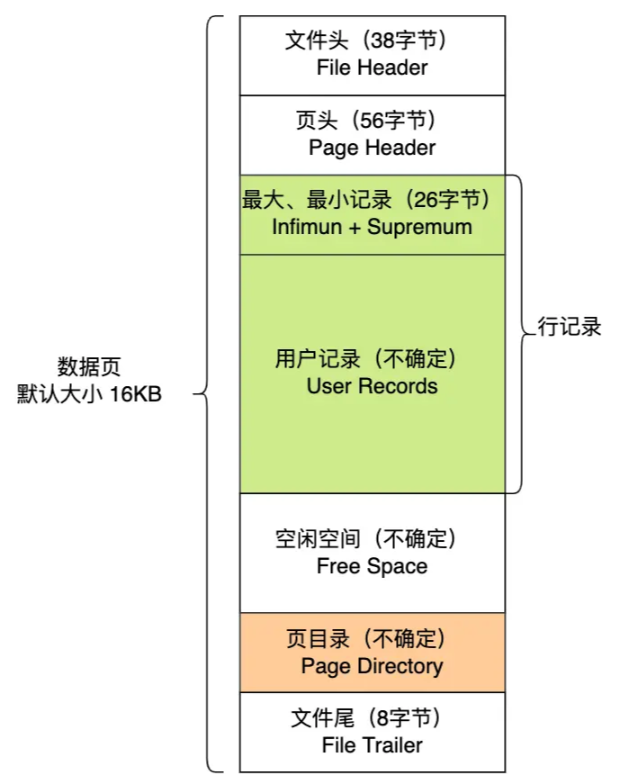

|      名称      |                     说明                     |
| :------------: | :------------------------------------------: |
|     文件头     |                 表示页的信息                 |
|      页头      |               表示页的状态信息               |
| 最小和最大记录 | 两个虚拟的伪记录，表示页中最小记录和最大记录 |
|    用户记录    |                存储行记录内容                |
|    空闲空间    |               页中没使用的空间               |
|     页目录     |   存储用户记录的相对位置，对记录起索引作用   |
|     文件尾     |                校验页是否完整                |

在 File Header 中有两个指针，分别指向上一个数据页和下一个数据页，连接起来的页相当于一个双向的链表

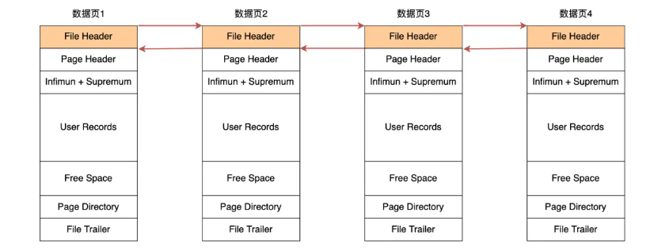

数据页中的记录按照「主键」顺序组成单向链表，单向链表的特点就是插入、删除非常方便，但是检索效率不高，最差的情况下需要遍历链表上的所有节点才能完成检索。因此，数据页中有一个页目录，起到记录的索引作用

#### 页目录与记录的关系

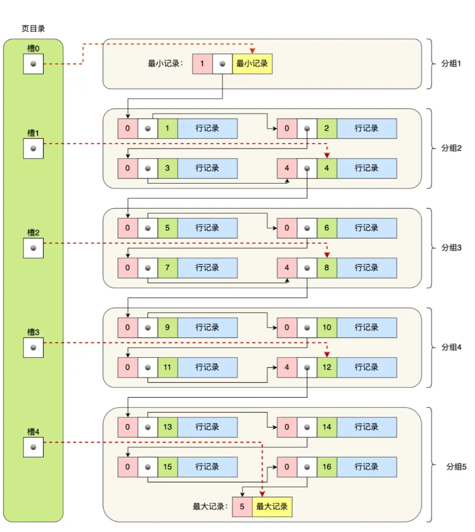

页目录由多个槽组成，槽相当于分组记录的索引。然后，因为记录是按照「主键值」从小到大排序的，所以我们通过槽查找记录时，可以使用二分法快速定位要查询的记录在哪个槽（哪个记录分组），定位到槽后，再遍历槽内的所有记录（具体的遍历过程大概率是从前一个槽指向的最后一个记录开始），找到对应的记录，无需从最小记录开始遍历整个页中的记录链表。

具体的页创建过程如下：

- 将所有的记录划分成几个组，这些记录包括最小记录和最大记录，但不包括标记为“已删除”的记录
- 每个记录组的最后一条记录就是组内最大的那条记录，并且最后一条记录的头信息中会存储该组一共有多少条记录，作为 n_owned 字段（上图中粉红色字段）
- 页目录用来存储每组最后一条记录的地址偏移量，这些地址偏移量会按照先后顺序存储起来，每组的地址偏移量也被称之为槽（slot），每个槽相当于指针指向了不同组的最后一个记录

### B+树如何进行查询

InnoDB 里的 B+ 树中的每个节点都是一个数据页

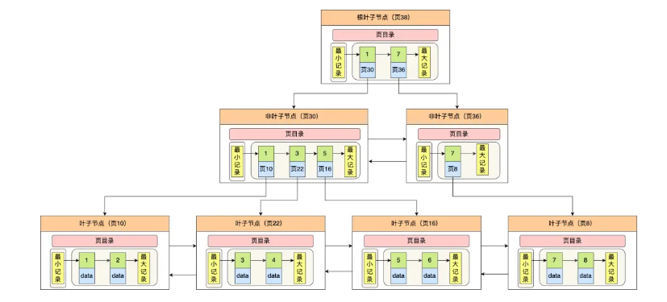

在定位记录所在哪一个页时，也是通过二分法快速定位到包含该记录的页。定位到该页后，又会在该页内进行二分法快速定位记录所在的分组（槽号），最后在分组内进行遍历查找。

### mysql为什么使用B+树作为索引

索引数据按照顺序排列，可以使用二分查找可以高效定位数据

但如果直接直接在数组中插入新元素，那么就会需要将这个元素之后的所有元素后移一位，这对于磁盘的效率而言是灾难性的。因此，需要将数组变为一个二叉查找树（二叉搜索树）。这样的话，不仅方便查找，而且二叉搜索树不需要连续排列。

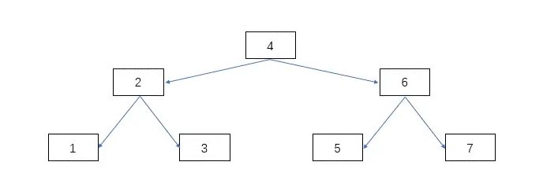

即便这样，二叉搜索树仍然存在非常大的问题，在于它的查找次数与高度息息相关。在极端情况下，如果插入的值一直比当前值大，那么最后会导致和原来数组的性能差不多。即：二叉查找树由于存在退化成链表的可能性，会使得查询操作的时间复杂度从 O(logn) 升为 O(n)

为了解决二叉查找树会在极端情况下退化成链表的问题，后面就有人提出平衡二叉查找树（AVL 树）。

主要是在二叉查找树的基础上增加了一些条件约束：每个节点的左子树和右子树的高度差不能超过 1。也就是说节点的左子树和右子树仍然为平衡二叉树，这样查询操作的时间复杂度就会一直维持在 O(logn) 。后来，又产生了红黑树，它也是一个自平衡二叉树。不管平衡二叉查找树还是红黑树，都会随着插入的元素增多，而导致树的高度变高，这就意味着磁盘 I/O 操作次数多，会影响整体数据查询的效率

为了进一步缩减IO操作次数，又提出了B树，B树就是N叉树，同时设定一个最大的子节点数，以此来降低树的高度。

B树的核心在于每个子节点都存有数据，因此每次都需要进入IO进行查询。另外，因为需要使用中序遍历，这会涉及多个节点的磁盘 I/O 问题，从而导致整体速度下降。

B+树对于B数的优势：

- 叶子节点才会存放实际数据，非叶子节点只会存放索引
- 所有索引都会在叶子节点出现，叶子节点之间构成一个有序链表
- 非叶子节点的索引也会同时存在在子节点中，并且是在子节点中所有索引的最大（或最小）
- 非叶子节点中有多少个子节点，就有多少个索引；

B+数在单点查询，插入和删除效率以及范围查询上比B树效果要好得多

索引结构不会影响单表最大行数，“最大2000W 行”只是推荐值，超过了这个值可能会导致 B + 树层级更高，影响查询性能

### 索引失效的场景

1.使用左或者左右模糊匹配的时候，也就是 `like %xx` 或者 `like %xx%`这两种方式都会造成索引失效

2.查询条件中对索引列使用函数，就会导致索引失效

3.在查询条件中对索引列进行表达式计算，也是无法走索引的

4.MySQL 在遇到字符串和数字比较的时候，会自动把字符串转为数字，然后再进行比较。如果字符串是索引列，而条件语句中的输入参数是数字的话，那么索引列会发生隐式类型转换，由于隐式类型转换是通过 CAST 函数实现的，等同于对索引列使用了函数，所以就会导致索引失效。

5.联合索引要能正确使用需要遵循最左匹配原则，也就是按照最左优先的方式进行索引的匹配，否则就会导致索引失效。

6.在 WHERE 子句中，如果在 OR 前的条件列是索引列，而在 OR 后的条件列不是索引列，那么索引会失效。


## count(*)和count(1)

从结论上来说：

**count(*)=coun(1)>count(主键字段)>count(字段)**

count() 是一个聚合函数，函数的参数不仅可以是字段名，也可以是其他任意表达式，该函数作用是统计符合查询条件的记录中，函数指定的参数不为 NULL 的记录有多少个。

```sql
# 统计「 t_order 表中，name 字段不为 NULL 的记录」有多少个
select count(name) from t_order;
# 统计 t_order 表中有多少个记录(1一定不为NULL)
select count(1) from t_order;
```

count(主键字段)，就需要循环遍历聚簇索引，将读取到的记录返回给 server 层，然后server进行判断。但对于count(1)而言，它不需要读取字段中的值给server，server直接对count+1即可。故：count(1)>count(主键字段)

count（*）不是count所有字段，而是count(0)，与count(1)同理，所以效率相同

对于count(字段)，一般就需要全表扫描了，效率是最差的

### count(*)的优化

即便count(*)的效率相对其他count的效率高，但count本身因为需要循环遍历，效率也是很低的。（count不是必须循环遍历，InnoDB采用循环遍历是为了MVCC的必要）。同一个时刻的多个查询，由于多版本并发控制（MVCC）的原因，InnoDB 表“应该返回多少行”也是不确定的。

使用 MyISAM 引擎时，执行 count 函数只需要 O(1 )复杂度，这是因为每张 MyISAM 的数据表都有一个 meta 信息有存储了row_count值，由表级锁保证一致性，所以直接读取 row_count 值就是 count 函数的执行结果。

count(*)的优化方法：

1.近似值（类似于Redis的布隆过滤器），在MySQL中使用 show table status 或者 explain 命令来表进行估算

```sql
explain select count(*) from t_order
```

2.额外表保存计数值


## mysql日志

### undo log，redo log和bin log

undo log（回滚日志）：是 Innodb 存储引擎层生成的日志，实现了事务中的原子性，主要用于事务回滚和 MVCC

redo log（重做日志）：是 Innodb 存储引擎层生成的日志，实现了事务中的持久性，主要用于掉电等故障恢复

binlog （归档日志）：是 Server 层生成的日志，主要用于数据备份和主从复制

#### undo log的使用

undo log 是一种用于撤销回退的日志。在事务没提交之前，MySQL 会先记录更新前的数据到 undo log 日志文件里面，当事务回滚时，可以利用 undo log 来进行回滚。每当 InnoDB 引擎对一条记录进行操作（修改、删除、新增）时，要把回滚时需要的信息都记录到 undo log 里。

一条记录的每一次更新操作产生的 undo log 格式都有一个 roll_pointer 指针和一个 trx_id 事务id：

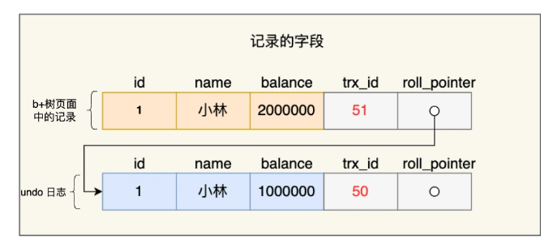

- 通过 trx_id 可以知道该记录是被哪个事务修改的；
- 通过 roll_pointer 指针可以将这些 undo log 串成一个链表，这个链表就被称为版本链；

undo log 和数据页的刷盘策略是一样的，都需要通过 redo log 保证持久化。

总结undo log的两大作用：

- **实现事务回滚，保障事务的原子性**。事务处理过程中，如果出现了错误或者用户执 行了 ROLLBACK 语句，MySQL 可以利用 undo log 中的历史数据将数据恢复到事务开始之前的状态。
- **实现 MVCC（多版本并发控制）关键因素之一**。MVCC 是通过 ReadView + undo log 实现的。undo log 为每条记录保存多份历史数据，MySQL 在执行快照读（普通 select 语句）的时候，会根据事务的 Read View 里的信息，顺着 undo log 的版本链找到满足其可见性的记录。

#### Buffer Pool的使用

MySQL 的数据都是存在磁盘中的，当更新一条记录时，先要从磁盘读取该记录，然后在内存中修改这条记录。之后，该修改会缓存起来，以避免频繁的IO操作。

为此，Innodb 存储引擎设计了一个**缓冲池（Buffer Pool）**，来提高数据库的读写性能。

在 MySQL 启动的时候，InnoDB 会为 Buffer Pool 申请一片连续的内存空间，然后按照默认的`16KB`的大小划分出一个个的页， Buffer Pool 中的页就叫做缓存页。此时这些缓存页都是空闲的，之后随着程序的运行，才会有磁盘上的页被缓存到 Buffer Pool 中。Buffer Pool 除了缓存「索引页」和「数据页」，还包括了 Undo 页，插入缓存、自适应哈希索引、锁信息等等。

注意，无论是查询还是更新都是以页为单位的，即便查询的是一条记录。InnoDB 是会把整个页的数据加载到 Buffer Pool 中，将页加载到 Buffer Pool 后，再通过页里的「页目录」去定位到某条具体的记录。

#### redo log的使用

为了防止断电导致数据丢失的问题，当有一条记录需要更新的时候，InnoDB 引擎就会先更新内存（同时标记为脏页），然后将本次对这个页的修改以 redo log 的形式记录下来，这个时候更新就算完成了。

后续，InnoDB 引擎会在适当的时候，由后台线程将缓存在 Buffer Pool 的脏页刷新到磁盘里，这就是 **WAL （Write-Ahead Logging）技术**。（注意与写时复制分开）**WAL 技术指的是， MySQL 的写操作并不是立刻写到磁盘上，而是先写日志，然后在合适的时间再写到磁盘上**。

redo log 是物理日志，记录了某个数据页做了什么修改，每当执行一个事务就会产生这样的一条或者多条物理日志。在事务提交时，只要先将 redo log 持久化到磁盘即可，可以不需要等到将缓存在 Buffer Pool 里的脏页数据持久化到磁盘。当系统崩溃时，虽然脏页数据没有持久化，但是 redo log 已经持久化，接着 MySQL 重启后，可以根据 redo log 的内容，将所有数据恢复到最新的状态。

redo log记录的是事务**完成后**的数据状态，而undo log记录的是**开始前**的数据状态。

同时，修改的undo log页会被记录在redo log中。

##### redo log写入磁盘相较于数据直接写入磁盘的优点

写入 redo log 的方式使用了追加操作， 所以磁盘操作是**顺序写**，而写入数据需要先找到写入位置，然后才写到磁盘，所以磁盘操作是**随机写**。

磁盘的「顺序写 」比「随机写」 高效的多，因此 redo log 写入磁盘的开销更小。

这也是WAL 技术的另外一个优点：**MySQL 的写操作从磁盘的「随机写」变成了「顺序写」**，提升语句的执行性能。这是因为 MySQL 的写操作并不是立刻更新到磁盘上，而是先记录在日志上，然后在合适的时间再更新到磁盘上 。

总结redo log的两大作用：

- **实现事务的持久性，让 MySQL 有 crash-safe 的能力**，能够保证 MySQL 在任何时间段突然崩溃，重启后之前已提交的记录都不会丢失
- **将写操作从「随机写」变成了「顺序写」**，提升 MySQL 写入磁盘的性能。

##### redo log是直接写入磁盘的么

redo log也有自己的缓存——**redo log buffer**，每当产生一条 redo log 时，会先写入到 redo log buffer，后续在持久化到磁盘

##### redo log的刷盘时机

主要有下面几个时机：

- MySQL 正常关闭时；
- 当 redo log buffer 中记录的写入量大于 redo log buffer 内存空间的一半时，会触发落盘；
- InnoDB 的后台线程每隔 1 秒，将 redo log buffer 持久化到磁盘。
- 每次事务提交时都将缓存在 redo log buffer 里的 redo log 直接持久化到磁盘（可由 innodb_flush_log_at_trx_commit 参数控制）。

innodb_flush_log_at_trx_commit可以被设置为0,1,2这三个参数中的一个：

- 参数为0时，表示每次事务提交时 ，还是将 redo log 留在 redo log buffer 中 
- 参数为1时，表示每次事务提交时，都将缓存在 redo log buffer 里的 redo log 直接持久化到磁盘
- 参数为2时，表示每次事务提交时，都只是缓存在 redo log buffer 里的 redo log 写到 redo log 文件（即写到操作系统的文件缓存）

数据安全性：参数 1 > 参数 2（操作系统崩溃或断电导致上一秒的数据丢失） > 参数 0（进程崩溃会导致上一秒的数据丢失）

写入性能：参数 0 > 参数 2> 参数 1

##### redo log文件写满的怎么办

默认情况下， InnoDB 存储引擎有 1 个重做日志文件组( redo log Group），一般由两个redo log文件组成。每个redo log的大小固定，一般为1 GB，合计为2 GB。

重做日志文件组是以**循环写**的方式工作的，从头开始写，写到末尾就又回到开头，相当于一个环形。所以 InnoDB 存储引擎会先写 ib_logfile0 文件，当 ib_logfile0 文件被写满的时候，会切换至 ib_logfile1 文件，当 ib_logfile1 文件也被写满时，会切换回 ib_logfile0 文件。

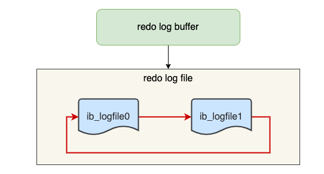

随着系统运行，Buffer Pool 的脏页刷新到了磁盘中，那么 redo log 对应的记录也就没用了，这时候我们擦除这些旧记录，以腾出空间记录新的更新操作。redo log 是循环写的方式，相当于一个环形，InnoDB 用 write pos 表示 redo log 当前记录写到的位置，用 checkpoint 表示当前要擦除的位置。

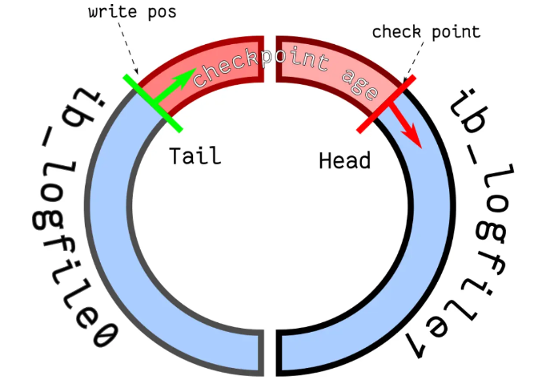

如果 write pos 追上了 checkpoint，就意味着 redo log 文件满了，这时 MySQL 不能再执行新的更新操作，也就是说 MySQL 会被阻塞（*因此所以针对并发量大的系统，适当设置 redo log 的文件大小非常重要*），此时会停下来将 Buffer Pool 中的脏页刷新到磁盘中，然后标记 redo log 哪些记录可以被擦除，接着对旧的 redo log 记录进行擦除，等擦除完旧记录腾出了空间，checkpoint 就会往后移动（图中顺时针），然后 MySQL 恢复正常运行，继续执行新的更新操作。

所以，一次 checkpoint 的过程就是脏页刷新到磁盘中变成干净页，然后标记 redo log 哪些记录可以被覆盖的过程。（注意，缓冲池本身的更新与脏页刷回磁盘没有关系，缓冲池的管理通常由数据库系统自身的算法（例如 LRU、MRU 等）负责，确保缓冲池中的数据是最常用的数据）

#### bin log的使用

MySQL 在完成一条更新操作后，Server 层还会生成一条 binlog，等之后事务提交的时候，会将该事物执行过程中产生的所有 binlog 统一写 入 binlog 文件。

binlog 文件是记录了所有数据库表结构变更和表数据修改的日志，不会记录查询类的操作，比如 SELECT 和 SHOW 操作。

##### bin log与redo log的作用区别

四个区别：

1.适用对象

- binlog 是 MySQL 的 Server 层实现的日志，所有存储引擎都可以使用；
- redo log 是 Innodb 存储引擎实现的日志；

2.文件格式不同

- binlog 有 3 种格式类型，分别是STATEMENT（默认格式）、ROW、 MIXED
- redo log 是物理日志，记录的是在某个数据页做了什么修改

3.写入方式不同：

- binlog 是追加写，写满一个文件，就创建一个新的文件继续写，不会覆盖以前的日志，保存的是全量的日志
- redo log 是循环写，日志空间大小是固定，全部写满就从头开始，保存未被刷入磁盘的脏页日志

4.用途不同：

- binlog 用于备份恢复、主从复制
- redo log 用于掉电等故障恢复

##### bin log的三种格式

STATEMENT（默认格式）：每一条修改数据的 SQL 都会被记录到 binlog 中（相当于记录了逻辑操作，所以针对这种格式， binlog 可以称为逻辑日志），主从复制中 slave 端再根据 SQL 语句重现。但 STATEMENT 有动态函数的问题，比如你用了 uuid 或者 now 这些函数，你在主库上执行的结果并不是你在从库执行的结果，这种随时在变的函数会导致复制的数据不一致。

ROW：记录行数据最终被修改成什么样了（这种格式的日志，就不能称为逻辑日志了），不会出现 STATEMENT 下动态函数的问题。但 ROW 的缺点是每行数据的变化结果都会被记录，比如执行批量 update 语句，更新多少行数据就会产生多少条记录，使 binlog 文件过大，而在 STATEMENT 格式下只会记录一个 update 语句而已；

MIXED：包含了 STATEMENT 和 ROW 模式，它会根据不同的情况自动使用 ROW 模式和 STATEMENT 模式；

##### 主从复制的实现

MySQL 的主从复制依赖于 binlog ，也就是记录 MySQL 上的所有变化并以二进制形式保存在磁盘上。复制的过程就是将 binlog 中的数据从主库传输到从库上。

这个过程一般是**异步**的，也就是主库上执行事务操作的线程不会等待复制 binlog 的线程同步完成。

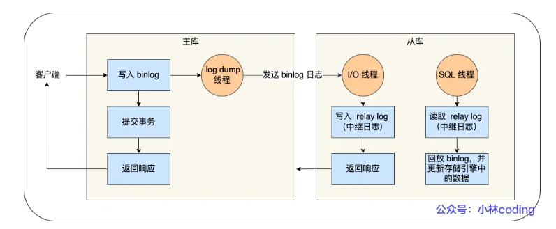

MySQL集群的主从复制过程主要分为三个阶段：

- 写入 Binlog：主库写 binlog 日志，提交事务，并更新本地存储数据。
- 同步 Binlog：把 binlog 复制到所有从库上，每个从库把 binlog 写到暂存日志中。
- 回放 Binlog：回放 binlog，并更新存储引擎中的数据。

具体来说，主库在客户端提交事务的请求之后，会先写入 binlog，再提交事务；从库会创建一个专门的 I/O 线程，连接主库的 log dump 线程，来接收主库的 binlog 日志，再把 binlog 信息写入 relay log 的中继日志里；从库会创建一个用于回放 binlog 的线程，去读 relay log 中继日志，然后回放 binlog 更新存储引擎中的数据，最终实现主从的数据一致性

**从库的数量不是越多越好**，因为从库数量增加，从库连接上来的 I/O 线程也比较多，主库也要创建同样多的 log dump 线程来处理复制的请求，对主库资源消耗比较高，同时还受限于主库的网络带宽。所以在实际使用中，一个主库一般跟 2～3 个从库（1 套数据库，1 主 2 从 1 备主），这就是一主多从的 MySQL 集群结构。

##### MySQL主从复制模型

- **同步复制**：MySQL 主库提交事务的线程要等待所有从库的复制成功响应，才返回客户端结果。这种方式在实际项目中，基本上没法用，原因有两个：一是性能很差，因为要复制到所有节点才返回响应；二是可用性也很差，主库和所有从库任何一个数据库出问题，都会影响业务。
- **异步复制**（默认模型）：MySQL 主库提交事务的线程并不会等待 binlog 同步到各从库，就返回客户端结果。这种模式一旦主库宕机，数据就会发生丢失。
- **半同步复制**：MySQL 5.7 版本之后增加的一种复制方式，介于两者之间，事务线程不用等待所有的从库复制成功响应，只要一部分复制成功响应回来就行，比如一主二从的集群，只要数据成功复制到任意一个从库上，主库的事务线程就可以返回给客户端。这种半同步复制的方式，兼顾了异步复制和同步复制的优点，即使出现主库宕机，至少还有一个从库有最新的数据，不存在数据丢失的风险。

##### bin log的刷盘时机

事务执行过程中，先把日志写到 binlog cache（Server 层的 cache），事务提交的时候，再把 binlog cache 写到 binlog 文件中。

一个事务的 binlog 是不能被拆开的，因此无论这个事务有多大（比如有很多条语句），也要保证一次性写入。这是因为有一个线程只能同时有一个事务在执行的设定，所以每当执行一个 begin/start transaction 的时候，就会默认提交上一个事务，这样如果一个事务的 binlog 被拆开的时候，在备库执行就会被当做多个事务分段自行，这样破坏了原子性，是有问题的。MySQL 给每个线程分配了一片内存用于缓冲 binlog ，该内存叫 binlog cache，参数 binlog_cache_size 用于控制单个线程内 binlog cache 所占内存的大小。如果超过了这个参数规定的大小，就要暂存到磁盘。

在事务提交的时候，执行器把 binlog cache 里的完整事务写入到 binlog 文件中，并清空 binlog cache。虽然每个线程有自己 binlog cache，但是最终都写到同一个 binlog 文件。

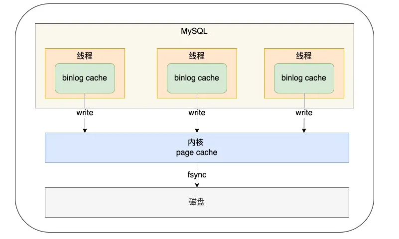

MySQL提供一个 sync_binlog 参数来控制数据库的 binlog 刷到磁盘上的频率：

- sync_binlog = 0 的时候，表示每次提交事务都只 write，不 fsync，后续交由操作系统决定何时将数据持久化到磁盘；
- sync_binlog = 1 的时候，表示每次提交事务都会 write，然后马上执行 fsync；
- sync_binlog =N(N>1) 的时候，表示每次提交事务都 write，但累积 N 个事务后才 fsync。

#### 两阶段提交

事务提交后，bin log和redo log都要持久化磁盘，但这两个是独立的逻辑。为了避免出现半成功的状态（例如redo log和bin log的一方刷入磁盘，而另一方没来得及写入），使用了两阶段提交来解决。其中一方没写入，都会导致主从不一致。

两阶段提交把单个事务的提交拆分成了 2 个阶段，分别是「准备（Prepare）阶段」和「提交（Commit）阶段」，每个阶段都由协调者（Coordinator）和参与者（Participant）共同完成。

在 MySQL 的 InnoDB 存储引擎中，开启 binlog 的情况下，MySQL 会同时维护 binlog 日志与 InnoDB 的 redo log，为了保证这两个日志的一致性，MySQL 使用了内部 XA 事务，内部 XA 事务由 binlog 作为协调者，存储引擎是参与者。

当客户端执行 commit 语句或者在自动提交的情况下，MySQL 内部开启一个 XA 事务，分两阶段来完成 XA 事务的提交：

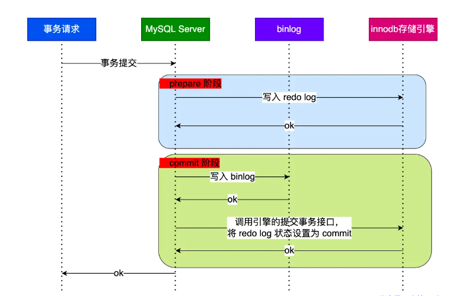

 redo log 的写入拆成了两个步骤：prepare 和 commit，中间再穿插写入binlog，具体如下：

- **prepare 阶段**：将 XID（内部 XA 事务的 ID） 写入到 redo log，同时将 redo log 对应的事务状态设置为 prepare，然后将 redo log 持久化到磁盘（innodb_flush_log_at_trx_commit = 1 的作用）；
- **commit 阶段**：把 XID 写入到 binlog，然后将 binlog 持久化到磁盘（sync_binlog = 1 的作用），接着调用引擎的提交事务接口，将 redo log 状态设置为 commit，此时该状态并不需要持久化到磁盘，只需要 write 到文件系统的 page cache 中就够了，因为只要 binlog 写磁盘成功，就算 redo log 的状态还是 prepare 也没有关系，一样会被认为事务已经执行成功；

##### 异常重启在两阶段提交下的情况

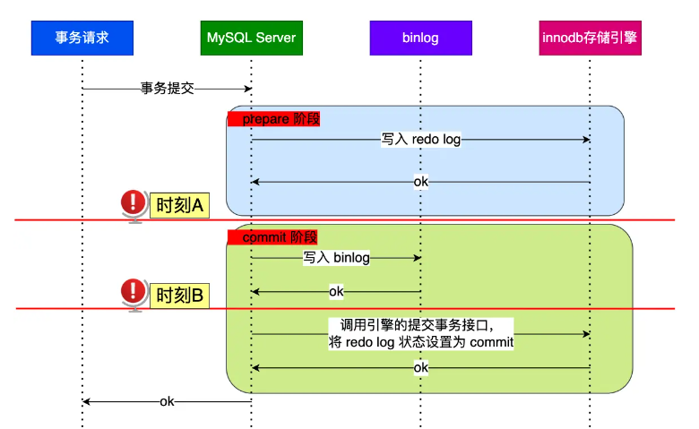

对于A，B而言，此时的redo log都已经完成。而A时的bin log下并没有当前内部XA事务的XID，说明bin log还没有完成刷盘，或回滚。而B就不会。

对于处于 prepare 阶段的 redo log，即可以提交事务，也可以回滚事务，这取决于是否能在 binlog 中查找到与 redo log 相同的 XID，如果有就提交事务，如果没有就回滚事务。这样就可以保证 redo log 和 binlog 这两份日志的一致性了。所以说，两阶段提交是以 binlog 写成功为事务提交成功的标识，因为 binlog 写成功了，就意味着能在 binlog 中查找到与 redo log 相同的 XID。

##### 事务没提交的时候，redo log也会持久化到磁盘么

事务执行中间过程的 redo log 也是直接写在 redo log buffer 中的，这些缓存在 redo log buffer 里的 redo log 也会被「后台线程」每隔一秒一起持久化到磁盘。因此与事务是否提交无关。redo log 可以在事务没提交之前持久化到磁盘，但是 binlog 必须在事务提交之后，才可以持久化到磁盘。

##### 两阶段提交的问题

两阶段提交虽然保证了两个日志文件的数据一致性，但是性能很差，主要有两个方面的影响：

- **磁盘 I/O 次数高**：对于“双1”配置（指的是为了避免日志丢失，每次事务提交都会将buffer或cache里的数据直接持久化到磁盘），每个事务提交都会进行两次 fsync（刷盘），一次是 redo log 刷盘，另一次是 binlog 刷盘。
- **锁竞争激烈**：两阶段提交虽然能够保证「单事务」两个日志的内容一致，但在「多事务」的情况下，却不能保证两者的提交顺序一致，因此，在两阶段提交的流程基础上，还需要加一个锁来保证提交的原子性，从而保证多事务的情况下，两个日志的提交顺序一致。

##### 组提交

针对两阶段提交的问题，MySQL 引入了 binlog 组提交（group commit）机制，当有多个事务提交的时候，会将多个 binlog 刷盘操作合并成一个，从而减少磁盘 I/O 的次数，如果说 10 个事务依次排队刷盘的时间成本是 10，那么将这 10 个事务一次性一起刷盘的时间成本则近似于 1。

引入了组提交机制后，prepare 阶段不变，只针对 commit 阶段，将 commit 阶段拆分为三个过程：

- **flush 阶段**：多个事务按进入的顺序将 binlog 从 cache 写入文件（不刷盘）
- **sync 阶段**：对 binlog 文件做 fsync 操作（多个事务的 binlog 合并一次刷盘）；
- **commit 阶段**：各个事务按顺序做 InnoDB commit 操作；

上面的每个阶段都有一个队列，每个阶段有锁进行保护，因此保证了事务写入的顺序，第一个进入队列的事务会成为 leader，leader领导所在队列的所有事务，全权负责整队的操作，完成后通知队内其他事务操作结束。对每个阶段引入了队列后，锁就只针对每个队列进行保护，不再锁住提交事务的整个过程，可以看的出来，锁粒度减小了，这样就使得多个阶段可以并发执行，从而提升效率。

bin log组提交和redo log组提交都是存在的，redo log组提交在prepare操作中。

### mysql的磁盘IO优化

事务在提交的时候，需要将 binlog 和 redo log 持久化到磁盘，那么如果出现 MySQL 磁盘 I/O 很高的现象，我们可以通过控制以下参数，来 “延迟” binlog 和 redo log 刷盘的时机，从而降低磁盘 I/O 的频率：

- 设置组提交的两个参数， binlog_group_commit_sync_delay 和 binlog_group_commit_sync_no_delay_count 参数，延迟 binlog 刷盘的时机，从而减少 binlog 的刷盘次数。只要系统没有宕机，缓存在 page cache 里的 binlog 就会被持久化到磁盘。
- 将 sync_binlog 设置为大于 1 的值（比较常见是 100~1000），表示每次提交事务都 write，但累积 N 个事务后才 fsync，相当于延迟了 binlog 刷盘的时机。但是这样做的风险是，主机掉电时会丢 N 个事务的 binlog 日志。
- 将 innodb_flush_log_at_trx_commit 设置为 2。表示每次事务提交时，都只是缓存在 redo log buffer 里的 redo log 写到 redo log 文件，注意写入到「 redo log 文件」并不意味着写入到了磁盘，因为操作系统的文件系统中有个 Page Cache，专门用来缓存文件数据的，所以写入「 redo log文件」意味着写入到了操作系统的文件缓存，然后交由操作系统控制持久化到磁盘的时机。但是这样做的风险是，主机掉电的时候会丢数据。


## mysql Buffer Pool

### Buffer Pool基础

实现了数据从磁盘取出后，缓存在内存中，下次查询同样数据的时候直接在内存中读取。

有了缓冲池后：

- 当读取数据时，如果数据存在于 Buffer Pool 中，客户端就会直接读取 Buffer Pool 中的数据，否则再去磁盘中读取
- 当修改数据时，首先是修改 Buffer Pool 中数据所在的页，然后将其页设置为脏页，最后由后台线程将脏页写入到磁盘

默认配置下 Buffer Pool 只有 `128MB`。可以通过调整 `innodb_buffer_pool_size` 参数来设置 Buffer Pool 的大小，一般建议设置成可用物理内存的 60%~80%。

Buffer Pool 中的页就叫做缓存页（与存储页大小上没有差别，都是16KB）。此时这些缓存页都是空闲的，之后随着程序的运行，才会有磁盘上的页被缓存到 Buffer Pool 中。

为了更好的管理这些在 Buffer Pool 中的缓存页，InnoDB 为每一个缓存页都创建了一个**控制块**，控制块信息包括「缓存页的表空间、页号、缓存页地址、链表节点」等等。控制块也是占有内存空间的，它是放在 Buffer Pool 的最前面，接着才是缓存页

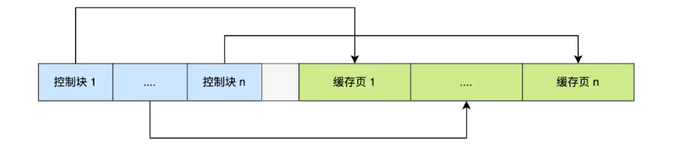

控制块和缓存页之间灰色部分称为碎片空间。往往出现在不够一对控制块和缓存页的大小时。

注意，即便查询的是一条记录，InnoDB 还是会把整个页的数据加载到 Buffer Pool 中。

### 如何管理Buffer Pool

为了能够快速找到空闲的缓存页，可以使用链表结构，将空闲缓存页的「控制块」作为链表的节点，这个链表称为 **Free 链表**（空闲链表），它是一个双向链表。

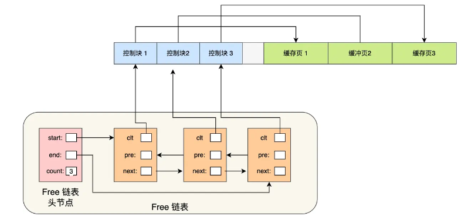

Free 链表上除了有控制块，还有一个头节点，该头节点包含链表的头节点地址，尾节点地址，以及当前链表中节点的数量等信息。Free 链表节点是一个一个的控制块，而每个控制块包含着对应缓存页的地址，所以相当于 Free 链表节点都对应一个空闲的缓存页。

有了 Free 链表后，每当需要从磁盘中加载一个页到 Buffer Pool 中时，就从 Free链表中取一个空闲的缓存页，并且把该缓存页对应的控制块的信息填上，然后把该缓存页对应的控制块从 Free 链表中移除。

### 如何管理脏页

更新数据的时候，不需要每次都要写入磁盘，而是将 Buffer Pool 对应的缓存页标记为**脏页**，然后再由后台线程将脏页写入到磁盘。那为了能快速知道哪些缓存页是脏的，于是就设计出 **Flush 链表**，它跟 Free 链表类似的，链表的节点也是控制块，区别在于 Flush 链表的元素都是脏页。

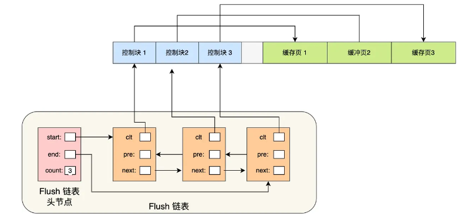

### 脏页什么时候会被刷入磁盘

InnoDB 的更新操作采用的是 Write Ahead Log 策略，即先写日志，再写入磁盘，通过 redo log 日志让 MySQL 拥有了崩溃恢复能力，因此即便脏页在MySQL 宕机前没有刷入磁盘，还是不会丢失数据的。（一致性）

脏页的刷新被触发的情况：

- 当 redo log 日志满了的情况下，会主动触发脏页刷新到磁盘；
- Buffer Pool 空间不足时，需要将一部分数据页淘汰掉，如果淘汰的是脏页，需要先将脏页同步到磁盘；
- MySQL 认为空闲时，后台线程会定期将适量的脏页刷入到磁盘；
- MySQL 正常关闭之前，会把所有的脏页刷入到磁盘；

MySQL的“抖动”现象，即发现「偶尔」会出现一些用时稍长的 SQL，表明脏页在刷新到磁盘时给数据库带来性能开销，导致数据库操作抖动。果间断出现这种现象，就需要调大 Buffer Pool 空间或 redo log 日志的大小。

### 缓存命中率如何提高

LRU（最近最少使用）算法：

链表头部的节点是最近使用的，而链表末尾的节点是最久没被使用的。那么，当空间不够了，就淘汰最久没被使用的节点，从而腾出空间。它的思路具体如下：

- 当访问的页在 Buffer Pool 里，就直接把该页对应的 LRU 链表节点移动到链表的头部。
- 当访问的页不在 Buffer Pool 里，除了要把页放入到 LRU 链表的头部，还要淘汰 LRU 链表末尾的节点。

这种算法无法避免两个很大的问题：预读失效，Buffer Pool污染

- 预读失效：MySQL 在加载数据页时，会提前把它相邻的数据页一并加载进来，目的是为了减少磁盘 IO，这叫“预读”。但如果使用简单的 LRU 算法，就会把预读页放到 LRU 链表头部，而当 Buffer Pool空间不够的时候，还需要把末尾的页淘汰掉。如果这些预读页如果一直不会被访问到，就会出现一个很奇怪的问题，不会被访问的预读页却占用了 LRU 链表前排的位置，而末尾淘汰的页，可能是频繁访问的页，这样就大大降低了缓存命中率。
- Buffer Pool污染：当某一个 SQL 语句扫描了大量的数据时，在 Buffer Pool 空间比较有限的情况下，可能会将 Buffer Pool 里的所有页都替换出去，导致大量热数据被淘汰了，等这些热数据又被再次访问的时候，由于缓存未命中，就会产生大量的磁盘 IO，MySQL 性能就会急剧下降，这个过程被称为 Buffer Pool 污染。

LRU的优化算法：

要避免预读失效带来影响，最好就是**让预读的页停留在 Buffer Pool 里的时间要尽可能的短**，让真正被访问的页才移动到 LRU 链表的头部，从而保证真正被读取的热数据留在 Buffer Pool 里的时间尽可能长。

MySQL改进了 LRU 算法，将 LRU 划分了 2 个区域：**old 区域 和 young 区域**。old 区域占整个 LRU 链表长度的比例可以通过 `innodb_old_blocks_pct` 参数来设置，默认是 37，代表整个 LRU 链表中 young 区域与 old 区域比例是 63:37。

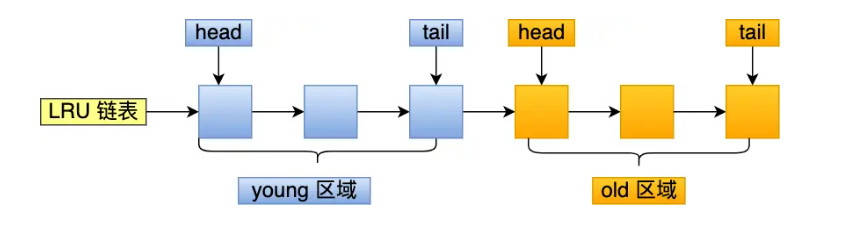

划分这两个区域后，预读的页就只需要加入到 old 区域的头部，当页被真正访问的时候，才将页插入 young 区域的头部。如果预读的页一直没有被访问，就会从 old 区域移除，这样就不会影响 young 区域中的热点数据。

要避免Buffer Pool污染的问题，需要提高进入young区域的门槛，避免热数据被替换。因此，进入到 young 区域条件增加了一个停留在 old 区域的时间判断。在对某个处在 old 区域的缓存页进行第一次访问时，就在它对应的控制块中记录下来这个访问时间：

**只有同时满足「被访问」与「在 old 区域停留时间超过一定时间」两个条件，才会被插入到 young 区域头部**，这样就解决了 Buffer Pool 污染的问题 。

这个间隔时间是由 `innodb_old_blocks_time` 控制的，默认是 1000 ms（1s）。

另外，MySQL 针对 young 区域其实做了一个优化，为了防止 young 区域节点频繁移动到头部。young 区域前面 1/4 被访问不会移动到链表头部，只有后面的 3/4被访问了才会。


## mysql查询优化

1.条件化简

2.移除不必要的括号

3.常量传递

4.移除没用的条件：例如一定为true或false

5.表达式计算：

​	（1）表达式只包含常量的话，值会被计算出来

​	（2）如果某个列在函数中或者以运算形式出现，优化器不会进⾏化简

6.having和where⼦句的合并：

​	（1）查询语句中没有sum、max这样的聚集函数以及group⼦句的话，优化器会将having和where⼦句合并

​	（2）having⼦句⽤于分组后过滤，where⽤于分组前合并

7.常量表检测：

​	（1）使⽤主键等值匹配、使⽤唯⼀⼆级索引列等值匹配进⾏查询的表称为常量表

​	（2）优化器会优先执⾏常量表查询，因为速度⾮常快

8.外连接消除

9.优化器会将右连接转化为左连接

10.空值拒绝：

​	（1）在外连接查询中，指定的where⼦句中包含被驱动表的列不为null值的条件（就是不允许查出来的记录中含有null值）

​	（2）被驱动表的where⼦句符合空值拒绝的条件后，外连接和内连接可以相互转换

11.子查询优化


## mysql子查询

在⼀个查询语句中的某个位置可以出现另⼀个查询语句，这另⼀个查询就叫⼦查询

（1）按出现位置分类

```sql
#在select子句中
select (select m1 from t1 limit 1);
#在from子句中，将这种⼦查询的结果当做⼀个表，在from⼦句中的⼦查询称为派⽣表
select m, n from (select ...);
#在where或on子句中
select * from t1 where m1 in (select ...);
```

（2）按返回的结果集分类

```sql
#标量子查询，只返回一个单一值
select (select m1 from t1 limit 1);
#行子查询，返回一条记录，需要包含多个列，使⽤limit 1保证⼦查询的结果只有⼀条记录
select * from t1 where (m1, n1) = (select m2, n2 from t2 limit 1);
#列子查询，返回⼀个列的数据，可能包含多条纪录
select * from t1 where m1 in (select m2 from t2);
#表子查询，⼦查询的结果既有多条纪录，又有多个列
select * from t1 where (m1, n1) = (select m2, n2 from t2);
```

（3）按外层查询关系分类

```sql
#不相关⼦查询,⼦查询可以单独运⾏出结果，不依赖于外层查询的值

#相关子查询，子查询的执行需要依赖外部查询的值
select * from t1 where m1 in (select m2 from t2 where n1 = n2);
```


## mysql高性能

### mysql主从复制

数据可以从⼀个MySQL数据库服务器主节点复制到⼀个或者多个从节点。 

MySQL默认采⽤异步复制⽅式，这样从节点就不⽤⼀直访问主服务器来更新最新数据。 

从节点可以复制主节点数据库中的所有数据库、特定的数据库或者特定的表。

用途：

​	1.数据实时备份

​	当系统中某个节点发⽣故障时，可以⽅便故障切换

​	2.读写分离

​	在开发过程中，如果遇到某个sql语句需要锁表，导致暂时不能使⽤读的服务

​	使⽤主从复制，让主数据库负责写，从数据库负责读，即使主库出现锁表的情景，也可以通过从库正常读数据

​	3.架构扩展

​	随着系统中业务访问量的增加，如果是单机部署数据，会导致I/O访问频率过⾼

​	通过主从复制，增加多个数据存储结点，将负载分布在多个从节点上，降低单机的I/O访问频率，提⾼单机的I/O性能

原理：

mysql主从复制涉及到三个线程，一个运行在主节点（binary log dump thread），两个运行在从节点（I/O thread、SQL thread）

binary log dump thread：

​	当从节点连接主节点的时候，主节点创建该线程，⽤于发送bin-log内容

I/O thread：

​	当从节点执⾏“start slave”命令之后，从节点会创建⼀个I/O线程⽤来连接主节点，请求其中的数据。I/O线程接收到主节点binlog dump的更新数据之后，保存在本地的relay log中 

SQL thread：

​	该线程负责读取relay log中的内容，解析或具体的操作并执⾏，最终保证主从数据的⼀致性

基本过程：

1.从节点I/O进程连接主节点

请求指定⽇志⽂件的指定位置后⾯的内容 

2.主节点接收到请求之后

通过负责复制的I/O进程根据请求的信息读取指定的⽇志位置之后的⽇志信息，返回给从节点。返回信息中除了⽇ 志所包含的指定⽇志信息还包含了本次返回信息的 bin-log file 以及 bin-log position

3.从节点的I/O线程接收到内容之后

将接收到的⽇志内容更新到本机的 relay log 中，并且把读取到的 binary log ⽂件名和位置保存到 master-info ⽂件 中，⽅便下⼀次告知 master 从节点需要更新的位置

4.Slave 的 SQL 线程检测到 relay-log 中新增了内容

将 relay-log 的内容解析成在主节点上实际执⾏的操作，并在数据库中执⾏

主从复制模式：

1.异步模式

​	主服务器将更新操作写入自己的日志文件，而从服务器则异步地从主服务器的日志文件读取并应用这些更新。

​	异步模式下，主服务器不等待从服务器的响应，而是继续处理其他请求。这意味着主从服务器之间的数据可能存在一定程度的延迟。

2.半同步模式

​	主服务器在将更新写入自己的日志文件后，等待至少一个从服务器接收并确认接收了这个更新，然后主服务器才继续。

​	半同步模式相对于异步模式来说，提高了数据一致性，因为主服务器会等待至少一个从服务器确认接收更新。

3.全同步模式

​	主服务器在将更新写入自己的日志文件后，等待所有的从服务器都接收并确认接收了这个更新，然后主服务器才继续。

​	全同步模式要求所有的从服务器都接收到更新，因此相对于半同步模式来说，提高了更高的数据一致性，但也增加了延迟。

4.GTID复制模式

​	GTID是MySQL 5.6及以上版本引入的一项特性，用于跟踪和标识复制中的事务。GTID复制模式使用全局唯一的标识符来标记每个事务，使得复制更加可靠和容错。

​	GTID模式简化了复制配置，更容易管理和维护。它还提供了在复制中进行故障切换时更容易恢复的好处。

### 分库分表

原因：

​	1.单库太大，单个数据库处理能⼒有限，所在的服务器上的磁盘空间也有限，单库存在I/O操作瓶颈。 因此需要切分成更多更⼩的库

​	2.单表太大，索引膨胀，查询超时。因此需要切分成多个数据集更小的表

拆分方案：

1.垂直拆分

​	（1）垂直分表

​	“⼤表拆⼩表“，基于列的字段进⾏

​	⼀般表中字段较多，将不常⽤的，数据较⼤的，长度较长的，拆分到“扩展表” 

​	（2）垂直分库

​	针对⼀个系统中不同业务进⾏拆分，拆分之后放到多个服务器上  

2.水平拆分

​	（1）水平分表

​	针对数据量巨⼤的单张表（⽐如订单），按照某种规则（RANGE，HASH取模），切分到多张表中，这些表还在 ⼀个数据库中

​	（2）水平分库

​	将单张表的数据切分到多个服务器上，每个服务器都有相应的库和表，只是表中的数据集合不同

​	⽔平分库能够有效的缓解单机和单库的性能瓶颈，I/O，连接数和硬件资源等瓶颈

​	⽔平分库分表切分规则：

​		1.range： 根据范围，⽐如0-1000⼀个表，1001到2000⼀个表

​		2.hash取模： ⽐如取ID，进⾏hash取模，根据模数分配到不同的数据库中

​		3.地理区域/时间范围： 按照地理范围/时间进⾏划分


## MySQL常见问题

### 幻读与锁

1.什么是幻读

幻读是指在同⼀个事务中，存在前后两次查询同⼀个范围的数据，但是第⼆次查询却看到了第⼀次查询没看到的⾏

出现的场景是：a.事务的隔离级别为可重复读，且是当前读。  b.幻读仅专指新插⼊的⾏

2.幻读带来的问题

对⾏锁语义的破坏，破坏了数据的一致性

3.如何避免幻读

存储引擎采⽤加间隙锁的⽅式来避免出现幻读

4.为啥会出现幻读

⾏锁只能锁定存在的⾏，针对新插⼊的操作没有限定

5.什么是间隙锁？间隙锁如何避免幻读？它引入了什么新的问题

间隙锁是专门⽤于解决幻读这种问题的锁，它锁的了⾏与⾏之间的间隙，能够阻塞新插⼊的操作

间隙锁的引⼊也带来了⼀些新的问题，⽐如：降低并发度，可能导致死锁

间隙锁之间是不冲突的，间隙锁会阻塞插⼊操作。另外，间隙锁在可重复读级别下才是有效的

⾏锁和间隙锁合称 next-key lock，这个锁是左开右闭的区间。

MySQL 为了解决幻读问题，在线程更新数据并 next-key lock 的过程中，⾸先必须在可重复读的隔离级别下，执⾏以下的原则和优化：

​	原则：1.加锁的基本单位是 next-key lock，next-key lock 是前开后闭区间

​		  2.查找过程中访问到的对象才会加锁

​	优化：1.索引上的等值查询，给唯⼀索引加锁的时候，next-key lock 退化为⾏锁，如果不存在这个索引，退化为间隙锁

​		   2.索引上的等值查询，向右遍历时且最后⼀个值不满⾜等值条件的时候，next-key lock 退化为间隙锁

⾮唯⼀索引的范围查询：范围查询都会访问到不满⾜条件的第⼀个值，并且不会执⾏上述的两个优化。唯⼀索引的范围查询仍旧会执⾏上述的优化

delete 语句的和查询的加锁⽅式相同

limit 语句，遍历到满⾜条件的 n 条数据后，之后不再加 next-key lock

如果两个都给同⼀个间隙上锁，之后两个线程都没办法在这个间隙上更新数据了，都会陷⼊等待另⼀个线程的间隙锁释放，也就是死锁

如果使⽤读提交隔离级别，那么只加⾏锁，不加间隙锁，语句执⾏过程中加上的⾏锁，在语句执⾏完成后，就要把 “不满⾜条件的⾏”上的⾏锁直接释放了，不需要等到事务提交才释放


### 事务相关

1.for update的使用场景

for update会进行数据加锁，防止高并发的情况下数据出错，即使事务保持当前读的状态。

for update仅适用于InnoDB，且必须在事务块(BEGIN/COMMIT)中才能生效。在进行事务操作时，通过“for update”语句，MySQL会对查询结果集中每行数据都添加排他锁，其他线程对该记录的更新与删除操作都会阻塞。排他锁包含行锁、表锁。

2.事务隔离

innodb支持RC和RR隔离级别的实现用的是一致性视图

事务在启动时会拍⼀个快照,这个快照是基于整个库的。基于整个库的意思就是说⼀个事务内,整个库的修改对于该事务都是不可见的(对于快照读的情况)

如果在事务内 select 表,另外的事务执⾏了DDL（数据定义语言操作，包括表的创建和删除，修改表结构等）表,根据发⽣时间,只有两种情况：报错或者锁住

3.事务如何实行多版本并发控制（MVCC）

每个事务都有一个事务ID，叫做transaction id(严格递增) 

事务在启动时,找到已提交的最⼤事务ID记为up_limit_id

事务在更新⼀条语句时，首先，（更新前）会将原始数据写到 undo log （记录事务修改之前数据的机制，以便在回滚或撤销操作时使用）⾥；然后再对数据页进行相应更改；更新后，数据库会在被修改的记录的行头（record header）中记录执行该修改的事务的ID。这是为了跟踪记录的修改历史，以便实现并发控制和事务隔离。

一个事务要查看⼀条数据时,必须先⽤该事务的 up_limit_id（事务的上界ID） 与该⾏的transaction id 做⽐对：

​	如果 up_limit_id >= transaction id,那么可以看

​	如果 up_limit_id < transaction id,则只能去 undo log ⾥去取

去 undo log 查找数据的时候,也需要做⽐对,必须 up_limit_id > transaction id，才返回数据

如果 up_limit_id <= transaction id，则可能表示该数据已经是事务能够查看的最新版本，无法从undo log中进行恢复

4.什么是当前读

由于当前读都是先读后写,只能读当前的值,所以为当前读会更新事务内的 up_limit_id 为该事务的 transaction

5.为什么 rr 能实现可重复读⽽ rc 不能

分两种情况：

​	1.快照读的情况下，rr不能更新事务内的 up_limit_id ,⽽ rc 每次会把 up_limit_id 更新为快照读之前最新已提交事务的 transaction id,则 rc 不能可重复读 

​	2.当前读的情况下，rr 是利⽤ record lock+gap lock来实现的,⽽ rc 没有 gap,所以 rc 不能可重复读

6.普通索引和唯一索引的区别

对于查询过程来说：

​	普通索引查到满⾜条件的第⼀个记录后，继续查找下⼀个记录，直到第⼀个不满⾜条件的记录

​	由于索引唯⼀性，查到第⼀个满⾜条件的记录后，停⽌检索  但是，两者的性能差距微乎其微。因为InnoDB根据数据页来读写的。

对于更新过程来说：

​	唯一索引不能使用change buffer，而它对性能提升非常明显，因此更优先使用普通索引

change buffer：

​	当需要更新一个数据页时，如果数据页在内存中就直接更新；如果不在内存中，在不影响数据⼀致性的前提下，InnoDB 会将这些更新操作缓存在change buffer 中

​	下次查询需要访问这个数据页的时候，将数据页读⼊内存，然后执⾏ change buffer 中的与这个页有关的操作

​	change buffer 是可以持久化的数据。在内存中有拷贝，也会被写⼊到磁盘上

​	change buffer 因为减少了随机磁盘访问，所以对更新性能的提升很明显

​	将 change buffer 中的操作应⽤到原数据页上，得到最新结果的过程，称为 purge。访问这个数据页会触发 purge，系统有后台线程定期 purge，在数据库正常关闭的过程中，也会执⾏ purge。

​	在⼀个数据页做purge之前，change buffer记录的变更越多，收益就越⼤。对于写多读少的业务来说，页⾯在写完以后马上被访问到的概率⽐较⼩，此时change buffer的使⽤效果最好。这种 业务模型常见的就是账单类、⽇志类的系统。相反，对于写少读多的业务来说，随机访问IO的次数不会减少，反⽽增加了change buffer的维护代价。

​	redo log（记录已经执行的修改操作，undo log记录的是事务回滚前的数据版本）主要节省的是随机写磁盘的IO消耗(将事务的修改操作以顺序写的方式记录到 Redo Log 中，最小化对磁盘的随机写入)，⽽change buffer主要节省的则是随机读磁盘的IO消耗。


### 数据库记录相关

1.char和varchar的区别

char是固定长度类型，即便存入的字符大小比声明的大小小，实际占据的大小仍然为声明的大小。

varchar则可变，变长字段所占用的字节数被单独放在变长字段列表中，并且按照表的顺序逆序存放，因此仍然需要额外的存储。

2.mysql抖一下是什么情况

偶尔慢一下，此时mysql的运行不稳定，需要花费更多的资需源处理别的事情，会使SQL语句的执⾏效率明显变慢

InnoDB内mysql抖的原因是InnoDB 会在后台刷脏页，⽽刷脏页的过程是要将内存页写⼊磁盘。在这种情况下，刷脏页的逻辑会占⽤ IO 资源并可能影响到了更新语句，导致突然慢一下

mysql突然变慢导致的性能下降对业务是很不友好的

让mysql不抖的核心在两点：

​	1.设置合理参数配配置，尤其是设置好innodb_io_capacity 的值（代表系统的期望 I/O 能力。这个值是一个正整数，单位是 I/O 操作每秒（IOPS）。通过设置这个参数，你可以告诉 InnoDB 引擎系统的磁盘性能水平，以便在执行各种操作时更好地调整其行为）

​	2.多关注脏页⽐例，不要让它经常接近 75%（优化查询和事务，调整事务大小，适当调整缓冲池大小，使用合理的刷新策略，增加磁盘性能）

3.脏页/干净页是什么

脏页：当内存数据页跟磁盘数据页内容不⼀致的时候，我们称这个内存页为“脏页”

干净页：内存数据写⼊到磁盘后，内存和磁盘上的数据页的内容就⼀致了，称为“⼲净页”

4.为什么会产生脏页

因为使⽤了WAL技术，这个技术会把数据库的随机写转化为顺序写，但副作⽤就是会产⽣脏页。

Write-Ahead Logging 是一种事务处理的机制，它要求在修改数据库内容之前，先将修改的操作记录到一个称为日志（WAL日志）的地方。

WAL 日志是一个顺序写的日志文件，其中记录了事务对数据库的修改操作。在事务提交前，WAL 日志中的记录已经写入磁盘，表示该事务的修改操作已经持久化。

当使用 WAL 技术时，事务的修改操作首先被写入 WAL 日志，这个过程是顺序写入的，因为 WAL 是一个追加写入的顺序文件。这意味着，即使实际数据库的数据页是通过随机写进行修改，WAL 日志的写入是按照顺序进行的。这有助于减少磁盘寻址的开销，提高写入性能。

5.随机写/顺序写

随机写指的是数据在存储介质上的写入位置不是连续的，而是分散在不同的位置。每次写入都可能导致磁头的移动到不同的磁道或扇区，因此需要进行随机寻址。在随机写的情况下，磁盘的读写头需要频繁地在不同的位置进行跳跃，导致更高的磁盘访问延迟。

顺序写指的是数据在存储介质上的写入位置是连续的，按照顺序进行。数据依次写入相邻的位置，使得磁头的移动是顺序的，无需频繁的寻址。顺序写通常具有更高的性能，因为它可以充分利用磁盘的带宽。顺序写减少了磁头的寻址成本，减小了磁盘读写的延迟。

写redo log是顺序写的，先写redo log等合适的时候再写磁盘，间接的将随机写变成了顺序写，性能确实会提⾼不 少。


### 数据库信息相关

1.当删除表的数据后，表文件的大小为什么不会有变化

因为delete 命令其实只是把记录的位置，或者数据页标记为了“可复⽤”，但磁盘⽂件的⼤⼩是不会变的。也可以认为是⼀种逻辑删除，所以物理空间没有实际释放，只是标记为可复⽤，表⽂件的⼤⼩不变

2.表的数据信息/结构信息存在哪里

数据信息：存储在共享表空间⾥，也可以单独存储在⼀个以.ibd为后缀的⽂件⾥。在使用文件管理时，使⽤ drop table 命令也能直接把对应的⽂件删除，如果存储在共享空间之中即使表删除了空间也不会释放

结构信息：存储在系统数据表中，主要⽤于存储MySQL的系统数据，⽐如：数据字典、undo log(默认)等⽂件

3.如何才能真正在表删除删除后，对应的表文件大小减小

```sql
# optimize(优化)等于 recreate+analyze，会重建一个新的，紧凑的表，有助于减少表碎片并提高性能 
optimize table t
# truncate（清空）等于 drop+create，会将原表中数据全部删除，但保留表的结构
truncate table t 
```

4.什么是空洞

空洞就是那些被标记可复⽤但是还没被使⽤的存储空间。

​	使⽤delete命令删除数据会产⽣空洞，标记为可复⽤。

​	插⼊新的数据可能引起页分裂，也可能产⽣空洞  

​	修改操作，有时⼀些先删后插的动作也可能产⽣空洞

5.count()计数相关

count使用的形式：

​	1.count(字段)，表示对某个特定字段（列）进行计数。它将计算该字段非空的行数，不包括字段值为 NULL 的行

​	2.count(主键id)，表示对主键 id 进行计数。主键 id 通常是一个唯一标识符，不应该包含 NULL 值。这个计数将统计表中主键列非空的行数

​	3.count(1)和count(*)，都表示计算所有行的数量，包括包含 NULL 值的行

每个存储引擎对count的实现不同，对于innodb来说，count() 是⼀个聚合函数，对于返回的结果集，⼀⾏⾏地判断，如果 count 函数的参数不是 NULL，累计值就加 1， 否则不加，最后返回累计值


### 数据库语句和存储相关

1.order by是怎样工作的

涉及到⽤户语句的排序，mysql 会给每个线程分配⼀块内存⽤于排序，也就是 sort_buffer。

```sql
select city,name,age from t where city='杭州' order by name limit 1000;
```

这条语句的执⾏逻辑是：

​	1.先初始化 sort_bufer

​	2.然后放⼊ city,name,age 字段，不断地由主键id索引到整⾏再到三个字段的值，匹配查找的值存⼊ sort_buff

​	3.然后按 name 排序，返回前 1000 个值

但是如果 sort_buffer_size 设置的太⼩，⽆法存放所有匹配的字段，排序就⽆法在内存中完成

如果要记录的字段太长，这样内存⾥能够同时放下的⾏数很少，要分成很多个临时⽂件，排序的性能会很差

这时会换⼀个算法，叫做rowid排序，顾名思义，就是对主键 id 以及排序字段进⾏存放，这样就节省了空间，但是 最后需要通过主键 id 去找到之前未取出的字段。对⽐全字段排序，rowid 排序多访问了⼀次表 t 的主键索引。（是否进行rowid排序是根据sort_buffer的大小决定的）

2.SQL语句性能差异巨大的原因

 	1.条件字段的函数操作，对索引字段对函数进程操作，可能会破坏索引值的有序性，因此优化器就决定放弃⾛树搜索功能，转⽽进⾏全表扫描，所以运⾏就变慢了

​	2.隐式类型转换，同样会额外调用函数（例如为了避免错误将字符串隐式转换为整数值），导致优化器放弃B+树搜索，转而使用全表搜索

​	3.隐式字符编码转换，如果执⾏两个表的联合查询，两个表通过外键进⾏联结，如果两个表使⽤的字符集不同，会对低⽔平的字符集执⾏升级转换函数，这时优化器也会转而使用全表搜索

总结：对索引字段做函数操作，可能会破坏索引值的有序性，因此优化器就决定放弃⾛树搜索功能

3.只查询一行语句也很慢的原因

从大到小分为三种情况

​	1.MySQL 数据库本⾝被堵住了，⽐如：系统或⽹络资源不够

​	2.SQL 语句被堵住了，⽐如：表锁，⾏锁等，导致存储引擎不执⾏对应的 SQL 语句

​	3.索引使⽤不当，没有⾛索引

​	4.是表中数据的特点导致的，⾛了索引，但由于⼀致性读，需要回滚多次才能读取出当前事务对应的值

4.临时表为什么可以重名

由于临时表是每个线程⾃⼰可见的，所以不需要考虑多个线程执⾏同⼀个处理逻辑时，临时表的重名问题。在线程 退出的时候，临时表也能⾃动删除，省去了收尾和异常处理的⼯作。

这⾥说到的临时表是⽤户临时表，⽽不是内存临时表

5.group-by使⽤原则

​	1.如果对 group by 语句的结果没有排序要求，要在语句后⾯加 order by null；

​	2.尽量让 group by 过程⽤上表的索引，确认⽅法是 explain 结果⾥没有 Using temporary 和 Using filesort；

​	3.如果 group by 需要统计的数据量不⼤，尽量只使⽤内存临时表；也可以通过适当调⼤ tmp_table_size 参数，来避免⽤到磁盘临时表；

​	4.如果数据量实在太⼤，使⽤ SQL_BIG_RESULT 这个提⽰，来告诉优化器直接使⽤排序算法得到 group by 的结果， 不要使⽤内存临时表。

6.一张表可以存储多少条信息

假设采⽤的是InnoDB引擎，本质上是在求⼀个 B+树 能够存储多少数据，根据 B+树 定义也就转变成了2个⼦问题

​	1.每个叶⼦结点存储能存储多少条记录

​		假设⼀条记录的⼤⼩为1kb，InnoDB中默认每页为16kb，则⼀个叶⼦节点可存储16条数据 

​	2.⼀共有多少个叶⼦结点 

​		根据B+树的形式，确定了该B+树为⼏阶的B+树，以及树的⾼度，就能确定叶⼦节点有最多有多少个

​		⾮叶⼦节点存储的数据为关键字+指针。关键字也就是我们常说的主键，如果为int类型则4字节，指针⼤⼩也假设为4字节，那么⼀个⾮叶⼦节点最多能够存储 16384（默认大小，单位为字节） / 8 = 2048 个，同时，每一个非叶子节点的指针对应一个叶子节点，最终的存储数量为2048 X 16 = 32768条记录（索引高度为两层）

7. 有⼀个联合索引(A,B,C),select * from test where a,c会不会使⽤索引？

不会，根据索引的创建过程，这棵 b+ 树的叶⼦节点的记录以及 ⼆级索引记录 是按照 abc 的规则来排序的，也就是 说，先按照 a的⼤⼩来排序，a 相等的情况下，再按照 b 的⼤⼩来排序，b 相等的话，最后再是 c 。这样的话，符合 where 条件的记录不⼀定相邻，查询效率并没有变高，还是得一条一条查。


# 数据库（Redis）

## Redis数据类型

### String

String 是最基本的 key-value 结构，key 是唯一标识，value 是具体的值，value不仅可以是字符串， 也可以是数字（整数或浮点数），value 最多可以容纳的数据长度是 `512M`。

String 类型的底层的数据结构实现主要是 int 和 SDS（简单动态字符串）。SDS与C的原生字符串相比：

- **SDS 不仅可以保存文本数据，还可以保存二进制数据**。因为 `SDS` 使用 `len` 属性的值而不是空字符来判断字符串是否结束，并且 SDS 的所有 API 都会以处理二进制的方式来处理 SDS 存放在 `buf[]` 数组里的数据
- **SDS 获取字符串长度的时间复杂度是 O(1)**。因为 C 语言的字符串并不记录自身长度，所以获取长度的复杂度为 O(n)；而 SDS 结构里用 `len` 属性记录了字符串长度，所以复杂度为 `O(1)`
- **Redis 的 SDS API 是安全的，拼接字符串不会造成缓冲区溢出**。因为 SDS 在拼接字符串之前会检查 SDS 空间是否满足要求，如果空间不够会自动扩容，所以不会导致缓冲区溢出的问题。

Redis 字符串的内部编码模式有三种：int，raw和embstr，后两者用来编码字符串。在长度特别短时，使⽤ embstr 形式存储(embeded)，⽽当长度超过 44 字节时， 使⽤ raw 形式存储。（Redis 5.0是44字节，不同版本边界不同）

embstr 和 raw 编码都会使用SDS来保存值，但不同之处在于 embstr 会通过一次内存分配函数来分配一块连续的内存空间来保存 redisObject 和 SDS，而raw编码会通过调用两次内存分配函数来分别分配两块空间来保存 redisObject 和 SDS 。embstr的内存分配和使用效率要高得多。

embstr的缺陷在于如果字符串的长度增加需要重新分配内存时，整个redisObject和sds都需要重新分配空间，所以**embstr编码的字符串对象实际上是只读的**。如果要修改得先将对象的编码从embstr转换成raw，然后再执行修改命令。

#### String常用指令

字符串设置

```sql
# 设置键值对
SET key_name value_name 
# 根据key获得balue
GET key_name
# 判断key是否存在
EXISTS key_name
# 返回key存储的字符串值的长度
STRLEN key_name
# 删除key对应的值
DEL key_name
# 批量设置key_value类型的值
MGET key1 value1 key2 value2
```

计数器（字符串的内容为整数的时候可以使用）

```sql
# 将key中储存的数字值增1
INCR key_name
# 将key中储存的数字值增10
INCRBY key_name 10
# 将key中储存的数字值减1
DECR key_name
# 将key中储存的数字值减10
DECR key_name 10
```

过期

```sql
# 设置 key 在 60 秒后过期(针对已经存在的key)
EXPIRE key_name 60
# 查看数据还有多久过期
TTL key_name
# 设置 key-value 类型的值，并设置该key的过期时间为 60 秒
SET key_name value_name EX 60
```

不存在就插入

```sql
SETNX key_name value_name
```

#### String的应用场景

缓存对象：既可以缓存整个对象的JSON，也可以采用将key分离分别存储。

常规计数

分布式锁：

```sql
SET lock_key unique_value NX PX 10000
```

NX 参数表示唯一值，如果key 不存在，则显示插入成功，可以用来表示加锁成功；如果key 存在，则会显示插入失败，可以用来表示加锁失败。PX 10000 表示设置 lock_key 的过期时间为 10s，这是为了避免客户端发生异常而无法释放锁。

使用 SET 命令和 Lua 脚本在 Redis 单节点上可以完成分布式锁的加锁和解锁

Session信息统一管理

### list

一个链表，链表上的每个节点都包含了⼀个字符串。按照插入顺序排序，可以从头部或尾部向 List 列表添加元素。

List 类型的底层数据结构原来是由双向链表或压缩列表实现的， Redis 3.2 版本之后，List 数据类型底层数据结构就只由 quicklist 实现了，替代了双向链表和压缩列表。

#### list常用命令

```sql
# 将一个或多个值value插入到key列表的表头(最左边)，最后的值在最前面
LPUSH key value [value ...] 
# 将一个或多个值value插入到key列表的表尾(最右边)
RPUSH key value [value ...]
# 移除并返回key列表的头元素
LPOP key     
# 移除并返回key列表的尾元素
RPOP key 

# 返回列表key中指定区间内的元素，区间以偏移量start和stop指定，从0开始
LRANGE key start stop

# 从key列表表头弹出一个元素，没有就阻塞timeout秒，如果timeout=0则一直阻塞
BLPOP key [key ...] timeout
# 从key列表表尾弹出一个元素，没有就阻塞timeout秒，如果timeout=0则一直阻塞
BRPOP key [key ...] timeout
```

#### list的应用场景

消息队列：消息队列在存取消息时，必须要满足三个需求，分别是**消息保序、处理重复的消息和保证消息可靠性**。

消息保序——

List 本身就是按先进先出的顺序对数据进行存取的，所以，如果使用 List 作为消息队列保存消息的话，就已经能满足消息保序的需求了。

不过，生产者在往 List 中写入数据时，List 并不会主动地通知消费者有新消息写入，如果消费者想要及时处理消息，就需要在程序中不停地调用 `RPOP` 命令（比如使用一个while(1)循环）。如果有新消息写入，RPOP命令就会返回结果，否则，RPOP命令返回空值，再继续循环，导致消费者的性能损失。

为了解决这个问题，Redis提供了 BRPOP 命令。**BRPOP命令也称为阻塞式读取，客户端在没有读到队列数据时，自动阻塞，直到有新的数据写入队列，再开始读取新数据**（类似于条件变量）。和消费者程序自己不停地调用RPOP命令相比，这种方式能节省CPU开销。

处理重复消息——

实现重复消息的判断，需要两个条件：1.每个消息都有一个全局的 ID。2.消费者要记录已经处理过的消息的 ID。

List本身不会为每个消息生成ID，因此需要自行为每个消息生成一个全局唯一ID，生成之后，我们在用 LPUSH 命令把消息插入 List 时，需要在消息中包含这个全局唯一 ID。

保证消息可靠性——

当消费者程序从 List 中读取一条消息后，List 就不会再留存这条消息了。所以，如果消费者程序在处理消息的过程出现了故障或宕机，就会导致消息没有处理完成，那么，消费者程序再次启动后，就没法再次从 List 中读取消息了。

为了留存消息，List 类型提供了 `BRPOPLPUSH` 命令，这个命令的**作用是让消费者程序从一个 List 中读取消息，同时，Redis 会把这个消息再插入到另一个 List（可以叫作备份 List）留存**。

List作为消息队列的缺陷——

List 不支持多个消费者消费同一条消息，因为一旦消费者拉取一条消息后，这条消息就从 List 中删除了，无法被其它消费者再次消费。

要实现一条消息可以被多个消费者消费，那么就要将多个消费者组成一个消费组，使得多个消费者可以消费同一条消息，但是 **List 类型并不支持消费组的实现**。后面的Stream实现了这一点。

### hash

包含键值对的⽆序散列表

Hash 类型的底层数据结构是由**压缩列表或哈希表**实现的：

- 如果哈希类型元素个数小于 `512` 个（默认值，可由 `hash-max-ziplist-entries` 配置），所有值小于 `64` 字节（默认值，可由 `hash-max-ziplist-value` 配置）的话，Redis 会使用**压缩列表**作为 Hash 类型的底层数据结构；
- 如果哈希类型元素不满足上面条件，Redis 会使用**哈希表**作为 Hash 类型的 底层数据结构。

**在 Redis 7.0 中，压缩列表数据结构已经废弃了，交由 listpack 数据结构来实现了**。

#### hash常用命令

```sql
# 存储一个哈希表key的键值
HSET key field value   
# 获取哈希表key对应的field键值
HGET key field

# 在一个哈希表key中存储多个键值对
HMSET key field value [field value...] 
# 批量获取哈希表key中多个field键值
HMGET key field [field ...]       
# 删除哈希表key中的field键值
HDEL key field [field ...]    

# 返回哈希表key中field的数量
HLEN key       
# 返回哈希表key中所有的键值
HGETALL key 

# 为哈希表key中field键的值加上增量n
HINCRBY key field n 
```

#### hash的应用场景

缓存对象，相较于String，hash可以保存一整个对象的所有属性在一个键的值中，同时可以全部查找。

### Set

Set 类型是一个无序并唯一的键值集合，它的存储顺序不会按照插入的先后顺序进行存储。概念和数学中个的集合基本类似，可以交集，并集，差集等等，所以 Set 类型除了支持集合内的增删改查，同时还支持多个集合取交集、并集、差集。

Set 类型和 List 类型的区别如下：

- List 可以存储重复元素，Set 只能存储非重复元素；
- List 是按照元素的先后顺序存储元素的，而 Set 则是无序方式存储元素的。

Set 类型的底层数据结构是由**哈希表或整数集合**实现的：

- 如果集合中的元素都是整数且元素个数小于 `512` （默认值，`set-maxintset-entries`配置）个，Redis 会使用**整数集合**作为 Set 类型的底层数据结构；
- 如果集合中的元素不满足上面条件，则 Redis 使用**哈希表**作为 Set 类型的底层数据结构。

#### Set常用命令

```sql
# 往集合key中存入元素，元素存在则忽略，若key不存在则新建
SADD key member [member ...]
# 从集合key中删除元素
SREM key member [member ...] 
# 获取集合key中所有元素
SMEMBERS key
# 获取集合key中的元素个数
SCARD key

# 判断member元素是否存在于集合key中
SISMEMBER key member

# 从集合key中随机选出count个元素，元素不从key中删除
SRANDMEMBER key [count]
# 从集合key中随机选出count个元素，元素从key中删除
SPOP key [count]

# 交集运算
SINTER key [key ...]
# 将交集结果存入新集合destination中
SINTERSTORE destination key [key ...]

# 并集运算
SUNION key [key ...]
# 将并集结果存入新集合destination中
SUNIONSTORE destination key [key ...]

# 差集运算
SDIFF key [key ...]
# 将差集结果存入新集合destination中
SDIFFSTORE destination key [key ...]
```

#### Set的应用场景

 Set 类型比较适合用来数据去重和保障数据的唯一性，例如点赞。

不过Set 的差集、并集和交集的计算复杂度较高，在数据量较大的情况下，如果直接执行这些计算，会导致 Redis 实例阻塞。在主从集群中，为了避免主库因为 Set 做聚合计算（交集、差集、并集）时导致主库被阻塞，我们可以选择一个从库完成聚合统计，或者把数据返回给客户端，由客户端来完成聚合统计。

### Zset

Zset 类型（有序集合类型）相比于 Set 类型多了一个排序属性 score（分值），对于有序集合 ZSet 来说，每个存储元素相当于有两个值组成的，一个是有序集合的元素值，一个是排序值。有序集合保留了集合不能有重复成员的特性（分值可以重复），但不同的是，有序集合中的元素可以排序。

Zset 类型的底层数据结构是由**压缩列表或跳表**实现的：

- 如果有序集合的元素个数小于 `128` 个，并且每个元素的值小于 `64` 字节时，Redis 会使用**压缩列表**作为 Zset 类型的底层数据结构；
- 如果有序集合的元素不满足上面的条件，Redis 会使用**跳表**作为 Zset 类型的底层数据结构；

**在 Redis 7.0 中，压缩列表数据结构已经废弃了，交由 listpack 数据结构来实现了。**

#### Zset常用命令

```SQL
# 往有序集合key中加入带分值元素
ZADD key score member [[score member]...]   
# 往有序集合key中删除元素
ZREM key member [member...]                 
# 返回有序集合key中元素member的分值
ZSCORE key member
# 返回有序集合key中元素个数
ZCARD key 

# 为有序集合key中元素member的分值加上increment
ZINCRBY key increment member 

# 正序获取有序集合key从start下标到stop下标的元素
ZRANGE key start stop [WITHSCORES]
# 倒序获取有序集合key从start下标到stop下标的元素
ZREVRANGE key start stop [WITHSCORES]

# 返回有序集合中指定分数区间内的成员，分数由低到高排序。
ZRANGEBYSCORE key min max [WITHSCORES] [LIMIT offset count]

# 返回指定成员区间内的成员，按字典正序排列, 分数必须相同。
ZRANGEBYLEX key min max [LIMIT offset count]
# 返回指定成员区间内的成员，按字典倒序排列, 分数必须相同
ZREVRANGEBYLEX key max min [LIMIT offset count]

# 并集计算(相同元素分值相加)，numberkeys一共多少个key，WEIGHTS每个key对应的分值乘积
ZUNIONSTORE destkey numberkeys key [key...] 
# 交集计算(相同元素分值相加)，numberkeys一共多少个key，WEIGHTS每个key对应的分值乘积
ZINTERSTORE destkey numberkeys key [key...]
```

#### Zset的应用场景

Zset 类型（Sorted Set，有序集合） 可以根据元素的权重来排序，可以自己来决定每个元素的权重值。比如说，我们可以根据元素插入 Sorted Set 的时间确定权重值，先插入的元素权重小，后插入的元素权重大。在面对需要展示最新列表、排行榜等场景时，如果数据更新频繁或者需要分页显示，可以优先考虑使用 Sorted Set。

### Bitmap

Bitmap，即位图，是一串连续的二进制数组（0和1），可以通过偏移量（offset）定位元素。BitMap通过最小的单位bit来进行`0|1`的设置，表示某个元素的值或者状态，时间复杂度为O(1)。由于 bit 是计算机中最小的单位，使用它进行储存将非常节省空间，特别适合一些数据量大且使用**二值统计的场景**。

Bitmap 本身是用 String 类型作为底层数据结构实现的一种统计二值状态的数据类型。String 类型是会保存为二进制的字节数组，所以，Redis 就把字节数组的每个 bit 位利用起来，用来表示一个元素的二值状态，你可以把 Bitmap 看作是一个 bit 数组。

#### Bitmap常用命令

bitmap基本操作

```sql
# 设置值，其中value只能是 0 和 1
SETBIT key offset value

# 获取值
GETBIT key offset

# 获取指定范围内值为 1 的个数
# start 和 end 以字节为单位
BITCOUNT key start end
```

bitmap运算操作

```sql
# BitMap间的运算
# operations 位移操作符，枚举值
  AND 与运算 &
  OR 或运算 |
  XOR 异或 ^
  NOT 取反 ~
# result 计算的结果，会存储在该key中
# key1 … keyn 参与运算的key，可以有多个，空格分割，not运算只能一个key
# 当 BITOP 处理不同长度的字符串时，较短的那个字符串所缺少的部分会被看作 0。返回值是保存到 destkey 的字符串的长度（以字节byte为单位），和输入 key 中最长的字符串长度相等。
BITOP [operations] [result] [key1] [keyn…]

# 返回指定key中第一次出现指定value(0/1)的位置
BITPOS [key] [value]
```

#### Bitmap使用场景

Bitmap 类型非常适合二值状态统计的场景，这里的二值状态就是指集合元素的取值就只有 0 和 1 两种，在记录海量数据时，Bitmap 能够有效地节省内存空间。

### HyperLogLog

 HyperLogLog 提供不精确的去重计数，是 Redis 2.8.9 版本新增的数据类型。HyperLogLog 的优点是，在输入元素的数量或者体积非常非常大时，计算基数所需的内存空间总是固定的、并且是很小的。在 Redis 里面，每个 HyperLogLog 键只需要花费 12 KB 内存，就可以计算接近 `2^64` 个不同元素的基数，和元素越多就越耗费内存的 Set 和 Hash 类型相比，HyperLogLog 就非常节省空间。

#### HyperLogLog常用命令

```sql
# 添加指定元素到 HyperLogLog 中
PFADD key element [element ...]

# 返回给定 HyperLogLog 的基数估算值。
PFCOUNT key [key ...]

# 将多个 HyperLogLog 合并为一个 HyperLogLog
PFMERGE destkey sourcekey [sourcekey ...]
```

#### HyperLogLog应用场景

百万级网页 UV 计数，销售额计算等。

### GEO

GEO 本身并没有设计新的底层数据结构，而是直接使用了 Sorted Set 集合类型。

GEO 类型使用 GeoHash 编码方法实现了经纬度到 Sorted Set 中元素权重分数的转换，这其中的两个关键机制就是「对二维地图做区间划分」和「对区间进行编码」。一组经纬度落在某个区间后，就用区间的编码值来表示，并把编码值作为 Sorted Set 元素的权重分数。

#### GEO常用命令

```sql
# 存储指定的地理空间位置，可以将一个或多个经度(longitude)、纬度(latitude)、位置名称(member)添加到指定的 key 中。
GEOADD key longitude latitude member [longitude latitude member ...]

# 从给定的 key 里返回所有指定名称(member)的位置（经度和纬度），不存在的返回 nil。
GEOPOS key member [member ...]

# 返回两个给定位置之间的距离。
GEODIST key member1 member2 [m|km|ft|mi]

# 根据用户给定的经纬度坐标来获取指定范围内的地理位置集合。
GEORADIUS key longitude latitude radius m|km|ft|mi [WITHCOORD] [WITHDIST] [WITHHASH] [COUNT count] [ASC|DESC] [STORE key] [STOREDIST key]
```

#### GEO应用场景

滴滴叫车等地理位置相关应用。

### Stream

Redis Stream 是 Redis 5.0 版本新增加的数据类型，Redis 专门为消息队列设计的数据类型。在 Redis 5.0 Stream 没出来之前，消息队列的实现方式都有着各自的缺陷，例如：

- 发布订阅模式，不能持久化也就无法可靠的保存消息，并且对于离线重连的客户端不能读取历史消息的缺陷；
- List 实现消息队列的方式不能重复消费，一个消息消费完就会被删除，而且生产者需要自行实现全局唯一 ID。

Stream相比于基于 List 类型实现的消息队列，有这两个特有的特性：自动生成全局唯一消息ID，支持以消费组形式消费数据。

#### Stream常用命令

- XADD：插入消息，保证有序，可以自动生成全局唯一 ID；
- XLEN ：查询消息长度；
- XREAD：用于读取消息，可以按 ID 读取数据；
- XDEL ： 根据消息 ID 删除消息；
- DEL ：删除整个 Stream；
- XRANGE ：读取区间消息
- XREADGROUP：按消费组形式读取消息；
- XPENDING 和 XACK：
    - XPENDING 命令可以用来查询每个消费组内所有消费者「已读取、但尚未确认」的消息；
    - XACK 命令用于向消息队列确认消息处理已完成；

其中各个命令的作用如下：

- 消息保序：XADD/XREAD
- 阻塞读取：XREAD block
- 重复消息处理：Stream 在使用 XADD 命令，会自动生成全局唯一 ID；
- 消息可靠性：内部使用 PENDING List 自动保存消息，使用 XPENDING 命令查看消费组已经读取但是未被确认的消息，消费者使用 XACK 确认消息；
- 支持消费组形式消费数据

#### Redis 基于 Stream 消息队列与专业的消息队列有哪些差距

Redis 在队列中间件环节无法保证消息不丢。像 RabbitMQ 或 Kafka 这类专业的队列中间件，在使用时是部署一个集群，生产者在发布消息时，队列中间件通常会写「多个节点」，也就是有多个副本，这样一来，即便其中一个节点挂了，也能保证集群的数据不丢失。

Redis 的数据都存储在内存中，这就意味着一旦发生消息积压，则会导致 Redis 的内存持续增长，如果超过机器内存上限，就会面临被 OOM 的风险。所以Redis的消息队列当达到指定队列最大长度时，队列长度超过上限后，旧消息会被删除，只保留固定长度的新消息。这么来看，Stream 在消息积压时，如果指定了最大长度，还是有可能丢失消息的。

Redis作为消息队列使用的场景：业务场景足够简单，对于数据丢失不敏感，而且消息积压概率比较小的情况

#### Redis 发布/订阅机制为什么不可以作为消息队列

1. 发布/订阅机制没有基于任何数据类型实现，所以不具备「数据持久化」的能力，也就是发布/订阅机制的相关操作，不会写入到 RDB 和 AOF 中，当 Redis 宕机重启，发布/订阅机制的数据也会全部丢失。
2. 发布订阅模式是“发后既忘”的工作模式，如果有订阅者离线重连之后不能消费之前的历史消息。
3. 当消费端有一定的消息积压时，也就是生产者发送的消息，消费者消费不过来时，如果超过 32M 或者是 60s 内持续保持在 8M 以上，消费端会被强行断开，这个参数是在配置文件中设置的

所以，发布/订阅机制只适合即时通讯的场景，比如构建哨兵集群的场景采用了发布/订阅机制

## Redis 数据结构

void * key 和 void * value 指针指向的是 **Redis 对象**，Redis 中的每个对象都由 redisObject 结构表示


对象结构里包含的成员变量：

- type，标识该对象是什么类型的对象（String 对象、 List 对象、Hash 对象、Set 对象和 Zset 对象）；
- encoding，标识该对象使用了哪种底层的数据结构；
- ptr，指向底层数据结构的指针。

### SDS


- **len，记录了字符串长度**。这样获取字符串长度的时候，只需要返回这个成员变量值就行，时间复杂度只需要 O（1）。
- **alloc，分配给字符数组的空间长度**。这样在修改字符串的时候，可以通过 `alloc - len` 计算出剩余的空间大小，可以用来判断空间是否满足修改需求，如果不满足的话，就会自动将 SDS 的空间扩展至执行修改所需的大小，然后才执行实际的修改操作，所以使用 SDS 既不需要手动修改 SDS 的空间大小，也不会出现前面所说的缓冲区溢出的问题。
- **flags，用来表示不同类型的 SDS**。一共设计了 5 种类型，分别是 sdshdr5、sdshdr8、sdshdr16、sdshdr32 和 sdshdr64。
- **buf[]，字符数组，用来保存实际数据**。不仅可以保存字符串，也可以保存二进制数据。

len使得获取字符串长度的事件复杂度为O(1)，同时保证了二进制安全（不会对写入数据进行更改）。

alloc自动扩容，使得SDS不会发生缓冲区溢出。

flags的5种类型，主要区别在于它们数据结构中的 len 和 alloc 成员变量的数据类型不同。（字符数据长度和分配空间大小不会超过2的多少次方）

#### SDS扩容策略

- 如果所需的 sds 长度小于 1 MB，那么最后的扩容是按照翻倍扩容来执行的，即 2 倍的newlen
- 如果所需的 sds 长度超过 1 MB，那么最后的扩容长度应该是 newlen + 1MB。

在扩容 SDS 空间之前，SDS API 会优先检查未使用空间是否足够，如果不够的话，API 不仅会为 SDS 分配修改所必须要的空间，还会给 SDS 分配额外的「未使用空间」。这样的好处是，下次在操作 SDS 时，如果 SDS 空间够的话，API 就会直接使用「未使用空间」，而无须执行内存分配，**有效的减少内存分配次数**。

### 链表


list 结构还为链表提供了链表头指针 head、链表尾节点 tail、链表节点数量 len、以及可以自定义实现的 dup、free、match 函数。最后组成的链表如下：


#### 链表的优势和劣势

Redis 的链表实现优点如下：

- listNode 链表节点的结构里带有 prev 和 next 指针，获取某个节点的前置节点或后置节点的时间复杂度只需O(1)，而且这两个指针都可以指向 NULL，所以链表是无环链表；
- list 结构因为提供了表头指针 head 和表尾节点 tail，所以获取链表的表头节点和表尾节点的时间复杂度只需O(1)；
- list 结构因为提供了链表节点数量 len，所以获取链表中的节点数量的时间复杂度只需O(1)；
- listNode 链表节使用 void* 指针保存节点值，并且可以通过 list 结构的 dup、free、match 函数指针为节点设置该节点类型特定的函数，因此链表节点可以保存各种不同类型的值；

链表的缺陷：

- 链表每个节点之间的内存都是不连续的，意味着无法很好利用 CPU 缓存。能很好利用 CPU 缓存的数据结构就是数组，因为数组的内存是连续的，这样就可以充分利用 CPU 缓存来加速访问。
- 还有一点，保存一个链表节点的值都需要一个链表节点结构头的分配，内存开销较大。

因此，Redis 3.0 的 List 对象在数据量比较少的情况下，会采用「压缩列表」作为底层数据结构的实现，它的优势是节省内存空间，并且是内存紧凑型的数据结构。

### 压缩列表

压缩列表的最大特点，就是它被设计成一种内存紧凑型的数据结构，占用一块连续的内存空间，不仅可以利用 CPU 缓存，而且会针对不同长度的数据，进行相应编码，这种方法可以有效地节省内存开销。

压缩列表的缺陷是：

- 不能保存过多的元素，否则查询效率就会降低；
- 新增或修改某个元素时，压缩列表占用的内存空间需要重新分配，甚至可能引发连锁更新的问题。

因此，Redis 对象（List 对象、Hash 对象、Zset 对象）包含的元素数量较少，或者元素值不大的情况才会使用压缩列表作为底层数据结构。

压缩列表是由连续内存块组成的顺序型数据结构，有点类似于数组。


压缩列表在表头有三个字段：

- ***zlbytes***，记录整个压缩列表占用对内存字节数；
- ***zltail***，记录压缩列表「尾部」节点距离起始地址由多少字节，也就是列表尾的偏移量；
- ***zllen***，记录压缩列表包含的节点数量；
- ***zlend***，标记压缩列表的结束点，固定值 0xFF（十进制255）。

压缩列表在查找第一个和最后一个以外的元素时可以通过表头的三个字段直接定位，时间复杂度为O(1)外，其他的时间复杂度都为O(N)，因此不适合保存过多的元素。

压缩列表节点包含三部分内容：

- ***prevlen***，记录了「前一个节点」的长度，目的是为了实现从后向前遍历；（如果前一个节点的长度小于 254 字节，那么 prevlen 属性需要用 1 字节的空间来保存这个长度值，相反则用5字节）
- ***encoding***，记录了当前节点实际数据的「类型和长度」，类型主要有两种：字符串和整数。（为整数时，使用1字节进行编码，为字符串时，根据字符串的长度，使用1/2/5字节的空间进行编码）
- ***data***，记录了当前节点的实际数据，类型和长度都由 `encoding` 决定；

压缩列表除了查找复杂度高的问题，还有一个问题，即“连锁更新”。压缩列表新增某个元素或修改某个元素时，如果空间不不够，压缩列表占用的内存空间就需要重新分配。而当新插入的元素较大时，可能会导致后续元素的 prevlen 占用空间都发生变化，从而引起「连锁更新」问题，导致每个元素的空间都要重新分配，造成访问压缩列表性能的下降。

### 哈希表

哈希表优点在于，它能以 O(1) 的复杂度快速查询数据。为了避免哈希冲突，Redis 采用了「链式哈希」来解决哈希冲突，在不扩容哈希表的前提下，将具有相同哈希值的数据串起来，形成链接起，以便这些数据在表中仍然可以被查询到。

#### rehash

Redis 定义一个 dict 结构体，需要定义了两个哈希表，这是rehash的需要。

rehash 的操作过程分为三步：

- 给「哈希表 2」 分配空间，一般会比「哈希表 1」 大一倍（两倍的意思）；
- 将「哈希表 1 」的数据迁移到「哈希表 2」 中；
- 迁移完成后，「哈希表 1 」的空间会被释放，并把「哈希表 2」 设置为「哈希表 1」，然后在「哈希表 2」 新创建一个空白的哈希表，为下次 rehash 做准备。

为了避免 rehash 在数据迁移过程中，因拷贝数据的耗时，影响 Redis 性能的情况，所以 Redis 采用了**渐进式 rehash**，也就是将数据的迁移的工作不再是一次性迁移完成，而是分多次迁移。在 rehash 进行期间，每次哈希表元素进行新增、删除、查找或者更新操作时，Redis 除了会执行对应的操作之外，还会顺序将「哈希表 1 」中索引位置上的所有 key-value 迁移到「哈希表 2」 上；

即：在渐进式 rehash 进行期间，哈希表元素的删除、查找、更新等操作都会在这两个哈希表进行。

rehash的触发条件与负载因子相关，负载因子=哈希表已保存的节点数量/哈希表大小。

当负载因子大于等于 1 ，并且 Redis 没有在执行 bgsave 命令或者 bgrewiteaof 命令，也就是没有执行 RDB 快照或没有进行 AOF 重写的时候，就会进行 rehash 操作。当负载因子大于等于 5 时，此时说明哈希冲突非常严重了，不管有没有有在执行 RDB 快照或 AOF 重写，都会强制进行 rehash 操作。

### 整数集合

整数集合是 Set 对象的底层实现之一。当一个 Set 对象只包含整数值元素，并且元素数量不大时，就会使用整数集这个数据结构作为底层实现。整数集合本质上是一块连续内存空间。

```c++
typedef struct intset {
    //编码方式
    uint32_t encoding;
    //集合包含的元素数量
    uint32_t length;
    //保存元素的数组
    int8_t contents[];
} intset;
```

保存元素的容器是一个 contents 数组，虽然 contents 被声明为 int8_t 类型的数组，但是实际上 contents 数组并不保存任何 int8_t 类型的元素，contents 数组的真正类型取决于 intset 结构体里的 encoding 属性的值

#### 整数集合的升级操作

整数集合会有一个升级规则，就是当我们将一个新元素加入到整数集合里面，如果新元素的类型（int32_t）比整数集合现有所有元素的类型（int16_t）都要长时，整数集合需要先进行升级，也就是按新元素的类型（int32_t）扩展 contents 数组的空间大小，然后才能将新元素加入到整数集合里，当然升级的过程中，也要维持整数集合的有序性。

整数集合升级的过程不会重新分配一个新类型的数组，而是在原本的数组上扩展空间，然后在将每个元素按间隔类型大小分割，如果 encoding 属性值为 INTSET_ENC_INT16，则每个元素的间隔就是 16 位。

整数升级可以节省内存资源，不需要额外进行内存分配，同时原有的数据进行了保留。

整数集合不支持降级操作。

### 跳表（skiplist）

Redis zset 是⼀个复合结构，⼀⽅⾯它需要⼀个 hash 结构来存储 value和 score 的对应关系，另⼀⽅⾯需要提供按照 score 排序的功能，还需要能够指定 score 的范围来获取 value 列表的功能。所以需要跳表来帮忙实现.Redis 的跳跃列表共有64 层，可容纳 2 ^ 64 个元素.

zset 结构体里有两个数据结构：一个是跳表，一个是哈希表。这样的好处是既能进行高效的范围查询，也能进行高效单点查询。Zset 对象在执行数据插入或是数据更新的过程中，会依次在跳表和哈希表中插入或更新相应的数据，从而保证了跳表和哈希表中记录的信息一致。

跳表的本质是一个多层的有序链表，这样可以更好地定位数据。

Zset 对象要同时保存「元素」和「元素的权重」，对应到跳表节点结构里就是 sds 类型的 ele 变量和 double 类型的 score 变量。每个跳表节点都有一个后向指针（struct zskiplistNode *backward），指向前一个节点，目的是为了方便从跳表的尾节点开始访问节点，这样倒序查找时很方便。

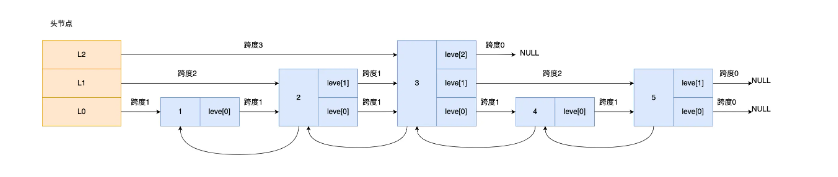

#### 跳表节点查询过程

查找一个跳表节点的过程时，跳表会从头节点的最高层开始，逐一遍历每一层。在遍历某一层的跳表节点时，会用跳表节点中的 SDS 类型的元素和元素的权重来进行判断，共有两个判断条件：

- 如果当前节点的权重「小于」要查找的权重时，跳表就会访问该层上的下一个节点
- 如果当前节点的权重「等于」要查找的权重时，并且当前节点的 SDS 类型数据「小于」要查找的数据时，跳表就会访问该层上的下一个节点

当想查到[4,level[0]]时，查找顺序如下：

[3，level[2]]------>[3, level[1]]------->[3, level[0]]----->[4,level[0]]

跳表在创建的过程中，会生成范围为[0-1]的一个随机数，如果这个随机数小于 0.25（相当于概率 25%），那么层数就增加 1 层，然后继续生成下一个随机数，直到随机数的结果大于 0.25 结束，最终确定该节点的层数。

#### 为什么用跳表而不是平衡树

内存占用上来比较，跳表比平衡树更灵活一些，跳表每个节点占用的指针数量平均为1/(1-p)，取决于参数p（随机数）的大小

在做范围查找的时候，跳表比平衡树操作要简单，平衡树需要做额外的中序遍历继续寻找不超过其最大值的节点

从算法实现难度上来比较，跳表比平衡树要简单得多

### quicklist

quicklist 就是「双向链表 + 压缩列表」组合，因为一个 quicklist 就是一个链表，而链表中的每个元素又是一个压缩列表。

quicklist通过控制每个链表节点中的压缩列表的大小或者元素个数，来规避连锁更新的问题。因为压缩列表元素越少或越小，连锁更新带来的影响就越小，从而提供了更好的访问性能。


在向 quicklist 添加一个元素的时候，不会像普通的链表那样，直接新建一个链表节点。而是会检查插入位置的压缩列表是否能容纳该元素，如果能容纳就直接保存到 quicklistNode 结构里的压缩列表，如果不能容纳，才会新建一个新的 quicklistNode 结构。

quicklist 会控制 quicklistNode 结构里的压缩列表的大小或者元素个数，来规避潜在的连锁更新的风险，但是这并没有完全解决连锁更新的问题。

### listpack


listpack 为了避免压缩列表的连锁更新问题，没有压缩列表中记录前一个节点长度的字段了，listpack 只记录当前节点的长度，当我们向 listpack 加入一个新元素的时候，不会影响其他节点的长度字段的变化，从而避免了压缩列表的连锁更新问题。

压缩列表的 entry 保存 prevlen 是为了实现节点从后往前遍历，知道前一个节点的长度，就可以计算前一个节点的偏移量。listpack 一样可以支持从后往前遍历的。

listpack等于说彻底解决了压缩列表的连锁更新问题。


## Redis分片

将数据拆分到多个redis实例的过程 

功能：

​	1.允许使⽤很多电脑的内存总和来⽀持更⼤的数据库

​	2.允许伸缩计算能⼒到多核或者多服务器，伸缩⽹络带宽到多服务器或者多⽹络适配器 

方式（哈希分片）：

​	1.使⽤哈希函数对键名转换为⼀个数字

​	2. 对这个数字进⾏取模，取模的基数等于redis实例的对象 


## Redis缓存

缓存的场景：

​	1.不需要实时更新又极其消耗数据库的数据

​	2.需要实时更新，但更新的频率不⾼

简单来说，就是需要在应⽤程序中新增缓存逻辑处理的代码。Redis就是旁路缓存，因为需要应⽤程序调⽤它。电脑内存⾥的磁盘⽂件就不是旁路缓存，因为是⾃动调⽤的，对应⽤程序透明。

Redis做缓存的两种模式：

​	1.只读缓存：

​		加强读请求性能。查询数据时，缓存缺失需要从DB加载。更新数据时到DB更新，Redis上的⽼数据直接删除。

​	2.读写缓存：

​		读操作和只读缓存⼀样。写操作分为同步直写和异步写回两种模式，根据实际的业务场景需求来进⾏选择：

​			1.同步直写模式

​				Redis和DB同时删改写回。侧重于保证数据可靠性。 

​			2.异步写回模式

​				只写Redis，数据要被淘汰时再写回DB（淘汰指的是系统空间不足，需要腾出空间时再写入）。侧重于提供低延迟访问。

### 什么是缓存雪崩，击穿，穿透

#### 缓存雪崩

为了保证缓存中的数据与数据库中的数据一致性，会给 Redis 里的数据设置过期时间，当缓存数据过期后，用户访问的数据如果不在缓存里，业务系统需要重新生成缓存，因此就会访问数据库，并将数据更新到 Redis 里，这样后续请求都可以直接命中缓存。


那么，当大量缓存数据在同一时间过期（失效）或者 Redis 故障宕机时，如果此时有大量的用户请求，都无法在 Redis 中处理，于是全部请求都直接访问数据库，从而导致数据库的压力骤增，严重的会造成数据库宕机，从而形成一系列连锁反应，造成整个系统崩溃，这就是缓存雪崩的问题。

发生缓存雪崩的两个原因：大量数据同时过期；Redis 故障宕机；

##### 大量数据同时过期

针对大量数据同时过期而引发的缓存雪崩问题，常见的应对方法有下面这几种：

- 均匀设置过期时间，避免将大量的数据设置成同一个过期时间。我们可以在对缓存数据设置过期时间时，给这些数据的过期时间加上一个随机数，这样就保证数据不会在同一时间过期。
- 互斥锁，当业务线程在处理用户请求时，如果发现访问的数据不在 Redis 里，就加个互斥锁，保证同一时间内只有一个请求来构建缓存（从数据库读取数据，再将数据更新到 Redis 里），当缓存构建完成后，再释放锁。未能获取互斥锁的请求，要么等待锁释放后重新读取缓存，要么就返回空值或者默认值。同时，互斥锁也需要设置超时时间。
- 后台更新缓存，业务线程不再负责更新缓存，缓存也不设置有效期，而是让缓存“永久有效”，并将更新缓存的工作交由后台线程定时更新。此时并不是意味着数据一直能在内存里，因为当系统内存紧张的时候，有些缓存数据会被“淘汰”，而在缓存被“淘汰”到下一次后台定时更新缓存的这段时间内，业务线程读取缓存失败就返回空值，业务的视角就以为是数据丢失了。解决这个问题的放肆有以下两种
    - 1.后台线程不仅负责定时更新缓存，而且也负责频繁地检测缓存是否有效，检测到缓存失效了，原因可能是系统紧张而被淘汰的，于是就要马上从数据库读取数据，并更新到缓存。这种方式的检测时间间隔不能太长，太长也导致用户获取的数据是一个空值而不是真正的数据，所以检测的间隔最好是毫秒级的，但是总归是有个间隔时间，用户体验一般。
    - 2.在业务线程发现缓存数据失效后（缓存数据被淘汰），通过消息队列发送一条消息通知后台线程更新缓存，后台线程收到消息后，在更新缓存前可以判断缓存是否存在，存在就不执行更新缓存操作；不存在就读取数据库数据，并将数据加载到缓存。这种方式相比第一种方式缓存的更新会更及时，用户体验也比较好。

实际上，在业务刚上线的时候，我们最好提前把数据缓起来，而不是等待用户访问才来触发缓存构建，这就是所谓的**缓存预热**，后台更新缓存的机制刚好也适合干这个事情。

##### Redis故障宕机

针对 Redis 故障宕机而引发的缓存雪崩问题，常见的应对方法有下面这几种：

- 服务熔断或请求限流机制。服务熔断——暂停业务应用对缓存服务的访问，直接返回错误，不用再继续访问数据库，从而降低对数据库的访问压力，保证数据库系统的正常运行，然后等到 Redis 恢复正常后，再允许业务应用访问缓存服务。服务熔断机制是保护数据库的正常允许，但是暂停了业务应用访问缓存服系统，全部业务都无法正常工作。请求限流——只将少部分请求发送到数据库进行处理，再多的请求就在入口直接拒绝服务，等到 Redis 恢复正常并把缓存预热完后，再解除请求限流的机制。
- 构建 Redis 缓存高可靠集群。最好通过主从节点的方式构建 Redis 缓存高可靠集群。如果 Redis 缓存的主节点故障宕机，从节点可以切换成为主节点，继续提供缓存服务，避免了由于 Redis 故障宕机而导致的缓存雪崩问题。

#### 缓存击穿

业务通常会有几个数据会被频繁地访问，比如秒杀活动，这类被频繁访问的数据被称为热点数据。如果缓存中的某个热点数据过期了，此时大量的请求访问了该热点数据，就无法从缓存中读取，直接访问数据库，数据库很容易就被高并发的请求冲垮，这就是缓存击穿的问题。

缓存击穿跟缓存雪崩很相似，可以认为缓存击穿是缓存雪崩的一个子集。

应对缓存击穿可以采取前面说到两种方案：

- 互斥锁方案，保证同一时间只有一个业务线程更新缓存，未能获取互斥锁的请求，要么等待锁释放后重新读取缓存，要么就返回空值或者默认值。
- 不给热点数据设置过期时间，由后台异步更新缓存，或者在热点数据准备要过期前，提前通知后台线程更新缓存以及重新设置过期时间。

#### 缓存穿透

当发生缓存雪崩或击穿时，数据库中还是保存了应用要访问的数据，一旦缓存恢复相对应的数据，就可以减轻数据库的压力，而缓存穿透就不一样了。

当用户访问的数据，**既不在缓存中，也不在数据库中**，导致请求在访问缓存时，发现缓存缺失，再去访问数据库时，发现数据库中也没有要访问的数据，没办法构建缓存数据，来服务后续的请求。那么当有大量这样的请求到来时，数据库的压力骤增，这就是缓存穿透的问题。

缓存穿透的发生一般有两种情况：

- 业务误操作，缓存中的数据和数据库中的数据都被误删除了，所以导致缓存和数据库中都没有数据；
- 黑客恶意攻击，故意大量访问某些读取不存在数据的业务；

针对缓冲穿透的方案一般有三种：

- 非法请求的限制，当有大量恶意请求访问不存在的数据的时候，也会发生缓存穿透，因此在 API 入口处我们要判断求请求参数是否合理，请求参数是否含有非法值、请求字段是否存在，如果判断出是恶意请求就直接返回错误，避免进一步访问缓存和数据库。
- 缓存空值或者默认值，当我们线上业务发现缓存穿透的现象时，可以针对查询的数据，在缓存中设置一个空值或者默认值，这样后续请求就可以从缓存中读取到空值或者默认值，返回给应用，而不会继续查询数据库。
- 使用**布隆过滤器**判断数据是否存在而不是通过查询数据库，在写入数据库数据时，使用布隆过滤器做个标记，然后在用户请求到来时，业务线程确认缓存失效后，可以通过查询布隆过滤器快速判断数据是否存在，如果不存在，就不用通过查询数据库来判断数据是否存在。即使发生了缓存穿透，大量请求只会查询 Redis 和布隆过滤器，而不会查询数据库，保证了数据库能正常运行，Redis 自身也是支持布隆过滤器的。

#### 布隆过滤器的工作方式

布隆过滤器由「初始值都为 0 的位图数组」和「 N 个哈希函数」两部分组成。当我们在写入数据库数据时，在布隆过滤器里做个标记，这样下次查询数据是否在数据库时，只需要查询布隆过滤器，如果查询到数据没有被标记，说明不在数据库中。

布隆过滤器会通过 3 个操作完成标记：

- 第一步，使用 N 个哈希函数分别对数据做哈希计算，得到 N 个哈希值
- 第二步，将第一步得到的 N 个哈希值对位图数组的长度取模，得到每个哈希值在位图数组的对应位置。
- 第三步，将每个哈希值在位图数组的对应位置的值设置为 1

当查询数据时，只需要通过布隆过滤器查到位图数组的相应位置的值是否全为 1，只要有一个为 0，就认为数据 x 不在数据库中。查询布隆过滤器说数据存在，并不一定证明数据库中存在这个数据，但是查询到数据不存在，数据库中一定就不存在这个数据。

布隆过滤器存在哈希冲突的可能性，即数据 x 和数据 y 可能都落在第 1、4、6 位置，而事实上，可能数据库中并不存在数据 y，存在误判的情况。

### 数据库和缓存的一致性保证

无论是「先更新数据库，再更新缓存」，还是「先更新缓存，再更新数据库」，这两个方案都存在并发问题，当两个请求并发更新同一条数据的时候，可能会出现缓存和数据库中的数据不一致的现象。

正确的做法是旁路缓存策略，即：在更新数据时不更新缓存，而是删除缓存中的数据。然后，到读取数据时，发现缓存中没了数据之后，再从数据库中读取数据，更新到缓存中。该策略又可以细分为「读策略」和「写策略」。

写策略的步骤：

- 更新数据库中的数据；
- 删除缓存中的数据。

读策略的步骤：

- 如果读取的数据命中了缓存，则直接返回数据；
- 如果读取的数据没有命中缓存，则从数据库中读取数据，然后将数据写入到缓存，并且返回给用户

对于写策略而言，「先更新数据库 + 再删除缓存」的方案，是可以保证数据一致性的。但这个操作本质是个两段操作，如果删除缓存内的旧值失败，就会导致读取的仍然是旧值。

#### 如何保证先更新数据库 + 再删除缓存两个操作都成功

两种方案：

- 重试机制，可以引入消息队列，将第二个操作（删除缓存）要操作的数据加入到消息队列，由消费者来操作数据。如果应用删除缓存失败，可以从消息队列中重新读取数据，然后再次删除缓存，这个就是重试机制。当然，如果重试超过的一定次数，还是没有成功，我们就需要向业务层发送报错信息了。如果删除缓存成功，就要把数据从消息队列中移除，避免重复操作，否则就继续重试。
- 订阅mysql binlog，再删除缓存，可以通过订阅 binlog 日志，拿到具体要操作的数据，然后再执行缓存删除，阿里巴巴开源的 Canal 中间件就是基于这个实现的。

这两种方法有一个共同的特点，都是采用异步操作缓存。


## Redis替换策略

### 过期删除策略

Redis 是可以对 key 设置过期时间的，因此需要有相应的机制将已过期的键值对删除，而做这个工作的就是过期键值删除策略。

每当我们对一个 key 设置了过期时间时，Redis 会把该 key 带上过期时间存储到一个**过期字典**（expires dict）中，也就是说「过期字典」保存了数据库中所有 key 的过期时间。当我们查询一个 key 时，Redis 首先检查该 key 是否存在于过期字典中：如果不在，则正常读取键值；如果存在，则会获取该 key 的过期时间，然后与当前系统时间进行比对，如果比系统时间大，那就没有过期，否则判定该 key 已过期。

过期删除策略一共有三种：

1.定时删除，在设置 key 的过期时间时，同时创建一个定时事件，当时间到达时，由事件处理器自动执行 key 的删除操作。但这种行为会占用相当一部分内存，对CPU相当不友好。

2.惰性删除，不主动删除过期键，每次从数据库访问 key 时，都检测 key 是否过期，如果过期则删除该 key。这虽然对CPU最友好，但不用的key占用的内存一直不释放，会导致一定的内存浪费。

3.定期删除，每隔一段时间「随机」从数据库中取出一定数量的 key 进行检查，并删除其中的过期key。最大的问题在于难以确定频率。

 Redis 选择「惰性删除+定期删除」这两种策略配和使用，以求在合理使用 CPU 时间和避免内存浪费之间取得平衡

### 内存淘汰策略

在缓存满时，Redis共有8种淘汰策略

1.不进行数据淘汰（1种）

​	no-enviction：禁⽌驱逐数据，这种情况下会直接导致写入错误

2.进行数据淘汰

​	（1）设置过期时间对数据进行淘汰（4种）

​		volatile-ttl、volatile-random、volatile-lru、volatile-lfu

​		volatile-ttl：从已设置过期时间的数据集中，选择将要过期的数据进⾏淘汰

​		volatile-random：从已设置过期时间的数据集中，随机选择数据进⾏淘汰

​		volatile-lru：从已设置过期时间的数据集中，挑选最近最少使⽤的数据淘汰

​		volatile-lfu（Redis 4.0后新增的默认淘汰策略）：从已设置过期时间的数据集中，挑选最不经常使⽤的数据淘汰（相较于lru的频率算法策略不一样）

​	（2）所有数据范围内进行淘汰（3种）

​		allkeys-random：随机淘汰任意键值

​		allkeys-lru：淘汰整个键值中最久未使用的键值

​		allkeys-lfu（Redis 4.0 后新增的内存淘汰策略）：淘汰整个键值中最少使用的键值

​		相比于上面唯一的区别就是在整个数据集中

传统的LRU（最近最少使用）算法，需要维护⼀个⼤链表，随着数据访问，更新数据在链表中的位置。 

Redis 中对 LRU 算法进⾏了简化，简单来说就是增加了⼀个随机选取候选集合的操作，具体如下：

​	1.记录每个数据的访问时间。Redis 默认会记录每个数据的最近⼀次访问的时间戳（由键值对数据结构 RedisObject 中的 lru 字段记录）

​	2.随机选取⼀个集合。Redis 在决定淘汰的数据时，第⼀次会随机选出 N 个数据，把它们作为⼀个候选集合

​	3.淘汰集合中lru字段最⼩的数据。接下来，Redis 会⽐较这 N 个数据的 lru 字段，把 lru 字段值最⼩的数据从缓存中淘汰出去

​	4.需要再次淘汰数据时。选取集合外，lru 字段值⼩于候选集合中最⼩的 lru 值的数据，进⼊候选集合，直到选满集合。重复步骤3。

这样，Redis就不⽤维护⼀个⼤链表了，也不⽤频繁的进⾏链表数据交换操作。 但是 LRU 算法有一个问题，无法解决缓存污染问题，比如应用一次读取了大量的数据，而这些数据只会被读取这一次，那么这些数据会留存在 Redis 缓存中很长一段时间，造成缓存污染。因此，在 Redis 4.0 之后引入了 LFU 算法来解决这个问题。

LFU算法，翻译为最近最不常用。FU 算法是根据数据访问次数来淘汰数据的，它的核心思想是“如果数据过去被访问多次，那么将来被访问的频率也更高”。

所以， LFU 算法会记录每个数据的访问次数。当一个数据被再次访问时，就会增加该数据的访问次数。这样就解决了偶尔被访问一次之后，数据留存在缓存中很长一段时间的问题，相比于 LRU 算法也更合理一些。LFU 算法相比于 LRU 算法的实现，多记录了「数据的访问频次」的信息。

访问频次信息 logc 和访问次数相关但不相同。在每次 key 被访问时，会先对 logc 做一个衰减操作，衰减的值跟前后访问时间的差距有关系，如果上一次访问的时间与这一次访问的时间差距很大，那么衰减的值就越大。衰减后，增加操作也并不是单纯的 + 1，而是根据概率增加，如果 logc 越大的 key，它的 logc 就越难再增加

Redis缓存⼤⼩选取建议：结合实际应⽤的数据总量、热数据的体量，以及成本预算，设置在总数据量的 15% 到 30% 这个区间。


## Redis备份

持久化机制：RDB，AOF

RDB：在指定的时间间隔内将内存中的数据集快照写⼊磁盘 

AOF：以⽇志的形式记录服务器所处理的每⼀个写操作，redis服务器启动之初，会读取该⽇志来重新构建数据库，以保证启动后的数据库是完整的。注意AOF日志只会记录写操作命令，读操作命令是不会被记录的

### AOF

AOF ⽇志是写后⽇志，"写后" 的意思是 Redis 是先执⾏命令，把数据写⼊内存，然后才记录⽇志，Redis是内存和 ⽇志(写后⽇志)，mysql是磁盘数据和⽇志(写前⽇志)

Redis 使⽤写后⽇志这⼀⽅式的好处：

​	1.可以避免出现记录错误命令的情况。

​	2. 它是在命令执⾏后才记录⽇志，所以不会阻塞当前的写操作。

#### AOF三种写回策略（和MySQL binlog的写回策略放在一起理解）

​	Always，同步写回；Everysec，每秒写回；No，操作系统控制的写回


​	想要获得⾼性能，就选择 No 策略；如果想要得到⾼可靠性保证，就选择 Always 策略；如果允许数据有⼀点丢 失，又希望性能别受太⼤影响的话，那么就选择 Everysec 策略。这三种策略的核心只是在控制 `fsync()` 函数的调用时机。

- Always 策略就是每次写入 AOF 文件数据后，就执行 fsync() 函数；
- Everysec 策略就会创建一个异步任务来执行 fsync() 函数；
- No 策略就是永不执行 fsync() 函数;

#### AOF重写

AOF通过AOF重写的⽅式进⾏减⼩AOF⽂件⼤⼩，优化存储结构。当 AOF 文件的大小超过所设定的阈值后，Redis 就会启用 AOF 重写机制，来压缩 AOF 文件。

AOF 重写机制是在重写时，读取当前数据库中的所有键值对，然后将每一个键值对用一条命令记录到「新的 AOF 文件」，等到全部记录完后，就将新的 AOF 文件替换掉现有的 AOF 文件。

AOF重写过程：⼀处拷贝，两处⽇志


​	AOF有四个触发时机：

​		1.bgrewriteaof 命令被执⾏

​		2.主从复制完成 RDB ⽂件解析和加载（⽆论是否成功）

​		3.AOF 重写被设置为待调度执⾏

​		4.AOF 被启⽤，同时 AOF ⽂件的⼤⼩⽐例超出阈值，以及 AOF ⽂件的⼤⼩绝对值超出阈值。

在这四个时机下，都不能有正在执⾏的 RDB ⼦进程和 AOF 重写⼦进程，否则的话， AOF 重写⽆法执⾏

AOF 重写和 RDB 创建的过程类似，它也是创建了⼀个⼦进程来完成重写⼯作。这是因为 AOF 重写操作，实际上需要遍历 Redis server 上的所有数据库，把每个键值对以插⼊操作的形式写⼊⽇志⽂件，⽽⽇志⽂件又要进⾏写盘操作。所以，Redis 源码使⽤⼦进程来实现 AOF 重写，这就避免了阻塞主线程，也减 少了对 Redis 整体性能的影响。同时，子进程（操作系统）只有在发生写操作的时候，才会去复制父进程的内容，以提供给AOF继续进行重写。防止由于物理内存数据的复制时间过长而导致父进程长时间阻塞的问题。


在子进程执行AOF重写期间，主进程主要执行以下三个工作：

- 执行客户端发来的命令；
- 将执行后的写命令追加到 「AOF 缓冲区」；
- 将执行后的写命令追加到 「AOF 重写缓冲区」；

当子进程完成 AOF 重写工作（扫描数据库中所有数据，逐一把内存数据的键值对转换成一条命令，再将命令记录到重写日志）后，会向主进程发送一条信号，主进程收到信号后调用信号处理函数执行：

- 将 AOF 重写缓冲区中的所有内容追加到新的 AOF 的文件中，使得新旧两个 AOF 文件所保存的数据库状态一致；
- 新的 AOF 的文件进行改名，覆盖现有的 AOF 文件

信号函数执行完后，主进程就可以继续像往常一样处理命令了。

在整个 AOF 后台重写过程中，除了发生写时复制会对主进程造成阻塞，还有信号处理函数执行时也会对主进程造成阻塞，在其他时候，AOF 后台重写都不会阻塞主进程。

### RDB

Redis 提供了两个命令来生成 RDB 文件，分别是 `save` 和 `bgsave`，他们的区别就在于是否在「主线程」里执行：

- 执行了 save 命令，就会在主线程生成 RDB 文件，由于和执行操作命令在同一个线程，所以如果写入 RDB 文件的时间太长，**会阻塞主线程**；
- 执行了 bgsave 命令，会创建一个子进程来生成 RDB 文件，这样可以**避免主线程的阻塞**；

RDB 文件的加载工作是在服务器启动时自动执行的，Redis 并没有提供专门用于加载 RDB 文件的命令。Redis 还可以通过配置文件的选项来实现每隔一段时间自动执行一次 bgsave 命令。

执行 bgsave 过程中，Redis 依然可以继续处理操作命令的，也就是数据是能被修改的。fork()创建的子进程和父进程共享同一片内存数据，直到父进程要修改数据时。操作系统会把这块数据的物理内存复制一份，然后主线程在这个数据副本进行修改操作。与此同时，bgsave 子进程可以继续把原来的数据写入到 RDB 文件。

而主线程在修改数据后是无法第一时间写入 RDB 文件的，只能交由下一次的 bgsave 快照。

### RDB与AOF混合

尽管 RDB 比 AOF 的数据恢复速度快，但是快照的频率不好把握。频率太低，两次快照间一旦服务器发生宕机，就可能会比较多的数据丢失。频率太高，频繁写入磁盘和创建子进程会带来额外的性能开销。

混合使用 AOF 日志和内存快照，也叫混合持久化。配置文件的命令为 aof-use-rdb-preamble yes

当开启了混合持久化时，在 AOF 重写日志时，`fork` 出来的重写子进程会先将与主线程共享的内存数据以 RDB 方式写入到 AOF 文件，然后主线程处理的操作命令会被记录在重写缓冲区里，重写缓冲区里的增量命令会以 AOF 方式写入到 AOF 文件，写入完成后通知主进程将新的含有 RDB 格式和 AOF 格式的 AOF 文件替换旧的的 AOF 文件。（RDB全量同步+AOF增量同步）

这样的好处在于，重启 Redis 加载数据的时候，由于前半部分是 RDB 内容，这样加载的时候速度会很快。加载完 RDB 的内容后，才会加载后半部分的 AOF 内容，这里的内容是 Redis 后台子进程重写 AOF 期间，主线程处理的操作命令，可以使得数据更少的丢失。

### 大Key对持久化的影响

#### 对AOF日志的影响

当使用 Always 策略的时候，如果写入是一个大 Key，主线程在执行 fsync() 函数的时候，阻塞的时间会比较久，因为当写入的数据量很大的时候，数据同步到硬盘这个过程是很耗时的。

当使用 Everysec 策略的时候，由于是异步执行 fsync() 函数，所以大 Key 持久化的过程（数据同步磁盘）不会影响主线程。

当使用 No 策略的时候，由于永不执行 fsync() 函数，所以大 Key 持久化的过程不会影响主线程。

#### 对AOF重写和RDB的影响

大Key在AOF重写和RDB时会在两个阶段阻塞父进程：

- 大key导致页表的大小很大，fork时因为子进程要复制父进程的页表，因此造成阻塞的时间很长
- 大key发生修改，触发写时复制，需要拷贝物理内存，也会造成阻塞的时间很长


## Redis扩容

集群：动态增加 Redis 节点

主从同步，读写分离：对 Redis 的访问分为读和写

hash算法：分成多个实例进⾏存储，增加 Redis 服务器数量。在客户端对存储的 key 进⾏ hash 运算，存⼊不同的服务器中， 读取时，也进⾏相同的 hash 运算，找到对应的 redis 服务器


## Redis主从复制

Redis 为了避免单点故障，提供了主从库模式，以保证数据副本的⼀致，主从库之间采⽤的是读写分离的⽅式

主服务器可以进行读写操作，当发生写操作时自动将写操作同步给从服务器，而从服务器一般是只读，并接受主服务器同步过来写操作命令，然后执行这条命令。


读操作：主库、从库都可以接收

写操作：⾸先到主库执⾏，然后，主库将写操作同步给从库

我们可以使用 `replicaof`（Redis 5.0 之前使用 slaveof）命令形成主服务器和从服务器的关系。

```sql
# 服务器 B 执行这条命令，这样的话B就成为了A的从库
replicaof <服务器 A 的 IP 地址> <服务器 A 的 Redis 端口号>
```

### 全量复制

全量复制为主从库间进行的第一次复制操作


第⼀阶段：

从库和主库建⽴起连接，并告诉主库即将进⾏同步，主库确认回复后，主从库间就可以开始同步了

psync 命令包含两个参数，分别是**主服务器的 runID** 和**复制进度 offset**。

- runID，每个 Redis 服务器在启动时都会自动生产一个随机的 ID 来唯一标识自己。当从服务器和主服务器第一次同步时，因为不知道主服务器的 run ID，所以将其设置为 "?"。
- offset，表示复制的进度，第一次同步时，其值为 -1。

主服务器收到 psync 命令后，会用 `FULLRESYNC` 作为响应命令返回给对方。且这个响应命令会带上两个参数：主服务器的 runID 和主服务器目前的复制进度 offset。从服务器收到响应后，会记录这两个值。

第⼆阶段：

主服务器会执行 bgsave 命令来生成 RDB 文件，然后把文件发送给从服务器。从服务器收到 RDB 文件后，会先清空当前的数据，然后载入 RDB 文件。

bgsave是不会阻塞主线程的，因此这期间的写操作并没有记录在生成的RDB文件中，这时主从服务器的数据就不一致了。

那么为了保证主从服务器的数据一致性，主服务器在下面这三个时间间隙中将收到的写操作命令，写入到 replication buffer 缓冲区里：

- 主服务器生成 RDB 文件期间
- 主服务器发送 RDB 文件给从服务器期间
- 「从服务器」加载 RDB 文件期间

第三个阶段：

在主服务器生成的 RDB 文件发送完，从服务器收到 RDB 文件后，丢弃所有旧数据，将 RDB 数据载入到内存。完成 RDB 的载入后，会回复一个确认消息给主服务器。

接着，主服务器将 replication buffer 缓冲区里所记录的写操作命令发送给从服务器，从服务器执行来自主服务器 replication buffer 缓冲区里发来的命令，这时主从服务器的数据就一致了。

### 命令传播

主从服务器在完成第一次同步后，双方之间就会维护一个 TCP 连接。

后续主服务器可以通过这个连接继续将写操作命令传播给从服务器，然后从服务器执行该命令，使得与主服务器的数据库状态相同。

而且这个连接是长连接的，目的是避免频繁的 TCP 连接和断开带来的性能开销。

这个过程被称为基于长连接的命令传播，通过这种方式来保证第一次同步后的主从服务器的数据一致性。

### 分摊主服务器的压力

从服务器底下还可以再设从服务器，这样的目的是避免每个从服务器都和主服务器进行同步带来的两个问题：

- 由于是通过 bgsave 命令来生成 RDB 文件的，那么主服务器就会忙于使用 fork() 创建子进程，如果主服务器的内存数据非大，在执行 fork() 函数时是会阻塞主线程的，从而使得 Redis 无法正常处理请求；
- 传输 RDB 文件会占用主服务器的网络带宽，会对主服务器响应命令请求产生影响。

### 增量复制

增量复制发生在从库发生宕机，重新连接后


​					

若从库发⽣宕机，主库会把断连期间收到的写操作命令，写到repl_backlog_buffer中，当从库重连后，从库⾸先会 给主库发送 psync 命令，并把⾃⼰当前的 slave_repl_offset 发给主库，主库会判断⾃⼰的 master_repl_offset 和 slave_repl_offset 之间的差距。若此时从库相差 > repl_backlog_buffer说明可能⼀个从库如果和主库断连时间过长，不能够进⾏增量复制(因为前⾯的值被覆盖的了，会导致数据不⼀致)，所以直接进⾏全量复制

​	⽽从库相差 < repl_backlog_buffer，则将master_repl_offset 和 slave_repl_offset 之间的差距发送给从库进⾏执⾏

### 总结/面试题

Redis 的主从库同步的基本原理，总结来说，有三种模式：全量复制、基于长连接的命令传播，以及增量复制

​	第⼀次同步(本来就是全量复制)或者增量复制时master_repl_offset 和 slave_repl_offset差值>repl_backlog_buffer 时(repl_backlog_size这个配置参数) 就⽆法增量复制，就被迫导致全量复制

​	主从库正常运⾏后的常规同步阶段，在这个阶段中，主从库之间通过命令传播实现同步。

​	从库断开重连后进⾏增量复制

#### 主从全量同步使⽤RDB⽽不使⽤AOF的原因

​	1.RDB⽂件内容是经过压缩的⼆进制数据（不同数据类型数据做了针对性优化），⽂件很⼩。⽽AOF⽂件记录的 是每⼀次写操作的命令，写操作越多⽂件会变得很⼤，其中还包括很多对同⼀个key的多次冗余操作

​	2.打开AOF就要选择⽂件刷盘的策略，选择不当会严重影响Redis性能。⽽RDB只有在需要定时备份和主从全量同步数据时才会触发⽣成⼀次快照

#### 如何判断Redis某个节点正常工作

Redis 判断节点是否正常工作，基本都是通过互相的 ping-pong 心跳检测机制，如果有一半以上的节点去 ping 一个节点的时候没有 pong 回应，集群就会认为这个节点挂掉了，会断开与这个节点的连接。

Redis 主从节点发送的心态间隔是不一样的，而且作用也有一点区别：

- Redis 主节点默认每隔 10 秒对从节点发送 ping 命令，判断从节点的存活性和连接状态，可通过参数repl-ping-slave-period控制发送频率。
- Redis 从节点每隔 1 秒发送 replconf ack{offset} 命令，给主节点上报自身当前的复制偏移量，目的是为了：
    - 实时监测主从节点网络状态；
    - 上报自身复制偏移量， 检查复制数据是否丢失， 如果从节点数据丢失， 再从主节点的复制缓冲区中拉取丢失数据

#### 主从复制架构中，过期key如何处理

主节点处理了一个key或者通过淘汰算法淘汰了一个key，这个时间主节点模拟一条del命令发送给从节点，从节点收到该命令后，就进行删除key的操作。

#### 主从复制中两个 Buffer(replication buffer 、repl backlog buffer)有什么区别

出现的阶段不同：

- repl backlog buffer 是在增量复制阶段出现，一个主节点只分配一个 repl backlog buffer；
- replication buffer 是在全量复制阶段和增量复制阶段都会出现，主节点会给每个新连接的从节点，分配一个 replication buffer

这两个 Buffer 都有大小限制的，当缓冲区满了之后，发生的事情不一样：

- 当 repl backlog buffer 满了，因为是环形结构，会直接覆盖起始位置数据
- 当 replication buffer 满了，会导致连接断开，删除缓存，从节点重新连接，重新开始全量复制

#### 如何应对主从数据不一致

主从数据不一致的现象，是因为主从节点间的命令复制是异步进行的，所以无法实现强一致性保证（主从数据时时刻刻保持一致）。

应对的方法有：

1. 尽量保证主从节点间的网络连接状况良好，避免主从节点在不同的机房
2. 开发一个外部程序来监控主从节点间的复制进度，及时监控 master_repl_offset 和 slave_repl_offset 之间的差距，如果大于设定的阈值，可以让客户端先不与这个从节点进行数据读取

#### 主从切换如何减少数据丢失

主从切换过程中，产生数据丢失的情况有两种：异步复制同步丢失，集群产生脑裂数据丢失。

##### 异步复制同步丢失

异步复制同步丢失指的是主节点还没来得及同步给从节点时发生了断电，那么主节点内存中的数据会丢失。

Redis 配置里有一个参数 min-slaves-max-lag，表示一旦所有的从节点数据复制和同步的延迟都超过了 min-slaves-max-lag 定义的值，那么主节点就会拒绝接收任何请求。这样可以将主节点和从节点的数据差控制在10s内，即使 master 宕机也只是这未复制的 10s 数据。

那么对于客户端，当客户端发现 master 不可写后，我们可以采取降级措施，将数据暂时写入本地缓存和磁盘中，在一段时间（等 master 恢复正常）后重新写入 master 来保证数据不丢失，也可以将数据写入 kafka 消息队列，等 master 恢复正常，再隔一段时间去消费 kafka 中的数据，让将数据重新写入 master。

##### 集群产生脑裂数据丢失

主节点网络出现问题与从节点失联，但客户端仍然写数据到这个主节点中。哨兵机制检测到主节点挂了，从从节点中推举出一个新的主节点。失联的主节点重新连接，但因为已经出现新的主节点，所以将自己降级为从节点。从节点需要做全量同步，因此就会丢失“客户端仍然写数据到这个主节点”时的数据。

解决方案为：当主节点发现「从节点下线的数量太多」，或者「网络延迟太大」的时候，那么主节点会禁止写操作，直接把错误返回给客户端。

#### 主从节点如何实现故障自动转换

哨兵机制


## Redis 哨兵

核心是实现主从节点故障转移。哨兵其实是一个运行在特殊模式下的 Redis 进程，所以它也是一个节点。它相当于是“观察者节点”，观察的对象是主从节点。

哨兵节点主要负责三件事情：监控，选主，通知

### 如何判断主节点真的故障

哨兵会每隔 1 秒给所有主从节点发送 PING 命令，当主从节点收到 PING 命令后，会发送一个响应命令给哨兵，这样就可以判断它们是否在正常运行。

如果主节点或者从节点没有在规定的时间内响应哨兵的 PING 命令，哨兵就会将它们标记为「**主观下线**」。这个「规定的时间」是配置项 `down-after-milliseconds` 参数设定的，单位是毫秒。

除了主观下线外，还有客观下线，后者只适用于主节点。之所以针对「主节点」设计「主观下线」和「客观下线」两个状态，是因为有可能「主节点」其实并没有故障，可能只是因为主节点的系统压力比较大或者网络发送了拥塞，导致主节点没有在规定时间内响应哨兵的 PING 命令。

所以，为了减少误判的情况，哨兵在部署的时候不会只部署一个节点，而是用多个节点部署成哨兵集群（*最少需要三台机器来部署哨兵集群*），通过多个哨兵节点一起判断，就可以就可以避免单个哨兵因为自身网络状况不好，而误判主节点下线的情况。同时，多个哨兵的网络同时不稳定的概率较小，由它们一起做决策，误判率也能降低。


当一个哨兵判断主节点为「主观下线」后，就会向其他哨兵发起命令，其他哨兵收到这个命令后，就会根据自身和主节点的网络状况，做出赞成投票或者拒绝投票的响应。一般来说，赞成数达到哨兵个数的1/2+1时，就将主节点从主观下线判断为客观下线，并准备选出一个从节点来做新主节点。

### 由哪个哨兵进行主从故障转移

从上面的“减少误判”的行为可看出，哨兵是以哨兵集群的方式存在的。

实际让哪个哨兵进行主从故障转移，需要在哨兵集群中选出一个 leader，让 leader 来执行主从切换。leader的候选者是判断主节点为「客观下线」的人。候选者会向其他哨兵发送命令，表明希望成为 Leader 来执行主从切换，并让所有其他哨兵对它进行投票。每个哨兵只有一次投票机会，如果用完后就不能参与投票了，可以投给自己或投给别人，但是只有候选者才能把票投给自己。

因此，哨兵节点实际上至少要有三个，不然当一个哨兵挂掉了后，就无法获得多数票并进行主从节点切换了。哨兵节点的数量最好是奇数，哨兵个数最好为1/2+1。

### 主从故障转移的过程

主从故障转移操作包含以下四个步骤：

1.在已下线主节点（旧主节点）属下的所有「从节点」里面，挑选出一个从节点，并将其转换为主节点。

​	从节点的选择标准：网络连接状态--优先级（越小越靠前）--复制进度--ID号（越小越靠前）

​	网络连接状态时通过主节点故障前主从网络之前记录的断连次数确定的，如果发生断连的次数超过了 10 次，就说明这个从节点的网络状况不好，不适合作为新主节点。

​	在选举出从节点后，哨兵 leader 向被选中的从节点发送 `SLAVEOF no one` 命令，让这个从节点解除从节点的身份，将其变为新主节点。在发送 `SLAVEOF no one` 命令之后，哨兵 leader 会以每秒一次的频率向被升级的从节点发送 `INFO` 命令（没进行故障转移之前，`INFO` 命令的频率是每十秒一次），并观察命令回复中的角色信息，当被升级节点的角色信息从原来的 slave 变为 master 时，哨兵 leader 就知道被选中的从节点已经顺利升级为主节点了。

2.让已下线主节点属下的所有「从节点」修改复制目标，修改为复制「新主节点」

​	哨兵 leader 下一步要做的就是，让已下线主节点属下的所有「从节点」指向「新主节点」，这一动作可以通过向「从节点」发送 `SLAVEOF` 命令来实现。

3.将新主节点的 IP 地址和信息，通过「发布者/订阅者机制」通知给客户端

​	每个哨兵节点提供发布者/订阅者机制，客户端可以从哨兵订阅消息。哨兵提供的消息订阅频道有很多，不同频道包含了主从节点切换过程中的不同关键事件.

​	客户端和哨兵建立连接后，客户端会订阅哨兵提供的频道。主从切换完成后，哨兵就会向 `+switch-master` 频道(主库地址发生变化)发布新主节点的 IP 地址和端口的消息，这个时候客户端就可以收到这条信息，然后用这里面的新主节点的 IP 地址和端口进行通信了。

​	通过发布者/订阅者机制机制，有了这些事件通知，客户端不仅可以在主从切换后得到新主节点的连接信息，还可以监控到主从节点切换过程中发生的各个重要事件。这样，客户端就可以知道主从切换进行到哪一步了，有助于了解切换进度。

4.继续监视旧主节点，当这个旧主节点重新上线时，将它设置为新主节点的从节点

​	故障转移操作最后要做的是，继续监视旧主节点，当旧主节点重新上线时，哨兵集群就会向它发送 `SLAVEOF` 命令，让它成为新主节点的从节点。

### 哨兵集群

哨兵集群也使用了发布者/订阅者机制，在配置哨兵的信息时，只需要填下面这几个参数，设置主节点名字、主节点的 IP 地址和端口号以及 quorum 值。

```c
sentinel monitor <master-name> <ip> <redis-port> <quorum> 
```

在主从集群中，主节点上有一个名为`__sentinel__:hello`的频道，不同哨兵就是通过它来相互发现，实现互相通信的。例如，哨兵 A 把自己的 IP 地址和端口的信息发布到`__sentinel__:hello` 频道上，哨兵 B 和 C 订阅了该频道。那么此时，哨兵 B 和 C 就可以从这个频道直接获取哨兵 A 的 IP 地址和端口号。然后，哨兵 B、C 可以和哨兵 A 建立网络连接。通过这个方式，哨兵 B 和 C 也可以建立网络连接，这样一来，哨兵集群就形成了。

#### 哨兵集群如何知道从节点的信息

主节点知道所有「从节点」的信息，所以哨兵会每 10 秒一次的频率向主节点发送 INFO 命令来获取所有「从节点」的信息。主节点接受到这个命令后，就会把从节点列表返回给哨兵。接着，哨兵就可以根据从节点列表中的连接信息，和每个从节点建立连接，并在这个连接上持续地对从节点进行监控。

正是通过 Redis 的发布者/订阅者机制，哨兵之间可以相互感知，然后组成集群，同时，哨兵又通过 INFO 命令，在主节点里获得了所有从节点连接信息，于是就能和从节点建立连接，并进行监控了。


## Redis其他

### Redis容灾

在采用主从复制的方式时，从库同时开启快照和AOF进行持久化，保证数据的安全性

当主库挂掉时，将从库升级为主库；在原主库数据恢复后，将其降级为从库并启动

如果主库和从库都挂掉，可以调用命令通过AOF和快照进行回复

### Redis哨兵

监控主从是否正常，在出现问题时会自动通知

故障迁移：包括自动主从切换，以及统一的配置管理（获取主从地址）

### Redis消息队列

Redis做消息队列，使用list实现， lpush, rpush操作实现⼊队，lpop, rpop 来实现出队。

在客户端，维护一个死循环来从队列中读取消息并处理，如果队列中有消息，就读取，没有消息，就会陷⼊死循 环，知道下⼀次有消息进⼊，这种死循环会造成⼤量的资源浪费，可以使⽤ lbpop,也就是阻塞式弹出

延迟消息队列⽤ Zset实现，其中 Zset 的score 就是时间。 将 value 存到 redis 中，然后通过 轮询的⽅式，去不断的读取消息出来。然后 处理。

### 布隆过滤器

专门⽤来处理去重问题，它相当于⼀个不那么精确的 set 集合，可以利⽤它的 contains ⽅法去判断某⼀个对象是否存在，但是判断结果不是很精确，如果 contains 判断某个值不存在，那就⼀定不存在，如果判断为存在，那么不⼀定存在。

每⼀个布隆过滤器在Redis 中都对应了⼀个⼤型的位数组以及⼏个不同的 hash 函数

add操作根据⼏个不同的 hash 函数给元素进⾏ hash 运算⼀个整数索引值，拿到这个索引值之后，对位数组的长度进⾏取模运算，得到⼀个位置，每⼀个 hash 函数都会得到⼀个位置，将位数组中对应的位置设置位 1 ，这样就完成了添加操作

当判读元素是否存在时，同样的。先对元素进⾏ hash 运算，将运算的结果和位数组取模，然后去对应的位置查看 是否有相应的数据，如果有，表⽰元素可能存在（因为这个有数据的地⽅也可能是其他元素存 进来的），如果没有 表⽰元素⼀定不存在。

Bloom Filter 中，误判的概率和位数组的⼤⼩有很⼤关系，位数组越⼤，误判概率越⼩，当然占⽤的存储空间越⼤；位数组越⼩，误判概率越⼤，当然占⽤的存储空间就⼩。


## Redis面试题

### Redis是什么

Redis 是一种基于内存的数据库，对数据的读写操作都是在内存中完成，因此读写速度非常快，常用于缓存，消息队列、分布式锁等场景。

Redis 提供了多种数据类型来支持不同的业务场景，比如 String(字符串)、Hash(哈希)、 List (列表)、Set(集合)、Zset(有序集合)、Bitmaps（位图）、HyperLogLog（基数统计）、GEO（地理信息）、Stream（流），并且对数据类型的操作都是原子性的，因为执行命令由单线程负责的，不存在并发竞争的问题。

除此之外，Redis 还支持事务 、持久化、Lua 脚本、多种集群方案（主从复制模式、哨兵模式、切片机群模式）、发布/订阅模式，内存淘汰机制、过期删除机制等等

### Redis和Memcached有什么区别

Redis 作为缓存，但是 Memcached 也是基于内存的数据库，为什么不选择它作为缓存呢？

Redis 与 Memcached 共同点：

- 都是基于内存的数据库，一般都用来当做缓存使用
- 都有过期策略
- 性能都非常高

Redis 与 Memcached 的区别：

- Redis 支持的数据类型更丰富（String、Hash、List、Set、ZSet），而 Memcached 只支持最简单的 key-value 数据类型
- Redis 支持数据的持久化，可以将内存中的数据保持在磁盘中，重启的时候可以再次加载进行使用，而 Memcached 没有持久化功能，数据全部存在内存之中，Memcached 重启或者挂掉后，数据就没了；
- Redis 原生支持集群模式，Memcached 没有原生的集群模式，需要依靠客户端来实现往集群中分片写入数据；
- Redis 支持发布订阅模型、Lua 脚本、事务等功能，而 Memcached 不支持；

### 为什么用 Redis 作为 MySQL 的缓存

因为 Redis 具备「高性能」和「高并发」两种特性。

Redis的高性能体现在用户在“下一次访问数据”的时候只需要直接从缓存中读取即可（不考虑缓存预热的情况）。操作 Redis 缓存就是直接操作内存，所以速度相当快。如果 MySQL 中的对应数据改变的之后，同步改变 Redis 缓存中相应的数据即可，不过这里会有 Redis 和 MySQL 双写一致性的问题。

Redis具备高并发，单台设备的 Redis 的 QPS（Query Per Second，每秒钟处理完请求的次数） 是 MySQL 的 10 倍，Redis 单机的 QPS 能轻松破 10w，而 MySQL 单机的 QPS 很难破 1w。

所以，直接访问 Redis 能够承受的请求是远远大于直接访问 MySQL 的，所以我们可以考虑把数据库中的部分数据转移到缓存中去，这样用户的一部分请求会直接到缓存这里而不用经过数据库。

### Redis 数据类型以及使用场景分别是什么

Redis 提供了丰富的数据类型，常见的有五种数据类型：String（字符串），Hash（哈希），List（列表），Set（集合）、Zset（有序集合）。随着 Redis 版本的更新，后面又支持了四种数据类型： BitMap（2.2 版新增）、HyperLogLog（2.8 版新增）、GEO（3.2 版新增）、Stream（5.0 版新增）。

- String 类型的应用场景：缓存对象、常规计数、分布式锁、共享 session 信息等。
- List 类型的应用场景：消息队列（但是有两个问题：1. 生产者需要自行实现全局唯一 ID；2. 不能以消费组形式消费数据）等。
- Hash 类型：缓存对象、购物车等。
- Set 类型：聚合计算（并集、交集、差集）场景，比如点赞、共同关注、抽奖活动等。
- Zset 类型：排序场景，比如排行榜、电话和姓名排序等。
- BitMap（2.2 版新增）：二值状态统计的场景，比如签到、判断用户登陆状态、连续签到用户总数等；
- HyperLogLog（2.8 版新增）：海量数据基数统计的场景，比如百万级网页 UV 计数等；
- GEO（3.2 版新增）：存储地理位置信息的场景，比如滴滴叫车；
- Stream（5.0 版新增）：消息队列，相比于基于 List 类型实现的消息队列，有这两个特有的特性：自动生成全局唯一消息ID（进行重复消息判断），支持以消费组形式消费数据。

Redis数据类型如何实现：


### Redis是单线程么

Redis 单线程指的是「接收客户端请求->解析请求 ->进行数据读写等操作->发送数据给客户端」这个过程是由一个线程（主线程）来完成的，这也是我们常说 Redis 是单线程的原因。但是，Redis 程序并不是单线程的，Redis 在启动的时候，是会启动后台线程（BIO）的：

- Redis 在 2.6 版本，会启动 2 个后台线程，分别处理关闭文件、AOF 刷盘这两个任务；
- Redis 在 4.0 版本之后，新增了一个新的后台线程，用来异步释放 Redis 内存，也就是 lazyfree 线程。

之所以 Redis 为「关闭文件、AOF 刷盘、释放内存」这些任务创建单独的线程来处理，是因为这些任务的操作都是很耗时的，如果把这些任务都放在主线程来处理，那么 Redis 主线程就很容易发生阻塞，这样就无法处理后续的请求了。后台线程相当于一个消费者，生产者把耗时任务丢到任务队列中，消费者（BIO）不停轮询这个队列，拿出任务就去执行对应的方法即可。关闭文件、AOF 刷盘、释放内存这三个任务都有各自的任务队列。


### Redis单线程模式是怎样的


### Redis单线程为什么这么快

单线程的 Redis 吞吐量可以达到 10W/每秒，之所以 Redis 采用单线程（网络 I/O 和执行命令）那么快，有如下几个原因：

- Redis 的大部分操作**都在内存中完成**，并且采用了高效的数据结构，因此 Redis 瓶颈可能是机器的内存或者网络带宽，而并非 CPU，既然 CPU 不是瓶颈，那么自然就采用单线程的解决方案了；
- Redis 采用单线程模型可以**避免了多线程之间的竞争**，省去了多线程切换带来的时间和性能上的开销，而且也不会导致死锁问题
- Redis 采用了 **I/O 多路复用机制**处理大量的客户端 Socket 请求，IO 多路复用机制是指一个线程处理多个 IO 流，就是我们经常听到的 select/epoll 机制。简单来说，在 Redis 只运行单线程的情况下，该机制允许内核中，同时存在多个监听 Socket 和已连接 Socket。内核会一直监听这些 Socket 上的连接请求或数据请求。一旦有请求到达，就会交给 Redis 线程处理，这就实现了一个 Redis 线程处理多个 IO 流的效果。

实际上，对于Redis来说，CPU性能并不是最大的瓶颈，更多是受到内存大小和网络I/O的限制，所以 Redis 核心网络模型使用单线程并没有什么问题，如果想要使用服务的多核CPU，可以在一台服务器上启动多个节点或者采用分片集群的方式。

### Redis6.0后为什么引入了多线程

虽然 Redis 的主要工作（网络 I/O 和执行命令）一直是单线程模型，但是在 Redis 6.0 版本之后，也采用了多个 I/O 线程来处理网络请求，这是因为随着网络硬件的性能提升，Redis 的性能瓶颈有时会出现在网络 I/O 的处理上。

所以为了提高网络 I/O 的并行度，Redis 6.0 对于网络 I/O 采用多线程来处理。但是对于命令的执行，Redis 仍然使用单线程来处理。

Redis 6.0 版本之后，Redis 在启动的时候，默认情况下会额外创建 6 个线程（*这里的线程数不包括主线程*）：

- Redis-server ： Redis的主线程，主要负责执行命令；
- bio_close_file、bio_aof_fsync、bio_lazy_free：三个后台线程，分别异步处理关闭文件任务、AOF刷盘任务、释放内存任务；
- io_thd_1、io_thd_2、io_thd_3：三个 I/O 线程，io-threads 默认是 4 ，所以会启动 3（4-1）个 I/O 多线程，用来分担 Redis 网络 I/O 的压力。

### Redis如何实现数据不丢失

Redis 实现了数据持久化的机制，这个机制会把数据存储到磁盘，这样在 Redis 重启就能够从磁盘中恢复原有的数据。Redis 共有三种数据持久化的方式：

- **AOF 日志**：每执行一条写操作命令，就把该命令以追加的方式写入到一个文件里；
- **RDB 快照**：将某一时刻的内存数据，以二进制的方式写入磁盘；
- **混合持久化方式**：Redis 4.0 新增的方式，集成了 AOF 和 RBD 的优点；

### AOF日志如何实现

Redis 在执行完一条写操作命令后，就会把该命令以追加的方式写入到一个文件里，然后 Redis 重启时，会读取该文件记录的命令，然后逐一执行命令的方式来进行数据恢复。


Reids 是先执行写操作命令后，才将该命令记录到 AOF 日志里的（与redo log的WAL策略在行为上相同），这么做其实有两个好处。

- **避免额外的检查开销**：因为如果先将写操作命令记录到 AOF 日志里，再执行该命令的话，如果当前的命令语法有问题，那么如果不进行命令语法检查，该错误的命令记录到 AOF 日志里后，Redis 在使用日志恢复数据时，就可能会出错。
- **不会阻塞当前写操作命令的执行**：因为当写操作命令执行成功后，才会将命令记录到 AOF 日志。

当然，这样做也会带来风险：

- **数据可能会丢失：** 执行写操作命令和记录日志是两个过程，那当 Redis 在还没来得及将命令写入到硬盘时，服务器发生宕机了，这个数据就会有丢失的风险。
- **可能阻塞其他操作：** 由于写操作命令执行成功后才记录到 AOF 日志，所以不会阻塞当前命令的执行，但因为 AOF 日志也是在主线程中执行，所以当 Redis 把日志文件写入磁盘的时候，还是会阻塞后续的操作无法执行。

AOF有三种回写策略，本质是fsycn函数的执行时机不同：

- **Always**，它的意思是每次写操作命令执行完后，同步将 AOF 日志数据写回硬盘；
- **Everysec**，意思是每次写操作命令执行完后，先将命令写入到 AOF 文件的内核缓冲区，然后每隔一秒将缓冲区里的内容写回到硬盘；
- **No**，不由 Redis 控制写回硬盘的时机，转交给操作系统控制写回的时机，也就是每次写操作命令执行完后，先将命令写入到 AOF 文件的内核缓冲区，再由操作系统决定何时将缓冲区内容写回硬盘。

AOF日志过大，会触发AOF重写机制，来压缩 AOF 文件。AOF 重写机制是在重写时，读取当前数据库中的所有键值对，然后将每一个键值对用一条命令记录到「新的 AOF 文件」，等到全部记录完后，就将新的 AOF 文件替换掉现有的 AOF 文件。

重写工作完成后，就会将新的 AOF 文件覆盖现有的 AOF 文件，这就相当于压缩了 AOF 文件，使得 AOF 文件体积变小了。（因为每个键值对只需要一条命令即可）

Redis 的重写 AOF 过程是由后台子进程 **bgrewriteaof** 来完成的，这么做可以达到两个好处：

- 子进程进行 AOF 重写期间，主进程可以继续处理命令请求，从而避免阻塞主进程；
- 子进程带有主进程的数据副本，这里使用子进程而不是线程，因为如果是使用线程，多线程之间会共享内存，那么在修改共享内存数据的时候，需要通过加锁来保证数据的安全，而这样就会降低性能。而使用子进程，创建子进程时，父子进程是共享内存数据的，不过这个共享的内存只能以只读的方式，而当父子进程任意一方修改了该共享内存，就会发生「写时复制」，于是父子进程就有了独立的数据副本，就不用加锁来保证数据安全。

触发重写机制后，主进程就会创建重写 AOF 的子进程，此时父子进程共享物理内存，重写子进程只会对这个内存进行只读，重写 AOF 子进程会读取数据库里的所有数据，并逐一把内存数据的键值对转换成一条命令，再将命令记录到重写日志（新的 AOF 文件）。

重写过程中，主进程依然可以正常处理命令，因此为了解决数据不一致问题，Redis 设置了一个 **AOF 重写缓冲区**，这个缓冲区在创建 bgrewriteaof 子进程之后开始使用。在重写 AOF 期间，当 Redis 执行完一个写命令之后，它会**同时将这个写命令写入到 「AOF 缓冲区」和 「AOF 重写缓冲区」**。

主线程在收到子进程完成AOF重写工作的信号后，调用一个信号处理函数，该函数主要做以下工作：

- 将 AOF 重写缓冲区中的所有内容追加到新的 AOF 的文件中，使得新旧两个 AOF 文件所保存的数据库状态一致；
- 新的 AOF 的文件进行改名，覆盖现有的 AOF 文件。

**注意，AOF重写过程中旧的AOF不能撂担子，还是在继续工作的，所以还需要一个AOF缓冲区**

AOF缓冲区:是正常使用AOF作为数据落地中间地带，所有的数据先到AOF缓冲区再到AOF文件中。为了减少频繁地写入 AOF 文件，提高性能。

AOF缓冲区不可以替代AOF重写缓冲区的原因是AOF重写缓冲区记录的是从重写开始后的所有需要重写的命令，而AOF缓冲区本身在不断更新，将里面的部分写到旧AOF文件后缓存的相应部分就会消失。

### RDB快照如何实现

因为 AOF 日志记录的是操作命令，不是实际的数据，所以用 AOF 方法做故障恢复时，需要全量把日志都执行一遍，一旦 AOF 日志非常多，势必会造成 Redis 的恢复操作缓慢。

为了解决这个问题，Redis 增加了 RDB 快照。RDB 快照就是记录某一个瞬间的内存数据，记录的是实际数据，而 AOF 文件记录的是命令操作的日志，而不是实际的数据。因此在 Redis 恢复数据时， RDB 恢复数据的效率会比 AOF 高些，因为直接将 RDB 文件读入内存就可以，不需要像 AOF 那样还需要额外执行操作命令的步骤才能恢复数据。

edis 提供了两个命令来生成 RDB 文件，分别是 save 和 bgsave，他们的区别就在于是否在「主线程」里执行。

Redis 的快照是**全量快照**，也就是说每次执行快照，都是把内存中的「所有数据」都记录到磁盘中。所以执行快照是一个比较重的操作，如果频率太频繁，可能会对 Redis 性能产生影响。如果频率太低，服务器故障时，丢失的数据会更多。

执行 bgsave 过程中，Redis 依然**可以继续处理操作命令**的，也就是数据是能被修改的，关键的技术就在于**写时复制技术（Copy-On-Write, COW）**执行 bgsave 命令的时候，会通过 fork() 创建子进程，此时子进程和父进程是共享同一片内存数据的，因为创建子进程的时候，会复制父进程的页表（大key可能导致阻塞），但是页表指向的物理内存还是一个，此时如果主线程执行读操作，则主线程和 bgsave 子进程互相不影响。

### 为什么会有混合持久化

RDB 优点是数据恢复速度快，但是快照的频率不好把握。频率太低，丢失的数据就会比较多，频率太高，就会影响性能。AOF 优点是丢失数据少，但是数据恢复不快。

为了集成了两者的优点， Redis 4.0 提出了**混合使用 AOF 日志和内存快照**，也叫混合持久化，既保证了 Redis 重启速度，又降低数据丢失风险。

混合持久化工作在 **AOF 日志重写过程**，当开启了混合持久化时，在 AOF 重写日志时，fork 出来的重写子进程会先将与主线程共享的内存数据以 RDB 方式写入到 AOF 文件，然后主线程处理的操作命令会被记录在重写缓冲区里，重写缓冲区里的增量命令会以 AOF 方式写入到 AOF 文件，写入完成后通知主进程将新的含有 RDB 格式和 AOF 格式的 AOF 文件替换旧的的 AOF 文件。也就是说，使用了混合持久化，AOF 文件的**前半部分是 RDB 格式的全量数据，后半部分是 AOF 格式的增量数据**。混合持久化的本质是“全量同步+增量同步”

混合持久化的优点：

- 混合持久化结合了 RDB 和 AOF 持久化的优点，开头为 RDB 的格式，使得 Redis 可以更快的启动，同时结合 AOF 的优点，有减低了大量数据丢失的风险。

混合持久化的缺点：

- AOF 文件中添加了 RDB 格式的内容，使得 AOF 文件的可读性变得很差；
- 兼容性差，如果开启混合持久化，那么此混合持久化 AOF 文件，就不能用在 Redis 4.0 之前版本了。

### Redis如何实现服务高可用

三个策略：主从复制（避免单点故障导致服务不可用），哨兵模式（主从节点故障转移），切片集群（负载均衡）

#### 切片集群模式

当 Redis 缓存数据量大到一台服务器无法缓存时，就需要使用 **Redis 切片集群**（Redis Cluster ）方案，它将数据分布在不同的服务器上，以此来降低系统对单主节点的依赖，从而提高 Redis 服务的读写性能。

Redis Cluster 方案采用哈希槽（Hash Slot），来处理数据和节点之间的映射关系。在 Redis Cluster 方案中，**一个切片集群共有 16384 个哈希槽**，这些哈希槽类似于数据分区，每个键值对都会根据它的 key，被映射到一个哈希槽中。哈希槽又映射到具体的 Redis 节点上（即每个节点保存一定量的哈希槽）。

### 集群脑裂导致数据丢失的问题如何解决

由于网络问题，集群节点之间失去联系。主从数据不同步；重新平衡选举，产生两个主服务。等网络恢复，旧主节点会降级为从节点，再与新主节点进行同步复制的时候，由于会从节点会清空自己的缓冲区，所以导致之前客户端写入的数据丢失了。

解决方案就是：当主节点发现从节点下线或者通信超时的总数量小于阈值时，那么禁止主节点进行写数据，直接把错误返回给客户端。这样就能避免数据写入到旧主节点的问题。

### Redis使用的过期删除策略是什么

Redis 是可以对 key 设置过期时间的，因此需要有相应的机制将已过期的键值对删除，而做这个工作的就是过期键值删除策略。每当我们对一个 key 设置了过期时间时，Redis 会把该 key 带上过期时间存储到一个**过期字典**（expires dict）中，也就是说「过期字典」保存了数据库中所有 key 的过期时间。

当我们查询一个 key 时，Redis 首先检查该 key 是否存在于过期字典中：

- 如果不在，则正常读取键值；
- 如果存在，则会获取该 key 的过期时间，然后与当前系统时间进行比对，如果比系统时间大，那就没有过期，否则判定该 key 已过期。

Redis 使用的过期删除策略是「惰性删除+定期删除」这两种策略配和使用。

惰性删除：不主动删除过期键，每次从数据库访问 key 时，都检测 key 是否过期，如果过期则删除该 key

定期删除：每隔一段时间「随机」从数据库中取出一定数量的** key 进行检查，并删除其中的过期key

### Redis 持久化时，对过期键会如何处理的

RDB 文件分为两个阶段，RDB 文件生成阶段和加载阶段：

- RDB 文件生成阶段：从内存状态持久化成 RDB（文件）的时候，会对 key 进行过期检查，过期的键「不会」被保存到新的 RDB 文件中，因此 Redis 中的过期键不会对生成新 RDB 文件产生任何影响。
- RDB 加载阶段：RDB 加载阶段时，要看服务器是主服务器还是从服务器，分别对应以下两种情况：
    - 如果 Redis 是「主服务器」运行模式的话，在载入 RDB 文件时，程序会对文件中保存的键进行检查，过期键「不会」被载入到数据库中。所以过期键不会对载入 RDB 文件的主服务器造成影响；
    - 如果 Redis 是「从服务器」运行模式的话，在载入 RDB 文件时，不论键是否过期都会被载入到数据库中。但由于主从服务器在进行数据同步时，从服务器的数据会被清空。所以一般来说，过期键对载入 RDB 文件的从服务器也不会造成影响。

AOF 文件分为两个阶段，AOF 文件写入阶段和 AOF 重写阶段。

- AOF 文件写入阶段：当 Redis 以 AOF 模式持久化时，如果数据库某个过期键还没被删除，那么 AOF 文件会保留此过期键，当此过期键被删除后，Redis 会向 AOF 文件追加一条 DEL 命令来显式地删除该键值。
- AOF 重写阶段：执行 AOF 重写时，会对 Redis 中的键值对进行检查，已过期的键不会被保存到重写后的 AOF 文件中，因此不会对 AOF 重写造成任何影响。

### Redis主从模式中，会对过期键如何处理

当 Redis 运行在主从模式下时，从库不会进行过期扫描，从库对过期的处理是被动的。也就是即使从库中的 key 过期了，如果有客户端访问从库时，依然可以得到 key 对应的值，像未过期的键值对一样返回。

从库的过期键处理依靠主服务器控制，主库在 key 到期时，会在 AOF 文件里增加一条 del 指令，同步到所有的从库，从库通过执行这条 del 指令来删除过期的 key。

### Redis内存满了会发生什么

在 Redis 的运行内存达到了某个阀值，就会触发内存淘汰机制，这个阀值就是我们设置的最大运行内存

### Redis内存淘汰策略有哪些

Redis 内存淘汰策略共有八种，这八种策略大体分为「不进行数据淘汰」和「进行数据淘汰」两类策略。

1、不进行数据淘汰的策略

**noeviction**（Redis3.0之后，默认的内存淘汰策略） ：它表示当运行内存超过最大设置内存时，不淘汰任何数据，而是不再提供服务，直接返回错误。

2、进行数据淘汰的策略

针对「进行数据淘汰」这一类策略，又可以细分为「在设置了过期时间的数据中进行淘汰」和「在所有数据范围内进行淘汰」这两类策略。 在设置了过期时间的数据中进行淘汰：

- **volatile-random**：随机淘汰设置了过期时间的任意键值；
- **volatile-ttl**：优先淘汰更早过期的键值。
- **volatile-lru**（Redis3.0 之前，默认的内存淘汰策略）：淘汰所有设置了过期时间的键值中，最久未使用的键值；
- **volatile-lfu**（Redis 4.0 后新增的内存淘汰策略）：淘汰所有设置了过期时间的键值中，最少使用的键值；

在所有数据范围内进行淘汰：

- **allkeys-random**：随机淘汰任意键值;
- **allkeys-lru**：淘汰整个键值中最久未使用的键值；
- **allkeys-lfu**（Redis 4.0 后新增的内存淘汰策略）：淘汰整个键值中最少使用的键值。

### LRU算法和LFU算法的区别

LRU 全称是 Least Recently Used 翻译为最近最少使用，会选择淘汰最近最少使用的数据。

传统 LRU 算法的实现是基于「链表」结构，链表中的元素按照操作顺序从前往后排列，最新操作的键会被移动到表头，当需要内存淘汰时，只需要删除链表尾部的元素即可，因为链表尾部的元素就代表最久未被使用的元素。

Redis 并没有使用这样的方式实现 LRU 算法，因为传统的 LRU 算法存在两个问题：

- 需要用链表管理所有的缓存数据，这会带来额外的空间开销；
- 当有数据被访问时，需要在链表上把该数据移动到头端，如果有大量数据被访问，就会带来很多链表移动操作，会很耗时，进而会降低 Redis 缓存性能。

Redis 实现的是一种近似 LRU 算法，目的是为了更好的节约内存，它的实现方式是在 Redis 的对象结构体中添加一个额外的字段，用于记录此数据的最后一次访问时间。当 Redis 进行内存淘汰时，会使用随机采样的方式来淘汰数据，它是随机取 5 个值（此值可配置），然后淘汰最久没有使用的那个。

Redis 实现的 LRU 算法的优点：

- 不用为所有的数据维护一个大链表，节省了空间占用；
- 不用在每次数据访问时都移动链表项，提升了缓存的性能；

RU 算法有一个问题，无法解决缓存污染问题，比如应用一次读取了大量的数据，而这些数据只会被读取这一次，那么这些数据会留存在 Redis 缓存中很长一段时间，造成缓存污染。因此，在 Redis 4.0 之后引入了 LFU 算法来解决这个问题。

LFU 算法会记录每个数据的访问次数。当一个数据被再次访问时，就会增加该数据的访问次数。这样就解决了偶尔被访问一次之后，数据留存在缓存中很长一段时间的问题，相比于 LRU 算法也更合理一些。

### 如何避免缓存雪崩、缓存击穿、缓存穿透

缓存雪崩的两种策略：

- **将缓存失效时间随机打散：** 我们可以在原有的失效时间基础上增加一个随机值（比如 1 到 10 分钟）这样每个缓存的过期时间都不重复了，也就降低了缓存集体失效的概率。
- **设置缓存不过期：** 我们可以通过后台服务来更新缓存数据，从而避免因为缓存失效造成的缓存雪崩，也可以在一定程度上避免缓存并发问题。

缓存击穿的两种策略：

- **互斥锁方案**（Redis 中使用 setNX 方法设置一个状态位，表示这是一种锁定状态），保证同一时间只有一个业务线程请求缓存，未能获取互斥锁的请求，要么等待锁释放后重新读取缓存，要么就返回空值或者默认值。
- **不给热点数据设置过期时间**，由后台异步更新缓存，或者在热点数据准备要过期前，提前通知后台线程更新缓存以及重新设置过期时间；

缓存穿透的三种策略：

- **非法请求的限制**：当有大量恶意请求访问不存在的数据的时候，也会发生缓存穿透，因此在 API 入口处我们要判断求请求参数是否合理，请求参数是否含有非法值、请求字段是否存在，如果判断出是恶意请求就直接返回错误，避免进一步访问缓存和数据库。
- **设置空值或者默认值**：当我们线上业务发现缓存穿透的现象时，可以针对查询的数据，在缓存中设置一个空值或者默认值，这样后续请求就可以从缓存中读取到空值或者默认值，返回给应用，而不会继续查询数据库。
- **使用布隆过滤器快速判断数据是否存在，避免通过查询数据库来判断数据是否存在**：我们可以在写入数据库数据时，使用布隆过滤器做个标记，然后在用户请求到来时，业务线程确认缓存失效后，可以通过查询布隆过滤器快速判断数据是否存在，如果不存在，就不用通过查询数据库来判断数据是否存在，即使发生了缓存穿透，大量请求只会查询 Redis 和布隆过滤器，而不会查询数据库，保证了数据库能正常运行，Redis 自身也是支持布隆过滤器的。

### 如何设计一个缓存策略，可以动态缓存热点数据呢

由于数据存储受限，系统并不是将所有数据都需要存放到缓存中的，而**只是将其中一部分热点数据缓存起来**，所以我们要设计一个热点数据动态缓存的策略。

热点数据动态缓存的策略总体思路：**通过数据最新访问时间来做排名，并过滤掉不常访问的数据，只留下经常访问的数据**。

Tips：动态调整缓存大小，自适应过期策略，缓存分区，实时监控，LRU链表/队列

以电商平台场景中的例子，现在要求只缓存用户经常访问的 Top 1000 的商品。具体细节如下：

- 先通过缓存系统做一个排序队列（比如存放 1000 个商品），系统会根据商品的访问时间，更新队列信息，越是最近访问的商品排名越靠前；
- 同时系统会定期过滤掉队列中排名最后的 200 个商品，然后再从数据库中随机读取出 200 个商品加入队列中；
- 这样当请求每次到达的时候，会先从队列中获取商品 ID，如果命中，就根据 ID 再从另一个缓存数据结构中读取实际的商品信息，并返回。

### 常见的缓存更新策略

常见的缓存更新策略共有3种：

- Cache Aside（旁路缓存）策略；
- Read/Write Through（读穿 / 写穿）策略；
- Write Back（写回）策略；

#### Cache Aside（旁路缓存）策略

Cache Aside（旁路缓存）策略是最常用的，应用程序直接与「数据库、缓存」交互，并负责对缓存的维护，该策略又可以细分为「读策略」和「写策略」。

写策略：先更新数据库中的数据，再删除缓存中的数据

读策略：如果读取的数据命中了缓存，则直接返回数据；如果读取的数据没有命中缓存，则从数据库中读取数据，然后将数据写入到缓存，并且返回给用户。

写策略的步骤的顺序不能倒过来，即不能先删除缓存再更新数据库，原因是在「读+写」并发的时候，会出现缓存和数据库的数据不一致性的问题。

之所以先更新数据库，再删除缓存出现问题的概率很低，是因为因为缓存的写入通常要远远快于数据库的写入。

Cache Aside 策略适合读多写少的场景，不适合写多的场景，因为当写入比较频繁时，缓存中的数据会被频繁地清理，这样会对缓存的命中率有一些影响。如果业务对缓存命中率有严格的要求，那么可以考虑两种解决方案：

- 一种做法是在更新数据时也更新缓存，只是在更新缓存前先加一个分布式锁，因为这样在同一时间只允许一个线程更新缓存，就不会产生并发问题了。当然这么做对于写入的性能会有一些影响；
- 另一种做法同样也是在更新数据时更新缓存，只是给缓存加一个较短的过期时间，这样即使出现缓存不一致的情况，缓存的数据也会很快过期，对业务的影响也是可以接受。

#### Read/Write Through（读穿 / 写穿）策略

原则是应用程序只和缓存交互，不再和数据库交互，而是由缓存和数据库交互，相当于更新数据库的操作由缓存自己代理了。

Read Through 策略：先查询缓存中数据是否存在，如果存在则直接返回，如果不存在，则由缓存组件负责从数据库查询数据，并将结果写入到缓存组件，最后缓存组件将数据返回给应用。

Write Through 策略：当有数据更新的时候，先查询要写入的数据在缓存中是否已经存在：

- 如果缓存中数据已经存在，则更新缓存中的数据，并且由缓存组件同步更新到数据库中，然后缓存组件告知应用程序更新完成。
- 如果缓存中数据不存在，直接更新数据库，然后返回；

Read Through/Write Through 策略的特点是由缓存节点而非应用程序来和数据库打交道，在开发过程中相比 Cache Aside 策略要少见一些，原因是我们经常使用的分布式缓存组件，无论是 Memcached 还是 Redis 都不提供写入数据库和自动加载数据库中的数据的功能。而我们在使用本地缓存的时候可以考虑使用这种策略。

#### Write Back（写回）策略

Write Back（写回）策略在更新数据的时候，只更新缓存，同时将缓存数据设置为脏的，然后立马返回，并不会更新数据库。对于数据库的更新，会通过批量异步更新的方式进行。实际上，Write Back（写回）策略也不能应用到我们常用的数据库和缓存的场景中，因为 Redis 并没有异步更新数据库的功能。

Write Back 是计算机体系结构中的设计，比如 CPU 的缓存、操作系统中文件系统的缓存都采用了 Write Back（写回）策略。

**Write Back 策略特别适合写多的场景**，因为发生写操作的时候， 只需要更新缓存，就立马返回了。比如，写文件的时候，实际上是写入到文件系统的缓存就返回了，并不会写磁盘。

**但是带来的问题是，数据不是强一致性的，而且会有数据丢失的风险**，因为缓存一般使用内存，而内存是非持久化的，所以一旦缓存机器掉电，就会造成原本缓存中的脏数据丢失。所以你会发现系统在掉电之后，之前写入的文件会有部分丢失，就是因为 Page Cache 还没有来得及刷盘造成的。

### Redis 如何实现延迟队列

延迟队列是指把当前要做的事情，往后推迟一段时间再做：例如超过一定时间未付款的订单，订单会自动取消

在 Redis 可以使用有序集合（ZSet）的方式来实现延迟消息队列的，ZSet 有一个 Score 属性可以用来存储延迟执行的时间。

使用 zadd score1 value1 命令就可以一直往内存中生产消息。再利用 zrangebysocre 查询符合条件的所有待处理的任务， 通过循环执行队列任务即可。

### Redis的大key如何处理

大 key 并不是指 key 的值很大，而是 key 对应的 value 很大。一般而言，下面这两种情况被称为大 key：

- String 类型的值大于 10 KB；
- Hash、List、Set、ZSet 类型的元素的个数超过 5000个；

大 key 会带来以下四种影响：

- **客户端超时阻塞**。由于 Redis 执行命令是单线程处理，然后在操作大 key 时会比较耗时，那么就会阻塞 Redis，从客户端这一视角看，就是很久很久都没有响应。
- **引发网络阻塞**。每次获取大 key 产生的网络流量较大，如果一个 key 的大小是 1 MB，每秒访问量为 1000，那么每秒会产生 1000MB 的流量，这对于普通千兆网卡的服务器来说是灾难性的。
- **阻塞工作线程**。如果使用 del 删除大 key 时，会阻塞工作线程，这样就没办法处理后续的命令。
- **内存分布不均**。集群模型在 slot 分片均匀情况下，会出现数据和查询倾斜情况，部分有大 key 的 Redis 节点占用内存多，QPS 也会比较大。

#### 如何找到大key

- 通过 redis-cli --bigkeys 命令查找大 key
- 使用 SCAN 命令查找大 key
- 使用 RdbTools 工具查找大 key

#### 如何删除大key

大key的删除本质是要释放键值对占用的内存空间，为了更加高效地管理内存空间，在应用程序释放内存时，操作系统需要把释放掉的内存块插入一个空闲内存块的链表，以便后续进行管理和再分配。这个过程本身需要一定时间，而且会阻塞当前释放内存的应用程序。

所以，如果一下子释放了大量内存，空闲内存块链表操作时间就会增加，相应地就会造成 Redis 主线程的阻塞，如果主线程发生了阻塞，其他所有请求可能都会超时，超时越来越多，会造成 Redis 连接耗尽，产生各种异常。

因此，删除的策略主要有两种：

- 分批次删除，每次删除一小部分
- 异步删除（Redis 4.0版本以上），即用 unlink 命令代替 del 来删除

### Redis管道有什么用


管道技术（Pipeline）是客户端提供的一种批处理技术，用于一次处理多个 Redis 命令，从而提高整个交互的性能。

使用管道技术可以解决多个命令执行时的网络等待，它是把多个命令整合到一起发送给服务器端处理之后统一返回给客户端，这样就免去了每条命令执行后都要等待的情况，从而有效地提高了程序的执行效率。但使用管道技术也要注意避免发送的命令过大，或管道内的数据太多而导致的网络阻塞。

要注意的是，管道技术本质上是客户端提供的功能，而非 Redis 服务器端的功能。

### Redis支持事务回滚么

Redis 中并没有提供回滚机制，虽然 Redis 提供了 DISCARD 命令（MULTI开启事务，EXEC提交事务），但是这个命令只能用来主动放弃事务执行，把暂存的命令队列清空，起不到回滚的效果。

事务执行过程中，如果命令入队时没报错，而事务提交后，实际执行时报错了，正确的命令依然可以正常执行，所以这可以看出 Redis 并不一定保证原子性（原子性：事务中的命令要不全部成功，要不全部失败）。

### Redis如何实现分布式锁

分布式锁是用于分布式环境下并发控制的一种机制，用于控制某个资源在同一时刻只能被一个应用所使用。

Redis 的 SET 命令有个 NX 参数可以实现「key不存在才插入」，所以可以用它来实现分布式锁：

- 如果 key 不存在，则显示插入成功，可以用来表示加锁成功；
- 如果 key 存在，则会显示插入失败，可以用来表示加锁失败。

基于 Redis 节点实现分布式锁时，对于加锁操作，我们需要满足三个条件：

- 加锁包括了读取锁变量、检查锁变量值和设置锁变量值三个操作，但需要以原子操作的方式完成，所以，我们使用 SET 命令带上 NX 选项来实现加锁；
- 锁变量需要设置过期时间，以免客户端拿到锁后发生异常，导致锁一直无法释放，所以，我们在 SET 命令执行时加上 EX/PX 选项，设置其过期时间；
- 锁变量的值需要能区分来自不同客户端的加锁操作，以免在释放锁时，出现误释放操作，所以，我们使用 SET 命令设置锁变量值时，每个客户端设置的值是一个唯一值，用于标识客户端；

分布式锁的命令如下：

```sql
SET lock_key unique_value NX PX 10000 
```

基于 Redis 实现分布式锁的优点：

1. 性能高效（这是选择缓存实现分布式锁最核心的出发点）。
2. 实现方便。很多研发工程师选择使用 Redis 来实现分布式锁，很大成分上是因为 Redis 提供了 setnx 方法，实现分布式锁很方便。
3. 避免单点故障（因为 Redis 是跨集群部署的，自然就避免了单点故障）。

基于 Redis 实现分布式锁的缺点：

1. 超时时间不好设置。如果锁的超时时间设置过长，会影响性能，如果设置的超时时间过短会保护不到共享资源。
2. Redis 主从复制模式中的数据是异步复制的，这样导致分布式锁的不可靠性。

### Redis 如何解决集群情况下分布式锁的可靠性

为了保证集群环境下分布式锁的可靠性，Redis 官方已经设计了一个分布式锁算法 Redlock（红锁）。

它是基于多个 Redis 节点的分布式锁，即使有节点发生了故障，锁变量仍然是存在的，客户端还是可以完成锁操作。官方推荐是至少部署 5 个 Redis 节点，而且都是主节点，它们之间没有任何关系，都是一个个孤立的节点。

Redlock 算法的基本思路，是让客户端和多个独立的 Redis 节点依次请求申请加锁，如果客户端能够和半数以上的节点成功地完成加锁操作，那么我们就认为，客户端成功地获得分布式锁，否则加锁失败。这样一来，即使有某个 Redis 节点发生故障，因为锁的数据在其他节点上也有保存，所以客户端仍然可以正常地进行锁操作，锁的数据也不会丢失。

加锁成功要同时满足两个条件：

- 从超过半数的 Redis 节点成功的获取到了锁
- 总耗时没有超过锁的有效时间


