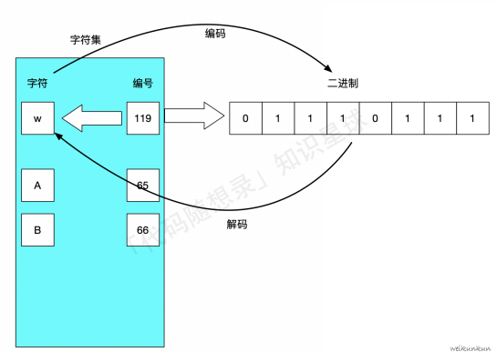
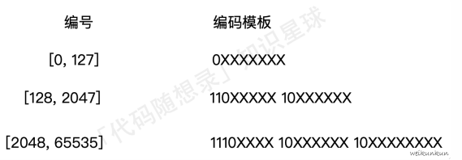
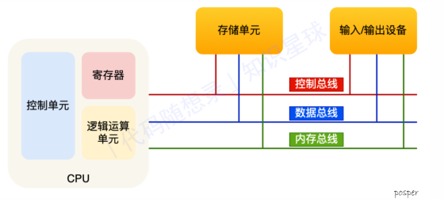

# 计算机系统

## 字符编码

我们通过在字符和⼆进制编码之间嵌套⼀个数字编号，通过数字编号，就能实现字符、⼆进制编码之间的关系绑定。 

像这样收录了很多的字符并⾏⼀⼀编号得到的⼀个对照表，我们称之为字符集。从⼆进制 -> 字符称为编码，从字符 -> ⼆进制称为解码

同⼀个⼆进制，在不同的字符集可能对应的字符不同，这也就导致了同⼀个⽂件，通过不同的字符集进⾏解码，呈现的结果不同（也就是我们所说的乱码）。如果有⼀种统⼀的编码形式（很全的字符集），对所有的字符 都能提供唯⼀的⼆进制编码，那么就能解决上述的问题。Unicode就是这个很全的字符集。

对于编码策略来说，还分为固定长度编码/可变长度编码

固定长度编码能⾼效、快速进⾏编码、解码，但也会导致内存的浪费。同时随着编码越来越⼤，编码之间的跨度也就越⼤，这样定长编码造成的浪费就更加显著

可变长度编码让小编号占用的字节少，大编码占用的字节多

这种编码方式其实就是我们所熟知的UTF-8编码，同时也是Go默认的编码⽅式

## 冯诺依曼模型

分为五大部件：内存、CPU、总线、输⼊设备、输出设备

内存：从 0 开始编号，最先存储单位是字节（byte），程序和数据都在内存中

CPU：

​	CPU 位宽： CPU ⼀次能处理多少字节的数据，32位一次性能计算4个字节，64位一次可以计算8个字节

​	为了能⼀次计算⼤数的运算，CPU需要⽀持多个byte⼀起计算，所以CPU位宽越⼤，可以计算的数值就越⼤

​	CPU内部还有⼀些组件，常见的有寄存器、控制单元和逻辑运算单元等

​	控制单元： 控制CPU⼯作；逻辑运算单元： 负责计算；寄存器： 在 CPU 中，计算速度快 

​	常见寄存器类型：

​		通⽤寄存器：放运算数据

​		程序记数器（PC）：⽤来存放 CPU 下⼀条要执⾏指令的 内存地址；

​		指令寄存器：⽤来存放 PC 执⾏的指令，即指令本⾝（取值后放⼊到指令寄存器中） 

总线：

⽤于 CPU 和内存以及其他设备之间的通信，总线可分为 3 种:

​	地址总线：⽤于指定CPU将要操作的内存地址

​	数据总线：⽤于读写内存的数据

​	控制总线：⽤于发送和接收信号，⽐如中断、设备复位等信号，CPU收到信号后⾃然进⾏响应，这时也需要控制总线

当CPU要读写内存数据的时候．⼀般需要通过两个总线：⾸先要通过「地址总线」来指定内存的地址；再通过「数据总线」来传输数据

程序的执行过程：

现代⼤多数 CPU 都使⽤来流⽔线的⽅式来执⾏指令，所谓的流⽔线就是把⼀个任务拆分成多个⼩任务，具体步骤为：

​	1.取指令

​	2.CPU 的控制单元向[地址总线]发送PC中的地址，从内存中找到待执⾏指令

​	3.将待执⾏指令通过数据总线传⼊到CPU中的指令寄存器中

​	4.⾃动更新 PC，指向下⼀条待执⾏指令的地址

​	5.分析指令

​	6.CPU分析「指令寄存器」中的指令，确定指令的类型和参数：

​		如果是计算类型的指令，就把指令交给「逻辑运算单元」运算

​		如果是存储类型的指令，则交由「控制单元」执⾏

​	7.执行指令

​	8.根据译指的结果，把指令交给 CPU 中响应的控件（逻辑运算单元/控制单元）执⾏

​	9.数据回写

​	10.CPU 将计算结果存回寄存器或者将寄存器的值存⼊内存

