# 计算机网络

## osI七层网络模型

应⽤层：⽹络服务与最终⽤户的⼀个接口。这⼀层为⽤户的应⽤程序提供⽹络服务。

表示层：数据的表⽰、安全、压缩。

会话层：通过传输层建⽴数据传输的通路。

传输层：定义了⼀些传输数据的协议和端口号，将从上层接收的数据进⾏分段和传输，到达⽬的地址后再进⾏重组。传输单位为段。

```
当传输层的数据包大小超过 MSS（TCP 最大报文段长度） ，就要将数据包分块，这样即使中途有一个分块丢失或损坏了，只需要重新发送这一个分块，而不用重新发送整个数据包。在 TCP 协议中，我们把每个分块称为一个 TCP 段
当设备作为接收方时，传输层则要负责把数据包传给应用，但是一台设备上可能会有很多应用在接收或者传输数据，因此需要用一个编号将应用区分开来，这个编号就是端口，传输层的报文中携带端口号，因此接收方可以识别报文发送给哪个应用
```

网络层：进⾏逻辑地址寻址，在位于不同地理位置的⽹络中的两个主机系统之间提供连接和路径选择。

```
IP 协议会将传输层的报文作为数据部分，再加上 IP 头组装成 IP 报文，如果 IP 报文大小超过 MTU（以太网中一般为 1500 字节）就会再次进行分片，得到一个即将发送到网络的 IP 报文（传输单位为包）
```

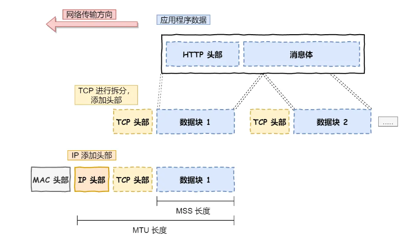

数据链路层：建⽴逻辑连接、进⾏硬件地址寻址、差错校验等功能。定义了如何让格式化数据以帧为单位进⾏传输，以及如何控制对物理介质的访问。将⽐特组合成字节进⽽组合成帧，⽤ MAC 地址访问介质。

物理层：定义物理设备标准，传输比特流。


## Linux接收网络包的流程

当网卡接收到一个网络包后，会通过 DMA 技术（直接内存访问，允许外设（如硬盘、网络适配器等）直接访问系统内存，而无需通过中央处理器（CPU）的介入，提升效率），将网络包写入到指定的内存地址，也就是写入到 Ring Buffer ，这个是一个环形缓冲区，接着就会告诉操作系统这个网络包已经到达。

告诉操作系统已经到达的方式是使用中断

如果直接使用硬中断（CPU停下手中的事情先处理中断），在网络包数量非常多的情况下，如果每个网络包都进行中断，会导致CPU效率大大下降。

新的NAPI机制就是为了解决硬中断带来的性能开销问题而提出，它是混合「中断和轮询」的方式来接收网络包，它的核心概念就是不采用中断的方式读取数据，而是首先采用中断唤醒数据接收的服务程序，然后 `poll` 的方法来轮询数据。

因此，当有网络包到达时，会通过 DMA 技术，将网络包写入到指定的内存地址，接着网卡向 CPU 发起硬件中断，当 CPU 收到硬件中断请求后，根据中断表，调用已经注册的中断处理函数。

硬件中断处理函数会做如下的事情：

​	1.需要先「暂时屏蔽中断」，表示已经知道内存中有数据了，告诉网卡下次再收到数据包直接写内存就可以了，不要再通知 CPU 了，这样可以提高效率，避免 CPU 不停的被中断。

​	2.接着，发起「软中断」，然后恢复刚才屏蔽的中断。

硬件中断处理函数做的事情很少，主要耗时的工作都交给软中断处理函数了。软中断使用轮询的方法将网络包逐层处理

### 发送网络数据的时候涉及几次内存拷贝操作

最少一次，最多三次

1.调用发送数据的系统调用的时候，内核会申请一个内核态的 sk_buff 内存，将用户待发送的数据拷贝到 sk_buff 内存，并将其加入到发送缓冲区

2.在使用 TCP 传输协议的情况下，从传输层进入网络层的时候，每一个 sk_buff 都会被克隆一个新的副本出来。副本 sk_buff 会被送往网络层，等它发送完的时候就会释放掉，然后原始的 sk_buff 还保留在传输层，目的是为了实现 TCP 的可靠传输，等收到这个数据包的 ACK 时，才会释放原始的 sk_buff （UDP有发送缓冲区，但不需要拷贝副本，因为是不可靠传输）

3.当 IP 层发现 sk_buff 大于 MTU 时才需要进行。会再申请额外的 sk_buff，并将原来的 sk_buff 拷贝为多个小的 sk_buff（IP分片）

## 浏览器输入网址后发生了什么

1.URI解析：包括解析协议（如HTTP或HTTPS）、主机名、端口号、路径等信息。如果输入的内容不是合法的 URL，浏览器可能会进行一些纠正，例如自动添加缺失的协议。

2.DNS解析：将主机名解析成对应的 IP 地址，以便建立连接。按照浏览器缓存→操作系统缓存→路由器缓存的顺序进行 DNS 查询，获取主机名对应的 IP 地址。如果缓存没有，就从右往左解析（以www.server.com.为例，. 根域是在最顶层，它的下一层就是.com顶级域，再下面是server.com）

3.建立TCP连接（HTTP需要通过TCP进行连接）：浏览器使用获取到的 IP 地址和端口号，通过 TCP 协议与服务器建立连接。这是一个三次握手的过程，确保客户端和服务器之间建立可靠的连接。

```
IP中还包括 ICMP 协议和 ARP 协议
ICMP 用于告知网络包传送过程中产生的错误以及各种控制信息
ARP 用于根据 IP 地址查询相应的以太网 MAC 地址
```

HTTP头部+TCP头部+IP头部生成后，还需要再IP头部的前面加上MAC头部，它包含了接收方和发送方的 MAC 地址等信息

4.发起HTTP请求： 浏览器通过已建立的 TCP 连接向服务器发送 HTTP 请求。请求包括请求方法（GET、POST等）、路径、HTTP 版本号等信息。如果是 HTTPS，还会进行 SSL/TLS 握手过程来建立安全连接。

5.服务器处理请求：服务器接收到请求后，根据请求的路径和其他信息，执行相应的处理。

6.服务器返回响应：生成一个 HTTP 响应，其中包括状态码、响应头和响应体。响应体包含了请求的实际内容，如 HTML、CSS、JavaScript 文件等。

7.浏览器解析渲染：浏览器接收到服务器的响应后，会开始解析内容。对于 HTML，浏览器会构建 DOM 树；对于 CSS，会构建样式规则；对于 JavaScript，会执行脚本。这些操作最终形成了用户在浏览器中看到的网页。

8.显式页面


## 三次握手与四次挥手

### 三次握手

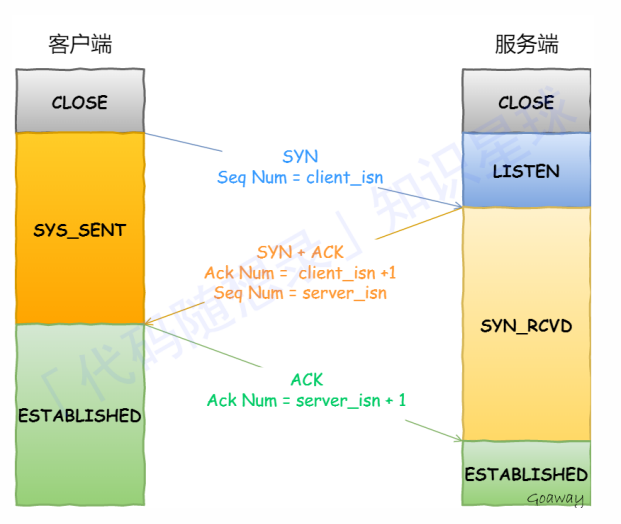

第一个SYN报文：客户端随机初始化序列号放入TCP首部序列号段，SYN置1。然后把SYN报文发送给服务端，表示发起连接，之后客户端处于SYN_SENT状态。

第二个SYN+ACK报文：服务端生成自己的序列号放入序列号段，确认号为客户端序列号+1，把SYN和ACK置为1。然后进入SYN_RCVD状态。

第三个ACK报文：确认号为服务端序列号+1，**这次报文可以携带客户到服务端的数据**，之后客户端处于ESTABLISHED状态。服务端在收到客户端的应答报文后，也进入ESTABLISHED状态。

### 为什么需要三次握手

核心点在于**为什么三次握手才可以初始化 Socket、序列号和窗口大小并建立 TCP 连接**

1.三次握手可以阻止重复历史连接的初始化（主因）

当旧的SYN报文先到达服务端时，服务端回复一个ACK和SYN报文。而客户端收到这个报文后，可以判断这是否是一个历史连接（确认号-1=旧的SYN报文的序列号，序列号过期或超时），那么客户端就会发送RST报文给服务端，表示终止这一次连接。

两次握手在收到服务端的响应后开始发⽣数据，不能判断当前连接是否是历史连接。

三次握⼿可以让客户端在第三次握手时判断是否是历史连接并中断连接。

2.三次握手才可以同步双方的初始序列号

TCP的通信双方都必须维护序列号，序列号是可靠传输的关键因素。

包括——接收端可以去除重复数据；接收端可以按照序列号顺序接收；标识发送的数据包，哪些已经被收到

两次握⼿只保证了⼀⽅的初始序列号能被对⽅成功接收，没办法保证双⽅的初始序列号都能被确认接收

3.避免资源浪费

两次握⼿会造成消息滞留情况下，服务器重复接受⽆⽤的连接请求 SYN 报⽂，⽽造成重复分配资源

只有两次握⼿时，如果客户端的SYN请求连接在⽹络中阻塞，客户端没有收到服务端的ACK报⽂，会重新发送 SYN

由于没有第三次握⼿，服务器不清楚客户端是否收到了⾃⼰发送的建⽴连接的 ACK 确认信号，所以每收到⼀个 SYN 就只能先主动建⽴⼀个连接

### 为什么每次建立TCP连接时，初始化的序列号要求不一样

1.为了防止历史报文被下一个相同四元组的连接接收（主要原因）

如果每次建立连接客户端和服务端的初始化序列号都「不一样」，就有大概率因为历史报文的序列号「不在」对方接收窗口，从而很大程度上避免了历史报文被下一个相同四元组的连接接收的问题

序列号的不一样不是完全的，因为序列号会有回绕的问题，所以需要用时间戳的机制来判断历史报文

初始序列的ISN的算法为 ISN = M + F

M：是一个计时器，这个计时器每隔 4 微秒加 1

F：是一个 Hash 算法，根据源 IP、目的 IP、源端口、目的端口生成一个随机数值。要保证 Hash 算法不能被外部轻易推算得出，用 MD5 算法是一个比较好的选择。

2.为了安全性，防止黑客伪造的相同序列号的 TCP 报文被对方接收

### TCP序列号和确认号

序列号 = 上一次**发送**的序列号 + len（数据长度）。特殊情况，如果上一次发送的报文是 SYN 报文或者 FIN 报文，则改为 上一次发送的序列号 + 1。

确认号 = 上一次**收到**的报文中的序列号 + len（数据长度）。特殊情况，如果收到的是 SYN 报文或者 FIN 报文，则改为上一次收到的报文中的序列号 + 1

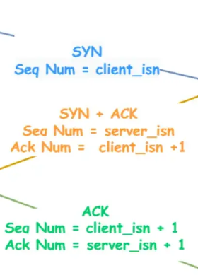

第三次握手的序列号是初始序列号+1的主要原因是SYN报文虽然不携带数据，但被视为一字节的数据，同理其他的+1也是这个原因。FIN报文也被视为携带1字节的数据。而ACK本身不携带数据。

序列号是根据自己发送的数据在下一次递增，确认号是根据别人发送来的数据立即递增

服务端在三次握手后，接下来期望收到的是序列号为 client_isn + 1 的 TCP 数据报文

四次挥手也是同理

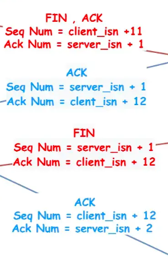

### 三次握手如何优化

#### 客户端优化

客户端重发SYN包的次数由 tcp_syn_retries 参数控制，默认是 5 次，每次超时时间是上一次的两倍。如果服务端仍然没有回应 ACK，客户端就会终止三次握手。

可以根据网络的稳定性和目标服务器的繁忙程度修改 SYN 的重传次数，调整客户端的三次握手时间上限。比如内网中通讯时，就可以适当调低重试次数，尽快把错误暴露给应用程序。

#### 服务端优化

半连接/全连接队列的增加，绕过半连接（synccookies），绕过三次握手（TCP Fast Open）

backlog，tcp_max_syn_backlog（半连接队列最大长度），somaxconn（监听队列的最大长度）都影响着半连接队列长度，min(backlog，somaxconn)影响accept队列长度。somaxconn是系统级别的参数，如果backlog设置大于它，则也会被截断

TCP Fast Open 在第一次三次握手时会让服务端生成Cookie，再次连接时把Cookie发送出去，如果验证成功，会直接发送数据，相较于传统的三次握手减少一个RTT

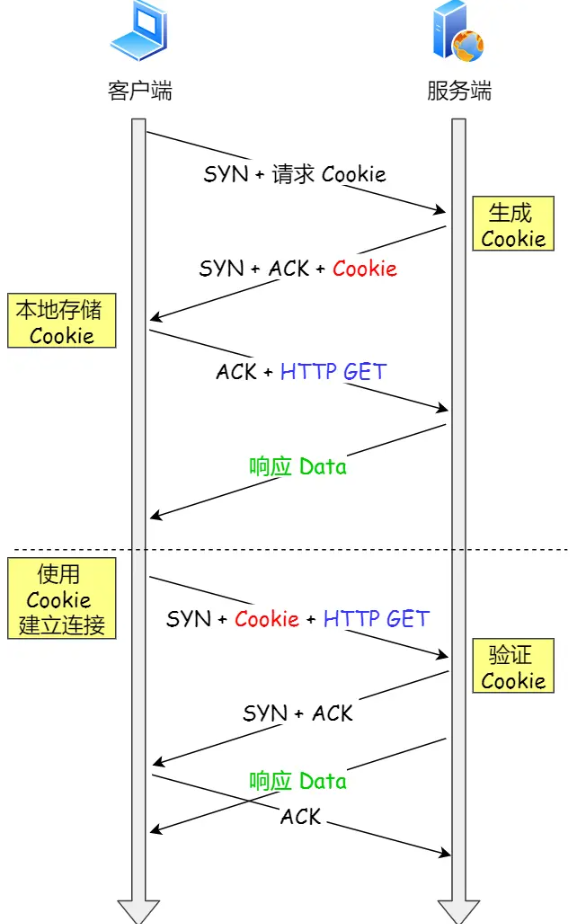

### 既然IP层会分片，为什么TCP还需要MSS

MTU：一个网络包的最大长度，以太网中一般为 1500 字节

MSS：除去 IP 和 TCP 头部之后，一个网络包所能容纳的 TCP 数据的最大长度

如果IP层出现了一个超过MTU大小的数据，那么IP层就要进行分片，此时如果一个 IP 分片丢失，整个 IP 报文的所有分片都得重传

因为 IP 层本身没有超时重传机制，它由传输层的 TCP 来负责超时和重传。因此由 IP 层进行分片传输，是非常没有效率的

为了达到最佳的传输效能 TCP 协议在建立连接的时候通常要协商双方的 MSS 值，当 TCP 层发现数据超过 MSS 时，则就先会进行分片，当然由它形成的 IP 包的长度也就不会大于 MTU ，自然也就不用 IP 分片了。经过 TCP 层分片后，如果一个 TCP 分片丢失后，进行重发时也是以 MSS 为单位，而不用重传所有的分片，大大增加了重传的效率。

### SYN报文被服务端直接丢弃的情况

半连接/全连接队列满了，新的SYN报文会被直接丢弃

服务端发现收到的数据包中时间戳不是递增的，则表示该数据包是过期的，就会直接丢弃这个数据包，这种情况出现的场景是：

​	1.客户端开启tcp_tw_recycle对处于TIME_WAIT状态下的端口进行复用

​	2.在NAT环境下（NAT用于将私有网络内部的设备与外部网络通信）

### 握手过程丢失时会发生什么

会触发超时重传机制，重传的内容与发出的内容相同。不同版本的操作系统可能超时时间不同，有的 1 秒的，也有 3 秒的，这个超时时间是写死在内核里的，如果想要更改则需要重新编译内核，比较麻烦。

同时，超时的重传次数也是内核定死的，每次超时的时间是上一次的两倍

### 什么是SYN 攻击，如何避免SYN攻击

TCP三次握手的时候，Linux 内核会维护两个队列，分别是：半连接队列（SYN队列，表示还没完成三次握手的连接请求）和全连接队列（accept队列，表示已经完成三次握手，已经建立连接的队列）

```
在早期 Linux 内核 backlog 是 SYN 队列大小，也就是未完成的队列大小。
在 Linux 内核 2.2 之后，backlog 变成 accept 队列，也就是已完成连接建立的队列长度，所以现在通常认为 backlog 是 accept 队列
```

TCP连接的正常流程：

​	1.当服务端接收到客户端的 SYN 报文时，会创建一个半连接的对象，然后将其加入到内核的「 SYN 队列」

​	2.接着发送 SYN + ACK 给客户端，等待客户端回应 ACK 报文

​	3.服务端接收到 ACK 报文后，从「 SYN 队列」取出一个半连接对象，然后创建一个新的连接对象放入到「 Accept 队列」

​	4.应用通过调用 accpet() socket 接口，从「 Accept 队列」取出连接对象

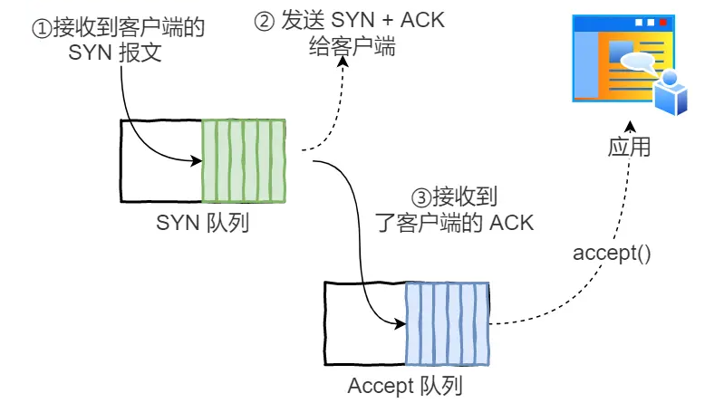

不管是半连接队列还是全连接队列，都有最大长度限制，超过限制时，默认情况都会丢弃报文。

假设攻击者短时间伪造不同 IP 地址的 `SYN` 报文，服务端每接收到一个 SYN 报文，就进入SYN_RCVD 状态，但服务端发送出去的 ACK + SYN 报文，无法得到未知 IP 主机的 ACK 应答，久而久之就会占满服务端的半连接队列，使得服务端不能为正常用户服务。这就是SYN 攻击。

避免SYN攻击方式有以下四种方法：

- 调大 netdev_max_backlog：当网卡接收数据包的速度大于内核处理的速度时，会有一个队列保存这些数据包。我们要适当调大控制该队列的最大值。
- 增大TCP 半连接队列
- 开启 net.ipv4.tcp_syncookies：开启 syncookies 功能就可以在不使用 SYN 半连接队列的情况下成功建立连接，相当于绕过了 SYN 半连接来建立连接。
- 减少 SYN+ACK 重传次数

### 连接完成的TCP，在收到同一客户端SYN后会发生什么

一个已经建立的 TCP 连接，客户端中途宕机了，而服务端此时也没有数据要发送，一直处于 Established 状态，客户端恢复后，向服务端建立连接，此时服务端会怎么处理

#### 客户端的 SYN 报文里的端口号与历史连接不相同

此时服务端会认为是新的连接要建立，于是就会通过三次握手来建立新的连接。对于旧的连接，会通过TCP保活机制检测没有存活后释放连接

#### 客户端的 SYN 报文里的端口号与历史连接相同

新的SYN内的序列号与最早连接的序列号显然不相同（SYN 报文的初始化序列号其实是一个随机数），而处于 Established 状态的服务端会回复一个携带了正确序列号和确认号的 ACK 报文，这个 ACK 被称之为 Challenge ACK。

接着，客户端收到这个 Challenge ACK，发现确认号（ack num）并不是自己期望收到的，于是就会回 RST 报文，服务端收到后，就会释放掉该连接。

### 四次挥手

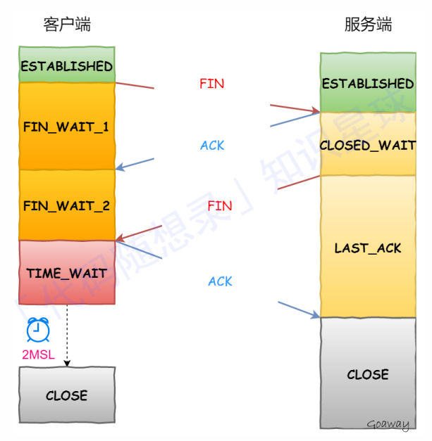

客户端打算关闭连接，因此发送一个TCP首部FIN标志位置为1的报文给服务端

服务端收到后，向客户端发送ACK应答报文，确认号为第一次挥手的序列号+1

等待服务端处理完数据后，向客户端发送FIN报文，确认号仍然为第一次挥手的序列号+1

客户端收到FIN报文后回一个ACK应答报文

服务器收到ACK报文后，进入close状态，服务器完成连接关闭

客户端在经过2MSL后，自动进入close状态，客户端也完成连接的关闭

每个方向都需要一个 FIN 和一个 ACK，同时，只有主动关闭连接的，才有 TIME_WAIT 状态

### 为什么需要四次挥手

关闭连接时，客户端发送FIN报文，表示其不再发送数据，但还能接受数据（TCP流是全双工的，在一个流内能同时写和读）

客户端收到FIN报⽂，先回⼀个ACK应答报⽂，服务端可能还要数据需要处理和发送，等到其不再发送数据时，才发送FIN报⽂给客户端表⽰同意关闭连接

Tips：

​	1.服务端通常需要等待完成数据的发送和处理，所以FIN和ACK的报文是分开发送的

​	2.第⼀次ACK应答报⽂可能会延迟发送，取决于延迟确认特性。(延迟确认是指接收方不立即对收到的数据包进行确认，而是等待一段时间，看是否有更多的数据包到达，然后一起进行确认。这样可以减少确认报文的数量，提高网络的利用率。)

​	3.实际上，在第二次FIN报文中也包含着ACK标志位，表示接收方对之前的数据进行了确认

### 四次挥手如如何优化

关闭连接的方式通常有两种，分别是 RST 报文关闭和 FIN 报文关闭

如果进程收到 RST 报文，就直接关闭连接了，不需要走四次挥手流程，是一个暴力关闭连接的方式

安全关闭连接的方式必须通过四次挥手，它由进程调用 close 和 shutdown 函数发起 FIN 报文（shutdown 参数须传入 SHUT_WR 或者 SHUT_RDWR 才会发送 FIN）。与close相比，shutdown可以只关闭一个方向的连接

主动方的优化包括：FIN报文重传次数的调整，调整处于FIN_WAIT2状态的客户端的时间和上限个数（只适用于close函数关闭，处于FIN_WAIT2状态的客户端也叫孤儿连接，需要减少内存消耗，超过数量时连接将直接释放），调整TIME_WAIT状态的上限个数（避免内存占用），复用 TIME_WAIT 状态的端口复用于作为客户端的新连接，注意该参数只适用于客户端（在TIME_WAIT 状态过多时）

### 四次挥手可以变成三次么

当被动关闭方在 TCP 挥手过程中，「没有数据要发送」并且「开启了 TCP 延迟确认机制」，那么第二和第三次挥手就会合并传输，这样就出现了三次挥手。

TCP延迟确认机制是默认开启的，所以抓包时，看到的三次挥手次数非常多

当发送没有携带数据的 ACK，它的网络效率也是很低的，因为它也有 40 个字节的 IP 头 和 TCP 头，但却没有携带数据报文。 为了解决 ACK 传输效率低问题，所以就衍生出了 TCP 延迟确认。 TCP 延迟确认的策略：

- 当有响应数据要发送时，ACK 会随着响应数据一起立刻发送给对方
- 当没有响应数据要发送时，ACK 将会延迟一段时间，以等待是否有响应数据可以一起发送（第二三次合并的核心）
- 如果在延迟等待发送 ACK 期间，对方的第二个数据报文又到达了，这时就会立刻发送 ACK

如果不开启TCP延时确认，即便没有数据发送，仍然是四次挥手

### 为什么TIME_WAIT等待的时间是2MSL

MSL是报文最大生存时间，超过这个时间的报文将被丢弃

网络中可能存在发送⽅的数据包，当这些发送⽅的数据包被接收⽅处理后又会向对⽅发送响应， 所以⼀来⼀回需要等待 2 倍的时间

2MSL 的时间是从客户端接收到 FIN 后发送 ACK 开始计时的。如果在 TIME-WAIT 时间内，因为客户端的 ACK 没有传输到服务端，客户端又接收到了服务端重发的 FIN 报⽂，那么 2MSL 时间将重新计时（第四次挥手没有接收到的时候）

### 为什么需要TIME_WAIT状态

主动发起关闭连接的一方才有TIME_WAIT状态

TIME_WAIT状态的原因主要有两点：

​	1.防止具有相同四元组的旧数据包被接收到（确保原来连接的数据包消失）

​	2.保证被动关闭连接的一方能被正确的关闭，即保证最后的ACK能让被动接收方接收，从而帮助其正常关闭（因为如果接收不到会在这段时间内重传一个FIN以获得客户端的确认），也就是全双工通信的可靠性

有相同端口的 TCP 连接被复⽤后，被延迟的相同四元组的数据包抵达了客户端，那么客户端是有可能接收这个过期的报⽂，这就会产⽣数据错乱等严重的问题。经过 2MSL 这个时间，⾜以让两个⽅向上的数据包都被丢弃，使得原来连接的数据包在⽹络中都⾃然消失，再出现的数据包⼀定都是新建⽴连接所产⽣的。

最后的ACK如果丢失，客户端直接进⼊close，服务端⼀直在等待ACK状态。当客户端发起建⽴连接的SYN请求， 服务端会发送RST报⽂回应，连接建⽴会关闭。 

### TIME_WAIT过多的危害

过多的TIME_WAIT状态主要的危害有两种：

​	1.内存资源占用

​	2.端口资源占用，甚至可能导致无法创建新连接

### 服务器出现大量TIME_WAIT状态的原因

表明服务器主动断开了很多的TCP连接，往往出现在以下场景：

1.HTTP没有使用长连接（从HTTP/1.1开始，就默认开启了Keep-Alive）

2.HTTP长连接超时（为避免资源浪费，web服务软件一般会开启一个定时器，如果客户端在完后一个 HTTP 请求后，在 60 秒内都没有再发起新的请求，定时器的时间一到，Web服务器就会触发回调函数来关闭该连接，那么此时服务端上就会出现 TIME_WAIT 状态的连接）

3.HTTP 长连接的请求数量达到上限（当超过最大限制时，就会主动关闭这个长连接）

### 服务器出现大量CLOSE_WAIT状态的原因

CLOSE_WAIT 状态是「被动关闭方」才会有的状态，而且如果「被动关闭方」没有调用 close 函数关闭连接，那么就无法发出 FIN 报文，从而无法使得 CLOSE_WAIT 状态的连接转变为 LAST_ACK 状态。（卡在第三次握手之前）

当服务端出现大量 CLOSE_WAIT 状态的连接的时候，说明服务端的程序没有调用 close 函数关闭连接。这一般是代码端的问题。

一个普通的 TCP 服务端的流程：

​	1.创建服务端 socket，bind 绑定端口、listen 监听端口

​	2.将服务端 socket 注册到 epoll：如果没有实现，在有新连接到来时，服务端没办法感知这个事件，也就无法获取到已连接的 socket，那服务端自然就没机会对 socket 调用 close 函数了

​	3.epoll_wait 等待连接到来，连接到来时，调用 accpet 获取已连接的 socket：如果没有做，会导致有大量的客户端主动断开了连接，而服务端没机会对这些 socket 调用 close 函数，从而导致服务端出现大量 CLOSE_WAIT 状态的连接

​	4.将已连接的 socket 注册到 epoll：如果没有将其注册到 epoll，导致后续收到 FIN 报文的时候，服务端没办法感知这个事件，那服务端就没机会调用 close 函数了

​	5.epoll_wait 等待事件发生

​	6.对方连接关闭时，我方调用 close：当发现客户端关闭连接后，服务端没有执行 close 函数，可能是因为代码漏处理，或者是在执行 close 函数之前，代码卡在某一个逻辑，比如发生死锁等等

### 四次挥手中收到乱序的 FIN 包会如何处理

在 FIN_WAIT_2 状态下，是如何处理收到的乱序到 FIN 报文，然后 TCP 连接又是什么时候才进入到 TIME_WAIT 状态?

在 FIN_WAIT_2 状态时，如果收到乱序的 FIN 报文，那么就被会加入到「乱序队列」，并不会进入到 TIME_WAIT 状态。等再次收到前面被网络延迟的数据包时，会判断乱序队列有没有数据，然后会检测乱序队列中是否有可用的数据，如果能在乱序队列中找到与当前报文的序列号保持的顺序的报文，就会看该报文是否有 FIN 标志，如果发现有 FIN 标志，这时才会进入 TIME_WAIT 状态。

### 如果已经建立了连接，但是客户端突然出现故障了怎么办？

如果服务端一直不会发送数据给客户端，那么服务端是永远无法感知到客户端宕机这个事件的，也就是服务端的 TCP 连接将一直处于 ESTABLISH 状态，占用着系统资源。

为了避免这种情况，TCP 搞了个保活机制，它定义一个时间段，在这个时间段内，如果没有任何连接相关的活动，TCP 保活机制会开始作用，每隔一个时间间隔，发送一个探测报文，该探测报文包含的数据非常少，如果连续几个探测报文都没有得到响应，则认为当前的 TCP 连接已经死亡，系统内核将错误信息通知给上层应用程序。

TCP保活的机制检测事件非常长（内核中设置的时间为2小时11分钟15秒），实际往往会在应用层实现一个心跳机制达成类似效果。也就是HTTP长连接的超时时间。

TCP保活机制需要考虑以下几种情况：

​	1.对端程序是正常工作的。当 TCP 保活的探测报文发送给对端, 对端会正常响应，这样 TCP 保活时间会被重置，等待下一个 TCP 保活时间的到来

​	2.对端主机宕机并重启。当 TCP 保活的探测报文发送给对端后，**对端是可以响应的，但由于没有该连接的有效信息，会产生一个 RST 报文**，这样很快就会发现 TCP 连接已经被重置

​	3.是对端主机宕机，实际上就会报告TCP连接已经死亡

### 如果已经建立了连接，但是服务端的进程崩溃会发生什么

TCP 的连接信息是由内核维护的，所以当服务端的进程崩溃后，内核需要回收该进程的所有 TCP 连接资源，于是内核会发送第一次挥手 FIN 报文，后续的挥手过程也都是在内核完成，并不需要进程的参与，所以即使服务端的进程退出了，还是能与客户端完成 TCP 四次挥手的过程。

注意“宕机”和“进程崩溃”的区别，如果是宕机，那会触发超时重传，失败就断开连接

### 在TIME_WAIT状态下的TCP连接，收到SYN后会发生什么

这个问题的本质是：“在 TCP 正常挥手过程中，处于 TIME_WAIT 状态的连接，收到相同四元组的 SYN 后会发生什么”

针对这个问题，关键是要看 SYN 的「序列号和时间戳」是否合法，因为处于 TIME_WAIT 状态的连接收到 SYN 后，会判断 SYN 的「序列号和时间戳」是否合法，然后根据判断结果的不同做不同的处理。

合法SYN有两点：

​	1.客户端(这里指的是挥手时的服务端)的 SYN 的「序列号」比服务端「期望下一个收到的序列号」要大

​	2. SYN 的「时间戳」比服务端「最后收到的报文的时间戳」要大

如果处于 TIME_WAIT 状态的连接收到「合法的 SYN 」后，就会重用此四元组连接，跳过 2MSL 而转变为 SYN_RECV 状态，接着就能进行建立连接过程。

如果处于 TIME_WAIT 状态的连接收到「非法的 SYN 」后，就会再回复一个第四次挥手的 ACK 报文（重传），客户端收到后，发现并不是自己期望收到确认号（ack num），就回 RST 报文给服务端

收到RST后的服务端/原客户端会根据内核设置选择提前结束 TIME_WAIT 状态或丢掉该 RST 报文

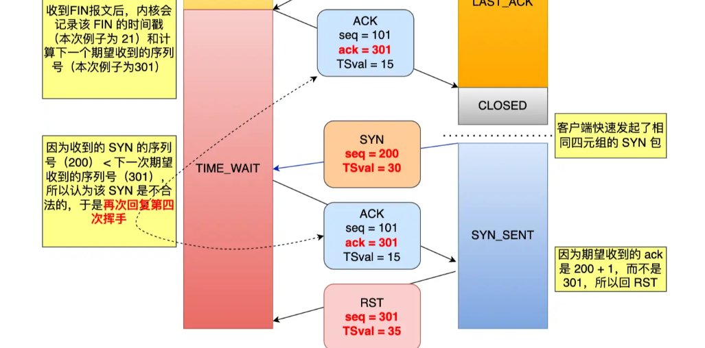

### TCP连接，一端断电和进程崩溃的情况

客户端/服务端进程崩溃，内核会发送 FIN 报文，与服务端进行四次挥手。

服务端宕机，客户端发送数据触发超时重连（每次时间X2，初始和次数内核设定），超过这个时间后自动断开

客户端宕机，根据服务端是否发送数据来分析：

​	1.服务端发送数据，同理触发超时重连后自动断开

​	2.服务端不发送数据，触发保活机制（TCP保活，如果有的话），探测对方是否存在，如果探测到对方已经消亡（超过一定次数），则会断开自身的 TCP 连接

​	3.如果没有开启，服务端的 TCP 连接会一直存在，并且一直保持在 ESTABLISHED 状态

### 拔掉网线后，原本的TCP是否还存在

有数据传输时：

- 如果服务端发送了数据报文，那么在服务端重传次数没有达到最大值之前，客户端就插回了网线，那么双方原本的 TCP 连接还是能正常存在，就好像什么事情都没有发生
- 服务端重传次数达到了最大值时，服务端就会断开 TCP 连接。等到客户端插回网线后，向服务端发送了数据，因为服务端已经断开了与客户端相同四元组的 TCP 连接，所以就会回 RST 报文，客户端收到后就会断开 TCP 连接。至此， 双方的 TCP 连接都断开了。

没有数据传输时：

- 双方都没有开启 TCP keepalive 机制，那么在客户端拔掉网线后，如果客户端一直不插回网线，那么客户端和服务端的 TCP 连接状态将会一直保持存在
- 双方都开启了 TCP keepalive 机制，那么在客户端拔掉网线后，如果客户端一直不插回网线，TCP keepalive 机制会探测到对方的 TCP 连接没有存活，于是就会断开 TCP 连接。而如果在 TCP 探测期间，客户端插回了网线，那么双方原本的 TCP 连接还是能正常存在

###  tcp_tw_reuse 为什么默认是关闭的

开启 tcp_tw_reuse 参数可以快速复用处于 TIME_WAIT 状态的 TCP 连接时，相当于缩短了 TIME_WAIT 状态的持续时间

内核在定位一个连接的时候，是通过四元组（源IP、源端口、目的IP、目的端口）信息来定位的，并不会因为客户端的端口一样，而导致连接冲突。所以端口本质是可以复用的。只要四元组不完全相同，如果完全相同就会发生冲突。

Linux 操作系统提供了两个可以系统参数来快速回收处于 TIME_WAIT 状态的连接，这两个参数都是默认关闭的：

- net.ipv4.tcp_tw_reuse，如果开启该选项的话，客户端（连接发起方，就是客户端） 在调用 connect() 函数时，如果内核选择到的端口，已经被相同四元组的连接占用的时候，就会判断该连接的端口是否处于 TIME_WAIT 状态，如果该连接处于 TIME_WAIT 状态并且 TIME_WAIT 状态持续的时间超过了 1 秒，那么就会重用这个连接，然后就可以正常使用该端口了。所以该选项只适用于连接发起方。
- net.ipv4.tcp_tw_recycle，如果开启该选项的话，允许处于 TIME_WAIT 状态的连接被快速回收，该参数在 NAT 的网络下是不安全的！（会导致SYN报文丢弃）

要使得上面这两个参数生效，有一个前提条件，就是要打开 TCP 时间戳，它有两个好处，一个是便于精确计算 RTT ，另一个是能防止序列号回绕（PAWS）

如果开启tcp_tw_reuse，可能会出现以下问题：

- 因为快速复用 TIME_WAIT 状态的端口，导致新连接可能被回绕序列号的 RST 报文（历史的RST报文）断开了，这也是因为没有等到2MSL，被旧的连接信息影响了
- 如果第四次挥手的 ACK 报文丢失了，有可能被动关闭连接的一方不能被正常的关闭

### 三次握手的socket编程

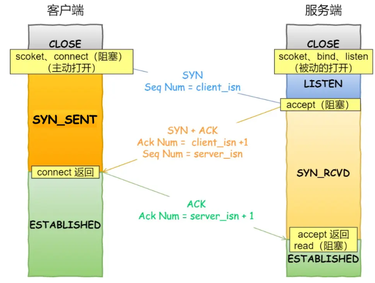

客户端 connect 成功返回是在第二次握手，服务端 accept 成功返回是在三次握手成功之后

### 四次挥手的socket编程

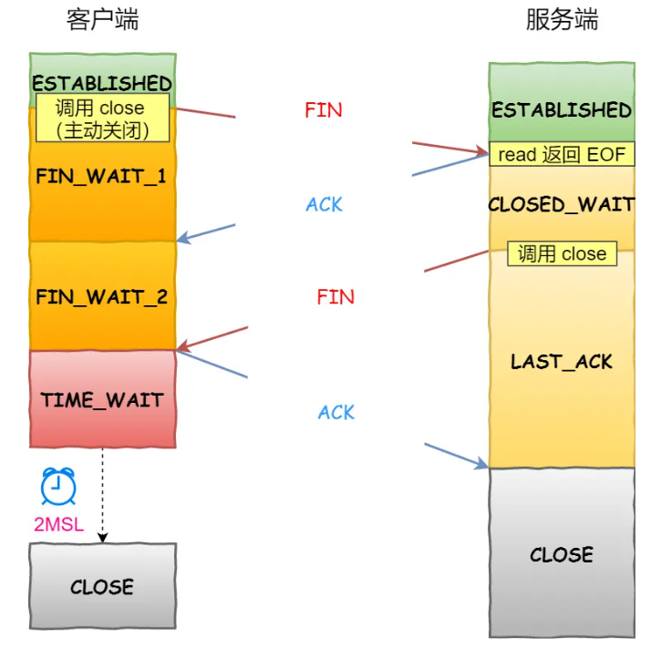

- 服务端接收到了 FIN 报文，TCP 协议栈会为 FIN 包插入一个文件结束符 `EOF` 到接收缓冲区中，应用程序可以通过 `read` 调用来感知这个 FIN 包。这个 `EOF` 会被放在已排队等候的其他已接收的数据之后，这就意味着服务端需要处理这种异常情况，因为 EOF 表示在该连接上再无额外数据到达。此时，服务端进入 CLOSE_WAIT 状态；
- 接着，当处理完数据后，自然就会读到 `EOF`，于是也调用 close 关闭它的套接字，这会使得服务端发出一个 FIN 包，之后处于 LAST_ACK 状态；

### 没有 accept，能建立 TCP 连接吗

是可以的，因为accpet 系统调用并不参与 TCP 三次握手过程，它只是负责从 TCP 全连接队列取出一个已经建立连接的 socket，用户层通过 accpet 系统调用拿到了已经建立连接的 socket，就可以对该 socket 进行读写操作了。

bind，listen，accept，read由服务端执行，socket，connect由客户端执行

accept阻塞直到三次握手完成，connect阻塞直到前两次握手完成

半连接队列其实被设计成了哈希表，而全连接队列本质是链表

```
全连接队列满了，再来第三次握手也会丢弃，此时如果tcp_abort_on_overflow=1，还会直接发RST给客户端
半连接队列满了，可能是因为受到了SYN Flood攻击，可以设置tcp_syncookies，绕开半连接队列
客户端没有半连接队列和全连接队列，但有一个全局hash，可以通过它实现自连接或TCP同时打开
```

### 没有listen，能建立TCP连接么

也是可以的，客户端是可以自己连自己的形成连接（TCP自连接），也可以两个客户端同时向对方发出请求建立连接（TCP同时打开），这两个情况都有个共同点，就是没有服务端参与，此时没有 listen，就能使用 TCP 建立连接。

在执行listen方法时，会创建半连接队列和全连接队列，而三次握手的过程中会在这两个队列中暂存连接信息

在 TCP 自连接的情况中，客户端在 connect 方法时，最后会将自己的连接信息放入到这个半连接队列的全局 hash 表中，然后将信息发出，消息在经过回环地址重新回到 TCP 传输层的时候，就会根据 IP + 端口信息，再一次从这个全局 hash 中取出信息。于是握手包一来一回，最后成功建立连接。

#### 在服务端没有listen，而客户端发起连接建立时的情况

服务端如果只 bind 了 IP 地址和端口，而没有调用 listen 的话，然后客户端对服务端发起了连接建立，服务端会回 RST 报文


### TCP的可靠性依靠的机制有哪些

重传机制、滑动窗口、流量控制、拥塞控制

## 重传机制（TCP传输层）

### 超时重传

TCP 实现可靠传输的方式之一，是通过序列号与确认应答。在 TCP 中，当发送端的数据到达接收主机时，接收端主机会返回一个确认应答消息，表示已收到消息。

超时重传的核心是设定一个计时器，当超过指定的时间后，没有收到对⽅的确认ACK应答报⽂，就会重发该数据

两种情况：数据包丢失，应答丢失

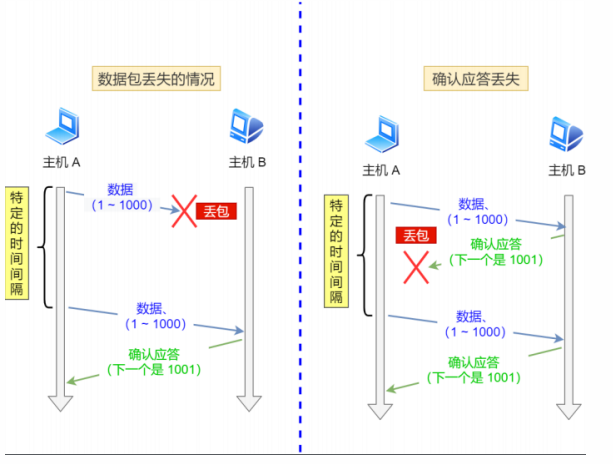

RTT：往返时延，即数据从发送端传到另一端后发送端收到确认消息的时间

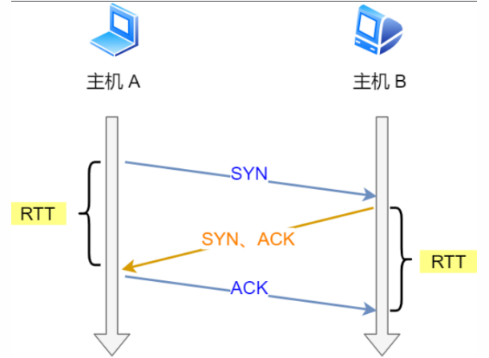

RTO：超时重传时间

超时重传时间既不能太大也不能太小，太大会降低网络传输效率，太小会出现不必要的重传导致网络的负载加大

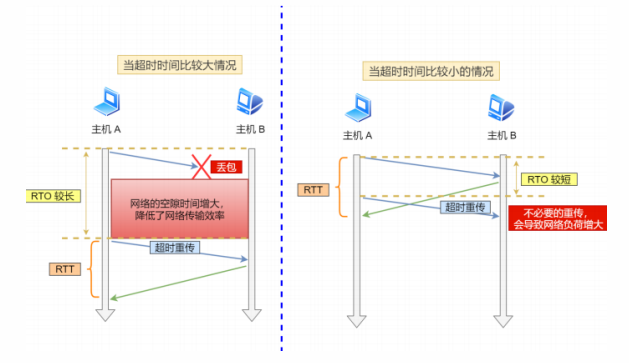

超时重传时间的值应该略大于报文往返RTT的值，且是动态变化的

估计RTT的方式通常有以下两种：

​	1.需要采样RTT的时间，进行加权平均，算出一个平滑RTT的值，同时这个值需要不断变化

​	2.还要采样RTT的波动范围，以避免RTT出现较大波动而不及时对估计进行调整

如果是超时重发的数据，再次超时又要重传的时候，TCP的策略是将超时时间隔加倍

### 快速重传

专门针对数据包丢失的情况。当收到三个相同的ACK报⽂时，会在定时器过期之前，重传丢失的报⽂段。

TCP的接收方存在”累计确认“的机制，表示已经成功接收的最后一个按序到达的数据包，如果某个数据包未按序到达，接收方会发送一个重复的确认，告诉发送方需要重传丢失的数据包。所以才会出现收到三个相同ACK报文的情况。注意，在发送重复确认的时候，其他数据还是正常发送和接收的，并不是阻塞的。

具体重传的时候，需要考虑是重传之前的一个，还是重传所有的问题。（我们通过确认号知道的只有丢失从什么地方开始）

SACK（选择性确认）：这种方式需要在TCP头部的“选项”字段里加一个SACK，它可以将将当前接收到的部分告诉发送方，这样发送方就可以知道具体数据的收到情况，并只重传丢失的数据。

显然，ACK中发送的内容，是“希望下一次发的内容”，与“实际接收到的内容”，并不一定相等

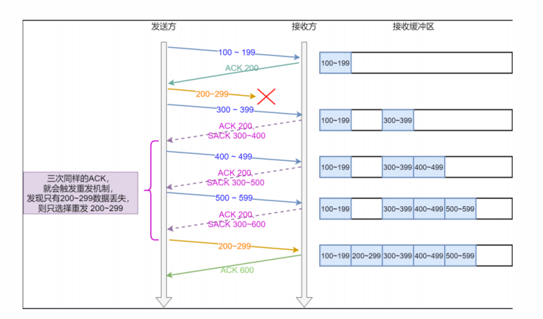

D-SACK（复制-选择性确认）：使用SACK告诉发送方有哪些数据被重复接收，适用于“正常发送，应答报文丢失”的场景，它不属于重传，属于一种反馈机制。但它运用到了重传的技术。

D-SACK的优势：

​	1.可以让发送方知道是发出去的包丢了，还是回传的ACK报文丢失

​	2.让发送方知道是否在重复发送

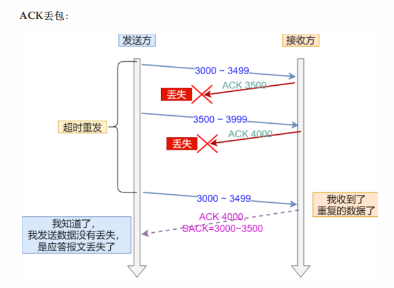

### 网络延时

网络延时可能会触发上述的所有重传内容：超时重传，快速重传（SACK），以及反馈D-SACK

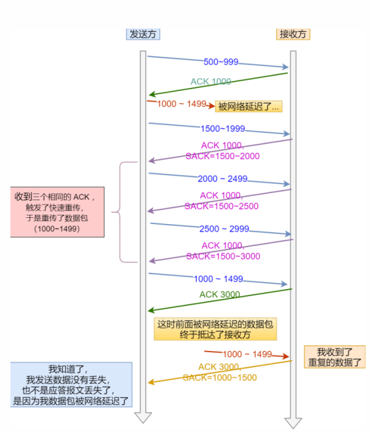

## 滑动窗口（TCP传输层）

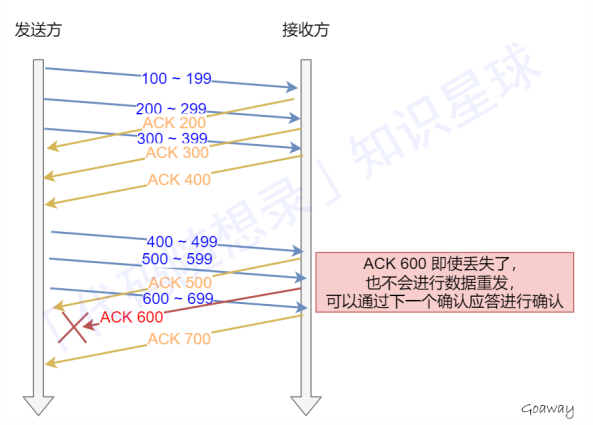

滑动窗口的核心是进行流控制，也可以在一定程度上确认报文丢失。

TCP每发送⼀个数据，都需要⼀次应答，然后继续发送，这样为每个数据包都进⾏确认应答，缺点是：数据往返时间越长，⽹络吞吐量越低。

引⼊窗口即使往返时间较长，也不会降低⽹络通信效率。可以指定窗口⼤⼩，窗口⼤⼩就是⽆需等待确认应答，继续发送数据的最⼤值。

窗口实现就是操作系统开辟的⼀个缓存空间，发送⽅主机在等到确认应答返回之前，必须在缓冲区中保留已发送的数据。如果按期收到确认应答，此时数据就可以从缓存区清除。

以上述图片为例，只要发送⽅收到了 ACK 700 确认应答，就意味着 700 之前的所有数据「接收⽅」都收到了。这个模式就叫累计确认或者累计应答。

TCP头部有⼀个字段叫window，窗口⼤⼩。这个字段是接收端告诉发送端⾃⼰还有多少缓冲区可以接收数据。于是发送端就可以根据这个接收端的处理能⼒来发送数据，⽽不会导致接收端处理不过来。

通常窗口的⼤⼩是由接收⽅的窗口⼤⼩来决定的。发送方发送的数据大小不能超过接收方的窗口大小，否则接收方就无法正常接收到数据。

滑动窗口以字节作为处理单位而不是以TCP的数据段作为单位有利于更精细的流控制，同时适应应用层的需求。

### 发送方的滑动窗口

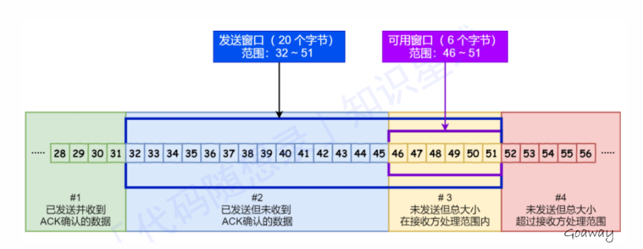

在数据进一步发送后，可用窗口的大小变为0，现在已经到了临界值，如果没收到ACK应答无法继续发送数据

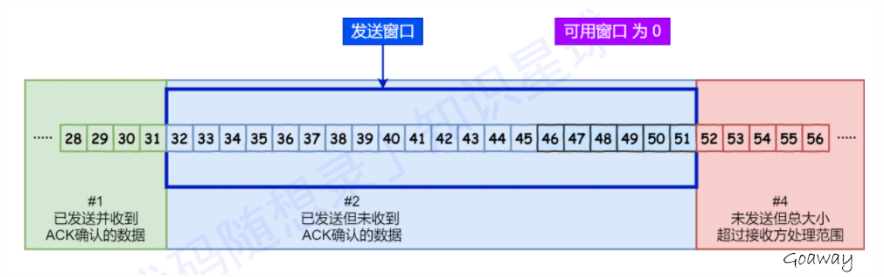

对于收到ACK的部分，滑动窗口会对应向右移动，发送窗口位置改变，可用窗口增加

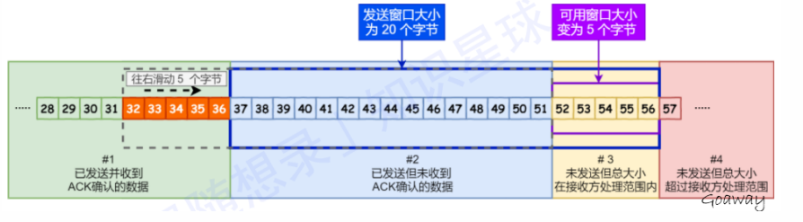

### 程序表示发送方窗口

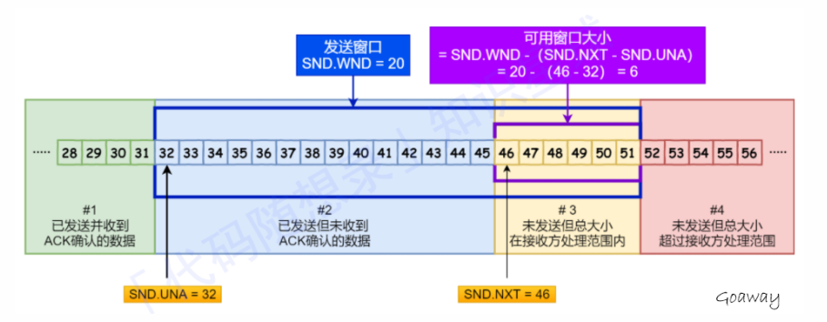

SYN.WND：表示发送窗口的大小（大小由接收方指定）

SYN.UNA：指向#2的第一个字节的序列号（已发送但未收到确认）

SYN.NXT：指向#3的第一个字节的序列号（未发送但在窗口内）

#4的第一个字节的序列号只需要将SYN.WND+SYN.UNA即可

可用窗口大小=发送窗口（SND.WND）-已发送未确定的大小（SND.NXT - SND.UNA）

### 接收方滑动窗口

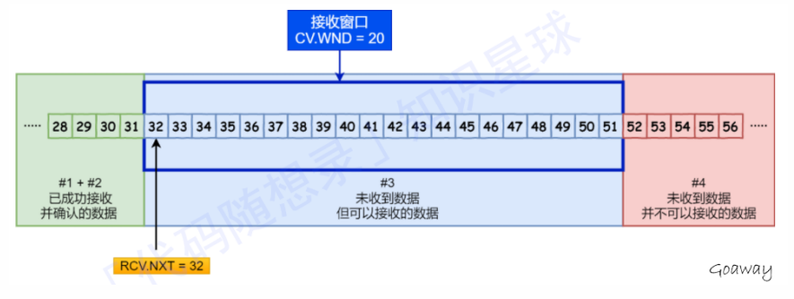

接收方滑动窗口主要包含接下来可以接收的数据部分，包含两个指针：

RCV.WND：表示接收窗口的大小

RCV.NXT：指向#3的第一个字节的序列号（期望从发送⽅发送来的下⼀个数据字节的序列号）


## 流量控制

TCP 提供一种机制可以让「发送方」根据「接收方」的实际接收能力控制发送的数据量，这就是所谓的流量控制。

其核心在于让接收方指明希望从发送方接收的数据大小（窗口大小）来进行流量控制。如果窗口大小为 0 时，就会阻止发送方给接收方传递数据，直到窗口变为非 0 为止，这就是窗口关闭。窗口关闭可能会导致潜在的死锁情况。

为了避免这个问题，TCP 为每个连接设有一个持续定时器，只要 TCP 连接一方收到对方的零窗口通知，就启动持续计时器。如果持续计时器超时，就会发送窗口探测 ( Window probe ) 报文，而对方在确认这个探测报文时，给出自己现在的接收窗口大小。

如果接收窗口仍然为 0，那么收到这个报文的一方就会重新启动持续计时器；如果接收窗口不是 0，那么死锁的局面就可以被打破了.

窗口探测的次数一般为 3 次，每次大约 30-60 秒（不同的实现可能会不一样）。如果 3 次过后接收窗口还是 0 的话，有的 TCP 实现就会发 RST 报文来中断连接

### 糊涂窗口综合症

当接收方太忙，来不及取走接收窗口里的数据时，会导致发送方的发送窗口越来越小。此时如果接收方腾出几个字节并告诉发送方现在有几个字节的窗口，而发送方会义无反顾地发送这几个字节，这就是糊涂窗口综合症，这样效率非常低（TCP+IP头部有40+字节）。

解决这个问题的方法有两个：

​	1.让接收方不通告小窗口给发送方（当窗口大小小于一定值时，直接通告为0）

​	2.让发送方避免发送小数据（使用 Nagle 算法，该算法的思路是延时处理，只有满足下面两个条件中的任意一个条件，才可以发送数据：1.要等到窗口大小 >= MSS 并且 数据大小 >= MSS。2.收到之前发送数据的 ack 回包）


## 拥塞控制

流量控制是避免「发送方」的数据填满「接收方」的缓存，但是并不知道网络的中发生了什么。一般来说，计算机网络都处在一个共享的环境。因此也有可能会因为其他主机之间的通信使得网络拥堵。拥塞控制通过拥塞窗口来防⽌过多的数据注⼊⽹络，使得⽹络中的路由器或者链路过载

拥塞窗口cwnd是发送⽅维护的⼀个状态变量，根据⽹络拥塞程度⽽变化

发送窗口的大小是swnd = min(cwnd, rwnd)，也就是拥塞窗口和接收窗口中的最⼩值

⽹络中没有出现拥塞，cwnd增⼤，出现拥塞，cwnd减⼩

只要发送⽅没有在规定时间内接收到 ACK 应答报⽂，也就是发⽣了超时重传，就会认为⽹络出现了拥塞

### 拥塞控制算法

#### 1.慢启动

当发送⽅每收到⼀个 ACK，拥塞窗口cwnd 的⼤⼩就会加 1（这里加的是1个MSS，即TCP最大报文段长度），所以发包的个数会呈指数型增长。1->2->4->8->2的平方

```
在 TCP 连接建立时，两端的通信实体会通过 TCP 选项字段中的 MSS 选项进行协商，以确定在这个连接上能够发送的最大报文段大小。MSS 是以字节为单位的值，通常是考虑了网络传输的最大单元（MTU）减去 TCP 头部和 IP 头部的长度。
MSS=MTU−TCP头部长度−IP头部长度
```

包含一个慢启动门限sshresh状态变量：

​	1.当cwnd<sshresh时，使用慢启动算法

​	2.当cwnd>=sshresh时，使用拥塞避免算法

#### 2.拥塞避免算法

⼀般来说 ssthresh 的初始⼤⼩是65535字节，会进行动态调整。超过后会进⼊拥塞避免算法。

它的规则是：每当收到⼀个 ACK 时，cwnd 增加1/cwnd（每次增加1/cwnd个MSS），cwnd增长量根据进入拥塞避免算法时的cwnd决定

拥塞避免算法就是将原本慢启动算法的指数增长变成了线性增长（“加法增长”），还是增长阶段，但是增长速度缓慢了⼀些

⽹络就会慢慢进⼊了拥塞的状况了，于是就会出现丢包现象，这时就需要对丢失的数据包进⾏重传

当触发重传机制后，也进入了拥塞发生算法

当网络出现拥塞，也就是会发生数据包重传，重传机制主要有两种：超时重传，快速重传（重传机制里的）

#### 3.快重传（门限都会被设置为当前拥塞窗口的一半）

发生超时重传的情况时：

​	1.ssthresh 设为 cwnd/2（注意是拥塞时的拥塞窗口的一半，而不是初始的慢启动门限的一半）

​	2.cwnd会被重置为1，突然回到慢启动会导致网络卡顿

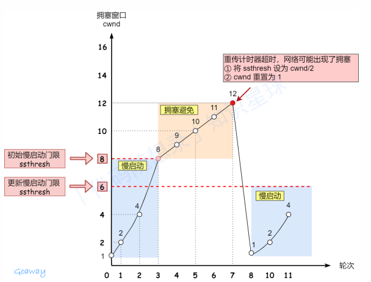

发生快速重传的情况时：

TCP 认为这种情况不严重，因为⼤部分没丢，只丢了⼀⼩部分，此时cwnd = cwnd/2 ，也就是设置为原来的⼀半，ssthresh = cwnd

发生超时重传和快速重传的情况下，慢启动门限都会被设置为当前拥塞窗口的一半，但超时重传此时会直接重置cwnd为1，重新进入慢启动，而快速重传时cwnd也回到原来的一半

进入快速恢复算法

#### 4.快恢复

1.拥塞窗口cwnd = ssthresh + 3 （维持一定的发送窗口大小，+3也是因为快速重传的时候会收到3个重复的ACK）

2.重传丢失的数据包

3.如果再收到重复的 ACK，那么 cwnd 增加 1

4.如果收到新数据的 ACK 后，把 cwnd 设置为第⼀步中的 ssthresh 的值，再次进入拥塞避免状态

注意，1-3步都是为了更快的将超时重传的数据包成功发送给目标，输出完成后重新进入拥塞避免

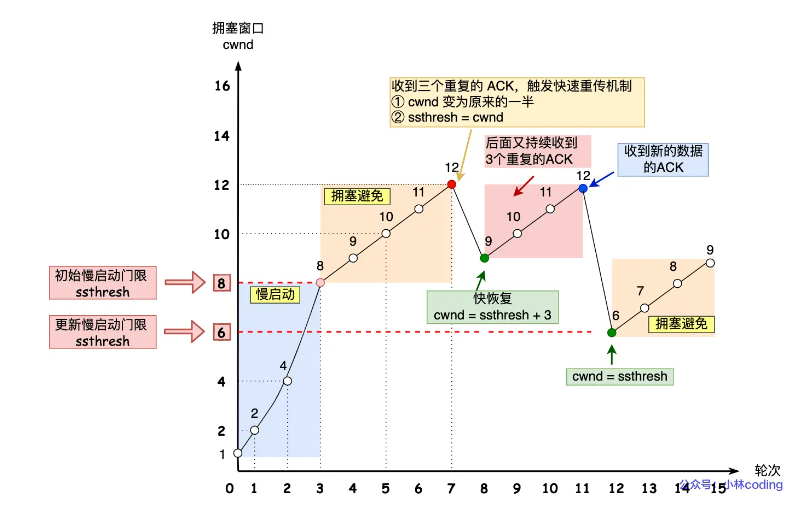


## Linux命令抓包

两大命令：tcpdump和Wireshark

- tcpdump 仅支持命令行格式使用，常用在 Linux 服务器中抓取和分析网络包。

- Wireshark 除了可以抓包外，还提供了可视化分析网络包的图形页面。

tcpdump抓取ping的数据包

```shell
tcpdump -i eth1 icmp and host 183.232.231.173 -nn
# -i eth1 抓取eth1网口的数据包
# icmp 抓取icmp协议的数据包（ping的数据包是icmp协议）
# host 主机过滤，抓取对应IP的数据包
# -nn 不解析IP地址和端口号的名称
```

tcpdump的常用选项和过滤表达式：

常用选项

| 选项 |         实例         |                          说明                          |
| :--: | :------------------: | :----------------------------------------------------: |
|  -i  |   tcpdump -i eth0    |       指定网络接口，默认为eth0，any表示所有接口        |
|  -m  |     tcpdump -nn      |               不解析IP地址和端口号的名称               |
|  -c  |     tcpdump -c 5     |                限制要抓取的网络包的个数                |
|  -w  | tcpdump -w file.pcap | 保存到文件中，通常以.pcap为后缀（Wireshark可以直接看） |

过滤表达式

|                             选项                             |                    实例                    |      说明       |
| :----------------------------------------------------------: | :----------------------------------------: | :-------------: |
|                   host，src host，dst host                   |       tcpdump -nn host 192.168.1.100       |    主机过滤     |
| port（匹配源或目标），src port（只匹配源），dst port（只匹配目标） |            tcpdump -nn port 80             |    端口过滤     |
|                 ip，ip6，arp，tcp，udp，icmp                 |              tcpdump -nn tcp               |    协议过滤     |
|                         and，or，not                         | tcpdump -nn host 192.168.1.100 and port 80 |   逻辑表达式    |
|                        tcp[tcoflags]                         | tcpdump -nn "tcp[tcpflags] & tcp-syn != 0" | 特定状态的TCP包 |


## TCP和UDP

### 什么是TCP

TCP 是面向连接的、可靠的、基于字节流的传输层通信协议

面向连接：一定是「一对一」才能连接，不能像 UDP 协议可以一个主机同时向多个主机发送消息，也就是一对多是无法做到的

可靠性：无论的网络链路中出现了怎样的链路变化，TCP 都可以保证一个报文一定能够到达接收端

字节流：1.TCP需要接收方确定消息边界以读出有效信息

​	       2.TCP报文是有序的，在前一个TCP 报文没有收到的时候，即使它先收到了后面的 TCP 报文，那么也不能扔给应用层去处理，同时对「重复」的 TCP 报文会自动丢弃

建立一个 TCP 连接是需要客户端与服务端达成上述三个信息的共识：Socket（由IP和端口号组成），序列号（用来解决乱序问题），窗口大小（用来做流量控制）

TCP 四元组可以唯一的确定一个连接，分别是：源地址，源端口，目的地址，目的端口

源地址和目的地址的字段（32 位）是在 IP 头部中，作用是通过 IP 协议发送报文给对方主机

源端口和目的端口的字段（16 位）是在 TCP 头部中，作用是告诉 TCP 协议应该把报文发给哪个进程

### 有一个 IP 的服务端监听了一个端口，它的 TCP 的最大连接数是多少

客户端 IP 和端口是可变的，其理论计算值如下：

最大TCP连接数 = 客户端的IP数 X 客户端的端口数

对 IPv4，客户端的 IP 数最多为 2 的 32 次方，客户端的端口数最多为 2 的 16 次方，也就是服务端单机最大 TCP 连接数，约为 2 的 48 次方

服务端最大并发 TCP 实际的连接数受到以下因素影响：

​	1.文件描述符限制，包括系统级，用户级和进程级（2048,64位）

​	2.内存限制

### TCP和UDP的区别

连接：TCP是⾯向连接的，在传输前需要三次握⼿建⽴连接，UDP不需要连接，即刻传输数据

服务形式：TCP只能⼀对⼀，点对点服务，UDP⽀持⼀对⼀、⼀对多、多对多通信

可靠性：TCP保证数据可靠交付，拥有确认应答和重传机制，⽆重复、不丢失、按序到达；UDP尽可能交付，不保证可靠性

连接控制机制：TCP拥有流量控制、拥塞控制，保证传输安全性等，UDP在⽹络拥堵情况下不会降低发送速率

首部大小：TCP⾸部长度在不使用选项字段的情况下是20字节，使⽤选项字段长度增加(总长度为20-60字节)，UDP⾸部固定8字节

传输方式：TCP基于字节流，没有边界，但是保证传输顺序和可靠性;UDP继承了IP层特性，基于数据包，有边界可能出现乱序和丢包

分片方式：TCP数据⼤于MSS时会在TCP层将数据进⾏分⽚传输，到达⽬的地后同样在传输层进⾏合并，如果有某个⽚丢失则只需要重传丢失的分⽚即可;

​		 UDP数据⼤于MTU时会在IP层分⽚，同样也在⽬的IP层合并，如果某个IP分⽚丢失，则需要将所有分⽚都进⾏重传，开销⼤

### TCP与UDP的头部格式

UDP：

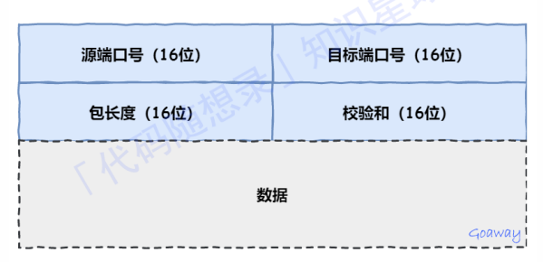

包长度：UDP首部的长度和数据的长度之和（注意是总和，TCP的首部长度不确定所以没有这个长度）

校验和：检验报文段是否出现差错

TCP：

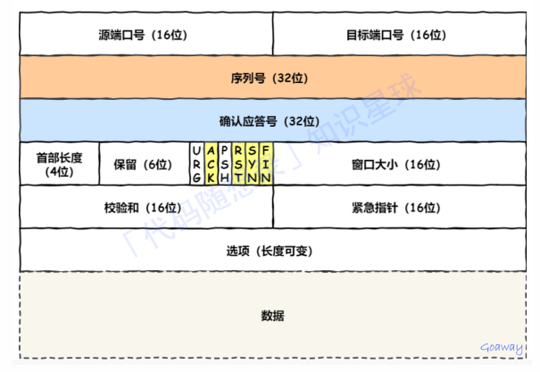

源端口号和目的端口号：⽤于多路复⽤/分解来⾃或送到上层应⽤的数据。告诉主机报⽂段来⾃哪⾥，传给哪个上层协议或应⽤程序

序列号：该报⽂段⾸字节的字节流编号，⽤来解决⽹络包乱序问题

确认应答号：对发送来的 TCP 报⽂段的响应，值是收到 的 TCP 报⽂段的序号值加1，⽤来解决不丢包的问题。序列号和确认应答号都⽤于实现可靠数据传输

首部长度：标识 TCP 头部有多少字节，最长 60

窗口大小：接收窗口，告诉对⽅本端TCP缓冲区还有多少空间可以接收数据，⽤来做流量控制

标志字段：

​	ACK：确认，表⽰确认应答号值是否有效，置1表⽰包含⼀个对已成功接收报⽂段的确认

​	RST：重置，可以拒绝一个连接请求或数据段

​	SYN：同步，请求建立一个连接

​	FIN：结束，用于断开连接，表示发送方并没有数据要继续传输

​	URG：紧急指针是否有效，与后面的紧急指针一起使用

​	PSH：服务端应立即从TCP接收缓冲区将数据读走，即应立即传递给上层应用，而不需要等待更多数据，对于及时响应的场景很有用

​	除了这6个外，还有NS（随机和，防止TCP发送端的数据包标记被意外或恶意改动），CWR(拥塞窗口减少请求量的标志)，ECE（拥塞控制的标志位，表示两端之间的通信是否存在网络拥塞，如果出现了就会置1）

校验和：接收⽅使⽤检验和来检查该报⽂段(头部+数据)中是否出现差错（CRC算法），同 UDP

### TCP可以和UDP使用同一个端口么

实际是可以的，传输层的「端口号」的作用，是为了区分同一个主机上不同应用程序的数据包，而传输层的TCP和UDP在内核中是两个完全独立的模块。因此在收到数据包后应先判断TCP/UDP，再通过[端口号]确定送给哪个应用程序处理。

### 为什么UDP是面向报文的协议，TCP是面向字节流的协议

当用户消息通过 UDP 协议传输时，操作系统不会对消息进行拆分，在组装好 UDP 头部后就交给网络层来处理，所以发出去的 UDP 报文中的数据部分就是完整的用户消息，也就是每个 UDP 报文就是一个用户消息的边界，这样接收方在接收到 UDP 报文后，读一个 UDP 报文就能读取到完整的用户消息。

即便UDP报文的大小大于MTU导致IP分片，每个分片仍然视为一个独立的 UDP 报文，不会在传输中被重组。

操作系统在收到 UDP 报文后，会将其插入到队列里，队列里的每一个元素就是一个 UDP 报文，这样当用户调用 recvfrom() 系统调用读数据的时候，就会从队列里取出一个数据，然后从内核里拷贝给用户缓冲区。

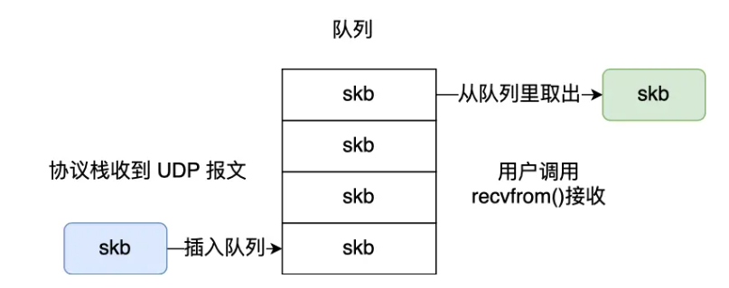

当用户消息通过 TCP 协议传输时，消息可能会被操作系统分组成多个的 TCP 报文，也就是一个完整的用户消息被拆分成多个 TCP 报文进行传输。

这时，接收方的程序如果不知道发送方发送的消息的长度，也就是不知道消息的边界时，是无法读出一个有效的用户消息的，因为用户消息被拆分成多个 TCP 报文后，并不能像 UDP 那样，一个 UDP 报文就能代表一个完整的用户消息。

在发送端，当我们调用 send 函数完成数据“发送”以后，数据并没有被真正从网络上发送出去，只是从应用程序拷贝到了操作系统内核协议栈中。什么时候真正被发送，取决于发送窗口、拥塞窗口以及当前发送缓冲区的大小等条件。

### 如果解决TCP粘包问题

本质就是如何划分出有效的用户信息，一般有三种方式：

1.固定长度的消息；2.特殊字符作为边界；3.自定义消息结构

特殊字符就是HTTP报文中常用的“/r/n”，自定义消息结构类似于HTTP响应报文中的Content-Length，即提前告诉数据的具体长度

### TCP选项

TCP头部的最后⼀个选项字段（options）是可变长的可选信息。这部分最多包含40字节。

选项的第⼀个字段kind说明选项的类型，有的TCP选项没有后⾯两个字段，仅包含1字节的kind字段

第⼆个字段length（如果有的话）指定该选项的总长度。该长度包括kind字段和length字段占据的2字节（kind和length各占据1字节长度，然后length里的内容是选项的总长度）

第三个字段info（如果有的话）是选项的具体信息

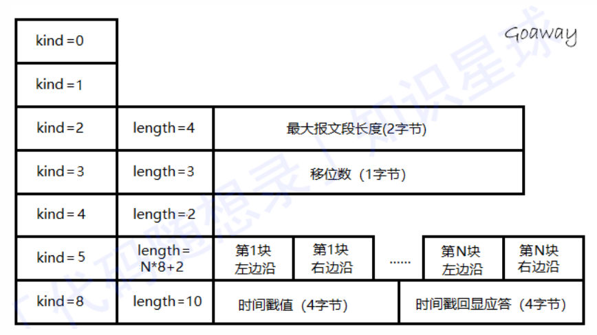

kind=0，选项表结束（EOP）选项：⼀个报⽂段仅⽤⼀次。放在末尾⽤于填充，⽤途是说明：⾸部已经没有更多的消息，应⽤数据在下⼀个32位开始处。（注意，TCP报文是32位对齐的，也就是即便选项字段只使用了8位，数据也仍然在选项前最后一位的32位之后，填充了24位）

kind=1，空操作（NOP）选项：没有特殊含义，⼀般⽤于将TCP选项的总长度填充为4字节的整数倍。

kind=2，最⼤报⽂段长度（MSS）选项：TCP连接初始化时，通信双⽅使⽤该选项来协商最⼤报⽂段长度。TCP模块通常将MSS设置为（MTU-40）字节 （减掉的这40字节包括20字节的TCP头部和20字节的IP头部）。这样携带TCP报⽂段的IP数据报的长度就不会超过MTU（假设TCP头部和IP头部都不包含选项字段，并且这也是⼀ 般情况），从⽽避免本机发⽣IP分⽚。

kind=3，窗口扩大因子选项：TCP连接初始化时，通信双⽅使⽤该选项来协商接收窗口的扩⼤因⼦。在TCP的头部中，接收窗口⼤⼩是⽤16位表示的，故最⼤为65535字节，但实际上TCP模块允许的接收窗口⼤⼩远不⽌这个数（为了提⾼TCP通信的吞吐量）。 窗口扩⼤因⼦解决了这个问题。假设 TCP 头部中的接收通告窗口⼤⼩是 N，窗口扩⼤因⼦（移位数）是 M，那么 TCP 报⽂段的实际接收通告窗口⼤⼩是 N*2M，或者说 N 左移 M 位。注意，M的取值范围是 0～14。

​	和 MSS 选项⼀样，窗口扩⼤因⼦选项只能出现在同步报⽂段中，否则将被忽略。但同步报⽂段本⾝不执⾏窗口扩⼤操作，即同步报⽂段头部的接收窗口⼤⼩就是该 TCP 报⽂段的实际接收窗口⼤⼩。当连接建⽴好之后，每个数据传输⽅向的窗口扩⼤因⼦就固定不变了。

kind=4，选择性确认（Selective Acknowledgment，SACK）选项：SACK 技术使 TCP 只重新发送丢失的 TCP 报⽂段，⽽不⽤发送所有未被确认的 TCP 报⽂段。选择性确认选项⽤在 连接初始化时，表⽰是否⽀持 SACK 技术。

kind=5，SACK实际⼯作的选项：该选项的参数告诉发送⽅本端已经收到并缓存的不连续的数据块，从⽽让发送端可以据此检查并重发丢失的数据块。接下来的每个数据块包含一个左边沿参数和右边沿参数，各4字节（因此一个数据块8字节），左边沿和右边沿表示的位置之间的部分就是缺失的内容。一个TCP首部最多包含4个这样的块，最终大小为34<40。

kind=8，时间戳选项：提供了较为准确的计算通信双⽅之间的回路时间（Round Trip Time，RTT）的⽅法，为TCP流量控制提供信息。

### SYN攻击

攻击者伪造不同IP地址的SYN报⽂请求连接，服务端收到连接请求后分配资源，回复ACK+SYN包，但是由于IP地 址是伪造的，⽆法收到回应，久⽽久之造成服务端半连接队列被占满，⽆法正常⼯作

避免方式：

​	1.修改半连接队列⼤⼩，使服务端能够容纳更多半连接。此外还可以修改服务端超时重传次数，使服务端尽早丢弃⽆⽤连接

​	2.当半连接队列满时，启动syn cookie,后续连接不进⼊半连接队列，⽽是计算⼀个cookie值，作为请求报⽂序列号发 送给客户端，如果服务端收到客户端确认报⽂，会检查ack包合法性，如果合法直接加⼊到accept队列

### TCP保活机制

在⼀个定义的时间段内TCP连接⽆任何活动时，会启动TCP保活机制，每隔⼀定时间间隔发送⼀个探测报⽂，等待响应

具体行为：

​	1.对端正常响应，重置保活时间

​	2.对端程序崩溃，响应⼀个RTS报⽂，将TCP连接重置

​	3.保活报⽂不可达，等待达到保活探测次数后关闭连接

### TCP流量控制的必要性

1.由于通讯双⽅⽹速不同，通讯⽅任意⼀⽅发送过快都会导致对⽅详细处理不过来，所以就需要把数据放到缓冲区中

2.如果缓冲区满了，发送⽅还在疯狂发送，那接收⽅只能把数据包丢弃。因此我们需要控制发送速率

3.我们缓冲区剩余⼤⼩称之为接收窗口，⽤变量win表⽰。如果win=0，则发送⽅停⽌发送

### TCP传输数据的性能提升

TCP 的传输速度，受制于发送窗口与接收窗口，以及网络设备传输能力。其中，窗口大小由内核缓冲区大小决定。如果缓冲区与网络传输能力匹配，那么缓冲区的利用率就达到了最大化。

带宽时延积 = RTT * 带宽。100 MB/s * 0.01s（RTT为10ms）=1MB字节，表示客户端到服务端的网络一共可以存放1MB的字节

由于发送缓冲区大小决定了发送窗口的上限，而发送窗口又决定了「已发送未确认」的飞行报文的上限。因此，发送缓冲区不能超过「带宽时延积」，同时，其大小最好是往带宽时延积（BDP）靠近。

数据优化的策略有：扩大滑动窗口大小，调整发送/接受缓冲区范围，打开接收缓冲区动态调节，调整内存范围

### 用了TCP协议，数据一定不会丢么

发送窗口和滑动窗口并不是完全相等的概念，前者表示“表示在不等待确认的情况下，发送方可以连续发送的数据量”，后者表示“接收方缓冲区的大小，也就是接收方愿意接受的未确认数据的最大量”，发送窗口不能超过接收方的滑动窗口大小

#### 建立连接时丢包

全连接/半连接队列满时，新来的连接直接丢弃

#### 流量控制丢包

发送数据过快，而流量控制的队列长度不够大时，可能会出现丢包现象

#### 网卡丢包

传统的问题例如网线质量差，解除不良等。

网卡的传输速度是有上限的，在网络传输速度过大，达到网卡上限时，就会发生丢包。网卡的单位是Mb/s，注意b是“bit”，如果是字节byte还要除以8

1000 Mb/s = 125MB/s = 每秒125X1024字节

#### 接收缓冲区丢包

接收方接收数据时，会先将数据暂存到内核下的接收缓冲区中，等待内核触发软中断输出。如果缓冲区过小，而发送数据过快，可能发生溢出并导致丢包

内核会分配发送/接收缓冲区，分别在发送方和接收方中。

发送方一般不会发生丢包，send函数主要负责将数据拷贝到内核的发送缓冲区，而实际的发送由内核做决定：

​	1.当send是阻塞时，如果是阻塞调用，就等到缓冲区有空位后再执行

​	2.如果是非阻塞，那么会直接返回一个错误信息，不会发生丢包

对于接收方，当接收缓冲区满时，它的TCP接收窗口会变为0，也就是所谓的零窗口，此时会通过数据包中的窗口字段win=0告诉发送端无法接收新数据，如果这个时候还有数据发来，就会发生丢包

#### 两端之间的外部网络丢包

网络传输中间的路由器和交换机出现丢包

丢包处理可以通过ping和mrt（查看到你的机器和目的机器之间的每个节点的丢包情况，mrt -r host）

#### 丢包后的处理/避免丢包的方法

丢包后的处理最直接的就是使用TCP不断尝试重连数据，如果重试直到超时都失败，就会汇报失败（微信上的等待圈和红色感叹号）

TCP本质只是保证传输层的可靠性，应用层是无法保证的，例如接收端在收到数据时应用崩溃。

处理这种问题最简单的方法就是引入第三方服务器，用第三方服务器作为中间人进行消息同步，同时减少资源消耗（每个使用者都只要与服务端建立一次连接，然后由服务端进行分发），进行有效加密保障安全，提升兼容性

### TCP协议的缺陷

1.升级TCP的工作很困难， TCP 协议是在内核中实现的，应用程序只能使用不能修改，如果要想升级 TCP 协议，那么只能升级内核

2.TCP延迟很大，如果使用的是HTTPS的话，在TCP 三次握手之后，还需要经过 TLS 四次握手后，才能进行 HTTP 数据的传输，这在一定程序上增加了数据传输的延迟

3.TCP存在队头阻塞的问题，TCP 层必须保证收到的字节数据是完整且有序的，如果序列号较低的 TCP 段在网络传输中丢失了，即使序列号较高的 TCP 段已经被接收了，应用层也无法从内核中读取到这部分数据。

4.网络迁移需要TCP连接，TCP需要通过四元组确定一条TCP连接，而当其中一个出现变化时（例如当移动设备的网络从 4G 切换到 WIFI 时，导致 IP 地址变化），就必须重新建立连接，导致网络卡顿，成本很大。

### 如何基于UDP实现可靠传输

基于UDP的QUIC协议，应用于HTTP/3

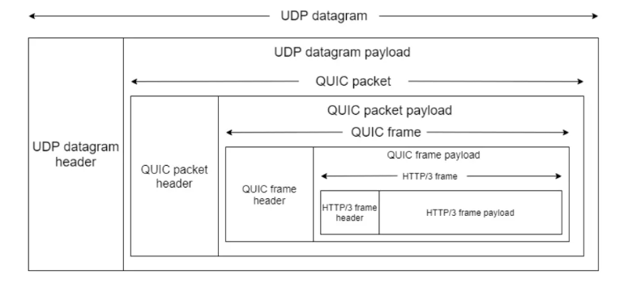

#### QUIC可靠传输的实现

QUIC 也是需要三次握手来建立连接的，主要目的是为了协商连接 ID。协商出连接 ID 后，后续传输时，双方只需要固定住连接 ID，从而实现连接迁移功能。（**也避免了迁移时的重新连接成本**）

报文编号严格递增，即便是重传报文，也是递增的，这样可以更精确的计算出报文的RTT

QUIC 使用的 Packet Number 单调递增的设计，还可以让数据包不再像 TCP 那样必须有序确认。QUIC 支持乱序确认，当数据包Packet N 丢失后，只要有新的已接收数据包确认，当前窗口就会继续向右滑动

QUIC Frame Header会帮助确认重传数据包的 Packet N+M 与丢失数据包的 Packet N的内容一致。这主要通过 Stream ID + Offset 字段信息实现数据的有序性，通过比较两个数据包的 Stream ID 与 Stream Offset ，如果都是一致，就说明这两个数据包的内容一致。

这些数据包传输到接收端后，接收端能根据 Stream ID 与 Offset 字段信息将 Stream x 和 Stream x+y 按照顺序组织起来，然后交给应用程序处理。

总结：单向递增+流ID及偏移确认

#### QUIC解决队头阻塞

队头阻塞的核心，在于是因为 TCP 必须按序处理数据，也就是 TCP 层为了保证数据的有序性，只有在处理完有序的数据后，滑动窗口才能往前滑动，否则就停留，停留「接收窗口」会使得应用层无法读取新的数据。

对于HTTP 2.0版本来说，因为允许多个流复用TCP连接，因此多个 Stream 共用同一个 TCP 滑动窗口，那么当发生数据丢失，滑动窗口是无法往前移动的，此时就会阻塞住所有的 HTTP 请求，这属于 TCP 层队头阻塞。

在一条QUIC上，也可以并发发送多个 HTTP 请求，而且每一个 Stream 都分配了一个独立的滑动窗口，让每个流之间相互独立

#### QUIC实现流量控制

- 通过 window_update 帧告诉对端自己可以接收的字节数，这样发送方就不会发送超过这个数量的数据。

- 通过 BlockFrame 告诉对端由于流量控制被阻塞了，无法发送数据。

QUIC 实现了两种级别的流量控制，分别为 Stream 和 Connection 两种级别：

- Stream 级别的流量控制：Stream 可以认为就是一条 HTTP 请求，每个 Stream 都有独立的滑动窗口，所以每个 Stream 都可以做流量控制，防止单个 Stream 消耗连接（Connection）的全部接收缓冲。QUIC 的接收窗口的左边界滑动条件取决于接收到的最大偏移字节数。（能通过偏移确保有序）

- Connection 流量控制：限制连接中所有 Stream 相加起来的总字节数，防止发送方超过连接的缓冲容量。

对于 Connection 级别的流量窗口，其接收窗口大小就是各个 Stream 接收窗口大小之和。

#### QUIC对拥塞控制改进

对于应用层协议来说，QUIC可以针对不同的应用设置不同的拥塞控制算法，这样灵活性和迭代速度就很高了

#### QUIC更快的连接建立

QUIC因为在应用层，可以直接在连接的过程中包含TLS，再加上 QUIC 使用的是 TLS1.3，因此仅需 1 个 RTT 就可以「同时」完成建立连接与密钥协商，甚至在第二次连接的时候，应用数据包可以和 QUIC 握手信息（连接信息 + TLS 信息）一起发送（会话恢复），达到 0-RTT 的效果。

#### QUIC的连接迁移

基于连接ID而不是四元组，可以很轻松实现迁移。


## HTTP

### HTTP介绍

HTTP的优点：

​	1.简单，基本报⽂格式为header+body，头部信息也是key-value简单⽂本的形式，易于理解

​	2.灵活性与扩展性，HTTP协议允许开发人员自定义和扩充。HTTP工作在应用层，下层可以随意变化。HTTPS就是在HTTP与TCP之间增加了SSL/TSL安全传输层，HTTP/3把TCP换成了基于UDP的QUIC

HTTP的缺陷：

​	1.无状态，服务器不会去记忆HTTP的状态，所以不需要额外的资源来记录状态信息，这能减轻服务器的负担。但它在完成有关联性的操作时会⾮常⿇烦

​	2.明文传输，传输过程中的信息，是可⽅便阅读的，但信息透明，容易被窃取

​	3.不安全，通信使⽤明⽂（不加密），内容可能被窃听；不验证通信⽅的⾝份，因此有可能遭遇伪装；⽆法证明报⽂的完整性，所以有可能已遭篡改

可以⽤ HTTPS 的⽅式解决，也就是通过引⼊ SSL/TLS 层，使得在安全上达到了极致

HTTP：Hyper Text Transfer Protocol：超⽂本传输协议

HTTPS：Hyper Text Transfer Protocol Secure：超⽂本安全传输协议

SSL：Secure Socket Layer 安全套接字

TSL：Transport Layer Security 安全传输层协议

HTTPS = HTTP+SSL/TSL

### HTTP的常见字段（在请求头和响应头内）

请求头中：

​	1.Host：指定要访问的主机和端口

​	2.User-Agent：标识客户端的用户代理（浏览器或其他应用程序）

​	3.Connection：客户端要求服务器使用「HTTP 长连接」机制，以便其他请求复用。HTTP 长连接的特点是，只要任意一端没有明确提出断开连接，则保持 TCP 连接状态。如果想要使用长连接，需要加上键值对“Connection: Keep-Alive”

响应头中：

​	1.Content-Length：表明本次回应的数据长度。这主要是为了解决TCP的“粘包”问题（“明确TCP字节流发送的边界”），实际上，HTTP 协议通过设置回车符、换行符作为 HTTP header 的边界，通过 Content-Length 字段作为 HTTP body 的边界都是为了解决粘包问题

​	2.Content-Type：表明本次数据是什么格式，客户端请求的时候，可以使用 Accept 字段声明自己可以接受哪些数据格式

​	3.Content-Encoding：说明数据的压缩方法。表示服务器返回的数据使用了什么压缩格式，客户端在请求时，用 Accept-Encoding 字段说明自己可以接受哪些压缩方法

### 输入网址到网页显示的相关概念

URL：统一资源定位符（网址），格式为“Scheme：//host.domain:port/path/filename”

​	Scheme：定义因特⽹服务类型 http/https/ftp/file

​	Host：定义域主机（http默认主机为www）

​	Domain：因特⽹域名（例如Baidu.com）

​	Port：主机上端口号（http：80，https：443）

​	Path：服务器上的路径（若省略，则⽂档必位于⽹站根⽬录）

​	Filename：⽂档/资源名称

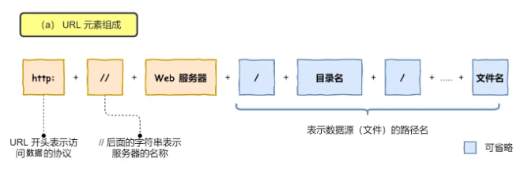

DNS：DNS协议⽤来将域名转换为IP地址，也可将IP地址转换为相应的域名地址

​	  DNS：⾯向⽤户，IP：⾯向主机

​	 域名服务主要是基于UDP实现的，服务器端口号为53

DNS解析过程：

​	浏览器查询URL对应IP：浏览器缓存→操作系统缓存→路由器缓存;

​	三种类型的DNS服务器：根DNS服务器、顶级域DNS服务器、权威DNS服务器;

### HTTP请求

http请求为DNS解析获得IP地址后，通过TCP三次握手，HTTP请求相应消息，关闭TCP连接

HTTP请求报文主要由请求行，请求头和请求体构成

请求行（包括请求方法；URL；协议版本号）——

​	请求方法：GET，POST，PUT，DELETE，PATCH，HEAD，OPTIONS，TRACE

​	URL：<协议>: //<主机>:<端口>//<路径>？<参数>

​	协议版本号：HTTP版本号

请求头——

​	包含请求的附加信息，由key:value组成

请求体——

​	承载多个请求参数的数据。含回车，换行和请求数据（并非都有）

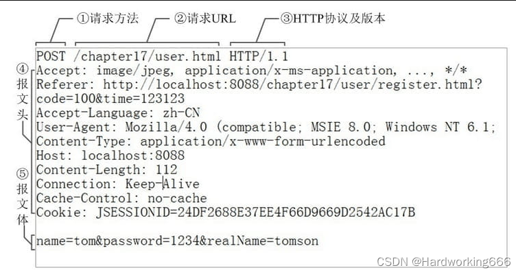

### HTTP响应报文

响应报文主要由响应行，响应头和响应主体构成

响应行（包括协议版本，状态码，状态码描述）

响应头（类似于请求头），响应体（类似于请求体）

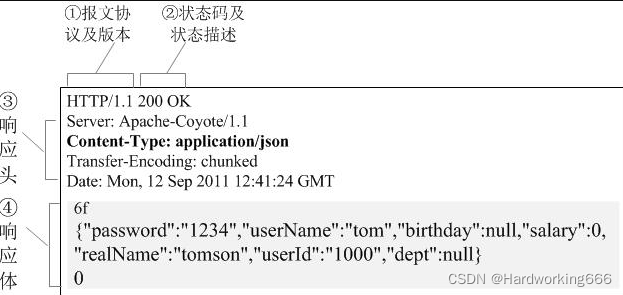

五类HTTP状态码

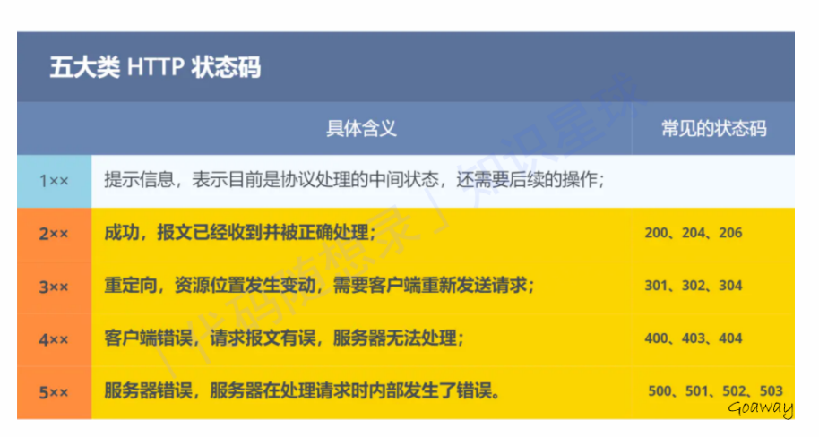

常见状态码描述——200 OK：客户端请求成功

​				204 No Content：与 200 OK 基本相同，但响应头没有 body 数据

​				206 Partial Content：服务器已经正确处理部分GET请求，实现断点续传或同时分⽚下载，该请求必须包含Range请求头来指⽰客户端期望得到的范围

​				301 Moved Permanently（永久重定向）：该资源已被永久移动到新位置，将来任何对该资源的访问都要使⽤本响应返回的若⼲个URL 之⼀

​				302 Found（临时重定向）：请求的资源现在临时从不同的URI中获得

​				304 Not Modified：表示资源未修改，重定向已存在的缓冲文件，也称缓存重定向，也就是告诉客户端可以继续使用缓存资源，用于缓存控制。

​				400 Bad Request：请求报⽂语法有误，服务器⽆法识别

​				401：请求需要认证

​				403 Forbidden：请求的对应资源禁⽌被访问

​				404 Not Found：服务器⽆法找到对应资源

​				500 Internal Server Error：服务器内部错误 

​				501 Not Implemented：客户端请求的功能还不支持

​				502 Bad Gateway：服务器作为网关或代理时返回的错误码，表示服务器自身工作正常，访问后端服务器发生了错误

​				503 Server Unavailable：服务器正忙

### HTTP请求过程

1.⾸先，我们在浏览器地址栏中，输⼊要查找页⾯的URL，按下Enter

2.浏览器依次在 浏览器缓存 -->>系统缓存 -->>路由器缓存中去寻找匹配的URL，若有，就会直接在屏幕中显⽰出页⾯内容。若没有，则跳到第三步操作

3.发送HTTP请求前，浏览器需要先进⾏域名解析(即DNS解析)，以获取相应的IP地址;（浏览器DNS缓存、路由器 缓存、DNS缓存）

4.获取到IP地址之后，浏览器向服务器发起TCP连接，与浏览器建⽴TCP三次握⼿

5.握⼿成功之后，浏览器就会向服务器发送HTTP请求，来请求服务器端的数据包

6.服务器处理从浏览器端收到的请求，接着将数据返回给浏览器

7.浏览器收到HTTP响应

8.查询状态，状态成功则进⾏下⼀步，不成功则弹出相应指⽰

9.再读取页⾯内容、进⾏浏览器渲染、解析HTML源码;（⽣成DOM树、解析CCS样式、处理JS交互，客户端和服务器交互）进⾏展⽰

10.关闭TCP连接（四次挥⼿）

### HTTP请求方法

 GET：申请获取资源，不对服务器产⽣影响

POST：客户端向服务器提交数据。会影响服务器，服务器可能动态创建新的资源或更新原有资源

HEAD：类似GET，仅要求服务器返回头部信息

PUT：上传某个资源

DELETE：删除某个资源

TRACE：⽤于测试。要求⽬标服务器返回原始的HTTP请求内容

CONNECT：⽤于代理服务器

OPTION：查询服务器对特定URL⽀持的请求⽅法

### GET和POST的区别（特点）

安全与幂等：

​	安全：HTTP协议中，安全是指请求⽅法不会破坏服务器上的资源

​	幂等：多次执⾏相同的操作，结果都相同

GET：从服务器获取指定的资源

​	1.GET会被浏览器主动缓存的，如果下⼀次传输的数据相同，那么就返回缓存中的内容，以求更快的展⽰数据

​	2.GET的URL⼀般都有长度限制，但需注意HTTP协议中并未规定GET请求的长度。这个长度限制主要是由浏览器 和Web服务器所决定的，并且各个浏览器对长度的限制也各不相同。同时URL规定只能支持 ASCII，所以 GET 请求的参数只允许 ASCII 字符

​	3.GET⽅法只产⽣⼀个TCP数据包，浏览器会把请求头和请求数据⼀并发送出去，服务器响应200 ok（返回数据）

​	4.GET为安全幂等的，因为它为只读操作，⽆论操作多少次，服务器上的数据都是安全的，且每次的结果都是相同的

​	5.GET一般不需要带报文body，但如果硬带也是可以的（不符合RFC规范）

POST：根据请求负荷（报文body）对指定的资源做出处理

​	1.POST不安全且不幂等：因为是新增或者提交数据的操作，会修改服务器上的资源；且多次提交数据就会创建多个资源

​	2.POST⽅法的请求信息放置在请求body中，所以其请求信息没有长度，格式限制	

​	3.POST会产⽣两个TCP数据包，浏览器会先将请求头发送给服务器，待服务器响应100 continue，浏览器再发送请求数据，服务器响应200 ok（返回数据） 

### HTTP缓存技术

对于一些具有重复性的 HTTP 请求，比如每次请求得到的数据都一样的，我们可以把这对「请求-响应」的数据都缓存在本地，那么下次就直接读取本地的数据，不必在通过网络获取服务器的响应了

注意，HTTP缓存关注资源的缓存和重用，Cookie用于在客户端存储信息（在客户端维护用户状态，例如跟踪用户登录状态），Session用于在服务器端维护的用户状态信息（Cookie太小且时间有限，如果是更长时间的用户状态保存使用session），这三个概念互不相同

所以，避免发送 HTTP 请求的方法就是通过缓存技术，HTTP 设计者早在之前就考虑到了这点，因此 HTTP 协议的头部有不少是针对缓存的字段

HTTP 缓存有两种实现方式，分别是强制缓存和协商缓存

注意，这两种缓存都需要两个报文实现，即第一次请求时的响应报文和再次请求时的请求报文

#### 强制缓存

只要浏览器判断缓存没有过期，则直接使用浏览器的本地缓存，决定是否使用缓存的主动性在于浏览器这边

强缓存是利用下面这两个 HTTP 响应头部字段实现的，它们都用来表示资源在客户端缓存的有效期：

​	1.Cache-Control：一个相对时间

​	2.Expires：一个绝对时间

如果 HTTP 响应头部同时有 Cache-Control 和 Expires 字段的话，Cache-Control 的优先级高于 Expires。一般来说更建议使用Cache-Control相对时间进行设置

Cache-Control实现强缓存的流程：

​	1.当浏览器第一次请求访问服务器资源时，服务器会在返回这个资源的同时，在 Response 头部加上 Cache-Control，Cache-Control 中设置了过期时间大小

​	2.浏览器再次请求访问服务器中的该资源时，会先通过请求资源的时间与 Cache-Control 中设置的过期时间大小，来计算出该资源是否过期，如果没有，则使用该缓存，否则重新请求服务器

​	3.服务器再次收到请求后，会再次更新 Response 头部的 Cache-Control

#### 协商缓存

当我们在浏览器使用开发者工具的时候，你可能会看到过某些请求的响应码是304 Not Modified，这个是告诉浏览器可以使用本地缓存的资源，通常这种通过服务端告知客户端是否可以使用缓存的方式被称为协商缓存

协商缓存就是与服务端协商之后，通过协商结果来判断是否使用本地缓存（返回200或304）

协商缓存使用两种头部实现：

​	1.请求头部中的 If-Modified-Since 字段与响应头部中的 Last-Modified 字段实现，这两个字段的意思是：

​		响应头部的 Last-Modified ：标示这个响应资源的最后修改时间

​		请求头部的 If-Modified-Since ：当资源过期了，发现响应头中具有 Last-Modified 声明，则再次发起请求的时候带上 Last-Modified 的时间，服务器收到请求后发现有 If-Modified-Since 则与被请求资源的最后修改时间进行对比（Last-Modified），如果最后修改时间较新（大），说明资源又被改过，则返回最新资源，HTTP 200 OK；如果最后修改时间较旧（小），说明资源无新修改，响应 HTTP 304 走缓存

​	2.请求头部中的 If-None-Match 字段与响应头部中的 ETag 字段

​		响应头部中 Etag：唯一标识响应资源

​		请求头部中的 If-None-Match：当资源过期时，浏览器发现响应头里有 Etag，则再次向服务器发起请求时，会将请求头 If-None-Match 值设置为 Etag 的值。服务器收到请求后进行比对，如果资源没有变化返回 304，如果资源变化了返回 200

第一种实现方式是基于时间实现的，第二种实现方式是基于一个唯一标识实现的，相对来说后者可以更加准确地判断文件内容是否被修改，避免由于时间篡改导致的不可靠问题。

ETag字段实现协商缓存的过程：

​	1.当浏览器第一次请求访问服务器资源时，服务器会在返回这个资源的同时，在 Response 头部加上 ETag 唯一标识，这个唯一标识的值是根据当前请求的资源生成的

​	2.当浏览器再次请求访问服务器中的该资源时，首先会先检查强制缓存是否过期：如果没有过期，则直接使用本地缓存；如果缓存过期了，会在请求头部加上 If-None-Match 字段，该字段的值就是 ETag 唯一标识

​	3.服务器再次收到请求后，会根据请求中的 If-None-Match 值与当前请求的资源生成的唯一标识进行比较：如果值相等，则返回 304 Not Modified，不会返回资源；如果不相等，则返回 200 状态码和返回资源，并在 Response 头部加上新的 ETag 唯一标识

​	4.如果浏览器收到 304 的请求响应状态码，则会从本地缓存中加载资源，否则更新资源

协商缓存这两个字段都需要配合强制缓存中 Cache-Control 字段来使用，只有在未能命中强制缓存的时候，才能发起带有协商缓存字段的请求

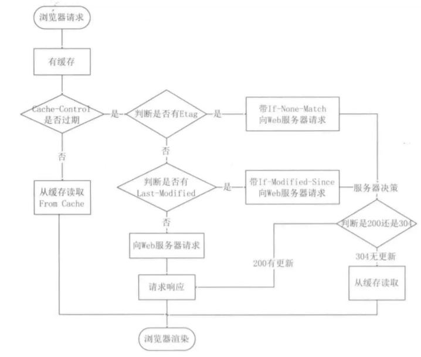

### HTTP keep-alive机制

使用方法：在请求头中加入Connection : keepalive，通知对端在该请求响应完成后不要关闭，下一次继续用

```
HTTP能不能⼀次连接多次请求，不等后端返回？
可以，HTTP本质是使⽤socket连接，写⼊TCP缓冲是可以连接多次的 
HTTP⽆状态：
在第⼀次和服务器连接并且登录成功之后，第⼆次请求服务器仍然不知道当前请求的是哪个⽤户
```

### cookie和session

cookie：

​	1.在第⼀次登录服务器之后，返回⼀些数据（cookie）给浏览器 

​	2.浏览器将数据保存在本地

​	3.再次发送请求时，⾃动把上⼀次请求存储的cookie发送给服务器

​	4.服务器通过该数据判断⽤户 

​	5.可存储的数据量有限，⼀般不会超过4KB，Cookie的保存形式分为会话Cookie和持久Cookie

```
会话cookie在用户关闭浏览器就会被删除，而持久cookie存在一个指定的过期日期和时间
```

session：session的作⽤与cookie类似，都是为了存储⽤户相关的信息

​	1.cookie存储在本地浏览器的数据，session存储在服务器的数据

​	2.Cookie存储数据的⼤⼩有限制，⽽Session⼀般⽆限制

​	3.Cookie对⽤户信息的⽣命周期的控制⽅式为累计⽅式，⽽Session使⽤间隔⽅式（在用户活跃期间保持信息，而在用户离开或超过一定时间后失效）

​	4.Session的数据存储在服务器更加的安全，但也会占用相应的服务器资源

### SSO（单点登录）

普通登录认证机制在登录认证成功后，服务器把⽤户的登录信息写⼊ session，并为该⽤户⽣成⼀个 cookie，返回 并写⼊浏览器；当⽤户再次访问这个系统的时候，请求中会带上这个 cookie，服务端会根据这个 cookie 找到对应 的 session，通过session来判断这个⽤户是否已经登录

普通的登录认证机制在多系统的环境下，在操作不同的系统时，需要多次登录，会变得很不⽅便

单点登录（英语：Single sign-on，缩写为 SSO），在⼀个多系统的环境中，⽤户只需要登录⼀次，就可以同时登陆访问其他互相信任的系统，以提高效率并减少泄漏风险

## HTTP版本

### HTTP1.1版本新特性

1.默认持久连接：只要客户端任意一端没有明确提出断开TCP连接，就一直保持连接并可以发送多次HTTP请求（HTTP长连接）。当然，如果某个 HTTP 长连接超过一定时间没有任何数据交互，服务端就会主动断开这个连接。

2.管线化：管线化（管道通信）是基于长连接的基础上的，客户端可以同时发送多个HTTP请求，不用等待响应，这样可以减少整体的响应时间。

​		但是服务器必须按照接收请求的顺序发送对这些管道化请求的响应，因此如果处理当前内容请求时耗时比较长，那么后续的请求的处理都会被阻塞住，这称为「队头堵塞」

3.端点续传：利用HTTP消息头使用分块传输编码，将实体主体进行分块分割

### HTTP1.1版本优点和缺点

优点：简单，灵活和易于扩展，广泛应用和跨平台

缺点：无状态，明文传输，不安全

​	无状态——因为服务器不会去记忆 HTTP 的状态，所以不需要额外的资源来记录状态信息，这能减轻服务器的负担，能够把更多的 CPU 和内存用来对外提供服务。但因为服务器没有记忆能力，它在完成有关联性的操作时会非常麻烦（Cookie技术主要解决的就是无状态问题）

​	明文传输/不安全——通信使用明文（不加密），内容可能会被窃听；不验证通信方的身份，因此有可能遭遇伪装；无法证明报文的完整性，所以有可能已遭篡改（引入SSL/TLS层来解决，即HTTPS）

​	队头阻塞——服务器必须按照接收请求的顺序发送对这些管道化请求的响应，因此如果处理当前内容请求时耗时比较长，那么后续的请求的处理都会被阻塞住

### HTTP1.1如何优化

主要有三种思路：

​	1.尽量避免发送 HTTP 请求（使用缓存机制，即强制缓存与协商缓存，减少响应资源在网络中传输的延时）

​	2.在需要发送 HTTP 请求时，考虑如何减少请求次数（减少重定向请求次数，合并请求，延迟发送请求）

​		重定向请求需要客户端发起多次HTTP请求才能获取到需要的资源，因此降低了性能。如果重定向的工作交由代理服务器完成，就能减少 HTTP 请求次数

​		合并请求减少了重复发送的HTTP头部，具体方式就是将请求的资源合并。不过这样的合并请求在未来如果大资源中的某一个小资源发生变化后，客户端必须重新下载整个完整的大资源文件

​		延迟发送请求，例如请求网页的时候，没必要把全部资源都获取到，而是只获取当前用户所看到的页面资源，当用户向下滑动页面的时候，再向服务器获取接下来的资源，这样就达到了延迟发送请求的效果

​	3.减少服务器的 HTTP 响应的数据大小

​		考虑对响应的资源进*压缩，这样就可以减少响应的数据大小，从而提高网络传输的效率（也就是请求报文中Accept-Encoding和响应报文中Content-Encoding字段）

### HTTPS

HTTPS 在 TCP 三次握⼿之后，还需进⾏ SSL/TLS 的握⼿过程，才可进⼊加密报⽂传输

HTTP 的端口号是 80，HTTPS 的端口号是 443

HTTPS 协议需要向 CA（证书权威机构）申请数字证书，来保证服务器的⾝份是可信的

优点：安全性

​	1.信息加密：交互信息无法被窃取

​	2.校验机制：无法篡改通信内容，篡改后无法正常显示

​	3.身份证书：证明报文的完整

缺点：

​	1.握手阶段延时较高，会话前还需要进行SSL握手

​	2.部署成本高，需要购买CA证书；涉及到加密与解密，占用一定的CPU资源

HPPTS加密方式：对称与非对称的混合加密模式，通信建立前采用非对称加密方式交换会话密钥，通信过程中则使用对称加密对明文内容进行加密

#### 非对称加密

分为公钥和私钥，公钥可以任意分发而私钥保密，两个密钥可以双向加解密的，比如可以用公钥加密内容，然后用私钥解密，也可以用私钥加密内容，公钥解密内容。

流程的不同，意味着目的也不相同：

​	1.公钥加密，私钥解密。这个目的是为了保证内容传输的安全，因为被公钥加密的内容，其他人是无法解密的，只有持有私钥的人，才能解密出实际的内容

​	2.私钥加密，公钥解密。这个目的是为了保证消息不会被冒充，因为私钥是不可泄露的，如果公钥能正常解密出私钥加密的内容，就能证明这个消息是来源于持有私钥身份的人发送的

所以非对称加密的用途主要在于通过「私钥加密，公钥解密」的方式，来确认消息的身份，我们常说的数字签名算法，就是用的是这种方式，不过私钥加密内容不是内容本身，而是对内容的哈希值加密。

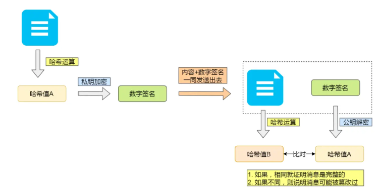

公钥+私钥的非对称加密可能会出现公钥和私钥被一起伪造的情况，因此[公钥+私钥+个人信息]会首先打包成数字证书，只有先检测出数字证书合法，才能继续进行下一步非对称加密的过程。

#### HTTPS的验证流程

​	1.client发起HTTP请求，连接到server端口

​	2.Server将⾃⼰的信息以数字证书的形式返回给client（证书包含私钥公钥、⽹站地址、证书颁发机构、失效⽇期等）

​	3.Server收到client响应后会先验证证书合法性（地址是否⼀致、是否过期）

​	4.⽣成随机密码（RSA签名）：浏览器会⽣成⼀个随机的对称密钥（session key），并⽤公钥加密，让 server⽤私钥解密，解密后⽤这个对称密钥进⾏传输

​	5.⽣成对称加密算法：验证server⾝份后，client⽣成⼀个对称加密的算法和对应密钥，以公钥加密后发送给server，server使用相同的公钥进行解密。

与HTTP相比，HTTPS：

​	1.建立连接时候：https 比 http多了 TLS 的握手过程

​	2.传输内容的时候：https 会把数据进行加密，通常是对称加密数据

#### HTTPS一定安全可靠么

一定，但也会出现这种情况：

客户端通过浏览器向服务端发起 HTTPS 请求时，被「假基站」转发到了一个「中间人服务器」，于是客户端是和「中间人服务器」完成了 TLS 握手，然后这个「中间人服务器」再与真正的服务端完成 TLS 握手。从客户端的角度看，其实并不知道网络中存在中间人服务器这个角色。那么中间人就可以解开浏览器发起的 HTTPS 请求里的数据，也可以解开服务端响应给浏览器的 HTTPS 响应数据。相当于，中间人能够 “偷看” 浏览器与服务端之间的 HTTPS 请求和响应的数据。

但实际上，因为中间人服务器的证书一定是非法的，所以会提醒用户该证书存在问题

如果用户执意点击「继续浏览此网站」，相当于用户接受了中间人伪造的证书，那么后续整个 HTTPS 通信都能被中间人监听了。

当然，也可能是电脑中病毒了

实际上，可以通过HTTPS 双向认证来避免这种问题，一般我们的 HTTPS 是单向认证，客户端只会验证了服务端的身份，但是服务端并不会验证客户端的身份。双向验证下，服务端一旦验证到请求自己的客户端为不可信任的，服务端就拒绝继续通信，客户端如果发现服务端为不可信任的，那么也中止通信。

#### HTTPS RSA握手过程

一共是四次握手，分别如下：

1.客户端首先向服务器发送“Client Hello”消息，消息里面有客户端使用的 TLS 版本号、支持的密码套件列表，以及生成的随机数（Client Random），这个随机数会被服务端保留，它是生成对称加密密钥的材料之一。

2.当服务端收到客户端的「Client Hello」消息后，会确认 TLS 版本号是否支持，和从密码套件列表中选择一个密码套件，以及生成随机数（Server Random）。然后返回“Server Hello”消息，消息里面有服务器确认的 TLS 版本号，也给出了随机数（Server Random），然后从客户端的密码套件列表选择了一个合适的密码套件。

这两个随机数是后续作为生成「会话密钥」的条件，所谓的会话密钥就是数据传输时，所使用的对称加密密钥。

然后，服务端为了证明自己的身份，会发送「Server Certificate」给客户端，这个消息里含有数字证书。随后，服务端发了「Server Hello Done」消息，目的是告诉客户端，我已经把该给你的东西都给你了，本次打招呼完毕。

客户端拿到了服务端的数字证书后，会根据证书信任链一层一层从高到低进行信任（最先信任的是操作系统或浏览器，DNS解析也是同理，最先解析的就是顶级域，也就是.com），客户端验证完证书后，认为可信则继续往下走。

3.接着，客户端就会生成一个新的随机数 (pre-master)，用服务器的 RSA 公钥加密该随机数，通过「Client Key Exchange」消息传给服务端

服务端收到后，用 RSA 私钥解密，得到客户端发来的随机数 (pre-master)。

至此，客户端和服务端双方都共享了三个随机数，分别是 Client Random、Server Random、pre-master。双方根据已经得到的三个随机数，生成会话密钥（Master Secret），它是对称密钥，用于对后续的 HTTP 请求/响应的数据加解密。

生成完「会话密钥」后，然后客户端发一个「Change Cipher Spec」，告诉服务端开始使用加密方式发送消息。

然后，客户端再发一个「Encrypted Handshake Message（Finishd）」消息，把之前所有发送的数据做个摘要，再用会话密钥（master secret）加密一下，让服务器做个验证，验证加密通信「是否可用」和「之前握手信息是否有被中途篡改过」。

「Change Cipher Spec」之前传输的 TLS 握手数据都是明文，之后都是对称密钥加密的密文（非对称加密的部分已经在用RSA私钥解密的时候完成了，但也只完成了客户端->服务端这一条路）

4.服务器也是同样的操作，发「Change Cipher Spec」和「Encrypted Handshake Message」消息，如果双方都验证加密和解密没问题，那么握手正式完成。

最后，就用「会话密钥」加解密 HTTP 请求和响应了。

##### RSA算法的缺陷

 RSA 密钥协商算法的最大问题是不支持前向保密，因为客户端传递随机数（用于生成对称加密密钥的条件之一）给服务端时使用的是公钥加密的，服务端收到后，会用私钥解密得到随机数。所以一旦服务端的私钥泄漏了，过去被第三方截获的所有 TLS 通讯密文都会被破解。

为了解决这个问题，后面就出现了 ECDHE 密钥协商算法，我们现在大多数网站使用的正是 ECDHE 密钥协商算法

#### HTTPS ECDHE握手

也一共为四次

1.与RSA没有差别，发送TLS 版本号、支持的密码套件列表，以及生成的随机数

2.一开始也与RSA没差别，发送数字证书，版本号和随机数，但密码套件的内容指定了ECDHE秘钥协商算法

在发送完证书后，因为服务端选择了 ECDHE 密钥协商算法，所以会在发送完证书后，发送「Server Key Exchange」消息，确定椭圆曲线；生成的随机数作为服务端椭圆曲线的私钥，保留到本地；根据基点 G 和私钥计算出服务端的椭圆曲线公钥，这个会公开给客户端

为了保证这个椭圆曲线的公钥不被第三方篡改，服务端会用 RSA 签名算法给服务端的椭圆曲线公钥做个签名。

最后再发送「Server Hello Done」消息，表明服务端消息发送完毕

3.验证证书合法后客户端会生成一个随机数作为客户端椭圆曲线的私钥，然后再根据服务端前面给的信息，生成客户端的椭圆曲线公钥，然后用「Client Key Exchange」消息发给服务端。

至此，双方都有对方的椭圆曲线公钥、自己的椭圆曲线私钥、椭圆曲线基点 G。于是，双方都就计算出点（x，y），其中 x 坐标值双方都是一样的

最终的会话密钥，就是用「客户端随机数 + 服务端随机数 + x（ECDHE 算法算出的共享密钥） 」三个材料生成的

这三个完全不可靠的随机数混合，足够让黑客计算不出最终的会话密钥，安全性更高

接着，客户端会发「Encrypted Handshake Message」消息，把之前发送的数据做一个摘要，再用对称密钥加密一下，让服务端做个验证，验证下本次生成的对称密钥是否可以正常使用。

4.服务端也会有一个同样的操作，发「Change Cipher Spec」和「Encrypted Handshake Message」消息，如果双方都验证加密和解密没问题，那么握手正式完成。于是，就可以正常收发加密的 HTTP 请求和响应了。

##### RSA和ECDHE握手过程的区别

- RSA 密钥协商算法「不支持」前向保密，ECDHE 密钥协商算法「支持」前向保密；
- 使用了 RSA 密钥协商算法，TLS 完成四次握手后，才能进行应用数据传输，而对于 ECDHE 算法，客户端可以不用等服务端的最后一次 TLS 握手，就可以提前发出加密的 HTTP 数据，节省了一个消息的往返时间；
- 使用 ECDHE， 在 TLS 第 2 次握手中，会出现服务器端发出的「Server Key Exchange」消息，而 RSA 握手过程没有该消息；

#### HTTPS如何优化

HTTPS的消耗在两个环节：TLS握手协议以及握手后对称加密报文传输（这个已经被优化的很好了）

- 硬件级别的优化：HTTPS协议是计算密集型，使用支持 AES-NI 特性的 CPU（该CPU在指令级别上优化了AES算法），可以加速数据的加解密传输过程
- 软件优化：软件升级，例如Linux内核和openssl升级
- 协议优化：密钥交换算法优化（选用 ECDHE 密钥交换算法替换 RSA 算法），TLS升级（LS 1.3 大幅度简化了握手的步骤，完成 TLS 握手只要 1 RTT，而且安全性更高）
- 证书验证优化
- 会话复用：这就是Session ID的意义，客户端和服务器首次 TLS 握手连接后，双方会在内存缓存会话密钥，并用唯一的 Session ID 来标识。当客户端再次连接时，hello 消息里会带上 Session ID，服务器收到后就会从内存找，如果找到就直接用该会话密钥恢复会话状态，跳过其余的过程，只用一个消息往返就可以建立安全通信。当然为了安全性，内存中的会话密钥会定期失效。对于Session ID让服务器内存压力变大的问题，还出现了Session Ticket，让客户端承担缓存的工作（类似于cookie）。客户端再次连接服务器时，客户端会发送 Ticket，服务器解密后就可以获取上一次的会话密钥，然后验证有效期，如果没问题，就可以恢复会话了，开始加密通信。对于集群服务器的话，要确保每台服务器加密 「会话密钥」的密钥是一致的，这样客户端携带 Ticket 访问任意一台服务器时，都能恢复会话。

#### HTTPS中的TLS和TCP能够同时握手么

在第一次握手时，一定是TCP先进行三次握手，然后TLS再进行四次握手

下一次握手在以下条件下，是可以实现TLS 握手过程可以同时进行三次握手的，包括：

​	1.客户端和服务端都开启了 TCP Fast Open 功能，且 TLS 版本是 1.3

​	2.客户端和服务端已经完成过一次通信

TCP Fast Open已经在三次握手优化的部分说过，可以减少1RTT的时间消耗。在第二次以后到通信过程中，客户端可以绕过三次握手直接发送数据，而且服务端也不需要等收到第三次握手后才发送数据。

在TLS1.3之后，存在一个“会话恢复”机制，在重连时，只需要0 RTT。此时，在 TCP 连接后立即就建立安全连接发送加密消息。

因此，如果「TCP Fast Open + TLSv1.3」情况下，在第二次以后的通信过程中，TLS 和 TCP 的握手过程是可以同时进行的，而且 HTTP 请求也可以在这期间内一同完成


### HTTP2.0版本新特性

1.传输格式变化：采用二进制格式，不基于文本进行解析。头信息和数据体都是二进制，并且统称为帧（frame）：头信息帧（Headers Frame）和数据帧（Data Frame）。收到报文后，计算机无需再将明文的报文转成二进制，而是直接解析二进制报文，这增加了数据传输的效率

2.多路复用：连接共享，每个TCP连接允许有多个请求，接收方根据请求的ID（Stream ID）将请求归属到不同的服务器请求中，提高了效率。

3.header压缩：HTTP1.X中，header带有大量信息，而且每次都要重复发送，HTTP2.0通过encoder减少header⼤⼩，通讯双⽅会各⾃缓存⼀份header字段表，既可以避免重复header传输，又减⼩了需要传输的⼤⼩（HPACK算法）

4.服务端推送：服务端不再是被动地响应，可以主动向客户端发送消息。在这种情况下，客户端和服务器双方都可以建立 Stream， Stream ID 也是有区别的，客户端建立的 Stream 必须是奇数号，而服务器建立的 Stream 必须是偶数号。

这在一些需要连续处理的场景下非常有用，例如客户端通过 HTTP/1.1 请求从服务器那获取到了 HTML 文件，而 HTML 可能还需要依赖 CSS 来渲染页面，这时客户端还要再发起获取 CSS 文件的请求，需要两次消息往返。而在 HTTP/2 中，客户端在访问 HTML 时，服务器可以直接主动推送 CSS 文件，减少了消息传递的次数。

### HTTP2.0的缺陷

1.队头阻塞：TCP 是字节流协议，TCP 层必须保证收到的字节数据是完整且有序的，如果序列号较低的 TCP 段在⽹络传输中丢失了，即使序列号较⾼的 TCP 段已经被接收了，应⽤层也⽆法从内核中读取到这部分数据，从 HTTP 视⻆看，就是请求被阻塞了

2.TCP和TLS的握手时延迟：发出HTTP请求时，需要经过TCP三次握⼿和TLS四次握⼿，共计3RTT的时延才能发出请求数据

3.⽹络迁移需要重新连接：⼀个TCP连接由【源IP地址，源端口，⽬标IP地址，⽬标端口】确定。若IP地址或端口发⽣变化，这需要重新进⾏连接。这不利于移动设备切换⽹络的场景。要解决该问题，就要修改传输层协议。在HTTP3中传输层协议修改为了 UDP

### HTTP3.0：基于UDP实现的协议

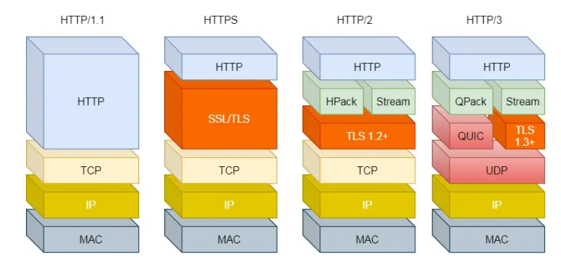

为了解决HTTP/2 的队头阻塞问题，HTTP/3 把 HTTP 下层的 TCP 协议改成了 UDP

针对UDP不可靠的问题，HTTP3基于UDP协议在应⽤层 实现了QUIC协议，它有类似TCP的连接管理、拥塞窗口、流量控制的⽹络特性，相当于将不可靠的UDP协议变成可靠的了，⽆需担⼼数据包丢包的问题

QUIC的特点：

​	1.流与流之间不受影响，即便某个流中的数据包丢失，其他流仍然正常工作。即“无队头阻塞”

​	2.更快的连接建立：HTTP/3 在传输数据前虽然需要 QUIC 协议握⼿，这个握⼿过程只需要 1 RTT，握⼿的⽬的是为确认双⽅的「连接 ID」，连接迁移就是基于连接 ID 实现的。的 QUIC 协议并不是与 TLS 分层，⽽是QUIC 内部包含了 TLS（QUIC可以在表示层而TCP显然不可以），它在⾃⼰的帧会携带 TLS ⾥的“记 录”，再加上 QUIC 使⽤的是 TLS1.3，因此仅需 1 个 RTT 就可以「同时」完成建⽴连接与密钥协商，甚⾄在第⼆次 连接的时候，应⽤数据包可以和 QUIC 握⼿信息（连接信息 + TLS 信息）⼀起发送，达到 0-RTT 的效果

​	HTTPS则一定需要2个RTT，RTT是指从发送端发送数据开始，到接收端确认收到数据的时间，再到发送端收到接收端的确认的时间的总和。简单说，RTT是一轮数据从发送到接收再到确认的时间（等于三次握手的时间，但还有其他情况）。

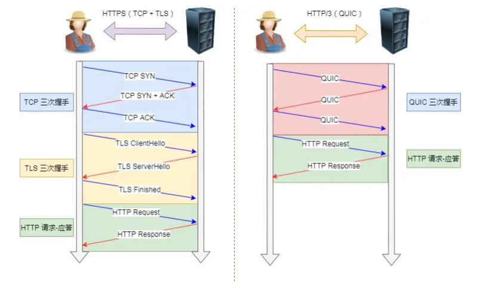

​	3.连接迁移：QUIC不使用四元组的方式绑定连接，而是通过连接ID标记通信的两个端点，因此即便IP地址变化，只要仍保有上下文信息，就可以无缝复用原连接，减少重连的成本。

QUIC 是新协议，对于很多网络设备，根本不知道什么是 QUIC，只会当做 UDP，这样会出现新的问题，因为有的网络设备是会丢掉 UDP 包的，而 QUIC 是基于 UDP 实现的，那么如果网络设备无法识别这个是 QUIC 包，那么就会当作 UDP包，然后被丢弃。

### 既然有HTTP，为什么还要有RPC

TCP的三个特点：面向连接，可靠，基于字节流

因为TCP是基于字节流的，所以没有任何边界，需要更上一层的应用层协议进行确定，例如HTTP（响应头中的Content-Lnegth）和RPC

RPC协议在本质上和HTTP 类似，也是通过建立 TCP 长链接进行数据交互，但不同的地方在于，RPC 协议一般还会再建个连接池，在请求量大的时候，建立多条连接放在池内，要发数据的时候就从池里取一条连接出来，用完放回去，下次再复用，可以说非常环保。由于连接池有利于提升网络请求性能，所以不少编程语言的网络库里都会给 HTTP 加个连接池，比如 Go 就是这么干的。

HTTP的Header部分可以是文本（HTTP1.1）或二进制（HTTP2.0），但Body部分对端只能接受二进制数据。因此需要将原本的Body内容转为二进制，这个过程就叫序列化，反过来将二进制数组复原的过程叫反序列化

而 RPC，因为它定制化程度更高，可以采用体积更小的 Protobuf 或其他序列化协议去保存结构体数据，同时也不需要像 HTTP 那样考虑各种浏览器行为，比如 302 重定向跳转啥的。因此性能也会更好一些，这也是在公司内部微服务中抛弃 HTTP，选择使用 RPC 的最主要原因。

RPC 本质上不算是协议，而是一种调用方式，而像 gRPC 和 Thrift 这样的具体实现，才是协议，它们是实现了 RPC 调用的协议。目的是希望程序员能像调用本地方法那样去调用远端的服务方法。同时 RPC 有很多种实现方式，不一定非得基于 TCP 协议。

### 既然有HTTP，为什么还有WebSocket

核心在于网页怎样在用户不做任何操作的情况下，网页发生变更并发送消息给客户端

#### HTTP定时轮询

最常见的解决方案是，网页的前端代码里不断定时发 HTTP 请求到服务器，服务器收到请求后给客户端响应消息。这其实是客户端自己偷偷不断请求服务器，本质不是服务器自己主动传递信息给客户端。这种使用的最常见场景就是扫码登录，前端每间隔1-2秒就向后端询问是否扫描到了这个码。这也叫“HTTP的定时轮询”。

HTTP的定时轮询的缺陷页很多：

- HTTP的多次请求会消耗很大的带宽
- 跳转页面可能会出现比较明显的卡顿，这就是在扫码完成后的1-2秒内才收到HTTP请求

#### HTTP长轮询

HTTP 请求发出后，一般会给服务器留一定的时间做响应，比如 3 秒，规定时间内没返回，就认为是超时。如果我们的 HTTP 请求将超时设置的很大，比如 30 秒，在这 30 秒内只要服务器收到了扫码请求，就立马返回给客户端网页。如果超时，那就立马发起下一次请求。

这样就减少了 HTTP 请求的个数，并且由于大部分情况下，用户都会在某个 30 秒的区间内做扫码操作，所以响应也是及时的。例如说百度网盘的扫码机制就是这样的。

像这种发起一个请求，在较长时间内等待服务器响应的机制，就是所谓的长轮询机制。我们常用的消息队列 RocketMQ 中，消费者去取数据时，也用到了这种方式。像这种，在用户不感知的情况下，服务器将数据推送给浏览器的技术，就是所谓的服务器推送技术（comet技术）。

#### WebSocket连接

TCP连接里，同一时间里，双方都可以主动向对方发送数据。这就是所谓的全双工。然而，对与HTTP 1.1来说，同一时间内，客户端和服务器只能有一方主动发数据，这就是所谓的半双工。这是因为HTTP在一开始就是考虑网页文本的场景，并没有考虑到大量数据发送的场景。

于是新的应用层协议WebSocket就被设计了出来，它本质上与socket几乎没有关系，是一个和HTTP同一层级的协议

WebSocket的建立也是建立在HTTP的基础之上，TCP三次握手之后，会先统一用HTTP协议先进行一次通信。如果是普通的HTTP 请求，那后续双方就还是继续用普通 HTTP 协议进行交互。如果这时候是想建立 WebSocket 连接，就会在 HTTP 请求里带上一些特殊的header，内容如下：

```
Connection: Upgrade
Upgrade: WebSocket
Sec-WebSocket-Key: T2a6wZlAwhgQNqruZ2YUyg==\r\n
```

 这段头部表明，浏览器想升级协议到WebSocket，同时带上一段随机生成的 base64 码（Sec-WebSocket-Key），发给服务器。

如果服务器支持，那么就会走 WebSocket 握手流程，同时根据客户端生成的 base64 码，用某个公开的算法变成另一段字符串，放在 HTTP 响应的 Sec-WebSocket-Accept 头里，同时带上101状态码，发回给浏览器。HTTP 的响应如下：

```
HTTP/1.1 101 Switching Protocols\r\n
Sec-WebSocket-Accept: iBJKv/ALIW2DobfoA4dmr3JHBCY=\r\n
Upgrade: WebSocket\r\n
Connection: Upgrade\r\n
```

状态码101其实指的是协议切换（这也是我们看到HTTP状态码为1XX时，表明处于协议的中间状态）。之后，浏览器也用同样的公开算法将刚刚发送的base64码转成另一段字符串，如果这段字符串跟服务器传回来的字符串一致，那验证通过。

就这样经历了一来一回两次 HTTP 握手，WebSocket就建立完成了，后续双方就可以使用 webscoket 的数据格式进行通信了。

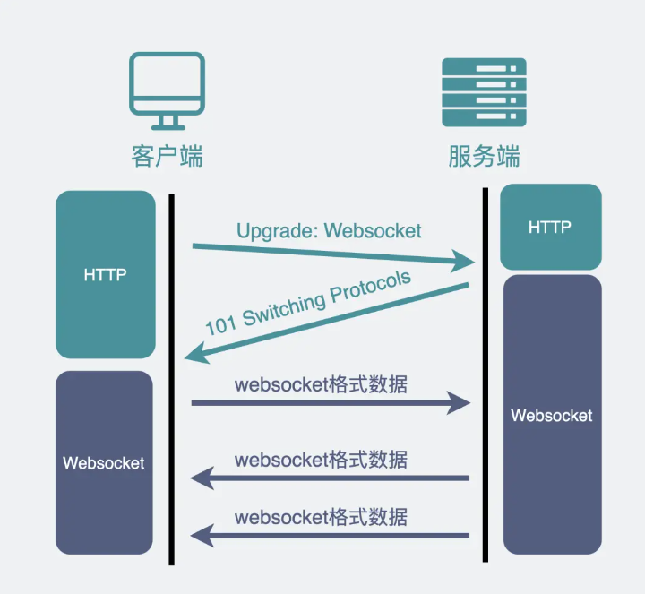

实质上，WebSocket只有在建立连接时才用到了HTTP，升级完成之后就跟HTTP没有任何关系了，所以“WebSocket 不是基于HTTP的新协议”

#### WebSocket消息格式

数据包在WebSocket中被叫做帧，他的数据格式如下：

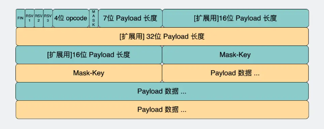

opcode：用来标志这是个什么类型的数据帧，比如：

- 等于1，是指text类型（string）的数据包
- 等于2，是二进制数据类型（[ ]byte）的数据包
- 等于 8 ，是关闭连接的信号

payload：存放的是我们真正想要传输的数据的长度，单位是字节

Payload字段有非常多个，但WebSocket会用最开始的7bit做标志位。不管接下来的数据有多大，都先读最先的7个bit，根据它的取值决定还要不要再读个 16bit 或 64bit。如果标志位为6个1,1个0（126），代表需要再读后面的16bit，这16bit会包含payload的真实长度。如果是标志位为7个1，那么需要再读64bit。这64bit会包含payload的长度。这能放2的64次方byte的数据

WebSocket这种设计同样是为了解决粘包的问题。

## IP基础

IP位于TCP/IP参考模型的第三层，也就是⽹络层。网络层实现了主机与主机之间的通信，也叫点对点通信

数据链路层（MAC）负责直连的两个设备之间通信，网络层（IP）负责在没有直连的两个网络之间进行通信传输

在⽹络数据包传输中，源IP地址和⽬标IP地址在传输过程中是不会变的，只有源MAC地址和⽬标MAC⼀直在变化

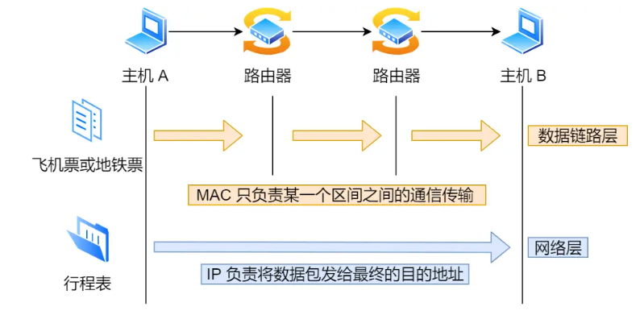

IPv4，32位，IPv6,128位

如果每一个IP都标识一台电脑，那么可连接的计算机数大概是43亿台。但可以使用NAT技术（更换IP地址），超过这个数字

### 分类地址

IP一共五类，根据开头的字段可以很容易分辨，从A到E类分别是0,10,110,1110,1111，其中D类为IP多播地址，E还在保留中

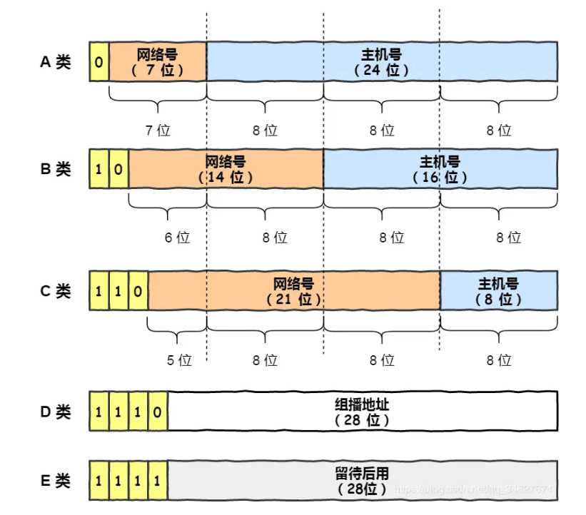

对于ABC三类，主要分为两个部分，分别是网络号和主机号

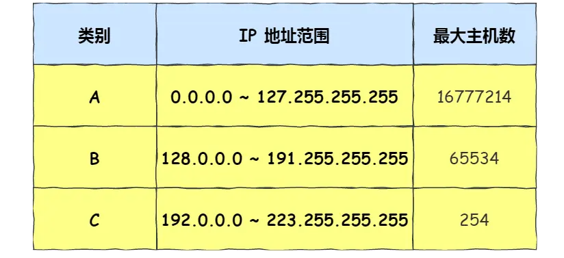

如果想要计算最大主机个数，就要看主机位的个数，对于C类而言，最大主机数为2^8-2=254。减 2 的原因是主机号全为 1 和 全为 0 地址是特殊的。

全为1的用于指定某个网络下的所有主机，用于广播；全为 0 指定某个网络

广播地址用于在同一个链路中相互连接的主机之间发送数据包，广播地址可以分为本地广播和直接广播两种

- 在本网络内广播的叫做本地广播。例如网络地址为 192.168.0.0/24 的情况下，广播地址是 192.168.0.255 。因为这个广播地址的 IP 包会被路由器屏蔽，所以不会到达 192.168.0.0/24 以外的其他链路上。
- 在不同网络之间的广播叫做直接广播。例如网络地址为 192.168.0.0/24 的主机向 192.168.1.255/24 的目标地址发送 IP 包。收到这个包的路由器，将数据转发给 192.168.1.0/24，从而使得所有 192.168.1.1~192.168.1.254 的主机都能收到这个包（由于直接广播有一定的安全问题，多数情况下会在路由器上设置为不转发。） 。

D类地址用于多播，用于将包发送给特定组内的所有主机。因为广播无法穿透路由，若想给其他网段发送同样的包，就可以使用可以穿透路由的多播。

#### IP分类优势与劣势

优势：简单明了，选路简单

劣势：

- 同一网络下没有地址层次，缺乏灵活性。
- 不能很好的与现实网络匹配，C类地址太少而B类地址太多

### 无分类地址CIDR

除了IP分类之外，还有CIDR无分类地址，这种⽅式不再有分类地址的概念，32 ⽐特的 IP 地址被划分为两部分，前⾯是⽹络号，后⾯是主机号

表⽰形式 a.b.c.d/x ，其中 /x 表⽰前 x 位属于⽹络号， x 的范围是 0 ~ 32 ，这就使得 IP 地址更加具有灵活性

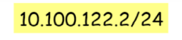

还有另⼀种划分⽹络号与主机号形式，那就是⼦⽹掩码，掩码的意思就是掩盖掉主机号，剩余的就是⽹络号，将⼦⽹掩码和 IP 地址按位计算 AND，就可得到⽹络号，这又进一步增大了网络号的范围

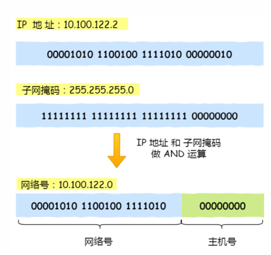

#### 为什么要分离网络号和主机

​	因为两台计算机要通讯，⾸先要判断是否处于同⼀个⼴播域内，即⽹络地址（网络号）是否相同。如果⽹络地址相同，表明接受⽅在本⽹络上，那么可以把数据包直接发送到⽬标主机

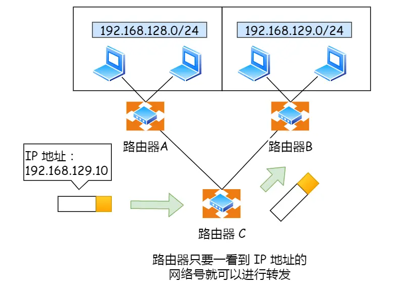

​	路由器寻址⼯作中，也就是通过这样的⽅式来找到对应的⽹络号的，进⽽把数据包转发给对应的⽹络内

​	同时，将网络号和主机号划分的子网掩码同时还可以划分子网

#### 子网划分

子网划分实际上是将主机地址分为两个部分：子网网络地址和子网主机地址

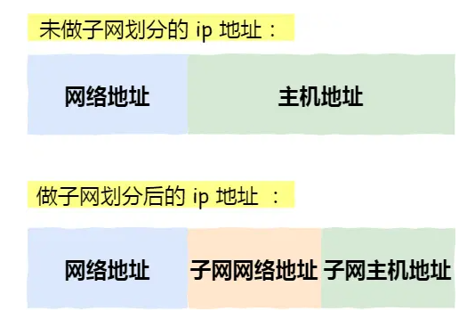

做子网划分后的 ip 地址：网络地址＋（子网网络地址＋子网主机地址）

以C类网络为例，此时能够拥有四个独立的子网网址，分别是00,01,10,11

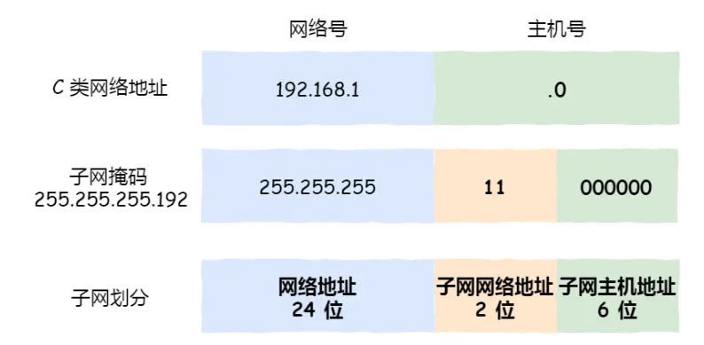

公有/私有IP：

​	公有 IP 地址是有个组织统⼀分配，而私有IP地址允许管理员自己分配和管理，同时可以重复(NAT转换实现)

### IP地址和路由控制

​	IP地址的⽹络地址这⼀部分是⽤于进⾏路由控制。路由控制表中记录着⽹络地址与下⼀步应该发送⾄路由器的地址。在主机和路由器上都会有各⾃的路由器控制表。在发送 IP 包时，⾸先要确定 IP 包⾸部中的⽬标地址，再从路由控制表中找到与该地址具有相同⽹络地址的记录， 根据该记录将 IP 包转发给相应的下⼀个路由器。如果路由控制表中存在多条相同⽹络地址的记录，就选择相同位数最多的⽹络地址，也就是最⻓匹配（这里的最长是指IP网络号最长，它取决于网络的掩码长度）

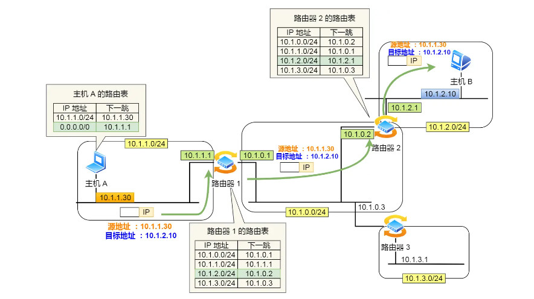

1. 主机 A 要发送一个 IP 包，其源地址是 `10.1.1.30` 和目标地址是 `10.1.2.10`，由于没有在主机 A 的路由表找到与目标地址 `10.1.2.10` 相同的网络地址，于是包被转发到默认路由（路由器 `1` ）
2. 路由器 `1` 收到 IP 包后，也在路由器 `1` 的路由表匹配与目标地址相同的网络地址记录，发现匹配到了，于是就把 IP 数据包转发到了 `10.1.0.2` 这台路由器 `2`
3. 路由器 `2` 收到后，同样对比自身的路由表，发现匹配到了，于是把 IP 包从路由器 `2` 的 `10.1.2.1` 这个接口出去，最终经过交换机把 IP 数据包转发到了目标主机

PS.这个第一步非常重要，它表明了不在同一个局域网内，不能直接发送，而是选择到了默认路由

IP地址中，环回地址（用于一台计算机的程序之间的网络通信）和localhost都不会流向网络并转发

### IP分组与重组

每种数据链路的最⼤传输单元 MTU 都是不相同的，如 FDDI 数据链路 MTU 4352、以太⽹（最广泛的计算机局域网技术）的 MTU 是 1500 字节等

其中，我们最常⻅数据链路是以太⽹，它的 MTU 是 1500 字节。 那么当 IP 数据包⼤⼩⼤于 MTU 时， IP 数据包就会被分⽚。 中间的路由器在需要的情况下，对这些片段进行分组和重组。

在分⽚传输中，⼀旦某个分⽚丢失，则会造成整个 IP 数据报作废。所以 TCP 引⼊了 MSS 也就是在 TCP 层进⾏分⽚而不由 IP 层分⽚；对于 UDP，我们尽量不要发送⼀个⼤于 MTU 的数据报⽂。

### IPv6

​	1.IPV4和IPV6不能兼容，它具有更多的地址，更好的安全性和扩展性

​	2.IPv6 可⾃动配置，即使没有 DHCP 服务器也可以实现⾃动分配IP地址

​	3.IPv6 包头包⾸部⻓度采⽤固定的值 40 字节（IPv4为20字节），去掉了包头校验和，简化了⾸部结构，减轻了路由器负荷，⼤⼤提⾼了传输的性能

​	4.IPv6 有应对伪造 IP 地址的⽹络安全功能以及防⽌线路窃听的功能，⼤⼤提升了安全性

​	5.IPv6 地址⻓度是 128 位，是以每 16 位作为⼀组，每组⽤冒号 「:」 隔开

​	6.IPV4首部中的协议就是TCP协议（因为HTTP需要通过TCP进行传输），故协议号为06（十六进制）

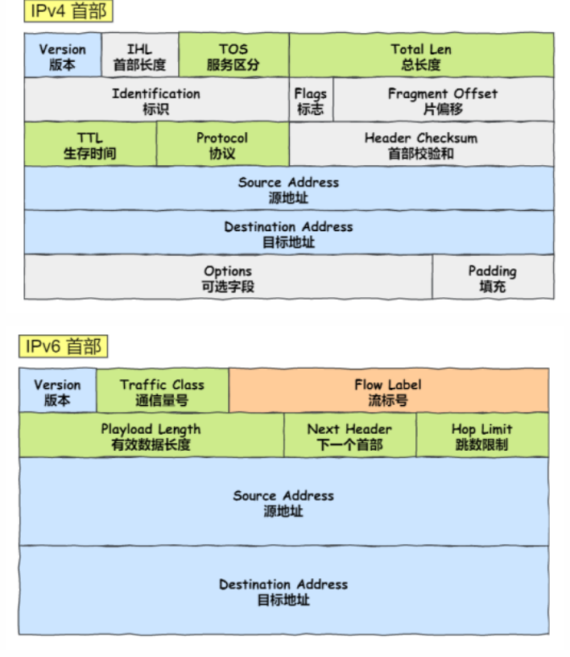

相较于IPv4，IPv6的首部改进：

​	1.取消了⾸部校验和字段，因为数据链路层和传输层都会校验

​	2.取消了分⽚/重新组装相关字段：IPv6 不允许在中间路由器进⾏分⽚与重组，这种操作只能在源与⽬标主机，这将⼤⼤提⾼了路由器转发的速度

​	3.取消选项字段：可能出现在 IPv6 ⾸部中的 「下⼀个⾸部」指出的 位置上。删除该选项字段使的 IPv6 的⾸部成为固定⻓度的 40 字节

IPv6 类似 IPv4，也是通过 IP 地址的前几位标识 IP 地址的种类


## MAC

MAC 头部是以太网使用的头部，它包含了接收方和发送方的 MAC 地址等信息。

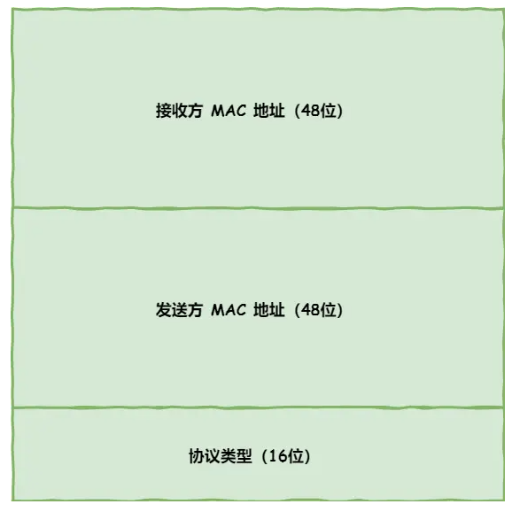

在 MAC 包头里需要发送方 MAC 地址和接收方目标 MAC 地址，用于两点之间的传输，它是在数据链路层添加的

一般在 TCP/IP 通信里，MAC 包头的协议类型只使用：0800（IP协议），0806（ARP协议）

ARP 协议会在以太网中以广播的形式询问IP地址对应的MAC地址，如果对方和自己处于同一个子网中，那么通过上面的操作就可以得到对方的 MAC 地址。然后，我们将这个 MAC 地址写入 MAC 头部，MAC 头部就完成了。在后续操作系统会把本次查询结果放到一块叫做 ARP 缓存的内存空间留着以后用（时间较短，只有几分钟）

所以在发包时，应先查询ARP缓存，如果没有，就发送ARP广播查询


## 网卡，交换机与路由

### 网卡

网卡驱动获取网络包之后，会将其复制到网卡内的缓存区中，接着会在其开头加上报头和起始帧分界符，在末尾加上用于检测错误的帧校验序列

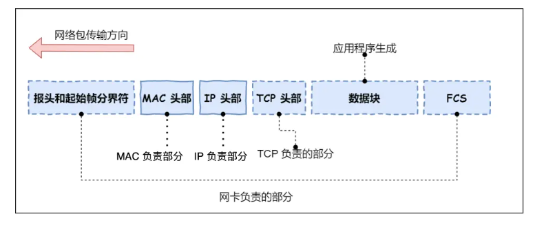

起始帧分界符是一个用来表示包起始位置的标记，末尾的 FCS（帧校验序列）用来检查包传输过程是否有损坏

### 交换机

交换机俗称两层网络设备，它的设计是将网络包原样转发到目的地

它不核对接收方 MAC 地址，而是直接接收所有的包并存放到缓冲区中，同时它的端口也不具有MAC地址

将包存入缓冲区后，交换机接下来会查询这个包的接收方 MAC 地址是否已经在 MAC 地址表中有记录

交换机的 MAC 地址表主要包含两个信息：

​	1.设备的 MAC 地址

​	2.该设备连接在交换机的哪个端口上

如果收到的包在交换机的MAC地址上查找不到对应的MAC地址，它就会把包转发到除了源端口之外的所有端口上，只有相应的接收者才接收包，而其他设备则会忽略这个包

如果接收方 MAC 地址是一个广播地址，那么交换机会直接将包发送到除源端口之外的所有端口

### 路由器

路由器是基于 IP 设计的，俗称三层网络设备，路由器的各个端口都具有 MAC 地址和 IP 地址，从严格意义上来说与网卡一致

当转发包时，首先路由器端口会接收发给自己的以太网包（不是就直接丢弃），之后去掉包开头的 MAC 头部

接下来，路由器会根据 MAC 头部后方的IP头部中的内容进行包的转发，首先查询路由表判断转发目标

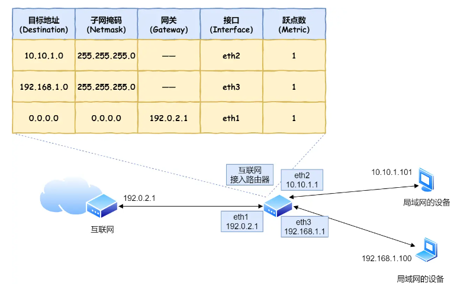

判断的标准是将目标IP（假设这里是192.168.1.100）和路由表中的每个子网掩码做&（AND，与）运算，得到的结果与对应条目的目标地址进行匹配，如果匹配就会作为候选转发目标，如果不匹配就继续与下个条目进行路由匹配（192.168.1.100 & 255.255.255.0 = 192.168.1.0，显然与第二条匹配）

实在找不到匹配路由时，就会选择默认路由，路由表中子网掩码为 `0.0.0.0` 的记录表示「默认路由」

在匹配好后，还需要根据路由表的网关判断对方的地址：

​	1.如果网关是一个 IP 地址，则这个IP 地址就是我们要转发到的目标地址，还未抵达终点，还需继续需要路由器转发（默认网关就是直接传到互联网的其他路由器了）

​	2.如果网关为空，则 IP 头部中的接收方 IP 地址就是要转发到的目标地址，也是就终于找到 IP 包头里的目标地址了，说明已抵达终点

知道对方的 IP 地址之后，接下来需要通过ARP协议根据 IP 地址查询 MAC 地址，并将查询的结果作为接收方 MAC 地址。路由器也有 ARP 缓存，因此首先会在 ARP 缓存中查询，如果找不到则发送 ARP 查询请求。

转发的核心在于：源 IP 和目标 IP 始终是不会变的，一直变化的是 MAC 地址，因为需要 MAC 地址在以太网内进行两个设备之间的包传输


## IP协议相关技术

### DNS

DNS（Domain Name Server）域名解析：

我们在上⽹的时候，通常使⽤的⽅式是域名，⽽不是 IP 地址，因为域名⽅便⼈类记忆。那么实现这⼀技术的就是 DNS 域名解析，DNS 可以将域名⽹址⾃动转换为具体的 IP 地址

DNS 中的域名都是⽤句点来分隔的，⽐如 www.server.com ，这⾥的句点代表了不同层次之间的界限。 在域名中，越靠右的位置表⽰其层级越⾼

域名的层次为：根DNS服务器，顶级域DNS服务器(.com)，权威DNS服务器(server.com)

域名解析从根开始，根本身不直接用于域名解析，但能指明一条道路，然后依次由本地DNS服务器进行询问，**只指路不带路**

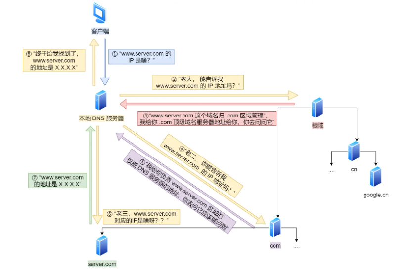

### ARP与RARP协议（地址解析协议）

（1）ARP协议

在传输⼀个 IP 数据报的时候，确定了源 IP 地址和⽬标 IP 地址后，就会通过主机「路由表」确定 IP 数据包下⼀ 跳。然⽽，⽹络层的下⼀层是数据链路层，所以我们还要知道「下⼀跳」的 MAC 地址（IP+MAC地址才能确定位置，而MAC地址需要ARP获得）

由于主机的路由表中可以找到下⼀跳的 IP 地址，所以可以通过 ARP 协议（Address Resolution Protocol，地址解析协议），求得下⼀跳的 MAC 地址

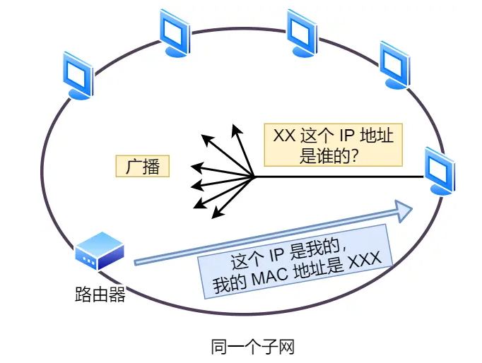

ARP是如何知道对⽅的MAC地址的呢？ARP 是借助 ARP 请求与 ARP 响应两种类型的包确定 MAC 地址的

主机会通过⼴播发送 ARP 请求，这个包中包含了想要知道的 MAC 地址的主机 IP 地址，当同个链路中的所有设备收到 ARP 请求时，会去拆开 ARP 请求包⾥的内容，如果 ARP 请求包中的⽬标 IP 地址与 ⾃⼰的 IP 地址⼀致，那么这个设备就将⾃⼰的 MAC 地址塞⼊ ARP 响应包返回给主机

（2）RARP协议

通常这需要架设⼀台 RARP 服务器，在这个 服务器上注册设备的 MAC 地址及其 IP 地址。然后再将这个设备接⼊到⽹络。然后：

1.该设备会发送一条「我的 MAC 地址是XXXX，请告诉我，我的IP地址应该是什么」的请求信息

2.RARP 服务器接到这个消息后返回「MAC地址为 XXXX 的设备，IP地址为 XXXX」的信息给这个设备

### DHCP（动态主机配置协议）

DHCP(Dynamic Host Configuration Protocol,动态主机配置协议)。我们的电脑通常都是通过 DHCP 动态获取 IP 地址，⼤⼤省去了配 IP 信息繁琐的过程

具体过程为：

​	1.客户端发起DHCP发现报文（广播通信）

​	2.DHCP服务器收到DHCP发现报文时，用DHCP提供报文向客户端做出响应

​	3.客户端收到一个或多个服务器提供的DHCP提供报文后，从中选择一个服务器，并发送DHCP请求报文响应，回显配置的参数

​	4.最后，服务器发送DHCP确认报文对DHCP进行响应，应答所要求的参数

DHCP实现了IP地址的统一分配和管理

DHCP 交互中，全程都是使用 UDP 广播通信，因此为了避免每个网络都要配一个 DHCP 服务器（路由不会转发广播），需要DHCP中继代理，对不同网段的IP地址分配进行管理。具体方式为先单播发送请求，再广播给客户端分配。

### NAT（⽹络地址与端口转换 ）

NAT 就是同个公司、家庭、教室内的主机对外部通信时，把私有 IP 地址转换成公有 IP 地址

普通的 NAT 转换没什么意义。 由于绝⼤多数的⽹络应⽤都是使⽤传输层协议 TCP 或 UDP 来传输数据 的。 因此，可以把 IP 地址 + 端口号⼀起进⾏转换。 这样，就⽤⼀个公共 IP 地址即可，这种转换技术就叫⽹络地址与端口转换 NAPT。

NAT的缺陷：

​	1.外部无法主动与 NAT 内部服务器建立连接，因为 NAPT 转换表没有转换记录。（穿透场景）

​	2.转换表的生成与转换操作都会产生性能开销。

​	3.通信过程中，如果 NAT 路由器重启了，所有的 TCP 连接都将被重置。

解决方法有两种：一种是改用IPv6，可用范围够大，另一种是NAT穿透

NAT 穿越技术能够让⽹络应⽤程序主动发现⾃⼰位于 NAT 设备之后，并且会主动获得 NAT 设备的公有 IP，并为 ⾃⼰建⽴端口映射条⽬，注意这些都是 NAT设备后的应⽤程序⾃动完成的。 也就是说，客户端主动从 NAT 设备获 取公有 IP 地址，然后⾃⼰建⽴端口映射条⽬，然后⽤这个条⽬对外通信， 就不需要 NAT 设备来进⾏转换了

#### NAT穿透的四种类型（音视频之后会继续延伸）

##### 完全锥型

一旦打洞成功，所有知道该洞的主机都可以通过它与内网进行通信。这里的洞就是在NAT上建立了一个内外网的映射表，这个映射表可以简单理解为一个四元组，包括内网IP/端口和外网IP/端口。

大多数情况下，NAT穿越使用的是UDP，因为UDP是无连接协议，在打洞时会更加方便，也可以使用TCP。

##### IP限制锥型

只有与之打洞成功的外网主机才能通过该洞与内网主机通信，即对穿越洞口的IP进行了限制。映射表相较于完全锥型增加了被访问主机的IP一项，以对IP进行检测。

##### 端口限制锥型

在检验IP的基础上，还需要检验端口是否与之前打洞的主机一致。映射表仍是四元组，但最后一项变成了被访问主机的IP和端口的组合。

##### 对称型

对数据包的检测最为严格，内网主机每次访问不同的外网主机时，都会生成一个新洞，而不像前面3中NAT类型使用的是同一种洞

### ICMP（互联网控制报文协议）

确认 IP 包是否成功送达⽬标地址、报告发送过程中 IP 包被废弃的原因和改善⽹络设置等。 在 IP 通信中如果某个 IP 包因为某种原因未能达到⽬标地址，那么这个具体的原因将由 ICMP 负责通知。ICMP 的这种通知消息会使⽤IP进⾏发送。

ICMP大致分成两类，一类为诊断的查询信息，一类是通知出错原因的错误消息

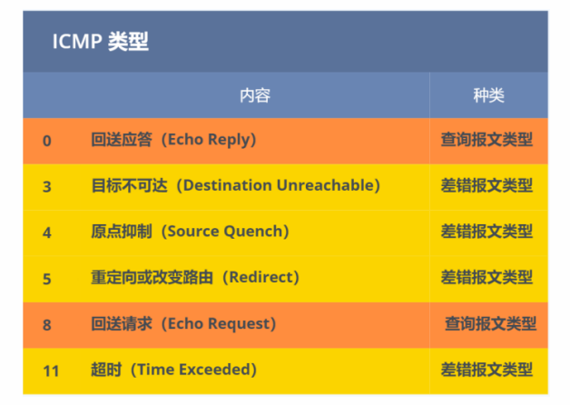

#### 基于ICMP的PING命令

ICMP 数据包内包含多个字段，最重要的是两个是类型（对于回送请求消息而言该字段为 `8`）和序号（区分连续 ping 的时候发出的多个数据包）

还有一款充分利用 ICMP 差错报文类型的命令叫做 traceroute

它的作用有两个：

​	1.故意设置特殊的 TTL（生存时间，单位为跳，主要作用是限制一个数据包在网络中的传递次数，防止数据包在网络中无限循环），来追踪去往目的地时沿途经过的路由器

​	2.故意设置不分片，从而确定路径的 MTU

### IGMP（因特网组管理协议）

IGMP 报⽂向路由器申请加⼊和退出组播组，默认情况下路由器是不会转发组播包到连接中的主机，除⾮主机通过 IGMP 加⼊到组播组，主机申请加⼊到组播组时，路由器就会记录 IGMP 路由器表，路由器后续就会转发组播包到对应的主机了。

组播地址本身没有网络号和主机号，而且使用的是UDP协议，不存在握手额外消息。

### PING 127.0.0.1

对于127开头的地址，都属于回环地址，它会使用本地网卡发出，因此即便将网线拔了（对外网卡不工作），也能ping通

127.0.0.1是回环地址。localhost是域名，但默认等于127.0.0.1


