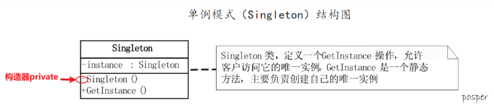
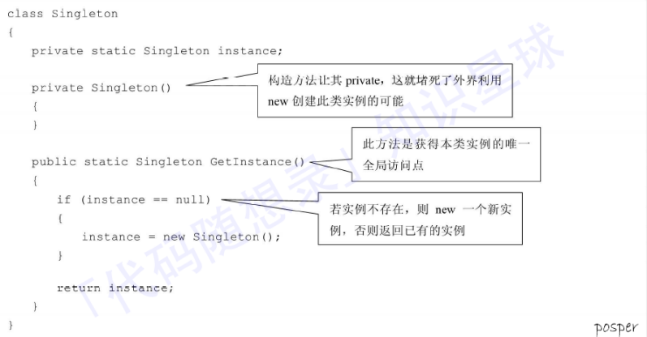
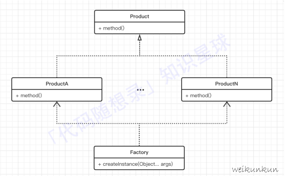
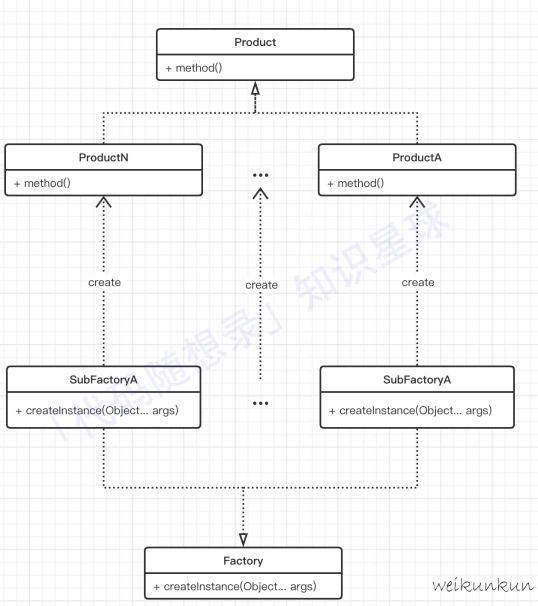
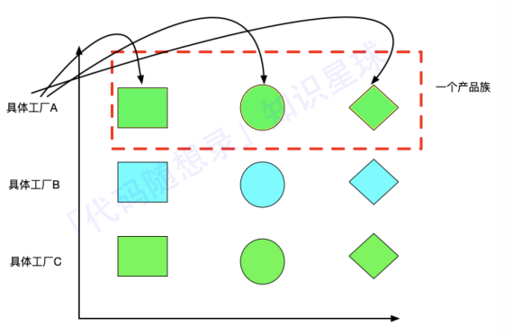
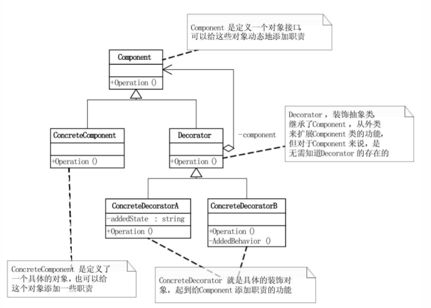
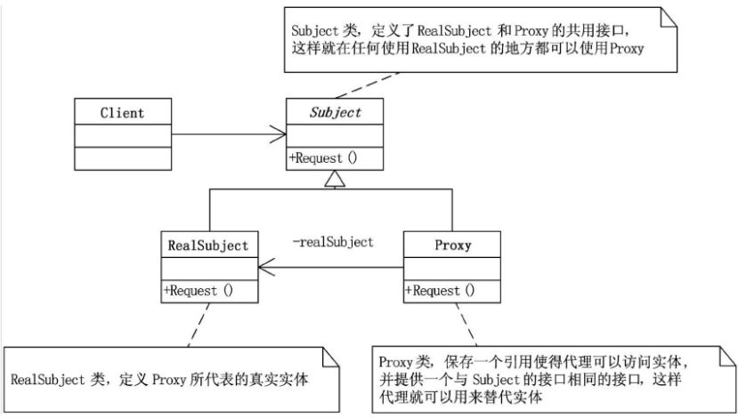

# 设计模式

## 单例模式

保证⼀个类仅有⼀个实例，并提供⼀个访问它的全局访问点

优点：避免⼀个全局使⽤的类，频繁的创建与销毁，耗费系统资源

涉及要素：⼀个私有构造函数（确保只能单例类⾃⼰创建实例）；⼀个私有静态变量（确保只有⼀个实例）；⼀个公有静态函数（给使⽤者提供调⽤⽅法） 

实现方法：为了保证线程安全，最好是使用静态方法在内部实现一个实例。（用锁就同时需要使用volatile关键字，会有额外的开销，双重检查锁和单一锁都存在问题）

应用场景：连接池，线程池，Web项目中配置对象的读取

使用场景总结：

​	1.频繁实例化然后又销毁的对象，使⽤单例模式可以提⾼性能

​	2.经常使⽤的对象，但实例化时耗费时间或者资源多，如数据库连接池，使⽤单例模式，可以提⾼性能，降低资源损坏

​	3.使⽤线程池之类的控制资源时，使⽤单例模式，可以⽅便资源之间的通信

### 饿汉模式与懒汉模式

饿汉模式：一开始类加载的时候就已经实例化，并且创建单例对象，以后只管用即可

懒汉模式：一开始不会实例化，什么时候用就什么时候new，才进行实例化

## 工厂模式

在创建对象时，不会对客户端暴露对象的创建逻辑，⽽是通过使⽤共同的接口来创建对象。其⽤来封装和管理类的创建，本质是对获取对象过程的抽象。

一般情况下，⼯⼚模式分为三种更加细分的类型：简单⼯⼚、⼯⼚⽅法和抽象⼯⼚

优点：

​	1.解耦，将对象的创建和使用分离

​	2.可复用，对于创建过程⽐较复杂且在很多地⽅都使⽤到的对象，通过⼯⼚模式可以提⾼对象创建的代码的复⽤性

​	3.降低成本，由于复杂对象通过⼯⼚进⾏统⼀管理，所以只需要修改⼯⼚内部的对象创建过程即可维护对象，从⽽达到降低成本的⽬的

### 简单工厂模式（静态工厂模式）

在简单⼯⼚模式中，可以根据实际的参数不同返回不同的实例。同时在简单⼯⼚模式中会定义⼀个类负责创建其他类的实例，被创建的实例也通常具有共同的⽗类。

Factory可以就是一个简单的枚举类，根据输入的不同使用switch创建不同的类

虽然实现了对象的创建和使⽤的分离，但是不够灵活，⼯⼚类集合了所有产品的创建逻辑，职责过重，同时新增⼀个产品就需要在原⼯⼚类内部添加⼀个分⽀，违反了开闭原则。并且若是有多个判断条件共同决定创建对象，则后期修改会越来越复杂。

### 工厂方法模式

⼯⼚⽅法模式中，将简单⼯⼚中的⼯⼚类变为⼀个抽象接口。负责给出不同⼯⼚应该实现的⽅法，⾃⾝不再负责创建各种产品，⽽是将具体的创建操作交给实现该接口的⼦⼯⼚类来做。

通过多态的形式解决了简单⼯⼚模式过多的分⽀问题。虽然在新增产品时不仅要新增⼀个产品类还要实现与之对应 的⼦⼯⼚，但是相较于简单⼯⼚模式更符合开闭原则

⼯⼚⽅法模式通过引⼊⼯⼚等级结构，解决了简单⼯⼚模式中⼯⼚类职责太重的问题，但由于⼯⼚⽅法模式中的每个⼯⼚只⽣产⼀类产品，可能会导致系统中存在⼤量的⼯⼚类，势必会增加系统的开销。

### 抽象工厂模式

抽象⼯⼚模式为⼯⼚⽅法模式的进⼀步延伸，其将⼀些相关的产品组成⼀个“产品族”，由同⼀个⼯⼚来统⼀⽣产。虽然对于新增⼀个产品族 很⽅⾯，并且也符合开闭原则，但是新增⼀个产品等级结构，会对整个⼯⼚结构进⾏⼤改

## 策略模式

定义⼀系列的算法，把它们单独封装起来，并且使它们可以互相替换，使得算法可以独⽴于使⽤它的客户端⽽变化，也是说这些算法所完成的功能类型是⼀样的，对外接口也是⼀样的，只是不同的策略为引起环境⾓⾊表现出不同的⾏为。

相⽐于使⽤⼤量的if...else，使⽤策略模式可以降低复杂度，使得代码更容易维护。

主要构成：Stragety（策略的抽象，接口） ConcreteStragetyA、ConcreteStrategyB...（具体的策略实现类） Context（⽤来操作策略的上下⽂环境类）：环境类的构造函数包含了Strategy类，通过多态传进来不同的具体策略 （ConcreteStrategyA。ConcreteStrategyB）来调⽤不同策略的⽅法 

缺点：可能需要定义⼤量的策略类，并且这些策略类都要提供给客户端。同时，客户端必须知道所有的策略类，并⾃⾏决定使⽤哪⼀个策略类，策略模式只适⽤于客户端知道所有的算法或⾏为的情况。 

优点：使⽤策略模式可以避免使⽤多重条件转移语句。多重转移语句将算法或⾏为的逻辑混合在⼀起，不易维护

## 观察者模式

属于⾏为型模式的⼀种，它定义了⼀种⼀对多的依赖关系，让多个观察者对象同时监听某⼀个主题对象。这个主题对象在状态变化时，会通知所有的观察者对象，使他们能够⾃动更新⾃⼰。

主要构成：

​	1.Subject（抽象被观察者），将所有观察者对象保存到⼀个集合⾥，主题可以有任意数量的观察者，抽象主题提供增加、删除 观察者对象的接口（attach、detach）

​	2.Observer（抽象观察者），定义了⼀个更新接口⽅法（update），使得在得到主题更改通知时更新⾃⼰

​	3.ConcreteSubject（具体被观察者），有关状态存⼊具体观察者对象，具体被观察者的内部状态发⽣改变时，给所有加⼊过的观察者发送通知

​	4.ConcreteObserver（具体观察者），实现抽象观察者定义的更新接口，以便在得到主题更改通知时更新⾃⾝的状态

优点：解除耦合，让耦合的双⽅都依赖于抽象，从⽽使得各⾃的变换都不会影响另⼀边的变换

缺点：调试复杂，在⼀个观察者卡顿时，会影响整体的执⾏效率，在这种情况下，⼀般会采⽤异步实现。 

## 装饰模式

动态地给⼀个对象添加⼀些额外的职责，就增加功能来说，装饰模式⽐⽣成⼦类更为灵活

在这种情况下，如果想要实现具体的装饰方法，应该首先实例化Component类以及ConcreteDecorator类，然后将Component的实例化对象输入到ConcreteDecorator实例的方法内，实现装饰方法

装饰模式把每个要装饰的功能放在单独的类中，并让这个类包装它所要装饰的对象。因此，当需要执⾏特殊⾏为时，客户代码就可以在运⾏时根据需要有选择地、按顺序地使⽤装饰功能包装对象了。

## 代理模式

为其他对象提供⼀种代理以控制对这个对象的访问，代理模式让我们只能通过其他类来访问我们需要访问的真实实体

应用：

​	1.远程代理

​	⼀个对象在不同的地址空间提供局部代表。这样可以隐藏⼀个对象存在于不同地址空间的事实

​	2.虚拟代理

​	根据需要创建开销很⼤的对象。通过它来存放实例化需要很长时间的真实对象，这样就可以达到性能的最优化。

​	3.安全代理

​	⽤来控制真实对象访问时的权限。⼀般⽤于对象应该有不同的访问权限的时候。

​	4.智能指针

​	是指当调⽤真实的对象时，代理处理另外⼀些事。如计算真实对象的引⽤次数，这样当该对象没有引⽤时，可以⾃ 动释放它；或当第⼀次引⽤⼀个持久对象时，将它装⼊内存；或在访问⼀个实际对象前，检查是否已经锁定它，以确保其他对象不能改变它。它们都是通过代理在访问⼀个对象时附加⼀些内务处理。

## 组合复用原则

优先使⽤组合 contains a（聚合 has a），⽽不是继承 is a 来达到⽬的

原因：继承会将实现细节暴露给⼦类，继承复⽤破坏了封装性，是⽩箱复⽤；使⽤继承时需要考虑⾥⽒替换原则

优点：新类对象存取成员对象只通过成员对象的接口，是⿊箱复⽤，系统更灵活，降低耦合度，可以在运⾏时动态进⾏， 新对象可动态引⽤与成员对象类型相同的对象 

缺点：需要管理较多对象

## 迪米特法则

⼀个对象应当对其他对象有尽可能少的了解，即不和陌⽣⼈说话

1. 优先考虑将⼀个类设计成不变类  
2. 尽量降低⼀个类的访问权限  
3. 谨慎使⽤ Serializable（持久化，通过序列化⼀个对象，将其写⼊磁盘，以后程序调⽤时重新恢复该对象）  
4. 尽量降低成员的访问权限

优点：降低类之间的耦合

缺点： 过多使⽤迪⽶特法则，会产⽣⼤量中介类，设计变复杂

## 23种设计模式的概念

### 创建者模式

1.⼯⼚⽅法(factory method)模式

定义⼀个创建对象的接⼜，但由⼦类决定需要实例化哪⼀个类。⼯⼚⽅法使得⼦类实例化的过程推迟

2.抽象⼯⼚(abstract factory)模式

提供⼀个接⼜，可以创建⼀系列相关或相互依赖的对象，⽽⽆需指定他们具体的类

3.原型(prototype)模式

⽤原型实例指定创建对象的类型，并且通过拷贝这个原型来创建新的对象

4.单例(singleton)模式

保证⼀个类只有⼀个实例，并提供⼀个访问它的全局访问点

5.构建器(builder)模式

将⼀个复杂类的表⽰与其构造相分离，使得相同的构建过程能够得出不同的表⽰

### 结构型模式

1.适配器(adapter)模式（转换接口）

将⼀个类的接口转换成⽤户希望得到的另⼀个接口。它使原本不相容的接口得以协同⼯作

2.桥接(bridge)模式（继承树拆分）

将类的抽象部分和它的实现部分分离开来，使它们可以独⽴地变化

3.组合模式（树型目录）

将对象组合成树型结构以表⽰“整体-部分”的层次结构，使得⽤户对单个对象和组合对象的使⽤具有⼀致性

4.装饰(decorator)模式（附加职责）

动态地给⼀个对象添加⼀些额外的职责。它提供了⽤⼦类扩展功能的⼀个灵活的替代，⽐派⽣⼀个⼦类更加灵活

5.外观(facade)模式（对外统一接口）

定义⼀个⾼层接⼜，为⼦系统中的⼀组接⼜提供⼀个⼀致的外观，从⽽简化了该⼦系统的使⽤

6.享元(flyweight)模式

提供⽀持⼤量细粒度对象共享的有效⽅法

7.代理(proxy)模式

为其他对象提供⼀种代理以控制这个对象的访问

### 行为型模式

1.职责链(chain of responsibility)模式（职责传递）

通过给多个对象处理请求的机会，减少请求的发送者与接收者之间的耦合。将接收对象链接起来，在链中传递请求，直到有⼀个对象处理这个请求

2.命令(command)模式（可撤销，日志记录）

将⼀个请求封装为⼀个对象，从⽽可⽤不同的请求对客户进⾏参数化，将请求排队或记录请求⽇志，⽀持可撤销的 操作

3.解释器(interpreter)模式

给定⼀种语⾔，定义它的⽂法表⽰，并定义⼀个解释器，该解释器⽤来根据⽂法表⽰来解释语⾔中的句⼦

4.迭代器(iterator)模式

提供⼀种⽅法来顺序访问⼀个聚合对象中的各个元素⽽不需要暴露该对象的内部表⽰

5.中介者(mediator)模式（不直接引用）

⽤⼀个中介对象来封装⼀系列的对象交互。它使各对象不需要显式地相互调⽤，从⽽达到低耦合，还可以独⽴地改 变对象间的交互

6.备忘录(memento)模式

在不破坏封装性的前提下，捕获⼀个对象的内部状态，并在该对象之外保存这个状态，从⽽可⽤在以后将该对象恢 复到原先保存的状态

7.观察者(observer)模式

定义对象间的⼀种⼀对多的依赖关系，当⼀个对象的状态发⽣改变时，所有依赖于它的对象都得到通知并⾃动更新

8.状态(state)模式（状态变成类）

允许⼀个对象在其内部状态改变时改变它的⾏为

9.策略(strategy)模式

定义⼀系列算法，把它们⼀个个封装起来，并且使它们之间可互相替换，从⽽让算法可以独⽴于使⽤它的⽤户⽽变化

10.模板⽅法(template method)模式

定义⼀个操作中的算法⾻架，⽽将⼀些步骤延迟到⼦类中，使得⼦类可以不改变⼀个算法的结构即可重新定义算法的某些特定步骤

11.访问者(visitor)模式

表⽰⼀个作⽤于某对象结构中的各元素的操作，使得在不改变各元素的类的前提下定义作⽤于这些元素的新操作

